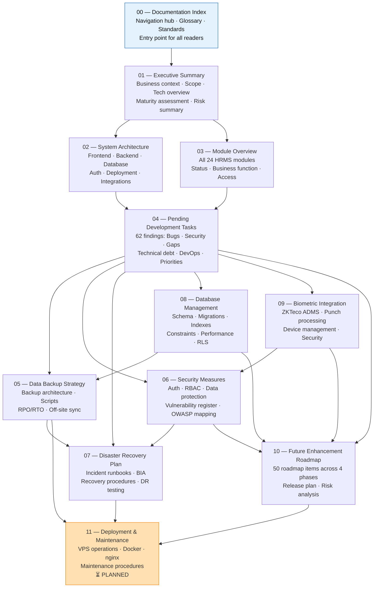
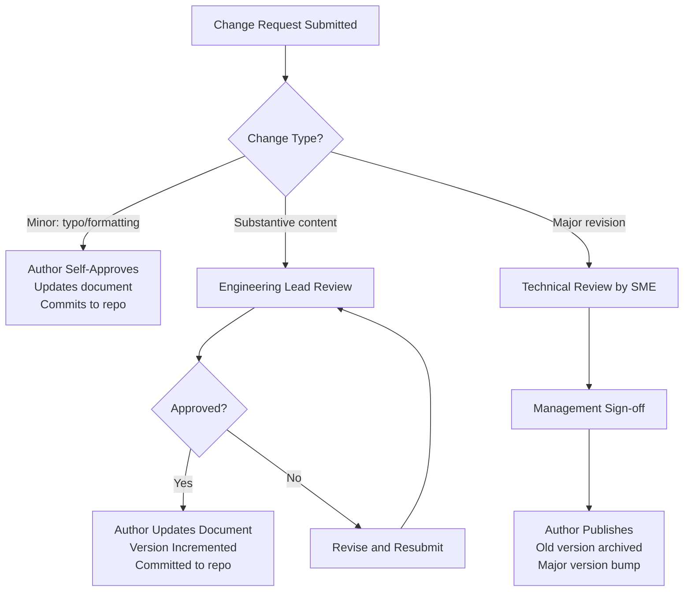

# 00 — Documentation Index
## Lumos Logic HRMS — Master Documentation Suite Index & Navigation Guide

---

**Document Version:** 1.0
**Prepared By:** Lumos Logic
**Date:** July 2026
**Classification:** Confidential — All Stakeholders
**Audience:** All — this is the entry point for every reader of this documentation suite
**Last Updated:** July 2026
**Review Frequency:** Quarterly
**Documentation Owner:** Lumos Logic Engineering Team

---

## Table of Contents

1. [Documentation Overview](#1-documentation-overview)
2. [Documentation Suite Overview](#2-documentation-suite-overview)
3. [Recommended Reading Order](#3-recommended-reading-order)
4. [Documentation Dependency Diagram](#4-documentation-dependency-diagram)
5. [Cross-Reference Matrix](#5-cross-reference-matrix)
6. [Audience Matrix](#6-audience-matrix)
7. [Documentation Lifecycle](#7-documentation-lifecycle)
8. [Version History](#8-version-history)
9. [Change Management](#9-change-management)
10. [Review Schedule](#10-review-schedule)
11. [Glossary](#11-glossary)
12. [Acronyms](#12-acronyms)
13. [Documentation Standards](#13-documentation-standards)
14. [Maintenance Responsibilities](#14-maintenance-responsibilities)
15. [Future Documentation](#15-future-documentation)
16. [Final Documentation Summary](#16-final-documentation-summary)

---

# 1. Documentation Overview

### 1.1 Purpose

This document is the **master entry point** for the Lumos Logic HRMS Implementation Documentation Suite. It serves as the navigation hub that allows every type of stakeholder — from a client business owner to a backend developer to a security auditor — to quickly locate the information relevant to their role and objective.

This index does not repeat the content of any other document. It describes, organizes, and cross-references the entire documentation suite.

### 1.2 Scope

This index covers the complete Lumos Logic HRMS documentation suite as of July 2026. The suite documents the production HRMS system deployed at `https://hrms.lumoslogic.com`, hosted on a Hostinger VPS (187.127.146.194), running on a React 18 + Express.js + PostgreSQL 17 + Docker stack.

The documentation suite covers:
- The HRMS as a product (what it does)
- The HRMS as a system (how it is built)
- The HRMS as an operation (how it is run and maintained)
- The HRMS as a roadmap (where it is going)

### 1.3 Documentation Philosophy

Every document in this suite adheres to three core principles:

| Principle | Description |
|---|---|
| **Ground truth only** | Every statement is derived from direct source code inspection, schema analysis, or confirmed deployment configuration. Nothing is assumed or generalized. |
| **Explicit about gaps** | Where functionality is absent, partial, or broken, this is stated directly. No document presents an idealized or future state as current reality. |
| **Audience-appropriate depth** | Each document is written for a primary audience. Technical depth is calibrated to the reader who needs the information most. |

### 1.4 Intended Usage

| Use Case | How to Use This Suite |
|---|---|
| **New stakeholder onboarding** | Read this index first, then follow the reading path for your role (Section 3) |
| **Incident response** | Navigate directly to Document 07 (Disaster Recovery) for step-by-step runbooks |
| **Security audit** | Start with Document 06 (Security) and cross-reference Document 04 for remediation tasks |
| **Development planning** | Start with Document 04 (Pending Tasks) and Document 10 (Roadmap) |
| **Client evaluation** | Read Document 01 (Executive Summary) and Document 03 (Module Overview) |
| **New developer onboarding** | Follow Section 3.5 (Developer reading path) |
| **Operational review** | Documents 05, 07, 08, and 11 form the operational reference set |

### 1.5 Document Properties

| Property | Value |
|---|---|
| **Suite Version** | 1.0 |
| **Publication Date** | July 2026 |
| **System Version Documented** | Lumos Logic HRMS v3.0 (multi-tenant, biometric-enabled) |
| **Documentation Owner** | Lumos Logic Engineering Team |
| **Classification** | Confidential — Internal and Client Distribution |
| **Review Frequency** | Quarterly (see Section 10) |
| **Total Documents** | 10 published + 1 planned |
| **Total Documented Findings** | 62 pending tasks, 20 security vulnerabilities, 18 Phase 1 roadmap items |

---

# 2. Documentation Suite Overview

The following table is the authoritative registry of every document in the Lumos Logic HRMS Implementation Documentation Suite.

| # | Document Name | File | Primary Purpose | Primary Audience | Status |
|---|---|---|---|---|---|
| **00** | Documentation Index | `00_Documentation_Index.md` | Master navigation hub; glossary; standards | All stakeholders | ✅ Published |
| **01** | Executive Summary | `01_Executive_Summary.md` | Business context, product scope, technology overview, maturity assessment | Client, Management, HR | ✅ Published |
| **02** | System Architecture Overview | `02_System_Architecture_Overview.md` | Full technical architecture: frontend, backend, database, auth, deployment, integrations | Developers, DevOps | ✅ Published |
| **03** | Module Overview | `03_Module_Overview.md` | Detailed breakdown of every HRMS module, its status, and its business function | All | ✅ Published |
| **04** | Pending Development Tasks | `04_Pending_Development_Tasks.md` | Complete gap analysis: 62 findings across bugs, security, functional gaps, technical debt, DevOps | Developers, QA, PM | ✅ Published |
| **05** | Data Backup Strategy | `05_Data_Backup_Strategy.md` | Backup architecture, procedures, schedules, RPO/RTO targets, off-site sync | DevOps, Operations | ✅ Published |
| **06** | Security Measures and Access Control | `06_Security_Measures_and_Access_Control.md` | Complete security architecture: authentication, RBAC, data protection, API security, vulnerability register, OWASP mapping | Security, Developers, DevOps | ✅ Published |
| **07** | Disaster Recovery Plan | `07_Disaster_Recovery_Plan.md` | Incident runbooks, BIA, disaster scenarios, recovery procedures, DR testing calendar | DevOps, Operations, Management | ✅ Published |
| **08** | Database Management Guidelines | `08_Database_Management_Guidelines.md` | Full schema reference, migration procedures, index strategy, performance tuning, constraints | DBA, Developers | ✅ Published |
| **09** | Biometric Integration | `09_Biometric_Integration.md` | ZKTeco ADMS integration architecture, device management, punch processing, troubleshooting | DevOps, Developers, HR Operations | ✅ Published |
| **10** | Future Enhancement Roadmap | `10_Future_Enhancement_Roadmap.md` | Prioritized 18-month roadmap: 50 items across 4 phases; release plan; risk analysis | Management, Developers, Product | ✅ Published |
| **11** | Deployment and Maintenance Procedures | `11_Deployment_and_Maintenance_Procedures.md` | Step-by-step VPS deployment, Docker operations, nginx management, maintenance runbooks | DevOps, System Administrators | ⏳ Planned |

> **Note:** Document 11 is referenced throughout this suite and is planned for publication in the next documentation cycle. Until then, operational procedures are covered in Document 07 (Disaster Recovery) and Document 05 (Backup).

---

# 3. Recommended Reading Order

Each reading path below is tailored to a specific role. Follow the numbered sequence for the most coherent understanding of the HRMS.

---

### 3.1 Client / Business Owner

> **Goal:** Understand what the HRMS does, what is included, and what the roadmap looks like.

| Step | Document | Why |
|:---:|---|---|
| 1 | `01_Executive_Summary.md` | Business context, scope, module summary, technology overview |
| 2 | `03_Module_Overview.md` | Understand exactly which features are available and on which plan |
| 3 | `10_Future_Enhancement_Roadmap.md` → Section 1 and 10 only | High-level vision and release calendar |

---

### 3.2 Management / Product Leadership

> **Goal:** Understand current maturity, key risks, and the prioritized investment roadmap.

| Step | Document | Why |
|:---:|---|---|
| 1 | `01_Executive_Summary.md` | System scope, maturity, key risks |
| 2 | `04_Pending_Development_Tasks.md` → Section 12 (Executive Summary) | 62-finding gap summary with priority matrix |
| 3 | `10_Future_Enhancement_Roadmap.md` | Full roadmap with effort, risk, and release plan |
| 4 | `06_Security_Measures_and_Access_Control.md` → Section 1 and 17 | Security maturity score and executive assessment |
| 5 | `07_Disaster_Recovery_Plan.md` → Section 1 and 2 | Business impact analysis and recovery objectives |

---

### 3.3 HR Administrator

> **Goal:** Understand the system's capabilities, what HR can configure, and what to expect from each module.

| Step | Document | Why |
|:---:|---|---|
| 1 | `01_Executive_Summary.md` | Overall system scope and role capabilities |
| 2 | `03_Module_Overview.md` | All modules relevant to HR operations |
| 3 | `09_Biometric_Integration.md` → Sections 4, 5, 11 | How to manage devices and handle attendance issues |
| 4 | `07_Disaster_Recovery_Plan.md` → Section 7 | Manual fallback procedures during system outages |

---

### 3.4 System Administrator / Root Admin

> **Goal:** Understand organization configuration, user management, feature flags, and operational procedures.

| Step | Document | Why |
|:---:|---|---|
| 1 | `01_Executive_Summary.md` | System scope and deployment summary |
| 2 | `03_Module_Overview.md` | Feature flag configuration, org settings |
| 3 | `06_Security_Measures_and_Access_Control.md` | Security controls, RBAC, operational responsibilities |
| 4 | `05_Data_Backup_Strategy.md` | Understand backup procedures and restore testing |
| 5 | `07_Disaster_Recovery_Plan.md` | Incident response and recovery procedures |
| 6 | `09_Biometric_Integration.md` | Device management and troubleshooting |
| 7 | `11_Deployment_and_Maintenance_Procedures.md` *(planned)* | Day-to-day operational maintenance |

---

### 3.5 Developer (Full-Stack / General)

> **Goal:** Understand the full system — architecture, modules, technical debt, and contribution guidelines.

| Step | Document | Why |
|:---:|---|---|
| 1 | `01_Executive_Summary.md` | System scope, technology stack, architecture summary |
| 2 | `02_System_Architecture_Overview.md` | Complete technical architecture; request lifecycle; folder structure |
| 3 | `03_Module_Overview.md` | Every module, its routes, and its status |
| 4 | `04_Pending_Development_Tasks.md` | All known gaps, bugs, and technical debt with recommendations |
| 5 | `08_Database_Management_Guidelines.md` | Schema reference, migration procedures, adapter usage |
| 6 | `06_Security_Measures_and_Access_Control.md` | Security architecture and implementation guidelines |
| 7 | `10_Future_Enhancement_Roadmap.md` | What to build next and in what order |

---

### 3.6 Backend Developer

> **Goal:** Deep technical understanding of the API, database, middleware chain, and services.

| Step | Document | Why |
|:---:|---|---|
| 1 | `02_System_Architecture_Overview.md` → Sections 5, 6, 7, 8 | Backend architecture, middleware chain, DB adapter, request lifecycle |
| 2 | `08_Database_Management_Guidelines.md` | Schema, indexes, migration process, constraints |
| 3 | `04_Pending_Development_Tasks.md` | Backend improvements, functional gaps, security tasks |
| 4 | `06_Security_Measures_and_Access_Control.md` | Auth middleware, RBAC middleware, security vulnerability list |
| 5 | `09_Biometric_Integration.md` → Sections 2, 5, 6 | ADMS handler, punch processing, attendance creation logic |
| 6 | `10_Future_Enhancement_Roadmap.md` → Section 4.1 | Backend improvement roadmap items |

---

### 3.7 Frontend Developer

> **Goal:** Understand the React SPA architecture, routing, context system, and UI gaps.

| Step | Document | Why |
|:---:|---|---|
| 1 | `02_System_Architecture_Overview.md` → Section 4 | Frontend architecture, routing, state management, API client |
| 2 | `03_Module_Overview.md` | Which pages exist and their functional status |
| 3 | `04_Pending_Development_Tasks.md` → Sections 4, 8 | UI/UX improvements, frontend improvements |
| 4 | `10_Future_Enhancement_Roadmap.md` → Section 4.2 | Frontend improvement roadmap |
| 5 | `06_Security_Measures_and_Access_Control.md` → Section 8 | CORS, CSP, security headers affecting frontend |

---

### 3.8 QA Engineer

> **Goal:** Understand what is implemented, what is broken, and what needs testing.

| Step | Document | Why |
|:---:|---|---|
| 1 | `03_Module_Overview.md` | What each module does and its current implementation status |
| 2 | `04_Pending_Development_Tasks.md` | All 62 findings — the primary QA test planning document |
| 3 | `02_System_Architecture_Overview.md` → Sections 7, 8, 9 | Auth flows and module interaction sequences for test case design |
| 4 | `06_Security_Measures_and_Access_Control.md` | Security test scenarios; vulnerability register to test against |
| 5 | `09_Biometric_Integration.md` → Appendix D (Troubleshooting Matrix) | Biometric test scenarios and expected behaviors |
| 6 | `10_Future_Enhancement_Roadmap.md` → Section 10 | Release plan — what each version should have before release |

---

### 3.9 DevOps Engineer

> **Goal:** Understand deployment architecture, backup procedures, monitoring requirements, and infrastructure roadmap.

| Step | Document | Why |
|:---:|---|---|
| 1 | `02_System_Architecture_Overview.md` → Sections 11, 12 | Deployment topology, Docker structure, port configuration |
| 2 | `05_Data_Backup_Strategy.md` | Complete backup implementation guide |
| 3 | `07_Disaster_Recovery_Plan.md` | Incident runbooks, disaster scenarios, recovery procedures |
| 4 | `04_Pending_Development_Tasks.md` → Section 9 | DevOps improvement tasks |
| 5 | `06_Security_Measures_and_Access_Control.md` → Section 2 | Infrastructure security, nginx configuration, biometric endpoint |
| 6 | `09_Biometric_Integration.md` → Section 10 | Biometric endpoint security requirements |
| 7 | `10_Future_Enhancement_Roadmap.md` → Sections 4.5, 4.6, 8 | Infrastructure and DevOps roadmap |
| 8 | `11_Deployment_and_Maintenance_Procedures.md` *(planned)* | Step-by-step operational procedures |

---

### 3.10 Security Auditor

> **Goal:** Assess the security posture of the system comprehensively.

| Step | Document | Why |
|:---:|---|---|
| 1 | `06_Security_Measures_and_Access_Control.md` | Complete security architecture — the primary security document |
| 2 | `02_System_Architecture_Overview.md` → Sections 7, 14, 15 | Auth architecture, known limitations, risk register |
| 3 | `04_Pending_Development_Tasks.md` → Sections 1, 2 | Critical issues and security improvement tasks |
| 4 | `08_Database_Management_Guidelines.md` → Sections on RLS and encryption | Database-level security controls |
| 5 | `09_Biometric_Integration.md` → Section 10 | Biometric endpoint security assessment |
| 6 | `10_Future_Enhancement_Roadmap.md` → Section 7 | Prioritized security remediation roadmap |

---

### 3.11 Database Administrator

> **Goal:** Understand the schema, migration process, indexing strategy, and database health procedures.

| Step | Document | Why |
|:---:|---|---|
| 1 | `08_Database_Management_Guidelines.md` | Complete DBA reference — schema, migrations, indexes, backup, performance |
| 2 | `02_System_Architecture_Overview.md` → Section 6 | Database architecture, multi-tenancy model, adapter behavior |
| 3 | `05_Data_Backup_Strategy.md` | Backup and restore procedures; pg_dump usage |
| 4 | `04_Pending_Development_Tasks.md` → Section 6 | Database improvement tasks |
| 5 | `06_Security_Measures_and_Access_Control.md` → Section 10 | SQL injection protection, RLS status, single DB user risk |
| 6 | `09_Biometric_Integration.md` → Section 7 | Biometric table schema and archiving strategy |

---

# 4. Documentation Dependency Diagram

The diagram below shows how documents in this suite relate to one another — which documents provide context for others, and which are downstream consumers of information from others.

### Document Dependency Summary

| Document | Depends On | Consumed By |
|---|---|---|
| 00 — Index | All documents | — (entry point) |
| 01 — Executive Summary | None | 02, 03, 10 |
| 02 — Architecture | 01 | 04, 06, 08, 09, 11 |
| 03 — Module Overview | 01, 02 | 04, 06, 10 |
| 04 — Pending Tasks | 02, 03 | 05, 06, 07, 08, 09, 10 |
| 05 — Backup | 04, 08 | 07, 11 |
| 06 — Security | 02, 04, 09 | 07, 10 |
| 07 — Disaster Recovery | 04, 05, 06 | 11 |
| 08 — Database | 02, 04 | 05, 10 |
| 09 — Biometric | 02, 04, 06 | 10 |
| 10 — Roadmap | 04, 06, 07, 08, 09 | 11 |
| 11 — Deployment *(planned)* | 05, 07, 10 | — |

---

# 5. Cross-Reference Matrix

The table below maps which documents contain explicit references to other documents. A ● indicates that the row document references the column document.

| | D01 | D02 | D03 | D04 | D05 | D06 | D07 | D08 | D09 | D10 | D11 |
|---|:---:|:---:|:---:|:---:|:---:|:---:|:---:|:---:|:---:|:---:|:---:|
| **D01 — Executive Summary** | — | ● | ● | ● | ● | ● | ● | ● | ● | ● | ● |
| **D02 — Architecture** | ● | — | ● | — | — | ● | — | ● | ● | — | ● |
| **D03 — Module Overview** | ● | ● | — | ● | — | ● | — | — | ● | ● | — |
| **D04 — Pending Tasks** | — | ● | ● | — | — | ● | — | ● | ● | — | ● |
| **D05 — Backup** | — | — | — | — | — | — | ● | ● | — | — | — |
| **D06 — Security** | — | ● | ● | ● | ● | — | ● | ● | ● | — | — |
| **D07 — Disaster Recovery** | — | — | — | — | ● | ● | — | — | ● | — | — |
| **D08 — Database** | — | ● | — | ● | ● | ● | — | — | ● | — | — |
| **D09 — Biometric** | — | ● | — | — | — | ● | — | ● | — | — | — |
| **D10 — Roadmap** | ● | ● | ● | ● | ● | ● | ● | ● | ● | — | — |
| **D11 — Deployment** *(planned)* | — | ● | — | — | ● | ● | ● | — | ● | ● | — |

---

# 6. Audience Matrix

The table below indicates which documents are **essential (●)**, **recommended (○)**, or **optional (–)** for each audience.

| Document | Client | Mgmt | HR Admin | Backend Dev | Frontend Dev | QA | DevOps | Security | DBA | Operations |
|---|:---:|:---:|:---:|:---:|:---:|:---:|:---:|:---:|:---:|:---:|
| 00 — Index | ● | ● | ● | ● | ● | ● | ● | ● | ● | ● |
| 01 — Executive Summary | ● | ● | ● | ○ | ○ | ○ | ○ | ○ | — | ○ |
| 02 — Architecture | — | ○ | — | ● | ● | ○ | ● | ● | ● | ○ |
| 03 — Module Overview | ● | ● | ● | ● | ● | ● | ○ | ○ | — | ○ |
| 04 — Pending Tasks | — | ● | — | ● | ● | ● | ● | ● | ● | ○ |
| 05 — Backup | — | ○ | — | — | — | — | ● | ○ | ● | ● |
| 06 — Security | — | ● | — | ● | ● | ● | ● | ● | ● | ● |
| 07 — Disaster Recovery | — | ● | ○ | — | — | — | ● | ○ | ○ | ● |
| 08 — Database | — | — | — | ● | — | ○ | ○ | ● | ● | — |
| 09 — Biometric | — | ○ | ● | ● | — | ● | ● | ● | ○ | ● |
| 10 — Roadmap | ○ | ● | ○ | ● | ● | ● | ● | ○ | ○ | — |
| 11 — Deployment *(planned)* | — | — | — | ○ | — | — | ● | ○ | — | ● |

**Legend:** ● Essential | ○ Recommended | — Not required

---

# 7. Documentation Lifecycle

### 7.1 Creation

New documents are created when:
- A new major system component is implemented (e.g., a new integration, a new module)
- A formal review identifies a documentation gap
- A client request requires dedicated coverage of a topic not addressed elsewhere
- A new release (v1.2, v2.0, etc.) introduces changes significant enough to require standalone documentation

**Creation process:**
1. Engineering lead identifies the documentation need and assigns an author
2. Author drafts the document following the standards in Section 13
3. Draft undergoes technical review by a subject matter expert
4. Draft undergoes editorial review for clarity and consistency
5. Document is approved and published to `docs/implementation/`

### 7.2 Review

Every published document is reviewed on the schedule defined in Section 10. Reviews check:
- Whether described implementations still match the actual codebase
- Whether new gaps or risks have emerged that the document should reflect
- Whether cross-references to other documents remain accurate
- Whether the stated maturity grades and risk assessments are still valid

### 7.3 Approval

Document changes require approval from:
- **Minor updates** (typos, formatting, adding a new cross-reference): Author self-approval
- **Substantive content changes** (findings updated, new gaps identified, architecture changed): Engineering lead review and approval
- **Major revision** (document significantly restructured, findings invalidated by code changes): Full technical review + management sign-off

### 7.4 Updates

Updates to a document should be made when:
- A finding listed as a gap has been resolved
- A new bug, security vulnerability, or technical debt item is discovered
- The codebase changes in a way that contradicts the documented behavior
- A deployment or infrastructure change affects the documented architecture

Updates should not be deferred. A document that describes a fixed bug as open, or a live risk as resolved, is actively misleading. Maintain accuracy in real time.

### 7.5 Versioning

Each document carries an internal version number in its header (e.g., `Document Version: 1.0`). Version increments follow:

| Change Type | Version Increment | Example |
|---|---|---|
| Typos, formatting only | None | 1.0 → 1.0 |
| Minor content update | Patch | 1.0 → 1.0.1 |
| New finding or section added | Minor | 1.0 → 1.1 |
| Major restructure or significant factual revision | Major | 1.0 → 2.0 |

### 7.6 Archiving

When a document is superseded by a major revision, the previous version is archived in `docs/implementation/archive/` with the filename format: `{document_number}_{document_name}_v{version}_{date}.md`. Archived documents are retained for a minimum of 2 years.

---

# 8. Version History

The table below tracks the publication and revision history of this documentation suite. Each document's internal version history is maintained within that document.

| Suite Version | Date | Author | Reviewer | Changes | Approval |
|---|---|---|---|---|---|
| 1.0 | July 2026 | Lumos Logic Engineering | — | Initial publication of the complete 10-document suite (Documents 00–10) | Pending |
| — | — | — | — | *Template row for future entries* | — |

**Individual Document Version Template:**

| Version | Date | Author | Reviewer | Summary of Changes | Approved By |
|---|---|---|---|---|---|
| 1.0 | YYYY-MM-DD | Name | Name | Initial publication | Name |
| 1.1 | YYYY-MM-DD | Name | Name | [Brief description of change] | Name |
| 2.0 | YYYY-MM-DD | Name | Name | [Major revision rationale] | Name |

---

# 9. Change Management

### 9.1 How to Request a Documentation Change

Documentation change requests may be submitted by any stakeholder via:

1. **Development team:** Raise a change request in the project's issue tracker, labeling it `docs-update`; include the document number, section, and description of what is incorrect or missing
2. **HR or Operations team:** Contact the engineering lead directly with the specific document name, section, and the correction needed
3. **Security or Compliance team:** Security-related documentation changes should be flagged as high-priority; include the vulnerability or compliance requirement driving the change
4. **Client:** Submit through the standard support channel; Lumos Logic internal team will assess and action

### 9.2 Approval Workflow

### 9.3 Review Process

All substantive changes follow a two-stage review:

**Stage 1 — Technical accuracy review:** A subject matter expert for the affected domain (backend developer for architecture changes, DevOps for infrastructure changes, security team for security changes) confirms that the documented information accurately reflects the current system state.

**Stage 2 — Editorial review:** A second reader reviews the change for clarity, consistency with other documents, and adherence to documentation standards (Section 13).

### 9.4 Publication Process

After approval:
1. Author makes changes in a dedicated git branch named `docs/{document-number}-{brief-description}`
2. Pull request is created; reviewer approves
3. Merged to main branch; document is live in `docs/implementation/`
4. If the change resolves a finding listed in another document, the cross-reference is updated in the same PR
5. The Version History table in the affected document(s) and this index are updated

---

# 10. Review Schedule

### 10.1 Weekly Review (Every Monday)

**Responsible:** Engineering Lead
**Scope:** Document 04 (Pending Development Tasks) only

- Check if any findings from the Priority Matrix (Section 13) have been resolved since last week
- Mark resolved findings with their resolution date
- Add any new findings discovered during the week
- Update the Sprint Breakdown if sprint priorities have changed

### 10.2 Monthly Review (First week of each month)

**Responsible:** Engineering Lead + One Developer

| Document | What to Check |
|---|---|
| 06 — Security | Has any Critical or High vulnerability been resolved? Any new vulnerability discovered? |
| 07 — Disaster Recovery | Did any infrastructure change affect recovery procedures? |
| 08 — Database | Were any migrations applied? Are new indexes or constraints needed? |
| 09 — Biometric | Any new devices added? Any change to device configuration? |

### 10.3 Quarterly Review (January, April, July, October)

**Responsible:** Engineering Lead + Management + Security Lead

Full review of the entire documentation suite:

- **Documents 01–03:** Update feature status, maturity grades, and technology version numbers if changed
- **Document 04:** Reassess all open findings; close resolved items; re-score project health
- **Documents 05, 07:** Verify backup procedures are still current; confirm DR drill has been run this quarter
- **Document 06:** Update security maturity scores based on resolved vulnerabilities; re-run OWASP mapping check
- **Documents 08, 09:** Confirm schema and biometric architecture still match codebase
- **Document 10:** Update roadmap progress — which Phase 1/2 items have been completed? Adjust timelines

### 10.4 Annual Review (July each year)

**Responsible:** All stakeholders (documentation owner coordinates)

- Commission an external security review and update Document 06 with findings
- Run the annual DR simulation (per Document 07 Appendix E) and record results
- Update the product maturity assessment in Document 01
- Assess whether Document 11 (Deployment Procedures) needs to be created or has been published
- Evaluate whether the documentation suite scope needs expansion (new modules, new integrations)
- Archive previous major version of the suite

### 10.5 Review Responsibilities Summary

| Stakeholder | Weekly | Monthly | Quarterly | Annual |
|---|:---:|:---:|:---:|:---:|
| Engineering Lead | ● | ● | ● | ● |
| Backend Developer | — | ○ | ● | ○ |
| DevOps Engineer | — | ● | ● | ● |
| Security Lead | — | ○ | ● | ● |
| HR Administrator | — | — | ○ | ○ |
| Management | — | — | ● | ● |

---

# 11. Glossary

This glossary defines every major term used across the Lumos Logic HRMS documentation suite. Terms are listed alphabetically. For implementation specifics of any term, follow the document reference.

---

**ADMS (Attendance Data Management System)**
The HTTP-based push protocol used by ZKTeco biometric devices to send punch data to the server. Devices make outbound HTTP POST requests to `/iclock/cdata` carrying attendance punch records. See Document 09.

**Admin (HR Admin)**
A user role within an organization with privileges to manage employees, approve leaves, manage attendance, generate payslips, and access all HR operations. Below `root_admin` in the hierarchy; above `employee`. See Document 02, Section 7.

**Announcement**
An organization-wide or targeted message published by HR Admins or Root Admins, optionally with file attachments. Stored in the `announcements` table. See Document 03.

**Archives Table**
A generic soft-delete and audit table (`archives`) used to preserve deleted records before hard deletion. Not consistently used across all modules — see Document 04 finding F-041.

**Asset (IT Asset)**
Physical or digital organizational resources (laptops, monitors, software licenses) tracked in the `assets` table. Assigned to employees with assignment and return records. Platinum plan only.

**Attendance**
A record in the `attendance` table representing one employee's presence or absence on a specific date. Fields include: check-in, check-out, break tracking, work hours, late/early flags, and biometric source indicator.

**Attendance Regularization**
A request submitted by an employee to correct an incorrect or incomplete attendance record (e.g., missed check-in). Requires HR Admin approval. See Document 03.

**bcrypt**
The password hashing algorithm used by the HRMS. Uses cost factor 10. Passwords are never stored in plain text. See Document 06, Section 7.

**Biometric Device**
A ZKTeco hardware device that reads employee fingerprint or face data and sends punch records to the server via the ADMS protocol. Each device has a serial number and is registered in the `biometric_devices` table. See Document 09.

**biometric_employee_map**
The database table linking a biometric device's `employee_pin` to a HRMS user's `user_id`. Without a mapping, biometric punches cannot be attributed to an employee. See Document 09.

**biometric_raw_logs**
The append-only database table storing every punch received from biometric devices. Records are flagged `processed = true` when converted to attendance records. See Document 09.

**Branch**
A physical office location belonging to an organization. Branches can be assigned to employees and biometric devices to enable location-based attendance management. Platinum plan only. See Document 03.

**Break Tracking**
The recording of break start and end times during a workday. Stored in `attendance.break_start` / `break_end`. Only one break session per day is supported in the current implementation — see Document 04 finding F-018.

**Check-in / Check-out**
The actions of recording the start and end of a workday. Can be performed manually via the web portal or automatically via biometric device punch. See Documents 02, 03, 09.

**Cloudinary**
The third-party cloud CDN service used for all binary file storage — employee avatars, documents, expense receipts, announcement attachments, and government ID scans. Files are never stored on the VPS disk. See Document 02, Section 10.

**CORS (Cross-Origin Resource Sharing)**
HTTP headers that control which external domains can make API requests to the HRMS backend. The HRMS uses an explicit allowlist rather than a wildcard. See Document 06, Section 8.3.

**Cron Job**
A scheduled background task. The HRMS has one cron job — a daily 08:00 IST notification job — currently implemented as a JavaScript `setTimeout` loop, which is lost on server restart. See Document 02, Section 8.9 and Document 04 finding F-042.

**db-pg-adapter.js**
The custom Supabase-compatible query builder that wraps the PostgreSQL `pg` library. Provides a chaining API (`.from().select().eq()`) that translates to parameterized SQL. See Document 02, Section 5.5.

**Department**
An organizational unit (e.g., Finance, HR, Engineering). Employees can belong to multiple departments via the `user_departments` junction table. See Document 03.

**Designation**
An employee's job title or position (e.g., "Senior Engineer"). Stored as a reference in the `designations` table. See Document 03.

**Docker**
The containerization platform used to package and run the HRMS. The application runs as two containers (`lumos_app` and `lumos_postgres`) managed by Docker Compose. See Document 02, Section 11.

**Docker Compose**
The orchestration tool used to define and run the two HRMS containers. The `docker-compose.yml` file defines the app container, the PostgreSQL container, their volumes, and the Docker network. See Document 02.

**Employee**
A user with the `employee` role. Has access to the self-service Employee Portal (`/portal/*`). Can view own attendance, apply for leave, view own payslips and documents, and manage own profile sections. See Document 02, Section 7.

**Employee Portal**
The employee-facing web interface accessible at `/portal/*`. Separate from the HR Admin dashboard. See Document 03.

**Employee Profile V2**
The comprehensive 16-section employee profile system introduced as part of the HRMS migration. Includes personal info, qualifications, experience, family, emergency contacts, banking, nominees, government documents, immigration, statutory, health, training, certifications, and skills. See Document 03.

**`employee_status`**
A field on the `users` table indicating whether an employee is `active` or `inactive`. Deactivating an employee does not currently invalidate their existing JWT — see Document 04 finding F-016.

**Exit Management**
The module managing employee resignation, last working day tracking, exit clearance, and offboarding. Employee self-submission is currently broken due to a middleware misconfiguration — see Document 04 finding F-003. Platinum plan only.

**Expense**
A reimbursement claim submitted by an employee for work-related costs. Includes receipt upload and HR approval workflow. Platinum plan only.

**Feature Flag**
A per-organization configuration value stored in the `organization_features` table. Controls which HRMS modules are accessible for each organization, enforced at both backend middleware (`featureGate`) and frontend (`FeatureRoute` wrapper). See Document 02, Section 6.

**`featureGate` Middleware**
An Express middleware that runs on all `/api/*` routes and checks whether the requested feature is enabled for the authenticated user's organization before allowing the request to proceed. See Document 02, Section 5.3.

**Force Password Change**
A flag (`force_password_change = true`) set on new employee accounts. On first login, the employee is redirected to a mandatory password change screen before accessing the portal. See Document 06, Section 3.4.

**GDPR Data Rights**
Functionality supporting employees' right to data portability (export) and deletion requests, as required by GDPR. The HRMS implements a data export endpoint and a deletion request email — though actual automated deletion is not yet implemented. See Document 06, Section 3.7.

**Google Calendar Integration**
An optional integration where leave approvals, holidays, and company events are synchronized to a shared Google Calendar. Uses a Google Service Account for authentication. See Document 02, Section 10.

**Gross Hours**
The total elapsed time between check-in and check-out for a workday, before deducting break time. Stored as `gross_hours` in the attendance table.

**Holiday**
A non-working day defined per organization in the `holidays` table. Holidays are synced to Google Calendar when the integration is active. See Document 03.

**HR Admin (admin role)**
See **Admin (HR Admin)**.

**IST (India Standard Time)**
The timezone hardcoded across all HRMS date/time operations. UTC+5:30. All date arithmetic assumes IST. Multi-timezone support is not currently implemented. See Document 02, Section 2.1.

**JWT (JSON Web Token)**
The stateless authentication mechanism used by the HRMS. A signed token encoding the user's identity, role, and organization context. Issued on login; valid for 7 days. Stored in browser `localStorage`. See Document 06, Section 3.

**JWT Revocation**
The ability to invalidate an issued JWT before its natural expiry. Currently not implemented — tokens remain valid for up to 7 days regardless of logout, deactivation, or password change. See Document 04 finding F-006.

**Late Threshold**
The time after which a check-in is considered late. Defined per organization in `work_schedule.late_threshold`. From biometric attendance, this is currently not applied — see Document 09.

**Leave**
An approved absence from work. Leave types include: casual, sick, earned, maternity, paternity, loss of pay, and others. The lifecycle is: applied → pending → approved/rejected. See Document 03.

**Leave Balance**
The number of days remaining for a given leave type for an employee. Calculated on-the-fly from approved leaves against the annual quota. Year-end carry-forward is not yet automated — see Document 04 finding F-019.

**Leave Policy**
Organization-specific rules governing a leave type: minimum notice days, maximum consecutive days, carry-forward settings, document requirements. Stored in `leave_policies` but not yet enforced in application code — see Document 04 finding F-011.

**Login History**
A table (`login_history`) recording successful authentication events including IP address and user agent. Failed login attempts are not currently recorded — see Document 04 finding F-010 (corrected: F-009 in Doc 06).

**LOP (Loss of Pay)**
An attendance status for days where an employee was absent without approved leave, resulting in salary deduction. LOP deduction must currently be entered manually in payroll — auto-calculation is a planned enhancement. See Document 04 finding F-012.

**Migration (Database)**
A SQL script that makes a change to the database schema (adding columns, creating tables, adding indexes). The HRMS has 25 migration files applied manually via `psql`. No migration versioning tool is currently in use. See Document 08.

**Multi-Tenancy**
The architectural design allowing multiple independent organizations to use the same HRMS deployment with complete data isolation. Each organization's data is separated by `organization_id` filtering on every database query. See Document 02, Section 6.3.

**nginx**
The reverse proxy server running on the VPS that handles SSL termination (HTTPS), HTTP-to-HTTPS redirection, and proxying of requests to the Express application container. See Document 02, Section 11.

**Node.js**
The JavaScript runtime powering the HRMS backend. Version 20 LTS. See Document 01.

**Notifications**
In-app notifications stored in the `notifications` table, displayed in the notification center. Separate from browser push notifications. See Document 03.

**Onboarding Checklist**
A set of tasks for a new employee, assigned to the employee, HR, IT, and manager. Currently uses hardcoded default tasks — customizable templates are a planned feature. Platinum plan only. See Document 04 finding F-021.

**Organization**
A tenant on the Lumos Logic HRMS platform. Each organization has its own employees, configuration, feature flags, and data. Organizations are approved by the Platform Admin before activation. See Document 02.

**Organization Isolation**
The guarantee that one organization's data cannot be accessed by another organization's users. Enforced at the application layer via `organization_id` filtering. Database-level RLS is currently disabled. See Document 06, Section 10.

**`organization_id`**
The foreign key column present on every business table in the HRMS schema. Used to scope all database queries to the authenticated user's organization. See Document 02, Section 6.3.

**OT (Overtime)**
Hours worked beyond the standard working day. Tracked via the `ot_hours` column in the `attendance` table. From biometric attendance, OT hours are not currently auto-calculated — see Document 09.

**Password History**
The last 5 bcrypt-hashed passwords stored for each user. Password reuse within the last 5 passwords is rejected. Stored as a JSONB array in `users.password_history`. See Document 06, Section 3.4.

**Payroll**
The module covering salary structure management, monthly payslip generation, LOP deduction, and statutory component calculation. The HRMS generates payslips but does not initiate bank transfers. See Document 03.

**Payslip**
A monthly salary statement generated per employee. Includes gross salary, deductions (LOP, PF, ESI), and net pay. Stored as a record in the `payslips` table with Cloudinary-hosted PDF. See Document 03.

**Performance Management**
The HRMS module for goal setting and performance reviews. Currently in early (stub) implementation — employee self-assessment is blocked by a middleware bug. See Document 04 findings F-003 and F-004.

**PII (Personally Identifiable Information)**
Sensitive employee data including Aadhar number, PAN number, bank account details, and UAN. Currently stored as plain text in the database — encryption is a critical planned enhancement. See Document 06, Section 7.3.

**Platform Admin**
The highest privilege level in the HRMS, managed by Lumos Logic internally. Platform Admins approve new organization registrations, manage feature flags, and assign subscription plans. Stored in a separate `platform_admins` table. See Document 02, Section 7.

**Plan (Subscription Plan)**
The service tier for an organization: Free, Gold, or Platinum. Each plan unlocks a specific set of HRMS modules via the feature flag system. See Document 01.

**PostgreSQL**
The primary relational database used by the HRMS. Version 17 (Alpine), running in a Docker container. All application data is stored here. See Document 02.

**pg Pool (Connection Pool)**
The `pg.Pool` connection pool managing up to 20 concurrent PostgreSQL connections. Configuration: 30s idle timeout, 5s connection timeout, 30s statement timeout. See Document 02, Section 5.6.

**Push Notification**
A browser-based notification sent via the Web Push API using VAPID keys. Used for birthday reminders and holiday notifications. Requires employee subscription. Platinum plan only. See Document 03.

**RBAC (Role-Based Access Control)**
The access control system assigning each user a role (`employee`, `admin`, `root_admin`, `platform_admin`) and enforcing permissions based on that role. See Document 06, Section 5.

**Regularization**
See **Attendance Regularization**.

**Root Admin**
The organization owner role. Has full control over one organization — can manage HR Admins, configure org settings, manage billing, and access all modules. See Document 02, Section 7.

**RLS (Row-Level Security)**
A PostgreSQL feature that enforces data access policies at the database level. Currently explicitly disabled on all HRMS tables — all data isolation is application-level only. See Document 06, Section 10.3.

**Roster**
The assignment of shifts to employees for specific dates. Managed in the `shift_assignments` table. See Document 03.

**Shift**
A named work schedule defining start time, end time, and applicable days (e.g., Day Shift 09:00–18:00, Night Shift 22:00–06:00). Defined in the `shifts` table. See Document 03.

**SPA (Single Page Application)**
The React frontend architecture where the entire UI is served as a single HTML file and navigation is handled client-side. The HRMS serves the React SPA as static files from the Express backend. See Document 02, Section 4.

**TOTP (Time-Based One-Time Password)**
The two-factor authentication method implemented in the HRMS. Generates 6-digit codes valid for 30 seconds, compatible with Google Authenticator and Authy. See Document 06, Section 4.

**Transaction (Database)**
A group of SQL operations that execute atomically — either all succeed or all are rolled back. The HRMS db-pg-adapter does not currently support transactions — a planned enhancement. See Document 04 finding P2-05 in Doc 10.

**VPS (Virtual Private Server)**
The physical hosting environment. The HRMS runs on a Hostinger VPS at IP 187.127.146.194. See Document 02, Section 11.

**VAPID (Voluntary Application Server Identification)**
The cryptographic key pair used to authenticate the HRMS as the sender of Web Push notifications. Keys are configured per-organization but currently all organizations use the platform-level keys. See Document 04 finding F-014.

**Work Schedule**
Per-organization configuration of working days, standard hours, check-in/out windows, and late/early thresholds. Stored in the `work_schedule` table. See Document 03.

**WFH (Work From Home)**
A leave/attendance status recorded when an employee is working from home rather than the office. Separated from the leave system in the July 2026 migration. See Document 03.

**ZKTeco**
The brand of biometric hardware devices used for fingerprint/face-based attendance. Communicates with the HRMS via the ADMS HTTP push protocol. See Document 09.

---

# 12. Acronyms

| Acronym | Expanded Form |
|---|---|
| **ADMS** | Attendance Data Management System (ZKTeco push protocol) |
| **AES** | Advanced Encryption Standard |
| **API** | Application Programming Interface |
| **BIA** | Business Impact Analysis |
| **CDN** | Content Delivery Network |
| **CI/CD** | Continuous Integration / Continuous Deployment |
| **CORS** | Cross-Origin Resource Sharing |
| **CSP** | Content Security Policy |
| **CSV** | Comma-Separated Values |
| **DB** | Database |
| **DBA** | Database Administrator |
| **DPDP** | Digital Personal Data Protection (Act 2023, India) |
| **DR** | Disaster Recovery |
| **ESI** | Employees' State Insurance |
| **ESIC** | Employees' State Insurance Corporation |
| **EPFO** | Employees' Provident Fund Organisation |
| **GCM** | Galois/Counter Mode (AES encryption mode) |
| **GDPR** | General Data Protection Regulation |
| **HA** | High Availability |
| **HMAC** | Hash-based Message Authentication Code |
| **HR** | Human Resources |
| **HRMS** | Human Resource Management System |
| **HTTP** | HyperText Transfer Protocol |
| **HTTPS** | HyperText Transfer Protocol Secure |
| **IFSC** | Indian Financial System Code |
| **IP** | Internet Protocol |
| **IST** | India Standard Time (UTC+5:30) |
| **IT** | Information Technology |
| **JWT** | JSON Web Token |
| **LMS** | Learning Management System |
| **LOP** | Loss of Pay |
| **MIME** | Multipurpose Internet Mail Extensions |
| **OT** | Overtime |
| **OTP** | One-Time Password |
| **OWASP** | Open Web Application Security Project |
| **PAN** | Permanent Account Number (Indian income tax ID) |
| **PDF** | Portable Document Format |
| **PF** | Provident Fund |
| **PII** | Personally Identifiable Information |
| **PM** | Project Manager |
| **PNG** | Portable Network Graphics |
| **PWA** | Progressive Web Application |
| **QA** | Quality Assurance |
| **RBAC** | Role-Based Access Control |
| **RFC** | Request for Comments (Internet standards) |
| **RLS** | Row-Level Security |
| **RPO** | Recovery Point Objective |
| **REST** | Representational State Transfer |
| **RTO** | Recovery Time Objective |
| **SaaS** | Software as a Service |
| **SIEM** | Security Information and Event Management |
| **SLA** | Service Level Agreement |
| **SMTP** | Simple Mail Transfer Protocol |
| **SPA** | Single Page Application |
| **SQL** | Structured Query Language |
| **SSH** | Secure Shell |
| **SSL** | Secure Sockets Layer |
| **TLS** | Transport Layer Security |
| **TOTP** | Time-Based One-Time Password |
| **TZ** | Timezone |
| **UAN** | Universal Account Number (EPFO) |
| **UI** | User Interface |
| **URL** | Uniform Resource Locator |
| **VAPID** | Voluntary Application Server Identification |
| **VPS** | Virtual Private Server |
| **WAF** | Web Application Firewall |
| **WFH** | Work From Home |
| **XSS** | Cross-Site Scripting |

---

# 13. Documentation Standards

All documents in this suite follow these standards to ensure consistency, readability, and maintainability.

### 13.1 Writing Standards

| Standard | Rule |
|---|---|
| **Voice** | Active voice preferred. "The middleware verifies the token" not "The token is verified by the middleware." |
| **Tense** | Present tense for current state. Future tense for planned functionality. |
| **Accuracy over completeness** | Never speculate. If a behavior is not confirmed by code or configuration, do not document it as fact. Mark unknowns explicitly. |
| **Gaps must be named** | If a feature is broken, partial, or missing, say so directly. Phrases like "fully functional except for X" or "works as expected" must be substantiated. |
| **Length** | As long as necessary, as short as possible. No padding. |
| **Person** | Avoid first-person ("I"). Use "the system," "the developer," "the HR Admin," etc. |

### 13.2 Markdown Standards

| Element | Standard |
|---|---|
| **Headings** | H1 for document title; H2 for major sections; H3 for subsections; H4 for granular sub-topics |
| **Tables** | Use tables for comparative information, property lists, and reference data |
| **Bold** | Use `**bold**` for emphasis on key terms, not for decorative emphasis |
| **Inline code** | Use `` `backtick` `` for all file paths, table names, column names, route paths, function names, and environment variable names |
| **Code blocks** | Use triple-backtick fenced code blocks with a language identifier (`js`, `sql`, `bash`, `mermaid`) |
| **Lists** | Use bullet lists for unordered items; numbered lists only for sequential steps |
| **Horizontal rules** | Use `---` to separate major sections within a document |
| **Line length** | No enforced line width; optimize for readability in rendered markdown |

### 13.3 Diagram Standards

All diagrams use Mermaid (rendered natively in GitHub, GitLab, and most markdown viewers).

| Diagram Type | Mermaid Type | When to Use |
|---|---|---|
| System flows | `flowchart TD` / `flowchart LR` | Request lifecycle, data flows, decision paths |
| Sequences | `sequenceDiagram` | Multi-actor interactions (login flow, biometric punch, leave approval) |
| Architecture | `graph TB` / `graph LR` | Component relationships, layer diagrams |
| Timelines | `gantt` | Roadmaps, release plans |
| State transitions | `stateDiagram-v2` | Session states, approval states |

### 13.4 Naming Conventions

| Item | Convention | Example |
|---|---|---|
| Document files | `{NN}_{Title_With_Underscores}.md` | `06_Security_Measures_and_Access_Control.md` |
| Document numbers | Two-digit zero-padded | `00`, `01`, `09`, `10` |
| Finding IDs | `F-{NNN}` (gap analysis) | `F-001`, `F-042` |
| Vulnerability IDs | `V-{NNN}` (security) | `V-001`, `V-020` |
| Roadmap item IDs | `P{phase}-{NN}` or `LT-{NN}` | `P1-07`, `P2-03`, `LT-01` |
| Table names | `snake_case` | `biometric_raw_logs`, `attendance` |
| Route paths | `/api/resource` | `/api/attendance/checkin` |
| Environment variables | `UPPER_SNAKE_CASE` | `JWT_SECRET`, `SMTP_PASS` |

### 13.5 Code Block Standards

All code examples must be:
- **Accurate:** Derived from actual codebase, not invented
- **Minimal:** Show only what is relevant; truncate with `// ...` for irrelevant parts
- **Annotated:** Use inline `// comments` to explain non-obvious elements
- **Language-tagged:** Always specify the language in the fenced block

### 13.6 Table Standards

- All tables must have a header row
- Align numeric/status columns with `:---:` (centered)
- Align text columns with `|---|` (left-aligned)
- Use ✅ / ⚠️ / ❌ for status indicators; use a legend when symbols are introduced
- Avoid tables wider than 8 columns; split if needed

### 13.7 Status Indicators

| Symbol | Meaning |
|---|---|
| ✅ | Fully implemented and working |
| ⚠️ | Partially implemented or has known limitations |
| ❌ | Not implemented or broken |
| ⏳ | Planned / in progress |
| 🔴 | Critical priority |
| 🟠 | High priority |
| 🟡 | Medium priority |
| 🟢 | Low priority / long-term |

---

# 14. Maintenance Responsibilities

The following roles are responsible for keeping the documentation suite accurate and current.

### 14.1 Role Responsibilities

| Role | Responsibility |
|---|---|
| **Engineering Lead** | Overall documentation owner. Coordinates reviews. Approves substantive changes. Maintains this index document. Owns quarterly and annual review cycles. |
| **Backend Developer** | Maintains Documents 02, 04, 08. Updates when routes, schema, adapter behavior, or middleware changes. Adds new findings when gaps are discovered. |
| **Frontend Developer** | Maintains Document 02 Section 4, Document 03 (module UI status), Document 04 (UI/UX gaps). Updates when pages are added or removed. |
| **DevOps Engineer** | Maintains Documents 05, 07, 11. Updates backup scripts, DR procedures, and deployment procedures when infrastructure changes. |
| **Security Lead** | Maintains Document 06. Updates vulnerability register when vulnerabilities are resolved or discovered. Owns quarterly security checklist execution. |
| **Database Administrator** | Maintains Document 08. Updates schema groups, migration log, index strategy, and performance guidelines. |
| **HR Operations / Client Admin** | Provides feedback on Documents 03 and 09 from an operational perspective. Not a documentation author but a review stakeholder. |
| **Management** | Approves major revisions. Reviews quarterly. Confirms roadmap priorities in Document 10. |

### 14.2 Accountability Matrix

| Document | Primary Maintainer | Secondary Reviewer | Review Trigger |
|---|---|---|---|
| 00 — Index | Engineering Lead | All | Quarterly, or when suite structure changes |
| 01 — Executive Summary | Engineering Lead | Management | Quarterly, or at each major release |
| 02 — Architecture | Backend Developer | DevOps | Any architecture change |
| 03 — Module Overview | Backend Developer | Frontend Developer | Any module status change |
| 04 — Pending Tasks | Engineering Lead | Backend Developer | Weekly (finding resolution) |
| 05 — Backup | DevOps Engineer | DBA | Any backup configuration change |
| 06 — Security | Security Lead | Engineering Lead | Monthly review; any security change |
| 07 — Disaster Recovery | DevOps Engineer | Engineering Lead | Quarterly; after each DR drill |
| 08 — Database | DBA | Backend Developer | Any schema migration |
| 09 — Biometric | Backend Developer | DevOps Engineer | Any biometric config change |
| 10 — Roadmap | Engineering Lead | Management | Quarterly; after each release |
| 11 — Deployment *(planned)* | DevOps Engineer | Backend Developer | Creation target: Q4 2026 |

---

# 15. Future Documentation

The following documents are identified as necessary for future releases but do not yet exist. Their absence represents a documentation gap that should be addressed progressively.

| Priority | Document | Purpose | Target Release |
|---|---|---|---|
| **P1 — High** | 11 — Deployment and Maintenance Procedures | Step-by-step VPS deployment, Docker operations, nginx management, SSH procedures, maintenance runbooks | v1.1 (Q3 2026) |
| **P1 — High** | API Reference (Swagger/OpenAPI) | Machine-readable API specification covering all 55 route files; served at `/api/docs` | v1.2 (Q4 2026) |
| **P2 — Medium** | Postman Collection | Pre-built API request collection for all modules; committed to repository at `docs/postman/` | v1.2 (Q4 2026) |
| **P2 — Medium** | HR Administrator User Manual | Non-technical end-user guide for HR Admins: leave management, attendance, payroll, reports | v1.5 (Q1 2027) |
| **P2 — Medium** | Employee User Manual | Non-technical guide for employees: portal navigation, leave application, attendance, profile | v1.5 (Q1 2027) |
| **P2 — Medium** | Developer Onboarding Guide | Concise new-developer setup guide: local environment, environment variables, running dev servers, making API calls | v2.0 (2027) |
| **P3 — Standard** | Release Notes (CHANGELOG) | Per-release changelog following Keep-A-Changelog format; see Document 04 finding F-062 | Starting v1.1 |
| **P3 — Standard** | Testing Guide | Test strategy, test case templates, how to run the test suite once it exists (Doc 04 finding F-056) | v2.0 (2027) |
| **P3 — Standard** | Security Incident Response Manual | Expanded standalone runbook for security incidents; derived from Document 06 Section 23 | v2.0 (2027) |
| **P3 — Standard** | Root Admin Configuration Guide | How to configure work schedules, departments, leave policies, SMTP, Google Calendar, and VAPID per organization | v2.0 (2027) |
| **LT — Long-Term** | Training Manual | Guided training curriculum for HR Admins and System Administrators with exercises | v2.5 (2027) |
| **LT — Long-Term** | SOC 2 Controls Documentation | Formal control narratives and evidence collection guide for SOC 2 Type II audit | v3.0 (2028) |
| **LT — Long-Term** | Mobile Application Documentation | User guide and developer reference for the PWA or native mobile application | Post-v2.5 |
| **LT — Long-Term** | Multi-Region Deployment Guide | Infrastructure guide for deploying the HRMS to multiple VPS regions with replication | Post-v3.0 |

---

# 16. Final Documentation Summary

### 16.1 Documentation Coverage Matrix

The following matrix summarizes what each document covers across the key dimensions of the HRMS.

| Dimension | D01 | D02 | D03 | D04 | D05 | D06 | D07 | D08 | D09 | D10 |
|---|:---:|:---:|:---:|:---:|:---:|:---:|:---:|:---:|:---:|:---:|
| Business context | ● | ○ | ○ | ○ | — | — | ○ | — | — | ● |
| System architecture | ○ | ● | ○ | ○ | — | ○ | — | ○ | ○ | — |
| Module functionality | ○ | — | ● | ○ | — | — | — | — | ● | ○ |
| Known gaps/bugs | ○ | ○ | ○ | ● | — | ○ | — | ○ | ○ | ○ |
| Security | ○ | ○ | — | ○ | — | ● | ○ | ○ | ○ | ○ |
| Data protection | — | — | — | ○ | — | ● | — | ○ | ○ | ○ |
| Backup & recovery | — | — | — | ○ | ● | — | ● | ○ | — | ○ |
| Database | ○ | ○ | — | ○ | ○ | ○ | — | ● | ○ | ○ |
| Biometric | — | ○ | ○ | ○ | — | ○ | — | — | ● | ○ |
| Roadmap & priorities | ○ | ○ | — | ● | — | ○ | ○ | — | ○ | ● |
| Operations & maintenance | ○ | ○ | — | ○ | ● | ○ | ● | ○ | ○ | — |

**Legend:** ● Primary coverage | ○ Secondary coverage | — Not covered

---

### 16.2 Reading Checklist

Use this checklist to confirm you have read the documents relevant to your role before taking action on the system.

**Before making any code changes:**
- [ ] Document 02 — System Architecture (especially Sections 5, 6, 7)
- [ ] Document 04 — Pending Tasks (find if your change relates to an open finding)
- [ ] Document 08 — Database (if your change involves schema modifications)

**Before any production deployment:**
- [ ] Document 05 — Backup Strategy (confirm backup is active)
- [ ] Document 07 — Disaster Recovery (confirm rollback procedure is understood)
- [ ] Document 06 — Security (confirm no new security regressions introduced)

**Before onboarding a new enterprise client:**
- [ ] Document 01 — Executive Summary (confirm scope is appropriate)
- [ ] Document 06 — Security (Section 19: Pre-Deployment Security Gate checklist)
- [ ] Document 09 — Biometric (if client requires biometric integration)

**Before any security audit:**
- [ ] Document 06 — Complete document
- [ ] Document 04 — Sections 1, 2 (Critical issues and security improvements)
- [ ] Document 08 — Sections on RLS and encryption

---

### 16.3 Maintenance Checklist

- [ ] All 10 published documents reflect the current state of the codebase
- [ ] Document 04 Priority Matrix is updated with resolved findings marked
- [ ] Document 10 Roadmap reflects actual development progress
- [ ] Document 06 Vulnerability Register is updated with resolved vulnerabilities
- [ ] Document 08 migration log reflects all applied migrations
- [ ] Document 09 device configuration reflects actual deployed devices
- [ ] This index (Document 00) reflects the current document count and status
- [ ] Document 11 creation has been initiated (target: Q4 2026)

---

### 16.4 Review Checklist

Use at each quarterly review:

- [ ] Read Document 01 — has any business objective or scope changed?
- [ ] Read Document 04 — which findings have been resolved since last review?
- [ ] Read Document 06 — have any Critical or High vulnerabilities been resolved?
- [ ] Read Document 07 — has a DR drill been completed this quarter?
- [ ] Read Document 08 — have new migrations been applied? Is the schema still accurately documented?
- [ ] Read Document 10 — are Phase 1 items on track? Does the release calendar need adjustment?
- [ ] Check all document version numbers — do they reflect changes made since last review?
- [ ] Confirm all cross-references between documents are still accurate

---

### 16.5 Document Summary

The Lumos Logic HRMS Implementation Documentation Suite is a 10-document, enterprise-grade reference covering every dimension of the HRMS — from business objectives to database schema, from security vulnerabilities to disaster recovery runbooks, from current implementation gaps to a 24-month enhancement roadmap.

**What this suite achieves:**

| Outcome | Documents |
|---|---|
| Any new stakeholder can understand the system in one reading session | D01, D03 |
| Any developer can understand exactly how the system works | D02, D08 |
| Any security auditor can perform a comprehensive assessment | D06, D04 |
| Any DevOps engineer can manage the system and respond to incidents | D05, D07 |
| Any product owner can make informed investment decisions | D04, D10 |
| Any HR administrator knows what the system does and what its limitations are | D01, D03, D09 |

**What this suite does not do:**
- Replace reading the actual source code for implementation specifics
- Provide a live view of the system state (the code is always the ground truth)
- Substitute for the operational procedures in Document 11, which is still planned

**The single most important navigation rule:**
> Start at Document 01 (Executive Summary) if you want business context.
> Start at Document 02 (Architecture) if you want technical context.
> Start at Document 04 (Pending Tasks) if you want to know what needs to be fixed.
> Start at Document 10 (Roadmap) if you want to know where the product is going.
> Return to this index (Document 00) whenever you need to find something specific.

---

*End of Document 00 — Documentation Index*
*This document is the master entry point for the Lumos Logic HRMS Implementation Documentation Suite.*
*Suite Version: 1.0 | Published: July 2026 | Next Review: October 2026*
