# 02 — System Architecture Overview
## Lumos Logic HRMS — Technical Architecture Reference

---

**Document Version:** 1.0  
**Prepared By:** Lumos Logic  
**Date:** July 2026  
**Classification:** Confidential — Internal & Developer Distribution  
**Audience:** Backend Developers, Frontend Developers, DevOps Engineers, System Administrators  

---

## Table of Contents

1. [Scope and Objectives](#1-scope-and-objectives)
2. [Architecture Philosophy](#2-architecture-philosophy)
3. [Overall System Architecture](#3-overall-system-architecture)
4. [Frontend Architecture](#4-frontend-architecture)
5. [Backend Architecture](#5-backend-architecture)
6. [Database Architecture](#6-database-architecture)
7. [Authentication and Authorization Flow](#7-authentication-and-authorization-flow)
8. [Request Lifecycle](#8-request-lifecycle)
9. [Module Interaction Map](#9-module-interaction-map)
10. [External Integrations Architecture](#10-external-integrations-architecture)
11. [Deployment Architecture](#11-deployment-architecture)
12. [Folder Structure Reference](#12-folder-structure-reference)
13. [Technology Stack Decisions](#13-technology-stack-decisions)
14. [Known Limitations](#14-known-limitations)
15. [Risks](#15-risks)
16. [Best Practices](#16-best-practices)
17. [Future Recommendations](#17-future-recommendations)
18. [Document Summary](#18-document-summary)
19. [Related Documents](#19-related-documents)
20. [Operational Checklist](#20-operational-checklist)
21. [Review and Update Recommendations](#21-review-and-update-recommendations)

---

## 1. Scope and Objectives

### 1.1 Scope

This document provides the complete technical architecture of the Lumos Logic HRMS. It covers every layer of the system — from browser client to database — and describes how components interact, how requests flow, how security is enforced, and how the system is deployed.

### 1.2 Objectives

- Provide a single authoritative reference for the system architecture
- Enable new developers to understand the system without reading every source file
- Document architectural decisions and their rationale
- Identify architectural risks and provide mitigation recommendations
- Serve as the baseline for future architectural evolution

---

## 2. Architecture Philosophy

The HRMS follows a **pragmatic monolithic architecture** optimized for operational simplicity, deployment speed, and single-team maintainability.

### 2.1 Core Principles

| Principle | Implementation |
|---|---|
| **Single deployable unit** | Express serves both API and built React SPA from one process |
| **Stateless API** | JWT-based authentication; no server-side sessions |
| **Multi-tenancy by query scoping** | `organization_id` filter on every data query; no separate databases per org |
| **Fault-tolerant integrations** | All external services (email, calendar, push) fail gracefully without crashing the application |
| **IST-anchored time** | All date/time logic is hardcoded to Asia/Kolkata; no per-user timezone support |
| **Feature gating at middleware level** | Features are enabled/disabled per organization before reaching business logic |
| **Supabase-compatible internal API** | Custom pg-adapter preserves Supabase query builder syntax, enabling a clean migration path from the former Supabase backend without rewriting all route handlers |

> **Note:** The Supabase-compatible adapter is an internal compatibility layer. The system does not use or require a Supabase account. All data is stored in a self-hosted PostgreSQL database.

---

## 3. Overall System Architecture

### 3.1 Architecture Overview Diagram

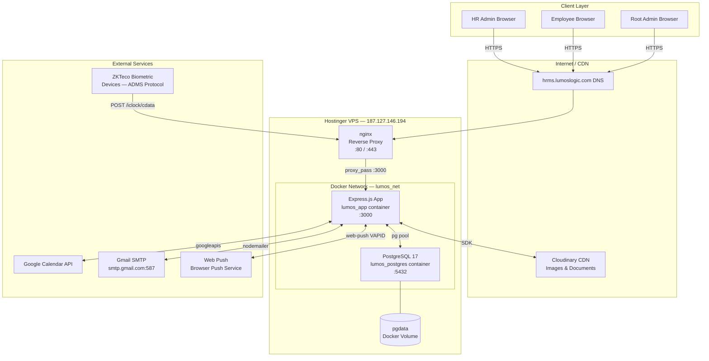

### 3.2 Application Layers

| Layer | Technology | Responsibility |
|---|---|---|
| **Presentation** | React 18 + Vite | UI rendering, routing, state management |
| **API Gateway** | nginx | HTTPS termination, routing, WebSocket upgrade headers |
| **Application** | Express.js 4.18 | REST API, static file serving, middleware chain |
| **Business Logic** | Express route handlers | HRMS rules, workflows, data transformation |
| **Data Access** | Custom pg-adapter | Parameterized SQL query builder over pg Pool |
| **Persistence** | PostgreSQL 17 | Relational data storage, constraints, indexes |
| **File Storage** | Cloudinary | Binary file storage and CDN delivery |
| **Notifications** | Nodemailer + web-push | Email and browser push delivery |
| **Calendar** | googleapis | Google Calendar event synchronization |

---

## 4. Frontend Architecture

### 4.1 Current Implementation

The frontend is a **Single Page Application (SPA)** built with React 18 and Vite. It is compiled at build time into a set of static HTML, CSS, and JavaScript files stored in the Express server's `public/` directory. The Express server serves these files for all non-API routes. The browser's History API handles client-side navigation.

### 4.2 Frontend Architecture Diagram

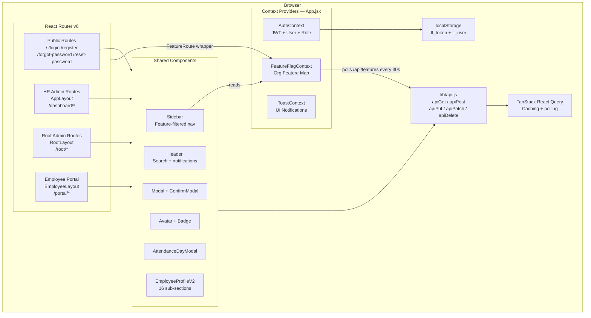

### 4.3 Routing Structure

| Layout | Route Prefix | Access | Description |
|---|---|---|---|
| `AppLayout` | `/dashboard`, `/employees`, `/leaves`, etc. | `admin`, `root_admin` | Full HR management suite |
| `RootLayout` | `/root/*` | `root_admin` only | Organization owner controls |
| `EmployeeLayout` | `/portal/*` | `employee` only | Employee self-service portal |
| Public | `/`, `/login`, `/register`, `/forgot-password`, `/reset-password` | Unauthenticated | Authentication pages |

### 4.4 Feature-Gated Routing

Every module that is controlled by a feature flag uses the `FeatureRoute` wrapper component. When a user navigates to a gated route where the feature is disabled for their organization, the wrapper renders a locked-screen message instead of the page component.

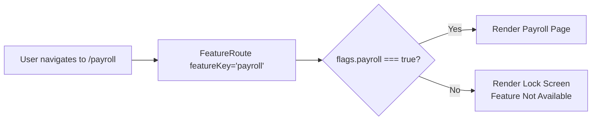

### 4.5 State Management

| State Type | Tool | Scope |
|---|---|---|
| Authentication state | `AuthContext` + `localStorage` | Global — persists across refreshes |
| Feature flags | `FeatureFlagContext` + React Query | Global — refreshed every 30 seconds |
| Toast notifications | `ToastContext` | Global — ephemeral |
| Server data (leaves, employees, etc.) | TanStack React Query | Per-page — cached and invalidated |
| Local UI state | `useState` / `useReducer` | Component-level |

### 4.6 API Client (`lib/api.js`)

All HTTP calls from the frontend go through a thin wrapper around the native `fetch` API. The wrapper:
- Automatically attaches the `Authorization: Bearer <token>` header
- Routes all calls to `/api` prefix (proxied to `localhost:3000` in development, direct in production)
- On HTTP 401 — dispatches a `auth:expired` CustomEvent that triggers automatic logout
- On non-OK responses — throws with the server's error message for UI display

```javascript
// Simplified internal flow
apiGet('/employees')
  → fetch('/api/employees', { headers: { Authorization: 'Bearer <jwt>' } })
  → res.status === 401 → dispatch('auth:expired') → logout()
  → !res.ok → throw new Error(data.error)
  → return data
```

### 4.7 Maintenance Considerations

- The `lt_token` and `lt_user` keys in `localStorage` are the only client-side persistence. Clearing browser storage logs the user out.
- Feature flags are polled every 30 seconds. A newly enabled feature may take up to 30 seconds to appear in the UI without a page refresh.
- The `FeatureFlagContext` treats any missing key as `true` (enabled). This means unrecognized feature keys default to accessible, not blocked.

### 4.8 Known Limitations — Frontend

- No offline support or service worker beyond push notification subscription
- No mobile-responsive optimization for the HR Admin dashboard (designed for desktop use)
- The Employee Portal is more mobile-friendly but not built as a PWA
- No internationalization (i18n); all text is hardcoded in English
- Timezone is fixed to IST; employees in other timezones will see IST times

---

## 5. Backend Architecture

### 5.1 Current Implementation

The backend is a **Node.js Express.js application** organized into a modular route structure. Each HRMS domain (leaves, attendance, employees, etc.) has its own route file under `backend/src/modules/[module]/`. The main `server.js` file mounts all routers and configures the middleware chain.

### 5.2 Backend Architecture Diagram

```mermaid
graph TB
    REQ[Incoming HTTP Request]

    subgraph Middleware["Middleware Chain — server.js"]
        MW1[express.json\nexpress.urlencoded]
        MW2[Static File Serving\npublic/ directory]
        MW3[CORS Handler\nOrigin allowlist]
        MW4[featureGate\n/api/* routes]
    end

    subgraph Routes["Module Routers — /api/*"]
        AUTH[/api/auth\nauth.routes.js]
        ORG[/api/org + /register-org\norg.routes.js]
        PLAT[/api/platform\nplatform.routes.js]
        DASH[/api/dashboard\ndashboard.routes.js]
        EMP[/api/employees\nemployees.routes.js]
        ATT[/api/attendance\nattendance.routes.js]
        LVS[/api/leaves\nleaves.routes.js]
        PAY[/api/payroll\npayroll.routes.js]
        BIO[/api/biometric\nbiometric.routes.js]
        PROF[/api/profile/*\n16 sub-route files]
        MORE[30+ additional\nmodule routers]
    end

    subgraph Auth_MW["Auth Middleware"]
        auth[auth\nJWT verify]
        adminOnly[adminOnly\nrole check]
        rootOnly[rootAdminOnly]
        selfAdmin[selfOrAdmin\nfield whitelist]
        platAuth[platformAdminAuth]
    end

    subgraph Services["Services Layer"]
        EMAIL[emailService.js\nNodemailer]
        PUSH[pushService.js\nweb-push]
        GCAL[googleCalendar.js\ngoogleapis]
    end

    subgraph Data["Data Layer"]
        ADAPTER[db-pg-adapter.js\nQuery Builder]
        POOL[pg.Pool\nConnection Pool\nmax=20]
        PG[(PostgreSQL)]
    end

    subgraph ADMS["ADMS — No Auth"]
        BIOPUSH[POST /iclock/cdata\nbiometricPush.handler.js]
        BIOHB[GET /iclock/getrequest\nbiometricHeartbeat.handler.js]
    end

    subgraph SPA["SPA Fallback"]
        FALLBACK[GET *\nServe index.html]
    end

    REQ --> MW1 --> MW2 --> MW3 --> MW4
    MW4 --> Routes
    MW4 --> ADMS
    MW4 --> SPA
    Routes --> Auth_MW
    Auth_MW --> Services
    Auth_MW --> Data
    ADAPTER --> POOL --> PG
```

### 5.3 Middleware Execution Order

Every request to `/api/*` passes through this middleware chain in sequence:

```
1. express.json()           — Parse JSON request bodies
2. express.urlencoded()     — Parse URL-encoded bodies (required for ZKTeco ADMS)
3. Static file middleware   — Serve built React SPA from public/
4. CORS handler             — Set Access-Control headers for allowed origins
5. featureGate              — Decode JWT, check organization_features table
6. Route handler            — Module-specific business logic
7. auth middleware          — JWT verification (applied inside route handlers)
8. adminOnly / rootAdminOnly — Role enforcement (applied per endpoint)
```

### 5.4 Module Organization

```
backend/src/modules/
├── analytics/          → My stats, new joiners
├── announcements/      → CRUD, file upload
├── archives/           → Soft-delete audit trail
├── assets/             → IT asset CRUD and assignment
├── attendance/         → Check-in, check-out, break, late/early
├── auth/               → Login, 2FA, password, GDPR
├── biometric/          → Device management, PIN mapping, logs, reprocess
│   ├── biometric.routes.js
│   ├── biometricPush.handler.js   → /iclock/cdata
│   └── biometricHeartbeat.handler.js
├── branches/           → Branch CRUD
├── calendar/           → Company events, Google Calendar fetch
├── dashboard/          → Aggregated org stats
├── departments/        → Dept CRUD, head assignment
├── designations/       → Designation CRUD
├── documents/          → Document storage, sharing, expiry
├── employee-profile/   → 16 sub-route files (V2 profile)
├── employees/          → Employee CRUD, multi-dept
├── exit/               → Exit request, clearance, interview
├── expenses/           → Expense claims, receipt upload
├── holidays/           → Holiday CRUD, Google Calendar sync
├── leave-policies/     → Leave type policy config
├── leaves/             → Leave lifecycle, balance, approval
├── notifications/      → In-app notifications, unread count
├── onboarding/         → Checklist init, task completion
├── org/                → Org settings, feature flags, HR contact
├── payroll/            → Salary structure, payslip generation
├── performance/        → Goals, reviews (stub)
├── platform/           → Platform admin — org and request management
├── push/               → VAPID subscription management
├── regularization/     → Attendance correction requests
├── reports/            → Attendance and leave report with CSV export
├── root/               → Root admin: broadcast, stats, user management
├── settings/           → Work schedule, biometric config
└── shifts/             → Shift CRUD, roster assignment
```

### 5.5 Database Adapter

The system uses a **custom Supabase-compatible query builder** (`db-pg-adapter.js`) that wraps the `pg` library's connection pool. This adapter exposes a chaining API identical to the Supabase JavaScript client:

```javascript
// Adapter usage — same syntax as Supabase JS client
const { data, error } = await supabase
  .from('leaves')
  .select('*, users(name, email)')
  .eq('organization_id', orgId)
  .eq('status', 'pending')
  .order('created_at', { ascending: false });
```

The adapter translates this to parameterized SQL executed against the PostgreSQL pool. This design:
- Prevents SQL injection (all values are parameterized)
- Preserves the migration path from the former Supabase backend
- Supports: `select`, `insert`, `update`, `delete`, `upsert`, `eq`, `neq`, `gt`, `gte`, `lt`, `lte`, `like`, `ilike`, `is`, `in`, `not`, `order`, `limit`, `range`, `single`, `maybeSingle`
- Supports LEFT JOIN via Supabase FK join syntax: `users!fkeyHint(col1, col2)`
- Does **not** support: `or()` filters (some routes work around this with raw pool queries)

> **Note:** For complex queries that the adapter cannot express, routes use `pool.query(sql, params)` directly — the raw pg pool is exported alongside the adapter.

### 5.6 Connection Pool Configuration

| Parameter | Value | Notes |
|---|---|---|
| `max` | 20 connections | Maximum concurrent DB connections |
| `idleTimeoutMillis` | 30,000 ms | Close idle connections after 30 seconds |
| `connectionTimeoutMillis` | 5,000 ms | Fail if no connection available in 5 seconds |
| `statement_timeout` | 30,000 ms | Cancel queries exceeding 30 seconds |
| DATE type parsing | Custom (OID 1082) | Returns DATE as `YYYY-MM-DD` string, not JS Date |

> **Best Practice:** The DATE OID override (`types.setTypeParser(1082, val => val)`) prevents timezone-induced date shifting (e.g., `2026-01-01 IST` → `2025-12-31 UTC`). This must be preserved in any database layer changes.

### 5.7 Maintenance Considerations — Backend

- The `server.js` file is the single entry point. All routers are mounted here. Adding new modules requires both a new route file and a mount declaration in `server.js`.
- The `featureGate` middleware applies to all `/api/*` routes. New features that require gating must be added to the `FEATURE_ROUTE_MAP` in `featureFlag.js`.
- The `/iclock/cdata` and `/iclock/getrequest` endpoints are mounted **outside** the `featureGate` middleware because ZKTeco devices cannot send JWT tokens.
- CORS origin whitelist is in `auth.js`. Adding new domains (e.g., staging environments) requires editing `ALLOWED_ORIGINS`.

---

## 6. Database Architecture

### 6.1 Current Implementation

The database is **PostgreSQL 17** running in a Docker container with a persistent named volume. The schema is a flat relational model where all organizations share the same set of tables, isolated by the `organization_id` foreign key on every data table.

### 6.2 Schema Organizational Groups

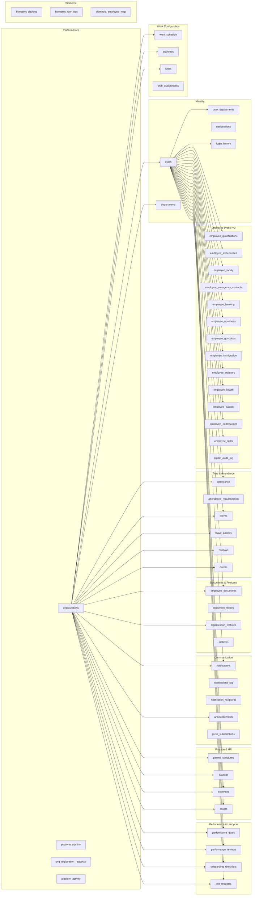

### 6.3 Multi-Tenancy Data Isolation

Every data table follows this pattern:

```sql
-- Every business table has organization_id as an FK
CREATE TABLE leaves (
  id              BIGSERIAL PRIMARY KEY,
  user_id         BIGINT NOT NULL REFERENCES users(id) ON DELETE CASCADE,
  organization_id BIGINT REFERENCES organizations(id) ON DELETE CASCADE,
  -- ... business columns
);

-- Every query filters by organization_id
SELECT * FROM leaves
WHERE organization_id = $1   -- from JWT: req.user.organization_id
  AND status = 'pending';
```

> **Warning:** Row-level security (RLS) is **explicitly disabled** on all tables (`DISABLE ROW LEVEL SECURITY`). Data isolation depends entirely on application-level `organization_id` filtering. Any future direct database access tool (pgAdmin, psql) will see all organizations' data without restriction.

### 6.4 Migration Strategy

The database schema evolves through **sequential SQL migration files** stored in `backend/migrations/`. There is no migration runner or versioning framework. Migrations are applied manually via `psql`.

**Migration execution order:**
```
full_schema.sql                          → Base schema
sanghavi_migration.sql                   → Extended columns + new tables
employee_profile_v2.sql                  → 16-table normalized profile
add_break_tracking.sql                   → Break in/out fields
add_account_security_2026_07_24.sql      → TOTP, password history, login history
add_banking_hr_verified_2026_07_23.sql   → Banking verification
patch_2026_06_29.sql through *.sql       → Point-in-time patches
```

### 6.5 Known Limitations — Database

- No migration versioning (no tracking of which migrations have been applied to a given environment)
- `clockify_config` table and `clockify_hours`, `clockify_user_id` columns remain in the schema but are not used (Clockify integration was removed)
- `SUPABASE_URL` and `SUPABASE_SERVICE_ROLE_KEY` remain in the `.env.example` but are not used
- Performance module tables exist but are minimally populated in practice
- No full-text search index; employee search uses `ILIKE` which does not scale beyond ~10,000 records without a proper index

---

## 7. Authentication and Authorization Flow

### 7.1 Standard Login Flow

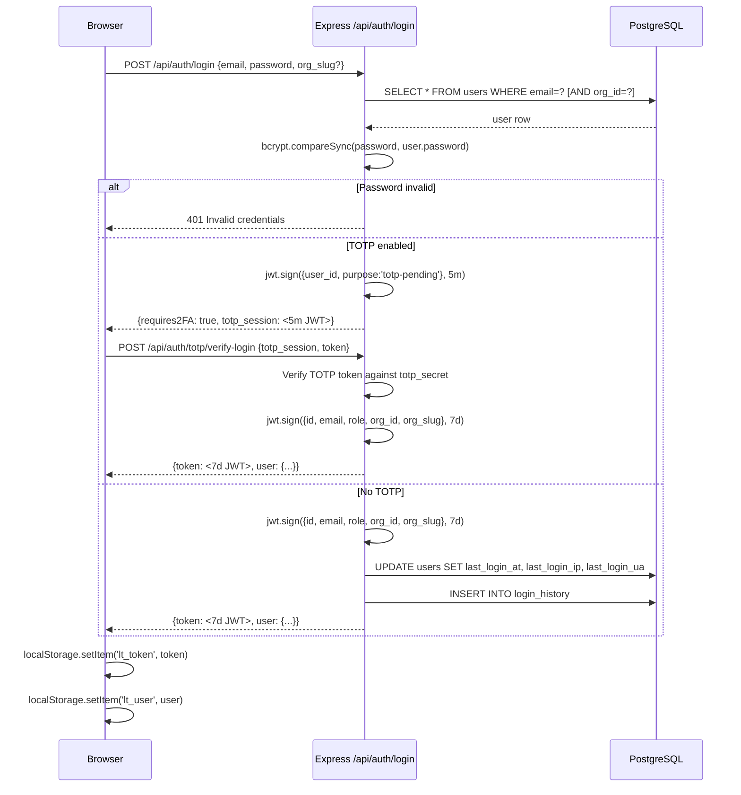

### 7.2 Authenticated Request Flow

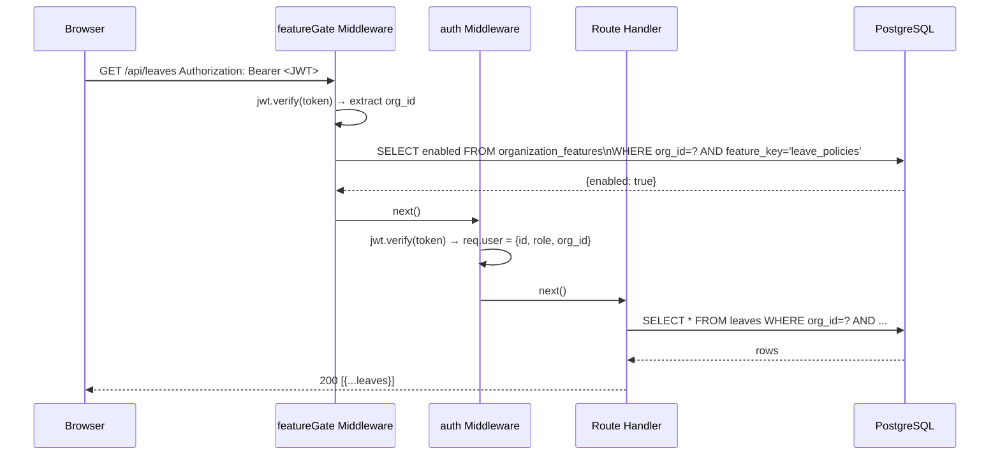

### 7.3 Authorization Role Matrix

| Action | employee | admin (HR) | root_admin |
|---|:---:|:---:|:---:|
| View own attendance | ✓ | ✓ | ✓ |
| Check in / Check out | ✓ | ✓ | ✓ |
| Apply for leave | ✓ | ✓ | ✓ |
| View all employees | — | ✓ | ✓ |
| Create / edit employees | — | ✓ | ✓ |
| Approve / reject leave | — | ✓ | ✓ |
| Admin-edit attendance | — | ✓ | ✓ |
| Manage departments | — | ✓ | ✓ |
| Manage payroll | — | ✓ | ✓ |
| View statutory fields | — | ✓ | ✓ |
| Manage HR admins | — | — | ✓ |
| Configure org settings | — | — | ✓ |
| Manage root admin accounts | — | — | ✓ |
| Send broadcast | — | — | ✓ |
| View cross-admin approvals | — | — | ✓ |
| Access all /root/* routes | — | — | ✓ |

### 7.4 Middleware Enforcement Points

| Middleware | Applied At | Enforcement |
|---|---|---|
| `auth` | Per endpoint (inside routes) | JWT signature and expiry |
| `adminOnly` | Per endpoint | Role must be `admin` or `root_admin` |
| `rootAdminOnly` | Per endpoint | Role must be `root_admin` only |
| `selfOrAdmin` | Profile edit endpoints | Employee can edit own profile; field whitelist enforced |
| `platformAdminAuth` | `/api/platform/*` | Role must be `platform_admin` from `platform_admins` table |
| `featureGate` | All `/api/*` routes | Organization feature flag check before reaching handler |

### 7.5 Token Lifecycle

| Event | Action |
|---|---|
| Login success | 7-day JWT issued, stored in `localStorage` |
| TOTP pending | 5-minute JWT issued; expires and requires new login |
| Mid-session 401 | `auth:expired` CustomEvent → `AuthContext.logout()` |
| Manual logout | Token removed from `localStorage`; server has no session to invalidate |
| Password change | Old token remains valid until expiry (no server-side revocation) |

> **Risk:** JWT tokens cannot be revoked server-side. If a token is compromised, it remains valid for up to 7 days unless the user changes their password (new login generates new token). See [Section 15](#15-risks) for mitigation options.

---

## 8. Request Lifecycle

### 8.1 Complete Request Lifecycle Diagram

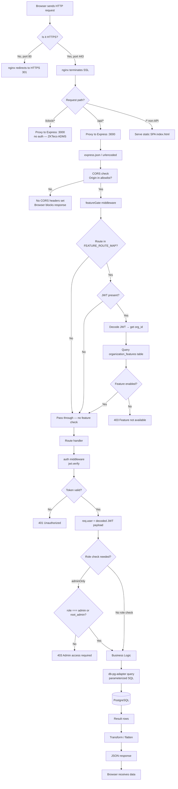

---

## 9. Module Interaction Map

### 9.1 Leave Approval Interaction

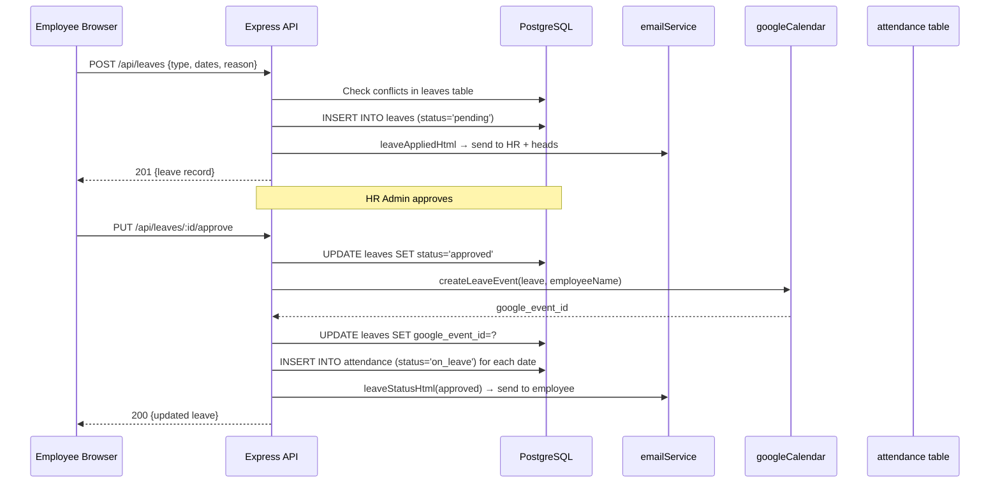

### 9.2 Biometric → Attendance Interaction

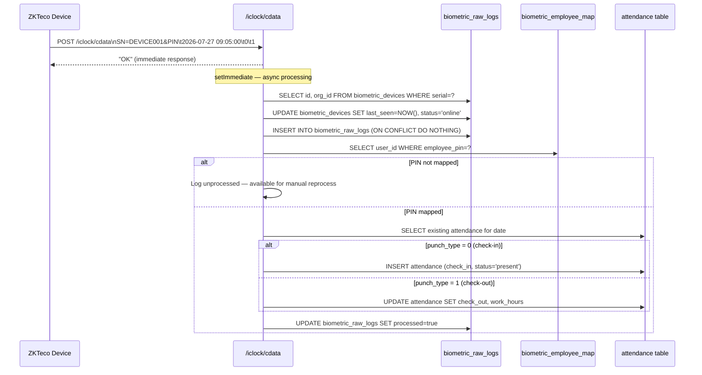

---

## 10. External Integrations Architecture

### 10.1 Integration Overview

| Service | Purpose | Trigger | Failure Behavior |
|---|---|---|---|
| **Cloudinary** | Avatar, document, receipt, announcement file storage | File upload endpoints | HTTP 500 returned to client |
| **Google Calendar** | Sync leave events, holidays, company events | Leave approval, holiday CRUD | Silent fail — leave/holiday still saved |
| **Gmail SMTP** | Transactional email | Leave events, onboarding, passwords, birthday/holiday cron | Silent fail — logged to console |
| **Web Push (VAPID)** | Browser push notifications | Broadcasts, birthday/holiday cron | Silent fail; dead subscriptions cleaned |
| **ZKTeco ADMS** | Biometric attendance from hardware devices | Device POSTs to `/iclock/cdata` | Raw log retained for manual reprocess |

### 10.2 Integration Configuration

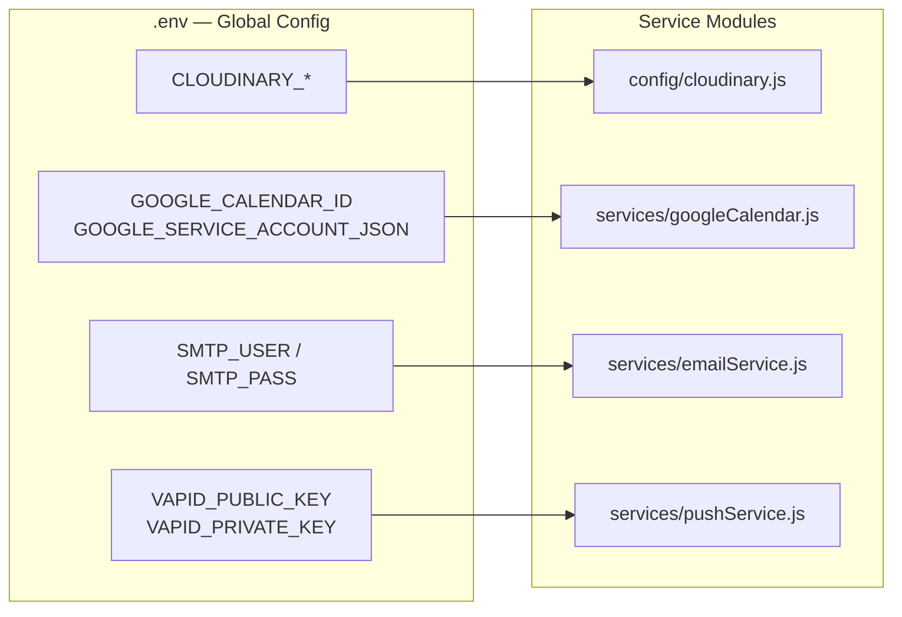

### 10.3 Google Calendar Authentication

The Google Calendar service uses a **Service Account** (not OAuth user flow). The service account credentials are loaded from:
1. `GOOGLE_SERVICE_ACCOUNT_JSON` environment variable (preferred for Docker deployments)
2. `backend/src/services/service-account.json` file (fallback for local development)

If neither is present, all Google Calendar operations are silently skipped. Leave approval and holiday management continue to work normally.

### 10.4 Cloudinary Upload Flow

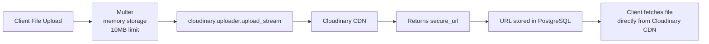

> **Note:** Files are never stored on the VPS disk. All binary data goes directly from the browser upload → Express memory buffer → Cloudinary. The VPS serves only the database record containing the Cloudinary URL.

---

## 11. Deployment Architecture

### 11.1 Current Implementation

The application runs on a **single Hostinger VPS** using Docker Compose with two containers on an isolated Docker bridge network.

### 11.2 Deployment Topology

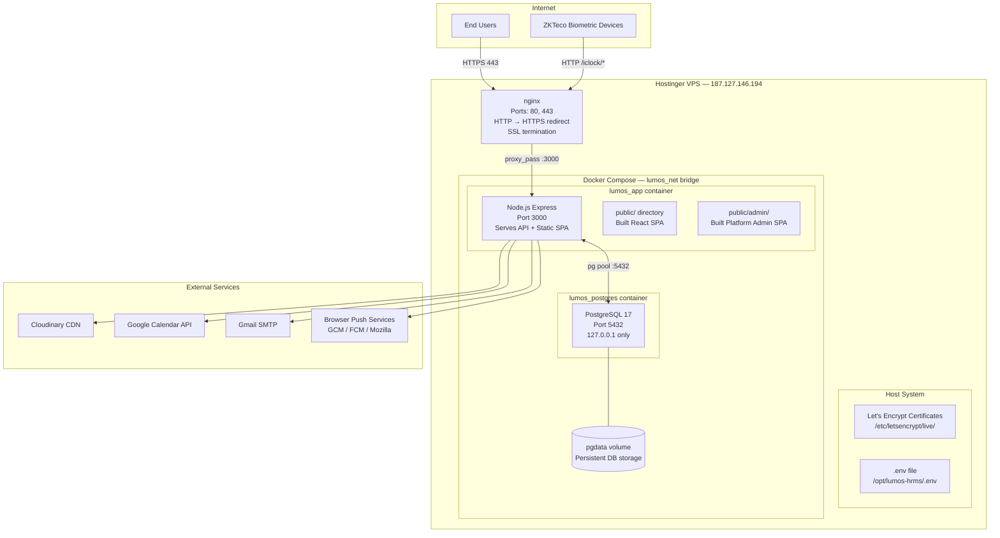

### 11.3 Build Process

```mermaid
flowchart LR
    A[Source Code\ngit repository] --> B[Docker Build\nmulti-stage]

    subgraph Stage1["Stage 1 — frontend-builder"]
        C[npm ci\nclient/]
        D[vite build\nclient/dist/]
    end

    subgraph Stage2["Stage 2 — platform-builder"]
        E[npm ci\nplatform-admin/]
        F[vite build\nplatform-admin/dist/]
    end

    subgraph Stage3["Stage 3 — app production image"]
        G[npm ci --omit=dev\nbackend deps only]
        H[Copy backend/src]
        I[Copy client/dist → public/]
        J[Copy platform-admin/dist → public/admin/]
        K[Run as non-root user 'lumos']
    end

    B --> Stage1 --> Stage2 --> Stage3
    Stage3 --> L[lumos-hrms:latest image]
    L --> M[docker compose up -d]
```

### 11.4 Port Configuration

| Component | Internal Port | External | Notes |
|---|---|---|---|
| Express App | 3000 | Not directly exposed | Via Docker network to nginx |
| PostgreSQL | 5432 | `127.0.0.1:5432` only | Never exposed to internet |
| nginx HTTP | 80 | Public | Redirects to HTTPS |
| nginx HTTPS | 443 | Public | SSL termination |

> **Warning:** The nginx configuration file (`nginx/lumos.conf`) contains `proxy_pass http://127.0.0.1:3005` which does not match the application port of 3000. **Verify the live nginx configuration on the VPS** before assuming the config file is current. Run `grep proxy_pass /etc/nginx/sites-enabled/*.conf` on the VPS to confirm the active proxy target port.

### 11.5 Maintenance Considerations — Deployment

- Docker Compose `restart: unless-stopped` ensures automatic container recovery after crashes or VPS reboots
- The `pgdata` Docker volume persists database data across container restarts and image rebuilds
- PostgreSQL is only accessible from within the Docker network and from `127.0.0.1` on the host — it is never exposed to the public internet
- SSL certificates from Let's Encrypt expire every 90 days and must be renewed via Certbot (renewal is typically handled by the certbot systemd timer)

---

## 12. Folder Structure Reference

```
Leave_Tracker-HR-Dashboard-/
│
├── client/                          # React 18 SPA
│   ├── src/
│   │   ├── App.jsx                  # Root router and context providers
│   │   ├── main.jsx                 # React DOM entry point
│   │   ├── index.css                # Global CSS + Tailwind directives
│   │   ├── components/
│   │   │   ├── layout/              # AppLayout, EmployeeLayout, RootLayout,
│   │   │   │                        # Sidebar, Header
│   │   │   ├── ui/                  # Avatar, Badge, Modal, ConfirmModal,
│   │   │   │                        # GlobalSearchModal
│   │   │   ├── AttendanceDayModal.jsx
│   │   │   ├── EmployeeProfileV2.jsx
│   │   │   └── ForcePasswordChangeModal.jsx
│   │   ├── context/
│   │   │   ├── AuthContext.jsx      # JWT, user, logout
│   │   │   ├── FeatureFlagContext.jsx
│   │   │   └── ToastContext.jsx
│   │   ├── hooks/
│   │   │   ├── usePageMeta.js
│   │   │   ├── usePushNotification.js
│   │   │   └── useTour.js
│   │   ├── lib/
│   │   │   ├── api.js               # Fetch wrapper — apiGet/Post/Put/Patch/Delete
│   │   │   ├── utils.js             # cn(), initials(), formatting helpers
│   │   │   └── tours.js             # Driver.js tour definitions
│   │   └── pages/                   # 52+ page components
│   ├── public/                      # Static assets (favicon, etc.)
│   ├── vite.config.js               # Vite config — @/ alias, dev proxy to :3000
│   ├── tailwind.config.js
│   └── package.json
│
├── backend/
│   ├── src/
│   │   ├── server.js                # Express entry point, middleware, route mounting
│   │   ├── config/
│   │   │   ├── db.js                # Exports supabase (adapter) + pool + seed()
│   │   │   ├── db-pg-adapter.js     # Custom Supabase-compatible query builder
│   │   │   └── cloudinary.js        # Cloudinary SDK configuration
│   │   ├── middleware/
│   │   │   ├── auth.js              # auth, adminOnly, rootAdminOnly, selfOrAdmin,
│   │   │   │                        # platformAdminAuth, ALLOWED_ORIGINS
│   │   │   ├── featureFlag.js       # featureGate, FEATURE_ROUTE_MAP
│   │   │   └── upload.js            # Multer memory storage, 10MB limit
│   │   ├── modules/                 # 30+ module directories (see Section 5.4)
│   │   ├── services/
│   │   │   ├── emailService.js      # Nodemailer + 10 HTML templates
│   │   │   ├── googleCalendar.js    # Google Calendar API operations
│   │   │   └── pushService.js       # VAPID web push
│   │   └── utils/
│   │       ├── cronJobs.js          # Daily 08:00 IST notification job
│   │       └── helpers.js           # localDateStr, localTimeStr, orgId,
│   │                                # getSettings, toMinutes, getRecipients
│   ├── migrations/                  # 25 SQL migration files (manual execution)
│   └── scripts/
│       ├── migrate.js               # Migration utility script
│       └── migrate-from-supabase.js # One-time Supabase → PostgreSQL migration
│
├── platform-admin/                  # Separate Vite React SPA for platform management
│
├── nginx/
│   └── lumos.conf                   # nginx reverse proxy configuration
│
├── docs/
│   └── implementation/              # This documentation suite
│
├── Dockerfile                       # Multi-stage build (frontend + backend)
├── docker-compose.yml               # Production container orchestration
├── docker-entrypoint.sh             # Container startup script
├── deploy.sh                        # VPS deployment automation script
├── .env.example                     # Environment variable template
├── .env.production                  # Production .env template (no secrets)
└── package.json                     # Root-level dependencies (root node_modules)
```

---

## 13. Technology Stack Decisions

### 13.1 Key Decision Rationale

| Decision | Rationale | Trade-off |
|---|---|---|
| **Monolithic architecture** | Single team, single deployment, simpler operations | Harder to scale individual components independently |
| **Express over NestJS/Fastify** | Minimal overhead, team familiarity, fast initial development | No built-in validation, DI, or decorators |
| **Custom pg-adapter** | Preserve migration path from Supabase without rewriting route handlers | Non-standard; developers must learn the adapter API |
| **React Query over Redux** | Server-state focus, built-in caching and revalidation | Learning curve for developers used to Redux |
| **JWT over sessions** | Stateless, horizontally scalable | Tokens cannot be revoked server-side |
| **IST hardcoded timezone** | Simplifies date arithmetic for India-based deployment | System cannot support multi-timezone organizations |
| **Cloudinary for files** | No disk management, CDN delivery, image transformations | Monthly cost scales with storage and bandwidth |
| **Gmail SMTP** | Zero infrastructure, free tier, Google Workspace compatible | Rate limits, App Password rotation required |
| **Docker Compose over Kubernetes** | Sufficient for single-VPS deployment | Manual scaling; no orchestration for multi-node |

---

## 14. Known Limitations

| Area | Limitation | Impact |
|---|---|---|
| **Timezone** | Hardcoded to IST; no per-user timezone | International employees see IST times |
| **JWT revocation** | Tokens valid until expiry; no blacklist | Compromised tokens remain valid up to 7 days |
| **Adapter OR support** | `or()` filter not supported in pg-adapter | Some queries require raw `pool.query()` workarounds |
| **RLS disabled** | No database-level access control | Data leakage risk if application auth is bypassed |
| **Single cron implementation** | `setTimeout` loop — lost on server restart until 08:00 IST triggers again | Daily notifications may not fire after unexpected restarts |
| **Single VPS** | No high-availability or failover | Any hardware issue = full downtime |
| **Manual migrations** | No migration runner or applied-version tracking | Risk of applying duplicate migrations |
| **No test suite** | Zero automated tests | Regressions undetected until manual QA |
| **No rate limiting** | Auth endpoints unprotected against brute force | Credential stuffing attack vector |
| **No CI/CD** | All deployments are manual git pull + docker compose | Human error risk; no automated quality gate |

---

## 15. Risks

| Risk | Severity | Likelihood | Impact | Mitigation |
|---|---|---|---|---|
| nginx proxy port mismatch (3005 vs 3000) | High | Confirmed | App unreachable | Verify and fix nginx config on VPS |
| No rate limiting on `/api/auth/login` | High | Likely | Credential brute force | Implement express-rate-limit |
| JWT token compromise — no revocation | High | Possible | Unauthorized access up to 7 days | Implement token versioning or short-lived tokens |
| VPS failure — no backup server | High | Low | Full downtime | Implement daily backups + documented restore procedure |
| Biometric endpoint unauthenticated | Medium | Possible | Spoofed attendance records | IP whitelist for ZKTeco device IPs |
| RLS disabled — direct DB access bypasses all auth | Medium | Low | Data breach across orgs | Re-enable RLS with policies OR restrict DB access to app only |
| Manual deployments — no rollback procedure | Medium | Possible | Production incidents take longer to resolve | Document and test rollback procedure |
| Daily cron lost on restart before 08:00 IST | Low | Possible | Missed birthday/holiday notifications | Migrate to OS-level cron or persistent task queue |

---

## 16. Best Practices

> **Best Practice:** Always verify the nginx active config on the VPS with `nginx -T | grep proxy_pass` before assuming the config file in the repository is current.

> **Best Practice:** Never use the pg connection pool (`pool.query()`) inside the `featureGate` middleware as it runs on every single API request. Keep the middleware lightweight.

> **Best Practice:** When adding new modules, always add both the route file AND an entry in `FEATURE_ROUTE_MAP` in `featureFlag.js` if the module requires plan-based gating.

> **Best Practice:** The `orgId(req)` helper defaults to `1` if `req.user.organization_id` is undefined. Always ensure authenticated routes use `auth` middleware before calling `orgId()`.

> **Best Practice:** Preserve the DATE type parser override in `db-pg-adapter.js`. Removing it will cause all DATE columns to shift by -5:30 hours when converted from UTC.

> **Best Practice:** Use `.maybeSingle()` (not `.single()`) when querying for records that may not exist. `.single()` throws if no rows are found.

---

## 17. Future Recommendations

| Area | Recommendation | Priority | Complexity |
|---|---|---|---|
| **Rate Limiting** | Add `express-rate-limit` on `/api/auth/login`, `/api/auth/forgot-password` | Critical | Low |
| **JWT Revocation** | Add a `token_version` column to users; embed in JWT; invalidate by incrementing | High | Medium |
| **CI/CD Pipeline** | Add GitHub Actions: lint → build → docker push → SSH deploy | High | Medium |
| **Automated Testing** | Introduce Jest + Supertest for API route testing | High | High |
| **Migration Runner** | Adopt `node-pg-migrate` or `db-migrate` for versioned migrations | High | Medium |
| **Input Validation** | Add `zod` or `joi` schema validation on all POST/PUT endpoints | High | Medium |
| **Monitoring** | Add Uptime Robot or Grafana Cloud for VPS/app health monitoring | Medium | Low |
| **Structured Logging** | Replace `console.error` with `pino` or `winston` with log rotation | Medium | Low |
| **RLS Policies** | Re-enable PostgreSQL Row-Level Security as defense-in-depth | Medium | High |
| **Multi-VPS** | Move to two-VPS setup (primary + replica) for HA | Low | High |
| **Timezone Support** | Add `timezone` column to organizations; use `Intl.DateTimeFormat` with org TZ | Low | High |

---

## 18. Document Summary

This document has covered the complete technical architecture of the Lumos Logic HRMS:

- The system follows a pragmatic monolithic architecture: one Express process serves both the REST API and the React SPA
- The database is PostgreSQL 17 in Docker with multi-tenancy enforced at the application query layer
- Authentication is stateless JWT-based with optional TOTP 2FA; four distinct roles govern access
- The custom pg-adapter provides a Supabase-compatible query interface over the PostgreSQL pool
- External integrations (Cloudinary, Google Calendar, Gmail SMTP, Web Push, ZKTeco) are all fault-tolerant and optional
- Deployment runs on a single Hostinger VPS using Docker Compose behind nginx with Let's Encrypt SSL
- Key risks identified: nginx port mismatch, no rate limiting, no JWT revocation, no automated backups, no test suite, no CI/CD

---

## 19. Related Documents

| Document | Relevance |
|---|---|
| `01_Executive_Summary.md` | Business context and feature overview |
| `03_Module_Overview.md` | Detailed breakdown of every HRMS module |
| `06_Security_Measures_and_Access_Control.md` | Deep dive into auth, RBAC, and security gaps |
| `08_Biometric_Integration.md` | ZKTeco ADMS architecture detail |
| `09_Database_Management_Guidelines.md` | Full schema reference and migration procedures |
| `11_Deployment_and_Maintenance_Procedures.md` | Step-by-step deployment and operations |

---

## 20. Operational Checklist

Use this checklist when auditing the running system or onboarding a new team member.

### Architecture Verification

- [ ] Confirm nginx proxy target port matches the Express app port (`grep proxy_pass /etc/nginx/sites-enabled/*.conf`)
- [ ] Confirm Express is listening on port 3000 (`ss -tlnp | grep 3000`)
- [ ] Confirm PostgreSQL is only accessible from within the Docker network (`ss -tlnp | grep 5432` — should show `127.0.0.1:5432`)
- [ ] Confirm Docker Compose `restart: unless-stopped` is active (`docker compose ps`)
- [ ] Confirm SSL certificate is valid and not expiring within 30 days (`certbot certificates`)

### Integration Verification

- [ ] Cloudinary uploads work (test via employee avatar upload)
- [ ] Email delivery works (test via forgot-password flow)
- [ ] Google Calendar sync is configured (check `GOOGLE_CALENDAR_ID` in `.env`)
- [ ] Web push VAPID keys are set (check `VAPID_PUBLIC_KEY` in `.env`)
- [ ] Biometric heartbeat active (check `biometric_devices.last_seen` in DB)

### Security Verification

- [ ] `JWT_SECRET` is set to a strong random value (not default)
- [ ] `DB_PASSWORD` is a strong, unique password
- [ ] The `.env` file on VPS is not publicly accessible
- [ ] CORS `ALLOWED_ORIGINS` contains only expected domains
- [ ] Platform admin credentials are not set to default values

---

## 21. Review and Update Recommendations

| Trigger | Action |
|---|---|
| Any new module added | Update Section 5.4 (module list), Section 9 (interaction map) |
| Database schema change | Update Section 6.2 (schema groups) |
| New external integration | Update Section 10 (integrations) |
| Deployment infrastructure change | Update Section 11 (deployment topology) |
| Security incident | Review Section 7 (auth flow), Section 15 (risks), update mitigations |
| Quarterly review | Verify all operational checklist items; update risk severity ratings |

**Next Scheduled Review:** October 2026

---

*End of Document 02 — System Architecture Overview*  
*Next: 03_Module_Overview.md*
