# 03 — Module Overview
## Lumos Logic HRMS — Complete Functional Reference

---

**Document Version:** 1.0  
**Prepared By:** Lumos Logic  
**Date:** July 2026  
**Classification:** Confidential — Internal, Client, and QA Distribution  
**Audience:** All stakeholders — developers, HR administrators, QA engineers, client teams  

---

## Table of Contents

1. [Dashboard](#1-dashboard)
2. [Employee Management](#2-employee-management)
3. [Employee Profile V2](#3-employee-profile-v2)
4. [Departments and Designations](#4-departments-and-designations)
5. [Attendance Management](#5-attendance-management)
6. [Leave Management](#6-leave-management)
7. [Leave Policies](#7-leave-policies)
8. [Calendar](#8-calendar)
9. [Holidays](#9-holidays)
10. [Regularization](#10-regularization)
11. [Payroll](#11-payroll)
12. [Documents](#12-documents)
13. [Assets](#13-assets)
14. [Expenses](#14-expenses)
15. [Reports](#15-reports)
16. [Announcements](#16-announcements)
17. [Notifications](#17-notifications)
18. [Shifts and Roster](#18-shifts-and-roster)
19. [Performance Management](#19-performance-management)
20. [Onboarding](#20-onboarding)
21. [Exit Management](#21-exit-management)
22. [Biometric Integration](#22-biometric-integration)
23. [Settings](#23-settings)
24. [Organization Management](#24-organization-management)
25. [Module Dependency Matrix](#25-module-dependency-matrix)
26. [Module Maturity Matrix](#26-module-maturity-matrix)
27. [Feature Flag Matrix](#27-feature-flag-matrix)
28. [Cross-Module Interaction Diagram](#28-cross-module-interaction-diagram)
29. [Operational Checklist](#29-operational-checklist)
30. [Document Summary](#30-document-summary)
31. [Related Documents](#31-related-documents)
32. [Review and Update Recommendations](#32-review-and-update-recommendations)

---

# 1. Dashboard

## 1.1 Purpose

The Dashboard is the primary landing page for HR Administrators and Root Administrators. It provides a consolidated real-time view of the organization's workforce status — who is present, who is on leave, pending approvals, recent activity, and headcount metrics — enabling HR teams to make informed daily operational decisions without navigating to individual modules.

**Users Involved:** HR Admin, Root Admin  
**Problem Solved:** Eliminates the need to query multiple systems or spreadsheets to understand daily workforce availability

## 1.2 Access and Permissions

| Role | Access |
|---|---|
| Employee | No access — employees use `/portal/home` instead |
| HR Admin | Full dashboard access |
| Root Admin | Full dashboard access via `/root/dashboard` |
| Feature Flag | None — always available |

## 1.3 Features

- Real-time attendance summary for the current day (present, absent, on-leave, WFH, half-day)
- Late arrival and early exit counters
- Total employee headcount
- New joiners this month and last 7 days
- Pending leave requests requiring approval
- Date-selectable attendance view (admin can view any past date)
- Recent attendance activity feed (check-ins and check-outs)
- New joiner cards with department and join date
- Organization-scoped — shows only data for the logged-in admin's organization

## 1.4 Workflow

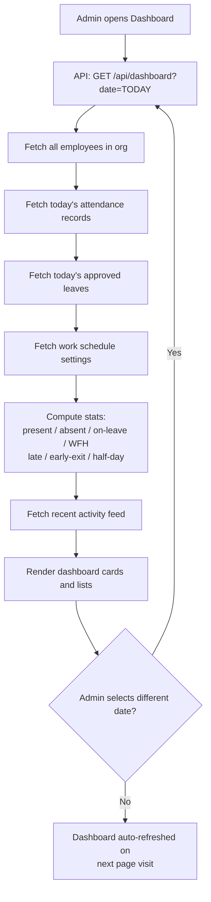

## 1.5 Current Implementation

| Layer | Detail |
|---|---|
| **Frontend Page** | `client/src/pages/Dashboard.jsx` |
| **Backend Route** | `backend/src/modules/dashboard/dashboard.routes.js` — `GET /api/dashboard` |
| **Database Tables** | `users`, `attendance`, `leaves`, `work_schedule` |
| **External Integrations** | None |

**Computation Logic:**  
The dashboard backend fetches all employees in the organization, then cross-references attendance records and approved leave records for the selected date. WFH status is computed from both attendance records (`status='wfh'`) and approved WFH-type leave records. The `absentCount` is derived as: `totalEmployees - present - onLeave - wfh`.

## 1.6 Dependencies

- **Attendance Module** — for check-in/check-out status
- **Leave Module** — for approved leave records on selected date
- **Settings Module** — for `work_schedule` (late threshold, work hours)
- **Employee Module** — for total headcount

## 1.7 Business Rules

- Only employees (`role = 'employee'`) are counted in dashboard stats. Admins and root admins are excluded from headcount
- WFH employees are counted separately from present and on-leave
- A half-day employee is counted under `half_day` status
- New joiners are identified by `created_at >= 7 days ago`
- The date selector allows viewing historical data (past dates only, no future projections)

## 1.8 Maintenance Considerations

- Dashboard queries run multiple database calls sequentially per page load. Under high employee counts (500+), this may cause noticeable load time
- The `getSettings()` helper falls back to a global work schedule if no org-specific schedule exists — ensure every organization has a `work_schedule` row after provisioning

## 1.9 Known Limitations

- No auto-refresh; data is stale until the page is revisited
- No graphical trend charts on the main dashboard (charts exist in analytics pages accessed separately)
- New joiner threshold is hardcoded at 7 days; not configurable per organization
- Dashboard does not show pending regularization requests — admins must navigate separately

## 1.10 Risks

| Risk | Severity |
|---|---|
| N+1 query pattern for per-employee data at scale | Medium |
| Stale data without page refresh | Low |

## 1.11 Best Practices

> **Best Practice:** After provisioning a new organization, always insert a `work_schedule` row for that org. The dashboard's late/early detection depends on `late_threshold` from this table.

## 1.12 Future Enhancements

| Enhancement | Priority |
|---|---|
| Auto-refresh every 5 minutes | Medium |
| Graphical attendance trend chart (7-day) | Medium |
| Pending regularization count on dashboard | Low |
| Department-level drill-down filters | Low |

---

# 2. Employee Management

## 2.1 Purpose

The Employee Management module is the core registry of all workforce members within an organization. It handles the creation, update, deactivation, and listing of employee records, and serves as the anchor for all other HR operations — leave, attendance, payroll, documents, and profile management.

**Users Involved:** HR Admin, Root Admin  
**Problems Solved:** Centralizes all employee data, eliminates spreadsheet-based employee lists, and links all HR activities to verified employee identities

## 2.2 Access and Permissions

| Role | Access |
|---|---|
| Employee | Cannot access `/employees` — reads own profile via `/portal/profile` |
| HR Admin | Create, view, edit all employees; view statutory fields |
| Root Admin | Full access; can also create and manage HR admin accounts |
| Feature Flag | None — always available |

## 2.3 Features

- Employee directory with search and filter
- Create new employee with auto-generated welcome email and temporary password
- Force password change on first login
- Edit employee core fields (name, email, role, position, department, employment type, etc.)
- Multi-department assignment via checkbox selection (junction table `user_departments`)
- Deactivate/reactivate employees (`employee_status` field)
- Employee profile photo upload (Cloudinary)
- Link employee to biometric device enrollment ID
- Link employee to branch
- View statutory fields (Aadhar, PAN, UAN, PF/ESI details) — admin only
- Global search across employee records

## 2.4 Workflow

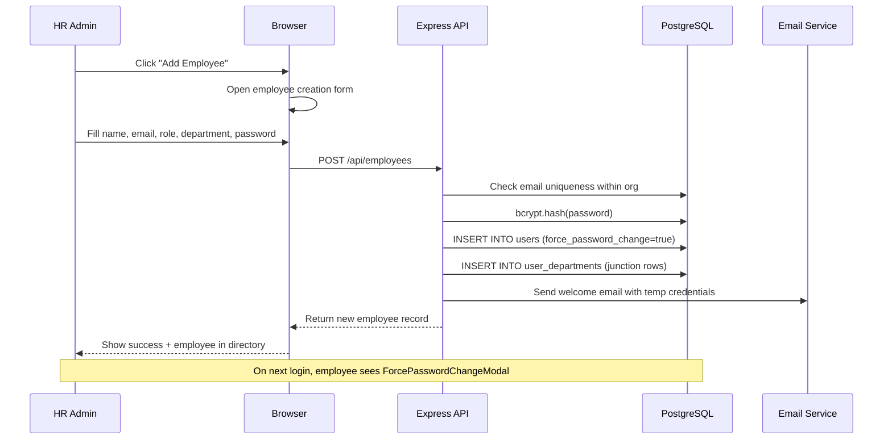

## 2.5 Current Implementation

| Layer | Detail |
|---|---|
| **Frontend Page** | `client/src/pages/Employees.jsx` — list + `/employees/:id` for detail |
| **Frontend Component** | `client/src/components/EmployeeProfileV2.jsx` — 16-section profile |
| **Backend Route** | `backend/src/modules/employees/employees.routes.js` |
| **Database Tables** | `users`, `user_departments`, `departments`, `designations`, `branches` |
| **External Integrations** | Cloudinary (avatar upload), Nodemailer (welcome email) |

**Column Sets:**  
Public columns (accessible to employees viewing colleagues): `id, name, email, role, department, position, avatar_color, date_of_birth, phone, employment_type, employee_status, gender, blood_group, marital_status, nationality, religion, citizenship`

Admin-only columns (added for admin role): `aadhar_no, pan_number, uan_no, pf_applicable, pf_no, esi_applicable, esi_no, ot_applicable, ot_rate, ctc, salary_effective_date`

## 2.6 Dependencies

- **Departments Module** — for department assignment
- **Branches Module** — for branch assignment (feature-gated)
- **Biometric Module** — `device_enrollment_id` used for PIN mapping
- **Email Service** — welcome email delivery
- **Cloudinary** — avatar photo storage
- **Leave, Attendance, Payroll, Documents** — all depend on `users.id` as FK

## 2.7 Business Rules

- Email must be unique across the entire platform (not just within one organization)
- Only `root_admin` users can create accounts with `role = 'root_admin'`
- `force_password_change = true` is set on all new employee accounts
- Password is hashed with bcrypt (cost factor 10) before storage
- Multi-department assignment replaces all previous department assignments on edit
- `employee_status = 'inactive'` deactivates the employee but does not delete the record — all linked HR data is preserved
- Root Admin can view HR admins in the employee list; HR Admin sees only employees

## 2.8 Maintenance Considerations

- Deactivated employees (`employee_status = 'inactive'`) still appear in historical leave and attendance records — this is intentional for audit continuity
- Avatar images stored in Cloudinary are not automatically deleted when an employee is deactivated or removed — periodic Cloudinary cleanup is recommended
- The welcome email sends the plain-text temporary password once. If the email is not received, the admin must manually reset the password via the admin interface

## 2.9 Known Limitations

- No bulk employee import (CSV/Excel upload) — all employees must be created individually via the UI
- No employee self-registration — all accounts are created by HR Admins
- Deactivation does not prevent login if the employee retains a valid JWT token (token expires after 7 days)
- No automated offboarding integration — deactivation must be done manually by HR

## 2.10 Risks

| Risk | Severity |
|---|---|
| Deactivated employee can use existing JWT for up to 7 days | Medium |
| No bulk import increases HR workload for large organizations | Medium |
| No duplicate check on `employee_id` field (custom ID) | Low |

## 2.11 Best Practices

> **Best Practice:** When deactivating a high-risk employee (e.g., resignation with data concerns), ask the employee to log out immediately, then deactivate the account. The 7-day JWT window cannot be shortened without implementing token revocation.

> **Best Practice:** Assign a unique `employee_id` to every employee for cross-system reference. While not enforced by a database constraint, consistent use is essential for payroll and statutory reporting.

## 2.12 Future Enhancements

| Enhancement | Priority |
|---|---|
| Bulk CSV/Excel employee import | High |
| Automatic account deactivation on exit approval | High |
| JWT revocation on deactivation | High |
| Employee ID uniqueness constraint at DB level | Medium |
| Org chart visualization from `reporting_to` FK | Low |

---

# 3. Employee Profile V2

## 3.1 Purpose

Employee Profile V2 is the comprehensive personal and professional data record for every employee. It extends the base `users` table with 13 normalized sub-tables covering employment history, family data, banking details, statutory fields, health records, and more. It serves as the single authoritative source of employee information for HR operations, payroll processing, and statutory compliance.

**Users Involved:** HR Admin, Root Admin, Employee (own profile only)  
**Problems Solved:** Replaces paper employee files and fragmented spreadsheets with a structured, searchable, auditable digital employee record

## 3.2 Access and Permissions

| Role | Profile Section Access |
|---|---|
| Employee | Can view all own profile sections; can edit limited personal fields |
| HR Admin | Can view and edit all sections for all employees |
| Root Admin | Same as HR Admin |
| Feature Flag | `statutory` feature flag gates statutory fields section |

## 3.3 Features

The profile is organized into **16 sub-sections**, each with its own backend route:

| # | Section | Key Data |
|---|---|---|
| 1 | **Overview** | Summary card: name, ID, role, department, branch, joining date, status |
| 2 | **Personal** | DOB, gender, blood group, marital status, nationality, religion, height, weight, citizenship |
| 3 | **Professional** | Employment type, work mode, joining date, confirmation date, grade, division, reporting manager |
| 4 | **Address** | Current address (line1, line2, city, state, country, postal code), permanent address |
| 5 | **Family** | Spouse, children, parents — name, DOB, relationship, occupation |
| 6 | **Emergency Contacts** | Name, relationship, phone, address |
| 7 | **Education** | Degree level, institution, year, percentage, specialization |
| 8 | **Experience** | Previous employers, designation, period, responsibilities, reason for leaving |
| 9 | **Skills** | Skill name, proficiency level, years of experience |
| 10 | **Banking** | Bank name, account number, IFSC, branch, account type; HR-verified flag |
| 11 | **Nominees** | Nominee name, relationship, percentage share, DOB |
| 12 | **Government Docs** | Aadhar number, PAN number, document upload URLs |
| 13 | **Immigration** | Passport number, visa type, expiry dates |
| 14 | **Statutory** | PF number, ESI number, UAN, PT rule, ESI office — gated by feature flag |
| 15 | **Health** | Blood group, known conditions, allergies, medical history |
| 16 | **Training / Certifications** | Training programs, certification names, issuing authority, expiry |

## 3.4 Workflow

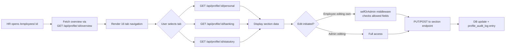

## 3.5 Current Implementation

| Layer | Detail |
|---|---|
| **Frontend Component** | `client/src/components/EmployeeProfileV2.jsx` — tab-driven 16-section viewer/editor |
| **Frontend Page** | Embedded in `client/src/pages/Employees.jsx` and `client/src/pages/EmployeePortalProfile.jsx` |
| **Backend Routes** | 16 route files in `backend/src/modules/employee-profile/` |
| **API Prefix** | All mounted at `/api/profile` |
| **Database Tables** | `users` (extended), `employee_qualifications`, `employee_experiences`, `employee_family_members`, `employee_emergency_contacts`, `employee_banking`, `employee_nominees`, `employee_government_docs`, `employee_immigration`, `employee_statutory`, `employee_health`, `employee_training`, `employee_certifications`, `employee_skills`, `profile_audit_log` |
| **External Integrations** | Cloudinary (government document uploads) |

## 3.6 Dependencies

- **Employee Management** — base `users` record must exist
- **Departments, Designations** — referenced in professional section
- **Branches** — referenced in overview and professional section
- **Settings / Feature Flags** — `statutory` feature flag required for statutory section
- **Cloudinary** — document file uploads in government docs section

## 3.7 Business Rules

- The `selfOrAdmin` middleware enforces field-level access control: employees editing their own profile may only update whitelisted personal fields (e.g., phone, address) — they cannot change their own role, salary, or statutory data
- Banking details have an `hr_verified` boolean flag — only HR can mark banking as verified; verified records are locked from employee self-edit
- Government document numbers (Aadhar, PAN) are stored in the `users` table as admin-only columns and not returned in public employee list queries
- All profile changes are recorded in `profile_audit_log` with timestamp and changed-by user ID
- Nominees must sum to 100% share total — this is a business rule not currently enforced by a database constraint

## 3.8 Maintenance Considerations

- The `profile_audit_log` table will grow over time — implement periodic archiving of records older than 2 years
- Government document upload URLs point to Cloudinary — if Cloudinary credentials change, existing URLs remain valid (CDN storage persists) but new uploads will fail
- The `hr_verified` flag on banking records should be reviewed whenever banking details are changed — verification is not automatically revoked on edit

## 3.9 Known Limitations

- Nominees' share percentage does not enforce 100% total at the database or API level
- Immigration section does not trigger expiry alerts — no automated notification before visa/passport expiry
- Training and certification records do not integrate with any external LMS
- Profile completeness percentage is not computed or displayed
- No document version control — uploading a new government document overwrites the URL reference without preserving the old one

## 3.10 Risks

| Risk | Severity |
|---|---|
| Sensitive data (Aadhar, PAN, bank account) stored in plain text | High |
| No expiry alerts for visas, passports, certifications | Medium |
| Audit log not purged — unbounded growth | Low |

## 3.11 Best Practices

> **Best Practice:** After any banking details change, require HR to re-verify the `hr_verified` flag before the next payroll run.

> **Best Practice:** Statutory section should be enabled only for organizations that require PF/ESI compliance. Enabling it for organizations without statutory obligations adds unnecessary data entry burden.

## 3.12 Future Enhancements

| Enhancement | Priority |
|---|---|
| Encrypt sensitive fields (Aadhar, PAN, bank account) at rest | High |
| Automated expiry alerts for visas, passports, certifications | High |
| Profile completeness percentage indicator | Medium |
| Document version history | Medium |
| Nominee share validation (must sum to 100%) | Medium |

---

# 4. Departments and Designations

## 4.1 Purpose

The Departments and Designations modules define the organizational structure within which employees operate. Departments represent functional units of the organization; designations represent job titles or levels within those units. Both are used for reporting, access segmentation, and HR analytics.

**Users Involved:** HR Admin, Root Admin  
**Problems Solved:** Provides organizational hierarchy data that enables department-based reporting, filtering, and team management

## 4.2 Access and Permissions

| Role | Access |
|---|---|
| Employee | Can view department name (read-only) |
| HR Admin | Full CRUD on departments and designations |
| Root Admin | Full CRUD on departments and designations |
| Feature Flag | None — always available |

## 4.3 Features

**Departments:**
- Create, edit, and delete departments
- Assign a department head (linked to a user)
- View all employees in a department
- Multi-department employee assignment via `user_departments` junction table

**Designations:**
- Create, edit, and delete designations
- Link designation to a parent department
- Assign designations to employees

## 4.4 Workflow

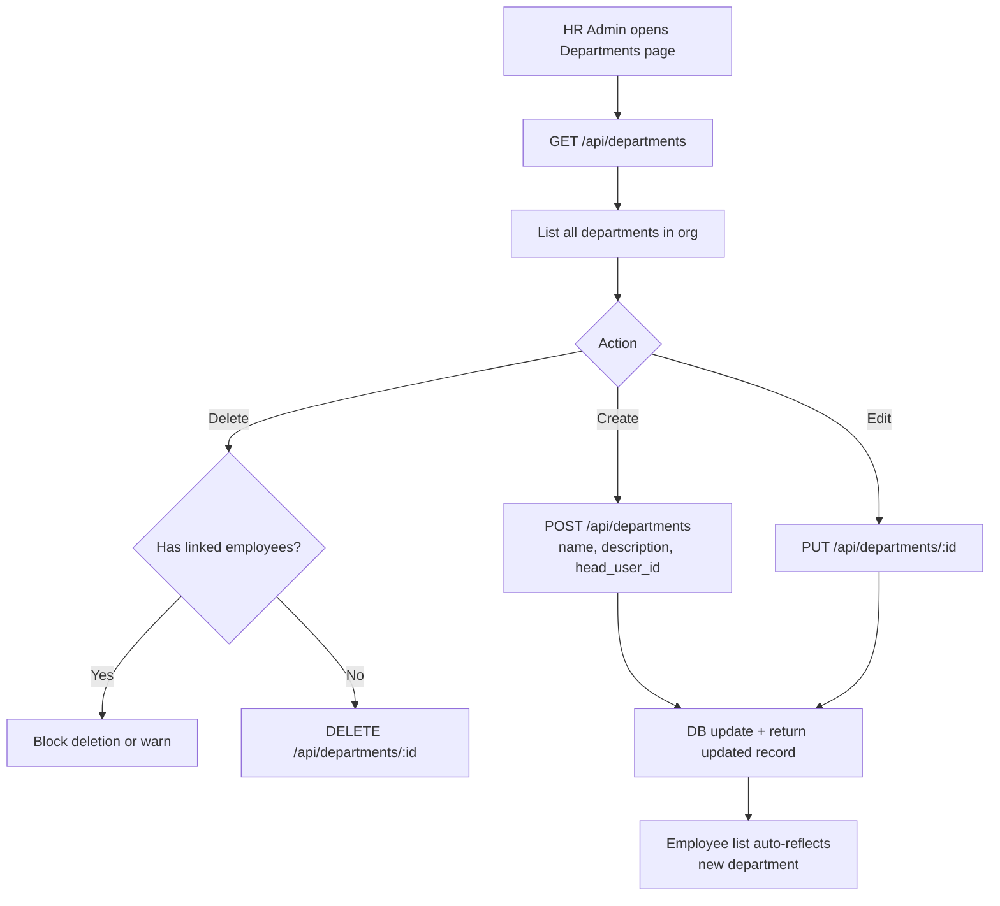

## 4.5 Current Implementation

| Layer | Detail |
|---|---|
| **Frontend Pages** | `client/src/pages/Departments.jsx` |
| **Backend Routes** | `backend/src/modules/departments/departments.routes.js`, `backend/src/modules/designations/designations.routes.js` |
| **Database Tables** | `departments`, `designations`, `user_departments` |
| **External Integrations** | None |

## 4.6 Dependencies

- **Employee Management** — employees are assigned to departments via `user_departments`
- **Reports Module** — department is a filter dimension in attendance reports
- **Dashboard** — department shown on employee cards

## 4.7 Business Rules

- A department can have one designated head (a user from any role)
- An employee can belong to multiple departments simultaneously (via `user_departments` junction table with `UNIQUE(user_id, department_id)` constraint)
- Deleting a department with assigned employees should be blocked — current implementation behavior depends on DB cascade rules (`ON DELETE SET NULL` on `users.department_id`)
- Designations are optional — employees can exist without a designation

## 4.8 Maintenance Considerations

- Unused departments and designations should be periodically reviewed and archived — no soft-delete mechanism exists; deletion is permanent
- When a department head leaves the organization, the `head_user_id` FK becomes a dangling reference if not updated — set to `NULL` via admin UI

## 4.9 Known Limitations

- No department hierarchy (parent/child departments) — flat structure only
- No department-level leave or attendance policies configurable per department
- No automatic notification when a department head changes

## 4.10 Risks

| Risk | Severity |
|---|---|
| Department deletion is permanent — no soft delete | Low |
| No department hierarchy for complex org structures | Low |

## 4.11 Best Practices

> **Best Practice:** Always assign a department head before adding employees to that department, ensuring the organization chart is accurate from the start.

## 4.12 Future Enhancements

| Enhancement | Priority |
|---|---|
| Department hierarchy (parent/child) | Medium |
| Department-level leave quota configuration | Medium |
| Org chart visualization using `reporting_to` and department heads | Low |

---

# 5. Attendance Management

## 5.1 Purpose

The Attendance Management module records employee presence, absence, check-in/check-out times, break periods, and working hours. It serves as the source of truth for workforce availability and feeds into payroll (LOP calculations), leave management (conflict detection), and HR reporting.

**Users Involved:** Employee (self check-in/out), HR Admin (view all, edit, admin operations), Root Admin  
**Problems Solved:** Eliminates manual attendance registers, automates late/early detection, and provides verifiable digital attendance records

## 5.2 Access and Permissions

| Role | Permissions |
|---|---|
| Employee | Check in, check out, break in, break out for own record; view own history |
| HR Admin | View all employee attendance; admin-edit any record; mark absent; mark late/early |
| Root Admin | Same as HR Admin |
| Feature Flag | None — always available |

## 5.3 Features

- Manual check-in and check-out via Employee Portal
- Break tracking: Break In → Break Out with break duration calculation
- Automatic late arrival flag (`is_late`) based on configurable `late_threshold`
- Automatic early exit flag (`is_early_exit`) based on configurable `early_exit_threshold`
- Automatic half-day detection: `status = 'half_day'` when `work_hours < half_day_hours`
- Admin attendance editing: correct times, status, and notes for any record
- Mark employee as absent manually
- Full attendance history with date range, month, or year filters
- `source` field records whether attendance came from `manual` or `biometric` input
- Break auto-close: if employee checks out with an active break, the break is automatically closed at checkout time
- Orphan cleanup: utility to remove incorrectly created leave-status attendance records

## 5.4 Workflow

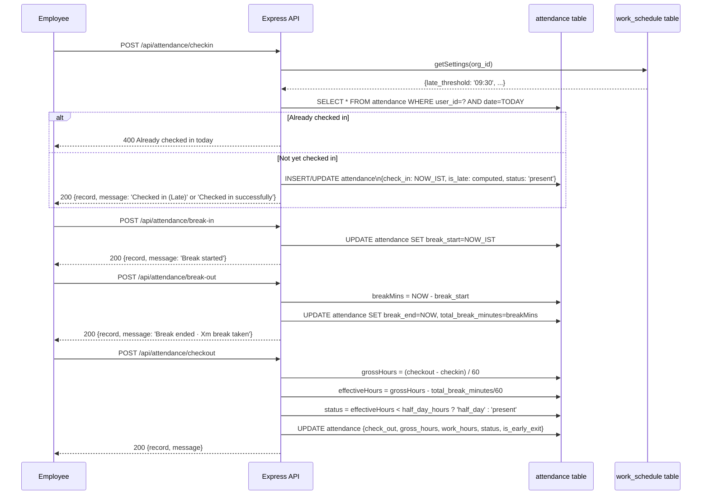

## 5.5 Current Implementation

| Layer | Detail |
|---|---|
| **Frontend Pages** | `client/src/pages/MyAttendance.jsx` (employee), `client/src/pages/Calendar.jsx` (admin view) |
| **Frontend Components** | `client/src/components/AttendanceDayModal.jsx` (reusable day detail modal) |
| **Backend Route** | `backend/src/modules/attendance/attendance.routes.js` |
| **Database Table** | `attendance` |
| **External Integrations** | None (biometric integration handled in Biometric Module) |

**Key Database Fields:**

| Field | Type | Description |
|---|---|---|
| `check_in` | TEXT (HH:MM) | Check-in time in IST |
| `check_out` | TEXT (HH:MM) | Check-out time in IST |
| `break_start` | TEXT (HH:MM) | Break start time |
| `break_end` | TEXT (HH:MM) | Break end time |
| `total_break_minutes` | INTEGER | Total break duration in minutes |
| `gross_hours` | NUMERIC | Raw hours: checkout − checkin |
| `work_hours` | NUMERIC | Effective hours: gross − break |
| `is_late` | BOOLEAN | Check-in after `late_threshold` |
| `is_early_exit` | BOOLEAN | Check-out before `early_exit_threshold` |
| `status` | TEXT | `present`, `absent`, `on_leave`, `half_day`, `wfh` |
| `source` | TEXT | `manual` or `biometric` |

## 5.6 Dependencies

- **Settings Module** — `work_schedule` for `late_threshold`, `early_exit_threshold`, `half_day_hours`
- **Leave Module** — leave approval updates attendance status to `on_leave` / `half_day` / `wfh`
- **Biometric Module** — writes to `attendance` with `source = 'biometric'`
- **Payroll Module** — reads `work_hours` for LOP calculation
- **Reports Module** — reads full attendance table for reporting

## 5.7 Business Rules

- A unique constraint on `(user_id, date, organization_id)` prevents duplicate attendance records
- Only one active break is allowed at a time (`break_start` without `break_end`)
- An open break at checkout time is automatically closed at the checkout timestamp
- `work_hours` = `gross_hours` − (`total_break_minutes` / 60)
- If `work_hours < half_day_hours` setting, status becomes `half_day`
- `is_early_exit` is set if checkout time is before `early_exit_threshold`
- Timezone for all time calculations is **IST only** — `localDateStr()` and `localTimeStr()` utilities enforce this

## 5.8 Maintenance Considerations

- Run the `POST /api/attendance/cleanup-orphaned` endpoint periodically (monthly recommended) to remove stale leave-status attendance records that no longer have a backing approved leave
- Biometric-sourced records bypass break tracking — breaks are only recorded via the manual portal
- If the server restarts between check-in and check-out, the attendance record remains open (no check-out) — HR must admin-edit these records manually

## 5.9 Known Limitations

- Only one break session per day is supported — multiple breaks overwrite the first break record
- Timezone is hardcoded to IST — cannot support employees in different timezones
- No real-time push notification to HR when an employee checks in late
- Historical attendance cannot be imported in bulk

## 5.10 Risks

| Risk | Severity |
|---|---|
| Multiple breaks per day not supported — second break overwrites first | Medium |
| Server restart leaves attendance records open | Low |
| No alert to HR when critical employees are absent | Low |

## 5.11 Best Practices

> **Best Practice:** Run the orphan cleanup utility at the beginning of every month to ensure attendance records are consistent with the leave database.

> **Best Practice:** After a server restart or maintenance window, audit open attendance records (records with `check_in` but no `check_out` for the previous business day) and close them via admin edit.

## 5.12 Future Enhancements

| Enhancement | Priority |
|---|---|
| Multiple break sessions per day | High |
| Real-time absent/late alert to HR | Medium |
| Bulk attendance import (CSV) | Medium |
| Overtime calculation and flagging | Medium |

---

# 6. Leave Management

## 6.1 Purpose

The Leave Management module handles the complete lifecycle of employee leave — from application through approval or rejection, balance tracking, and integration with the attendance system and Google Calendar. It supports multiple leave types and durations including full-day, half-day (first or second half), and Work from Home (WFH).

**Users Involved:** Employee (apply), HR Admin (approve/reject), Root Admin  
**Problems Solved:** Digitizes leave workflows, eliminates paper forms, provides real-time leave balance visibility, and ensures approved leaves are reflected in attendance records

## 6.2 Access and Permissions

| Role | Permissions |
|---|---|
| Employee | Apply, view own leave history, view leave balance |
| HR Admin | Approve, reject, view all leaves, filter by employee/type/date |
| Root Admin | Same as HR Admin; also sees cross-admin pending approvals |
| Feature Flag | None — always available |

## 6.3 Features

- Apply for leave with type, date range, reason, and duration (full/half/WFH)
- Half-day specification: first half or second half
- WFH leave type treated as a separate tracked category
- Pre-submission date conflict check (existing leave, existing attendance)
- Leave balance display (used days per type against annual quota)
- Approval workflow: HR approves or rejects with optional remarks
- On approval: attendance records auto-updated, Google Calendar event created
- On rejection: employee notified via email
- Leave history view for employees and admin
- Team leave view in calendar for HR
- Email notification on leave application and status change

## 6.4 Workflow

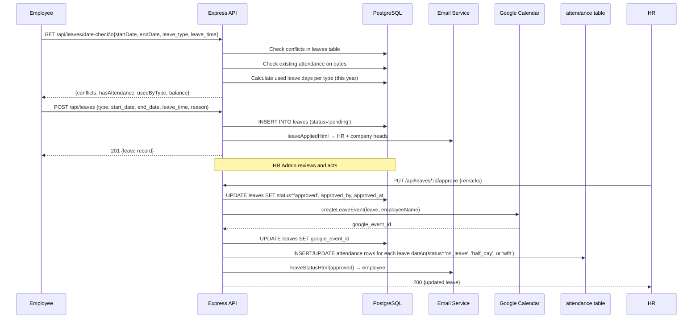

## 6.5 Current Implementation

| Layer | Detail |
|---|---|
| **Frontend Pages** | `client/src/pages/Leaves.jsx` (admin), `client/src/pages/MyLeaves.jsx` (employee) |
| **Backend Route** | `backend/src/modules/leaves/leaves.routes.js` |
| **Database Tables** | `leaves`, `attendance`, `leave_policies`, `organizations` |
| **External Integrations** | Nodemailer (email), Google Calendar API (event creation/deletion) |

**Leave Types Supported:**

| `leave_type` | Label |
|---|---|
| `annual` | Annual Leave |
| `sick` | Sick Leave |
| `casual` | Casual Leave |
| `emergency` | Emergency Leave |
| `other` | Other Leave |
| `wfh` | Work from Home |

**Leave Duration Types:**

| `leave_time` | Description |
|---|---|
| `full` | Full day leave |
| `half` | Half day (`half_type`: `first_half` or `second_half`) |
| `wfh` | Work from home (not deducted from leave balance) |

## 6.6 Dependencies

- **Leave Policies Module** — quota configuration per leave type (if feature enabled)
- **Attendance Module** — approved leaves create attendance records
- **Google Calendar** — optional; leave events synced if configured
- **Email Service** — notifications on application, approval, rejection
- **Settings Module** — work schedule used to skip weekends in leave day counting
- **Organization Settings** — `total_annual_leaves` from `organizations` table as default quota

## 6.7 Business Rules

- WFH and existing half-day leaves may coexist on the same date (different dimensions)
- Leave balance is calculated on-the-fly from approved leave records for the current year — no separate balance table
- Annual leave quota defaults to `organizations.total_annual_leaves` (default: 18) if no leave policy is configured
- Weekend days (Saturday=6, Sunday=0) are excluded from leave day count
- Attendance records are created for each working day in the approved leave date range
- Rejecting a leave does NOT reverse attendance records if the leave was previously approved
- Google Calendar event deletion is attempted on leave rejection/cancellation

## 6.8 Maintenance Considerations

- Leave balance is computed in real time for every date-check request — optimize by ensuring indexes on `(user_id, organization_id, status, start_date, end_date)` are present
- At year end, there is no automatic carryover or reset mechanism — a future enhancement
- Orphaned attendance records from rejected leaves must be cleaned up manually or via the cleanup endpoint

## 6.9 Known Limitations

- No leave carry-forward mechanism at year end (policy table has the field, but no automated processing)
- No minimum notice period enforcement (policy table has the field, but not validated in application logic)
- No maximum consecutive days enforcement
- Leave cancellation by employee after approval does not automatically delete the Google Calendar event reliably in all cases
- WFH is tracked but not enforced with any check-in requirement

## 6.10 Risks

| Risk | Severity |
|---|---|
| Leave policy rules (notice, max days) not enforced in code | Medium |
| No year-end carryover processing — manual intervention required | Medium |
| Google Calendar sync failure silently ignored | Low |

## 6.11 Best Practices

> **Best Practice:** Run the attendance cleanup utility at month-end to remove any orphaned attendance records from rejected or cancelled leaves.

> **Best Practice:** Confirm Google Calendar configuration before going live. While its failure is silent, inconsistent calendar entries cause confusion for HR teams using Google Calendar as their primary scheduling tool.

## 6.12 Future Enhancements

| Enhancement | Priority |
|---|---|
| Enforce leave policy rules (notice period, max consecutive) | High |
| Automated year-end leave carry-forward processing | High |
| Employee leave cancellation workflow | Medium |
| Leave encashment calculation | Medium |
| Comp-off tracking (compensatory leave) | Low |

---

# 7. Leave Policies

## 7.1 Purpose

Leave Policies define the rules, quotas, and conditions governing each leave type for an organization. This module allows HR Administrators to configure how many days of each leave type an employee is entitled to annually, whether carry-forward is permitted, whether documentation is required, and other behavioral rules.

**Users Involved:** HR Admin, Root Admin  
**Feature Flag:** `leave_policies` — not available on the Free plan

## 7.2 Access and Permissions

| Role | Access |
|---|---|
| Employee | No direct access; affected by policies when applying for leave |
| HR Admin | Full CRUD on leave policies |
| Root Admin | Full CRUD on leave policies |
| Feature Flag | `leave_policies` required |

## 7.3 Features

- Create leave type policies with annual quota, paid/unpaid classification
- Configure carry-forward rules (boolean + max carry-forward days)
- Set half-day eligibility per leave type
- Set document requirement (e.g., medical certificate for sick leave)
- Minimum notice period configuration (days)
- Maximum consecutive days configuration
- Accrual type (yearly, monthly)
- Activate/deactivate policies without deleting them

## 7.4 Current Implementation

| Layer | Detail |
|---|---|
| **Frontend Page** | `client/src/pages/LeavePolicies.jsx` |
| **Backend Route** | `backend/src/modules/leave-policies/leavePolicies.routes.js` |
| **Database Table** | `leave_policies` |
| **External Integrations** | None |

## 7.5 Business Rules

- Multiple policies can exist for the same organization but should have unique `leave_type` values
- Policy rules (minimum notice, maximum consecutive days) are stored but **not yet enforced** at the application logic level — this is noted as a known limitation

## 7.6 Known Limitations

> **Warning:** Leave policy rules for minimum notice period and maximum consecutive days are stored in the database but are **not currently validated** when an employee applies for leave. The policy data is visible to HR but does not automatically block non-compliant applications.

## 7.7 Future Enhancements

| Enhancement | Priority |
|---|---|
| Enforce minimum notice days at leave application | High |
| Enforce maximum consecutive days limit | High |
| Automated carry-forward at year end | High |
| Per-employee policy overrides (for senior staff) | Low |

---

# 8. Calendar

## 8.1 Purpose

The Calendar module provides a visual, date-based view of attendance events, approved leaves, holidays, and company events. It serves as the central planning tool for HR teams and employees to understand team availability at a glance.

**Users Involved:** HR Admin (full team view), Employee (team calendar in portal), Root Admin  
**Problems Solved:** Provides a unified timeline of all workforce events, replacing disparate spreadsheets and email chains

## 8.2 Access and Permissions

| Role | Access |
|---|---|
| Employee | Read-only team calendar (`/portal/team-calendar`) — shows approved leaves |
| HR Admin | Full calendar with all events, leaves, holidays, attendance |
| Root Admin | Same as HR Admin |
| Feature Flag | `google_calendar` for Google Calendar sync features |

## 8.3 Features

- FullCalendar-based interactive calendar (month, week, list views)
- Display of approved leaves, holidays, and company events
- Click-to-view day detail with `AttendanceDayModal`
- Google Calendar event fetch (if configured) — shows external calendar events
- Company event creation (synced to Google Calendar)
- Color-coded events by type: leaves, holidays, WFH, birthdays, company events

## 8.4 Current Implementation

| Layer | Detail |
|---|---|
| **Frontend Pages** | `client/src/pages/Calendar.jsx` (admin), `client/src/pages/TeamCalendar.jsx` (employee) |
| **Frontend Components** | `client/src/components/AttendanceDayModal.jsx` |
| **Backend Route** | `backend/src/modules/calendar/calendar.routes.js` |
| **Libraries** | FullCalendar v6 (daygrid, timegrid, list, interaction plugins) |
| **Database Tables** | `leaves`, `holidays`, `events`, `attendance` |
| **External Integrations** | Google Calendar API (fetch + create/update/delete events) |

## 8.5 Known Limitations

- Google Calendar events require service account configuration — not available on Free plan
- Team calendar shows all approved leaves but not pending leaves (by design)
- Calendar does not show biometric-sourced attendance events in real time

---

# 9. Holidays

## 9.1 Purpose

The Holidays module manages the organization's official holiday calendar. Holidays are excluded from leave day counting and are synced to Google Calendar for team visibility. Holiday reminders are automatically sent to all employees one day in advance via email and push notification.

**Users Involved:** HR Admin (CRUD), Root Admin, all employees (receive reminders)  
**Feature Flag:** None — always available

## 9.2 Features

- Create, edit, and delete holidays (name, date, type, description)
- Holiday types: public, optional, regional
- Google Calendar sync on create, edit, and delete
- Custom message (`specific_msg`) for holiday notifications
- Day-before reminder email to all employees (via daily cron)
- Day-before push notification to all users (via daily cron)

## 9.3 Workflow

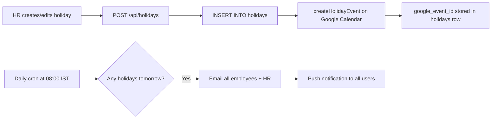

## 9.4 Current Implementation

| Layer | Detail |
|---|---|
| **Frontend Page** | `client/src/pages/Holidays.jsx` |
| **Backend Route** | `backend/src/modules/holidays/holidays.routes.js` |
| **Database Table** | `holidays` |
| **External Integrations** | Google Calendar API, Email Service, Push Service (via cron) |

## 9.5 Business Rules

- Holidays are used in leave day calculation to skip non-working days
- Holiday dates stored as `TEXT` in `YYYY-MM-DD` format (consistent with all date fields)
- Deleting a holiday triggers deletion of the corresponding Google Calendar event

## 9.6 Known Limitations

- No national holiday auto-import — holidays must be entered manually each year
- No multi-year holiday planning — past holidays remain in the database

---

# 10. Regularization

## 10.1 Purpose

Attendance Regularization allows employees to submit correction requests for attendance records where they forgot to check in/out or where an error occurred. HR Administrators review and approve or reject these requests, with the approved changes applied to the attendance record.

**Users Involved:** Employee (submit), HR Admin (approve/reject)  
**Feature Flag:** `regularization` — not available on the Free plan

## 10.2 Access and Permissions

| Role | Access |
|---|---|
| Employee | Submit own regularization requests; view request status |
| HR Admin | View all pending requests; approve or reject |
| Root Admin | Same as HR Admin |
| Feature Flag | `regularization` required |

## 10.3 Features

- Submit regularization request with date, requested check-in time, requested check-out time, and reason
- HR reviews: Approve (updates attendance record) or Reject (with reviewer notes)
- Status tracking: pending → approved / rejected
- Email notification on status change
- History view for employee and admin

## 10.4 Workflow

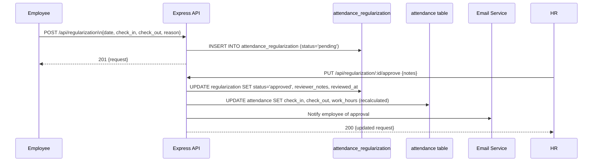

## 10.5 Current Implementation

| Layer | Detail |
|---|---|
| **Frontend Pages** | `client/src/pages/Regularization.jsx` (admin), `client/src/pages/MyAttendance.jsx` (employee submits from here) |
| **Backend Route** | `backend/src/modules/regularization/regularization.routes.js` |
| **Database Tables** | `attendance_regularization`, `attendance` |
| **External Integrations** | Nodemailer (notification email) |

## 10.6 Business Rules

- A regularization request may be submitted for any past date — there is no cutoff limit enforced
- On approval, the attendance record's `work_hours` is recalculated from the corrected check-in and check-out times
- If a regularization request conflicts with an approved leave on the same date, the behavior is not explicitly handled — HR should manually verify before approving

## 10.7 Known Limitations

> **Warning (from QA context):** Approving a regularization for a date that already has an approved leave may create an inconsistent state where both an attendance record and a leave record exist for the same date. Test this scenario explicitly.

- No submission cutoff window (e.g., requests should ideally only be allowed within 7 days of the date)
- No automated conflict check between regularization and existing approved leave

## 10.8 Future Enhancements

| Enhancement | Priority |
|---|---|
| Submission cutoff: allow regularization only within configurable window | Medium |
| Auto-check for leave conflicts before approval | Medium |
| Manager/team lead approval step before HR final approval | Low |

---

# 11. Payroll

## 11.1 Purpose

The Payroll module manages employee salary structures and generates monthly payslips. It supports Indian payroll components including basic salary, HRA, DA, allowances, and statutory deductions (PF, ESI, professional tax, TDS). Payslip generation includes Loss of Pay (LOP) calculation based on attendance.

**Users Involved:** HR Admin (manage all), Root Admin, Employee (view own payslips)  
**Feature Flag:** `payroll` — not available on Free plan

## 11.2 Access and Permissions

| Role | Access |
|---|---|
| Employee | View and download own payslips |
| HR Admin | Create/edit salary structures; generate payslips for all employees |
| Root Admin | Full payroll access |
| Feature Flag | `payroll` required |

## 11.3 Features

- Salary structure definition: basic, HRA, DA, transport, medical, other allowances
- Statutory deductions: PF (employee + employer), ESI (employee + employer), professional tax, TDS
- Multiple salary structures per employee (effective-from date versioning)
- Monthly payslip generation with LOP calculation
- Payslip fields: working days, present days, absent days, leave days, LOP days, LOP amount, gross salary, total deductions, net salary
- Payslip PDF URL storage (`pdf_url` field) for uploaded PDFs
- Employee payslip portal view and download

## 11.4 Workflow

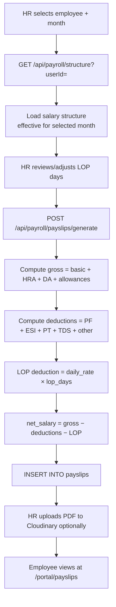

## 11.5 Current Implementation

| Layer | Detail |
|---|---|
| **Frontend Page** | `client/src/pages/Payroll.jsx` |
| **Backend Route** | `backend/src/modules/payroll/payroll.routes.js` |
| **Database Tables** | `payroll_structures`, `payslips` |
| **External Integrations** | Cloudinary (optional PDF upload) |

## 11.6 Business Rules

- Multiple salary structures per employee are stored; the most recent by `effective_from` date applies to the selected payslip month
- A unique constraint on `(user_id, month, year, organization_id)` prevents duplicate payslips for the same period
- LOP is a manual input — the system does not automatically calculate LOP from attendance records (this is a known limitation)
- Payslip `status` field: `generated` → can be further updated to `finalized` or `paid` (but no automated workflow for this transition exists currently)

## 11.7 Known Limitations

> **Warning (from QA context):** The last day of month in payroll route is hardcoded as `31`. Payslips generated for February and 30-day months may show incorrect date ranges. This is a known bug that affects short-month payroll generation.

- LOP is not automatically computed from attendance data — HR must manually enter LOP days
- No salary disbursement integration — the system generates payslips only; actual bank transfers are outside scope
- No statutory filing integration (EPFO, ESIC portals)
- No automated payroll run scheduling

## 11.8 Risks

| Risk | Severity |
|---|---|
| Hardcoded month-end as 31 causes incorrect payslip date ranges for Feb/30-day months | High |
| Manual LOP entry prone to human error | Medium |
| No audit trail for payslip modifications after generation | Medium |

## 11.9 Future Enhancements

| Enhancement | Priority |
|---|---|
| Fix month-end hardcoding — use correct days per month | Critical |
| Auto-calculate LOP from attendance data | High |
| Payslip finalization workflow with approval | Medium |
| Automated PDF payslip generation | Medium |
| EPFO/ESIC report export | Low |

---

# 12. Documents

## 12.1 Purpose

The Documents module provides a secure digital repository for employee-related HR documents — offer letters, contracts, performance appraisals, ID proofs, and any other files that need to be stored against an employee's record. Documents are stored on Cloudinary CDN and are accessible based on visibility settings.

**Users Involved:** HR Admin (upload/manage all), Employee (view own documents)  
**Feature Flag:** `documents` — available on Free plan and above

## 12.2 Access and Permissions

| Role | Access |
|---|---|
| Employee | View own documents based on visibility setting |
| HR Admin | Upload, view, edit, and share all documents |
| Root Admin | Same as HR Admin |
| Feature Flag | `documents` required |

## 12.3 Features

- Upload documents for any employee (Cloudinary storage)
- Document categories: offer letter, contract, appraisal, ID proof, certificate, other
- Document visibility control: `self` (employee only), `all` (everyone), `specific` (selected users), `admin_only`
- Document sharing with specific users via `document_shares` junction table
- Document expiry date tracking
- Status tracking: `pending_review`, `approved`, `rejected`
- File type and size metadata stored

## 12.4 Current Implementation

| Layer | Detail |
|---|---|
| **Frontend Page** | `client/src/pages/Documents.jsx` |
| **Backend Route** | `backend/src/modules/documents/documents.routes.js` |
| **Database Tables** | `employee_documents`, `document_shares` |
| **External Integrations** | Cloudinary (file upload and storage), Multer (upload handling) |

## 12.5 Business Rules

- Document visibility `admin_only` means only HR Admin and Root Admin can see the document
- `document_shares` allows per-user sharing for `visibility = 'specific'`
- Document `status` defaults to `pending_review` — HR must explicitly set it to `approved`
- File size limit: 10 MB (enforced by Multer middleware)

## 12.6 Known Limitations

- No document version history — uploading a new version creates a new record; old records must be deleted manually
- No document template generation — documents must be uploaded manually
- No expiry alert automation — documents near expiry do not trigger notifications

## 12.7 Future Enhancements

| Enhancement | Priority |
|---|---|
| Automated expiry notifications for critical documents | High |
| Document version history | Medium |
| Bulk upload capability | Medium |

---

# 13. Assets

## 13.1 Purpose

The Assets module tracks physical and digital assets owned by the organization — laptops, phones, accessories, software licenses — including their assignment to employees, condition, and purchase details.

**Users Involved:** HR Admin, Root Admin  
**Feature Flag:** `assets` — Platinum plan only

## 13.2 Features

- Asset creation with category, serial number, purchase date, purchase price, condition
- Assignment to employees with assignment date and expected return date
- Asset status: `available`, `assigned`, `under_repair`, `disposed`
- Asset condition tracking with notes
- Brand and model fields
- Return tracking

## 13.3 Current Implementation

| Layer | Detail |
|---|---|
| **Frontend Page** | `client/src/pages/Assets.jsx` |
| **Backend Route** | `backend/src/modules/assets/assets.routes.js` |
| **Database Table** | `assets` |
| **External Integrations** | None |

## 13.4 Known Limitations

- No asset depreciation calculation
- No automated return reminder when `return_date` approaches
- Employee cannot view or acknowledge assigned assets in the portal

## 13.5 Future Enhancements

| Enhancement | Priority |
|---|---|
| Employee asset acknowledgment in portal | High |
| Return date expiry alerts | Medium |
| Asset depreciation tracking | Low |

---

# 14. Expenses

## 14.1 Purpose

The Expenses module enables employees to submit reimbursement requests for business expenses, attach receipt images, and track approval status. HR Administrators review and approve or reject expense claims.

**Users Involved:** Employee (submit), HR Admin (approve/reject)  
**Feature Flag:** `expenses` — Platinum plan only

## 14.2 Features

- Submit expense claim with title, category, amount, date, description
- Receipt image upload (Cloudinary)
- Expense categories: travel, accommodation, meals, office supplies, other
- Approval workflow: pending → approved / rejected with reviewer notes
- Status tracking and history view for employees
- Admin view of all pending and historical claims

## 14.3 Workflow

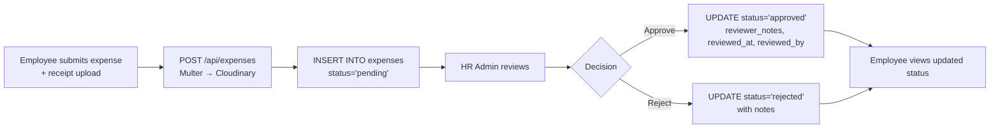

## 14.4 Current Implementation

| Layer | Detail |
|---|---|
| **Frontend Page** | `client/src/pages/Expenses.jsx` |
| **Backend Route** | `backend/src/modules/expenses/expenses.routes.js` |
| **Database Table** | `expenses` |
| **External Integrations** | Cloudinary (receipt upload) |

## 14.5 Known Limitations

- No email notification on expense status change — employee must check portal
- No expense report or monthly summary for finance teams
- No multi-level approval (manager → HR → finance)
- Receipt upload is optional — claims can be submitted without proof

## 14.6 Future Enhancements

| Enhancement | Priority |
|---|---|
| Email notification on expense approval/rejection | High |
| Monthly expense summary report | Medium |
| Mandatory receipt for amounts above threshold | Medium |

---

# 15. Reports

## 15.1 Purpose

The Reports module provides HR Administrators with exportable attendance and leave data for a selected period. Reports can be viewed in the browser or downloaded as CSV files for import into payroll tools, HR analytics platforms, or statutory filing systems.

**Users Involved:** HR Admin, Root Admin  
**Feature Flag:** `reports` — Gold and Platinum plans

## 15.2 Features

- Attendance report: per employee, per month or date range, with check-in/out times, work hours, gross hours, break minutes, late/early flags, status
- Live calculation for current-day open attendance (employee still checked in)
- CSV download for attendance data
- Leave report: leave history with type, dates, status, approved-by
- Filter by employee, month, year
- Source field included (`manual` vs `biometric`)

## 15.3 Current Implementation

| Layer | Detail |
|---|---|
| **Frontend Page** | `client/src/pages/Reports.jsx` |
| **Backend Route** | `backend/src/modules/reports/reports.routes.js` |
| **Database Tables** | `attendance`, `users`, `leaves` |
| **External Integrations** | None — data exported as CSV from backend |

## 15.4 Known Limitations

> **Warning (from QA context):** The XLSX export in reports uses a dev dependency — verify it is bundled correctly in production before testing exports.

- No payroll report (LOP summary by employee per month)
- No headcount report
- No department-wise aggregation
- No scheduled/automated report delivery (email or download)

## 15.5 Future Enhancements

| Enhancement | Priority |
|---|---|
| Payroll LOP summary report | High |
| Department-wise attendance aggregation | Medium |
| Scheduled report email delivery | Low |

---

# 16. Announcements

## 16.1 Purpose

Announcements allow HR Administrators and Root Admins to broadcast important messages — policy updates, event announcements, urgent notices — to all employees or targeted groups within the organization.

**Users Involved:** HR Admin, Root Admin (create), all employees (receive and view)  
**Feature Flag:** `announcements` — available from Free plan

## 16.2 Features

- Create announcements with title, content (rich text), type (general, policy, event, urgent), and priority (normal, high, critical)
- Target audience: all, department-specific
- Pin important announcements to the top of the feed
- Announcement expiry date (auto-hides after expiry)
- File attachment (PDF, image) uploaded to Cloudinary
- Employee portal announcement view (`/portal/announcements`)
- Push notification on new announcement (if push is configured)

## 16.3 Current Implementation

| Layer | Detail |
|---|---|
| **Frontend Page** | `client/src/pages/Announcements.jsx` |
| **Backend Route** | `backend/src/modules/announcements/announcements.routes.js` |
| **Database Table** | `announcements` |
| **External Integrations** | Cloudinary (file attachments), Push Service (optional notification) |

## 16.4 Known Limitations

- Department-specific targeting is stored in `target_audience` field but client-side filtering behavior should be verified for partial implementation
- No read/seen tracking per employee — no way to confirm who has seen an announcement
- No rich text editor on frontend — content is plain text

## 16.5 Future Enhancements

| Enhancement | Priority |
|---|---|
| Read/seen tracking per employee | High |
| Rich text editor (bold, lists, links) | Medium |
| Verified department-level targeting | Medium |

---

# 17. Notifications

## 17.1 Purpose

The Notifications module delivers real-time and scheduled notifications to employees and HR Administrators through two channels: in-app notifications (displayed in the notification center) and browser push notifications (delivered even when the browser tab is not open).

**Users Involved:** All users  
**Feature Flag:** `push_notifications` — for browser push only (Platinum plan)

## 17.2 Features

**In-App Notifications:**
- Notification center at `/notifications` for all users
- Unread count badge in sidebar (polled every 30 seconds)
- Mark as read, mark all as read
- Notification types: general, leave, attendance, announcement, system

**Browser Push Notifications:**
- VAPID-based Web Push (no third-party service required)
- Users subscribe via the portal (browser permission prompt)
- HR Admin can broadcast push to all users or specific users
- Daily cron delivers birthday and holiday push notifications
- Dead subscriptions (410/404 errors) automatically purged

## 17.3 Current Implementation

| Layer | Detail |
|---|---|
| **Frontend Pages** | `client/src/pages/NotificationCenter.jsx`, `client/src/pages/Broadcast.jsx` |
| **Frontend Hook** | `client/src/hooks/usePushNotification.js` |
| **Backend Routes** | `backend/src/modules/notifications/notifications.routes.js`, `backend/src/modules/push/push.routes.js` |
| **Services** | `backend/src/services/pushService.js` |
| **Database Tables** | `notifications`, `notifications_log`, `notification_recipients`, `push_subscriptions` |
| **External Integrations** | Browser Push Services (FCM/Mozilla/Apple via VAPID standard) |

## 17.4 Known Limitations

- Push notifications require HTTPS — unavailable in plain HTTP development environments without workaround
- Browser push requires user permission — if denied, cannot be re-requested automatically
- No per-user notification preferences or opt-out for specific notification types

## 17.5 Future Enhancements

| Enhancement | Priority |
|---|---|
| Per-user notification preference settings | Medium |
| WhatsApp or SMS fallback channel | Low |

---

# 18. Shifts and Roster

## 18.1 Purpose

The Shifts and Roster module enables organizations with shift-based work schedules to define named shift templates (with start and end times) and assign employees to specific shifts on specific dates, creating a visual shift roster.

**Users Involved:** HR Admin, Root Admin  
**Feature Flag:** `shifts` — Gold and Platinum plans

## 18.2 Features

- Create shift definitions (name, start time, end time, color, applicable days of week)
- Assign shifts to employees on specific dates (`shift_assignments` table)
- View roster by week or month
- Unique constraint: one shift assignment per employee per date
- Color-coded shift display

## 18.3 Current Implementation

| Layer | Detail |
|---|---|
| **Frontend Page** | `client/src/pages/Shifts.jsx` |
| **Backend Route** | `backend/src/modules/shifts/shifts.routes.js` |
| **Database Tables** | `shifts`, `shift_assignments` |
| **External Integrations** | None |

## 18.4 Known Limitations

- Shift assignments do not automatically update the attendance `late_threshold` — late calculation still uses the global work schedule
- No employee self-view of their assigned shift in the portal
- No shift swap or swap request workflow

## 18.5 Future Enhancements

| Enhancement | Priority |
|---|---|
| Per-shift late threshold override for attendance | High |
| Employee shift view in portal | Medium |
| Shift swap request workflow | Low |

---

# 19. Performance Management

## 19.1 Purpose

The Performance Management module is intended to support goal setting and periodic performance reviews for employees. It provides a structured framework for HR Administrators and managers to evaluate employee performance.

**Users Involved:** HR Admin, Root Admin, Employee  
**Feature Flag:** `performance` — Gold and Platinum plans

## 19.2 Current Implementation Status

> **⚠ Partial Implementation:** The Performance Management module has a UI, database tables, and basic route structure in place, but the backend implementation is limited. This module is confirmed as a stub in the QA context. Do not rely on it for production performance review workflows at this stage.

| Layer | Detail |
|---|---|
| **Frontend Page** | `client/src/pages/Performance.jsx` |
| **Backend Route** | `backend/src/modules/performance/performance.routes.js` |
| **Database Tables** | `performance_goals`, `performance_reviews` |

## 19.3 What Is Implemented

- Database schema for goals and reviews is in place
- Basic CRUD routes exist for goals and reviews
- Frontend page renders the module UI

## 19.4 What Is Not Implemented

- No review cycle automation (triggering reviews quarterly/annually)
- No manager → employee review flow
- No self-assessment workflow
- No final rating calculation logic
- No performance-to-payroll linkage
- No historical trend visualization

## 19.5 Risks

| Risk | Severity |
|---|---|
| Presenting this module to clients as functional may create incorrect expectations | High |

## 19.6 Future Enhancements

| Enhancement | Priority |
|---|---|
| Complete review cycle automation | High |
| Self-assessment + manager review dual workflow | High |
| Performance trend analytics | Medium |
| Rating → salary increment linkage | Low |

---

# 20. Onboarding

## 20.1 Purpose

The Onboarding module streamlines the new employee onboarding experience by creating structured task checklists assigned to different parties — the new employee, HR, IT, and the manager. It ensures that all critical onboarding steps are tracked and completed systematically.

**Users Involved:** HR Admin (initialize and manage), Employee (complete own tasks)  
**Feature Flag:** `onboarding` — Platinum plan only

## 20.2 Features

- Initialize onboarding checklist for a new employee with predefined default tasks
- Tasks assignable to: `employee`, `hr`, `it`, `manager`
- Task fields: title, description, due date, assigned-to, order index
- Mark tasks complete (with completion timestamp)
- Completion percentage tracking
- Employee views own onboarding tasks in portal

## 20.3 Workflow

```mermaid
flowchart TD
    A[HR Admin selects new employee] --> B[Click Initialize Onboarding]
    B --> C[POST /api/onboarding/init/:userId]
    C --> D[Create default checklist tasks\nfor employee / HR / IT / manager]
    D --> E[Email notification sent to employee]
    E --> F{Task Assignee}
    F -- employee --> G[Employee sees tasks in\n/portal/onboarding]
    F -- hr / it / manager --> H[Admin sees tasks in\n/onboarding page]
    G & H --> I[Mark task complete]
    I --> J[PUT /api/onboarding/:id/complete]
    J --> K[completed=true, completed_at=NOW()]
```

## 20.4 Current Implementation

| Layer | Detail |
|---|---|
| **Frontend Page** | `client/src/pages/Onboarding.jsx` |
| **Backend Route** | `backend/src/modules/onboarding/onboarding.routes.js` |
| **Database Table** | `onboarding_checklists` |
| **External Integrations** | Nodemailer (initialization notification) |

## 20.5 Known Limitations

- Default task templates are hardcoded in the backend — not configurable per organization
- No deadline enforcement or escalation — overdue tasks are visible but no alert is triggered
- Manager tasks have no mechanism to notify or assign to a specific manager user

## 20.6 Future Enhancements

| Enhancement | Priority |
|---|---|
| Configurable onboarding templates per organization | High |
| Overdue task alerts to HR and assignee | High |
| Specific manager assignment for manager tasks | Medium |

---

# 21. Exit Management

## 21.1 Purpose

The Exit Management module handles the structured offboarding of employees who resign or are terminated. It tracks the exit request, notice period, clearance from multiple departments, exit interview, and last working day.

**Users Involved:** Employee (initiate), HR Admin (manage all steps)  
**Feature Flag:** `exit_management` — Platinum plan only

## 21.2 Features

- Employee submits resignation with reason, resignation date, and notice period
- HR Admin reviews: approve, reject, or modify last working day
- Clearance tracking: IT clearance, HR clearance, Finance clearance, Admin clearance (boolean flags)
- Exit interview scheduling and notes
- Last working day tracking
- Status workflow: pending → approved / rejected

## 21.3 Workflow

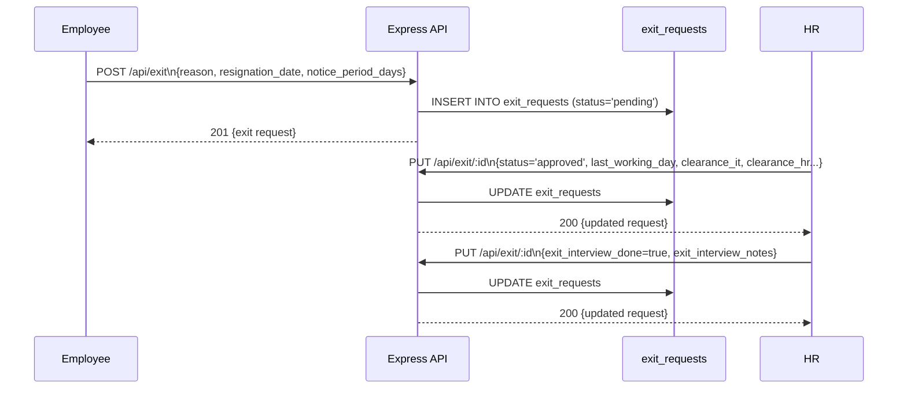

## 21.4 Current Implementation

| Layer | Detail |
|---|---|
| **Frontend Page** | `client/src/pages/ExitManagement.jsx` |
| **Backend Route** | `backend/src/modules/exit/exit.routes.js` |
| **Database Table** | `exit_requests` |
| **External Integrations** | None |

## 21.5 Known Limitations

- Approving an exit request does not automatically deactivate the employee account — HR must manually set `employee_status = 'inactive'` in the Employee module
- No automated notification to IT/Finance/Admin for clearance tasks
- No full and final settlement calculation integration with Payroll
- No gratuity or notice period pay calculation

## 21.6 Future Enhancements

| Enhancement | Priority |
|---|---|
| Auto-deactivate employee account on exit approval | High |
| Clearance task notifications to IT/Finance/Admin | High |
| Integration with Payroll for F&F settlement | Medium |

---

# 22. Biometric Integration

## 22.1 Purpose

The Biometric Integration module enables automatic attendance recording from ZKTeco hardware fingerprint/face recognition devices. Devices communicate with the HRMS via the ADMS (Attendance Data Management System) protocol, pushing punch records in real time. The system matches device PINs to employee records and updates attendance automatically.

**Users Involved:** HR Admin (device management, PIN mapping), Root Admin  
**Feature Flag:** `biometric` — Platinum plan only

## 22.2 Features

- ZKTeco device registration and management (name, serial number, location, branch, IP)
- Real-time online/offline status detection (based on `last_seen` timestamp within 5 minutes)
- Employee PIN-to-user mapping (`biometric_employee_map` table)
- Raw punch log storage (`biometric_raw_logs`) for audit and reprocessing
- Automatic attendance creation from check-in punches (punch_type=0)
- Automatic checkout update from check-out punches (punch_type=1)
- Leave guard: biometric punches are skipped if employee is on approved leave
- Reprocessing: manually trigger reprocessing of unmatched raw logs
- Biometric settings page showing device ADMS configuration URL

## 22.3 Workflow — See also `08_Biometric_Integration.md` for full detail

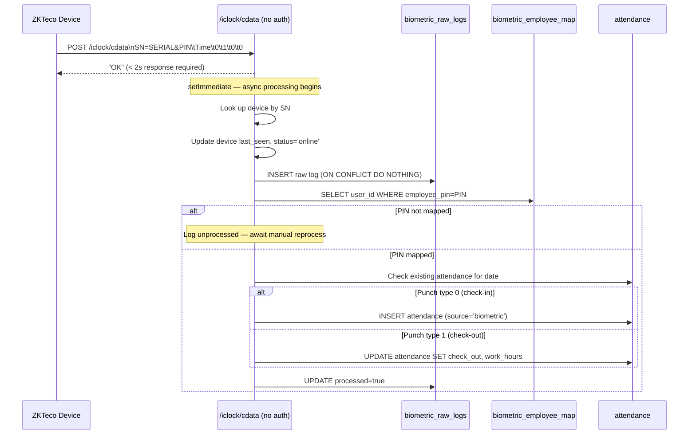

## 22.4 Current Implementation

| Layer | Detail |
|---|---|
| **Frontend Pages** | `BiometricDevices.jsx`, `BiometricPinMapping.jsx`, `BiometricLogs.jsx`, `BiometricSettings.jsx` |
| **Backend Routes** | `biometric.routes.js`, `biometricPush.handler.js`, `biometricHeartbeat.handler.js` |
| **ADMS Endpoints** | `POST /iclock/cdata` (no JWT), `GET /iclock/getrequest` (no JWT) |
| **Database Tables** | `biometric_devices`, `biometric_raw_logs`, `biometric_employee_map` |
| **External Integrations** | None — devices communicate directly to the VPS |

## 22.5 Business Rules

- `/iclock/cdata` must respond with `"OK"` within 2 seconds — processing is fully async
- Duplicate punch records (same device + time + PIN) are rejected with `ON CONFLICT DO NOTHING`
- Leave guard: if an employee has an approved leave/half-day/WFH record for the punch date, the punch is marked processed but attendance is not modified
- Punch type 0 = check-in; Punch type 1 = check-out
- If check-out punch arrives before check-in exists, an attendance record with only `check_out` is created for later reconciliation

## 22.6 Maintenance Considerations

- Biometric raw logs grow continuously — implement a quarterly archiving policy for processed logs older than 6 months
- Monitor `biometric_devices.last_seen` to detect devices that have gone offline silently
- Unprocessed logs (`processed = false`) indicate unmapped employees — run the reprocess endpoint after completing PIN mapping

## 22.7 Known Limitations

- The `/iclock/cdata` endpoint has no authentication — any HTTP client that knows the endpoint can inject fake punch data
- Break tracking from biometric is not supported — biometric only records check-in and check-out
- Multiple check-in punches (duplicate check-ins) are silently ignored; only the first check-in is recorded
- Device offline detection relies on the 5-minute `last_seen` threshold — devices that go silent between heartbeats appear offline after 5 minutes

## 22.8 Risks

| Risk | Severity |
|---|---|
| Unauthenticated biometric endpoint — spoofed punches possible | High |
| No IP allowlist for biometric device endpoints | High |

## 22.9 Best Practices

> **Best Practice:** Configure your network firewall or nginx `allow/deny` directives to restrict `/iclock/*` access to the known IP addresses of your ZKTeco devices only.

> **Best Practice:** After initial device setup, immediately map all employee PINs. Any punch from an unmapped PIN creates an unprocessed raw log that must be reprocessed manually.

---

# 23. Settings

## 23.1 Purpose

The Settings module allows HR Administrators and Root Admins to configure organization-level operational parameters — primarily the work schedule that governs attendance rules — and provides the biometric ADMS configuration endpoint URL for device setup.

**Users Involved:** HR Admin, Root Admin  
**Feature Flag:** None — always available

## 23.2 Features

- Work schedule configuration: start time, end time, late threshold, early exit threshold, half-day hour threshold, working days of week
- Biometric server configuration display (ADMS URL for ZKTeco device setup)
- Create or update work schedule (upsert pattern — one schedule per org)

## 23.3 Current Implementation

| Layer | Detail |
|---|---|
| **Frontend Page** | `client/src/pages/Settings.jsx` |
| **Backend Route** | `backend/src/modules/settings/settings.routes.js` |
| **Database Table** | `work_schedule` |
| **External Integrations** | None |

## 23.4 Business Rules

- Each organization has exactly one `work_schedule` row — the upsert pattern creates it if absent
- `work_days` is stored as a comma-separated string of day numbers (`'1,2,3,4,5'` = Mon–Fri)
- All time fields use `HH:MM` format (24-hour), consistent with attendance time fields
- `half_day_hours` defaults to 4.5 (hours of effective work = half day)

## 23.5 Known Limitations

- No per-department or per-employee schedule override — all employees share one work schedule
- No shift-to-schedule integration — shift assignments do not override work schedule for attendance calculations

---

# 24. Organization Management

## 24.1 Purpose

Organization Management covers the configuration and governance of an individual organization on the HRMS platform — from initial registration through ongoing settings management. This module enables Root Admins to configure org-level settings and enables the Platform Admin to provision and manage organizations.

**Users Involved:** Root Admin (org settings), Platform Admin (org provisioning)  
**Feature Flag:** None

## 24.2 Features

**Root Admin (Organization Settings):**
- View and update organization name, domain, logo URL
- Configure per-org SMTP settings (for custom email domain)
- Configure per-org Google Calendar integration
- Configure per-org VAPID push notification keys
- Set total annual leave entitlement
- View HR contacts

**Platform Admin (Organization Provisioning):**
- Review organization registration requests
- Approve requests (auto-creates org + root admin user + work schedule)
- Reject requests with reason
- Manage feature flags per organization
- Assign subscription plan (free/gold/platinum) with feature preset
- View all organizations, their users, and statistics

## 24.3 Workflow — New Org Registration

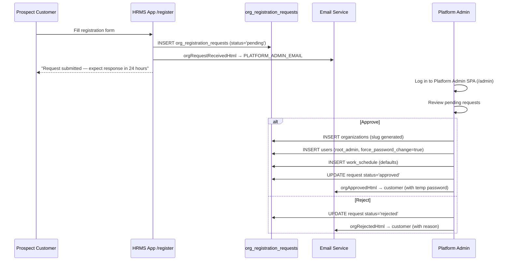

## 24.4 Current Implementation

| Layer | Detail |
|---|---|
| **Frontend Pages** | `client/src/pages/OrgSettings.jsx`, `client/src/pages/Register.jsx` |
| **Backend Routes** | `backend/src/modules/org/org.routes.js`, `backend/src/modules/platform/platform.routes.js` |
| **Database Tables** | `organizations`, `org_registration_requests`, `organization_features`, `platform_activity`, `platform_admins` |
| **External Integrations** | Nodemailer (registration and approval/rejection emails) |

## 24.5 Known Limitations

- Per-org SMTP settings are stored in the `organizations` table but the email service (`emailService.js`) uses global `.env` SMTP credentials only — per-org SMTP is not yet wired into the email service. This is a gap between schema capability and implementation.
- Per-org VAPID keys are stored but the push service uses global VAPID keys from `.env`

## 24.6 Risks

| Risk | Severity |
|---|---|
| Per-org SMTP/VAPID stored in DB but not used — email always comes from LumosLogic's server | Medium |

## 24.7 Future Enhancements

| Enhancement | Priority |
|---|---|
| Wire per-org SMTP into email service for white-label email delivery | High |
| Wire per-org VAPID keys into push service | Medium |

---

# 25. Module Dependency Matrix

The following matrix shows which modules depend on other modules for correct operation.

| Module | Depends On |
|---|---|
| **Dashboard** | Attendance, Leaves, Settings, Employees |
| **Employee Management** | Departments, Designations, Branches, Email Service, Cloudinary |
| **Employee Profile V2** | Employee Management, Departments, Designations, Branches, Cloudinary |
| **Attendance** | Settings (work_schedule), Leaves (conflict check), Biometric (source), Payroll (LOP input) |
| **Leave Management** | Attendance (auto-update on approval), Google Calendar, Email Service, Leave Policies, Settings |
| **Leave Policies** | Organization Management (plan/features) |
| **Calendar** | Leaves, Holidays, Events, Google Calendar |
| **Holidays** | Google Calendar, Email Service, Push Service (via cron) |
| **Regularization** | Attendance (target record to correct) |
| **Payroll** | Employee Management, Attendance (LOP source), Cloudinary (PDF) |
| **Documents** | Employee Management, Cloudinary |
| **Assets** | Employee Management |
| **Expenses** | Employee Management, Cloudinary |
| **Reports** | Attendance, Leaves, Employees |
| **Announcements** | Push Service, Cloudinary |
| **Notifications** | Push Service, All trigger modules |
| **Shifts** | Employee Management |
| **Performance** | Employee Management |
| **Onboarding** | Employee Management, Email Service |
| **Exit Management** | Employee Management |
| **Biometric** | Employee Management (PIN mapping), Attendance (target) |
| **Settings** | All attendance-related modules (work_schedule) |
| **Organization Management** | All modules (org_id scope), Email Service, Feature Flags |

---

# 26. Module Maturity Matrix

| Module | Status | Notes |
|---|:---:|---|
| Dashboard | ✅ Implemented | Production-ready |
| Employee Management | ✅ Implemented | Production-ready |
| Employee Profile V2 | ✅ Implemented | 16 sections, fully functional |
| Departments & Designations | ✅ Implemented | Production-ready |
| Attendance Management | ✅ Implemented | Manual + biometric sources |
| Leave Management | ✅ Implemented | Full lifecycle including Google Calendar sync |
| Leave Policies | ✅ Implemented | Data stored; enforcement rules not yet applied in code |
| Calendar | ✅ Implemented | Google Calendar sync optional |
| Holidays | ✅ Implemented | With auto-reminder cron |
| Regularization | ✅ Implemented | Full approval workflow |
| Payroll | ✅ Implemented | Has known bug on short-month payslip date range |
| Documents | ✅ Implemented | Cloudinary-backed |
| Assets | ✅ Implemented | Basic inventory; no depreciation |
| Expenses | ✅ Implemented | Receipt upload included |
| Reports | ✅ Implemented | CSV export; verify XLSX in production |
| Announcements | ✅ Implemented | With file attachments |
| Notifications | ✅ Implemented | In-app + Web Push |
| Shifts & Roster | ✅ Implemented | No late-threshold override |
| Performance Management | ⚠️ Partial | Schema + routes exist; business logic is stub |
| Onboarding | ✅ Implemented | Default templates hardcoded |
| Exit Management | ✅ Implemented | No auto-deactivation of employee account |
| Biometric Integration | ✅ Implemented | ZKTeco ADMS; no IP allowlist |
| Settings | ✅ Implemented | Work schedule only |
| Organization Management | ✅ Implemented | Per-org SMTP/VAPID not wired to services |
| Branches | ✅ Implemented | Basic CRUD; referenced by employees and devices |

**Legend:** ✅ Implemented &nbsp;|&nbsp; ⚠️ Partial &nbsp;|&nbsp; 🔲 Planned

---

# 27. Feature Flag Matrix

| Feature Key | Module | Free | Gold | Platinum | Enforced In |
|---|---|:---:|:---:|:---:|---|
| *(no flag)* | Dashboard | ✓ | ✓ | ✓ | — |
| *(no flag)* | Employee Management | ✓ | ✓ | ✓ | — |
| *(no flag)* | Attendance | ✓ | ✓ | ✓ | — |
| *(no flag)* | Leave Management | ✓ | ✓ | ✓ | — |
| *(no flag)* | Calendar | ✓ | ✓ | ✓ | — |
| *(no flag)* | Holidays | ✓ | ✓ | ✓ | — |
| *(no flag)* | Departments | ✓ | ✓ | ✓ | — |
| *(no flag)* | Settings | ✓ | ✓ | ✓ | — |
| `documents` | Documents | ✓ | ✓ | ✓ | `featureGate` + `FeatureRoute` |
| `announcements` | Announcements | ✓ | ✓ | ✓ | `featureGate` + `FeatureRoute` |
| `leave_policies` | Leave Policies | — | ✓ | ✓ | `featureGate` + `FeatureRoute` |
| `regularization` | Regularization | — | ✓ | ✓ | `featureGate` + `FeatureRoute` |
| `shifts` | Shifts & Roster | — | ✓ | ✓ | `featureGate` + `FeatureRoute` |
| `reports` | Reports | — | ✓ | ✓ | `featureGate` + `FeatureRoute` |
| `performance` | Performance | — | ✓ | ✓ | `featureGate` + `FeatureRoute` |
| `payroll` | Payroll | — | ✓ | ✓ | `featureGate` + `FeatureRoute` |
| `expenses` | Expenses | — | — | ✓ | `featureGate` + `FeatureRoute` |
| `assets` | Assets | — | — | ✓ | `featureGate` + `FeatureRoute` |
| `onboarding` | Onboarding | — | — | ✓ | `featureGate` + `FeatureRoute` |
| `exit_management` | Exit Management | — | — | ✓ | `featureGate` + `FeatureRoute` |
| `branches` | Branches | — | — | ✓ | `featureGate` + `FeatureRoute` |
| `biometric` | Biometric | — | — | ✓ | `featureGate` + `FeatureRoute` |
| `push_notifications` | Push Notifications | — | — | ✓ | `featureGate` + `FeatureRoute` |
| `google_calendar` | Calendar Sync | — | — | ✓ | `featureGate` + `FeatureRoute` |
| `statutory` | Statutory Profile Section | configurable | configurable | configurable | `FeatureRoute` |

> **Note:** Feature flags are enforced at **two levels**: (1) the `featureGate` backend middleware blocks API requests for disabled features, and (2) the `FeatureRoute` frontend wrapper replaces the page with a lock screen. Both must be consistent for complete protection.

---

# 28. Cross-Module Interaction Diagram

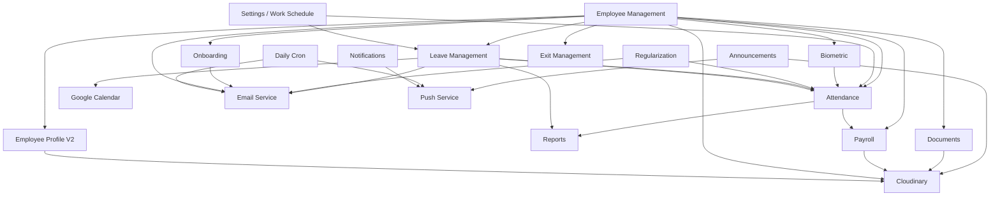

---

# 29. Operational Checklist

## New Organization Setup

- [ ] Organization created and approved via registration flow or directly in database
- [ ] `work_schedule` row created for the organization (start/end time, thresholds, working days)
- [ ] At least one department created before adding employees
- [ ] Feature flags configured per organization plan
- [ ] HR Admin account created and verified
- [ ] SMTP email delivery tested (via forgot-password flow)
- [ ] Google Calendar configured (if required by plan)
- [ ] VAPID keys configured (if push notifications required by plan)
- [ ] `total_annual_leaves` set in `organizations` table

## Module-Specific Pre-Go-Live Checks

- [ ] **Attendance:** Work schedule values verified (late_threshold, early_exit_threshold, half_day_hours)
- [ ] **Leave:** At least one leave type recognized (check `leave_policies` table if Gold/Platinum)
- [ ] **Biometric:** Device serial numbers registered; employee PINs mapped
- [ ] **Payroll:** Salary structures created for all employees before first payslip run
- [ ] **Documents:** Cloudinary credentials verified (test via document upload)
- [ ] **Onboarding:** Verified that init endpoint creates checklist tasks for new employees

## Ongoing Monthly Checks

- [ ] Run attendance orphan cleanup (`POST /api/attendance/cleanup-orphaned`)
- [ ] Verify biometric device `last_seen` timestamps — identify any offline devices
- [ ] Review unprocessed biometric raw logs (`processed = false`)
- [ ] Archive processed biometric logs older than 3 months
- [ ] Verify SSL certificate validity (`certbot certificates`)
- [ ] Check Docker container health (`docker compose ps`)

---

# 30. Document Summary

This document has provided a complete functional reference for all 24 HRMS modules including:

- Detailed purpose, workflow, implementation, and business rules for every module
- Accurate identification of modules that are fully implemented, partially implemented (Performance), or have known limitations
- Specific bugs called out: payroll month-end hardcoding, leave policy enforcement gaps, biometric endpoint security
- Cross-module dependency and interaction maps
- Feature flag and plan availability matrix
- Operational checklists for setup and ongoing maintenance

Key findings across all modules:
- **Performance Management** is the only stub module — do not present it as production-ready
- **Leave Policies** has rule enforcement gaps — notice period and max consecutive days are stored but not validated
- **Payroll** has a known bug with short-month payslip date ranges
- **Per-org SMTP** is a schema capability not yet wired to the email service
- **Biometric endpoint** needs IP allowlisting before production use

---

# 31. Related Documents

| Document | Relevance |
|---|---|
| `01_Executive_Summary.md` | Business context, feature plan matrix |
| `02_System_Architecture_Overview.md` | Technical architecture underpinning all modules |
| `04_Pending_Development_Tasks.md` | Detailed task list for all gaps identified in this document |
| `06_Security_Measures_and_Access_Control.md` | Detailed RBAC and permission implementation |
| `08_Biometric_Integration.md` | Deep dive into biometric architecture |
| `09_Database_Management_Guidelines.md` | Full schema reference for all module tables |

---

# 32. Review and Update Recommendations

| Trigger | Action |
|---|---|
| New module added | Add new section following the 12-point template |
| Module status changes (stub → implemented) | Update maturity matrix; remove limitation notes |
| New feature flag added | Update Feature Flag Matrix (Section 27) |
| Business rule changes | Update relevant Business Rules subsection |
| Bug fixed (e.g., payroll month-end) | Remove known limitation note; add to change log |
| Plan changes (feature included/excluded) | Update Feature Flag Matrix |

**Next Scheduled Review:** October 2026

---

*End of Document 03 — Module Overview*  
*Next: 04_Pending_Development_Tasks.md*
