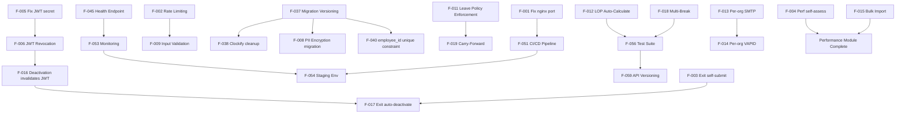

# 04 — Pending Development Tasks
## Lumos Logic HRMS — Complete Gap Analysis and Implementation Roadmap

---

**Document Version:** 1.0  
**Prepared By:** Lumos Logic  
**Date:** July 2026  
**Classification:** Confidential — Internal Development and Management  
**Audience:** Backend Developers, Frontend Developers, DevOps Engineers, Project Managers, QA Engineers  

> **Methodology:** Every finding in this document is derived from direct source code inspection, database schema analysis, and QA context review. No functionality has been invented or assumed. Each finding references the exact file, route, or schema element where the gap was identified. Findings are categorized as **Bug** (defect in existing code), **Partial Implementation** (code exists but is incomplete), **Missing Feature** (expected functionality does not exist), **Technical Debt** (working code that needs improvement), or **Recommended Enhancement** (new capability not currently scoped).

---

## Table of Contents

1. [Critical Issues](#1-critical-issues)
2. [Security Improvements](#2-security-improvements)
3. [Functional Gaps](#3-functional-gaps)
4. [UI/UX Improvements](#4-uiux-improvements)
5. [Performance Improvements](#5-performance-improvements)
6. [Database Improvements](#6-database-improvements)
7. [Backend Improvements](#7-backend-improvements)
8. [Frontend Improvements](#8-frontend-improvements)
9. [DevOps Improvements](#9-devops-improvements)
10. [Technical Debt](#10-technical-debt)
11. [Documentation Improvements](#11-documentation-improvements)
12. [Executive Summary](#12-executive-summary)
13. [Priority Matrix](#13-priority-matrix)
14. [Complexity vs. Business Value Matrix](#14-complexity-vs-business-value-matrix)
15. [Recommended Implementation Timeline](#15-recommended-implementation-timeline)
16. [Suggested Sprint Breakdown](#16-suggested-sprint-breakdown)
17. [Dependency Graph](#17-dependency-graph)
18. [Overall Project Health Score](#18-overall-project-health-score)
19. [Final Recommendations](#19-final-recommendations)

---

# 1. Critical Issues

Critical issues are defects or gaps that pose an immediate risk to system stability, data integrity, or security in a live production environment.

---

## F-001 — nginx Proxy Port Mismatch

### Module
Infrastructure / Deployment

### Category
Bug

### Current State
The nginx configuration file at `nginx/lumos.conf` contains `proxy_pass http://127.0.0.1:3005`. However, the Docker Compose file (`docker-compose.yml`) maps `"3000:3000"`, the `.env.production` sets `PORT=3000`, and the QA context confirms the application runs on port 3000. If the nginx config on the production VPS has not been manually corrected, all traffic is being proxied to a non-existent process on port 3005, making the application unreachable.

### Expected State
`proxy_pass http://127.0.0.1:3000` in the production nginx configuration.

### Impact
**Total service outage** if the VPS nginx config matches the file in the repository. All user-facing traffic is silently dropped.

### Root Cause
The nginx config file was not updated when the application port changed during a deployment refactor. The repository config diverged from the live server config.

### Recommended Solution
1. SSH into the VPS and run: `grep proxy_pass /etc/nginx/sites-enabled/*.conf`
2. If the port shows `3005`, update to `3000`
3. Run `sudo nginx -t && sudo nginx -s reload`
4. Update `nginx/lumos.conf` in the repository to `3000` to prevent regression
5. Add a CI check that verifies `PORT` in `.env.production` matches `proxy_pass` port in nginx config

### Dependencies
nginx, Docker Compose, Express application

### Priority
**Critical**

### Estimated Complexity
Low

### Suggested Phase
**Immediate — before any new deployments**

### Risks
Fixing nginx config on VPS while a deployment is in progress could cause a brief disruption.

---

## F-002 — No Rate Limiting on Authentication Endpoints

### Module
Authentication

### Category
Security Improvement / Bug

### Current State
The routes `POST /api/auth/login` and `POST /api/auth/forgot-password` in `backend/src/modules/auth/auth.routes.js` have no request rate limiting. An attacker can make unlimited login attempts per second from any IP address.

### Expected State
Rate limiting enforced: e.g., maximum 10 login attempts per IP per 15 minutes; maximum 5 forgot-password requests per IP per hour.

### Impact
System is vulnerable to credential brute-force attacks and denial-of-service via password reset email flooding. Confirmed in QA context: "No rate limiting on login: Automated credential testing will not hit a lockout."

### Root Cause
Rate limiting was not added during initial development. The omission is confirmed in the QA context as a known gap.

### Recommended Solution
Install `express-rate-limit` (no additional infrastructure required):
```javascript
const rateLimit = require('express-rate-limit');
const loginLimiter = rateLimit({
  windowMs: 15 * 60 * 1000,
  max: 10,
  message: { error: 'Too many login attempts. Please try again in 15 minutes.' },
});
router.post('/login', loginLimiter, async (req, res) => { ... });
```
Apply a separate, stricter limiter to `/forgot-password`.

### Dependencies
`express-rate-limit` package (npm)

### Priority
**Critical**

### Estimated Complexity
Low

### Suggested Phase
Phase 1

### Risks
May affect automated integration tests if they make rapid sequential requests — ensure test environments use a bypass mechanism.

---

## F-003 — Employee Cannot Self-Submit Exit Request

### Module
Exit Management

### Category
Bug

### Current State
The `POST /api/exit` route in `backend/src/modules/exit/exit.routes.js` uses the `adminOnly` middleware: `router.post('/', auth, adminOnly, async (req, res) => {`. This means only HR Admins and Root Admins can create exit requests. Employees attempting to submit their own resignation will receive a `403 Forbidden` response.

### Expected State
Employees should be able to submit their own resignation via the employee portal (`/portal/exit`). HR should be able to submit on behalf of an employee as well.

### Impact
The Exit Management module is entirely non-functional for employees in the portal. The `/portal/exit` page exists in the frontend but the backend rejects all employee-initiated submissions.

### Root Cause
The `adminOnly` guard was applied to the POST route, likely unintentionally, since the route body uses `req.user.id` for the `user_id` (implying employee self-submission was the original intent).

### Recommended Solution
Remove `adminOnly` from `POST /api/exit`. Add a check so employees can only create exit requests for themselves:
```javascript
router.post('/', auth, async (req, res) => {
  const targetUserId = isAdmin(req.user.role) && req.body.user_id
    ? req.body.user_id
    : req.user.id;
  // rest of handler...
});
```

### Dependencies
Exit Management module, Employee Portal

### Priority
**Critical**

### Estimated Complexity
Low

### Suggested Phase
Phase 1

### Risks
None — change is minimal and contained to one route.

---

## F-004 — Performance Review Self-Assessment Blocked from Employees

### Module
Performance Management

### Category
Bug

### Current State
The route `PUT /api/performance/reviews/:id` in `backend/src/modules/performance/performance.routes.js` uses `router.put('/reviews/:id', auth, adminOnly, ...)`. The handler code contains logic to handle `self_rating` and `self_comments` from employees, but since the route is guarded by `adminOnly`, employees can never call it. This is a code logic error — the handler has employee-specific branches that can never be reached.

### Expected State
Employees should be able to update their own `self_rating` and `self_comments` on a review assigned to them. Admin-only fields (manager rating, final rating, status) should remain admin-only.

### Impact
The self-assessment functionality of the performance review system is completely non-functional for employees. This is one of the reasons the Performance module is effectively a stub despite having backend code.

### Root Cause
`adminOnly` middleware applied to the entire PUT route instead of conditionally gating specific fields.

### Recommended Solution
Replace `adminOnly` with `auth` and add per-field role checks inside the handler (the handler already has this logic — just remove the middleware guard):
```javascript
router.put('/reviews/:id', auth, async (req, res) => {
  // Employee can only update self_rating and self_comments on own reviews
  // Admin can update all fields — existing logic already handles this
});
```

### Dependencies
Performance Management module, Employee Portal

### Priority
**Critical**

### Estimated Complexity
Low

### Suggested Phase
Phase 1

### Risks
Must verify that employees cannot update other employees' reviews — add `eq('user_id', req.user.id)` guard for non-admin users.

---

## F-005 — JWT Secret Has Weak In-Code Fallback

### Module
Authentication

### Category
Security Improvement / Bug

### Current State
In `backend/src/middleware/auth.js`:
```javascript
const JWT_SECRET = process.env.JWT_SECRET || 'leave-tracker-secret-2026';
```
If the `JWT_SECRET` environment variable is not set, the system silently falls back to a publicly visible, hardcoded weak secret. Any token signed with this default can be forged by anyone who reads the source code.

### Expected State
The application should **refuse to start** if `JWT_SECRET` is not set or is below a minimum length threshold (e.g., 32 characters).

### Recommended Solution
```javascript
const JWT_SECRET = process.env.JWT_SECRET;
if (!JWT_SECRET || JWT_SECRET.length < 32) {
  console.error('FATAL: JWT_SECRET must be set to at least 32 characters.');
  process.exit(1);
}
```

### Priority
**Critical**

### Estimated Complexity
Low

### Suggested Phase
Phase 1

---

# 2. Security Improvements

---

## F-006 — No JWT Revocation Mechanism

### Module
Authentication

### Category
Security Improvement

### Current State
JWTs are stateless and valid for 7 days from issuance. There is no mechanism to invalidate a token before expiry. If an employee is deactivated, their existing JWT remains valid until it naturally expires (up to 7 days). This also applies after password changes.

### Expected State
Token invalidation when: (1) employee is deactivated, (2) employee changes password, (3) admin explicitly revokes.

### Impact
A terminated employee can continue accessing the HRMS for up to 7 days after deactivation if they retain their JWT.

### Recommended Solution
Add a `token_version` integer column to `users`. Embed `token_version` in the JWT payload. On token verification, compare `decoded.token_version === user.token_version`. Increment `token_version` on password change, deactivation, or explicit revoke. This requires one DB query per request on the auth middleware — acceptable given current scale.
```sql
ALTER TABLE users ADD COLUMN IF NOT EXISTS token_version INTEGER DEFAULT 1;
```

### Dependencies
`auth.js` middleware, `users` table, all protected routes

### Priority
High

### Estimated Complexity
Medium

### Suggested Phase
Phase 1

### Risks
All existing tokens are invalidated when token_version is incremented — users must re-login. This is the correct and expected behavior.

---

## F-007 — Biometric Endpoint Has No Authentication or IP Restriction

### Module
Biometric Integration

### Category
Security Improvement

### Current State
`POST /iclock/cdata` and `GET /iclock/getrequest` are mounted in `server.js` without any authentication middleware. This is intentional because ZKTeco devices cannot send JWT headers. However, there is also no IP allowlisting — any HTTP client that knows the endpoint URL can inject arbitrary punch data.

### Expected State
Network-level IP allowlist restricting `/iclock/*` access to known ZKTeco device IP addresses only. This is enforced at the nginx layer, not in the application.

### Impact
Spoofed attendance data can be injected, causing incorrect attendance records and payroll calculations.

### Recommended Solution
In nginx config, add an `allow/deny` block specifically for the `/iclock/` location:
```nginx
location /iclock/ {
    allow 192.168.1.100;  # ZKTeco device 1 IP
    allow 192.168.1.101;  # ZKTeco device 2 IP
    deny all;
    proxy_pass http://127.0.0.1:3000;
}
```
Document all device IP addresses and update the allowlist whenever a device is added or replaced.

### Dependencies
nginx configuration, ZKTeco device static IP assignment

### Priority
High

### Estimated Complexity
Low

### Suggested Phase
Phase 1

---

## F-008 — Sensitive PII Stored in Plain Text

### Module
Employee Profile V2

### Category
Security Improvement

### Current State
Sensitive fields — Aadhar number (`aadhar_no`), PAN number (`pan_number`), UAN, bank account number (`bank_account_number`), IFSC code — are stored as plain text in the `users` table and `employee_banking` table. There is no field-level encryption.

### Expected State
Sensitive PII fields should be encrypted at rest using a field-level encryption approach (e.g., AES-256-GCM with a key stored in environment variables or a secrets manager).

### Impact
In the event of a database breach, all employee PII (government IDs, banking details) is immediately readable. This is a statutory data protection concern under Indian IT rules.

### Recommended Solution
Implement application-level field encryption for designated sensitive columns before write, decrypt on read. Use Node.js `crypto.createCipheriv` with AES-256-GCM. The encryption key should be stored in `ENCRYPTION_KEY` env variable, never in the database.
```javascript
const encrypt = (text) => {
  const iv = crypto.randomBytes(12);
  const cipher = crypto.createCipheriv('aes-256-gcm', Buffer.from(ENCRYPTION_KEY, 'hex'), iv);
  // ...
};
```

### Dependencies
Employee Profile V2, Employee Management, Payroll module

### Priority
High

### Estimated Complexity
High

### Suggested Phase
Phase 2

### Risks
Existing plain-text values must be migrated (encrypted) in a one-time data migration. This is irreversible — plan carefully with a tested rollback.

---

## F-009 — No Input Validation Library

### Module
All backend modules

### Category
Security Improvement / Technical Debt

### Current State
All request body validation throughout the backend is manual:
```javascript
if (!name || !email) return res.status(400).json({ error: '...' });
```
There is no schema-based validation library. Many endpoints have no validation at all for optional or nested fields. Type coercion errors (e.g., passing a string where a number is expected) silently produce `NaN` or `null`.

### Expected State
All POST and PUT endpoint bodies validated against a schema using `zod` or `joi` before reaching business logic.

### Impact
Invalid data (wrong types, oversized strings, unexpected characters) can corrupt the database or cause runtime errors. No sanitization of input strings creates a secondary injection risk.

### Recommended Solution
Introduce `zod` (preferred for TypeScript-compatible schemas) or `joi`. Create a `validate(schema)` middleware factory:
```javascript
const validate = (schema) => (req, res, next) => {
  const result = schema.safeParse(req.body);
  if (!result.success) return res.status(400).json({ error: result.error.format() });
  req.body = result.data;
  next();
};
```
Apply progressively, starting with the highest-risk endpoints: login, employee create/update, leave create, payslip generate.

### Dependencies
All backend route files

### Priority
High

### Estimated Complexity
High (broad surface area, requires per-endpoint schema definition)

### Suggested Phase
Phase 2

---

## F-010 — CORS Allowlist Contains Legacy Firebase Domains

### Module
Authentication / Infrastructure

### Category
Security Improvement / Technical Debt

### Current State
`backend/src/middleware/auth.js` `ALLOWED_ORIGINS` array contains:
```javascript
'https://leavetrackerbylumos.web.app',
'https://leavetrackerbylumos.firebaseapp.com',
'https://leavetracker-platform-admin.web.app',
'https://leavetracker-platform-admin.firebaseapp.com',
```
These are Firebase Hosting URLs from the previous architecture. The current production application is served from `hrms.lumoslogic.com`.

### Expected State
CORS allowlist should contain only currently active domains: `hrms.lumoslogic.com`, `localhost:5173`, `localhost:5174`, `localhost:3000` (dev only).

### Recommended Solution
Remove all Firebase domains from `ALLOWED_ORIGINS`. If the Platform Admin SPA is served from a separate domain, add only that domain explicitly.

### Priority
Medium

### Estimated Complexity
Low

### Suggested Phase
Phase 1

---

# 3. Functional Gaps

---

## F-011 — Leave Policy Rules Not Enforced in Application Logic

### Module
Leave Management, Leave Policies

### Category
Partial Implementation

### Current State
The `leave_policies` table has columns for `min_notice_days`, `max_consecutive_days`, `require_document`, `half_day_allowed`, and `accrual_type`. These values are stored and displayed but the `POST /api/leaves` handler in `leaves.routes.js` **does not read or apply** these rules when an employee submits a leave application.

### Expected State
When an employee applies for leave:
1. Check if the leave type allows half-day (if `half_day_allowed = false`, reject half-day applications for that type)
2. Check if minimum notice period is satisfied (`start_date - today >= min_notice_days`)
3. Check if the requested duration exceeds `max_consecutive_days`
4. If `require_document = true`, require a document upload or reference

### Impact
HR administrators configure policies believing they will be enforced. Employees can bypass all configured restrictions by simply submitting leave requests.

### Root Cause
Policy data model was built before the enforcement logic, and enforcement was deferred. The gap was never closed.

### Recommended Solution
In `POST /api/leaves`, after the conflict check, fetch the applicable leave policy for `leave_type` and validate:
```javascript
const { data: policy } = await supabase.from('leave_policies')
  .select('*').eq('organization_id', orgId(req))
  .eq('leave_type', leave_type).eq('active', true).maybeSingle();

if (policy) {
  const noticeCheck = Math.floor((new Date(start_date) - new Date()) / 86400000);
  if (policy.min_notice_days > 0 && noticeCheck < policy.min_notice_days)
    return res.status(400).json({ error: `Minimum notice of ${policy.min_notice_days} days required.` });
  // additional checks...
}
```

### Dependencies
Leave Management, Leave Policies

### Priority
High

### Estimated Complexity
Medium

### Suggested Phase
Phase 1

---

## F-012 — LOP Not Auto-Calculated from Attendance Data

### Module
Payroll

### Category
Missing Feature

### Current State
The payslip generation route (`POST /api/payroll/payslips/generate`) fetches attendance records for the month. It correctly counts `present`, `half_day`, and `absent` records. However, LOP (Loss of Pay) days must be **manually entered** by HR in the `other_deductions` or `lop_days` field — the system does not automatically compute LOP from the attendance data despite having all the information needed.

### Expected State
The system should automatically calculate `lop_days = totalWorkingDays - present_days - approved_leave_days`. HR should be able to override the auto-calculated value before finalizing.

### Impact
HR must manually count absent days and enter LOP for every employee every month — error-prone and time-consuming, especially for large organizations.

### Recommended Solution
The attendance data is already fetched during payslip generation. Extend the generation logic:
```javascript
const lopDays = Math.max(0, totalWorkingDays - presentDays - halfDayCount * 0.5 - approvedLeaveDays);
const dailyRate = grossSalary / totalWorkingDays;
const lopAmount = Math.round(lopDays * dailyRate * 100) / 100;
```
Send the computed `lop_days` as a suggestion; allow HR to override before confirming.

### Dependencies
Payroll, Attendance, Leave Management

### Priority
High

### Estimated Complexity
Medium

### Suggested Phase
Phase 1

---

## F-013 — Per-Organization SMTP Not Wired to Email Service

### Module
Organization Management, Email Service

### Category
Partial Implementation

### Current State
The `organizations` table has columns `smtp_host`, `smtp_port`, `smtp_user`, `smtp_pass`, `smtp_from`. The Organization Settings page (`OrgSettings.jsx`) allows Root Admins to configure these values. However, `backend/src/services/emailService.js` is hardcoded to use global environment variables (`process.env.SMTP_USER`, `process.env.SMTP_PASS`) and never reads per-org SMTP settings from the database.

### Expected State
When sending an email for a specific organization, `emailService` should check if the organization has its own SMTP configured and use it. Fall back to the platform SMTP only if none is configured.

### Impact
All organizational emails are sent from the LumosLogic platform email address regardless of what SMTP the client configures. White-label email delivery (e.g., hr@clientdomain.com) does not work.

### Root Cause
The database schema capability was built in advance of the service-layer implementation.

### Recommended Solution
Modify `sendMail()` to accept an optional `orgId` parameter. Before sending, query `organizations` for org-specific SMTP. If present, create a transporter using org settings; otherwise use the global transporter:
```javascript
async function sendMail({ to, subject, html, orgId }) {
  const transport = orgId
    ? await getOrgTransporter(orgId) || getTransporter()
    : getTransporter();
  // ...
}
```

### Dependencies
Email Service, Organization Management, all modules that send email

### Priority
High

### Estimated Complexity
Medium

### Suggested Phase
Phase 2

---

## F-014 — Per-Organization VAPID Keys Not Wired to Push Service

### Module
Organization Management, Push Notifications

### Category
Partial Implementation

### Current State
The `organizations` table has `vapid_public_key` and `vapid_private_key` columns. The OrgSettings page allows Root Admins to configure these. However, `backend/src/services/pushService.js` uses only the global `VAPID_PUBLIC_KEY` and `VAPID_PRIVATE_KEY` environment variables.

### Expected State
Push subscriptions and notifications should use the org-specific VAPID keys if configured.

### Impact
Clients cannot use their own VAPID keys for push notifications. All push notifications appear to come from the LumosLogic platform.

### Priority
Medium

### Estimated Complexity
Medium

### Suggested Phase
Phase 2

---

## F-015 — No Bulk Employee Import

### Module
Employee Management

### Category
Missing Feature

### Current State
Employees can only be created one at a time via the admin UI (`POST /api/employees`). There is no CSV/Excel import functionality in the backend or frontend.

### Expected State
HR should be able to upload a CSV file with employee data (name, email, department, position, join date) and have multiple employees created in a single operation.

### Impact
Organizations onboarding with 50+ employees face significant manual data entry. This is a common bottleneck during initial platform adoption.

### Recommended Solution
Create `POST /api/employees/bulk-import` that accepts a multipart CSV upload via Multer. Parse the CSV, validate each row, bulk-insert valid rows, and return a result summary (success count, failed rows with reasons). Add a corresponding UI upload component in the Employees page.

### Dependencies
Employee Management, Email Service (bulk welcome emails)

### Priority
High

### Estimated Complexity
Medium

### Suggested Phase
Phase 2

---

## F-016 — Employee Deactivation Does Not Invalidate Active JWT

### Module
Employee Management, Authentication

### Category
Missing Feature / Security Improvement

### Current State
When an HR Admin sets `employee_status = 'inactive'` for an employee, the employee's existing JWT token remains valid for up to 7 days. The `auth` middleware only verifies JWT signature and expiry — it does not check `employee_status` against the database.

### Expected State
Active JWTs for deactivated employees should be rejected immediately. The auth middleware should perform a lightweight check for employee status on each request, or a token versioning scheme should invalidate all existing tokens.

### Recommended Solution
See F-006 (JWT token versioning). As a simpler interim solution, add a check in the `auth` middleware:
```javascript
// Lightweight: add employee_status check (adds 1 DB query per request)
const { data: user } = await supabase.from('users')
  .select('employee_status').eq('id', decoded.id).maybeSingle();
if (user?.employee_status === 'inactive')
  return res.status(401).json({ error: 'Account has been deactivated.' });
```

### Dependencies
`auth.js` middleware, Employee Management

### Priority
High

### Estimated Complexity
Low (interim) / Medium (token versioning)

### Suggested Phase
Phase 1

---

## F-017 — Exit Approval Does Not Auto-Deactivate Employee

### Module
Exit Management

### Category
Missing Feature

### Current State
When an HR Admin approves an exit request (`PUT /api/exit/:id`), the `exit_requests` record is updated but the employee's `users.employee_status` remains `'active'`. HR must manually navigate to Employee Management and set the status to `'inactive'`.

### Expected State
On exit request approval, the employee's `employee_status` should automatically be set to `'inactive'` on the employee's last working day.

### Recommended Solution
In the exit approval handler, after updating the exit request status, update the user record:
```javascript
if (status === 'approved' && last_working_day) {
  await supabase.from('users')
    .update({ employee_status: 'inactive' })
    .eq('id', exit_request.user_id);
}
```

### Priority
High

### Estimated Complexity
Low

### Suggested Phase
Phase 1

---

## F-018 — Single Break Session Per Day Only

### Module
Attendance Management

### Category
Missing Feature

### Current State
The attendance table has a single `break_start` and `break_end` column pair. The break-in route checks `if (record.break_start && !record.break_end)` to prevent a second break from starting while one is active. However, once a break ends, a second break cannot be started because the `break_start` field is already populated.

### Expected State
Multiple break sessions per working day should be supported. Each break should be recorded separately, with the total break time accumulated in `total_break_minutes`.

### Impact
Employees who take multiple short breaks (e.g., tea break + lunch break) can only record one. The second break is silently lost. Effective work hours are over-reported.

### Recommended Solution
Two approaches:
1. **Simple:** Create a separate `attendance_breaks` table with `(attendance_id, break_start, break_end, duration_minutes)` — one row per break session. Compute `total_break_minutes` from this table.
2. **Simple interim:** Store breaks as a JSONB array in `attendance.breaks` column.

Option 1 is preferred for query simplicity.

### Dependencies
Attendance, Reports

### Priority
High

### Estimated Complexity
Medium

### Suggested Phase
Phase 2

---

## F-019 — Year-End Leave Carry-Forward Not Automated

### Module
Leave Management, Leave Policies

### Category
Missing Feature

### Current State
The `leave_policies` table has `carry_forward BOOLEAN DEFAULT FALSE` and `max_carry_forward INTEGER DEFAULT 0` columns. Leave balance is calculated on-the-fly from approved leaves for the current year. There is no year-end processing that carries forward unused balance to the next year.

### Expected State
At year-end (or configurable rollover date), for each organization, for each employee, for each leave type with `carry_forward = true`: calculate unused balance, cap at `max_carry_forward`, and create a carry-forward leave credit record for the new year.

### Recommended Solution
Add a year-end carry-forward cron job or a manual admin trigger:
1. Create a `leave_carry_forward` table: `(user_id, leave_type, year, carried_days, org_id)`
2. At year-end, compute unused balance per employee per leave type
3. Insert carry-forward records
4. Modify the balance calculation to also add carry-forward credits to the current year quota

### Priority
High

### Estimated Complexity
High

### Suggested Phase
Phase 2

---

## F-020 — No Employee Self-Initiated Leave Cancellation

### Module
Leave Management

### Category
Missing Feature

### Current State
Employees can apply for leave and view its status but cannot cancel a pending or approved leave. Only HR Admins can modify or delete leave records.

### Expected State
Employees should be able to cancel a pending leave (pre-approval). Cancelling an approved leave should require HR approval to reverse the attendance records and Google Calendar event.

### Recommended Solution
Add `PATCH /api/leaves/:id/cancel` endpoint:
- If `status = 'pending'`: allow employee to cancel directly (set `status = 'cancelled'`)
- If `status = 'approved'`: create a cancellation request for HR to approve

### Priority
Medium

### Estimated Complexity
Medium

### Suggested Phase
Phase 2

---

## F-021 — Onboarding Task Templates Are Hardcoded

### Module
Onboarding

### Category
Partial Implementation

### Current State
The `DEFAULT_TASKS` array in `backend/src/modules/onboarding/onboarding.routes.js` is hardcoded with 16 fixed tasks (5 employee, 4 HR, 2 IT, 4 manager). Every organization that uses onboarding gets the exact same tasks — there is no way to customize or create organization-specific templates.

### Expected State
HR Admins should be able to define custom onboarding task templates per organization. When initializing onboarding for a new employee, the system should use the org's custom template, falling back to defaults if none exists.

### Recommended Solution
Create an `onboarding_templates` table:
```sql
CREATE TABLE onboarding_templates (
  id BIGSERIAL PRIMARY KEY,
  organization_id BIGINT NOT NULL REFERENCES organizations(id),
  title TEXT NOT NULL,
  assigned_to TEXT DEFAULT 'employee',
  order_index INTEGER DEFAULT 0
);
```
The `/init/:userId` endpoint should query this table first, then fall back to `DEFAULT_TASKS`.

### Priority
Medium

### Estimated Complexity
Medium

### Suggested Phase
Phase 2

---

## F-022 — No Shift-to-Attendance Late Threshold Integration

### Module
Shifts and Roster, Attendance

### Category
Missing Feature

### Current State
When a shift is assigned to an employee for a specific date (`shift_assignments` table), the attendance check-in `is_late` flag is still calculated using the global `work_schedule.late_threshold` — not the assigned shift's `start_time`. An employee assigned to a 2 PM shift who checks in at 2:05 PM would be incorrectly flagged as late based on the 9:30 AM global threshold.

### Expected State
The attendance check-in logic should check if the employee has a shift assignment for today. If so, use the shift's `start_time + grace_period` as the effective late threshold.

### Recommended Solution
In `POST /api/attendance/checkin`, before determining `is_late`:
```javascript
const { data: shiftAssign } = await supabase.from('shift_assignments')
  .select('shifts(start_time)').eq('user_id', req.user.id).eq('date', today).maybeSingle();
const effectiveThreshold = shiftAssign?.shifts?.start_time
  ? addMinutes(shiftAssign.shifts.start_time, 15) // 15 min grace
  : settings.late_threshold;
const is_late = toMinutes(timeStr) > toMinutes(effectiveThreshold);
```

### Priority
Medium

### Estimated Complexity
Low

### Suggested Phase
Phase 2

---

## F-023 — No Expense Status Change Email Notification

### Module
Expenses

### Category
Missing Feature

### Current State
When an HR Admin approves or rejects an expense claim, only the database record is updated. No email notification is sent to the employee informing them of the decision.

### Expected State
On approval or rejection, an email should be sent to the employee with the decision and any reviewer notes.

### Impact
Employees have no awareness of expense decisions unless they actively check the portal. This delays reimbursement follow-up.

### Priority
Medium

### Estimated Complexity
Low

### Suggested Phase
Phase 1

---

## F-024 — No Document or Certification Expiry Notifications

### Module
Documents, Employee Profile V2

### Category
Missing Feature

### Current State
Documents have an `expiry_date` field and profile certifications/immigration records have expiry dates. No automated process checks these fields and alerts HR before expiry.

### Expected State
A scheduled job (integrated into the existing daily cron or a separate weekly cron) should check for documents and certifications expiring within 30 and 7 days and send email alerts to HR.

### Priority
Medium

### Estimated Complexity
Medium

### Suggested Phase
Phase 2

---

## F-025 — Nominee Share Percentage Has No Validation

### Module
Employee Profile V2

### Category
Missing Feature

### Current State
Employees can add multiple nominees with a `percentage` field (share of PF/gratuity nomination). The system does not validate that the total percentage across all nominees equals 100%.

### Expected State
On adding or updating a nominee, the system should compute the total share for the employee and enforce that the sum equals 100% (or at most 100%).

### Recommended Solution
In the nominees route, after insert/update, query the total percentage for the user and return a warning or error if it does not equal 100.

### Priority
Low

### Estimated Complexity
Low

### Suggested Phase
Phase 2

---

## F-026 — No Regularization Submission Cutoff Window

### Module
Regularization

### Category
Missing Feature

### Current State
An employee can submit a regularization request for any date in the past — including dates from months or years ago — with no restriction. There is no configurable time window (e.g., "regularization must be submitted within 7 days of the date").

### Expected State
A configurable submission window should be enforced. Requests for dates older than the window should be rejected with a clear message.

### Priority
Low

### Estimated Complexity
Low

### Suggested Phase
Phase 3

---

# 4. UI/UX Improvements

---

## F-027 — HR Admin Dashboard Has No Auto-Refresh

### Module
Dashboard

### Category
UI/UX Improvement

### Current State
The Dashboard fetches data once on page load. If an employee checks in or a leave is approved while the admin is viewing the dashboard, the numbers do not update until the page is manually refreshed or revisited.

### Expected State
Dashboard statistics should auto-refresh every 5 minutes via React Query's `refetchInterval` configuration.

### Recommended Solution
In `Dashboard.jsx`, configure the React Query hook:
```javascript
const { data } = useQuery({
  queryKey: ['dashboard', selectedDate],
  queryFn: () => apiGet('/dashboard', { date: selectedDate }),
  refetchInterval: 5 * 60 * 1000,  // 5 minutes
});
```

### Priority
Medium

### Estimated Complexity
Low

### Suggested Phase
Phase 1

---

## F-028 — No Announcement Read/Seen Tracking

### Module
Announcements

### Category
UI/UX Improvement

### Current State
Announcements are displayed to all employees but there is no record of which employees have read which announcements. HR has no visibility into announcement engagement.

### Expected State
A `announcement_reads` table (`announcement_id`, `user_id`, `read_at`) tracking per-user acknowledgement. An "unread" badge on the announcement list. HR can see a read count per announcement.

### Priority
Medium

### Estimated Complexity
Medium

### Suggested Phase
Phase 2

---

## F-029 — Performance Module Shows Empty State Without Context

### Module
Performance Management

### Category
UI/UX Improvement

### Current State
The Performance page (`Performance.jsx`) loads and displays empty states (no goals, no reviews). Since the module is in early implementation, there is no indication to users or admins that this is an incomplete feature.

### Expected State
The page should either display a prominent "Coming Soon" or "Feature in Progress" banner, or be explicitly disabled in the platform configuration until the backend implementation is complete.

### Priority
Medium

### Estimated Complexity
Low

### Suggested Phase
Phase 1

---

## F-030 — No Profile Completeness Indicator

### Module
Employee Profile V2

### Category
UI/UX Improvement

### Current State
The Employee Profile V2 has 16 sections but there is no indicator showing which sections are complete or what percentage of the profile has been filled. Employees and HR have no visual prompt to complete missing sections.

### Expected State
A profile completeness percentage (e.g., "Profile 65% complete — add banking details and education to complete your profile") displayed on the profile overview page.

### Priority
Low

### Estimated Complexity
Medium

### Suggested Phase
Phase 3

---

## F-031 — No First-Time Setup Wizard for New Organizations

### Module
Organization Management, Settings

### Category
UI/UX Improvement

### Current State
When a new Root Admin logs in for the first time, they see the full HR dashboard but must discover on their own that they need to configure work schedules, add departments, and create employees before the system is usable.

### Expected State
A guided setup wizard that walks Root Admins through: (1) Configure work schedule, (2) Add departments, (3) Add first employee, (4) Configure email, (5) (Optional) Biometric setup.

### Priority
Low

### Estimated Complexity
High

### Suggested Phase
Phase 3

---

## F-032 — No Announcement Rich Text Editor

### Module
Announcements

### Category
UI/UX Improvement

### Current State
Announcement content is plain text. No formatting (bold, lists, links, headings) is supported.

### Expected State
A lightweight rich text editor (e.g., `@tiptap/react` or `react-quill`) for announcement content creation.

### Priority
Low

### Estimated Complexity
Medium

### Suggested Phase
Phase 3

---

# 5. Performance Improvements

---

## F-033 — Dashboard Query Pattern May Cause Sequential Round-Trips

### Module
Dashboard

### Category
Performance Improvement

### Current State
The `GET /api/dashboard` handler in `dashboard.routes.js` executes multiple sequential database calls: employees fetch → attendance fetch → approved leaves fetch → settings fetch → activity feed fetch. Under high employee counts (500+), these queries run in sequence, increasing total response time.

### Expected State
Queries that do not depend on each other should run in parallel using `Promise.all()`.

### Recommended Solution
```javascript
const [empResult, attResult, leaveResult, settingsResult] = await Promise.all([
  supabase.from('users').select('id, name...').eq('role', 'employee').eq('organization_id', orgId(req)),
  supabase.from('attendance').select('*').eq('date', today).eq('organization_id', orgId(req)),
  supabase.from('leaves').select('...').eq('organization_id', orgId(req))...
  getSettings(orgId(req)),
]);
```

### Priority
Medium

### Estimated Complexity
Low

### Suggested Phase
Phase 1

---

## F-034 — Employee Search Uses ILIKE Without Full-Text Index

### Module
Employee Management

### Category
Performance Improvement

### Current State
Employee search (in GlobalSearchModal and the Employees list) likely uses `ILIKE '%query%'` pattern matching. This performs a full table scan and does not use any index. For organizations with thousands of employees, this degrades significantly.

### Expected State
A PostgreSQL `pg_trgm` trigram index on `users.name` and `users.email` to support fast ILIKE queries. For larger deployments, a `tsvector` full-text search index.

### Recommended Solution
```sql
CREATE EXTENSION IF NOT EXISTS pg_trgm;
CREATE INDEX IF NOT EXISTS idx_users_name_trgm ON users USING gin(name gin_trgm_ops);
CREATE INDEX IF NOT EXISTS idx_users_email_trgm ON users USING gin(email gin_trgm_ops);
```

### Priority
Medium

### Estimated Complexity
Low

### Suggested Phase
Phase 1

---

## F-035 — Feature Flag Polling Creates Continuous Database Load

### Module
Authentication, Feature Flags

### Category
Performance Improvement

### Current State
`FeatureFlagContext.jsx` polls `GET /api/features` every 30 seconds using `refetchInterval: 30 * 1000`. With 100 concurrent users, this generates 200 database queries per minute just for feature flag checks. The feature flag data changes rarely (only when Platform Admin updates an org's plan or flags).

### Expected State
Feature flags should be cached server-side (in memory or Redis) with a TTL of 5 minutes. The polling interval should remain for client responsiveness but the server should not hit PostgreSQL on every poll.

### Recommended Solution
In `org.routes.js` at the `GET /features` endpoint, add a simple in-memory cache:
```javascript
const featureFlagCache = new Map(); // orgId → { data, expires }
```
Cache TTL: 5 minutes. Invalidate explicitly when Platform Admin updates flags.

### Priority
Medium

### Estimated Complexity
Low

### Suggested Phase
Phase 2

---

## F-036 — Biometric Raw Log Table Has No Archiving Strategy

### Module
Biometric Integration

### Category
Performance Improvement / Database Improvement

### Current State
`biometric_raw_logs` accumulates every punch from every device. A single device generating 200 punches per day = 72,000 rows per year per device. With 7 devices over 5 years = ~2.5 million rows. There is no archiving, partitioning, or cleanup strategy.

### Expected State
Processed biometric logs older than 6 months should be archived to a cold storage table or deleted after export. An index on `(org_id, punch_time DESC, processed)` should be confirmed.

### Recommended Solution
Add a monthly archiving job that moves `processed = true` rows older than 180 days to an `biometric_raw_logs_archive` table. Alternatively, use PostgreSQL table partitioning by month on `punch_time`.

### Priority
Medium

### Estimated Complexity
Medium

### Suggested Phase
Phase 2

---

# 6. Database Improvements

---

## F-037 — No Migration Versioning System

### Module
Database / Infrastructure

### Category
Database Improvement / DevOps Improvement

### Current State
Database migrations are plain SQL files in `backend/migrations/` applied manually via `psql`. There is no tracking of which migrations have been applied to which environment. Running a migration twice on the same database can cause errors (or silent no-ops for idempotent scripts, but not all scripts are idempotent).

### Expected State
A migration versioning tool that tracks applied migrations in a `schema_migrations` table. Supports up/down migrations, validates that all required migrations are applied, and prevents double-application.

### Recommended Solution
Adopt `node-pg-migrate` or `db-migrate`:
```bash
npm install node-pg-migrate
```
Convert existing migration files to the node-pg-migrate format. The tool maintains a `pgmigrations` table recording all applied migration timestamps. `npm run migrate up` applies only unapplied migrations.

### Priority
High

### Estimated Complexity
Medium

### Suggested Phase
Phase 1

---

## F-038 — Clockify Schema Residue Not Cleaned Up

### Module
Database / Technical Debt

### Category
Database Improvement / Technical Debt

### Current State
The Clockify integration was removed (confirmed in memory notes: removed 2026-07-22). However, the following schema artifacts remain:
- `clockify_config` table
- `organizations.clockify_api_key`, `organizations.clockify_workspace_id`, `organizations.clockify_last_synced`
- `users.clockify_user_id`
- `attendance.clockify_hours`
- `FEATURE_ROUTE_MAP` in `featureFlag.js` still contains `'/clockify': 'clockify'`

### Expected State
All Clockify-related schema and code should be removed in a cleanup migration.

### Recommended Solution
Create `cleanup_clockify_residue.sql`:
```sql
ALTER TABLE attendance DROP COLUMN IF EXISTS clockify_hours;
ALTER TABLE users DROP COLUMN IF EXISTS clockify_user_id;
ALTER TABLE organizations DROP COLUMN IF EXISTS clockify_api_key;
ALTER TABLE organizations DROP COLUMN IF EXISTS clockify_workspace_id;
ALTER TABLE organizations DROP COLUMN IF EXISTS clockify_last_synced;
DROP TABLE IF EXISTS clockify_config;
```
Remove the `'/clockify'` entry from `FEATURE_ROUTE_MAP` in `featureFlag.js`.

### Priority
Medium

### Estimated Complexity
Low

### Suggested Phase
Phase 2

---

## F-039 — Date Fields Stored as TEXT Instead of DATE Type

### Module
Database

### Category
Database Improvement

### Current State
Most date fields across the schema (`start_date`, `end_date`, `date_of_birth`, `joining_date`, `resignation_date`, etc.) are stored as `TEXT` in `YYYY-MM-DD` format. Time fields (`check_in`, `check_out`, `late_threshold`) are stored as `TEXT` in `HH:MM` format.

The `db-pg-adapter.js` has a custom DATE type parser precisely to avoid timezone shifting issues that arose when PostgreSQL's native DATE type was used without TZ control.

### Expected State
From a strict database design perspective, `DATE` and `TIME` types would be preferred. However, the custom `TEXT` storage works correctly given the IST-hardcoded implementation and the custom type parser.

> **Note:** This is a design trade-off, not a bug. The current TEXT approach is stable. Migrating to native DATE/TIME types would require extensive testing of all date arithmetic and is only recommended if multi-timezone support is added in the future.

### Priority
Low

### Estimated Complexity
High

### Suggested Phase
Long Term

---

## F-040 — Missing UNIQUE Constraint on `employee_id` Field

### Module
Employee Management, Database

### Category
Database Improvement

### Current State
The `users.employee_id` column is a free-text field for the organization's internal employee ID code (e.g., "EMP001"). There is no unique constraint on `(employee_id, organization_id)`, so duplicate employee IDs can exist within the same organization.

### Expected State
A unique constraint on `(employee_id, organization_id)` to prevent duplicate IDs.

### Recommended Solution
```sql
CREATE UNIQUE INDEX IF NOT EXISTS idx_users_employee_id_org
  ON users(organization_id, employee_id)
  WHERE employee_id IS NOT NULL;
```
Use a partial index (excluding NULL) so employees without an assigned ID are not affected.

### Priority
Low

### Estimated Complexity
Low

### Suggested Phase
Phase 2

---

## F-041 — No Soft-Delete Pattern for Key Entities

### Module
Database

### Category
Database Improvement

### Current State
Deleting departments, holidays, assets, expenses, announcements, and other records performs a hard `DELETE FROM table WHERE id = ?`. There is no soft-delete mechanism (a `deleted_at` timestamp column and query filters). The `archives` table exists as a soft-delete/audit mechanism but is not consistently used by all modules.

### Expected State
Consistently implement soft-delete for entities that have audit, historical, or compliance value. Either extend the existing `archives` table pattern or add `deleted_at` columns.

### Priority
Low

### Estimated Complexity
High (broad surface area)

### Suggested Phase
Phase 3

---

# 7. Backend Improvements

---

## F-042 — Daily Cron Implemented as setTimeout (Lost on Restart)

### Module
Notifications, Email Service

### Category
Backend Improvement / Technical Debt

### Current State
`backend/src/utils/cronJobs.js` implements the daily 08:00 IST notification cron using a `setTimeout` loop:
```javascript
function scheduleDailyAt(hour, minute, fn) {
  function msUntilNext() { ... }
  setTimeout(function tick() {
    fn().catch(console.error);
    setTimeout(tick, 24 * 60 * 60 * 1000);
  }, msUntilNext());
}
```
If the server restarts before 08:00 IST, the timer resets and the next fire is rescheduled for 08:00 the following day. Birthday wishes and holiday reminders for that day are silently missed.

### Expected State
The cron should be implemented using an OS-level cron job (`crontab`) or a persistent job scheduler that survives restarts.

### Recommended Solution
Option 1 (simplest): Add a `0 8 * * * /opt/lumos-hrms/run-notifications.sh` crontab entry on the VPS that makes an internal HTTP call to a protected `/api/admin/run-daily-notifications` endpoint.
Option 2: Use `node-cron` library which integrates cron syntax but still runs in-process.
Option 3: Use `pg-boss` for PostgreSQL-backed job queues.

### Priority
Medium

### Estimated Complexity
Low (OS cron) / Medium (pg-boss)

### Suggested Phase
Phase 2

---

## F-043 — No Centralized Error Handler Middleware

### Module
Backend (all modules)

### Category
Backend Improvement / Technical Debt

### Current State
Every route handler has its own try/catch block that returns `res.status(500).json({ error: err.message })`. There is no centralized Express error handler middleware. Error responses are inconsistent in format across modules.

### Expected State
A single `errorHandler` middleware registered last in `server.js`:
```javascript
app.use((err, req, res, next) => {
  const status = err.status || 500;
  const message = err.message || 'Internal server error';
  console.error(`[${req.method} ${req.path}]`, err);
  res.status(status).json({ error: message, requestId: req.id });
});
```

### Priority
Medium

### Estimated Complexity
Medium

### Suggested Phase
Phase 2

---

## F-044 — No Structured Logging

### Module
Backend (all modules)

### Category
Backend Improvement / Technical Debt

### Current State
All server-side logging uses `console.error()` and `console.log()` statements scattered throughout route files and service files. Log output is unstructured plain text with no timestamps, request IDs, log levels, or searchable format.

### Expected State
Structured JSON logs using `pino` or `winston`, capturing: timestamp, log level, request method and path, response time, error stack traces, and user/org context.

### Recommended Solution
```bash
npm install pino pino-http
```
Replace `console.error` with `logger.error()`. Add `pino-http` middleware to log all requests automatically. Enable `pino-pretty` in development for human-readable output.

### Priority
Medium

### Estimated Complexity
Medium

### Suggested Phase
Phase 2

---

## F-045 — No Health Check Endpoint

### Module
Backend, DevOps

### Category
Backend Improvement / DevOps Improvement

### Current State
There is no `GET /health` or `GET /api/health` endpoint. Docker Compose has no `healthcheck` configured for the app container. Monitoring tools cannot verify application health without trying to access the full SPA.

### Expected State
A `GET /health` endpoint that returns `{ status: 'ok', version: '3.0.0', db: 'connected', ts: '...' }` with a 200 status. Docker Compose `healthcheck` should use this endpoint.

### Recommended Solution
Add to `server.js` before the SPA fallback:
```javascript
app.get('/health', async (req, res) => {
  try {
    await pool.query('SELECT 1');
    res.json({ status: 'ok', version: SERVER_VERSION, db: 'connected', ts: new Date().toISOString() });
  } catch {
    res.status(503).json({ status: 'error', db: 'disconnected' });
  }
});
```

### Priority
High

### Estimated Complexity
Low

### Suggested Phase
Phase 1

---

## F-046 — Route Alias Hacks in server.js

### Module
Backend

### Category
Technical Debt

### Current State
`server.js` contains URL rewriting middleware for three route aliases:
```javascript
app.use('/api/team-leaves', (req, res, next) => {
  req.url = '/team' + ...;
  leavesRouter(req, res, next);
});
```
This pattern is fragile, non-standard, and makes debugging difficult because the actual path being processed differs from the path in the request.

### Expected State
Dedicated route handlers for `/api/team-leaves`, `/api/culture`, and `/api/my-stats` that call the same underlying service functions as their counterpart routes, without URL mutation.

### Priority
Low

### Estimated Complexity
Low

### Suggested Phase
Phase 3

---

# 8. Frontend Improvements

---

## F-047 — No Internationalization (i18n)

### Module
Frontend (all pages)

### Category
Frontend Improvement

### Current State
All UI text is hardcoded in English throughout all page and component files. There is no i18n library (`react-i18next`, `lingui`, etc.) and no language selection mechanism.

### Expected State
For a multi-organization SaaS platform targeting diverse businesses, at minimum Hindi should be considered as a secondary language.

### Priority
Low

### Estimated Complexity
High

### Suggested Phase
Long Term

---

## F-048 — Feature Flag Polling Continues When User Is Inactive

### Module
Frontend, Performance

### Category
Frontend Improvement / Performance Improvement

### Current State
`FeatureFlagContext.jsx` uses `refetchInterval: 30 * 1000` which polls the feature flags API every 30 seconds regardless of whether the user is actively using the application. A browser tab left open overnight generates ~2,880 API calls.

### Expected State
The polling should pause when the browser tab is hidden (using the Page Visibility API) and resume when the tab becomes active again.

### Recommended Solution
TanStack React Query supports `refetchIntervalInBackground: false` (default) and respects tab visibility. Confirm this is already the default behavior. If not, add:
```javascript
refetchIntervalInBackground: false,
```
This alone prevents polling when the tab is in the background.

### Priority
Low

### Estimated Complexity
Low

### Suggested Phase
Phase 1

---

## F-049 — No Error Boundary Components

### Module
Frontend (all pages)

### Category
Frontend Improvement

### Current State
React component errors (runtime exceptions in render) will cause the entire application to crash with a blank white screen. There are no React Error Boundary components wrapping page-level or section-level components.

### Expected State
Page-level Error Boundaries that catch render errors and display a user-friendly "Something went wrong" message with a retry button, without crashing the entire application.

### Priority
Medium

### Estimated Complexity
Low

### Suggested Phase
Phase 1

---

## F-050 — HR Admin Dashboard Not Optimized for Mobile

### Module
Frontend / Dashboard

### Category
Frontend Improvement / UI/UX Improvement

### Current State
The HR Admin area (`/dashboard`, `/employees`, `/leaves`, etc.) is designed for desktop use. Sidebar navigation, data tables, and multi-column layouts are not responsive for mobile screens.

### Expected State
At minimum, the sidebar should collapse to a hamburger menu on small screens. Data tables should scroll horizontally or stack vertically. The most-used admin workflows (leave approval, attendance view) should be usable on tablets.

### Priority
Low

### Estimated Complexity
High

### Suggested Phase
Long Term

---

# 9. DevOps Improvements

---

## F-051 — No CI/CD Pipeline

### Module
DevOps

### Category
DevOps Improvement

### Current State
All deployments are fully manual: developer SSHs into the VPS, pulls the latest code, runs `docker compose build --no-cache`, and restarts containers. The `deploy.sh` script exists but contains a placeholder `REPO_URL`. There is no automated build, test, or deploy pipeline.

### Expected State
A CI/CD pipeline (GitHub Actions preferred, given the existing GitHub repository) that: (1) runs linting and build verification on every push, (2) on merge to `main`, builds the Docker image, tags it with the commit SHA, pushes to a registry, and deploys to the VPS via SSH.

### Recommended Solution
```yaml
# .github/workflows/deploy.yml
on:
  push:
    branches: [main]
jobs:
  build-deploy:
    runs-on: ubuntu-latest
    steps:
      - uses: actions/checkout@v4
      - name: Build Docker image
        run: docker build -t lumos-hrms:${{ github.sha }} .
      - name: Deploy to VPS
        uses: appleboy/ssh-action@v1
        with:
          host: ${{ secrets.VPS_HOST }}
          key: ${{ secrets.VPS_SSH_KEY }}
          script: |
            cd /opt/lumos-hrms && git pull origin main
            docker compose build --no-cache && docker compose up -d
```

### Priority
High

### Estimated Complexity
Medium

### Suggested Phase
Phase 1

---

## F-052 — No Automated Database Backup

### Module
DevOps

### Category
DevOps Improvement

### Current State
There is no documented or automated database backup procedure. The PostgreSQL data resides in a Docker named volume (`pgdata`) on the single VPS. If the VPS is lost, corrupted, or the Docker volume is accidentally deleted, all organizational data is permanently lost.

### Expected State
Daily automated `pg_dump` backups with off-site storage (S3, Cloudflare R2, or Backblaze B2). 30-day retention. Weekly verification of backup restore. See `05_Data_Backup_Strategy.md` for full specification.

### Recommended Solution
Add a crontab entry on the VPS:
```bash
0 2 * * * docker exec lumos_postgres pg_dump -U lumos_admin lumos_hrms | gzip > /backups/lumos_hrms_$(date +%Y%m%d).sql.gz && rclone copy /backups/ remote:lumos-backups/ --max-age 30d
```

### Priority
**Critical**

### Estimated Complexity
Low

### Suggested Phase
**Immediate**

---

## F-053 — No Health Monitoring or Alerting

### Module
DevOps

### Category
DevOps Improvement

### Current State
There is no uptime monitoring, performance monitoring, or alerting configured. System failures are only discovered when users report issues.

### Expected State
External uptime monitoring (e.g., Uptime Robot free tier) pinging `https://hrms.lumoslogic.com/health` every 5 minutes. Alert via email or Telegram when the health check fails.

### Priority
High

### Estimated Complexity
Low

### Suggested Phase
Phase 1

---

## F-054 — No Staging Environment

### Module
DevOps

### Category
DevOps Improvement

### Current State
There is only one environment (production). The QA context confirms: "Staging: Not configured — dev branch deploys manually to VPS." All testing and development happens locally or directly on production.

### Expected State
A staging environment (separate VPS or Docker Compose environment with a separate database) that mirrors production. All changes tested in staging before production deployment.

### Priority
High

### Estimated Complexity
Medium

### Suggested Phase
Phase 2

---

## F-055 — SSL Certificate Renewal Not Monitored

### Module
DevOps

### Category
DevOps Improvement

### Current State
Let's Encrypt SSL certificates expire every 90 days. Certbot's automatic renewal via systemd timer is typically configured on Ubuntu VPS setups, but there is no confirmation in the repository or deployment documentation that the timer is active and functioning. A failed renewal causes all HTTPS traffic to fail.

### Expected State
Monitoring for certificate expiry (e.g., Uptime Robot's SSL monitoring feature or a separate cron that emails when the cert has less than 30 days remaining).

### Recommended Solution
```bash
# Add to crontab (runs daily, emails if cert expires in < 30 days)
0 9 * * * certbot certificates 2>&1 | grep -A2 "VALID:" | grep -v "VALID: [3-9][0-9]\|VALID: [1-9][0-9][0-9]" && echo "SSL EXPIRY WARNING" | mail -s "SSL Alert" admin@lumoslogic.com
```

### Priority
Medium

### Estimated Complexity
Low

### Suggested Phase
Phase 1

---

# 10. Technical Debt

---

## F-056 — Zero Automated Test Coverage

### Module
All

### Category
Technical Debt

### Current State
There is no test suite of any kind — no unit tests, no integration tests, no end-to-end tests. The QA context confirms: "Postman Collection: Not committed." All verification is manual.

### Expected State
At minimum: (1) integration tests for the 10 highest-risk API routes (login, leave apply/approve, attendance check-in/out, payslip generation) using Jest + Supertest. (2) Frontend component tests using React Testing Library for critical UI workflows.

### Recommended Solution
Start with the most impactful tests:
```javascript
// Example: test leave application
describe('POST /api/leaves', () => {
  it('should reject leave when dates conflict', async () => {
    const res = await request(app)
      .post('/api/leaves')
      .set('Authorization', `Bearer ${employeeToken}`)
      .send({ start_date: '2026-08-01', end_date: '2026-08-01', leave_type: 'casual' });
    expect(res.status).toBe(400);
  });
});
```

### Priority
High

### Estimated Complexity
High

### Suggested Phase
Phase 2 (start small, grow coverage incrementally)

---

## F-057 — Duplicate `isAdmin` Function Across Route Files

### Module
Backend (multiple modules)

### Category
Technical Debt

### Current State
The function `function isAdmin(role) { return role === 'admin' || role === 'root_admin'; }` is defined independently in at least 6 route files: `payroll.routes.js`, `performance.routes.js`, `onboarding.routes.js`, `exit.routes.js`, `documents.routes.js`, and others. This duplicates logic that already exists in the `auth` middleware as `isAdminRole()`.

### Expected State
All route files should import `isAdminRole` from `middleware/auth.js` and use it directly, eliminating all local `isAdmin` duplicates.

### Recommended Solution
Export `isAdminRole` from `auth.js` (already exported) and replace every local `isAdmin` with:
```javascript
const { isAdminRole } = require('../../middleware/auth');
```

### Priority
Low

### Estimated Complexity
Low

### Suggested Phase
Phase 3

---

## F-058 — Supabase Environment Variables Remain in `.env.example`

### Module
Configuration

### Category
Technical Debt

### Current State
`.env.example` contains:
```
SUPABASE_URL=https://your-project-id.supabase.co
SUPABASE_SERVICE_ROLE_KEY=your-service-role-key
```
The QA context confirms: "Supabase JS present as a legacy compatibility layer only." These variables are not read anywhere in the codebase. They mislead developers into thinking Supabase is required.

### Expected State
Remove `SUPABASE_URL` and `SUPABASE_SERVICE_ROLE_KEY` from `.env.example` and add a comment noting that the pg-adapter replaces Supabase.

### Priority
Low

### Estimated Complexity
Low

### Suggested Phase
Phase 1

---

## F-059 — No API Versioning

### Module
Backend

### Category
Technical Debt / Architecture Improvement

### Current State
All API routes are mounted under `/api/` with no version prefix (e.g., `/api/v1/`). Any breaking change to an existing endpoint immediately affects all clients (browser, potential mobile clients, integrations) with no backward compatibility path.

### Expected State
API versioning from the start: `/api/v1/leaves`, `/api/v1/employees`, etc. When breaking changes are made, `/api/v2/...` is introduced while `/api/v1/...` is deprecated with a sunset date.

### Priority
Low

### Estimated Complexity
Medium (requires updating all frontend API calls and nginx/proxy rules)

### Suggested Phase
Long Term

---

# 11. Documentation Improvements

---

## F-060 — No API Documentation (Swagger/OpenAPI)

### Module
Documentation

### Category
Documentation Improvement

### Current State
The QA context confirms: "Swagger / API Docs: Not configured." There is no machine-readable API specification. Developers, QA engineers, and integration partners must read source code to understand request/response schemas.

### Expected State
OpenAPI 3.0 specification generated from route files, served at `/api/docs` using `swagger-ui-express`. At minimum, document the 20 most-used endpoints.

### Recommended Solution
Use `swagger-jsdoc` to generate specs from JSDoc comments, or write an `openapi.yaml` manually for the core endpoints.

### Priority
Medium

### Estimated Complexity
Medium

### Suggested Phase
Phase 2

---

## F-061 — No Postman Collection Committed to Repository

### Module
Documentation

### Category
Documentation Improvement

### Current State
The QA context confirms: "Postman Collection: Not committed — build from routes listed in Project Structure." QA engineers and new developers must manually construct API requests.

### Expected State
A Postman collection exported as JSON and committed to `docs/postman/lumos-hrms.postman_collection.json`, covering all modules with example requests and environment variables.

### Priority
Medium

### Estimated Complexity
Medium

### Suggested Phase
Phase 2

---

## F-062 — No CHANGELOG

### Module
Documentation

### Category
Documentation Improvement

### Current State
There is no `CHANGELOG.md` in the repository. The git commit history is the only record of what changed between versions.

### Expected State
A `CHANGELOG.md` following Keep-A-Changelog format, updated with every production deployment.

### Priority
Low

### Estimated Complexity
Low

### Suggested Phase
Phase 1

---

# 12. Executive Summary

This gap analysis identified **62 findings** across 11 categories based on direct source code inspection of the Lumos Logic HRMS as of July 2026.

| Category | Count | Critical | High | Medium | Low |
|---|:---:|:---:|:---:|:---:|:---:|
| Critical Issues | 5 | 5 | — | — | — |
| Security Improvements | 5 | — | 4 | 1 | — |
| Functional Gaps | 16 | — | 8 | 5 | 3 |
| UI/UX Improvements | 6 | — | — | 3 | 3 |
| Performance Improvements | 4 | — | — | 4 | — |
| Database Improvements | 5 | — | 1 | 2 | 2 |
| Backend Improvements | 5 | — | 2 | 3 | — |  (note: includes one already combined with critical)
| Frontend Improvements | 4 | — | — | 2 | 2 |
| DevOps Improvements | 5 | 1 | 3 | 1 | — |
| Technical Debt | 4 | — | 1 | 1 | 2 |
| Documentation Improvements | 3 | — | — | 2 | 1 |
| **Total** | **62** | **6** | **19** | **24** | **13** |

**Most urgent actions before next release:**
1. F-001 — Verify and fix nginx port (potential complete outage)
2. F-052 — Implement automated database backup (data loss risk)
3. F-002 — Add rate limiting to auth endpoints (security)
4. F-003 — Fix employee self-submission of exit requests (broken feature)
5. F-004 — Fix performance review self-assessment access (broken feature)
6. F-005 — Remove JWT secret weak fallback (security)

---

# 13. Priority Matrix

| ID | Finding | Priority | Complexity | Phase |
|---|---|---|---|---|
| F-001 | nginx port mismatch | Critical | Low | Immediate |
| F-052 | No automated DB backup | Critical | Low | Immediate |
| F-002 | No rate limiting on auth | Critical | Low | Phase 1 |
| F-003 | Exit request self-submission blocked | Critical | Low | Phase 1 |
| F-004 | Performance review self-assessment blocked | Critical | Low | Phase 1 |
| F-005 | JWT weak fallback secret | Critical | Low | Phase 1 |
| F-006 | No JWT revocation | High | Medium | Phase 1 |
| F-007 | Biometric endpoint unauthenticated | High | Low | Phase 1 |
| F-008 | PII in plain text | High | High | Phase 2 |
| F-009 | No input validation library | High | High | Phase 2 |
| F-011 | Leave policy rules not enforced | High | Medium | Phase 1 |
| F-012 | LOP not auto-calculated | High | Medium | Phase 1 |
| F-013 | Per-org SMTP not wired | High | Medium | Phase 2 |
| F-015 | No bulk employee import | High | Medium | Phase 2 |
| F-016 | Deactivation doesn't invalidate JWT | High | Low | Phase 1 |
| F-017 | Exit approval doesn't deactivate employee | High | Low | Phase 1 |
| F-018 | Single break session per day | High | Medium | Phase 2 |
| F-019 | No year-end carry-forward | High | High | Phase 2 |
| F-037 | No migration versioning | High | Medium | Phase 1 |
| F-045 | No health check endpoint | High | Low | Phase 1 |
| F-051 | No CI/CD pipeline | High | Medium | Phase 1 |
| F-053 | No health monitoring | High | Low | Phase 1 |
| F-056 | Zero automated test coverage | High | High | Phase 2 |
| F-033 | Dashboard sequential queries | Medium | Low | Phase 1 |
| F-034 | No full-text search index | Medium | Low | Phase 1 |
| F-023 | No expense notification | Medium | Low | Phase 1 |
| F-027 | No dashboard auto-refresh | Medium | Low | Phase 1 |
| F-042 | Cron as setTimeout | Medium | Low | Phase 2 |
| F-043 | No centralized error handler | Medium | Medium | Phase 2 |
| F-044 | No structured logging | Medium | Medium | Phase 2 |
| F-049 | No error boundary components | Medium | Low | Phase 1 |
| F-054 | No staging environment | High | Medium | Phase 2 |
| F-020 | No leave cancellation | Medium | Medium | Phase 2 |
| F-021 | Hardcoded onboarding templates | Medium | Medium | Phase 2 |
| F-022 | Shift not affecting late threshold | Medium | Low | Phase 2 |
| F-024 | No expiry notifications (docs/certs) | Medium | Medium | Phase 2 |
| F-028 | No announcement read tracking | Medium | Medium | Phase 2 |
| F-029 | Performance page shows empty state | Medium | Low | Phase 1 |
| F-035 | Feature flag polling DB load | Medium | Low | Phase 2 |
| F-036 | Biometric log no archiving | Medium | Medium | Phase 2 |
| F-038 | Clockify schema residue | Medium | Low | Phase 2 |
| F-060 | No Swagger/API docs | Medium | Medium | Phase 2 |
| F-061 | No Postman collection | Medium | Medium | Phase 2 |
| All others | Various | Low | Various | Phase 3+ |

---

# 14. Complexity vs. Business Value Matrix

```
HIGH VALUE
    │
    │  F-019(carry-fwd)   F-051(CI/CD)    F-009(validation)
    │  F-015(bulk import) F-056(tests)    F-008(encryption)
    │  F-011(policy enf)  F-052(backup)
    │
    │  F-002(rate limit)  F-037(migrations) F-013(per-org SMTP)
    │  F-006(JWT revoke)  F-012(LOP auto)   F-018(multi-break)
    │
    │  F-003(exit fix)    F-023(expense notif) F-022(shift late)
    │  F-004(perf fix)    F-007(bio IP)        F-017(exit deact)
    │  F-001(nginx port)  F-016(deact JWT)     F-027(auto-refresh)
    │  F-005(JWT secret)  F-045(health check)  F-033(parallel queries)
    │
LOW VALUE
    └─────────────────────────────────────────────────────────→
              LOW COMPLEXITY              HIGH COMPLEXITY
```

---

# 15. Recommended Implementation Timeline

## Phase 1 — Q3 2026 (Immediate and Short-Term Fixes)

**Goal:** Fix all critical bugs, close immediate security gaps, add essential missing features

| Finding | Description |
|---|---|
| F-001 | Fix nginx port mismatch |
| F-052 | Implement automated database backup |
| F-002 | Add rate limiting to auth endpoints |
| F-003 | Fix exit request self-submission |
| F-004 | Fix performance review self-assessment |
| F-005 | Remove JWT weak fallback |
| F-007 | Add IP allowlist for biometric endpoints |
| F-010 | Clean CORS allowlist (remove Firebase domains) |
| F-011 | Enforce leave policy rules in application |
| F-012 | Auto-calculate LOP in payslip generation |
| F-016 | Deactivation invalidates JWT (interim approach) |
| F-017 | Exit approval auto-deactivates employee |
| F-023 | Add expense status email notification |
| F-027 | Add dashboard auto-refresh |
| F-029 | Add Performance page "in progress" banner |
| F-033 | Parallelize dashboard queries |
| F-034 | Add trigram index for employee search |
| F-037 | Implement migration versioning tool |
| F-045 | Add `/health` endpoint |
| F-049 | Add React Error Boundary components |
| F-051 | Set up basic CI/CD pipeline |
| F-053 | Set up Uptime Robot monitoring |
| F-055 | Confirm SSL renewal monitoring |
| F-058 | Remove Supabase vars from `.env.example` |
| F-062 | Create `CHANGELOG.md` |

## Phase 2 — Q4 2026 (Core Feature Completion)

**Goal:** Complete partial implementations, add high-value missing features, harden security

| Finding | Description |
|---|---|
| F-006 | JWT token versioning (full revocation) |
| F-008 | Field-level encryption for PII |
| F-009 | Input validation with Zod |
| F-013 | Wire per-org SMTP to email service |
| F-014 | Wire per-org VAPID to push service |
| F-015 | Bulk employee CSV import |
| F-018 | Multiple break sessions per day |
| F-019 | Year-end leave carry-forward automation |
| F-020 | Employee leave cancellation |
| F-021 | Configurable onboarding templates |
| F-022 | Shift-aware late threshold in attendance |
| F-024 | Document and certification expiry alerts |
| F-025 | Nominee share percentage validation |
| F-028 | Announcement read/seen tracking |
| F-035 | Feature flag server-side caching |
| F-036 | Biometric log archiving strategy |
| F-038 | Remove Clockify schema residue |
| F-040 | Unique constraint on employee_id |
| F-042 | Replace setTimeout cron with persistent scheduler |
| F-043 | Centralized error handler middleware |
| F-044 | Structured logging with pino |
| F-054 | Staging environment setup |
| F-056 | Begin automated test suite (core endpoints) |
| F-060 | Swagger/OpenAPI documentation |
| F-061 | Committed Postman collection |

## Phase 3 — Q1 2027 (Quality and Enhancement)

**Goal:** UX improvements, performance optimization, technical debt reduction

| Finding | Description |
|---|---|
| F-026 | Regularization submission cutoff |
| F-030 | Profile completeness indicator |
| F-031 | First-time setup wizard |
| F-032 | Rich text editor for announcements |
| F-041 | Soft-delete pattern implementation |
| F-046 | Remove route alias hacks |
| F-057 | Consolidate isAdmin helper functions |
| Performance module | Complete full implementation |

## Long Term — Q2–Q4 2027

| Finding | Description |
|---|---|
| F-039 | Migrate date fields to native DATE type (if multi-TZ added) |
| F-047 | Internationalization (i18n) |
| F-050 | Mobile-responsive HR admin UI |
| F-059 | API versioning (/api/v1/) |

---

# 16. Suggested Sprint Breakdown

Assuming 2-week sprints with a 2-developer team:

| Sprint | Duration | Focus |
|---|---|---|
| Sprint 1 | Week 1–2 | F-001, F-002, F-003, F-004, F-005, F-007, F-010, F-058, F-062 — All critical fixes |
| Sprint 2 | Week 3–4 | F-052 (backup), F-051 (CI/CD), F-045 (health), F-053 (monitoring), F-055 (SSL) — DevOps hardening |
| Sprint 3 | Week 5–6 | F-011, F-012, F-017, F-016, F-023, F-027, F-033, F-034 — Functional and performance |
| Sprint 4 | Week 7–8 | F-037 (migrations), F-049 (error boundary), F-029 (perf page banner), F-006 (JWT revoke) |
| Sprint 5 | Week 9–10 | F-015 (bulk import), F-013 (per-org SMTP), F-018 (multi-break) |
| Sprint 6 | Week 11–12 | F-019 (carry-forward), F-020 (leave cancel), F-021 (onboarding templates) |
| Sprint 7 | Week 13–14 | F-009 (input validation — high surface area), begin phase |
| Sprint 8 | Week 15–16 | F-056 (test suite — begin core routes), F-060 (Swagger), F-061 (Postman) |

---

# 17. Dependency Graph



---

# 18. Overall Project Health Score

| Dimension | Score | Assessment |
|---|:---:|---|
| **Core HRMS Functionality** | 8/10 | Attendance, Leave, Employees — production-ready |
| **Security** | 4/10 | No rate limiting, no JWT revocation, plain-text PII, unauthenticated bio endpoint |
| **Code Quality** | 5/10 | No tests, no validation library, scattered console.error, duplicate helpers |
| **Database Management** | 5/10 | No migration versioning, Clockify residue, no archiving strategy |
| **DevOps Maturity** | 3/10 | No CI/CD, no backups, no monitoring, single VPS, no staging |
| **Documentation** | 6/10 | This documentation suite addresses the gap; no API spec yet |
| **Feature Completeness** | 7/10 | Performance module stub; leave policy rules unenforced; several missing workflows |
| **Performance** | 6/10 | Adequate at current scale; indexing and caching improvements needed for growth |

**Overall Score: 5.5 / 10 — Functional but requires security and operational hardening before enterprise-scale use**

---

# 19. Final Recommendations

**To the Development Team:**

1. **Do not deploy new features until Critical findings F-001 through F-005 are resolved.** These represent active security risks and potential complete service outage.

2. **Treat automated backups (F-052) as equivalent in priority to critical bugs.** A database loss event has no code fix — it requires a restore from backup that may not exist.

3. **Begin the test suite (F-056) in parallel with Phase 2 feature work.** Write one test for every new endpoint and every bug fix. Building coverage incrementally is more sustainable than a future "testing sprint."

4. **The Performance Management module should not be presented to clients until F-003 (self-assessment access) and the review cycle automation are complete.** The current state creates incorrect expectations.

5. **Establish a migration versioning discipline (F-037) before any further schema changes.** The current ad-hoc approach carries increasing risk of double-application or missing migrations in production.

**To Management and Stakeholders:**

6. The HRMS is functionally sound for its core purpose (attendance, leave, payroll). The gaps identified here are primarily operational maturity gaps — security hardening, DevOps infrastructure, and feature completion — not fundamental architectural problems.

7. Prioritize the DevOps improvements (CI/CD, backup, monitoring, staging) as these protect the business continuity of all existing and future clients on the platform.

8. The Performance Management module should be explicitly marked as "Coming Soon" in all client communications until Phase 3 completion.

---

## Document Summary

This document identified **62 findings** across all HRMS modules and infrastructure layers. Six findings are critical and require immediate action before any new feature development. The most impactful areas for improvement are: security hardening (authentication endpoints, biometric security, PII encryption), DevOps infrastructure (backup, CI/CD, monitoring), and functional completeness (leave policy enforcement, exit/performance module bugs, multi-break support).

## Related Documents

| Document | Relevance |
|---|---|
| `02_System_Architecture_Overview.md` | Architecture context for backend and database findings |
| `03_Module_Overview.md` | Module-level limitations referenced in functional gap findings |
| `06_Security_Measures_and_Access_Control.md` | Full security implementation and gap analysis |
| `09_Database_Management_Guidelines.md` | Schema context for database improvement findings |
| `11_Deployment_and_Maintenance_Procedures.md` | DevOps context for infrastructure findings |

## Operational Checklist

### Before Next Production Deployment
- [ ] F-001: Verify nginx proxy port on live VPS
- [ ] F-005: Confirm `JWT_SECRET` is set and strong in production `.env`
- [ ] F-052: Confirm a database backup exists and restore has been tested
- [ ] F-029: Add "Feature in Progress" banner to Performance page

### Before Go-Live for New Clients
- [ ] F-002: Rate limiting deployed on auth endpoints
- [ ] F-007: nginx IP allowlist for biometric endpoints configured
- [ ] F-053: Uptime monitoring configured and alerting tested

## Review and Update Recommendations

| Trigger | Action |
|---|---|
| Finding resolved | Mark resolved in Priority Matrix; add to CHANGELOG |
| New gap discovered in code review | Add finding following the template in this document |
| Quarterly review | Re-score Project Health Score; update Implementation Timeline |
| Sprint completion | Update Suggested Sprint Breakdown to reflect actual progress |

**Next Scheduled Review:** October 2026

---

*End of Document 04 — Pending Development Tasks*  
*Next: 05_Data_Backup_Strategy.md*
