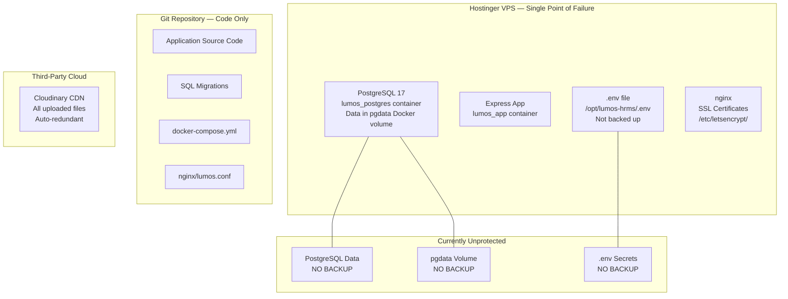
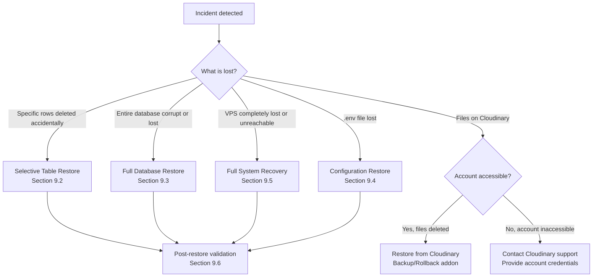
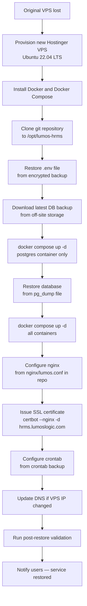
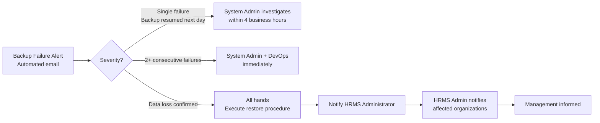
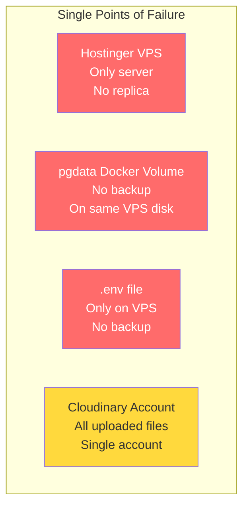

# 05 — Data Backup Strategy
## Lumos Logic HRMS — Enterprise Backup, Restore, and Data Protection Guide

---

**Document Version:** 1.0  
**Prepared By:** Lumos Logic  
**Date:** July 2026  
**Classification:** Confidential — Internal, DevOps, and System Administrator Distribution  
**Audience:** DevOps Engineers, System Administrators, HRMS Administrators, Operations Teams  

> **Critical Notice:** As of July 2026, the Lumos Logic HRMS has **no automated backup system in place**. The PostgreSQL database — which contains all organizational HR data including employee records, attendance, leave history, payroll, and documents — exists exclusively within a Docker named volume on a single Hostinger VPS with no off-site copies. This document defines the target backup architecture and provides all procedures required to implement it immediately.

---

## Table of Contents

1. [Executive Summary](#1-executive-summary)
2. [Backup Objectives](#2-backup-objectives)
3. [Data Classification](#3-data-classification)
4. [Current Backup Architecture](#4-current-backup-architecture)
5. [Database Backup Strategy](#5-database-backup-strategy)
6. [File and Document Backup](#6-file-and-document-backup)
7. [Infrastructure Backup](#7-infrastructure-backup)
8. [Backup Monitoring](#8-backup-monitoring)
9. [Restore Procedures](#9-restore-procedures)
10. [Operational Responsibilities](#10-operational-responsibilities)
11. [Risks](#11-risks)
12. [Best Practices](#12-best-practices)
13. [Recommendations](#13-recommendations)
14. [Backup Checklist](#14-backup-checklist)
15. [Monthly Maintenance Checklist](#15-monthly-maintenance-checklist)
16. [Quarterly Recovery Test Checklist](#16-quarterly-recovery-test-checklist)
17. [Annual Disaster Recovery Review Checklist](#17-annual-disaster-recovery-review-checklist)
18. [Backup Schedule Summary Table](#18-backup-schedule-summary-table)
19. [Document Summary](#19-document-summary)
20. [Related Documents](#20-related-documents)
21. [Review and Update Recommendations](#21-review-and-update-recommendations)

---

## 1. Executive Summary

The Lumos Logic HRMS stores all business-critical HR data — employee personal records, biometric attendance logs, salary structures, payslips, leave history, government-issued ID references, and banking details — in a single PostgreSQL 17 database running inside a Docker container on one Hostinger VPS server.

**As of the time of writing, there is no automated backup procedure, no off-site copy of the database, and no documented restore procedure.** A hardware failure, accidental deletion of the Docker volume, or VPS provider incident would result in **complete and permanent loss of all organizational HR data** for all organizations on the platform.

This document defines:
- A target backup architecture that can be implemented with zero additional infrastructure cost using native VPS capabilities
- Step-by-step procedures for database backup, file backup, and infrastructure backup
- Validated restore procedures for every data category
- Operational responsibilities and monitoring checklists
- A phased implementation roadmap

The estimated time to implement the minimum viable backup system described in this document is **less than 2 hours** for a system administrator with VPS SSH access.

---

## 2. Backup Objectives

### 2.1 Business Objectives

| Objective | Description |
|---|---|
| **Data preservation** | Ensure all employee records, HR transactions, and organizational data can be recovered after any failure |
| **Business continuity** | Minimize disruption to HR operations in the event of a system failure |
| **Regulatory compliance** | Maintain historical HR records as required by Indian labor law and statutory compliance obligations |
| **Client trust** | Provide verifiable data protection guarantees to all organizations on the platform |
| **Operational resilience** | Enable recovery from both accidental deletion and infrastructure failure scenarios |

### 2.2 Recovery Point Objective (RPO)

**RPO** defines the maximum acceptable amount of data loss measured in time.

| Data Category | Current RPO | Target RPO | Notes |
|---|---|---|---|
| PostgreSQL database | **Undefined** (no backup) | **24 hours** | Daily backup at 02:00 IST |
| Employee uploaded files | N/A (on Cloudinary) | N/A | Cloudinary manages redundancy |
| Configuration files | Undefined | 7 days | Stored in git + manual `.env` backup |
| SSL certificates | N/A | N/A | Re-issuable on demand via Certbot |

> **Note:** The target RPO of 24 hours means that in a worst-case failure scenario, up to one day of HR transactions (attendance check-ins, leave applications, payslip generation) may need to be re-entered manually. To reduce this to 6 hours, implement the scheduled incremental backup described in Section 5.4.

### 2.3 Recovery Time Objective (RTO)

**RTO** defines the maximum acceptable time to restore service after a failure.

| Scenario | Target RTO | Current Readiness |
|---|---|---|
| Database corruption — restore from backup | 2 hours | Not achievable (no backup exists) |
| Accidental data deletion (single table) | 30 minutes | Not achievable (no backup exists) |
| VPS failure — rebuild on new server | 4 hours | Partially achievable (code in git; DB lost) |
| Complete disaster recovery | 6 hours | Not achievable currently |
| SSL certificate issue | 30 minutes | Achievable (Certbot re-issue) |
| nginx misconfiguration | 15 minutes | Achievable (config in git) |

### 2.4 Critical Systems by Recovery Priority

| Priority | System | Data | Consequence of Loss |
|---|---|---|---|
| P1 — Critical | PostgreSQL database | All HR data | Total loss of all employee, attendance, leave, payroll data |
| P1 — Critical | `.env` file | All secrets, credentials | System cannot start; requires re-configuration |
| P2 — High | Cloudinary account | Employee documents, avatars, receipts, payslips | Loss of document URLs; files inaccessible |
| P3 — Medium | Application code | Source code | Rebuild from git; no data loss |
| P3 — Medium | Docker configuration | `docker-compose.yml`, `Dockerfile` | Rebuild from git; no data loss |
| P3 — Medium | nginx configuration | Reverse proxy config | Rebuild from git; brief service interruption |
| P4 — Low | SSL certificates | TLS certs | Re-issue from Let's Encrypt; 30-minute downtime |
| P4 — Low | Application logs | Diagnostic logs | No data loss; operational visibility gap |

---

## 3. Data Classification

### 3.1 Data Classification Matrix

| Data Asset | Location | Criticality | Backup Frequency | Retention | Recovery Priority | Automated? |
|---|---|---|---|---|---|---|
| PostgreSQL database | Docker volume `pgdata` on VPS | **Critical** | Daily | 30 days | P1 | ❌ No |
| `.env` file (secrets) | `/opt/lumos-hrms/.env` on VPS | **Critical** | On change | Indefinite | P1 | ❌ No |
| Employee documents | Cloudinary CDN | High | N/A (Cloudinary) | Per Cloudinary plan | P2 | ✅ Cloudinary |
| Employee avatars | Cloudinary CDN | Medium | N/A (Cloudinary) | Per Cloudinary plan | P3 | ✅ Cloudinary |
| Expense receipts | Cloudinary CDN | High | N/A (Cloudinary) | Per Cloudinary plan | P2 | ✅ Cloudinary |
| Payslip PDFs | Cloudinary CDN | High | N/A (Cloudinary) | Per Cloudinary plan | P2 | ✅ Cloudinary |
| Announcement files | Cloudinary CDN | Low | N/A (Cloudinary) | Per Cloudinary plan | P4 | ✅ Cloudinary |
| Application source code | Git repository | High | On commit | Indefinite (git history) | P3 | ✅ Git |
| Database migrations | Git repository | High | On commit | Indefinite (git history) | P3 | ✅ Git |
| `docker-compose.yml` | Git repository | High | On commit | Indefinite (git history) | P3 | ✅ Git |
| `nginx/lumos.conf` | Git repository | Medium | On commit | Indefinite (git history) | P3 | ✅ Git |
| SSL certificates | `/etc/letsencrypt/` on VPS | Medium | Auto-renewed | 90 days (auto) | P4 | ✅ Certbot |
| Docker volume (`pgdata`) | VPS filesystem | **Critical** | Daily snapshot | 7 days | P1 | ❌ No |
| Application logs | Docker stdout | Low | Not retained | Ephemeral | P4 | ❌ No |
| crontab entries | VPS system | Medium | On change (manual) | Manual | P3 | ❌ No |

### 3.2 Data Ownership and Sensitivity

| Data Type | Sensitivity | Regulatory Concern | Notes |
|---|---|---|---|
| Employee PII (name, DOB, address) | High | IT Act 2000, DPDP Act | Must be retained per labor law |
| Government IDs (Aadhar, PAN) | Critical | IT Act 2000, DPDP Act | Encrypted storage recommended (see F-008) |
| Banking details | Critical | RBI guidelines | Must never be transmitted unencrypted |
| Biometric punch logs | High | DPDP Act | Biometric data requires explicit consent |
| Salary and payslip data | High | Indian Payroll compliance | Retention minimum 7 years |
| Attendance records | Medium | Shops and Establishments Act | Retention minimum 3 years |
| Leave records | Medium | Labor law | Retention minimum 3 years |

---

## 4. Current Backup Architecture

### 4.1 Honest Assessment of Current State

> **⚠ Warning:** The following table accurately reflects the backup posture as of July 2026. Items marked ❌ represent gaps that expose the organization to total data loss.

| Component | Current State | Status |
|---|---|---|
| PostgreSQL database backup | **None** — no `pg_dump` script, no cron job, no off-site copy | ❌ Not implemented |
| Docker volume snapshot | **None** — volume exists but is never copied | ❌ Not implemented |
| `.env` file backup | **None** — exists only on VPS, not version controlled (correctly) | ❌ Not implemented |
| Application code | In Git repository — exact remote URL not in repo | ✅ Implemented |
| nginx config | In `nginx/lumos.conf` in git repository | ✅ Implemented |
| Docker config | In `docker-compose.yml` and `Dockerfile` in git | ✅ Implemented |
| Database migrations | In `backend/migrations/` in git repository | ✅ Implemented |
| SSL certificates | Auto-renewed by Certbot (if systemd timer is active) | ⚠️ Partially implemented |
| Cloudinary assets | Managed by Cloudinary — their infrastructure is redundant | ✅ Cloudinary-managed |
| Application logs | Ephemeral Docker logs — not persisted or rotated | ❌ Not implemented |
| Backup monitoring | **None** — no alerts, no verification, no reporting | ❌ Not implemented |
| Restore procedures | **None documented** — no procedure has been written or tested | ❌ Not implemented |

### 4.2 What the Current Architecture Relies On



### 4.3 Single Point of Failure Analysis

The current architecture has **one critical single point of failure**: the Hostinger VPS. If the VPS is lost (hardware failure, provider issue, accidental deletion, ransomware), **the entire PostgreSQL database is permanently lost** because:

1. The database runs in a Docker container using a local named volume
2. The local named volume exists only on that VPS
3. No off-site copy of the data exists
4. No backup scripts have been configured

All other data is recoverable:
- Application code → from Git
- Uploaded files → from Cloudinary
- nginx, Docker configs → from Git
- SSL certificates → re-issue with Certbot

---

## 5. Database Backup Strategy

### 5.1 Backup Architecture Overview

```mermaid
graph LR
    subgraph VPS["Hostinger VPS"]
        PG[(PostgreSQL\nlumos_hrms DB)]
        CRON[OS crontab\n02:00 IST daily]
        LOCAL[/backups/\nLocal backup dir\n7-day retention]
    end

    subgraph Remote["Off-site Storage — Target State"]
        S3[Cloud Storage\nRclone target\n30-day retention]
    end

    subgraph Monitor["Monitoring — Target State"]
        ALERT[Email Alert\non backup failure]
        LOG[Backup log\n/var/log/lumos-backup.log]
    end

    CRON --> |pg_dump + gzip| LOCAL
    LOCAL --> |rclone sync| S3
    CRON --> |success/failure| LOG
    LOG --> |on error| ALERT
```

### 5.2 Backup Method: Logical Backup (pg_dump)

**Method chosen:** `pg_dump` logical backup — the appropriate choice for the current deployment because:
- Works with the PostgreSQL Docker container without stopping the service
- Creates a portable, human-readable dump that can be restored to any PostgreSQL version
- Supports selective table restores (critical for single-table recovery)
- Compresses well (HR databases with primarily text data achieve 80-90% compression)
- Does not require PostgreSQL replication or WAL archiving setup

**Alternative methods considered but not recommended at current scale:**

| Method | Description | Reason Not Recommended Now |
|---|---|---|
| Physical backup (`pg_basebackup`) | Copies raw data directory | Requires stopping container or WAL archiving; more complex |
| Streaming replication | Real-time standby database | Requires second VPS; higher cost; recommended for future |
| WAL archiving (PITR) | Point-in-time recovery | Complex setup; recommended when RPO < 1 hour is needed |

### 5.3 Backup Script — Implementation

The following script implements the complete database backup procedure. This script does **not yet exist** on the VPS and must be created as part of the Phase 1 implementation.

**File location on VPS:** `/opt/lumos-hrms/scripts/backup-db.sh`

```bash
#!/bin/bash
# =============================================================================
# Lumos Logic HRMS — PostgreSQL Backup Script
# Runs daily at 02:00 IST via crontab
# =============================================================================

set -euo pipefail

# ── Configuration ─────────────────────────────────────────────────────────────
DB_CONTAINER="lumos_postgres"
DB_NAME="${DB_NAME:-lumos_hrms}"
DB_USER="${DB_USER:-lumos_admin}"
BACKUP_DIR="/opt/backups/lumos-hrms/db"
LOG_FILE="/var/log/lumos-backup.log"
ALERT_EMAIL="${BACKUP_ALERT_EMAIL:-admin@lumoslogic.com}"
RETENTION_DAYS=30

# ── Timestamp ─────────────────────────────────────────────────────────────────
TIMESTAMP=$(date +"%Y%m%d_%H%M%S")
DATE_TAG=$(date +"%Y-%m-%d")
BACKUP_FILE="${BACKUP_DIR}/lumos_hrms_${TIMESTAMP}.sql.gz"

# ── Logging function ──────────────────────────────────────────────────────────
log() { echo "[$(date '+%Y-%m-%d %H:%M:%S')] $*" | tee -a "$LOG_FILE"; }

log "=== Backup started: ${TIMESTAMP} ==="

# ── Create backup directory ───────────────────────────────────────────────────
mkdir -p "$BACKUP_DIR"

# ── Verify container is running ───────────────────────────────────────────────
if ! docker ps --format '{{.Names}}' | grep -q "^${DB_CONTAINER}$"; then
    log "ERROR: Container ${DB_CONTAINER} is not running"
    echo "HRMS DB backup FAILED — container not running" | \
        mail -s "[ALERT] HRMS Backup Failed ${DATE_TAG}" "$ALERT_EMAIL"
    exit 1
fi

# ── Execute pg_dump ───────────────────────────────────────────────────────────
log "Running pg_dump for database: ${DB_NAME}"
docker exec "$DB_CONTAINER" pg_dump \
    -U "$DB_USER" \
    --format=plain \
    --no-password \
    "$DB_NAME" | gzip -9 > "$BACKUP_FILE"

if [ $? -ne 0 ] || [ ! -s "$BACKUP_FILE" ]; then
    log "ERROR: pg_dump failed or produced empty file"
    rm -f "$BACKUP_FILE"
    echo "HRMS DB backup FAILED — pg_dump error" | \
        mail -s "[ALERT] HRMS Backup Failed ${DATE_TAG}" "$ALERT_EMAIL"
    exit 1
fi

FILESIZE=$(du -sh "$BACKUP_FILE" | cut -f1)
log "Backup created: ${BACKUP_FILE} (${FILESIZE})"

# ── Verify backup integrity ────────────────────────────────────────────────────
log "Verifying backup integrity..."
if ! gunzip -t "$BACKUP_FILE" 2>/dev/null; then
    log "ERROR: Backup file failed integrity check"
    rm -f "$BACKUP_FILE"
    echo "HRMS DB backup FAILED — integrity check error" | \
        mail -s "[ALERT] HRMS Backup Integrity Failed ${DATE_TAG}" "$ALERT_EMAIL"
    exit 1
fi
log "Integrity check passed"

# ── Upload to off-site storage (requires rclone configured) ───────────────────
if command -v rclone &>/dev/null && rclone listremotes | grep -q "lumos-backup:"; then
    log "Uploading to off-site storage..."
    rclone copy "$BACKUP_FILE" "lumos-backup:lumos-hrms-backups/db/"
    if [ $? -eq 0 ]; then
        log "Off-site upload successful"
    else
        log "WARNING: Off-site upload failed — local backup retained"
        echo "HRMS backup uploaded locally but off-site sync FAILED" | \
            mail -s "[WARN] HRMS Off-Site Backup Failed ${DATE_TAG}" "$ALERT_EMAIL"
    fi
else
    log "WARNING: rclone not configured — backup is LOCAL ONLY"
fi

# ── Clean up old local backups ─────────────────────────────────────────────────
log "Removing local backups older than ${RETENTION_DAYS} days..."
find "$BACKUP_DIR" -name "lumos_hrms_*.sql.gz" -mtime +"$RETENTION_DAYS" -delete
log "Cleanup complete"

log "=== Backup completed successfully ==="
```

**Make executable and install:**
```bash
chmod +x /opt/lumos-hrms/scripts/backup-db.sh
```

### 5.4 Backup Scheduling

**Install the crontab entry on the VPS** (run as root or the deployment user):

```bash
# Edit crontab
crontab -e

# Add the following entries:
# ── Daily full backup at 02:00 IST (UTC+5:30 → 20:30 UTC previous day) ────────
30 20 * * * /opt/lumos-hrms/scripts/backup-db.sh >> /var/log/lumos-backup.log 2>&1

# ── Weekly backup verification at 03:00 IST every Sunday ─────────────────────
30 21 * * 0 /opt/lumos-hrms/scripts/verify-backup.sh >> /var/log/lumos-backup.log 2>&1
```

> **Note on IST timing:** The VPS system clock may be UTC. Verify with `date` command before setting the cron schedule. If the VPS is UTC, 02:00 IST = 20:30 UTC the previous day.

### 5.5 Backup Retention Policy

| Backup Type | Retention | Location | Count Kept |
|---|---|---|---|
| Daily local backup | 30 days | `/opt/backups/lumos-hrms/db/` | 30 files |
| Off-site backup | 90 days | Cloud storage (rclone target) | 90 files |
| Monthly snapshot | 12 months | Cloud storage (archived folder) | 12 files |
| Annual archive | 7 years | Cold storage | Per statutory requirement |

**Monthly snapshot** — on the first of each month, copy the latest backup to a `monthly/` prefix in off-site storage. This ensures monthly-granularity recovery points even after daily backups have been purged.

### 5.6 Backup Compression and Size Estimation

PostgreSQL logical dumps compress very efficiently for HR data (primarily text and timestamps):

| Organization Size | Estimated Raw DB Size | Compressed Backup Size | Compression Ratio |
|---|---|---|---|
| Small (< 50 employees) | 10–50 MB | 1–5 MB | ~90% |
| Medium (50–200 employees) | 50–200 MB | 5–25 MB | ~88% |
| Large (200+ employees) | 200 MB – 1 GB | 20–100 MB | ~85% |
| With biometric logs (1 year) | +500 MB | +50 MB | ~90% |

At the current scale, **30 days of daily backups requires approximately 50–150 MB of local disk space** — negligible on the VPS.

### 5.7 Backup Encryption

> **⚠ Recommendation (not currently implemented):** Backup files should be encrypted before off-site upload, especially since they contain sensitive PII.

```bash
# Encrypt backup before upload (add to backup script):
ENCRYPTED_FILE="${BACKUP_FILE}.enc"
openssl enc -aes-256-cbc -salt -pbkdf2 \
    -in "$BACKUP_FILE" \
    -out "$ENCRYPTED_FILE" \
    -pass env:BACKUP_ENCRYPTION_KEY
# Upload encrypted file; delete unencrypted copy
rm "$BACKUP_FILE"
```

Add `BACKUP_ENCRYPTION_KEY` to the `.env` file and to the VPS environment.

### 5.8 Selective Table Backup

For critical tables that change frequently and have strict compliance retention requirements, consider additional targeted backups:

```bash
# Backup only the payroll tables (high compliance value)
docker exec lumos_postgres pg_dump \
    -U lumos_admin \
    --table=payroll_structures \
    --table=payslips \
    lumos_hrms | gzip > /opt/backups/lumos-hrms/payroll/payroll_$(date +%Y%m).sql.gz

# Backup only attendance (operational value, high change rate)
docker exec lumos_postgres pg_dump \
    -U lumos_admin \
    --table=attendance \
    --table=attendance_regularization \
    lumos_hrms | gzip > /opt/backups/lumos-hrms/attendance/attendance_$(date +%Y%m%d).sql.gz
```

---

## 6. File and Document Backup

### 6.1 Cloudinary — Current State and Assessment

All binary files uploaded to the HRMS are stored on **Cloudinary CDN**, not on the VPS disk. This includes:

| File Type | Cloudinary Folder Pattern | Tables with URL |
|---|---|---|
| Employee avatars | `hrms/{org_id}/avatars/` | `users.avatar_url`, `users.profile_photo_url` |
| Employee documents | Cloudinary auto-assigned | `employee_documents.file_url` |
| Government ID uploads | Cloudinary auto-assigned | `employee_government_docs.*_url` fields |
| Expense receipts | Cloudinary auto-assigned | `expenses.receipt_url` |
| Payslip PDFs | Cloudinary auto-assigned | `payslips.pdf_url` |
| Announcement attachments | Cloudinary auto-assigned | `announcements.file_url` |

**Cloudinary's built-in redundancy:**
- Cloudinary stores files across multiple geographic locations with automatic replication
- Files are accessible via CDN edge nodes globally
- Cloudinary provides 99.9% uptime SLA on their paid plans
- Files are not automatically deleted unless the Cloudinary account is closed or files are explicitly deleted via API

**⚠ Risk:** The Cloudinary account itself is a single point of trust. If:
- Credentials are compromised and files are deleted
- The Cloudinary account lapses due to non-payment
- The Cloudinary service terminates unexpectedly

...all uploaded files become inaccessible. The PostgreSQL database would retain the URLs but the files behind those URLs would be gone.

### 6.2 Cloudinary Backup Strategy

#### Option A — Cloudinary Backup Addon (Recommended)

Cloudinary offers backup integration with Google Cloud Storage, Amazon S3, and Microsoft Azure through their Backup & Rollback add-on (available on paid plans). This provides automated, Cloudinary-managed backup of all uploaded assets.

**Steps to enable:**
1. Log in to Cloudinary Dashboard
2. Navigate to Account → Add-ons
3. Enable "Backup and Rollback" add-on
4. Configure backup to a cloud storage bucket (AWS S3 or GCS recommended)

#### Option B — Periodic Download Script (Interim Solution)

For critical document types only (government IDs, payslips), implement a periodic download script that fetches files from Cloudinary and stores them in off-site storage:

```bash
#!/bin/bash
# Download all Cloudinary files for a specific folder
# Requires: cloudinary-cli (pip install cloudinary-cli)
cloudinary search "folder=hrms/*" \
    --fields public_id,secure_url \
    --max-results 500 \
    --output json > /tmp/cloudinary_assets.json

# Download each file (simplified — production script should handle pagination)
jq -r '.[].secure_url' /tmp/cloudinary_assets.json | while read url; do
    filename=$(basename "$url")
    curl -s "$url" -o "/opt/backups/lumos-hrms/cloudinary/$filename"
done
```

> **Recommendation:** Enable the Cloudinary Backup Addon as soon as feasible. Until then, the primary risk mitigation is ensuring database backups are intact (the database contains all URLs, so files can be identified and re-uploaded if needed, though the original files cannot be recovered without Cloudinary redundancy).

### 6.3 Generated Report Backup

Reports generated via `GET /api/reports/attendance?format=csv` and similar endpoints are generated on-the-fly from the database — they are **not stored anywhere**. As long as the database backup is intact, reports can always be regenerated. No separate report backup is required.

### 6.4 Configuration Files Backup

Configuration files that are **in the git repository** are inherently version-controlled and do not require separate backup. Files that are **not in the repository** require manual backup.

| File | In Git? | Backup Method | Frequency |
|---|---|---|---|
| `backend/src/**` | ✅ Yes | Git push | On commit |
| `client/src/**` | ✅ Yes | Git push | On commit |
| `docker-compose.yml` | ✅ Yes | Git push | On commit |
| `nginx/lumos.conf` | ✅ Yes | Git push | On commit |
| `.env` | ❌ No | Manual + encrypted off-site | On change |
| `/etc/nginx/sites-enabled/lumos.conf` (live) | ❌ No | Include in infrastructure backup | Weekly |
| `/etc/crontab` / `/var/spool/cron/crontabs/` | ❌ No | Include in infrastructure backup | On change |

### 6.5 Environment Variables Backup

The `.env` file contains all secrets: `JWT_SECRET`, `DB_PASSWORD`, `SMTP_PASS`, `CLOUDINARY_API_SECRET`, `VAPID_PRIVATE_KEY`, and others. This file must **never** be committed to git. It must be backed up separately using encrypted storage.

```bash
# Create encrypted backup of .env file
#!/bin/bash
ENV_FILE="/opt/lumos-hrms/.env"
BACKUP_DIR="/opt/backups/lumos-hrms/config"
TIMESTAMP=$(date +%Y%m%d)

mkdir -p "$BACKUP_DIR"

# Encrypt with AES-256
openssl enc -aes-256-cbc -salt -pbkdf2 \
    -in "$ENV_FILE" \
    -out "${BACKUP_DIR}/.env.encrypted.${TIMESTAMP}" \
    -pass env:BACKUP_ENCRYPTION_KEY

echo "Encrypted .env backup created for ${TIMESTAMP}"
```

**Decryption key management:** The `BACKUP_ENCRYPTION_KEY` must be stored separately from both the VPS and the backups — use a password manager, a secure note, or a hardware key. Without this key, the encrypted backup cannot be decrypted.

---

## 7. Infrastructure Backup

### 7.1 Docker Volume Snapshot

The `pgdata` Docker volume is the physical location of PostgreSQL data on the VPS filesystem. While the `pg_dump` approach (Section 5.3) is the primary and preferred backup method, a snapshot of the raw Docker volume provides a secondary recovery option.

> **Important:** A raw Docker volume snapshot should **not** be taken while PostgreSQL is running without proper preparation (WAL flush), as it may create an inconsistent state. Always prefer `pg_dump` for reliable database backup. Volume snapshots are appropriate only for VPS-level disaster scenarios.

```bash
#!/bin/bash
# Docker volume snapshot — for disaster recovery scenarios only
# This is a raw filesystem copy and requires container to be stopped for consistency

VOLUME_NAME="lumos_hrms_pgdata"
BACKUP_DIR="/opt/backups/lumos-hrms/volumes"
TIMESTAMP=$(date +%Y%m%d_%H%M%S)

mkdir -p "$BACKUP_DIR"

# Stop app container (postgres can keep running if using pg_dump instead)
docker compose -f /opt/lumos-hrms/docker-compose.yml stop app

# Create volume snapshot using a temporary Alpine container
docker run --rm \
    -v "${VOLUME_NAME}:/source:ro" \
    -v "${BACKUP_DIR}:/backup" \
    alpine \
    tar czf "/backup/pgdata_snapshot_${TIMESTAMP}.tar.gz" -C /source .

# Restart app container
docker compose -f /opt/lumos-hrms/docker-compose.yml start app

echo "Volume snapshot created: ${BACKUP_DIR}/pgdata_snapshot_${TIMESTAMP}.tar.gz"
```

### 7.2 Nginx Configuration Backup

The nginx configuration lives in two places:
1. `nginx/lumos.conf` in the git repository (version controlled) — ✅ backed up
2. `/etc/nginx/sites-available/lumos.conf` on the VPS (live file) — may diverge from the repo

Include the live nginx configuration in the weekly infrastructure backup:

```bash
# Include in weekly infrastructure backup script
cp /etc/nginx/sites-available/*.conf /opt/backups/lumos-hrms/nginx/
cp /etc/nginx/sites-enabled/*.conf /opt/backups/lumos-hrms/nginx/enabled/
```

### 7.3 SSL Certificate Backup

Let's Encrypt certificates are located at `/etc/letsencrypt/live/hrms.lumoslogic.com/`. They auto-renew via Certbot's systemd timer every 90 days.

**Verify auto-renewal is active:**
```bash
systemctl status certbot.timer
# Expected: "Active: active (waiting)"
certbot certificates
# Shows: "VALID: XX days" (should be > 30 days)
```

**Manual certificate backup** (include in weekly infrastructure backup):
```bash
tar czf /opt/backups/lumos-hrms/ssl/letsencrypt_$(date +%Y%m%d).tar.gz \
    /etc/letsencrypt/live/ \
    /etc/letsencrypt/archive/ \
    /etc/letsencrypt/renewal/
```

> **Note:** SSL certificates can always be re-issued from Let's Encrypt free of charge within minutes, as long as the domain DNS is correctly configured. Certificate backup is a convenience optimization, not a critical data protection requirement.

### 7.4 Crontab Backup

The VPS crontab is not version-controlled. Back it up whenever it changes:

```bash
# Backup current crontab
crontab -l > /opt/backups/lumos-hrms/config/crontab_$(date +%Y%m%d).txt
# Also back up system crontab
cat /etc/crontab > /opt/backups/lumos-hrms/config/etc_crontab_$(date +%Y%m%d).txt
```

### 7.5 Weekly Infrastructure Backup Script

```bash
#!/bin/bash
# /opt/lumos-hrms/scripts/backup-infra.sh
# Run weekly via crontab: 30 22 * * 6 (Sunday 04:00 IST = Saturday 22:30 UTC)

BACKUP_DIR="/opt/backups/lumos-hrms/infra"
TIMESTAMP=$(date +%Y%m%d)
mkdir -p "${BACKUP_DIR}/${TIMESTAMP}"

# Nginx config
cp -r /etc/nginx/sites-available/ "${BACKUP_DIR}/${TIMESTAMP}/nginx/"
cp -r /etc/nginx/sites-enabled/   "${BACKUP_DIR}/${TIMESTAMP}/nginx-enabled/"

# SSL certificates
tar czf "${BACKUP_DIR}/${TIMESTAMP}/letsencrypt.tar.gz" /etc/letsencrypt/ 2>/dev/null

# Crontab
crontab -l > "${BACKUP_DIR}/${TIMESTAMP}/crontab.txt" 2>/dev/null

# Docker Compose state
docker compose -f /opt/lumos-hrms/docker-compose.yml config > "${BACKUP_DIR}/${TIMESTAMP}/docker-compose-resolved.yml"

# Encrypt .env
openssl enc -aes-256-cbc -salt -pbkdf2 \
    -in /opt/lumos-hrms/.env \
    -out "${BACKUP_DIR}/${TIMESTAMP}/.env.encrypted" \
    -pass env:BACKUP_ENCRYPTION_KEY

# Archive the timestamp folder
tar czf "${BACKUP_DIR}/infra_backup_${TIMESTAMP}.tar.gz" -C "$BACKUP_DIR" "$TIMESTAMP"
rm -rf "${BACKUP_DIR}/${TIMESTAMP}"

# Upload to off-site
if command -v rclone &>/dev/null; then
    rclone copy "${BACKUP_DIR}/infra_backup_${TIMESTAMP}.tar.gz" "lumos-backup:lumos-hrms-backups/infra/"
fi

# Remove local copies older than 4 weeks
find "$BACKUP_DIR" -name "infra_backup_*.tar.gz" -mtime +28 -delete

echo "Infrastructure backup complete: ${TIMESTAMP}"
```

---

## 8. Backup Monitoring

### 8.1 Backup Verification Script

After each backup, the following verification should run automatically:

```bash
#!/bin/bash
# /opt/lumos-hrms/scripts/verify-backup.sh
# Verifies the most recent database backup

BACKUP_DIR="/opt/backups/lumos-hrms/db"
LOG_FILE="/var/log/lumos-backup.log"
ALERT_EMAIL="${BACKUP_ALERT_EMAIL:-admin@lumoslogic.com}"

log() { echo "[$(date '+%Y-%m-%d %H:%M:%S')] VERIFY: $*" | tee -a "$LOG_FILE"; }

# Find most recent backup
LATEST=$(ls -t "${BACKUP_DIR}"/lumos_hrms_*.sql.gz 2>/dev/null | head -1)

if [ -z "$LATEST" ]; then
    log "ERROR: No backup files found in ${BACKUP_DIR}"
    echo "HRMS backup verification FAILED — no backup files exist" | \
        mail -s "[CRITICAL] No HRMS Backup Found" "$ALERT_EMAIL"
    exit 1
fi

# Check file age (should be less than 26 hours old)
AGE=$(( ($(date +%s) - $(stat -c %Y "$LATEST")) / 3600 ))
if [ "$AGE" -gt 26 ]; then
    log "ERROR: Most recent backup is ${AGE} hours old (expected < 26)"
    echo "HRMS backup is ${AGE} hours old — backup may have failed" | \
        mail -s "[ALERT] HRMS Backup Stale" "$ALERT_EMAIL"
    exit 1
fi

# Verify gzip integrity
if ! gunzip -t "$LATEST" 2>/dev/null; then
    log "ERROR: Backup file ${LATEST} failed integrity check"
    echo "HRMS backup integrity check FAILED" | \
        mail -s "[CRITICAL] HRMS Backup Corrupted" "$ALERT_EMAIL"
    exit 1
fi

# Check minimum file size (< 100 KB suggests empty dump)
FILESIZE=$(stat -c %s "$LATEST")
if [ "$FILESIZE" -lt 102400 ]; then
    log "WARNING: Backup file is only ${FILESIZE} bytes — may be incomplete"
    echo "HRMS backup is unusually small (${FILESIZE} bytes)" | \
        mail -s "[WARN] HRMS Backup Size Anomaly" "$ALERT_EMAIL"
fi

log "Verification passed: ${LATEST} (${AGE} hours old, $(du -sh "$LATEST" | cut -f1))"
```

### 8.2 Restore Test Procedure (Monthly)

Once per month, verify that the backup can actually be restored. Use a **separate test database** — never restore to production:

```bash
#!/bin/bash
# Monthly backup restore test — run in isolation, NEVER on production DB
BACKUP_DIR="/opt/backups/lumos-hrms/db"
TEST_DB="lumos_hrms_restore_test"
LATEST=$(ls -t "${BACKUP_DIR}"/lumos_hrms_*.sql.gz | head -1)

echo "Testing restore from: ${LATEST}"

# Create test database
docker exec lumos_postgres psql -U lumos_admin -c "CREATE DATABASE ${TEST_DB};"

# Restore into test database
gunzip -c "$LATEST" | docker exec -i lumos_postgres psql -U lumos_admin -d "$TEST_DB"

# Verify critical tables exist and have data
docker exec lumos_postgres psql -U lumos_admin -d "$TEST_DB" -c "
    SELECT
        (SELECT COUNT(*) FROM users) AS users,
        (SELECT COUNT(*) FROM organizations) AS orgs,
        (SELECT COUNT(*) FROM attendance) AS attendance,
        (SELECT COUNT(*) FROM leaves) AS leaves;
"

# Clean up
docker exec lumos_postgres psql -U lumos_admin -c "DROP DATABASE ${TEST_DB};"

echo "Restore test completed successfully"
```

### 8.3 Backup Monitoring Dashboard (Recommended)

> **Recommendation (not currently implemented):** Set up a simple monitoring dashboard using one of the following approaches:

| Approach | Cost | Complexity | Features |
|---|---|---|---|
| **Healthchecks.io** (recommended) | Free tier available | Low | Cron job monitoring, email/Slack alerts when cron misses |
| **Uptime Robot** | Free | Low | HTTP ping monitoring (for health endpoint) |
| **Grafana + Prometheus** | Self-hosted | High | Full metrics dashboard |

**Healthchecks.io integration** (simplest — add one line to backup script):
```bash
# At end of backup script, ping success URL:
curl -fsS -m 10 --retry 5 "https://hc-ping.com/${HEALTHCHECKS_UUID}" > /dev/null 2>&1
```
Healthchecks.io will alert you if the ping is not received within the expected window.

### 8.4 Backup Monitoring Checklist

| Check | Frequency | Method | Alert Threshold |
|---|---|---|---|
| Backup file exists and is < 26h old | Daily (automated) | `verify-backup.sh` | > 26 hours old |
| Backup file integrity (gunzip -t) | Daily (automated) | `verify-backup.sh` | Any failure |
| Backup file size reasonable | Daily (automated) | `verify-backup.sh` | < 100 KB |
| Off-site sync successful | Daily (automated) | rclone exit code | Any failure |
| Restore test passed | Monthly (manual) | Restore test script | Any failure |
| Local backup disk space | Weekly (manual) | `df -h /opt/backups` | > 80% disk used |
| Off-site backup count | Monthly (manual) | `rclone ls` | < 28 daily files |
| Certbot renewal status | Monthly (manual) | `certbot certificates` | < 30 days remaining |

---

## 9. Restore Procedures

### 9.1 Restore Decision Matrix



### 9.2 Selective Table Restore (Most Common Scenario)

Use this procedure when specific records were accidentally deleted or corrupted, but the overall database is intact.

**Example: Restore accidentally deleted attendance records for a specific month**

```bash
# Step 1: Identify the backup containing the records
ls -lt /opt/backups/lumos-hrms/db/lumos_hrms_*.sql.gz
# Choose the backup from BEFORE the accidental deletion

# Step 2: Extract only the target table from the backup
BACKUP_FILE="/opt/backups/lumos-hrms/db/lumos_hrms_20260725_020000.sql.gz"
TARGET_TABLE="attendance"

gunzip -c "$BACKUP_FILE" | grep -A 10000 "COPY public.${TARGET_TABLE}" | \
    grep -B 1 "^\\\." | head -n -1 > /tmp/table_restore.sql

# Step 3: Review the extracted data before restoring
wc -l /tmp/table_restore.sql
head -5 /tmp/table_restore.sql

# Step 4: Restore to production (CAUTION — this may create duplicates)
# Option A: Insert missing rows only (safer)
# Option B: Truncate and reload (only if all current data should be replaced)

# Option A — Load into temp table and merge:
docker exec -i lumos_postgres psql -U lumos_admin -d lumos_hrms << 'EOF'
CREATE TABLE IF NOT EXISTS attendance_restore_temp (LIKE attendance INCLUDING ALL);
EOF
cat /tmp/table_restore.sql | docker exec -i lumos_postgres psql -U lumos_admin -d lumos_hrms

# Step 5: Verify row counts match expectations
docker exec lumos_postgres psql -U lumos_admin -d lumos_hrms \
    -c "SELECT COUNT(*) FROM attendance WHERE date >= '2026-07-01';"

# Step 6: Clean up
rm /tmp/table_restore.sql
```

### 9.3 Full Database Restore

Use this procedure when the entire database needs to be replaced — corrupt data, accidental truncation, or complete database loss.

```mermaid
sequenceDiagram
    participant OPS as Operations
    participant VPS as Hostinger VPS
    participant PG as PostgreSQL Container
    participant TEAM as HR Team

    OPS->>TEAM: Notify HR team of maintenance window (expected: 30–60 min downtime)
    OPS->>VPS: SSH into VPS
    OPS->>VPS: Stop app container (DB container stays running)
    Note over OPS,VPS: docker compose stop app

    OPS->>VPS: Identify latest valid backup
    Note over OPS,VPS: ls -lt /opt/backups/lumos-hrms/db/

    OPS->>PG: Drop and recreate database
    Note over OPS,PG: docker exec psql -c "DROP DATABASE lumos_hrms;"
    Note over OPS,PG: docker exec psql -c "CREATE DATABASE lumos_hrms;"

    OPS->>PG: Restore from backup
    Note over OPS,PG: gunzip -c backup.sql.gz | docker exec -i postgres psql

    OPS->>PG: Verify row counts in critical tables
    OPS->>VPS: Start app container
    Note over OPS,VPS: docker compose start app

    OPS->>OPS: Run post-restore validation checklist
    OPS->>TEAM: Notify HR team that service is restored
    TEAM->>TEAM: Re-enter any transactions that occurred\nafter the backup timestamp
```

**Step-by-step commands:**

```bash
# STEP 1: Announce maintenance
echo "Starting database restore. Estimated downtime: 30-60 minutes."
# Notify HR administrators before proceeding

# STEP 2: Stop the application (keep DB container running)
cd /opt/lumos-hrms
docker compose stop app
echo "App container stopped. DB container still running."

# STEP 3: Identify the backup to restore
ls -lht /opt/backups/lumos-hrms/db/lumos_hrms_*.sql.gz | head -5
# Select the most recent backup BEFORE the incident
BACKUP_FILE="/opt/backups/lumos-hrms/db/lumos_hrms_YYYYMMDD_HHMMSS.sql.gz"

# STEP 4: Verify backup integrity
gunzip -t "$BACKUP_FILE" && echo "Backup integrity: OK" || echo "BACKUP CORRUPTED — choose another"

# STEP 5: Create a safety snapshot of current (broken) state
docker exec lumos_postgres pg_dump -U lumos_admin lumos_hrms | \
    gzip > /tmp/pre_restore_snapshot_$(date +%Y%m%d_%H%M%S).sql.gz
echo "Pre-restore snapshot saved to /tmp/"

# STEP 6: Drop and recreate the database
docker exec lumos_postgres psql -U lumos_admin -c "
    SELECT pg_terminate_backend(pid) FROM pg_stat_activity WHERE datname='lumos_hrms' AND pid <> pg_backend_pid();
"
docker exec lumos_postgres psql -U lumos_admin -c "DROP DATABASE IF EXISTS lumos_hrms;"
docker exec lumos_postgres psql -U lumos_admin -c "CREATE DATABASE lumos_hrms OWNER lumos_admin;"
echo "Database dropped and recreated."

# STEP 7: Restore from backup
echo "Restoring from: ${BACKUP_FILE}"
gunzip -c "$BACKUP_FILE" | docker exec -i lumos_postgres psql -U lumos_admin -d lumos_hrms
echo "Restore complete."

# STEP 8: Verify critical table counts
docker exec lumos_postgres psql -U lumos_admin -d lumos_hrms -c "
    SELECT
        'users'         AS table_name, COUNT(*) AS row_count FROM users
    UNION ALL SELECT 'organizations', COUNT(*) FROM organizations
    UNION ALL SELECT 'attendance',    COUNT(*) FROM attendance
    UNION ALL SELECT 'leaves',        COUNT(*) FROM leaves
    UNION ALL SELECT 'payslips',      COUNT(*) FROM payslips;
"

# STEP 9: Start the application
docker compose start app
echo "App container started."

# STEP 10: Verify health endpoint
curl -s http://localhost:3000/health | python3 -m json.tool
```

### 9.4 Configuration Restore (.env File)

If the `.env` file is lost, the application cannot start. This is a **complete service-blocking event**.

```bash
# STEP 1: Locate the encrypted .env backup
ls -lt /opt/backups/lumos-hrms/config/.env.encrypted.*
# OR from off-site storage:
rclone ls lumos-backup:lumos-hrms-backups/infra/ | grep ".env"

# STEP 2: Decrypt using the backup encryption key
# The BACKUP_ENCRYPTION_KEY must be retrieved from your secure password manager
openssl enc -d -aes-256-cbc -pbkdf2 \
    -in /opt/backups/lumos-hrms/config/.env.encrypted.YYYYMMDD \
    -out /opt/lumos-hrms/.env \
    -pass pass:YOUR_BACKUP_ENCRYPTION_KEY

# STEP 3: Set correct permissions
chmod 600 /opt/lumos-hrms/.env

# STEP 4: Restart services
cd /opt/lumos-hrms && docker compose up -d

# STEP 5: Verify application starts
docker compose logs app --tail=20
```

> **Critical:** If the backup encryption key is also lost, there is no way to decrypt the `.env` backup. In this case, all credential values must be reconstructed manually by re-generating secrets and reconfiguring all third-party service integrations (Cloudinary, Gmail SMTP, VAPID keys, etc.).

### 9.5 Full System Recovery (VPS Loss Scenario)

Use this procedure when the original VPS is completely lost and a new server must be provisioned.



**Estimated time for full system recovery:** 3–5 hours  
**Prerequisite:** Off-site database backup exists and is accessible

### 9.6 Post-Restore Validation Checklist

After any restore operation, verify the following before declaring recovery complete:

```
SYSTEM VALIDATION:
[ ] Application health endpoint responds: GET /health → { "status": "ok", "db": "connected" }
[ ] Login works for root admin account
[ ] Login works for a known employee account
[ ] Feature flags load correctly (no JavaScript errors)

DATA VALIDATION:
[ ] User count matches expected (SELECT COUNT(*) FROM users)
[ ] Organization count matches expected
[ ] Latest attendance records are present (SELECT MAX(date) FROM attendance)
[ ] Latest leave records are present (SELECT MAX(created_at) FROM leaves)
[ ] Payslips from most recent month are present

FUNCTIONAL VALIDATION:
[ ] Employee check-in works (POST /api/attendance/checkin)
[ ] Leave application form submits successfully
[ ] File upload test (upload a small image as employee avatar)
[ ] Email delivery works (use forgot-password flow)

INTEGRATION VALIDATION:
[ ] Google Calendar sync works (if configured)
[ ] Push notifications send (if configured)
[ ] Biometric device connects (if devices are live)
```

---

## 10. Operational Responsibilities

### 10.1 Responsibility Matrix

| Responsibility | System Administrator | DevOps Engineer | HRMS Administrator | Management |
|---|:---:|:---:|:---:|:---:|
| Implement backup scripts on VPS | Owns | Reviews | Informed | Approves |
| Configure off-site storage (rclone) | Owns | Supports | — | — |
| Monitor daily backup completion | Responsible | Accountable | — | — |
| Run monthly restore test | Owns | Reviews | Verifies data | — |
| Review backup logs weekly | Responsible | Accountable | — | — |
| Maintain `.env` file security | Owns | — | — | — |
| Store backup encryption key securely | Owns | — | — | Accountable |
| Execute restore during incident | Leads | Supports | Provides business validation | Notified |
| Notify HR team during outage | — | — | Owns | Informed |
| Quarterly DR test | Participates | Leads | Validates | Approves |
| Annual backup policy review | Contributes | Leads | Contributes | Approves |
| Cloudinary account management | — | — | Owns | — |

### 10.2 Escalation Path



### 10.3 Contact Information

> **Action Required:** Populate this table with actual contact details before deploying the backup system.

| Role | Name | Contact | Availability |
|---|---|---|---|
| System Administrator | *(fill in)* | *(fill in)* | *(fill in)* |
| DevOps Engineer | *(fill in)* | *(fill in)* | *(fill in)* |
| HRMS Administrator | *(fill in)* | *(fill in)* | *(fill in)* |
| Hostinger Support | Hostinger | support.hostinger.com | 24/7 live chat |
| Cloudinary Support | Cloudinary | cloudinary.com/support | Business hours |

---

## 11. Risks

### 11.1 Current Risk Register

| Risk | Likelihood | Impact | Severity | Current Mitigation | Recommended Action |
|---|---|---|---|---|---|
| **No automated backup — VPS failure = total data loss** | Medium | Critical | **Critical** | None | Implement backup scripts immediately (Phase 1) |
| **Single VPS — complete hardware failure** | Low | Critical | **High** | None | Implement backup + consider replica VPS |
| **.env file lost — application cannot start** | Low | Critical | **High** | None | Encrypted backup of .env to off-site storage |
| **Docker volume accidentally deleted** | Low | Critical | **High** | None | Daily pg_dump backup |
| **Cloudinary account compromised** | Low | High | **High** | Cloudinary's own redundancy | Enable Cloudinary Backup Add-on |
| **Backup script fails silently** | Medium | High | **High** | None | Backup monitoring with alerting |
| **Backup restored but data is stale** | Low | High | **Medium** | None | Monthly restore test |
| **Backup encryption key lost** | Low | High | **Medium** | None | Store key in password manager; distribute to 2 people |
| **SSL certificate expires** | Low | Medium | **Medium** | Certbot auto-renew | Monitor cert expiry; confirm timer active |
| **Off-site storage account inaccessible** | Low | Medium | **Medium** | Local backup exists | Keep 7 days local + off-site |
| **Backup file corrupted** | Low | High | **Medium** | None | Automated integrity check after each backup |
| **rclone misconfigured — off-site sync silently failing** | Medium | Medium | **Medium** | None | Verify rclone after setup; monitor sync logs |

### 11.2 Missing Automation Summary

| Automation | Status | Risk |
|---|---|---|
| Daily `pg_dump` cron job | ❌ Not implemented | **Critical data loss risk** |
| Off-site sync (rclone) | ❌ Not implemented | **No off-site copy exists** |
| Backup integrity verification | ❌ Not implemented | **Backup may be corrupt** |
| Backup monitoring and alerting | ❌ Not implemented | **Failures go undetected** |
| Monthly restore test | ❌ No procedure | **Untested recovery = unreliable recovery** |
| `.env` encrypted backup | ❌ Not implemented | **Service can't restart after .env loss** |
| Cloudinary backup add-on | ❌ Not enabled | **Files irrecoverable if Cloudinary account lost** |

### 11.3 Single Points of Failure



---

## 12. Best Practices

> **Best Practice:** Run the backup script manually once immediately after implementing it. Do not wait for the next scheduled run to discover configuration errors.

> **Best Practice:** Store the backup encryption key and the off-site storage credentials in a password manager (1Password, Bitwarden, or equivalent) and share access with at least two team members. A backup that cannot be decrypted is equivalent to no backup.

> **Best Practice:** Always restore to a **test database** first. Never run a restore directly into the production database without validating the backup contents first.

> **Best Practice:** Keep at least 7 days of local backups on the VPS even if off-site storage is configured. If off-site access is temporarily unavailable during an incident, local backups provide immediate recovery.

> **Best Practice:** After every production deployment, verify that the backup cron job is still active (`crontab -l | grep backup`). Docker operations and system updates can sometimes affect crontab entries.

> **Best Practice:** Document the backup encryption key separately from this document. This document may be shared broadly — the encryption key must not appear here.

> **Best Practice:** Test the full restore procedure on a fresh VPS at least once per quarter. A backup procedure that has never been tested is a backup procedure that cannot be trusted.

---

## 13. Recommendations

### Short Term (Complete within 2 weeks)

| Recommendation | Action | Effort |
|---|---|---|
| **Implement daily `pg_dump` backup** | Create and install `backup-db.sh`, add crontab entry | 1 hour |
| **Configure off-site storage** | Set up rclone with Backblaze B2 or AWS S3; configure sync | 2 hours |
| **Back up `.env` file** | Create encrypted backup; store key in password manager | 30 minutes |
| **Install backup monitoring** | Register at healthchecks.io; add ping to backup script | 30 minutes |
| **Run first manual backup and verify** | Execute `backup-db.sh` manually; run `verify-backup.sh` | 30 minutes |
| **Confirm Certbot timer is active** | `systemctl status certbot.timer` | 5 minutes |

### Medium Term (Complete within Q4 2026)

| Recommendation | Action | Effort |
|---|---|---|
| **Implement backup encryption** | Add OpenSSL AES-256-GCB encryption to backup script | 2 hours |
| **Enable Cloudinary Backup Add-on** | Activate in Cloudinary dashboard; configure S3 destination | 1 hour |
| **Implement monthly restore test procedure** | Schedule first restore test; document results | 2 hours |
| **Set up infrastructure backup script** | Create `backup-infra.sh`; include in weekly cron | 1 hour |
| **Add backup size anomaly alerting** | Extend verify script with size threshold check | 30 minutes |
| **Document encryption key distribution** | Ensure 2+ team members have key in their password manager | 1 hour |

### Long Term (2027 and beyond)

| Recommendation | Action | Effort |
|---|---|---|
| **Implement streaming replication** | Set up PostgreSQL standby on a second VPS | 2–4 days |
| **Consider managed PostgreSQL** | Migrate to Hostinger managed DB or AWS RDS for built-in backup | Variable |
| **Implement point-in-time recovery (PITR)** | WAL archiving to S3 for sub-hourly RPO | 3–5 days |
| **Automated quarterly DR test** | Script that provisions a test VPS, restores, and validates | 3–5 days |
| **Implement backup compliance reporting** | Monthly report showing backup status, retention, and test results | 1–2 days |

---

## 14. Backup Checklist

Use this checklist when setting up the backup system for the first time:

### Initial Setup

- [ ] Create backup directories on VPS: `mkdir -p /opt/backups/lumos-hrms/{db,config,infra,cloudinary}`
- [ ] Create `backup-db.sh` from Section 5.3 template
- [ ] Make script executable: `chmod +x /opt/lumos-hrms/scripts/backup-db.sh`
- [ ] Set `BACKUP_ALERT_EMAIL` in crontab or environment
- [ ] Add daily cron entry: `30 20 * * * /opt/lumos-hrms/scripts/backup-db.sh`
- [ ] Run backup script manually: `bash /opt/lumos-hrms/scripts/backup-db.sh`
- [ ] Verify backup file created and non-empty: `ls -lh /opt/backups/lumos-hrms/db/`
- [ ] Verify backup integrity: `gunzip -t <backup_file>`
- [ ] Install rclone: `curl https://rclone.org/install.sh | sudo bash`
- [ ] Configure rclone remote: `rclone config` → name it `lumos-backup`
- [ ] Test rclone sync: `rclone copy /opt/backups/lumos-hrms/db/ lumos-backup:lumos-hrms-backups/db/`
- [ ] Verify off-site copy: `rclone ls lumos-backup:lumos-hrms-backups/db/`
- [ ] Create encrypted `.env` backup: `openssl enc -aes-256-cbc ... -in .env -out .env.encrypted`
- [ ] Store backup encryption key in password manager (shared with 2+ people)
- [ ] Register at healthchecks.io; add ping URL to backup script
- [ ] Set up SSL certificate expiry monitoring
- [ ] Send test backup alert email to verify email delivery

### First Restore Test (within 30 days of setup)

- [ ] Identify most recent backup file
- [ ] Verify backup integrity
- [ ] Create test database: `docker exec lumos_postgres psql -c "CREATE DATABASE lumos_test;"`
- [ ] Restore into test database: `gunzip -c backup.sql.gz | docker exec -i lumos_postgres psql -d lumos_test`
- [ ] Verify row counts in critical tables
- [ ] Drop test database: `docker exec lumos_postgres psql -c "DROP DATABASE lumos_test;"`
- [ ] Document test results (date, backup used, row counts, pass/fail)

---

## 15. Monthly Maintenance Checklist

Run this checklist on the first working day of each month:

- [ ] Verify backup logs show daily success for the past 30 days: `grep "ERROR" /var/log/lumos-backup.log`
- [ ] Confirm 30 daily backup files exist in local directory
- [ ] Confirm off-site storage has 30+ daily backup files: `rclone ls lumos-backup:... | wc -l`
- [ ] Check VPS disk space: `df -h /opt/backups` (alert if > 70% full)
- [ ] Verify crontab is active and correct: `crontab -l`
- [ ] Run restore test on a test database (Section 9.2)
- [ ] Verify SSL certificate validity: `certbot certificates`
- [ ] Check Cloudinary storage usage in dashboard (verify it has not exceeded plan limits)
- [ ] Review backup file sizes for anomalies (sudden size drop may indicate schema loss)
- [ ] Update this checklist if any backup procedures have changed

---

## 16. Quarterly Recovery Test Checklist

Conduct a full recovery drill every quarter (January, April, July, October):

### Pre-Test (Week before)

- [ ] Notify HR team of scheduled test window (no real transactions during test)
- [ ] Identify backup file to be used for test (use a backup from > 7 days ago to simulate real scenario)
- [ ] Provision a test VPS or use a Docker environment separate from production
- [ ] Assemble the team: System Admin, DevOps, HRMS Admin

### During Test

- [ ] Record start time
- [ ] Execute full system recovery procedure (Section 9.5) on test environment
- [ ] Verify all post-restore validation checks pass (Section 9.6)
- [ ] Measure actual time to restore service
- [ ] Document any steps that failed or took longer than expected
- [ ] Record end time

### Post-Test

- [ ] Compare actual RTO against target RTO (Section 2.3)
- [ ] Destroy test environment
- [ ] Document findings in a DR Test Report
- [ ] Update restore procedures based on findings
- [ ] Schedule next quarterly test

---

## 17. Annual Disaster Recovery Review Checklist

Conduct annually (January of each year):

- [ ] Review and update this document for accuracy
- [ ] Review all backup retention policies — are they still adequate for compliance?
- [ ] Review and update RTO and RPO targets
- [ ] Review off-site storage costs and provider relationship
- [ ] Rotate backup encryption key (generate new key; re-encrypt all stored backups)
- [ ] Update contact information in Section 10.3
- [ ] Review Cloudinary plan — is storage within limits?
- [ ] Evaluate whether single-VPS architecture is still appropriate (consider managed DB)
- [ ] Verify backup encryption key is still accessible to at least 2 team members
- [ ] Review compliance requirements for data retention (Indian labor law updates)
- [ ] Conduct a full DR test with the updated procedures

---

## 18. Backup Schedule Summary Table

| Backup Type | Frequency | Time (IST) | Retention (Local) | Retention (Off-site) | Automated? |
|---|---|---|---|---|---|
| PostgreSQL full logical backup | Daily | 02:00 IST | 30 days | 90 days | ❌ To be configured |
| Infrastructure backup (nginx, SSL, crontab, .env) | Weekly | 04:00 IST Sunday | 4 weeks | 12 weeks | ❌ To be configured |
| Monthly DB snapshot (copy of daily) | Monthly (1st) | 02:30 IST | 3 months | 12 months | ❌ To be configured |
| Backup integrity verification | Daily | 03:00 IST | N/A | N/A | ❌ To be configured |
| Restore test | Monthly | Manual | N/A | N/A | ❌ Manual |
| Cloudinary asset backup | Continuous (via add-on) | N/A | Per Cloudinary | Per Cloudinary plan | ⚠️ Not enabled |
| SSL certificate renewal | Every 60 days | Auto | N/A | N/A | ✅ Certbot |
| Git (code) | On every commit | Immediate | Indefinite | Indefinite | ✅ Git |

---

## 19. Document Summary

This document has defined the complete backup, restore, and data protection strategy for the Lumos Logic HRMS.

**Critical findings:**
- No automated backup system currently exists — all organizational data is at risk of permanent loss
- The `.env` file containing all secrets has no backup and exists only on the production VPS
- Cloudinary Backup Add-on is not enabled — uploaded files depend entirely on Cloudinary's own redundancy
- No restore procedures have been documented or tested

**Minimum viable backup system** (implementable in under 2 hours):
1. Install `backup-db.sh` on VPS
2. Add daily crontab entry
3. Configure rclone for off-site sync
4. Encrypt and back up `.env` file
5. Set up healthchecks.io monitoring

**Target state after Phase 1 implementation:**
- Daily automated PostgreSQL backups with 30-day local retention
- Automated off-site sync to cloud storage with 90-day retention
- Daily backup integrity verification with email alerts
- Documented and tested restore procedures
- Monthly restore test schedule

---

## 20. Related Documents

| Document | Relevance |
|---|---|
| `02_System_Architecture_Overview.md` | Infrastructure details: VPS, Docker, PostgreSQL |
| `04_Pending_Development_Tasks.md` | F-052: No automated database backup (critical finding) |
| `07_Disaster_Recovery_Plan.md` | Uses restore procedures defined in this document |
| `09_Database_Management_Guidelines.md` | Database schema context for selective restores |
| `11_Deployment_and_Maintenance_Procedures.md` | VPS access procedures and deployment context |

---

## 21. Review and Update Recommendations

| Trigger | Action |
|---|---|
| Backup implementation completed | Update Section 4 to reflect implemented vs. recommended status |
| Off-site storage provider changes | Update Sections 5.3 and 7.5; re-test rclone configuration |
| VPS migration | Update server IPs in Sections 2.3 and 9.5; re-run backup setup |
| New data type added to HRMS | Review Section 3 data classification; add new asset if appropriate |
| Restore test findings | Update restore procedures in Section 9; document lessons learned |
| Compliance requirement changes | Review retention periods in Sections 3 and 5.5 |
| Quarterly | Re-run all checklists; update implementation status |

**Next Scheduled Review:** October 2026

---

*End of Document 05 — Data Backup Strategy*  
*Next: 06_Security_Measures_and_Access_Control.md*
