# 06 — Security Measures and Access Control
## Lumos Logic HRMS — Enterprise Security Architecture & Access Control Guide

---

**Document Version:** 1.0  
**Prepared By:** Lumos Logic  
**Date:** July 2026  
**Classification:** Confidential — Internal, Security, and DevOps Distribution  
**Audience:** Developers, DevOps Engineers, System Administrators, Security Auditors, Management  

> **Methodology:** Every security finding in this document is derived from direct source code inspection of the live HRMS codebase. Implemented protections are confirmed by code. Gaps are confirmed by the absence of code. No assumptions are made. Each section clearly distinguishes between **Implemented**, **Partially Implemented**, and **Recommended**.

---

## Table of Contents

1. [Executive Summary](#1-executive-summary)
2. [Security Architecture](#2-security-architecture)
3. [Authentication](#3-authentication)
4. [Two-Factor Authentication (TOTP)](#4-two-factor-authentication-totp)
5. [Authorization and RBAC](#5-authorization-and-rbac)
6. [Feature Flag Security](#6-feature-flag-security)
7. [Data Protection](#7-data-protection)
8. [API Security](#8-api-security)
9. [File Upload Security](#9-file-upload-security)
10. [Database Security](#10-database-security)
11. [Audit Logging](#11-audit-logging)
12. [Security Monitoring](#12-security-monitoring)
13. [Vulnerability Assessment](#13-vulnerability-assessment)
14. [Operational Responsibilities](#14-operational-responsibilities)
15. [Security Best Practices](#15-security-best-practices)
16. [Future Security Roadmap](#16-future-security-roadmap)
17. [Security Maturity Score](#17-security-maturity-score)
18. [OWASP Mapping Table](#18-owasp-mapping-table)
19. [Security Checklist](#19-security-checklist)
20. [Monthly Security Review Checklist](#20-monthly-security-review-checklist)
21. [Quarterly Security Audit Checklist](#21-quarterly-security-audit-checklist)
22. [Annual Security Assessment Checklist](#22-annual-security-assessment-checklist)
23. [Incident Response Checklist](#23-incident-response-checklist)
24. [Document Summary](#24-document-summary)
25. [Related Documents](#25-related-documents)
26. [Review and Update Recommendations](#26-review-and-update-recommendations)

---

## 1. Executive Summary

### 1.1 Security Objectives

The Lumos Logic HRMS handles among the most sensitive organizational data available — employee government IDs, bank account details, salary structures, biometric attendance records, and statutory financial information. The security architecture must protect this data against unauthorized access, accidental exposure, and malicious attack while maintaining operational usability for HR teams and employees.

| Security Objective | Description |
|---|---|
| **Identity assurance** | Ensure only authenticated and authorized users access system resources |
| **Data confidentiality** | Protect sensitive employee PII from unauthorized disclosure |
| **Multi-tenant isolation** | Ensure one organization's data is never accessible to another |
| **Audit accountability** | Maintain records of security-relevant system events |
| **Operational continuity** | Security measures must not impede legitimate HR operations |

### 1.2 Current Security Maturity

| Domain | Maturity | Grade |
|---|---|---|
| Authentication mechanisms | Core controls implemented; gaps in revocation and lockout | C+ |
| Authorization / RBAC | Solid role model; two code-confirmed bugs | B- |
| Data protection | Passwords hashed; PII stored in plain text — critical gap | D |
| API security | No rate limiting, no security headers, no input validation | D |
| File upload security | Mixed — documents validated; other uploads are not | C |
| Database security | Parameterized queries throughout; RLS disabled | C+ |
| Audit logging | Login history only; most events are unlogged | D+ |
| Security monitoring | No monitoring infrastructure exists | F |
| Infrastructure security | nginx basic TLS; biometric endpoint unauthenticated | D+ |

### 1.3 Overall Security Assessment

> **Assessment:** The HRMS has implemented foundational security controls — bcrypt password hashing, JWT-based authentication, TOTP two-factor authentication, and role-based access control. These protections are correctly implemented. However, several critical gaps exist that prevent the system from meeting enterprise security standards:
>
> 1. **No rate limiting** on authentication endpoints — brute-force attacks are unrestricted
> 2. **PII in plain text** — Aadhar numbers, PAN numbers, and bank account details are unencrypted
> 3. **JWT tokens not revocable** — compromised or stolen tokens remain valid for up to 7 days
> 4. **No security headers** — the application does not send standard HTTP security headers
> 5. **No security monitoring** — attacks and anomalies go undetected
> 6. **Failed logins not logged** — the audit trail is incomplete
>
> These gaps should be remediated before the platform handles statutory compliance data at enterprise scale. A prioritized remediation plan is provided in Section 16.

---

## 2. Security Architecture

### 2.1 Defense in Depth Overview

The HRMS implements security at multiple layers, though several layers are currently incomplete:

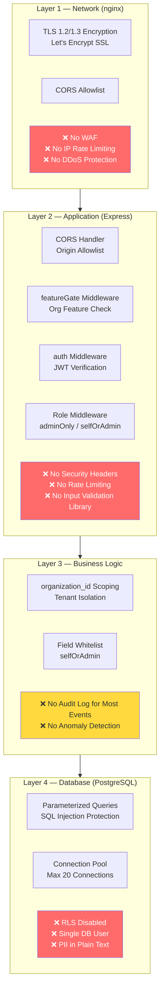

### 2.2 Trust Boundaries

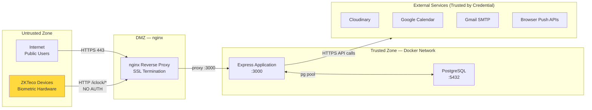

> **Trust Boundary Risk:** ZKTeco biometric devices communicate without any authentication token. These devices cross the trust boundary into the application without identity verification. This is an accepted limitation of the ADMS protocol but must be mitigated at the network layer (IP allowlisting in nginx). See Section 13 for details.

### 2.3 Security Layers Summary

| Layer | Component | Status | Key Gap |
|---|---|---|---|
| Transport | TLS 1.2/1.3 via Let's Encrypt | ✅ Implemented | Certificate renewal monitoring needed |
| Network | nginx reverse proxy | ✅ Implemented | No WAF, no rate limiting at nginx |
| CORS | Origin allowlist in Express | ✅ Implemented | Contains legacy Firebase domains |
| Feature gating | `featureGate` middleware | ✅ Implemented | No auth required to reach gate |
| Authentication | JWT + bcrypt + TOTP | ✅ Implemented | No revocation, no lockout |
| Authorization | RBAC middleware chain | ✅ Implemented | Two confirmed bugs (F-003, F-004) |
| Tenant isolation | `organization_id` scoping | ✅ Implemented | RLS not enforced at DB level |
| Injection protection | Parameterized queries | ✅ Implemented | No input validation library |
| Security headers | HTTP security headers | ❌ Not implemented | No Helmet.js or manual headers |
| Rate limiting | Request throttling | ❌ Not implemented | Critical gap on auth endpoints |
| Data encryption | Field-level encryption | ❌ Not implemented | PII in plain text |
| Monitoring | Security event detection | ❌ Not implemented | No alerts, no anomaly detection |

---

## 3. Authentication

### 3.1 Login Flow

**Status: ✅ Implemented**

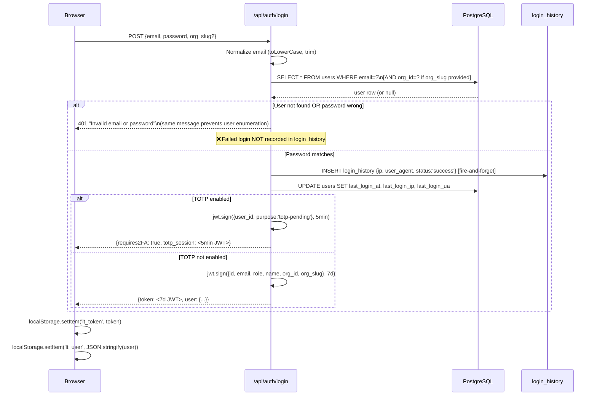

### 3.2 JWT Token Architecture

**Status: ✅ Implemented**

| Property | Value | Notes |
|---|---|---|
| Algorithm | HS256 (HMAC-SHA256) | Symmetric key — suitable for single-server deployment |
| Secret | `process.env.JWT_SECRET` | Falls back to `'leave-tracker-secret-2026'` if not set — **critical risk** |
| Expiry | 7 days | Long-lived to reduce re-login friction; no refresh mechanism |
| Storage | `localStorage` | Persistent across browser sessions; XSS risk if XSS is present |
| Payload | `{id, email, role, name, organization_id, organization_slug}` | No token version; no revocation support |
| TOTP pending | `{user_id, purpose: 'totp-pending'}` | 5-minute expiry; blocked by auth middleware |

**JWT Payload Example:**
```json
{
  "id": 42,
  "email": "jsmith@company.com",
  "role": "employee",
  "name": "John Smith",
  "organization_id": 3,
  "organization_slug": "acme-corp",
  "iat": 1753600000,
  "exp": 1754204800
}
```

### 3.3 Token Verification

**Status: ✅ Implemented** — `backend/src/middleware/auth.js`

```javascript
function auth(req, res, next) {
  const token = req.headers.authorization?.split(' ')[1];
  if (!token) return res.status(401).json({ error: 'Unauthorized' });
  try {
    const decoded = jwt.verify(token, JWT_SECRET);
    // Explicitly blocks totp-pending tokens from accessing protected routes
    if (decoded.purpose === 'totp-pending')
      return res.status(401).json({ error: 'TOTP verification required' });
    req.user = decoded;
    next();
  } catch { return res.status(401).json({ error: 'Invalid token' }); }
}
```

**What this checks:** ✅ Token signature validity, ✅ Token expiry, ✅ TOTP-pending token blocking  
**What this does NOT check:** ❌ Employee active status, ❌ Token version (revocation), ❌ Organization active status

### 3.4 Password Security

**Status: ✅ Implemented — with noted gaps**

| Control | Implementation | Status |
|---|---|---|
| Password hashing | `bcryptjs` with cost factor 10 | ✅ Implemented |
| Minimum length | 8 characters (enforced in change-password route) | ✅ Implemented |
| Password history | Last 5 password hashes stored as JSONB array | ✅ Implemented |
| Reuse prevention | `bcrypt.compareSync` against all 5 historical hashes | ✅ Implemented |
| Force change on first login | `force_password_change = true` on account creation | ✅ Implemented |
| Reset token generation | `crypto.randomBytes(32).toString('hex')` — 256-bit entropy | ✅ Implemented |
| Reset token expiry | 1 hour from generation | ✅ Implemented |
| Email enumeration protection | Forgot-password always returns success | ✅ Implemented |
| Maximum password length | **Not enforced** | ❌ Missing |
| Complexity requirements | **Not enforced** (length only) | ❌ Partially implemented |
| Failed attempt lockout | **Not implemented** | ❌ Missing |

**Password History Storage Pattern:**
```javascript
const newHistory = [user.password, ...history].slice(0, 5); // Prepend current, keep last 5
await supabase.from('users').update({
  password:             bcrypt.hashSync(newPassword, 10),
  password_history:     JSON.stringify(newHistory),
  password_changed_at:  new Date().toISOString(),
  force_password_change: false,
}).eq('id', req.user.id);
```

### 3.5 Email Verification

**Status: ✅ Implemented**

A 6-digit numeric OTP is generated and stored in `users.email_verify_code`. The employee requests the code via `POST /api/auth/send-verification` and submits it via `POST /api/auth/verify-email`. On success, `users.email_verified` is set to `true` and the code is cleared.

**Gaps:** The verification code has no expiry time — a code stored in the database remains valid indefinitely until a new one is generated. **Recommendation:** Add `email_verify_expires` timestamp and reject codes older than 15 minutes.

### 3.6 Token Lifecycle and Session Management

**Status: ⚠️ Partially Implemented**

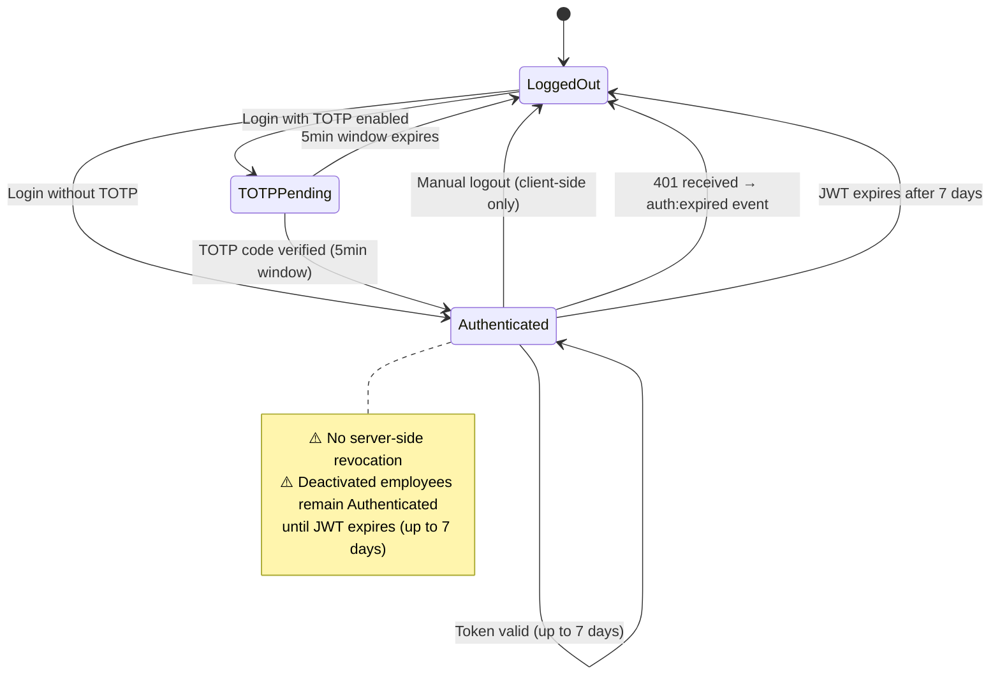

| Event | Server Action | Client Action | Secure? |
|---|---|---|---|
| User logs out | None — stateless | Remove `lt_token` from localStorage | ⚠️ No server-side invalidation |
| Password changed | None | New token issued on next login | ⚠️ Old token remains valid |
| Employee deactivated | None | None | ❌ Old token remains valid up to 7 days |
| Token expires (7d) | Automatic JWT rejection | `auth:expired` event triggers logout | ✅ |
| Mid-session 401 | Return 401 | `auth:expired` event triggers auto-logout | ✅ |
| Admin force logout | **Not implemented** | **Not implemented** | ❌ Missing |

### 3.7 GDPR Data Rights

**Status: ✅ Implemented**

| Right | Endpoint | Implementation |
|---|---|---|
| Data portability | `GET /api/auth/download-data` | Returns JSON: profile, leaves (1yr), attendance (1yr), login history (50 records) |
| Deletion request | `POST /api/auth/request-deletion` | Sends email to HR team — **not actual deletion** |

**Gap:** The deletion request sends an email but does not perform any automated data deletion. Actual GDPR deletion must be performed manually by an administrator.

---

## 4. Two-Factor Authentication (TOTP)

### 4.1 Current Implementation

**Status: ✅ Implemented** — `backend/src/modules/auth/auth.routes.js`, library: `otplib@12.0.1`

TOTP implementation follows RFC 6238 (Time-Based One-Time Password algorithm). It is compatible with standard authenticator apps including Google Authenticator, Authy, Microsoft Authenticator, and 1Password.

### 4.2 TOTP Enrollment Flow

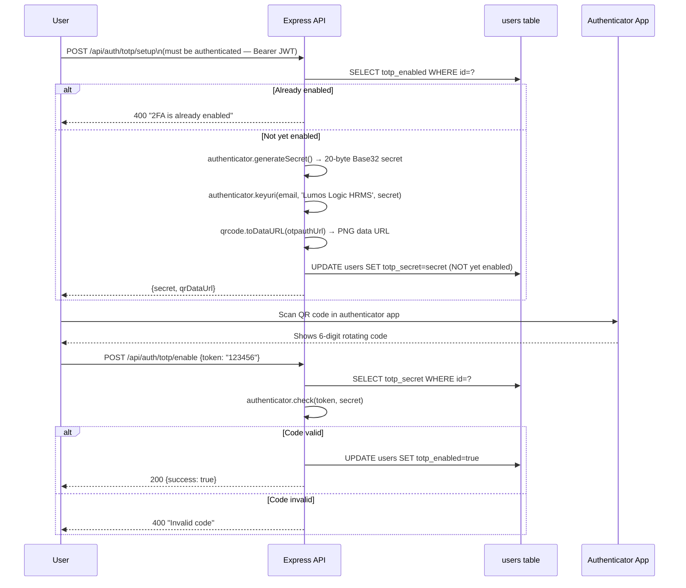

### 4.3 TOTP Login Verification

When `totp_enabled = true`, the standard login flow returns a short-lived `totp-pending` JWT (5-minute expiry). The user must submit this token along with the 6-digit TOTP code:

```
POST /api/auth/totp/verify-login
Body: { totp_session: <5min JWT>, token: "123456" }
```

The server verifies:
1. The `totp_session` JWT signature and expiry
2. That `decoded.purpose === 'totp-pending'`
3. The TOTP code against the stored secret

On success, a full 7-day JWT is issued.

### 4.4 TOTP Disable

Disabling TOTP requires the user's current password for confirmation:
```
POST /api/auth/totp/disable
Body: { password: "currentPassword" }
```
The password is verified via `bcrypt.compareSync`. On success, `totp_enabled = false` and `totp_secret = null`.

### 4.5 TOTP Security Considerations

| Consideration | Status | Notes |
|---|---|---|
| Timing attack on code comparison | ✅ Protected | `otplib` uses constant-time comparison |
| Code window | ✅ Default window | otplib default: ±1 time window (30-second codes) |
| Secret storage | ⚠️ Plain text in DB | `totp_secret` stored unencrypted in `users.totp_secret` |
| Recovery codes | ❌ Not implemented | If authenticator app is lost, no recovery path exists |
| Backup authenticator | ❌ Not implemented | No secondary 2FA method |
| TOTP secret backup | ❌ Not implemented | User must re-enroll if phone is lost |

> **Critical Gap — TOTP Recovery:** If a user loses access to their authenticator app, there is no recovery mechanism. An HR Admin must manually set `totp_enabled = false` and `totp_secret = null` directly in the database. **Recommendation:** Implement single-use backup codes generated at enrollment time, stored as bcrypt hashes.

---

## 5. Authorization and RBAC

### 5.1 Role Hierarchy

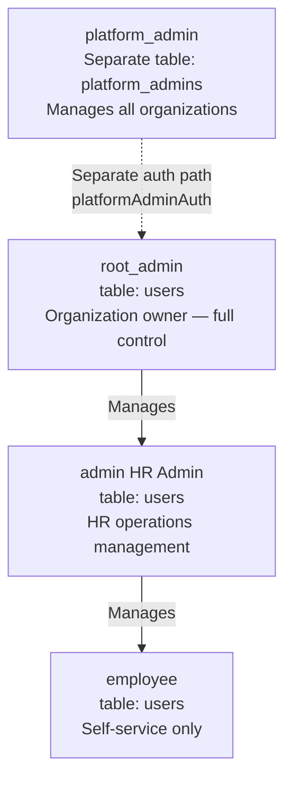

### 5.2 Middleware Chain Architecture

**Status: ✅ Implemented** — `backend/src/middleware/auth.js`

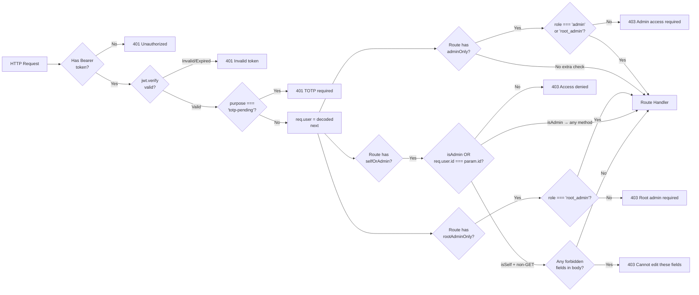

### 5.3 Middleware Reference

| Middleware | File | Applied To | Enforcement |
|---|---|---|---|
| `auth` | `auth.js` | All protected endpoints | JWT signature, expiry, TOTP-pending block |
| `adminOnly` | `auth.js` | Admin operations | `role === 'admin' \|\| role === 'root_admin'` |
| `rootAdminOnly` | `auth.js` | Org owner operations | `role === 'root_admin'` only |
| `selfOrAdmin(fields)` | `auth.js` | Profile edits | Admin: any fields; Employee: field whitelist only |
| `platformAdminAuth` | `auth.js` | Platform management | `role === 'platform_admin'` from `platform_admins` table |
| `featureGate` | `featureFlag.js` | All `/api/*` routes | Org feature enabled check before route handler |

### 5.4 Complete Permission Matrix

| Operation | employee | admin (HR) | root_admin | platform_admin |
|---|:---:|:---:|:---:|:---:|
| **Authentication** |||||
| Login | ✅ | ✅ | ✅ | ✅ (separate) |
| Change own password | ✅ | ✅ | ✅ | ✅ |
| Enable/disable TOTP | ✅ | ✅ | ✅ | — |
| Request data export (GDPR) | ✅ | ✅ | ✅ | — |
| **Employee Management** |||||
| View own profile | ✅ | ✅ | ✅ | — |
| Edit own profile (whitelisted fields) | ✅ | ✅ | ✅ | — |
| View all employees | ❌ | ✅ | ✅ | — |
| View employee statutory fields | ❌ | ✅ | ✅ | — |
| Create employees | ❌ | ✅ | ✅ | — |
| Edit any employee | ❌ | ✅ | ✅ | — |
| Delete employees | ❌ | ✅ | ✅ | — |
| Create root_admin accounts | ❌ | ❌ | ✅ | — |
| **Attendance** |||||
| Check in / Check out (own) | ✅ | ✅ | ✅ | — |
| View own attendance | ✅ | ✅ | ✅ | — |
| View all attendance | ❌ | ✅ | ✅ | — |
| Admin-edit any attendance | ❌ | ✅ | ✅ | — |
| Mark employee absent | ❌ | ✅ | ✅ | — |
| **Leave** |||||
| Apply own leave | ✅ | ✅ | ✅ | — |
| View own leave history | ✅ | ✅ | ✅ | — |
| View all leaves | ❌ | ✅ | ✅ | — |
| Approve / reject leave | ❌ | ✅ | ✅ | — |
| Apply leave on behalf of employee | ❌ | ✅ | ✅ | — |
| **Payroll** |||||
| View own payslips | ✅ | ✅ | ✅ | — |
| Manage salary structures | ❌ | ✅ | ✅ | — |
| Generate payslips | ❌ | ✅ | ✅ | — |
| **Documents** |||||
| Upload own documents | ✅ | ✅ | ✅ | — |
| View own documents | ✅ | ✅ | ✅ | — |
| Upload documents for any employee | ❌ | ✅ | ✅ | — |
| Set document visibility | Partial | ✅ | ✅ | — |
| **Banking Details** |||||
| Add own banking details | ✅ | ✅ | ✅ | — |
| HR-verify banking details | ❌ | ✅ | ✅ | — |
| View others' banking details | ❌ | ✅ | ✅ | — |
| **Organization** |||||
| View org settings | ❌ | ❌ | ✅ | ✅ |
| Edit org settings (SMTP, Calendar, etc.) | ❌ | ❌ | ✅ | — |
| Manage HR admins | ❌ | ❌ | ✅ | — |
| Manage root admin accounts | ❌ | ❌ | ✅ | — |
| Broadcast email to all | ❌ | ❌ | ✅ | — |
| **Platform** |||||
| View all organizations | ❌ | ❌ | ❌ | ✅ |
| Approve org registrations | ❌ | ❌ | ❌ | ✅ |
| Manage feature flags | ❌ | ❌ | ❌ | ✅ |
| Assign org plans | ❌ | ❌ | ❌ | ✅ |

### 5.5 Self-Edit Field Whitelists (`selfOrAdmin`)

The `selfOrAdmin` middleware accepts an `allowedSelfFields` array. When a non-admin employee edits their own profile, only these fields are permitted in the request body:

**Banking (SELF_EDITABLE):**
```javascript
['bank_name', 'branch_name', 'branch_code', 'account_number', 'account_holder_name',
 'account_type', 'ifsc_code', 'payment_method', 'is_primary', 'is_salary_account']
```

**Additional design:** Banking records added by employees (`hr_verified = false`) require HR verification before being used for payroll. Banking records added by admins are auto-verified (`hr_verified = true`). Banking deletion is soft-delete (`is_active = false`) — admin only.

### 5.6 Known Authorization Bugs

| Bug ID | Location | Description | Impact |
|---|---|---|---|
| F-003 | `exit.routes.js POST /` | `adminOnly` blocks employee self-submission of resignation | Employees cannot submit own exit requests |
| F-004 | `performance.routes.js PUT /reviews/:id` | `adminOnly` blocks employee self-assessment submission | Self-rating functionality is unreachable by employees |

---

## 6. Feature Flag Security

### 6.1 Architecture

**Status: ✅ Implemented at two levels**

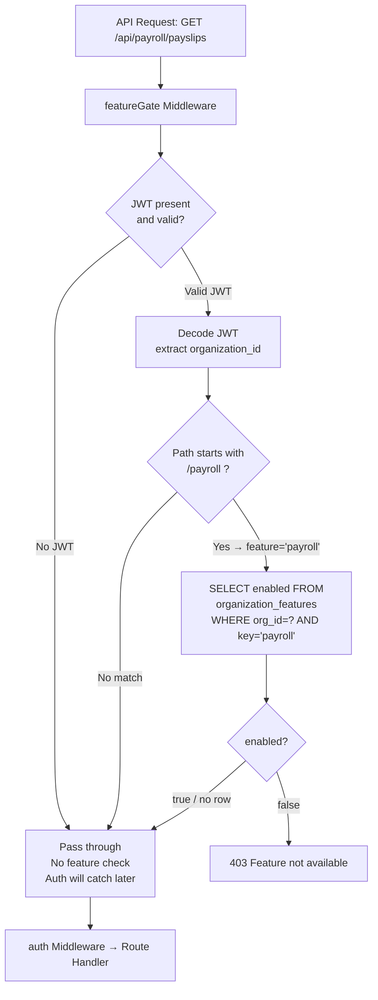

### 6.2 Backend Enforcement

**File:** `backend/src/middleware/featureFlag.js`

The `featureGate` middleware intercepts all `/api/*` routes and checks the `organization_features` table for the organization extracted from the JWT. The `FEATURE_ROUTE_MAP` defines which route prefixes map to which feature keys:

```javascript
const FEATURE_ROUTE_MAP = {
  '/payroll':               'payroll',
  '/expenses':              'expenses',
  '/assets':                'assets',
  '/reports':               'reports',
  '/performance':           'performance',
  '/documents':             'documents',
  '/onboarding':            'onboarding',
  '/exit-management':       'exit_management',
  '/announcements':         'announcements',
  '/attendance/late-early': 'regularization',
  '/shifts':                'shifts',
  '/roster':                'shifts',
  '/leave-policies':        'leave_policies',
  '/push':                  'push_notifications',
  '/biometric':             'biometric',
  '/branches':              'branches',
};
```

### 6.3 Frontend Enforcement

The `FeatureFlagContext` fetches the complete feature flag map for the organization from `GET /api/features` on login and every 30 seconds thereafter. The `FeatureRoute` wrapper component checks the relevant flag before rendering any page:

```jsx
function FeatureRoute({ featureKey, children }) {
  const enabled = useFeature(featureKey); // reads from context (polled every 30s)
  if (!enabled) return <LockScreen />; // show "Feature Not Available" UI
  return children;
}
```

### 6.4 Security Limitations

| Limitation | Impact | Recommendation |
|---|---|---|
| `featureGate` passes through when JWT is absent/invalid | Auth middleware catches this downstream — no functional gap, but adds a DB query before auth rejection | Confirm auth middleware runs for all routes; document the expected behavior |
| Feature flags missing from `FEATURE_ROUTE_MAP` get no backend protection | If a new feature is added without updating the map, backend gating is absent | Code review checklist: any new feature route must have a corresponding map entry |
| Frontend polling delay (30s) | New feature enablement takes up to 30s to appear | Documented acceptable behavior; page refresh forces immediate update |
| Feature flag data accessible via `GET /api/features` | Any authenticated user can see which features are enabled/disabled for their org | Acceptable — feature availability is not sensitive data |

---

## 7. Data Protection

### 7.1 Password Hashing

**Status: ✅ Implemented**

| Property | Value |
|---|---|
| Algorithm | bcrypt |
| Cost factor | 10 rounds |
| Library | `bcryptjs@2.4.3` |
| Hash length | 60 characters |
| Salt | Auto-generated per hash (built into bcrypt) |

**Security assessment:** bcrypt with cost factor 10 is appropriate for 2026. The bcryptjs library (pure JavaScript) is used rather than the faster `bcrypt` (native bindings), which is slightly more resource-efficient but provides the same security level.

**Password history hashes** are stored in `users.password_history` as a JSONB array of bcrypt hash strings. The plain-text password is never stored.

### 7.2 JWT Signing

**Status: ⚠️ Partially Implemented — Weak Fallback**

| Property | Value |
|---|---|
| Algorithm | HS256 (HMAC-SHA256) |
| Key | `process.env.JWT_SECRET \|\| 'leave-tracker-secret-2026'` |
| Key requirement | Should be minimum 32 random bytes (256 bits) |

> **Critical Risk:** The fallback `'leave-tracker-secret-2026'` is publicly visible in the source code. Any developer or attacker who has read access to the repository can forge valid JWTs for any user if this fallback is active in production. The server must refuse to start if `JWT_SECRET` is not set — see F-005 in `04_Pending_Development_Tasks.md`.

### 7.3 Sensitive Data Classification and Storage

| Data Field | Table | Sensitivity | Current Storage | Required Storage |
|---|---|---|---|---|
| `password` | `users` | Critical | bcrypt hash | ✅ Correctly protected |
| `password_history` | `users` | Critical | JSONB array of bcrypt hashes | ✅ Correctly protected |
| `totp_secret` | `users` | High | **Plain text** | ⚠️ Should be encrypted |
| `aadhar_no` | `users` | Critical | **Plain text** | ❌ Must be encrypted |
| `pan_number` | `users` | Critical | **Plain text** | ❌ Must be encrypted |
| `uan_no` | `users` | High | **Plain text** | ❌ Should be encrypted |
| `voter_id` | `users` | High | **Plain text** | ❌ Should be encrypted |
| `account_number` | `employee_bank_accounts` | Critical | **Plain text** | ❌ Must be encrypted |
| `ifsc_code` | `employee_bank_accounts` | Medium | **Plain text** | Acceptable as-is |
| `password_reset_token` | `users` | High | Plain text hex | ⚠️ Should be stored as SHA-256 hash |
| `email_verify_code` | `users` | Low | Plain text 6-digit | Acceptable for short-lived code |
| `smtp_pass` | `organizations` | High | **Plain text** | ❌ Should be encrypted |
| `vapid_private_key` | `organizations` | High | **Plain text** | ❌ Should be encrypted |
| `google_client_secret` | `organizations` | High | **Plain text** | ❌ Should be encrypted |

### 7.4 File Storage Security

**Status: ✅ Files stored on Cloudinary (not VPS disk)**

All uploaded files are stored on Cloudinary CDN. This means:
- ✅ No files stored on the VPS disk (no local file access risk)
- ✅ Files served via HTTPS from Cloudinary's CDN
- ✅ Cloudinary URLs are not guessable (contain random public_id hashes)
- ⚠️ Cloudinary URLs are not access-controlled by default — anyone with the URL can access the file
- ❌ No expiring URLs or signed URL delivery for sensitive documents

### 7.5 Document Access Control

**Status: ⚠️ Partially Implemented**

Documents have a `visibility` field: `self`, `all`, `specific`, `admin_only`. This visibility is enforced in the `GET /api/documents` query — employees only see documents where they are the owner, the document is `visibility='all'`, or they are in `document_shares`.

**Gap:** Cloudinary URLs are publicly accessible without authentication. If a Cloudinary URL for a sensitive document (e.g., government ID) is leaked, anyone with the URL can access the file without any HRMS authentication. **Recommendation:** Enable Cloudinary's authenticated/signed URL delivery for the `hrms/*/documents` and `hrms/*/government-docs` folders.

---

## 8. API Security

### 8.1 Security Headers

**Status: ❌ Not Implemented**

There is no `helmet` package imported in `server.js` or any other file. The server does not set any HTTP security headers. The manual CORS handler in `server.js` sets only `Access-Control-*` headers.

**Missing security headers and their implications:**

| Header | Purpose | Risk of Absence |
|---|---|---|
| `X-Frame-Options: DENY` | Prevents clickjacking (iframe embedding) | HRMS pages could be embedded in attacker-controlled frames |
| `X-Content-Type-Options: nosniff` | Prevents MIME-type sniffing | Browser may execute uploaded files with wrong MIME type |
| `Content-Security-Policy` | Prevents XSS content injection | If XSS exists, attacker scripts can run freely |
| `Strict-Transport-Security` | Enforces HTTPS | HTTP downgrade attacks possible |
| `Referrer-Policy: no-referrer` | Prevents URL leakage in Referer header | Internal API paths may leak to third-party requests |
| `Permissions-Policy` | Restricts browser feature access | Unnecessary browser capabilities remain accessible |

**Immediate fix — add Helmet.js:**
```bash
npm install helmet
```
```javascript
// server.js
const helmet = require('helmet');
app.use(helmet());
// Customize CSP if needed:
app.use(helmet.contentSecurityPolicy({
  directives: {
    defaultSrc: ["'self'"],
    imgSrc: ["'self'", "data:", "https://res.cloudinary.com"],
    scriptSrc: ["'self'"],
  },
}));
```

### 8.2 Rate Limiting

**Status: ❌ Not Implemented**

No rate limiting exists on any endpoint. Confirmed by `grep -r "rate.limit\|rateLimit\|express-rate" backend/` — no matches.

**Highest-risk unprotected endpoints:**

| Endpoint | Risk | Recommended Limit |
|---|---|---|
| `POST /api/auth/login` | Credential brute force | 10 requests / 15 min / IP |
| `POST /api/auth/forgot-password` | Email spam / DoS | 5 requests / 60 min / IP |
| `POST /api/auth/totp/verify-login` | TOTP brute force (10^6 space) | 5 requests / 5 min / IP |
| `POST /api/auth/send-verification` | Email spam | 3 requests / 60 min / user |
| `POST /iclock/cdata` | Biometric data spam | IP allowlist only |
| `GET /api/features` | Feature flag polling | Already limited by 30s client interval |

### 8.3 CORS Configuration

**Status: ⚠️ Partially Implemented**

The CORS handler in `server.js` uses an `ALLOWED_ORIGINS` allowlist from `auth.js`:

```javascript
const ALLOWED_ORIGINS = [
  'https://hrms.lumoslogic.com',        // ✅ Current production
  'https://leavetrackerbylumos.web.app', // ❌ Legacy Firebase — should be removed
  'https://leavetrackerbylumos.firebaseapp.com', // ❌ Legacy Firebase
  'https://leavetracker-platform-admin.web.app',  // ❌ Legacy Firebase
  'https://leavetracker-platform-admin.firebaseapp.com', // ❌ Legacy Firebase
  'http://localhost:5173',  // Dev
  'http://localhost:5174',  // Dev
  'http://localhost:3000',  // Dev
];
```

**Risk:** Legacy Firebase domains allow cross-origin requests from domains that may no longer be controlled by Lumos Logic. If those Firebase projects are abandoned or their configurations change, this could create an unintended CORS bypass.

**The CORS implementation is custom-built** (not using the `cors` npm package despite it being installed). The implementation correctly uses an allowlist rather than a wildcard, which is the secure approach.

### 8.4 Request Validation

**Status: ❌ Not Implemented (Schema-based)**

No input validation library is used. Validation is entirely manual and inconsistent across modules:

```javascript
// Typical pattern — insufficient:
if (!name || !email) return res.status(400).json({ error: 'Required' });
// No: type checking, length limits, format validation, injection sanitization
```

**Confirmed example — missing validation:**
The `POST /api/attendance/admin-edit` route accepts `user_id`, `date`, `check_in`, `check_out`, `status`, `notes` with only this check:
```javascript
if (!user_id || !date) return res.status(400).json({ error: 'user_id and date required' });
```
There is no validation that `status` is one of the allowed values, that `check_in`/`check_out` are valid `HH:MM` format strings, or that `notes` is within a reasonable length.

### 8.5 Error Handling and Information Leakage

**Status: ⚠️ Partially Secured**

Every route handler uses `catch (err) { res.status(500).json({ error: err.message }); }`. This means PostgreSQL error messages (which can contain table names, column names, and constraint names) are exposed to the client:

```json
{ "error": "duplicate key value violates unique constraint \"users_email_key\"" }
```

While not directly exploitable, this leaks internal schema information. A centralized error handler should sanitize error messages before sending them to clients.

**What is correctly handled:**
- Login failures return generic `"Invalid email or password"` (prevents user enumeration)
- Forgot-password always returns success (prevents email enumeration)
- Invalid JWT returns generic `"Invalid token"` or `"Unauthorized"`

### 8.6 CSRF Protection

**Status: ✅ Inherently Protected by Architecture**

The HRMS API uses `Authorization: Bearer <token>` headers for all authenticated requests. CSRF attacks cannot forge this header from a browser-initiated cross-origin request. This is inherently more secure than cookie-based session authentication which would require explicit CSRF tokens.

> **Note:** The API would be vulnerable to CSRF if it ever accepted session cookies for authentication. The current JWT-in-header approach prevents this attack class.

### 8.7 Request Lifecycle Security Summary

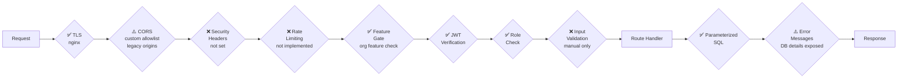

---

## 9. File Upload Security

### 9.1 Upload Architecture

All file uploads go through this pipeline:

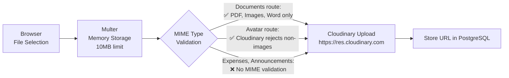

### 9.2 File Type Validation by Module

| Upload Endpoint | MIME Validation | Allowed Types | Status |
|---|---|---|---|
| `POST /api/auth/upload-avatar` | Cloudinary server-side | Image only (Cloudinary enforces) | ⚠️ Depends on Cloudinary |
| `POST /api/documents/upload` | ✅ Application-level MIME check | PDF, JPEG, PNG, WebP, DOC, DOCX | ✅ Validated |
| `POST /api/documents/:id/upload` | ✅ Application-level MIME check | PDF, JPEG, PNG, WebP, DOC, DOCX | ✅ Validated |
| `POST /api/expenses` (receipt) | ❌ No MIME validation | Any file type accepted | ❌ Gap |
| `POST /api/announcements` (attachment) | ❌ No MIME validation | Any file type accepted | ❌ Gap |

**Document MIME validation code (confirmed from `documents.routes.js`):**
```javascript
const allowedMIMEs = [
  'application/pdf', 'image/jpeg', 'image/png', 'image/webp',
  'application/msword',
  'application/vnd.openxmlformats-officedocument.wordprocessingml.document',
];
if (!allowedMIMEs.includes(req.file.mimetype))
  return res.status(400).json({ error: 'Invalid file type.' });
```

**Global Multer middleware (`middleware/upload.js`):**
```javascript
fileFilter: (req, file, cb) => {
  cb(null, true);  // ❌ Accepts ALL file types
}
```

The global middleware accepts all types. Module-specific validation (where it exists) must be added in each route handler, as seen in `documents.routes.js`. Expense and announcement uploads use the global middleware without adding their own MIME check.

### 9.3 File Security Risks and Mitigations

| Risk | Likelihood | Mitigation |
|---|---|---|
| Executable file upload (`.exe`, `.php`) | Low (Cloudinary sandbox) | No server-side execution — files are static CDN resources |
| Malware-infected PDF/document | Medium | No virus scanning — Cloudinary does not scan content |
| File size DoS | Low | 10MB Multer limit enforced before Cloudinary upload |
| MIME-type spoofing | Low | Attacker can set `Content-Type: image/jpeg` with `.php` file — Cloudinary won't execute it |
| Cloudinary URL exposure | Medium | URLs are not access-controlled; any URL holder can access the file |

### 9.4 Recommendations

| Recommendation | Priority |
|---|---|
| Add MIME validation to expense receipt and announcement uploads | High |
| Enable Cloudinary signed URL delivery for government documents and payslips | High |
| Add file extension validation alongside MIME check (defense in depth) | Medium |
| Consider ClamAV or VirusTotal API scanning for uploaded documents | Low |

---

## 10. Database Security

### 10.1 SQL Injection Protection

**Status: ✅ Implemented — Parameterized Queries Throughout**

The custom `db-pg-adapter.js` exclusively uses parameterized queries via `pg`'s `pool.query(sql, params)`. All filter values, inserted values, and update values are passed as parameters, never interpolated into SQL strings:

```javascript
// Correct — parameterized
pool.query('SELECT * FROM users WHERE email = $1', [email])

// Never done — vulnerable interpolation
pool.query(`SELECT * FROM users WHERE email = '${email}'`) // This pattern does not exist
```

For routes that use raw `pool.query()` directly (biometric, complex joins), the same parameterized pattern is used consistently. No raw string interpolation was found in any route file during analysis.

### 10.2 Multi-Tenant Data Isolation

**Status: ✅ Implemented — Application-Level**

Every query that accesses organizational data includes an `organization_id` filter derived from the authenticated user's JWT:

```javascript
// Helper — always called from JWT payload
function orgId(req) { return req.user?.organization_id || 1; }

// Applied in every route:
supabase.from('leaves').select('*').eq('organization_id', orgId(req))
```

**Isolation guarantee:** An authenticated employee from Organization A cannot see Organization B's data because every query filters by their own `organization_id` from the JWT.

**Isolation limitation:** This is application-level isolation only. The PostgreSQL database does not enforce this at the data layer.

### 10.3 Row-Level Security (RLS)

**Status: ❌ Explicitly Disabled**

```sql
-- From full_schema.sql — applied to ALL tables:
ALTER TABLE organizations DISABLE ROW LEVEL SECURITY;
ALTER TABLE users         DISABLE ROW LEVEL SECURITY;
ALTER TABLE attendance    DISABLE ROW LEVEL SECURITY;
-- ... (all 35+ tables)
```

**Impact:** Any connection to the PostgreSQL database — via pgAdmin, psql, direct TCP, or a future application — can read all data from all organizations without any restriction. The only protection is application-level `organization_id` filtering.

**Scenarios where this matters:**
- A direct database connection (for reporting, debugging, or migration) has unrestricted access
- A SQL injection vulnerability in a future code change would expose all org data
- A compromised database user credential exposes all data across all organizations

**Recommendation:** Re-enable RLS with policies that enforce `organization_id` matching the `current_setting('app.organization_id')` session variable, set on each connection. This provides defense-in-depth even if the application layer is bypassed.

### 10.4 Database Access Control

**Status: ⚠️ Single Privileged User**

The application uses a single PostgreSQL user (`lumos_admin`) for all database operations — reads, writes, deletes, schema changes. There is no read-only user for reporting, no restricted user for specific modules.

**Connection Pool Configuration:**

| Parameter | Value | Security Note |
|---|---|---|
| max connections | 20 | Prevents connection exhaustion |
| idle timeout | 30,000ms | Releases unused connections |
| connection timeout | 5,000ms | Fails fast; prevents thread starvation |
| statement timeout | 30,000ms | Prevents long-running query DoS |

---

## 11. Audit Logging

### 11.1 Currently Implemented Audit Events

**Status: ⚠️ Partially Implemented — Critical Gaps**

| Event | Table | Fields Captured | Status |
|---|---|---|---|
| Successful login | `login_history` | user_id, org_id, IP, user_agent, timestamp | ✅ Implemented |
| Last login metadata | `users` | last_login_at, last_login_ip, last_login_ua | ✅ Implemented |
| Org registration submitted | `platform_activity` | event_type, description, metadata (email, company) | ✅ Implemented |
| Org approved / rejected | `platform_activity` | event_type, org_id, reviewer info | ✅ Implemented |
| Member added (employee created) | `platform_activity` | name, email, role, org_id | ✅ Implemented |
| Member removed (employee deleted) | `platform_activity` | name, email, org_id | ✅ Implemented |
| Employee profile field changes | `profile_audit_log` | Changed field, old/new values, changed_by, timestamp | ✅ Implemented (V2 profile) |
| Banking record created/updated | `employee_bank_accounts` | updated_by, updated_at, created_by | ✅ Implemented |
| **Failed login attempts** | **None** | **Not recorded** | ❌ Critical gap |
| **Leave approvals/rejections** | **None** | **Not recorded** | ❌ Gap |
| **Attendance admin edits** | **None** | **Not recorded** | ❌ Gap |
| **Payslip generation** | **None** | **Not recorded** | ❌ Gap |
| **Role/permission changes** | **None** | **Not recorded** | ❌ Gap |
| **Document access** | **None** | **Not recorded** | ❌ Gap |
| **Export of employee data** | **None** | **Not recorded** | ❌ Gap |
| **TOTP enable/disable** | **None** | **Not recorded** | ❌ Gap |
| **Settings changes** | **None** | **Not recorded** | ❌ Gap |

### 11.2 Critical Gap — Failed Login Not Logged

```javascript
// auth.routes.js — login handler
if (!user || !bcrypt.compareSync(password, user.password))
  return res.status(401).json({ error: 'Invalid email or password' });

// ↑ If authentication fails, execution returns here.
// The login_history INSERT below is NEVER reached for failed attempts.

supabase.from('login_history').insert({
  user_id: user.id, ..., status: 'success'  // Only logged on success
}).then(() => {});
```

An attacker making 10,000 login attempts against an employee's account leaves no trace in the database. HR or security administrators have no way to detect ongoing credential attacks.

**Fix:** Add a failed login record before returning the 401:
```javascript
if (!user || !bcrypt.compareSync(password, user.password)) {
  if (user) { // We know who was targeted
    supabase.from('login_history').insert({
      user_id: user.id, organization_id: user.organization_id,
      ip_address: clientIp, user_agent: userAgent, status: 'failed'
    }).then(() => {});
  }
  return res.status(401).json({ error: 'Invalid email or password' });
}
```

### 11.3 Recommended Audit Event Expansion

| Event Category | Events to Log | Implementation Location |
|---|---|---|
| Authentication | Failed logins, TOTP enable/disable, password changes, password resets | `auth.routes.js` |
| Data access | Statutory data access, payslip downloads, GDPR data export | `statutory.routes.js`, `payroll.routes.js`, `auth.routes.js` |
| Leave management | Leave created, approved, rejected, cancelled | `leaves.routes.js` |
| Attendance | Admin attendance edits, admin-created records | `attendance.routes.js` |
| Employee data | Role changes, department changes, salary updates | `employees.routes.js` |
| Configuration | Settings changes, feature flag changes | `settings.routes.js`, `platform.routes.js` |
| Document operations | Document upload, download, delete, share | `documents.routes.js` |

---

## 12. Security Monitoring

### 12.1 Current State

**Status: ❌ No Security Monitoring Exists**

There is no security monitoring, alerting, log aggregation, or anomaly detection infrastructure. All logging uses `console.error()` and `console.log()` which write to Docker stdout — ephemeral, unsearchable, and not persisted.

| Monitoring Capability | Status |
|---|---|
| Failed login detection | ❌ Not possible (not logged) |
| Brute-force detection | ❌ Not possible (no rate limiting, not logged) |
| Unusual access patterns | ❌ Not possible (no centralized logging) |
| Data exfiltration detection | ❌ Not possible |
| Uptime monitoring | ❌ Not implemented (no `/health` endpoint) |
| Error rate monitoring | ❌ Not possible |
| Database query monitoring | ❌ Not implemented |
| File access logging | ❌ Not possible (Cloudinary access not logged) |

### 12.2 Recommended Monitoring Implementation

**Minimum viable monitoring (implementable in 1 day):**

1. **Uptime Robot** — External HTTP monitoring of `https://hrms.lumoslogic.com/health` every 5 minutes. Free tier available. Alerts via email within 5 minutes of downtime.

2. **Failed login alerting** — After logging failed logins (Section 11.2 fix), add a database query that runs hourly to detect IP addresses with more than 20 failed attempts:
```sql
SELECT ip_address, COUNT(*) as attempts
FROM login_history
WHERE status = 'failed'
  AND logged_in_at > NOW() - INTERVAL '1 hour'
GROUP BY ip_address
HAVING COUNT(*) > 20;
```

3. **Structured logging** — Replace `console.error` with `pino` to produce JSON-structured logs that can be queried and analyzed.

4. **Log retention** — Configure Docker log rotation to persist application logs:
```yaml
# docker-compose.yml
services:
  app:
    logging:
      driver: "json-file"
      options:
        max-size: "50m"
        max-file: "10"
```

---

## 13. Vulnerability Assessment

### 13.1 Vulnerability Register

| ID | Vulnerability | Severity | OWASP | Current State | Recommended Fix |
|---|---|---|---|---|---|
| V-001 | No rate limiting on login | **Critical** | A07 | Not implemented | `express-rate-limit` (Phase 1) |
| V-002 | JWT weak fallback secret in code | **Critical** | A02 | `'leave-tracker-secret-2026'` hardcoded | Enforce env var or crash |
| V-003 | PII in plain text (Aadhar, PAN, bank) | **High** | A02 | Stored unencrypted in PostgreSQL | AES-256-GCM field encryption |
| V-004 | No JWT revocation mechanism | **High** | A07 | 7-day tokens cannot be invalidated | Token versioning |
| V-005 | No security headers (no Helmet.js) | **High** | A05 | No X-Frame-Options, CSP, HSTS, etc. | Helmet.js |
| V-006 | RLS disabled on all DB tables | **High** | A01 | Explicit DISABLE RLS on all 35+ tables | Re-enable with org_id policies |
| V-007 | Biometric endpoint unauthenticated | **High** | A01 | `/iclock/cdata` accepts any source | nginx IP allowlist |
| V-008 | CORS includes legacy Firebase domains | **Medium** | A05 | 4 stale Firebase domains in allowlist | Remove legacy origins |
| V-009 | Failed logins not recorded | **Medium** | A09 | Only successful logins in login_history | Log failed attempts |
| V-010 | Email MIME validation gaps | **Medium** | A04 | Expense/announcement uploads unvalidated | Add MIME check to all upload routes |
| V-011 | TOTP recovery codes missing | **Medium** | A07 | No recovery path if phone lost | Implement backup codes |
| V-012 | Cloudinary URLs publicly accessible | **Medium** | A01 | No signed URL delivery for sensitive docs | Signed Cloudinary URLs |
| V-013 | No input validation library | **Medium** | A03 | Manual, inconsistent checks | Zod/Joi schema validation |
| V-014 | DB errors exposed to client | **Low** | A05 | `err.message` sent in 500 responses | Centralized error handler |
| V-015 | Email verification code no expiry | **Low** | A07 | 6-digit code valid indefinitely | Add `email_verify_expires` |
| V-016 | TOTP secret stored in plain text | **Low** | A02 | `users.totp_secret` unencrypted | Encrypt with app key |
| V-017 | No TOTP rate limiting | **Medium** | A07 | Unlimited TOTP guesses in 5min window | Rate limit TOTP verify endpoint |
| V-018 | Legacy CORS origins | **Medium** | A05 | Firebase domains in allowlist | Remove |
| V-019 | Single DB user with full privilege | **Low** | A05 | `lumos_admin` does all DB operations | Read-only user for reports |
| V-020 | No dependency audit | **Low** | A06 | `npm audit` not in CI | Add `npm audit` to CI pipeline |

---

## 14. Operational Responsibilities

### 14.1 Security Responsibility Matrix

| Responsibility | System Admin | DevOps | Developer | HR Admin | Security Role |
|---|:---:|:---:|:---:|:---:|:---:|
| JWT_SECRET rotation (annually) | Owns | Executes | — | — | Approves |
| Cloudinary credential rotation | — | Owns | — | Owns | — |
| SSL certificate monitoring | Owns | Owns | — | — | — |
| CORS allowlist review (quarterly) | — | — | Owns | — | Reviews |
| Failed login review (monthly) | — | Owns | — | — | Reviews |
| npm dependency audit (monthly) | — | — | Owns | — | — |
| Rate limiter configuration | — | Owns | Implements | — | — |
| Security header review | — | — | Owns | — | — |
| Biometric IP allowlist maintenance | Owns | Executes | — | — | — |
| TOTP recovery for locked users | Owns | — | — | Initiates | — |
| Incident response leadership | Owns | Supports | Supports | Notifies users | Leads |
| Security training for HR team | — | — | — | Receives | Delivers |
| Penetration test coordination | Owns | Supports | Supports | — | Owns |

### 14.2 Security Escalation Path

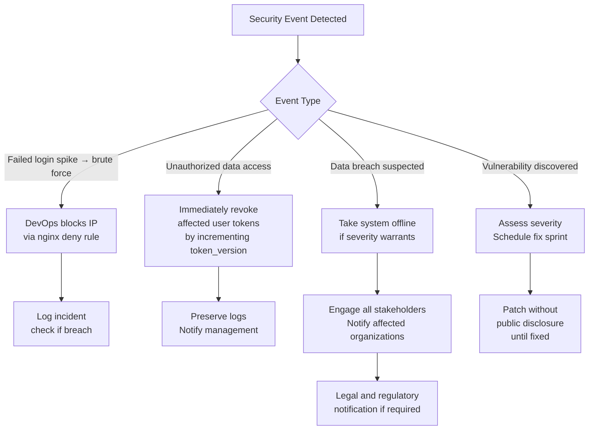

---

## 15. Security Best Practices

> **Best Practice:** Never commit the `.env` file to git. The `.gitignore` correctly excludes it, but verify with `git status` before every commit.

> **Best Practice:** Rotate the `JWT_SECRET` every 12 months. All users will be logged out on the next request — plan the rotation during off-peak hours and communicate to HR teams.

> **Best Practice:** When deactivating a high-privilege user (admin or root_admin), immediately change the `JWT_SECRET` to invalidate all outstanding tokens, or implement token versioning (F-006).

> **Best Practice:** Store the Cloudinary `API_SECRET`, `SMTP_PASS`, and `JWT_SECRET` in a password manager shared with no fewer than two authorized team members. A single-point-of-knowledge for credentials is an operational risk.

> **Best Practice:** All changes to the `organizations` table (plan upgrades, feature flag changes) should be performed by two authorized people (maker-checker). A single administrator making unauthorized plan upgrades has no audit trail.

> **Best Practice:** Log all failed administrative operations at the application layer, not just at the database layer. When an admin attempts to access a route that returns 403, this event should be logged.

> **Best Practice:** Validate MIME types by both the `Content-Type` header AND the file's magic bytes (first few bytes of the binary). A renamed `.exe` file can have a `Content-Type: image/jpeg` header but will have EXE magic bytes. Use the `file-type` npm package for magic byte detection.

> **Best Practice:** Never display raw PostgreSQL error messages to end users. Always translate error codes to user-friendly messages. Keep technical details in server logs only.

---

## 16. Future Security Roadmap

### Short Term — Phase 1 (Q3 2026)

| Item | Description | Effort |
|---|---|---|
| Rate limiting on auth endpoints | `express-rate-limit` on `/login`, `/forgot-password`, `/totp/verify-login` | 2 hours |
| Fix JWT secret fallback | Fail fast if `JWT_SECRET` not set | 30 minutes |
| Security headers (Helmet.js) | Add `helmet()` with appropriate CSP | 2 hours |
| Remove legacy CORS origins | Delete 4 Firebase domains from `ALLOWED_ORIGINS` | 15 minutes |
| Biometric endpoint IP allowlist | nginx `allow/deny` block for ZKTeco IPs | 1 hour |
| Log failed login attempts | Insert `status: 'failed'` rows in `login_history` | 1 hour |
| Add MIME validation to all uploads | Add check to expenses and announcements upload | 1 hour |
| Email verification code expiry | Add `email_verify_expires` column; enforce 15-min window | 2 hours |
| TOTP rate limiting | Add rate limiter to `/totp/verify-login` | 30 minutes |

### Medium Term — Phase 2 (Q4 2026)

| Item | Description | Effort |
|---|---|---|
| JWT token versioning (revocation) | `token_version` column; check on each auth request | 2–3 days |
| Input validation library (Zod) | Schema validation on all POST/PUT endpoints | 1–2 weeks |
| Centralized error handler | Replace per-route catch blocks; sanitize DB errors | 2 days |
| TOTP backup recovery codes | Generate 8 single-use codes at enrollment | 1 day |
| Field-level encryption for PII | AES-256-GCM for Aadhar, PAN, bank account number | 3–5 days |
| Cloudinary signed URL delivery | Restrict document/government-doc access to authenticated users | 1 day |
| Structured logging (pino) | Replace `console.error` throughout | 2 days |
| npm dependency audit in CI | `npm audit --audit-level=moderate` on every build | 2 hours |
| Read-only DB user for reports | Create `lumos_reader` role; apply to report queries | 1 day |
| Re-enable RLS with org policies | PostgreSQL row-level security enforcement | 3–5 days |

### Long Term — 2027 and beyond

| Item | Description | Business Value |
|---|---|---|
| Web Application Firewall (WAF) | ModSecurity on nginx or Cloudflare WAF | Automated attack detection and blocking |
| Secrets management (Vault) | HashiCorp Vault for all credentials | Automated rotation, audit trail, no plain-text secrets in `.env` |
| Security Information and Event Management (SIEM) | ELK Stack or Grafana Loki for log aggregation and alerting | Real-time threat detection |
| Penetration testing | Annual third-party penetration test | Validate security posture independently |
| SOC 2 Type II compliance | Formal security audit trail and controls | Client trust and enterprise contract eligibility |
| Zero-trust network architecture | Per-request identity verification at all service boundaries | Defense against internal threat actors |
| Biometric data encryption | Encrypt biometric raw logs (governed data under DPDP Act) | DPDP Act compliance |

---

## 17. Security Maturity Score

| Domain | Score | Basis |
|---|:---:|---|
| Authentication | 6/10 | bcrypt + JWT + TOTP implemented; no lockout, no revocation, weak fallback |
| Authorization / RBAC | 7/10 | Solid 4-role model, middleware chain correct; two confirmed bugs |
| Data Protection | 4/10 | Passwords hashed; PII, TOTP secret, org secrets in plain text |
| API Security | 3/10 | No rate limiting, no security headers, no input validation, DB errors exposed |
| File Upload Security | 6/10 | Documents validated; expenses/announcements not; Cloudinary URLs public |
| Database Security | 6/10 | Parameterized queries throughout; RLS disabled; single privileged user |
| Audit Logging | 4/10 | Login history; failed logins not logged; most events unrecorded |
| Security Monitoring | 1/10 | No monitoring infrastructure; no alerts; no anomaly detection |
| Infrastructure Security | 4/10 | TLS implemented; biometric endpoint unauthenticated; no WAF; no security headers |
| **Overall Score** | **4.6 / 10** | **Below enterprise standard — foundational controls present; critical gaps** |

**Maturity Level:** Developing — Core authentication is implemented correctly. The system needs security hardening (rate limiting, encryption, monitoring, input validation) before handling sensitive statutory data at enterprise scale.

---

## 18. OWASP Mapping Table

| OWASP 2021 Category | Risk Level for HRMS | Implemented Controls | Gaps |
|---|---|---|---|
| **A01 — Broken Access Control** | Medium | RBAC middleware, org_id scoping, selfOrAdmin field whitelist | RLS disabled, deactivated JWT not invalidated, 2 confirmed auth bugs (F-003, F-004) |
| **A02 — Cryptographic Failures** | High | bcrypt passwords, JWT signing, TLS | PII plain text, JWT weak fallback, TOTP secret plain text |
| **A03 — Injection** | Low | Parameterized queries throughout, no string interpolation | No input validation library; type confusion possible |
| **A04 — Insecure Design** | Medium | CORS allowlist, org isolation by design, Bearer auth (CSRF immune) | No rate limiting design, no lockout design, no token revocation design |
| **A05 — Security Misconfiguration** | High | CORS allowlist (not wildcard), Express JSON parsing | No security headers, RLS disabled, legacy CORS domains, single DB user |
| **A06 — Vulnerable/Outdated Components** | Low | `otplib` pinned to 12.0.1 | No `npm audit` in CI; dependency audit not performed |
| **A07 — Auth and Auth Failures** | High | bcrypt, JWT, TOTP, force-password-change, password history | No rate limiting, no lockout, no JWT revocation, TOTP no recovery |
| **A08 — Data Integrity Failures** | Low | JWT signed, `npm ci` for production builds | No SRI for CDN resources; no package integrity verification in deploy |
| **A09 — Security Logging Failures** | High | Login history (successes only), profile audit log | Failed logins not logged, no leave/attendance audit, no monitoring |
| **A10 — SSRF** | Not Applicable | No user-controlled URL fetching | — |

---

## 19. Security Checklist

### Pre-Deployment Security Gate

- [ ] `JWT_SECRET` set to minimum 32-character random string (not default)
- [ ] `DB_PASSWORD` is strong and unique (not `CHANGE_THIS`)
- [ ] `CLOUDINARY_API_SECRET` is set and correct
- [ ] `SMTP_PASS` is set (or SMTP features confirmed disabled)
- [ ] `.env` file is NOT committed to git (`git status` verified)
- [ ] `NODE_ENV=production` set in all containers
- [ ] nginx SSL certificate valid and not expiring within 30 days
- [ ] Biometric device IPs documented; nginx IP allowlist configured
- [ ] Legacy Firebase domains removed from `ALLOWED_ORIGINS`
- [ ] All Docker containers running as non-root user `lumos`
- [ ] PostgreSQL port `5432` not exposed publicly (`127.0.0.1:5432` only)

### Application Security Gate

- [ ] All authenticated endpoints require `auth` middleware
- [ ] All admin-only endpoints require `adminOnly` or `rootAdminOnly` middleware
- [ ] Feature-gated routes are in `FEATURE_ROUTE_MAP`
- [ ] New upload endpoints have MIME type validation
- [ ] No hardcoded credentials in any source file
- [ ] `console.log` statements do not output sensitive data (passwords, tokens)

---

## 20. Monthly Security Review Checklist

- [ ] Review `login_history` table for anomalies (after failed login logging is implemented)
- [ ] Check Uptime Robot for any downtime events in the past 30 days
- [ ] Run `npm audit` in both `backend/` and `client/` directories
- [ ] Verify SSL certificate validity: `certbot certificates`
- [ ] Check that daily backup cron succeeded every day this month
- [ ] Review Docker logs for repeated 401/403 errors: `docker compose logs app --since 30d | grep "40[13]"`
- [ ] Verify biometric IP allowlist is current (no new devices added without allowlist update)
- [ ] Check `platform_activity` table for unexpected org-level events

---

## 21. Quarterly Security Audit Checklist

- [ ] Review and update CORS `ALLOWED_ORIGINS` — remove any stale domains
- [ ] Rotate non-critical credentials (Cloudinary API key, Google service account key)
- [ ] Audit `organization_features` table — verify all orgs have correct plan-appropriate features
- [ ] Review `platform_admins` table — confirm all platform admin accounts are still active and authorized
- [ ] Review `root_admin` accounts across all organizations — are all still employed?
- [ ] Run `docker scout cves` or equivalent container image vulnerability scan
- [ ] Review error logs for any patterns suggesting attack attempts
- [ ] Verify that backup restore test was completed this quarter
- [ ] Review TOTP-enabled user list — assist any users with recovery needs
- [ ] Verify `JWT_SECRET` has not been accidentally exposed in any commit: `git log -p | grep JWT_SECRET`
- [ ] Test rate limiter (when implemented) is correctly rejecting excessive requests
- [ ] Verify all API endpoints return correct HTTP status codes (no auth-required endpoints returning 200 without auth)

---

## 22. Annual Security Assessment Checklist

- [ ] Commission external penetration test
- [ ] Rotate `JWT_SECRET` (coordinate with HR team — all users re-login)
- [ ] Rotate all third-party API credentials (Cloudinary, Google Calendar)
- [ ] Review and update this security document
- [ ] Assess whether field-level encryption has been implemented for PII
- [ ] Review compliance requirements under DPDP Act (India) for biometric data
- [ ] Review Indian IT Act requirements for data protection
- [ ] Assess whether RLS has been implemented
- [ ] Evaluate whether the security maturity score has improved
- [ ] Review all third-party dependencies for known vulnerabilities
- [ ] Assess whether monitoring and SIEM capabilities are sufficient
- [ ] Review user access: remove stale platform_admin accounts, root_admin accounts for departed employees

---

## 23. Incident Response Checklist

### Suspected Credential Compromise

- [ ] **Contain:** Change `JWT_SECRET` immediately to invalidate all active tokens (all users re-login)
- [ ] **Contain:** Suspend affected user account (`employee_status = 'inactive'`)
- [ ] **Investigate:** Review `login_history` for the affected user — identify unusual IPs or times
- [ ] **Investigate:** Review `platform_activity` for actions taken by the compromised account
- [ ] **Investigate:** Check Cloudinary access logs for unusual file access
- [ ] **Remediate:** Reset affected user password
- [ ] **Remediate:** Require TOTP re-enrollment if account had 2FA
- [ ] **Notify:** Inform the HR administrator of the affected organization
- [ ] **Document:** Create incident report with timeline, impact, and remediation

### Suspected Data Breach

- [ ] **Assess scope:** Determine which tables and organizations may be affected
- [ ] **Preserve evidence:** Capture database state, logs, and access records before any changes
- [ ] **Contain:** If breach is via application, consider taking system offline
- [ ] **Legal:** Notify organizational management immediately
- [ ] **Legal:** Evaluate notification obligations under DPDP Act (India)
- [ ] **Remediate:** Identify and close the exploit path
- [ ] **Recovery:** Follow restore procedures from `05_Data_Backup_Strategy.md` if data is corrupted
- [ ] **Post-incident:** Conduct root cause analysis; update security controls

### System Unavailability

- [ ] Check nginx: `systemctl status nginx`
- [ ] Check Docker containers: `docker compose ps`
- [ ] Check application health: `curl http://localhost:3000/health`
- [ ] Check PostgreSQL: `docker exec lumos_postgres pg_isready`
- [ ] Check disk space: `df -h`
- [ ] Check Docker logs: `docker compose logs app --tail=50`
- [ ] If database issue: follow restore procedures from `05_Data_Backup_Strategy.md`
- [ ] Notify affected organizations of expected downtime window

---

## 24. Document Summary

This document has provided a complete security architecture and access control analysis of the Lumos Logic HRMS.

**Security strengths confirmed:**
- bcrypt password hashing correctly implemented with history enforcement
- JWT-based stateless authentication with TOTP 2FA support
- Solid four-role RBAC model with middleware enforcement
- Parameterized SQL queries throughout (no SQL injection risk)
- Multi-tenant data isolation via `organization_id` scoping
- CSRF-immune by design (Bearer token in header, not cookie)
- Document MIME type validation implemented
- Employee self-edit field whitelist correctly enforced

**Critical security gaps requiring immediate action:**
1. No rate limiting on authentication endpoints (V-001)
2. JWT weak fallback secret in source code (V-002)
3. PII stored in plain text — Aadhar, PAN, bank account numbers (V-003)
4. No JWT revocation mechanism (V-004)
5. No HTTP security headers / Helmet.js (V-005)
6. No security monitoring or anomaly detection
7. Failed login attempts not recorded (V-009)
8. Two confirmed authorization bugs in exit and performance modules

**Overall Security Maturity: 4.6/10 — Requires hardening before enterprise-scale deployment**

---

## 25. Related Documents

| Document | Relevance |
|---|---|
| `02_System_Architecture_Overview.md` | Authentication flow diagrams; JWT architecture |
| `03_Module_Overview.md` | Module-level access control details |
| `04_Pending_Development_Tasks.md` | Security findings F-001 through F-010; remediation tasks |
| `05_Data_Backup_Strategy.md` | Backup encryption; `.env` file protection |
| `07_Disaster_Recovery_Plan.md` | Incident response procedures |
| `08_Biometric_Integration.md` | Biometric endpoint security |
| `09_Database_Management_Guidelines.md` | Database security configuration |

---

## 26. Review and Update Recommendations

| Trigger | Action |
|---|---|
| Any security vulnerability discovered | Add to vulnerability register (Section 13); update OWASP mapping |
| New feature added with file upload | Verify MIME validation is present; add to upload security table (Section 9.2) |
| New authentication mechanism added | Update Sections 3 and 4; re-evaluate maturity score |
| Security remediation completed | Update status in vulnerability register; re-score maturity |
| npm dependency with CVE identified | Add to V-020; patch within 30 days for critical severity |
| DPDP Act or IT Act regulatory update | Review Sections 7, 11, and annual checklist for compliance impact |
| Penetration test completed | Update vulnerability register with findings; revise roadmap |
| Quarterly | Run all checklists; update implementation status |

**Next Scheduled Review:** October 2026

---

*End of Document 06 — Security Measures and Access Control*  
*Next: 07_Disaster_Recovery_Plan.md*
