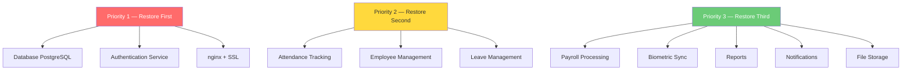
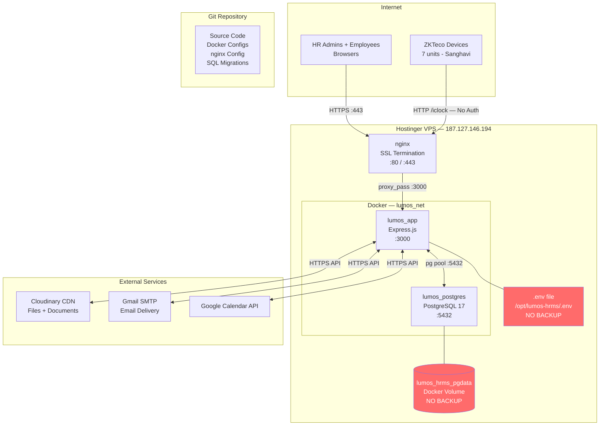
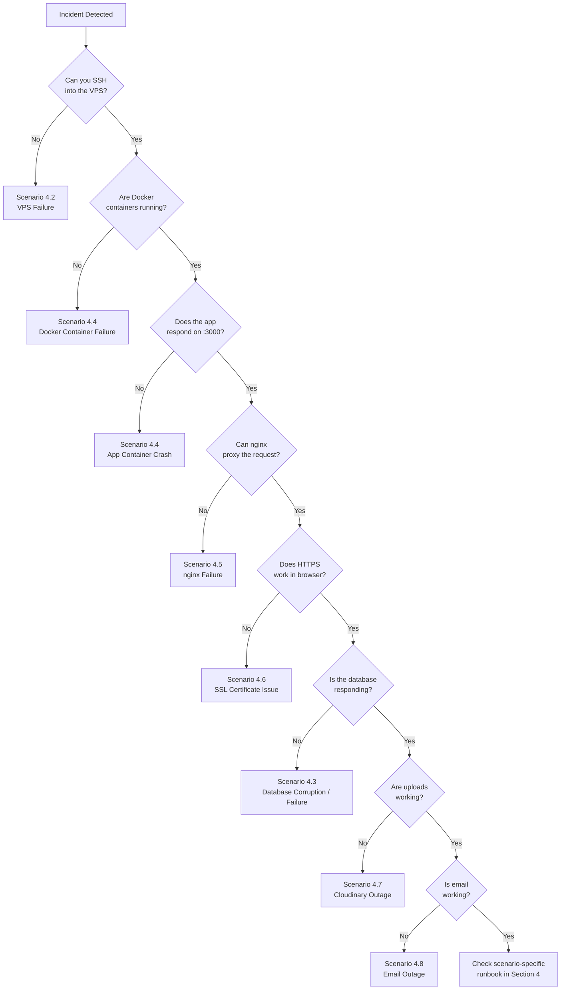
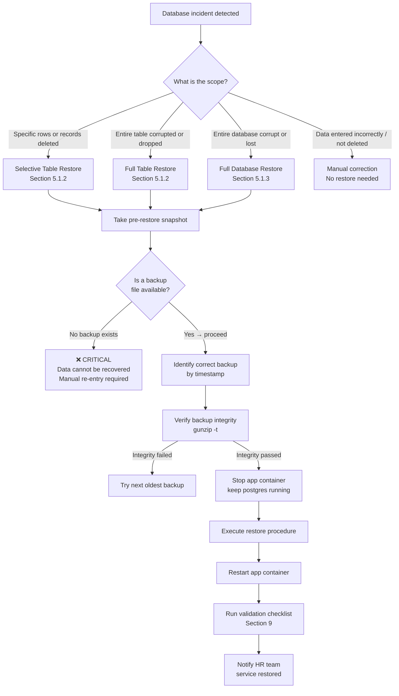
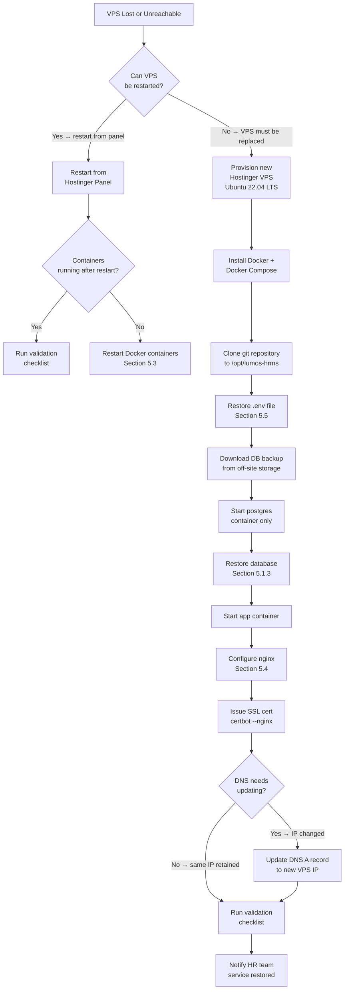
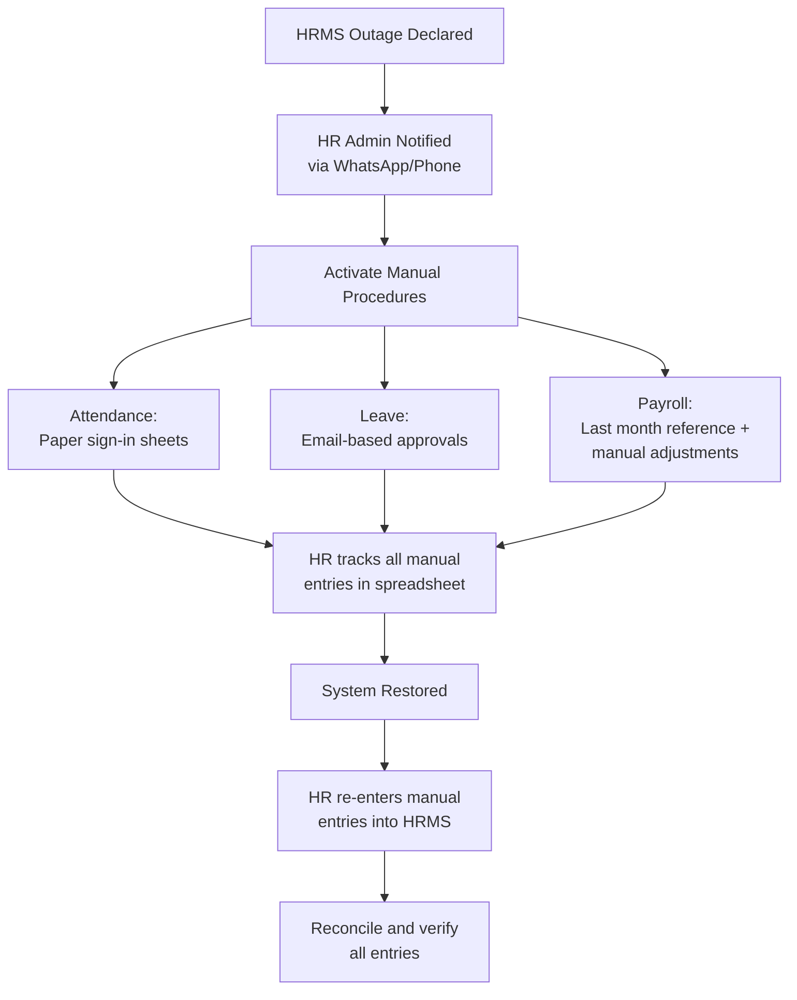
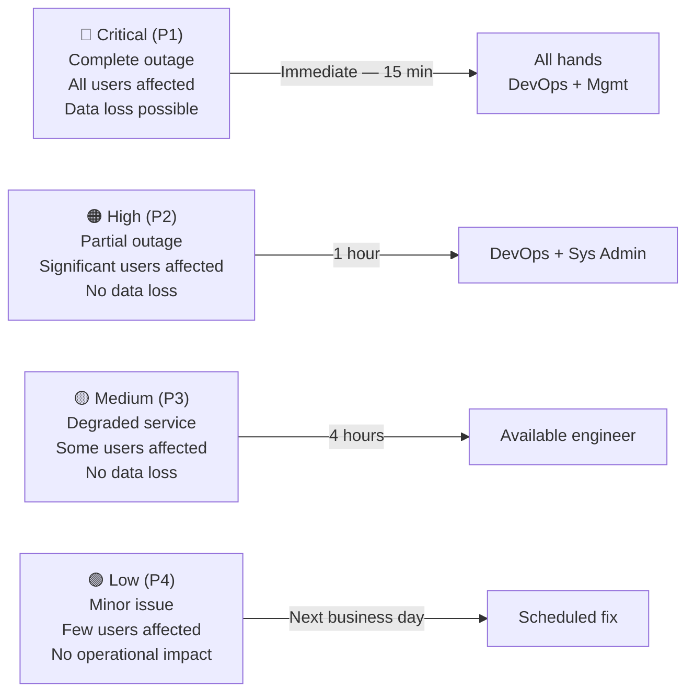
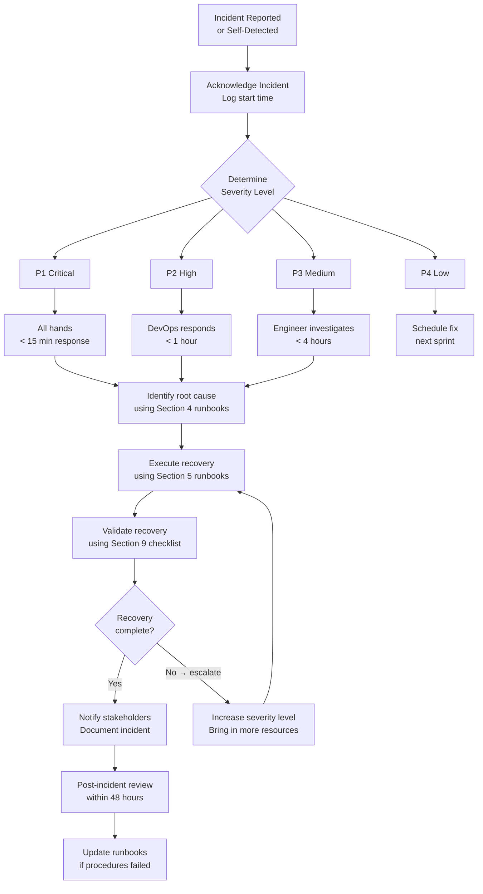
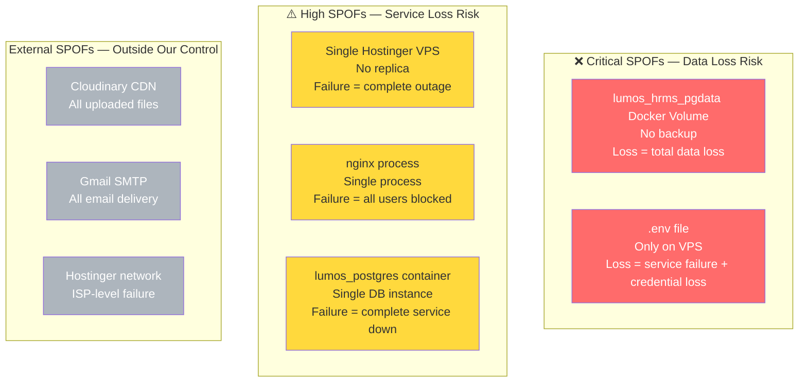

# 07 — Disaster Recovery Plan
## Lumos Logic HRMS — Enterprise Disaster Recovery, Business Continuity, and Incident Response Runbook

---

**Document Version:** 1.0
**Prepared By:** Lumos Logic
**Date:** July 2026
**Classification:** Confidential — Operations, DevOps, and System Administrator Distribution
**Audience:** DevOps Engineers, System Administrators, HR Administrators, Management

> **Operational Note:** This document is a practical runbook, not a policy document. Every procedure is written to be followed during a live incident by a person with SSH access to the Hostinger VPS. Commands are copy-paste ready. Infrastructure is described as it exists today. Gaps are called out explicitly with their business impact.

---

## Table of Contents

1. [Executive Summary](#1-executive-summary)
2. [Business Impact Analysis (BIA)](#2-business-impact-analysis-bia)
3. [Current Infrastructure Overview](#3-current-infrastructure-overview)
4. [Disaster Scenarios](#4-disaster-scenarios)
5. [Recovery Procedures](#5-recovery-procedures)
6. [Rollback Procedures](#6-rollback-procedures)
7. [Business Continuity Plan](#7-business-continuity-plan)
8. [Incident Response](#8-incident-response)
9. [Validation After Recovery](#9-validation-after-recovery)
10. [Disaster Recovery Testing](#10-disaster-recovery-testing)
11. [Risks](#11-risks)
12. [Operational Responsibilities](#12-operational-responsibilities)
13. [Best Practices](#13-best-practices)
14. [Future Improvements](#14-future-improvements)
- [Appendix A — Disaster Recovery Checklist](#appendix-a--disaster-recovery-checklist)
- [Appendix B — Incident Response Checklist](#appendix-b--incident-response-checklist)
- [Appendix C — Recovery Validation Checklist](#appendix-c--recovery-validation-checklist)
- [Appendix D — Communication Template for Production Incidents](#appendix-d--communication-template-for-production-incidents)
- [Appendix E — Disaster Recovery Testing Calendar](#appendix-e--disaster-recovery-testing-calendar)
- [Appendix F — Recovery Timeline Summary](#appendix-f--recovery-timeline-summary)
- [Appendix G — Document Summary](#appendix-g--document-summary)

---

# 1. Executive Summary

### 1.1 Purpose

This document is the authoritative operational guide for recovering the Lumos Logic HRMS from any production incident, disaster, or service disruption. It provides step-by-step runbooks for every known failure scenario, defines incident severity levels and escalation paths, establishes business continuity procedures for HR operations during outages, and sets the testing schedule for validating recovery readiness.

This document does not describe what the DR policy should be. It describes exactly what to do when something fails, based on the infrastructure that exists today.

### 1.2 Scope

This runbook covers:
- All components of the Lumos Logic HRMS production deployment on Hostinger VPS (187.127.146.194)
- All Docker containers: `lumos_app` (Express.js) and `lumos_postgres` (PostgreSQL 17)
- nginx reverse proxy and Let's Encrypt SSL
- Cloudinary file storage
- Gmail SMTP email delivery
- Google Calendar integration
- ZKTeco biometric device integration
- All data stored in the `lumos_hrms` PostgreSQL database

This document covers the shared HRMS platform. Enterprise client configurations (Sanghavi Association / Relitrade biometric integration) are included where behaviour differs.

### 1.3 Business Objectives

| Objective | Description |
|---|---|
| **Minimize data loss** | Recover to the most recent available backup with maximum completeness |
| **Minimize downtime** | Restore service as quickly as possible using documented, tested procedures |
| **Protect HR operations** | Ensure HR teams can continue critical functions (attendance, leave, payroll) during outages using manual fallback procedures |
| **Maintain data integrity** | Ensure no recovery action introduces inconsistency, duplicate records, or partial data |
| **Preserve audit trail** | Document all actions taken during incident response for post-incident review |

### 1.4 Recovery Philosophy

The HRMS runs on a single Hostinger VPS with no hot standby, no automated failover, and — as of July 2026 — no automated backup. This is the defining constraint of all recovery procedures in this document.

**Every recovery operation is manual.** Every recovery depends on a human with SSH access executing the procedures in this runbook. There is no automation that will trigger recovery, no monitoring that will detect failures, and no replica that will absorb traffic during outage.

Recovery philosophy operates on three principles:

1. **Stabilize before restoring.** Never make changes to a broken system without first capturing its current state. A snapshot of a broken database is more useful than a partially-restored database.
2. **Restore to last known good.** When in doubt, restore from the most recent verified backup rather than attempting to repair in place.
3. **Validate before announcing.** Do not declare recovery complete until every checklist item in Section 9 has been verified.

---

# 2. Business Impact Analysis (BIA)

### 2.1 Critical Services

The BIA identifies each service provided by the HRMS, its business criticality, and the consequences of unavailability. All RTO and RPO values reflect the target state after backup procedures from Document 05 are implemented. Current state values reflect the reality as of July 2026.

---

#### 2.1.1 Authentication Service

| Property | Value |
|---|---|
| **Business Function** | User login, JWT issuance, password management, TOTP verification |
| **Criticality** | Critical — all other services depend on this |
| **MAD (Max Acceptable Downtime)** | 1 hour |
| **RTO (Target)** | 30 minutes |
| **RTO (Current)** | 2–5 hours (manual recovery, no automation) |
| **RPO** | No data loss — authentication state is stateless (JWT) |
| **Business Impact** | Complete service lockout. All employees and HR admins lose access to the system. No attendance, leave, or HR operations possible via digital system. |

---

#### 2.1.2 Employee Management

| Property | Value |
|---|---|
| **Business Function** | Employee record creation, profile management, department/role assignment, statutory data |
| **Criticality** | High |
| **MAD** | 4 hours |
| **RTO (Target)** | 2 hours |
| **RTO (Current)** | 2–6 hours (dependent on database restore) |
| **RPO (Target)** | 24 hours (daily backup) |
| **RPO (Current)** | Undefined — no backup exists |
| **Business Impact** | New employee onboarding blocked. Existing employee records inaccessible. Statutory compliance (PF, ESI, PT) data unavailable for payroll processing. |

---

#### 2.1.3 Attendance Tracking

| Property | Value |
|---|---|
| **Business Function** | Employee check-in/check-out, break tracking, biometric punch processing, attendance records |
| **Criticality** | Critical — daily operational dependency |
| **MAD** | 2 hours |
| **RTO (Target)** | 1 hour |
| **RTO (Current)** | 2–5 hours |
| **RPO (Target)** | 24 hours |
| **RPO (Current)** | Undefined |
| **Business Impact** | Employees cannot record attendance digitally. Biometric punches may buffer on devices (ZKTeco devices queue up to 100,000 records locally) but will not auto-sync until system is restored. Manual attendance sheets must be used. Data entered after backup timestamp but before failure is permanently lost without manual re-entry. |

---

#### 2.1.4 Leave Management

| Property | Value |
|---|---|
| **Business Function** | Leave application, approval workflow, balance tracking, calendar integration |
| **Criticality** | High |
| **MAD** | 4 hours |
| **RTO (Target)** | 2 hours |
| **RTO (Current)** | 2–6 hours |
| **RPO (Target)** | 24 hours |
| **RPO (Current)** | Undefined |
| **Business Impact** | Employees cannot apply for leave. HR cannot approve pending applications. Leave balance calculations become stale. Urgent leave requests must be handled via email. |

---

#### 2.1.5 Payroll Processing

| Property | Value |
|---|---|
| **Business Function** | Salary structure management, payslip generation, payroll reports |
| **Criticality** | High — time-sensitive (end-of-month) |
| **MAD** | 8 hours (non-payroll-run period); 2 hours (during active payroll run) |
| **RTO (Target)** | 2 hours |
| **RTO (Current)** | 2–6 hours |
| **RPO (Target)** | 24 hours |
| **RPO (Current)** | Undefined |
| **Business Impact** | Payslip generation blocked. Salary disbursement delayed if system is unavailable during payroll processing window. Statutory deductions (PF, ESI, PT) calculations unavailable. Historical payslips inaccessible to employees. |

---

#### 2.1.6 Biometric Sync (Sanghavi / Enterprise Client)

| Property | Value |
|---|---|
| **Business Function** | Real-time ZKTeco punch data reception, attendance auto-creation from biometric events |
| **Criticality** | High (for Sanghavi Association / Relitrade) |
| **MAD** | 4 hours |
| **RTO (Target)** | 1 hour |
| **RTO (Current)** | 1 hour (biometric endpoint recovery is independent of full app recovery) |
| **RPO** | Low risk — ZKTeco devices buffer up to 100,000 records locally and re-sync automatically when server is restored |
| **Business Impact** | During outage, employees at Sanghavi's 7 device locations still punch as normal. Punches are stored on device. After server recovery, `/api/biometric/reprocess` can reconcile buffered data. No attendance data is lost during outage as long as physical devices are operational. |

---

#### 2.1.7 Reports

| Property | Value |
|---|---|
| **Business Function** | Attendance reports, leave reports, payroll summaries, export to CSV/PDF |
| **Criticality** | Medium — operational but not time-critical |
| **MAD** | 8 hours |
| **RTO (Target)** | 4 hours (inherits from database recovery) |
| **RTO (Current)** | 4–8 hours |
| **RPO** | Reports are generated on-demand from the database — no separate storage; RPO equals database RPO |
| **Business Impact** | Compliance reporting blocked. Monthly attendance summary unavailable. Reports can be regenerated in full after database is restored — no permanent data loss if database backup is intact. |

---

#### 2.1.8 Notifications (Email and Push)

| Property | Value |
|---|---|
| **Business Function** | Email notifications for leave approvals, payslip generation, announcements; browser push notifications |
| **Criticality** | Low — supporting function |
| **MAD** | 24 hours |
| **RTO (Target)** | 4 hours |
| **RTO (Current)** | 2 hours (SMTP re-configuration is straightforward) |
| **RPO** | Not applicable — notifications are transient; missed notifications during outage are not recoverable but are low-impact |
| **Business Impact** | HR teams receive no automated alerts for leave applications or attendance anomalies. Employees do not receive payslip notification emails. All core operations continue manually. |

---

#### 2.1.9 File Storage (Cloudinary)

| Property | Value |
|---|---|
| **Business Function** | Employee documents, government ID uploads, expense receipts, payslip PDFs, avatars |
| **Criticality** | Medium |
| **MAD** | 4 hours |
| **RTO (Target)** | N/A — Cloudinary is a third-party service; recovery depends on Cloudinary SLA |
| **RTO (Current)** | N/A |
| **RPO** | Cloudinary provides internal redundancy; files are not lost unless Cloudinary account is compromised or closed |
| **Business Impact** | Document uploads fail. Existing documents show as broken links. Employee avatars not displayed. Payslip PDF links inaccessible. Core HR operations (attendance, leave, payroll calculations) are unaffected — only document display and upload are impacted. |

---

### 2.2 Service Recovery Priority



---

# 3. Current Infrastructure Overview

### 3.1 Production Deployment

| Component | Technology | Location | Status |
|---|---|---|---|
| VPS | Hostinger VPS | 187.127.146.194 | ✅ Implemented |
| SSH Access | `ssh root@187.127.146.194` | Hostinger VPS | ✅ Implemented |
| Web Server | nginx (reverse proxy) | `/etc/nginx/sites-available/lumos.conf` | ✅ Implemented |
| Application | Express.js (`lumos_app` container, port 3000) | Docker | ✅ Implemented |
| Database | PostgreSQL 17 (`lumos_postgres` container, port 5432) | Docker volume `lumos_hrms_pgdata` | ✅ Implemented |
| Container Orchestration | Docker Compose v2 (`/opt/lumos-hrms/docker-compose.yml`) | VPS | ✅ Implemented |
| SSL/TLS | Let's Encrypt via Certbot | `/etc/letsencrypt/live/hrms.lumoslogic.com/` | ✅ Implemented |
| File Storage | Cloudinary CDN | External (Cloudinary cloud) | ✅ Implemented |
| Email | Nodemailer via Gmail SMTP (`smtp.gmail.com:587`) | External (Google) | ✅ Implemented |
| Push Notifications | Web Push / VAPID | External (Browser push services) | ✅ Implemented |
| Google Calendar | googleapis OAuth2 | External (Google) | ✅ Implemented |
| Biometric Integration | ZKTeco ADMS protocol (`/iclock/*` endpoints) | VPS (no JWT auth) | ✅ Implemented |
| Source Code | Git repository | Remote Git host | ✅ Implemented |
| nginx Config | `nginx/lumos.conf` in git repository | Git | ✅ Implemented |
| Docker Config | `docker-compose.yml`, `Dockerfile` in git | Git | ✅ Implemented |
| SQL Migrations | `backend/migrations/` in git | Git | ✅ Implemented |

### 3.2 What Is Manual (No Automation)

| Item | Manual Action Required | Risk |
|---|---|---|
| Database backup | SSH to VPS, run `pg_dump` manually | ❌ No automated backup exists as of July 2026 |
| `.env` file backup | Manually encrypt and store off-site | ❌ Only copy exists on production VPS |
| Deployment | SSH to VPS, `git pull`, `docker compose up --build` | Partially scripted; no CI/CD |
| SSL certificate monitoring | Manual `certbot certificates` check | Certbot timer auto-renews but no expiry alert exists |
| Container health monitoring | Manual `docker compose ps` | No automated alerting |
| Log review | Manual `docker compose logs` | Logs are ephemeral; not retained |
| Backup integrity verification | Manual `gunzip -t` | No automated verification |

### 3.3 What Is Recommended (Not Yet Implemented)

| Recommendation | Description | Source |
|---|---|---|
| Automated daily `pg_dump` | Cron job to dump database nightly — script provided in Document 05 | Doc 05, Section 5.3 |
| Off-site backup sync | rclone to cloud storage (Backblaze B2 or equivalent) | Doc 05, Section 5.3 |
| Backup monitoring | healthchecks.io ping on successful backup | Doc 05, Section 8.3 |
| Uptime monitoring | Uptime Robot HTTP check on health endpoint | Doc 06, Section 12.2 |
| Log retention | Docker JSON-file logging with rotation | Doc 06, Section 12.2 |
| Health endpoint | `GET /health` returning `{status: "ok", db: "connected"}` | Doc 04, F-012 |
| Replica VPS | Second VPS for hot standby | Doc 05, Section 13 |
| WAF / DDoS protection | Cloudflare or nginx WAF rules | Doc 06, Section 16 |

### 3.4 Infrastructure Architecture



> **Red boxes** indicate critical single points of failure with no current backup or protection.

### 3.5 Data Location Reference

| Data | Location | Backed Up? |
|---|---|---|
| All HR data (employees, attendance, leaves, payroll) | `lumos_hrms_pgdata` Docker volume | ❌ No |
| Application secrets, DB credentials, API keys | `/opt/lumos-hrms/.env` | ❌ No |
| Application source code | Git repository | ✅ Yes (git) |
| Docker configuration | Git repository | ✅ Yes (git) |
| nginx configuration | Git repository | ✅ Yes (git) |
| SQL migration files | Git repository | ✅ Yes (git) |
| Employee documents, avatars, payslip PDFs | Cloudinary CDN | ✅ Yes (Cloudinary redundancy) |
| SSL certificates | `/etc/letsencrypt/` on VPS | ✅ Yes (re-issuable via Certbot) |

---

# 4. Disaster Scenarios

### 4.1 Scenario Decision Tree



---

### 4.2 Scenario 1 — VPS Failure

**Description:** The Hostinger VPS is completely unavailable — hardware failure, provider outage, accidental deletion, or total network failure at the provider level.

#### Symptoms
- `https://hrms.lumoslogic.com` returns connection timeout or DNS resolution failure
- `ssh root@187.127.146.194` times out or refuses connection
- `ping 187.127.146.194` shows 100% packet loss
- All users cannot access the system

#### Detection
> **Current state: Manual only.** There is no uptime monitoring. Outage is detected when a user or HR team reports that the system is unreachable. Time-to-detection can be hours.
>
> **Recommended:** Set up Uptime Robot to monitor `https://hrms.lumoslogic.com` every 5 minutes and alert via email/SMS when unreachable.

#### Immediate Actions (First 15 Minutes)
1. Verify the outage is VPS-level (not local network): Test from a different network or device
2. Log in to Hostinger control panel at `hpanel.hostinger.com`
3. Check VPS status — is it shown as running, stopped, or in error state?
4. Check Hostinger status page for provider-wide incidents
5. If VPS shows as running but unreachable: Attempt "Restart" from Hostinger panel
6. If VPS shows as stopped: Attempt "Start" from Hostinger panel
7. If VPS is deleted or unrecoverable: Escalate immediately — this is a full disaster recovery scenario

#### Recovery Procedure
See Section 5.8 — Complete System Recovery Runbook.

#### Validation Steps
1. SSH access restored: `ssh root@187.127.146.194`
2. All Docker containers running: `docker compose -f /opt/lumos-hrms/docker-compose.yml ps`
3. HTTP health check passes: `curl http://localhost:3000/health`
4. HTTPS accessible from browser: `https://hrms.lumoslogic.com`
5. Login works for known account

---

### 4.3 Scenario 2 — Database Corruption or Loss

**Description:** The PostgreSQL database is corrupted, tables are missing, critical records are deleted, or the Docker volume is damaged.

#### Symptoms
- Application starts but all API calls return HTTP 500
- Docker logs show PostgreSQL errors: `relation does not exist`, `connection refused`, `FATAL: database file appears to be corrupted`
- Login fails with server error (not auth failure)
- Specific tables return zero rows unexpectedly

#### Detection
> **Current state: Manual.** Users report `500` errors. DevOps checks `docker compose logs lumos_postgres --tail=50` and `docker compose logs lumos_app --tail=50` via SSH.

#### Immediate Actions (First 15 Minutes)
```bash
# Step 1: SSH into VPS
ssh root@187.127.146.194

# Step 2: Check PostgreSQL container status
docker compose -f /opt/lumos-hrms/docker-compose.yml ps

# Step 3: Check PostgreSQL logs for error type
docker compose -f /opt/lumos-hrms/docker-compose.yml logs lumos_postgres --tail=50

# Step 4: Check if database is accessible
docker exec lumos_postgres pg_isready -U lumos_admin
# Expected: "lumos_admin@localhost:5432/lumos_hrms - accepting connections"

# Step 5: STOP - do not make any further changes until you understand scope
# Capture current DB state before attempting restore
docker exec lumos_postgres pg_dump -U lumos_admin lumos_hrms 2>/dev/null | \
    gzip > /tmp/pre_restore_snapshot_$(date +%Y%m%d_%H%M%S).sql.gz
echo "Pre-restore snapshot saved."
```

#### Recovery Procedure
See Section 5.1 — Database Recovery Runbook.

#### Validation Steps
1. `docker exec lumos_postgres pg_isready -U lumos_admin` returns "accepting connections"
2. Critical table row counts are within expected range (see Section 9.2)
3. Login works for a known employee account
4. Attendance check-in API responds correctly

---

### 4.4 Scenario 3 — Docker Container Failure

**Description:** One or both Docker containers (`lumos_app` or `lumos_postgres`) have exited or are in a restart loop.

#### Symptoms
- `http://localhost:3000` refuses connection (app container down)
- nginx returns `502 Bad Gateway` (app container down)
- Database queries fail everywhere (postgres container down)
- `docker compose ps` shows container status as `Exited` with a non-zero exit code

#### Detection
> **Current state: Manual.** Either users report errors, or a developer SSHs in and runs `docker compose ps`. No automated container health monitoring exists.

#### Immediate Actions

```bash
ssh root@187.127.146.194
cd /opt/lumos-hrms

# Check container status
docker compose ps

# Check which container failed and why
docker compose logs lumos_app --tail=100
docker compose logs lumos_postgres --tail=100

# Attempt restart (safe — will not cause data loss if postgres was clean shutdown)
docker compose up -d
```

#### Recovery Procedure — App Container (`lumos_app`) Crash

```bash
# Check exit code and last logs
docker inspect lumos_app --format='{{.State.ExitCode}}'
docker compose logs lumos_app --tail=100

# Common causes:
# Exit 1: Node.js crash — check for syntax errors or missing env vars
# Exit 137: OOM kill — check memory: free -h
# Exit 143: SIGTERM — normal shutdown; may have been killed during deployment

# If the .env file is missing or malformed:
ls -la /opt/lumos-hrms/.env
# If missing → see Scenario 4.10 (Environment Variable Loss)

# Restart app container:
docker compose up -d lumos_app

# Watch startup logs:
docker compose logs lumos_app -f
# Expected: "Server running on port 3000"

# If container keeps crashing, check disk space:
df -h
# If /var partition is full, clean Docker cache:
docker system prune -f
```

#### Recovery Procedure — PostgreSQL Container (`lumos_postgres`) Crash

```bash
# Check PostgreSQL container logs
docker compose logs lumos_postgres --tail=100

# Check Docker volume is intact
docker volume inspect lumos_hrms_pgdata

# Attempt restart
docker compose up -d lumos_postgres

# Wait 10 seconds, then verify
sleep 10
docker exec lumos_postgres pg_isready -U lumos_admin

# If PostgreSQL cannot start — the volume may be corrupted
# This triggers Scenario 4.3 (Database Corruption)
```

#### Validation Steps
1. `docker compose ps` shows all containers as `Up`
2. `curl http://localhost:3000/health` returns 200
3. `https://hrms.lumoslogic.com` accessible in browser
4. Login works

---

### 4.5 Scenario 4 — Nginx Failure

**Description:** The nginx reverse proxy has crashed, its configuration is invalid, or the SSL handshake is failing. The application containers may be running correctly but are unreachable from the internet.

#### Symptoms
- Browser shows connection refused or `502 Bad Gateway`
- `curl http://187.127.146.194` fails
- `docker compose ps` shows both containers as `Up` (app is running; nginx is the problem)
- `systemctl status nginx` shows failed or inactive

#### Detection
> **Current state: Manual.** Users report unreachable system. DevOps checks `systemctl status nginx` via SSH.

#### Immediate Actions

```bash
ssh root@187.127.146.194

# Check nginx status
systemctl status nginx

# Check nginx configuration syntax
nginx -t
# Expected: "nginx: configuration file /etc/nginx/nginx.conf test is successful"

# If configuration is valid, restart nginx
systemctl restart nginx
systemctl status nginx
```

#### Recovery Procedure — nginx Configuration Corrupted

```bash
# Restore nginx config from git repository
cd /opt/lumos-hrms

# Copy the repo version of the config
cp nginx/lumos.conf /etc/nginx/sites-available/lumos.conf
ln -sf /etc/nginx/sites-available/lumos.conf /etc/nginx/sites-enabled/lumos.conf

# Test and reload
nginx -t && systemctl reload nginx

# Verify
curl -I https://hrms.lumoslogic.com
```

#### Recovery Procedure — nginx Process Missing

```bash
# Install nginx if somehow removed
apt-get update && apt-get install -y nginx

# Restore configuration from git
cp /opt/lumos-hrms/nginx/lumos.conf /etc/nginx/sites-available/lumos.conf
ln -sf /etc/nginx/sites-available/lumos.conf /etc/nginx/sites-enabled/lumos.conf

# Remove default nginx config to avoid conflicts
rm -f /etc/nginx/sites-enabled/default

# Enable and start nginx
systemctl enable nginx
systemctl start nginx

# Verify SSL is working (certificates should still be in /etc/letsencrypt)
nginx -t && systemctl status nginx
curl -I https://hrms.lumoslogic.com
```

#### Validation Steps
1. `systemctl status nginx` shows `active (running)`
2. `nginx -t` passes
3. `curl -I https://hrms.lumoslogic.com` returns HTTP 200 or redirect to HTTPS

---

### 4.6 Scenario 5 — SSL Certificate Expiration

**Description:** The Let's Encrypt SSL certificate has expired. Browsers show a certificate warning. HTTPS connections fail.

#### Symptoms
- Browser shows "Your connection is not private" (NET::ERR_CERT_DATE_INVALID)
- `curl -I https://hrms.lumoslogic.com` returns SSL error
- `certbot certificates` shows `VALID: EXPIRED` or expiry date in the past

#### Detection
> **Current state: Manual.** Either a user reports the browser warning, or a developer checks `certbot certificates` manually. Certbot's systemd timer should auto-renew at 60 days — but no alert exists if the timer fails.

#### Immediate Actions

```bash
ssh root@187.127.146.194

# Check current certificate status
certbot certificates
# Look for: "Expiry Date" — if in the past, certificate is expired

# Check Certbot timer is active
systemctl status certbot.timer

# Attempt renewal
certbot renew
```

#### Recovery Procedure — Certificate Renewal

```bash
# Force renewal (use when 'certbot renew' says "not due for renewal yet" but cert is expired)
certbot renew --force-renewal

# Reload nginx to pick up the new certificate
systemctl reload nginx

# If renewal fails due to DNS or port 80 issues:
# Step 1: Verify port 80 is open and not blocked by nginx config
nginx -t

# Step 2: If nginx is blocking port 80, temporarily stop it for Certbot standalone
systemctl stop nginx
certbot certonly --standalone -d hrms.lumoslogic.com
systemctl start nginx
systemctl reload nginx
```

#### Recovery Procedure — Complete Certificate Re-Issue (If Certs Are Lost)

```bash
# If /etc/letsencrypt/live/ is missing or corrupted:
certbot certonly --nginx -d hrms.lumoslogic.com

# Reload nginx
systemctl reload nginx
```

#### Validation Steps
1. `certbot certificates` shows `VALID: XX days` (should be 80-90 days after fresh issue)
2. `curl -I https://hrms.lumoslogic.com` returns HTTP 200 with no SSL error
3. Browser shows padlock icon with valid certificate
4. Certificate expiry is at least 60 days away (if less than 30 days after renewal, investigate Certbot timer)

---

### 4.7 Scenario 6 — Cloudinary Outage

**Description:** Cloudinary's CDN service is experiencing an outage. File uploads fail and existing uploaded files (documents, avatars, payslips) are not accessible.

#### Symptoms
- File upload API returns error (HTTP 500 from `/api/documents/upload`, `/api/auth/upload-avatar`)
- Existing employee avatars show broken image icons in the browser
- Payslip PDF links return 404 or timeout
- Government document upload fails

#### Detection
> **Current state: Manual.** Users report broken file uploads or missing images. Developer checks `docker compose logs lumos_app --tail=50` to see Cloudinary SDK errors, then checks `status.cloudinary.com`.

#### Immediate Actions
1. Check Cloudinary status page: `https://status.cloudinary.com`
2. Confirm the issue is Cloudinary-side (not CLOUDINARY_API_KEY misconfiguration)
3. Check Cloudinary API credentials in `.env` are correct
4. **Do not attempt to move file storage to VPS local disk** — this creates a worse problem
5. Notify HR teams that file uploads are temporarily unavailable

#### Recovery Procedure
Cloudinary outages are **outside your control**. The correct action is:
1. Wait for Cloudinary to restore service (typically resolved in minutes to hours)
2. Monitor `status.cloudinary.com` for updates
3. All HR operations that do not involve file upload/display continue normally
4. After Cloudinary restores: test by uploading a small test file via the avatar upload

> **Critical Note:** All previously uploaded file URLs in the database remain valid. They are stored as `https://res.cloudinary.com/...` URLs. Once Cloudinary service is restored, all existing file links automatically become accessible again. No database changes are needed.

#### If Cloudinary Account Credentials Are Lost or Compromised
```bash
# Re-generate API key in Cloudinary dashboard
# Update .env on VPS:
ssh root@187.127.146.194
nano /opt/lumos-hrms/.env
# Update: CLOUDINARY_API_KEY, CLOUDINARY_API_SECRET, CLOUDINARY_CLOUD_NAME

# Restart app container to pick up new credentials
cd /opt/lumos-hrms
docker compose restart lumos_app
```

#### Validation Steps
1. Upload a test image via employee avatar upload — confirm it succeeds
2. Verify the returned Cloudinary URL is accessible in browser
3. Check that existing employee documents load correctly

---

### 4.8 Scenario 7 — Email Outage

**Description:** The SMTP integration via Gmail is failing. Emails are not being delivered. This affects OTP delivery, password reset emails, leave notification emails, payslip notifications, and announcements.

#### Symptoms
- Forgot-password emails not received
- Leave approval/rejection emails not sent
- OTP for email verification not arriving
- `docker compose logs lumos_app | grep -i smtp` shows authentication errors or connection timeouts

#### Detection
> **Current state: Manual.** Users report not receiving emails. Developer checks app logs for SMTP errors.

#### Immediate Actions

```bash
ssh root@187.127.146.194

# Check SMTP-related errors in app logs
docker compose -f /opt/lumos-hrms/docker-compose.yml logs lumos_app --tail=100 | grep -i "smtp\|mail\|nodemailer\|ECONNREFUSED\|535"
```

#### Recovery Procedure — Gmail App Password Expired or Revoked

Gmail app passwords are periodically revoked, especially after Google account security events.

```bash
# Step 1: Generate a new Gmail App Password
# Go to: https://myaccount.google.com/apppasswords
# Create a new app password for "Mail" > "Other (Custom name)" > "HRMS"
# Copy the 16-character password

# Step 2: Update .env on VPS
ssh root@187.127.146.194
nano /opt/lumos-hrms/.env
# Update: SMTP_PASS=<new-16-char-app-password>

# Step 3: Restart app container
cd /opt/lumos-hrms
docker compose restart lumos_app

# Step 4: Test email delivery
# Use the forgot-password flow in the browser to send a test email
```

#### Recovery Procedure — SMTP Configuration Error

```bash
# Verify .env has correct SMTP values
grep "SMTP" /opt/lumos-hrms/.env
# Expected values:
# SMTP_HOST=smtp.gmail.com
# SMTP_PORT=587
# SMTP_USER=<your-gmail-address>
# SMTP_PASS=<16-char-app-password>

# Common issue: SMTP_PORT=465 with non-TLS config (should be 587 with STARTTLS)
# Check Nodemailer config in backend/src/services/email.js
```

> **Note:** Email failure does not affect any core HR data operations. Attendance, leave applications, payroll generation, and reports all work without email. Only notification delivery is affected.

#### Validation Steps
1. App logs show no SMTP errors after restart
2. Trigger a password reset email — confirm it arrives in inbox
3. Check that leave approval emails are sending

---

### 4.9 Scenario 8 — Network Outage

**Description:** The VPS is running but the external network connection from Hostinger's data center is disrupted. The server is healthy but unreachable from the internet.

#### Symptoms
- `https://hrms.lumoslogic.com` is unreachable
- `ping 187.127.146.194` shows packet loss
- SSH is unreachable from external networks
- Hostinger VPS panel shows VPS as "Running"

#### Detection
> **Current state: Manual.** Users report system unavailable. Verify by testing from multiple external networks and checking `ping 187.127.146.194`.

#### Immediate Actions
1. Verify via Hostinger panel that VPS is running
2. Check Hostinger network status page for data center incidents
3. Try SSH from multiple networks to rule out local network issue
4. Contact Hostinger support via live chat if VPS appears healthy but unreachable

#### Recovery Procedure
Network outages at the VPS provider level are outside your control. Actions:
1. Contact Hostinger support (24/7 live chat at support.hostinger.com)
2. Provide VPS server ID and describe the network issue
3. If prolonged outage (>2 hours), consider emergency migration to a new VPS

> **No action is required inside the VPS.** When network is restored, all services resume automatically. Docker containers continue running throughout the network outage.

#### Validation Steps
1. `ping 187.127.146.194` succeeds from external network
2. `curl https://hrms.lumoslogic.com` returns HTTP 200
3. Login works in browser

---

### 4.10 Scenario 9 — Environment Variable Loss

**Description:** The `.env` file at `/opt/lumos-hrms/.env` is missing, corrupted, or contains incorrect values. The application cannot start without this file.

#### Symptoms
- `docker compose up -d lumos_app` fails or app container immediately exits
- App logs show: `Error: JWT_SECRET is not defined`, `DB_PASSWORD is missing`, or similar missing env var errors
- Application starts but all database operations fail (wrong DB_PASSWORD)
- All Cloudinary uploads fail (wrong API keys)

#### Detection
> **Current state: Manual.** App container exits and users report service unavailable. DevOps checks `docker compose logs lumos_app --tail=50`.

#### Immediate Actions

```bash
ssh root@187.127.146.194

# Check if .env exists
ls -la /opt/lumos-hrms/.env

# Check app logs for specific missing variable
docker compose -f /opt/lumos-hrms/docker-compose.yml logs lumos_app --tail=50 | grep -i "error\|undefined\|missing"
```

#### Recovery Procedure — .env File Missing

```bash
# Option A: Restore from encrypted backup (if implemented per Document 05)
# Locate the encrypted backup:
ls /opt/backups/lumos-hrms/config/.env.encrypted.*

# Decrypt using backup encryption key (key stored in password manager):
openssl enc -d -aes-256-cbc -pbkdf2 \
    -in /opt/backups/lumos-hrms/config/.env.encrypted.YYYYMMDD \
    -out /opt/lumos-hrms/.env \
    -pass pass:YOUR_BACKUP_ENCRYPTION_KEY

# Set correct permissions
chmod 600 /opt/lumos-hrms/.env

# Restart the application
cd /opt/lumos-hrms
docker compose up -d lumos_app

# Option B: Reconstruct manually (if no backup exists)
# Gather all required values from:
# - Hostinger VPS → PostgreSQL password (set during initial setup)
# - Cloudinary Dashboard → API Key, Secret, Cloud Name
# - Google Account → Gmail App Password
# - Generate new secrets for JWT_SECRET, VAPID keys

# Required .env variables (minimum):
# DB_TYPE=postgres
# DB_HOST=lumos_postgres
# DB_PORT=5432
# DB_NAME=lumos_hrms
# DB_USER=lumos_admin
# DB_PASSWORD=<pg_password>
# JWT_SECRET=<minimum 32 random chars>
# CLOUDINARY_CLOUD_NAME=<from cloudinary dashboard>
# CLOUDINARY_API_KEY=<from cloudinary dashboard>
# CLOUDINARY_API_SECRET=<from cloudinary dashboard>
# SMTP_HOST=smtp.gmail.com
# SMTP_PORT=587
# SMTP_USER=<gmail address>
# SMTP_PASS=<gmail app password>
# VAPID_PUBLIC_KEY=<generate new>
# VAPID_PRIVATE_KEY=<generate new>
# NODE_ENV=production
# PORT=3000
```

> **Warning:** If the `.env` file must be reconstructed from scratch, any credential-dependent data becomes inaccessible:
> - A new `JWT_SECRET` will immediately log out all active users
> - New VAPID keys will require all push notification subscribers to re-subscribe
> - Google Calendar connections per organization will need to be re-authorized

#### Validation Steps
1. `ls -la /opt/lumos-hrms/.env` shows file exists with permissions `600`
2. App container starts: `docker compose up -d lumos_app && docker compose logs lumos_app --tail=20`
3. Login works with known credentials
4. A small file upload to Cloudinary succeeds

---

### 4.11 Scenario 10 — Accidental Data Deletion

**Description:** An HR admin, developer, or system administrator has accidentally deleted records — employees, attendance records, leave applications, or other HR data — from the database.

#### Symptoms
- HR team reports missing employee records
- Attendance records for a date range have disappeared
- Leave history is missing for one or multiple employees
- `SELECT COUNT(*) FROM users WHERE organization_id = ?` returns unexpectedly low number

#### Detection
> **Current state: Manual.** HR team notices missing data and reports to DevOps. No database change monitoring exists.

#### Immediate Actions

```bash
ssh root@187.127.146.194

# STEP 1: STOP ALL WORK IMMEDIATELY — do not make any more database changes

# STEP 2: Identify scope of deletion
docker exec lumos_postgres psql -U lumos_admin -d lumos_hrms -c "
    SELECT
        (SELECT COUNT(*) FROM users) AS total_users,
        (SELECT COUNT(*) FROM attendance) AS total_attendance,
        (SELECT COUNT(*) FROM leaves) AS total_leaves,
        (SELECT COUNT(*) FROM payslips) AS total_payslips;
"
# Record these numbers. Compare against expected counts.

# STEP 3: Capture current database state
docker exec lumos_postgres pg_dump -U lumos_admin lumos_hrms | \
    gzip > /tmp/post_deletion_snapshot_$(date +%Y%m%d_%H%M%S).sql.gz
echo "Post-deletion snapshot saved to /tmp/"
```

#### Recovery Procedure
See Section 5.1.2 — Selective Table Restore from the database recovery runbook.

> **Critical:** The ability to recover from accidental deletion depends entirely on whether a database backup exists. As of July 2026, no automated backup exists. If no backup is available, deleted records cannot be recovered. The HR team must re-enter the data manually.

#### Validation Steps
1. Row counts return to expected values
2. Affected users can see their data
3. HR confirms the deleted data has been restored

---

### 4.12 Scenario 11 — Failed Deployment

**Description:** A deployment to production has caused the application to crash or behave incorrectly. This includes code changes that cause startup errors, runtime crashes, or regressions.

#### Symptoms
- After a `git pull` + `docker compose up --build`, the app container exits immediately
- App container is in a restart loop
- Login succeeds but specific features return errors
- nginx returns `502 Bad Gateway` after deployment

#### Detection
> **Current state: Manual.** Developer or HR team notices the issue immediately after deployment.

#### Immediate Actions

```bash
ssh root@187.127.146.194
cd /opt/lumos-hrms

# Check container status immediately after deployment
docker compose ps

# Check app startup logs
docker compose logs lumos_app --tail=50

# If container is crashing, rollback immediately
```

#### Recovery Procedure — Application Rollback

```bash
# Step 1: Identify the last working commit
git log --oneline -10
# Note the commit hash before the failed deployment

# Step 2: Stop the failed app container
docker compose stop lumos_app

# Step 3: Roll back to the previous commit
git stash  # If there are uncommitted changes
git checkout <last-working-commit-hash>

# Step 4: Rebuild and restart
docker compose up -d --build lumos_app

# Step 5: Verify app is running
docker compose logs lumos_app --tail=20
docker compose ps

# Step 6: Smoke test
curl http://localhost:3000/health
```

> **Note:** Rolling back code does NOT affect the database. If the failed deployment included a database migration that ran and cannot be cleanly reversed, see Section 4.13 (Failed Migration).

#### Validation Steps
1. `docker compose ps` shows `lumos_app` as `Up`
2. `curl http://localhost:3000` returns expected response
3. Login works in browser
4. The feature that was being deployed should be tested in a dev environment before re-deploying

---

### 4.13 Scenario 12 — Failed Migration

**Description:** A database migration SQL script ran partially or incorrectly, leaving the schema in an inconsistent state. Some tables or columns may be missing, renamed, or have incorrect constraints.

#### Symptoms
- Application starts but specific routes return `column does not exist` or `relation does not exist` errors
- New feature that was just deployed does not work
- `psql` queries against new columns fail
- Existing data in migrated tables is incorrect

#### Detection
> **Current state: Manual.** Errors appear in app logs after deployment or migration run.

#### Immediate Actions

```bash
ssh root@187.127.146.194

# Step 1: STOP the app (not the database)
docker compose stop lumos_app

# Step 2: Check which migration ran and what it did
# Look at the SQL migration file that was applied
cat /opt/lumos-hrms/backend/migrations/<migration_file>.sql

# Step 3: Check current database schema state
docker exec lumos_postgres psql -U lumos_admin -d lumos_hrms -c "\dt"
# or check a specific table:
docker exec lumos_postgres psql -U lumos_admin -d lumos_hrms -c "\d users"
```

#### Recovery Procedure — Reversible Migration

```bash
# If the migration added columns (reversible by dropping them):
docker exec lumos_postgres psql -U lumos_admin -d lumos_hrms -c "
    ALTER TABLE <table_name> DROP COLUMN IF EXISTS <new_column_name>;
"

# If the migration added tables (reversible by dropping them):
docker exec lumos_postgres psql -U lumos_admin -d lumos_hrms -c "
    DROP TABLE IF EXISTS <new_table_name>;
"

# Roll back the code to before the migration was added
cd /opt/lumos-hrms
git checkout <pre-migration-commit>
docker compose up -d lumos_app
```

#### Recovery Procedure — Irreversible Migration (Requires Restore)

If the migration dropped columns, renamed tables, or modified data that cannot be trivially reversed:

```bash
# Restore from the backup taken BEFORE the migration
# See Section 5.1 — Full Database Restore
```

> **Prevention:** Always take a manual `pg_dump` backup immediately before running any migration in production, even if daily backups are configured. A pre-migration snapshot reduces RPO to zero for migration failures.

```bash
# Pre-migration backup command (run this BEFORE every migration):
TIMESTAMP=$(date +%Y%m%d_%H%M%S)
docker exec lumos_postgres pg_dump -U lumos_admin lumos_hrms | \
    gzip > /opt/backups/lumos-hrms/db/pre_migration_${TIMESTAMP}.sql.gz
echo "Pre-migration backup: pre_migration_${TIMESTAMP}.sql.gz"
```

#### Validation Steps
1. `docker compose logs lumos_app --tail=20` shows no SQL errors
2. Affected module works correctly
3. Data in migrated tables is consistent

---

### 4.14 Scenario 13 — Biometric Device Failure

**Description:** One or more ZKTeco biometric devices are offline, failing to send punches, or sending corrupted data. This affects the Sanghavi Association (Relitrade) enterprise client.

#### Symptoms
- Attendance is not being auto-created for employees who physically punched in
- `biometric_raw_logs` table shows no new entries for the device's serial number
- HR reports employees showing as absent despite being present
- Device shows network error or cannot connect to server

#### Detection
> **Current state: Manual.** HR notices missing attendance records. Developer checks `SELECT * FROM biometric_raw_logs ORDER BY received_at DESC LIMIT 20` to see if punches are arriving.

#### Immediate Actions

```bash
# Step 1: Check recent biometric log entries
docker exec lumos_postgres psql -U lumos_admin -d lumos_hrms -c "
    SELECT device_serial, COUNT(*) as punch_count, MAX(punch_time) as last_punch
    FROM biometric_raw_logs
    WHERE received_at > NOW() - INTERVAL '2 hours'
    GROUP BY device_serial
    ORDER BY last_punch DESC;
"
# If count is 0 and devices are normally active: device network issue or server-side issue

# Step 2: Verify the ADMS endpoint is responding
curl -s -o /dev/null -w "%{http_code}" http://localhost:3000/iclock/getrequest
# Expected: 200 with body "OK"
```

#### Recovery Procedure — Device Network Issue

1. Physically verify the ZKTeco device is powered on and has network connectivity
2. Check device IP address settings — it must be pointed to `http://<BIOMETRIC_SERVER_IP>:<BIOMETRIC_SERVER_PORT>/iclock`
3. Verify the BIOMETRIC_SERVER_IP and BIOMETRIC_SERVER_PORT values in `/opt/lumos-hrms/.env` match what the devices are configured to use
4. If the VPS IP changed (after VPS migration): update IP on each device's configuration screen

#### Recovery Procedure — Re-Process Buffered Punches

ZKTeco devices buffer up to 100,000 punch records locally when the server is unreachable. When the server comes back online, the device automatically re-sends buffered records.

```bash
# After server is restored, wait 5-10 minutes for device to sync
# Then trigger re-processing of any unmatched biometric logs:
curl -X POST http://localhost:3000/api/biometric/reprocess \
    -H "Authorization: Bearer <admin-jwt-token>" \
    -H "Content-Type: application/json" \
    -d '{"organization_id": <org_id>}'
```

#### Recovery Procedure — Manual Attendance Entry for Unrecorded Punches

If device data cannot be recovered and attendance must be entered manually:
```
POST /api/attendance/admin-edit
Body: { user_id, date, check_in, check_out, status, notes: "Manual entry - biometric device outage" }
```

#### Validation Steps
1. `GET /iclock/getrequest` returns 200 "OK"
2. New entries appearing in `biometric_raw_logs` within 2 minutes of device punches
3. Attendance records being created for mapped employees
4. HR confirms that attendance for the affected period is complete

---

# 5. Recovery Procedures

### 5.1 Database Recovery Runbook



#### 5.1.1 Pre-Restore Checklist

Before touching the database, always complete these steps:

```bash
# 1. Notify HR team that maintenance is beginning
# Estimated downtime: 30-60 minutes

# 2. Stop the app container (keep postgres running)
cd /opt/lumos-hrms
docker compose stop lumos_app

# 3. Capture current database state (even if broken)
docker exec lumos_postgres pg_dump -U lumos_admin lumos_hrms 2>/dev/null | \
    gzip > /tmp/pre_restore_snapshot_$(date +%Y%m%d_%H%M%S).sql.gz
echo "Pre-restore snapshot saved."

# 4. List available backups
ls -lht /opt/backups/lumos-hrms/db/lumos_hrms_*.sql.gz 2>/dev/null | head -10
# If no files listed: NO BACKUP EXISTS — data cannot be recovered from backup
```

#### 5.1.2 Selective Table Restore

Use when specific records were deleted but the overall database structure is intact.

```bash
# Identify the correct backup (must be from BEFORE the deletion)
BACKUP_FILE="/opt/backups/lumos-hrms/db/lumos_hrms_YYYYMMDD_020000.sql.gz"

# Verify integrity
gunzip -t "$BACKUP_FILE" && echo "OK" || echo "BACKUP CORRUPTED"

# Extract only the affected table from the backup
TARGET_TABLE="attendance"
gunzip -c "$BACKUP_FILE" | \
    awk "/^COPY public\\.${TARGET_TABLE} /,/^\\\\\./" > /tmp/restore_${TARGET_TABLE}.sql

# Review what will be restored
head -5 /tmp/restore_${TARGET_TABLE}.sql
wc -l /tmp/restore_${TARGET_TABLE}.sql

# Load into a temporary table for inspection
docker exec lumos_postgres psql -U lumos_admin -d lumos_hrms -c "
    CREATE TABLE ${TARGET_TABLE}_restore_tmp (LIKE ${TARGET_TABLE} INCLUDING ALL);
"

cat /tmp/restore_${TARGET_TABLE}.sql | \
    sed "s/COPY public\\.${TARGET_TABLE} /COPY public.${TARGET_TABLE}_restore_tmp /" | \
    docker exec -i lumos_postgres psql -U lumos_admin -d lumos_hrms

# Inspect the restored data
docker exec lumos_postgres psql -U lumos_admin -d lumos_hrms -c "
    SELECT COUNT(*) FROM ${TARGET_TABLE}_restore_tmp;
"

# Insert missing rows from temp table (adjust WHERE condition to target only deleted rows)
docker exec lumos_postgres psql -U lumos_admin -d lumos_hrms -c "
    INSERT INTO ${TARGET_TABLE}
    SELECT * FROM ${TARGET_TABLE}_restore_tmp t
    WHERE NOT EXISTS (
        SELECT 1 FROM ${TARGET_TABLE} p WHERE p.id = t.id
    );
"

# Cleanup
docker exec lumos_postgres psql -U lumos_admin -d lumos_hrms -c "
    DROP TABLE ${TARGET_TABLE}_restore_tmp;
"
rm /tmp/restore_${TARGET_TABLE}.sql
```

#### 5.1.3 Full Database Restore

Use when the entire database needs replacement.

```bash
# ============================================================
# FULL DATABASE RESTORE PROCEDURE
# Estimated downtime: 30-60 minutes
# ============================================================

# STEP 1: Confirm app is stopped; postgres is running
docker compose ps
# Expected: lumos_app=Exited, lumos_postgres=Up

# STEP 2: Identify backup file
ls -lht /opt/backups/lumos-hrms/db/lumos_hrms_*.sql.gz | head -5
BACKUP_FILE="/opt/backups/lumos-hrms/db/lumos_hrms_YYYYMMDD_HHMMSS.sql.gz"

# STEP 3: Verify backup integrity
gunzip -t "$BACKUP_FILE" && echo "Integrity: OK" || { echo "CORRUPTED — choose another backup"; exit 1; }

# STEP 4: Terminate all connections to the database
docker exec lumos_postgres psql -U lumos_admin -c "
    SELECT pg_terminate_backend(pid)
    FROM pg_stat_activity
    WHERE datname = 'lumos_hrms'
      AND pid <> pg_backend_pid();
"

# STEP 5: Drop and recreate the database
docker exec lumos_postgres psql -U lumos_admin -c "DROP DATABASE IF EXISTS lumos_hrms;"
docker exec lumos_postgres psql -U lumos_admin -c "CREATE DATABASE lumos_hrms OWNER lumos_admin;"
echo "Database recreated."

# STEP 6: Restore from backup
echo "Restoring from: ${BACKUP_FILE}"
gunzip -c "$BACKUP_FILE" | docker exec -i lumos_postgres psql -U lumos_admin -d lumos_hrms
echo "Restore complete."

# STEP 7: Verify row counts
docker exec lumos_postgres psql -U lumos_admin -d lumos_hrms -c "
    SELECT 'users'         AS tbl, COUNT(*) FROM users UNION ALL
    SELECT 'organizations',        COUNT(*) FROM organizations UNION ALL
    SELECT 'attendance',           COUNT(*) FROM attendance UNION ALL
    SELECT 'leaves',               COUNT(*) FROM leaves UNION ALL
    SELECT 'payslips',             COUNT(*) FROM payslips UNION ALL
    SELECT 'biometric_raw_logs',   COUNT(*) FROM biometric_raw_logs;
"

# STEP 8: Start the application
docker compose start lumos_app
docker compose logs lumos_app --tail=20

# STEP 9: Health check
curl http://localhost:3000/health
```

---

### 5.2 Server Recovery Runbook

Use when the VPS is unreachable or must be rebuilt from scratch.



#### Full VPS Rebuild — Step by Step

```bash
# ============================================================
# Run these commands on the NEW VPS as root
# Estimated time: 2-4 hours
# ============================================================

# STEP 1: Update system
apt-get update && apt-get upgrade -y

# STEP 2: Install Docker
curl -fsSL https://get.docker.com | sh
systemctl enable docker
systemctl start docker

# STEP 3: Install Docker Compose v2
apt-get install -y docker-compose-plugin

# STEP 4: Install nginx and Certbot
apt-get install -y nginx certbot python3-certbot-nginx

# STEP 5: Clone the repository
mkdir -p /opt
cd /opt
git clone <GIT_REPOSITORY_URL> lumos-hrms
cd /opt/lumos-hrms

# STEP 6: Restore .env file (from encrypted backup)
# Download encrypted .env from off-site storage or retrieve from backup
# Then decrypt:
openssl enc -d -aes-256-cbc -pbkdf2 \
    -in /path/to/.env.encrypted \
    -out /opt/lumos-hrms/.env \
    -pass pass:YOUR_BACKUP_ENCRYPTION_KEY
chmod 600 /opt/lumos-hrms/.env

# STEP 7: If VPS IP is different from 187.127.146.194, update .env if IP is referenced
# (Typically not needed — app uses container names, not IPs)

# STEP 8: Start PostgreSQL container only (not app yet)
docker compose up -d lumos_postgres
sleep 10
docker exec lumos_postgres pg_isready -U lumos_admin
# Expected: "accepting connections"

# STEP 9: Restore database from backup
# Download latest backup from off-site storage
rclone copy lumos-backup:lumos-hrms-backups/db/ /opt/backups/lumos-hrms/db/
BACKUP_FILE=$(ls -t /opt/backups/lumos-hrms/db/lumos_hrms_*.sql.gz | head -1)
gunzip -c "$BACKUP_FILE" | docker exec -i lumos_postgres psql -U lumos_admin -d lumos_hrms

# STEP 10: Start app container
docker compose up -d lumos_app
docker compose logs lumos_app --tail=20
# Expected: "Server running on port 3000"

# STEP 11: Configure nginx
cp /opt/lumos-hrms/nginx/lumos.conf /etc/nginx/sites-available/lumos.conf
ln -sf /etc/nginx/sites-available/lumos.conf /etc/nginx/sites-enabled/lumos.conf
rm -f /etc/nginx/sites-enabled/default
nginx -t && systemctl reload nginx

# STEP 12: Issue SSL certificate
certbot --nginx -d hrms.lumoslogic.com

# STEP 13: Restore crontab
# From backup:
crontab /opt/backups/lumos-hrms/config/crontab.txt
# Or manually re-add backup cron entries per Document 05, Section 5.4

# STEP 14: Update DNS (if new VPS IP)
# Change A record for hrms.lumoslogic.com to new VPS IP
# DNS propagation: up to 24 hours; typically 5-30 minutes
```

---

### 5.3 Docker Recovery Runbook

```bash
# ============================================================
# DOCKER RECOVERY — Quick Reference
# ============================================================

# Check container status
docker compose -f /opt/lumos-hrms/docker-compose.yml ps

# Restart all containers (safe — won't lose data)
docker compose -f /opt/lumos-hrms/docker-compose.yml up -d

# Restart only app (keeps postgres running — preferred)
docker compose -f /opt/lumos-hrms/docker-compose.yml restart lumos_app

# Rebuild app image from latest code (after git pull)
docker compose -f /opt/lumos-hrms/docker-compose.yml up -d --build lumos_app

# View live logs
docker compose -f /opt/lumos-hrms/docker-compose.yml logs lumos_app -f
docker compose -f /opt/lumos-hrms/docker-compose.yml logs lumos_postgres -f

# Check Docker volume is intact
docker volume inspect lumos_hrms_pgdata

# If Docker service itself is down:
systemctl status docker
systemctl start docker
cd /opt/lumos-hrms && docker compose up -d

# Free up disk space if containers won't start (disk full)
docker system prune -f
docker volume prune -f  # ⚠️ WARNING: Only use this if you confirm lumos_hrms_pgdata is NOT listed
```

---

### 5.4 nginx Recovery Runbook

```bash
# ============================================================
# NGINX RECOVERY — Quick Reference
# ============================================================

# Check status
systemctl status nginx

# Test configuration syntax
nginx -t

# Reload configuration (zero-downtime)
systemctl reload nginx

# Restart nginx (brief interruption)
systemctl restart nginx

# Restore config from git repository
cp /opt/lumos-hrms/nginx/lumos.conf /etc/nginx/sites-available/lumos.conf
ln -sf /etc/nginx/sites-available/lumos.conf /etc/nginx/sites-enabled/lumos.conf
nginx -t && systemctl reload nginx

# Full nginx reinstall (if binary corrupted)
apt-get install --reinstall nginx
cp /opt/lumos-hrms/nginx/lumos.conf /etc/nginx/sites-available/lumos.conf
ln -sf /etc/nginx/sites-available/lumos.conf /etc/nginx/sites-enabled/lumos.conf
systemctl enable nginx && systemctl start nginx

# Check that app is proxied correctly
curl -I http://localhost:80
curl -I https://hrms.lumoslogic.com
```

---

### 5.5 Configuration Recovery Runbook (.env)

```bash
# ============================================================
# .env RECOVERY — If .env file is lost or corrupted
# ============================================================

# Option A: Decrypt from backup
ls /opt/backups/lumos-hrms/config/.env.encrypted.*
# Pick most recent, then:
openssl enc -d -aes-256-cbc -pbkdf2 \
    -in /opt/backups/lumos-hrms/config/.env.encrypted.YYYYMMDD \
    -out /opt/lumos-hrms/.env \
    -pass pass:YOUR_ENCRYPTION_KEY
chmod 600 /opt/lumos-hrms/.env

# Option B: Download from off-site storage and decrypt
rclone copy lumos-backup:lumos-hrms-backups/infra/ /tmp/infra-backup/
# Extract and decrypt .env from the infra backup archive

# After restoring .env:
cd /opt/lumos-hrms
docker compose up -d lumos_app
docker compose logs lumos_app --tail=20
# Must see: "Server running on port 3000" — not any missing-env-var errors
```

---

### 5.6 SSL Recovery Runbook

```bash
# ============================================================
# SSL CERTIFICATE RECOVERY
# ============================================================

# Check current status
certbot certificates

# Standard renewal (Certbot does this automatically if timer is active)
certbot renew

# Force renewal (even if not "due")
certbot renew --force-renewal
systemctl reload nginx

# Full re-issue (if /etc/letsencrypt is corrupted or cert is entirely missing)
certbot certonly --nginx -d hrms.lumoslogic.com
systemctl reload nginx

# Verify Certbot auto-renewal timer is active
systemctl status certbot.timer
systemctl enable certbot.timer
systemctl start certbot.timer

# Test that SSL is working
curl -I https://hrms.lumoslogic.com
openssl s_client -connect hrms.lumoslogic.com:443 -servername hrms.lumoslogic.com </dev/null 2>/dev/null | grep "Verify return code"
# Expected: "Verify return code: 0 (ok)"
```

---

### 5.7 Cloudinary Recovery Runbook

```bash
# ============================================================
# CLOUDINARY CREDENTIAL RECOVERY
# ============================================================

# If Cloudinary API key needs to be rotated (not an outage — credential compromise):

# Step 1: Log into Cloudinary Dashboard → Settings → Access Keys
# Step 2: Generate new API key pair
# Step 3: Update .env on VPS:
nano /opt/lumos-hrms/.env
# Update CLOUDINARY_API_KEY, CLOUDINARY_API_SECRET

# Step 4: Restart app container
cd /opt/lumos-hrms
docker compose restart lumos_app

# Step 5: Test upload
# Upload test image via browser → employee avatar upload

# For Cloudinary service outage (external):
# Monitor: https://status.cloudinary.com
# No VPS action needed — wait for Cloudinary restoration
```

---

### 5.8 Complete System Recovery Runbook

This is the master procedure for a full disaster — VPS lost, database must be restored from backup, all configuration must be rebuilt.

```mermaid
sequenceDiagram
    participant OPS as Operations Team
    participant HPS as Hostinger Panel
    participant VPS as New VPS
    participant GIT as Git Repository
    participant BKUP as Backup Storage
    participant HR as HR Team

    OPS->>HR: Notify: system down, estimated recovery 3-5 hours
    OPS->>HPS: Provision new VPS (Ubuntu 22.04 LTS)
    HPS-->>OPS: VPS IP assigned

    OPS->>VPS: SSH as root; install Docker + nginx
    OPS->>GIT: git clone → /opt/lumos-hrms
    OPS->>BKUP: Download latest .env.encrypted + DB backup
    OPS->>VPS: Decrypt .env → /opt/lumos-hrms/.env
    OPS->>VPS: docker compose up -d lumos_postgres

    OPS->>VPS: Restore DB from pg_dump backup
    Note over OPS,VPS: gunzip -c backup.sql.gz | docker exec -i postgres psql

    OPS->>VPS: docker compose up -d lumos_app
    OPS->>VPS: Configure nginx from nginx/lumos.conf
    OPS->>VPS: certbot --nginx -d hrms.lumoslogic.com

    alt IP Address Changed
        OPS->>OPS: Update DNS A record to new IP
        Note over OPS: Wait 5-30 min for DNS propagation
    end

    OPS->>VPS: Run validation checklist (Section 9)
    OPS->>HR: Notify: service restored
    HR->>HR: Re-enter transactions from outage period\n(between last backup and failure time)
```

**Estimated recovery time:** 3–5 hours with a valid off-site backup available.
**Without off-site backup:** 3–4 hours for infrastructure only + undefined time for data re-entry.

---

# 6. Rollback Procedures

### 6.1 Application Rollback

```bash
# ============================================================
# ROLLBACK TO PREVIOUS APPLICATION VERSION
# ============================================================

ssh root@187.127.146.194
cd /opt/lumos-hrms

# View recent commits to find last working version
git log --oneline -15

# Stop the broken app container
docker compose stop lumos_app

# Roll back to the specific commit
git stash  # If there are uncommitted changes
git checkout <last-working-commit-hash>

# Rebuild and start
docker compose up -d --build lumos_app

# Monitor startup
docker compose logs lumos_app --tail=30

# Verify
curl http://localhost:3000/health
```

### 6.2 Database Rollback

```bash
# ============================================================
# ROLLBACK TO PRE-OPERATION DATABASE STATE
# ============================================================

# This is only possible if a snapshot was taken BEFORE the operation
# (e.g., pre-deployment backup, pre-migration backup)

ls /tmp/pre_*.sql.gz  # Pre-operation snapshots (short-lived, may be cleared)
ls /opt/backups/lumos-hrms/db/  # Regular daily backups

# Execute full database restore using Section 5.1.3
# Choose the snapshot taken BEFORE the failed operation
```

### 6.3 Configuration Rollback

```bash
# If an nginx configuration change caused issues:
# The previous nginx config is in git history
git log --oneline nginx/lumos.conf
git show <previous-commit>:nginx/lumos.conf > /tmp/nginx_previous.conf
nginx -t -c /tmp/nginx_previous.conf  # Test before applying
cp /tmp/nginx_previous.conf /etc/nginx/sites-available/lumos.conf
nginx -t && systemctl reload nginx

# If .env was changed and caused issues:
# Restore .env from encrypted backup (Section 5.5)
# Then restart app:
docker compose restart lumos_app
```

### 6.4 Emergency Rollback Checklist

Use this checklist when a production change must be immediately reversed.

```
EMERGENCY ROLLBACK CHECKLIST

□ Identify what changed (code? config? database? .env?)
□ Stop the app container (preserve postgres)
  → docker compose stop lumos_app
□ Take a snapshot of current state before making changes
  → docker exec lumos_postgres pg_dump -U lumos_admin lumos_hrms | gzip > /tmp/pre_rollback.sql.gz
□ Execute the appropriate rollback:
  - Code: git checkout <last-working-commit>
  - nginx: restore from git or previous version
  - .env: restore from encrypted backup
  - Database: restore from pre-operation snapshot or daily backup
□ Rebuild/restart containers after rollback
  → docker compose up -d --build lumos_app
□ Verify app starts cleanly
  → docker compose logs lumos_app --tail=20
□ Run smoke test (login, attendance check, leave list)
□ Notify HR team of resolution
□ Document the incident: what changed, what broke, how it was fixed
```

---

# 7. Business Continuity Plan

### 7.1 Overview

When the HRMS is unavailable, HR operations must continue using manual fallback procedures. This section defines exactly what HR teams should do for each core function during an outage.



### 7.2 Attendance Continuity

| Scenario | Manual Fallback |
|---|---|
| Employee cannot check in via web portal | HR provides physical paper sign-in sheet at office entrance |
| Biometric device offline | Physical sign-in sheet; HR enters attendance manually after recovery |
| Attendance records inaccessible | Last exported attendance report (if available) used as reference |

**Paper Sign-In Sheet Format:**

| Date | Employee Name | Employee ID | Check-In Time | Check-Out Time | Hours | Signature |
|---|---|---|---|---|---|---|
| | | | | | | |

**After system recovery — re-entry procedure:**
1. Collect all paper sign-in sheets from the outage period
2. HR admin uses `POST /api/attendance/admin-edit` or the Admin Attendance Edit modal in the HR Dashboard to enter each record
3. Add note in the `notes` field: `"Manual entry — system outage [date range]"`
4. Cross-reference with biometric device logs (`/api/biometric/reprocess`) to identify any gaps

### 7.3 Leave Continuity

| Scenario | Manual Fallback |
|---|---|
| Employee cannot apply for leave | Employee sends leave request via email to HR admin |
| HR cannot approve via HRMS | HR admin replies to email approving/rejecting; notes this in a spreadsheet |
| Leave balance is unavailable | HR refers to most recent leave balance report (prior to outage) |

**Manual Leave Request Email Template:**
```
To: [HR Admin Email]
Subject: Leave Request — [Employee Name] — [Leave Type] — [Dates]

I am requesting [leave type] leave from [start date] to [end date] ([number] days).
Reason: [brief reason]
Leave balance before this request (as per HRMS): [days remaining]

Please confirm approval.
— [Employee Name], [Employee ID]
```

**After system recovery:**
1. HR admin creates the leave application in HRMS for the employee using admin override
2. Mark status as `approved` with note: `"Manual approval — system outage — email approval from [date]"`
3. Update leave balance if auto-deduction did not occur

### 7.4 Payroll Continuity

| Scenario | Manual Fallback |
|---|---|
| Payslip generation unavailable during payroll run | Use last month's payslips as reference; calculate adjustments manually |
| Attendance data unavailable for payroll calculation | Use manual sign-in sheets + last full month's attendance as base |
| Bank payment processing | HR prepares salary statement manually using employee bank account records on file |

> **Critical:** If the system is unavailable during payroll run (typically last 2-3 days of month), prioritize restoring the database first. Delay payroll processing by 1-2 days rather than making payments based on incomplete data.

**Payroll delay communication template:** See Appendix D.

### 7.5 Manual Fallback for Each Portal

| Portal | Available During Outage? | Manual Alternative |
|---|---|---|
| Employee Portal — Attendance | ❌ No | Paper sign-in; enter after recovery |
| Employee Portal — Leave | ❌ No | Email to HR |
| Employee Portal — Payslips | ❌ No | HR emails payslip PDF if already generated |
| Employee Portal — Profile | ❌ No | Contact HR for any profile update needs |
| HR Dashboard — Attendance | ❌ No | Paper records |
| HR Dashboard — Leave Management | ❌ No | Email-based approval; spreadsheet tracking |
| HR Dashboard — Payroll | ❌ No | Delay until system restored |
| HR Dashboard — Reports | ❌ No | Use last exported report |
| Root Admin | ❌ No | Contact Lumos Logic DevOps team |

---

# 8. Incident Response

### 8.1 Incident Severity Levels



---

#### 8.1.1 Critical (P1) — Complete Service Outage

| Property | Value |
|---|---|
| **Definition** | All users cannot access HRMS; complete system down; data loss confirmed or suspected |
| **Response Time** | Immediate — first response within 15 minutes |
| **Examples** | VPS failure, database corruption/loss, Docker completely down, `.env` file lost, SSL causing complete lockout |
| **Responsibilities** | DevOps leads recovery; System Admin supports; Management notified within 30 minutes |
| **Communication** | HR teams notified within 15 minutes; management briefed within 30 minutes; status update every 30 minutes |
| **Escalation** | If not resolved within 1 hour: escalate to all available technical staff; consider emergency VPS rebuild |

**P1 Response Sequence:**
```
0–15 min: Acknowledge incident; SSH to VPS; identify failure type
15–30 min: Execute immediate actions from relevant Scenario runbook (Section 4)
30–60 min: Execute full recovery procedure; notify HR team of status
60+ min: Escalate if still unresolved; activate Business Continuity Plan (Section 7)
```

---

#### 8.1.2 High (P2) — Significant Service Degradation

| Property | Value |
|---|---|
| **Definition** | A significant portion of users affected; one or more core modules unavailable; service is partially accessible |
| **Response Time** | 1 hour — engineer acknowledges and begins investigation |
| **Examples** | Email delivery down, Cloudinary outage, biometric sync failing, specific module returning 500 errors, container restarting intermittently |
| **Responsibilities** | On-call DevOps engineer leads; escalates to System Admin if not resolved in 2 hours |
| **Communication** | HR Admin notified within 1 hour; management notified only if expected duration exceeds 4 hours |
| **Escalation** | If not resolved within 2 hours: escalate to P1 level if data loss risk exists |

---

#### 8.1.3 Medium (P3) — Degraded Functionality

| Property | Value |
|---|---|
| **Definition** | Specific non-critical feature unavailable; workaround exists; core operations unaffected |
| **Response Time** | Within 4 business hours |
| **Examples** | Push notifications not sending, Google Calendar sync failing, a specific report type errors, biometric mapping UI issue, file upload to one category failing |
| **Responsibilities** | Available developer investigates; no escalation unless it worsens |
| **Communication** | Affected HR admin notified with workaround; management not required |
| **Escalation** | Escalate to P2 if issue spreads to more users or blocks critical HR operations |

---

#### 8.1.4 Low (P4) — Minor Issue

| Property | Value |
|---|---|
| **Definition** | Minor bug, cosmetic issue, or inconvenience affecting few users with no business impact |
| **Response Time** | Next business day |
| **Examples** | Formatting issue in payslip, incorrect label in UI, slow report generation, minor email notification delay |
| **Responsibilities** | Developer scheduled in next sprint |
| **Communication** | Acknowledge issue to reporter; provide expected resolution |
| **Escalation** | Escalate to P3 if more users report or impact grows |

---

### 8.2 Incident Response Workflow



### 8.3 Communication Plan

| Audience | Channel | When | Message |
|---|---|---|---|
| HR Administrators | WhatsApp / direct call | Within 15 min of P1; within 1 hour of P2 | System is down; estimated recovery time; manual fallback steps |
| All employees | HR Admin broadcast (via HR team, not system) | If outage > 2 hours | System unavailable; contact HR for urgent requests |
| Management | Email or call | Within 30 min of P1; within 4 hours of P2 | Brief status; business impact; estimated resolution |
| Lumos Logic team | Internal WhatsApp | Immediately on P1 | Full technical context; who is handling it |

---

# 9. Validation After Recovery

### 9.1 Recovery Is Not Complete Until All Checks Pass

Do not announce recovery to users until every applicable item in this section has been verified. A system that starts but has corrupted data, incorrect permissions, or broken integrations is worse than a system that is still down — it will generate invalid records that must later be corrected.

---

### 9.2 Infrastructure Validation

```bash
# ============================================================
# INFRASTRUCTURE VALIDATION CHECKLIST
# Run on VPS after any recovery operation
# ============================================================

# 1. VPS is reachable
ping 187.127.146.194 -c 3

# 2. SSH access works
ssh root@187.127.146.194

# 3. All Docker containers are running
docker compose -f /opt/lumos-hrms/docker-compose.yml ps
# Expected: lumos_app=Up, lumos_postgres=Up

# 4. Disk space is adequate
df -h
# Alert if any partition > 80% used; alert if < 2GB free on /

# 5. Memory is adequate
free -h
# Alert if < 512MB free

# 6. nginx is active
systemctl status nginx
# Expected: "active (running)"

# 7. nginx configuration passes
nginx -t
# Expected: "test is successful"

# 8. SSL certificate is valid and not expiring soon
certbot certificates
# Expected: "VALID: XX days" (should be > 30)

# 9. Application is responding on port 3000
curl -s http://localhost:3000/
# Expected: HTML response (not connection refused)

# 10. HTTPS is working end-to-end
curl -I https://hrms.lumoslogic.com
# Expected: HTTP 200 or redirect; no SSL error

# 11. Docker volume is mounted and accessible
docker exec lumos_postgres df -h /var/lib/postgresql/data
# Expected: Shows filesystem usage, not error
```

---

### 9.3 Database Validation

```bash
# ============================================================
# DATABASE VALIDATION CHECKLIST
# ============================================================

# 1. PostgreSQL is accepting connections
docker exec lumos_postgres pg_isready -U lumos_admin
# Expected: "lumos_admin@localhost:5432/lumos_hrms - accepting connections"

# 2. Critical tables exist and have data
docker exec lumos_postgres psql -U lumos_admin -d lumos_hrms -c "
    SELECT
        'users'               AS table_name, COUNT(*) AS row_count FROM users
    UNION ALL SELECT 'organizations',             COUNT(*) FROM organizations
    UNION ALL SELECT 'attendance',                COUNT(*) FROM attendance
    UNION ALL SELECT 'leaves',                    COUNT(*) FROM leaves
    UNION ALL SELECT 'payslips',                  COUNT(*) FROM payslips
    UNION ALL SELECT 'organization_features',     COUNT(*) FROM organization_features
    UNION ALL SELECT 'biometric_raw_logs',        COUNT(*) FROM biometric_raw_logs
    ORDER BY table_name;
"
# Compare counts against known baselines. A count of 0 for users or organizations is a critical failure.

# 3. Most recent records are present (verify data is not stale)
docker exec lumos_postgres psql -U lumos_admin -d lumos_hrms -c "
    SELECT
        MAX(date) AS latest_attendance FROM attendance;
"
docker exec lumos_postgres psql -U lumos_admin -d lumos_hrms -c "
    SELECT
        MAX(created_at) AS latest_leave FROM leaves;
"
# Expected: dates should be close to (or at) the backup timestamp, not months in the past

# 4. Organization data is intact
docker exec lumos_postgres psql -U lumos_admin -d lumos_hrms -c "
    SELECT id, name, slug, status, created_at FROM organizations ORDER BY id;
"
# Verify all known organizations appear

# 5. Feature flags are intact
docker exec lumos_postgres psql -U lumos_admin -d lumos_hrms -c "
    SELECT organization_id, feature_key, enabled FROM organization_features ORDER BY organization_id;
"
```

---

### 9.4 Authentication Validation

```
AUTHENTICATION VALIDATION CHECKLIST

□ Login with root_admin account succeeds
  → Navigate to https://hrms.lumoslogic.com → Login → Root Admin credentials
  → Expected: Redirected to /root/ dashboard

□ Login with HR Admin account succeeds
  → Login with a known HR admin account
  → Expected: Redirected to /dashboard

□ Login with employee account succeeds
  → Login with a known employee account
  → Expected: Redirected to /portal/home

□ JWT is issued and localStorage is populated
  → After login, open browser DevTools → Application → Local Storage
  → Expected: lt_token and lt_user present

□ Invalid credentials are rejected
  → Attempt login with wrong password
  → Expected: "Invalid email or password" error

□ Session persists on page refresh
  → After login, press F5
  → Expected: Stay logged in; not redirected to login page

□ Platform Admin login works (if applicable)
  → Navigate to /platform → Login with platform admin credentials
  → Expected: Platform dashboard loads
```

---

### 9.5 Employee Portal Validation

```
EMPLOYEE PORTAL VALIDATION CHECKLIST

□ /portal/home loads without error
□ Employee's own attendance records are visible (not empty, not someone else's)
□ Check-in button works: POST /api/attendance/checkin succeeds
□ Check-in status updates in real-time on home page
□ Break In / Break Out buttons work
□ Checkout button works
□ /portal/leaves shows leave history (not empty if employee has prior leaves)
□ New leave application form submits successfully
□ /portal/attendance shows calendar view with correct records
□ /portal/profile shows correct employee profile information
□ Profile photo is loading (Cloudinary URLs are accessible)
□ /portal/payslips shows payslip list (if payroll is enabled for org)
□ Payslip PDF link opens correctly
```

---

### 9.6 HR Portal Validation

```
HR PORTAL VALIDATION CHECKLIST

□ /dashboard loads correctly with attendance and leave summary widgets
□ Employee list loads: /employees shows all employees for the organization
□ Employee profile page opens for a known employee
□ Attendance management page loads: /attendance
□ Admin attendance edit works for a test record
□ Leave management page loads: /leaves
□ Pending leaves are listed and approval action works
□ Leave approval triggers (if email is working): email notification sent to employee
□ Payroll page loads: /payroll (if enabled)
□ Payslip generation succeeds for a test month
□ Reports page loads: /reports
□ At least one report type (attendance summary) generates without error
□ Announcements page works
□ Settings page loads for root admin: /settings
```

---

### 9.7 Root Admin Portal Validation

```
ROOT ADMIN PORTAL VALIDATION CHECKLIST

□ /root/dashboard loads with organization overview
□ Employee management works (create, view, edit)
□ Organization settings page loads: /root/org-settings (or /settings)
□ Feature flag management works (toggle a non-critical flag and verify it applies)
□ HR Admin management works (view HR admin list)
□ Broadcast email function works (send test email to self)
□ Statutory data is accessible for enterprise clients (if applicable)
```

---

### 9.8 Integrations Validation

```
INTEGRATIONS VALIDATION CHECKLIST

□ Email delivery works:
  → Trigger a "Forgot Password" request for a known test account
  → Confirm email arrives in inbox
  → Confirm reset link works

□ Cloudinary file upload works:
  → Upload a test image as employee avatar
  → Confirm upload succeeds (returns Cloudinary URL)
  → Confirm image displays in browser

□ Cloudinary existing files are accessible:
  → Open any existing employee with a profile photo
  → Confirm avatar loads (not broken image)

□ Google Calendar integration works (if configured):
  → Navigate to org settings → Calendar integration
  → Confirm integration status shows "connected"
  → Apply a test leave — confirm calendar event is created

□ Push notifications work (if configured):
  → Check that push subscription records exist in database:
    SELECT COUNT(*) FROM push_subscriptions WHERE organization_id = ?;
  → Trigger a notification event (e.g., leave approval)
  → Confirm push notification appears in browser
```

---

### 9.9 Biometric Sync Validation (Enterprise Clients)

```
BIOMETRIC SYNC VALIDATION CHECKLIST

□ Biometric endpoint responds:
  → curl -s http://localhost:3000/iclock/getrequest
  → Expected: "OK" response

□ ZKTeco device heartbeat is active:
  → Check biometric device status screen (shows "Connected" or similar)

□ New punch logs are arriving:
  → Wait 2-3 minutes; then check:
    SELECT * FROM biometric_raw_logs ORDER BY received_at DESC LIMIT 5;
  → Expected: Recent punch timestamps; device serial numbers visible

□ Biometric-to-user mapping is intact:
  → SELECT COUNT(*) FROM biometric_employee_map WHERE organization_id = ?;
  → Expected: Count matches number of enrolled employees

□ Attendance is being auto-created from biometric punches:
  → Wait for a punch event; then check:
    SELECT * FROM attendance WHERE source = 'biometric' ORDER BY created_at DESC LIMIT 5;
  → Expected: New attendance record created for the punching employee

□ Reprocess buffered punches (if device was offline during outage):
  → POST /api/biometric/reprocess with admin JWT
  → Confirm unmatched logs are now matched
```

---

### 9.10 Notification Validation

```
NOTIFICATION VALIDATION CHECKLIST

□ SMTP email is sending:
  → Use forgot-password flow to send test email
  → Confirm delivery; check spam folder if not in inbox

□ App logs show no SMTP errors:
  → docker compose logs lumos_app --tail=50 | grep -i "smtp\|mail\|error"
  → Expected: No SMTP-related errors

□ Push notification subscription data is intact:
  → SELECT COUNT(*) FROM push_subscriptions;
  → Expected: Non-zero count matching enrolled devices

□ No notification errors in app logs:
  → docker compose logs lumos_app --tail=100 | grep -i "push\|notification\|vapid"
```

---

# 10. Disaster Recovery Testing

### 10.1 Testing Philosophy

A recovery procedure that has never been tested is a recovery procedure that cannot be trusted. The scenarios documented in Section 4 and the recovery runbooks in Section 5 must be validated through regular testing. Testing must occur on a non-production environment — never test recovery procedures directly on the production system.

> **As of July 2026:** No DR testing has been performed. The minimum acceptable state is to complete the Monthly Backup Restore Test within 30 days of implementing the backup system described in Document 05.

---

### 10.2 Monthly Backup Restore Test

**Frequency:** Once per month (first Monday of the month)
**Duration:** 30–60 minutes
**Participants:** System Administrator or DevOps Engineer
**Environment:** Test database on production VPS (separate from production DB)

**Objective:** Confirm that the most recent database backup can be successfully restored and contains expected data.

```bash
# ============================================================
# MONTHLY BACKUP RESTORE TEST
# Run on the PRODUCTION VPS but into a SEPARATE TEST DATABASE
# Never restore into production lumos_hrms database
# ============================================================

BACKUP_DIR="/opt/backups/lumos-hrms/db"
TEST_DB="lumos_hrms_restore_test"

# Step 1: Identify most recent backup
LATEST_BACKUP=$(ls -t ${BACKUP_DIR}/lumos_hrms_*.sql.gz 2>/dev/null | head -1)
if [ -z "$LATEST_BACKUP" ]; then
    echo "❌ FAIL: No backup files found in ${BACKUP_DIR}"
    exit 1
fi
echo "Testing backup: ${LATEST_BACKUP}"
echo "File size: $(du -sh "$LATEST_BACKUP" | cut -f1)"
echo "File age: $(( ($(date +%s) - $(stat -c %Y "$LATEST_BACKUP")) / 3600 )) hours old"

# Step 2: Verify backup integrity
gunzip -t "$LATEST_BACKUP" && echo "✅ Integrity check passed" || { echo "❌ FAIL: Backup corrupted"; exit 1; }

# Step 3: Create test database
docker exec lumos_postgres psql -U lumos_admin -c "
    DROP DATABASE IF EXISTS ${TEST_DB};
    CREATE DATABASE ${TEST_DB} OWNER lumos_admin;
"
echo "Test database created: ${TEST_DB}"

# Step 4: Restore backup into test database
gunzip -c "$LATEST_BACKUP" | docker exec -i lumos_postgres psql -U lumos_admin -d "$TEST_DB"
echo "Restore complete."

# Step 5: Verify data integrity in test database
docker exec lumos_postgres psql -U lumos_admin -d "$TEST_DB" -c "
    SELECT
        'users'         AS table_name, COUNT(*) AS row_count FROM users
    UNION ALL SELECT 'organizations',     COUNT(*) FROM organizations
    UNION ALL SELECT 'attendance',        COUNT(*) FROM attendance
    UNION ALL SELECT 'leaves',            COUNT(*) FROM leaves
    UNION ALL SELECT 'payslips',          COUNT(*) FROM payslips
    ORDER BY table_name;
"

# Step 6: Verify most recent data
docker exec lumos_postgres psql -U lumos_admin -d "$TEST_DB" -c "
    SELECT 'Latest attendance date' AS check_name, MAX(date)::text AS value FROM attendance
    UNION ALL
    SELECT 'Latest leave date', MAX(created_at)::text FROM leaves;
"

# Step 7: Drop test database
docker exec lumos_postgres psql -U lumos_admin -c "DROP DATABASE ${TEST_DB};"
echo "✅ Monthly backup restore test PASSED. Test database cleaned up."

# Step 8: Record results
echo "Test Date: $(date)" >> /var/log/lumos-dr-tests.log
echo "Backup File: ${LATEST_BACKUP}" >> /var/log/lumos-dr-tests.log
echo "Result: PASSED" >> /var/log/lumos-dr-tests.log
echo "---" >> /var/log/lumos-dr-tests.log
```

**Test Pass Criteria:**
- Backup file exists and is less than 26 hours old
- `gunzip -t` passes
- All critical tables exist and have non-zero row counts
- Most recent data dates are within expected range
- No SQL errors during restore

---

### 10.3 Quarterly Recovery Drill

**Frequency:** Once per quarter (January, April, July, October)
**Duration:** 2–4 hours
**Participants:** System Administrator, DevOps Engineer, HR Administrator (for data validation)
**Environment:** Separate test VPS or Docker environment (not production)

**Objective:** Test the complete recovery procedure from a specific failure scenario on a representative test environment. Measure actual RTO against target RTO.

#### Pre-Drill Preparation (One Week Before)

```
PRE-DRILL CHECKLIST

□ Identify which disaster scenario will be drilled this quarter:
  Q1 (January): VPS failure + full system rebuild
  Q2 (April): Database corruption + selective restore
  Q3 (July): Failed deployment + application rollback
  Q4 (October): .env file loss + configuration recovery

□ Notify HR team that a DR drill is scheduled (no real transactions during drill window)
□ Select backup file to use (should be from > 7 days ago to simulate real scenario)
□ Provision test environment (separate VPS or Docker on developer machine)
□ Assemble drill team: at least System Admin + one other engineer
□ Pre-brief the team on which scenario is being tested
□ Record expected RTO from Section 2.1
```

#### During Drill

```
DURING-DRILL PROCEDURE

□ Record start time: _______________
□ Simulate the incident on the test environment
  (do not touch production — the "disaster" is simulated)
□ Execute the recovery procedure from Section 5 exactly as written
  (no improvising — the goal is to test the runbook, not engineering skill)
□ Record any steps that:
  - Were unclear or ambiguous
  - Required a command not in the runbook
  - Failed and required a workaround
  - Took significantly longer than expected
□ Run full validation checklist from Section 9
□ Record end time: _______________
□ Calculate actual RTO: _______________
```

#### Post-Drill Review

```
POST-DRILL REVIEW CHECKLIST

□ Compare actual RTO to target RTO from Section 2.1
□ Document all steps that failed or were unclear
□ Update the runbook in Section 4 and 5 based on findings
□ Destroy the test environment
□ Write DR Drill Report (date, scenario, actual RTO, findings, runbook updates made)
□ Schedule next quarterly drill
□ Log results: echo "$(date): Q-Drill PASSED/FAILED, RTO: X min, Scenario: Y" >> /var/log/lumos-dr-tests.log
```

---

### 10.4 Annual DR Simulation

**Frequency:** Once per year (January)
**Duration:** Full business day (4–8 hours)
**Participants:** All technical staff + HR Administrator + Management
**Environment:** Fresh VPS with no pre-existing configuration

**Objective:** Simulate a complete VPS loss with full recovery from off-site backup to a new server. This is the highest-fidelity test of the DR plan.

```
ANNUAL DR SIMULATION STEPS

1. PRE-SIMULATION (2 days before):
   □ Download latest backup from off-site storage to a local machine
   □ Provision a fresh VPS (Ubuntu 22.04 LTS) with no existing configuration
   □ Have all team members ready for a 4-8 hour session

2. SIMULATION:
   □ Treat the fresh VPS as the "new server after disaster"
   □ Execute Section 5.8 (Complete System Recovery Runbook) from scratch
   □ Do not use production VPS or connect to production database
   □ Every action must be from the off-site backup + git repository only
   □ Time each major step:
     - VPS provisioning: _____ min
     - Docker installation: _____ min
     - Git clone: _____ min
     - .env restoration: _____ min
     - Database restoration: _____ min
     - nginx + SSL: _____ min
     - Validation: _____ min
     - Total actual RTO: _____ min

3. VALIDATION:
   □ Run complete validation checklist (Section 9) on the new server
   □ HR Admin confirms they can log in and see their data
   □ HR Admin confirms employee records, attendance, and leaves are intact

4. POST-SIMULATION:
   □ Destroy the test VPS
   □ Document the simulation report
   □ Update all runbooks based on findings
   □ Review annual DR test criteria:
     - Did actual RTO meet target?
     - Were all runbook steps accurate?
     - Was all backup data usable?
     - What would have been lost (gap between backup and simulated disaster time)?
   □ Update Section 2.1 RTO values if actual times differ significantly from targets
   □ Present findings to management
```

---

### 10.5 Test Validation Criteria

| Test Type | Pass Criteria | Fail Criteria |
|---|---|---|
| Monthly backup test | Backup restores, all tables present, data dates reasonable | No backup file, integrity failure, row counts near zero, SQL errors |
| Quarterly drill | Scenario recovered within target RTO, all Section 9 checks pass | Exceeds RTO by > 50%, any critical check fails, data inconsistency found |
| Annual simulation | Full system operational on new VPS within 5 hours, HR validates data, no data loss beyond RPO | Cannot complete within 8 hours, missing backup data, critical validation failures |

---

# 11. Risks

### 11.1 Risk Register

| ID | Risk | Severity | Likelihood | Impact | Current Mitigation | Recommended Action |
|---|---|---|---|---|---|---|
| R-001 | **No automated database backup — VPS failure = total permanent data loss** | Critical | Medium | Catastrophic | None | Implement `backup-db.sh` immediately (Document 05) |
| R-002 | **Single VPS — complete hardware failure with no failover** | Critical | Low | Catastrophic | None | Implement off-site backup; consider replica VPS |
| R-003 | **`.env` file lost — application cannot start; all secrets must be regenerated** | Critical | Low | Catastrophic | None | Encrypted backup of `.env` per Document 05, Section 6.5 |
| R-004 | **Outage detected only when users report it — no automated monitoring** | High | High | High | None | Uptime Robot monitoring (Document 06, Section 12.2) |
| R-005 | **Docker volume (`lumos_hrms_pgdata`) accidentally deleted** | High | Low | Catastrophic | None | Daily `pg_dump` backup |
| R-006 | **Backup encryption key lost — encrypted backup becomes useless** | High | Low | High | None | Store key in password manager; share with 2+ people |
| R-007 | **Failed migration leaves schema in inconsistent state** | High | Medium | High | Manual pre-migration backup (if remembered) | Pre-migration backup as standard procedure |
| R-008 | **SSL certificate expires and Certbot timer has silently failed** | Medium | Medium | High | Certbot timer (if active) | Monthly `certbot certificates` check; expiry alert |
| R-009 | **Cloudinary account compromised — all uploaded files deleted** | Medium | Low | High | Cloudinary internal redundancy | Enable Cloudinary Backup Add-on |
| R-010 | **ZKTeco devices lose server configuration after power cycle** | Medium | Medium | Medium | Devices buffer punches locally | Document device IP configuration; test after server IP change |
| R-011 | **Backup file is corrupted — restore fails during disaster** | Medium | Low | High | None | Automated integrity check (`gunzip -t`) after each backup |
| R-012 | **Docker volume prune accidentally includes `lumos_hrms_pgdata`** | Medium | Low | Catastrophic | Volume not included in `prune` by default (but dangerous if run incorrectly) | Never run `docker volume prune` without verifying which volumes it will remove |
| R-013 | **No health endpoint — recovery validation relies on manual testing** | Medium | High | Medium | Manual curl checks | Implement `GET /health` endpoint (Document 04, F-012) |
| R-014 | **Container logs are ephemeral — post-incident debugging is impossible** | Low | High | Medium | None | Docker log rotation with persistence (Document 06) |
| R-015 | **Single SSH key — if lost, VPS access may be blocked** | Low | Low | High | None | Generate second SSH key; add to `authorized_keys` |
| R-016 | **Hostinger VPS IP changes after rebuild — DNS and biometric devices need updating** | Low | Low | High | IP reserved with Hostinger | Hostinger allows IP reservation; verify if enabled |
| R-017 | **Off-site backup storage account inaccessible during disaster** | Low | Low | High | Local backup (if configured) | Keep 7 days of local backups at all times |

---

### 11.2 Single Points of Failure Summary



### 11.3 Missing Automation Summary

| Automation | Current State | DR Impact |
|---|---|---|
| Database backup (daily `pg_dump`) | ❌ Not implemented | Any failure = permanent data loss |
| Off-site backup sync (rclone) | ❌ Not implemented | VPS loss = data loss even with local backup |
| Backup integrity verification | ❌ Not implemented | Backup may be corrupt and unusable |
| Uptime monitoring | ❌ Not implemented | Outages go undetected until users report |
| Container health monitoring | ❌ Not implemented | Container crashes go undetected |
| Backup failure alerting | ❌ Not implemented | Failed backups go unnoticed |
| Health endpoint | ❌ Not implemented | Recovery validation is manual only |
| Log retention | ❌ Not implemented | Post-incident debugging impossible |

---

# 12. Operational Responsibilities

### 12.1 Role Definitions

| Role | Responsibilities During DR | Who Holds This Role |
|---|---|---|
| **System Administrator** | VPS access, SSH, Hostinger panel, network-level decisions, nginx, SSL, OS-level commands | *(fill in)* |
| **DevOps Engineer** | Docker operations, git operations, deployment, backup configuration, database restore commands | *(fill in)* |
| **Database Administrator** | Database restore, integrity verification, migration rollback, data validation after restore | *(fill in — may be same as DevOps)* |
| **HR Administrator** | Activates manual fallback procedures, communicates with HR team and employees, validates data after recovery, re-enters manual records | *(fill in)* |
| **Management** | Authorize extended outage actions (e.g., emergency VPS rebuild), external communication if client SLAs are affected, authorize additional spend (new VPS) | *(fill in)* |

### 12.2 Responsibility Matrix

| Task | Sys Admin | DevOps | DB Admin | HR Admin | Management |
|---|:---:|:---:|:---:|:---:|:---:|
| Detect and declare incident | Owns | Supports | — | Reports | Informed |
| Classify severity level | Owns | Supports | — | Input | Informed |
| Notify HR team of outage | — | — | — | Owns | — |
| Notify management (P1/P2) | Owns | — | — | — | Receives |
| Execute VPS-level actions | Owns | Supports | — | — | Authorizes |
| Execute Docker operations | Supports | Owns | — | — | — |
| Execute database restore | — | Supports | Owns | — | — |
| Validate database integrity | — | — | Owns | Reviews | — |
| Execute nginx / SSL recovery | Owns | Supports | — | — | — |
| Communicate status updates | — | — | — | Owns (to HR) | Owns (external) |
| Activate BCP (manual fallback) | — | — | — | Owns | Informed |
| Authorize spending (new VPS) | — | — | — | — | Owns |
| Post-incident documentation | Contributes | Leads | Contributes | Contributes | Reviews |
| Quarterly DR drill | Participates | Leads | Participates | Validates data | Informed |
| Annual DR simulation | Participates | Leads | Participates | Validates data | Approves |
| Runbook updates after incidents | Supports | Owns | Supports | — | — |

### 12.3 On-Call Contacts

> **Action Required:** Populate this table with actual contact details before this runbook is put into production use.

| Role | Name | Mobile | WhatsApp | Availability |
|---|---|---|---|---|
| System Administrator | *(fill in)* | *(fill in)* | *(fill in)* | *(fill in)* |
| DevOps Engineer | *(fill in)* | *(fill in)* | *(fill in)* | *(fill in)* |
| HR Administrator | *(fill in)* | *(fill in)* | *(fill in)* | Business hours |
| Management | *(fill in)* | *(fill in)* | *(fill in)* | P1/P2 only |
| Hostinger Support | Hostinger | — | — | 24/7 live chat: support.hostinger.com |
| Cloudinary Support | Cloudinary | — | — | cloudinary.com/support |

---

# 13. Best Practices

> **Best Practice:** Before any planned maintenance (deployment, migration, nginx change), take a manual `pg_dump` backup. This gives you a zero-RPO recovery point for that specific moment. One command. 2 minutes. Run it every time.
>
> ```bash
> docker exec lumos_postgres pg_dump -U lumos_admin lumos_hrms | \
>     gzip > /opt/backups/lumos-hrms/db/pre_maintenance_$(date +%Y%m%d_%H%M%S).sql.gz
> ```

> **Best Practice:** When you SSH into a production VPS to diagnose a problem, write down every command you run. If the situation worsens, you need to know exactly what changed. A note in a WhatsApp message to yourself is better than nothing.

> **Best Practice:** Never run database operations on production when tired, under pressure, or without fully understanding what the SQL will do. If unsure, test on the `lumos_hrms_restore_test` database first.

> **Best Practice:** The first action in any database incident is always a snapshot: `pg_dump ... | gzip > /tmp/snapshot_$(date +%Y%m%d_%H%M%S).sql.gz`. Never take the first recovery action without preserving the current state. A broken snapshot is better than no snapshot.

> **Best Practice:** Keep the backup encryption key in a password manager accessible to at least two people. A backup that cannot be decrypted is identical to having no backup at all. Verify decryption once per quarter.

> **Best Practice:** When in doubt between attempting a complex in-place repair and a clean restore from backup, choose the restore. In-place repairs can introduce subtle corruption that surfaces days later. A clean restore is predictable.

> **Best Practice:** Do not restart Docker containers repeatedly trying to fix a problem. Repeated crash-restart cycles can corrupt the WAL (write-ahead log) in PostgreSQL. Stop the container cleanly, diagnose the issue, then restart once.
>
> ```bash
> docker compose stop lumos_postgres  # Stop cleanly
> # Diagnose the issue
> docker compose start lumos_postgres  # Start once
> ```

> **Best Practice:** After any recovery operation, add a note to the relevant HR administrator explaining what happened, how long data may have been affected, and what they should manually verify or re-enter. Do not assume HR knows what the backup timestamp means.

> **Best Practice:** The `docker volume prune` command removes volumes not associated with any running container. If all containers are stopped when this is run, it can delete `lumos_hrms_pgdata`. Never run `docker volume prune` without first verifying which volumes are running: `docker volume ls`.

> **Best Practice:** Test the entire recovery from a cold start once per year. Not a partial test — a full test: new server, fresh clone, backup restore, SSL, nginx, biometric. The DR plan exists to give you confidence under stress. You cannot have confidence in a plan you have never executed.

---

# 14. Future Improvements

### Short Term (Complete within Q3 2026)

These are the minimum actions to make the HRMS recoverable from any disaster.

| Priority | Improvement | Action | Effort |
|---|---|---|---|
| P1 | **Implement daily automated database backup** | Deploy `backup-db.sh` from Document 05 with crontab | 1 hour |
| P1 | **Back up `.env` file to encrypted off-site storage** | Encrypt with OpenSSL + upload via rclone | 1 hour |
| P1 | **Configure off-site backup sync** | Set up rclone with Backblaze B2 or AWS S3 | 2 hours |
| P1 | **Implement backup integrity verification** | Add `verify-backup.sh` from Document 05 | 30 min |
| P2 | **Set up uptime monitoring** | Register at Uptime Robot; monitor HTTPS endpoint | 30 min |
| P2 | **Set up backup failure alerting** | healthchecks.io ping in backup script | 30 min |
| P2 | **Implement health endpoint** | `GET /health` returning `{status, db_connected}` (Document 04 F-012) | 1 hour |
| P2 | **Enable Docker log retention** | Add JSON-file logging config to `docker-compose.yml` | 15 min |
| P2 | **Generate second SSH key** | `ssh-keygen`; add second key to `~/.ssh/authorized_keys` | 15 min |
| P3 | **Run first monthly backup restore test** | Execute Section 10.2 procedure | 1 hour |
| P3 | **Populate contact table** | Fill in Section 12.3 with real names and contacts | 30 min |
| P3 | **Confirm Certbot timer is active** | `systemctl status certbot.timer` | 5 min |

### Medium Term (Complete within Q4 2026)

| Improvement | Description | Effort |
|---|---|---|
| **Weekly infrastructure backup** | Deploy `backup-infra.sh` from Document 05 (nginx config, SSL, crontab, `.env`) | 1 hour |
| **Backup encryption** | Add AES-256-GCM encryption to database backups before off-site upload | 2 hours |
| **Cloudinary Backup Add-on** | Enable in Cloudinary dashboard; configure cloud storage destination | 1 hour |
| **Quarterly DR drill** | Execute first quarterly drill per Section 10.3 | 4 hours |
| **Structured application logging** | Replace `console.error` with `pino` for searchable JSON logs | 2 days |
| **Log aggregation** | Ship Docker logs to a log management service (Logtail, Papertrail) | 4 hours |
| **Database connection pooling metrics** | Add pgBouncer or PgHero for connection visibility | 2 days |
| **`.env` documented variable list** | Maintain a non-secret checklist of all required `.env` keys in documentation | 30 min |
| **Biometric device configuration sheet** | Document each ZKTeco device's serial, IP, and server configuration | 1 hour |

### Long Term (2027 and Beyond)

| Improvement | Description | Business Value |
|---|---|---|
| **PostgreSQL streaming replication** | Real-time standby PostgreSQL on a second VPS | RPO near-zero; RTO < 5 minutes via manual promotion |
| **Automated failover** | HAProxy or Patroni for automatic PostgreSQL failover | Eliminate manual intervention for DB recovery |
| **Managed PostgreSQL** | Migrate to Hostinger Managed DB or AWS RDS | Built-in backup, replica, and monitoring; reduces operational burden |
| **Point-in-time recovery (PITR)** | PostgreSQL WAL archiving to S3 | Sub-hourly RPO; recover to any point in time |
| **Container orchestration (Kubernetes)** | Migrate from Docker Compose to Kubernetes | Automated container recovery, scaling, rolling deployments |
| **CI/CD pipeline** | GitHub Actions → automated test + deploy | Eliminate manual deployment; faster, safer rollback |
| **Web Application Firewall** | Cloudflare or nginx ModSecurity | DDoS protection; automated malicious traffic blocking |
| **Infrastructure as Code** | Terraform for VPS provisioning | Reduce new VPS setup from 2-3 hours to 15 minutes |
| **Annual DR simulation** | Full VPS rebuild from scratch on annual schedule | Validate the entire DR plan is executable under realistic conditions |
| **Multi-region backup storage** | Backups in two different cloud regions/providers | Protect against cloud provider outage |

---

# Appendix A — Disaster Recovery Checklist

Use this checklist when beginning any disaster recovery operation. Complete it in order.

```
═══════════════════════════════════════════════════════════════
DISASTER RECOVERY — MASTER CHECKLIST
Date: ___________  Time Started: ___________  Incident Type: ___________
Handled by: ___________
═══════════════════════════════════════════════════════════════

PHASE 1 — ASSESS (First 15 minutes)
□ Verify outage is confirmed (not just a single user issue)
□ Attempt SSH: ssh root@187.127.146.194
□ Check VPS status in Hostinger panel
□ Check Docker container status: docker compose ps
□ Check nginx status: systemctl status nginx
□ Check app response: curl http://localhost:3000
□ Identify the scenario using Section 4.1 decision tree
□ Classify severity level (P1 / P2 / P3 / P4)
□ Notify HR Administrator (P1/P2 only)
□ Notify Management (P1 only, or P2 if > 2 hours)

PHASE 2 — STABILIZE (Before any changes)
□ Take a database snapshot (even if DB is broken):
  docker exec lumos_postgres pg_dump -U lumos_admin lumos_hrms 2>/dev/null | \
  gzip > /tmp/pre_restore_$(date +%Y%m%d_%H%M%S).sql.gz
□ Stop app container (not postgres):
  docker compose stop lumos_app
□ Write down every command you plan to run before running it

PHASE 3 — RECOVER
□ Execute the recovery procedure for the identified scenario (Section 4)
□ Execute the detailed runbook from Section 5 if applicable
□ Record actual commands run and their output

PHASE 4 — VALIDATE (Before announcing recovery)
□ Run Infrastructure Validation (Section 9.2)
□ Run Database Validation (Section 9.3)
□ Run Authentication Validation (Section 9.4)
□ Run Employee Portal Validation (Section 9.5)
□ Run HR Portal Validation (Section 9.6)
□ Run Integrations Validation (Section 9.8)

PHASE 5 — CLOSE
□ Notify HR Administrator: system restored, what data may need re-entry
□ Notify Management: incident closed, RTO achieved
□ Record end time: ___________
□ Calculate actual RTO: ___________ minutes
□ Document: what failed, what was done, what data was lost
□ Create incident report (see below)
□ Schedule post-incident review within 48 hours
```

---

# Appendix B — Incident Response Checklist

```
═══════════════════════════════════════════════════════════════
INCIDENT RESPONSE CHECKLIST
═══════════════════════════════════════════════════════════════

DETECTION
□ Incident detected at: ___________
□ Reported by: ___________
□ Detected via: User report / Uptime Monitor / Self-discovery

CLASSIFICATION
□ Severity: P1 Critical / P2 High / P3 Medium / P4 Low
□ Services affected: Authentication / Attendance / Leave / Payroll / Biometric / Files / Email / All
□ Estimated users affected: ___________

NOTIFICATION (P1/P2 only)
□ HR Administrator notified at: ___________
□ Management notified at: ___________
□ Technical team assembled by: ___________
□ Status message sent: ___________

INVESTIGATION
□ Root cause identified: ___________
□ Scenario identified (Section 4 reference): ___________
□ Scope of data impact: No data loss / Possible loss / Confirmed loss
□ Pre-restore snapshot taken: Yes / No / Not applicable

RECOVERY
□ Recovery procedure started at: ___________
□ Recovery procedure reference (Section): ___________
□ Recovery completed at: ___________
□ Actual RTO: ___________

VALIDATION
□ All Section 9 checks passed: Yes / Partial (list exceptions)
□ HR Admin confirmed data integrity: Yes / No / Partial

COMMUNICATION
□ Recovery announced to HR Admin at: ___________
□ Recovery announced to all employees via HR: Yes / No
□ Outstanding data to be re-entered: ___________
□ Management briefed on resolution: Yes / No

POST-INCIDENT
□ Incident report drafted: Yes / No (due within 48 hours)
□ Runbook updated if steps were inaccurate: Yes / No / Not needed
□ Risk register updated (Section 11): Yes / No
□ Follow-up actions identified: ___________
```

---

# Appendix C — Recovery Validation Checklist

Use after any recovery operation before declaring the system operational.

```
═══════════════════════════════════════════════════════════════
RECOVERY VALIDATION CHECKLIST
Date: ___________ Validated by: ___________
═══════════════════════════════════════════════════════════════

INFRASTRUCTURE (Section 9.2)
□ VPS reachable via SSH
□ docker compose ps: all containers Up
□ df -h: no partition > 80%
□ systemctl status nginx: active (running)
□ nginx -t: test is successful
□ certbot certificates: VALID, > 30 days remaining
□ curl http://localhost:3000: responds (not connection refused)
□ curl -I https://hrms.lumoslogic.com: HTTP 200, no SSL error

DATABASE (Section 9.3)
□ pg_isready: accepting connections
□ users table: non-zero row count
□ organizations table: non-zero row count
□ attendance table: non-zero row count
□ leaves table: non-zero row count
□ Latest attendance date is within expected range
□ All known organizations present

AUTHENTICATION (Section 9.4)
□ root_admin login: success
□ HR admin login: success
□ Employee login: success
□ Invalid credentials: correctly rejected

EMPLOYEE PORTAL (Section 9.5)
□ /portal/home loads
□ Check-in API works
□ Leave list visible
□ Profile photo loading (Cloudinary)

HR PORTAL (Section 9.6)
□ /dashboard loads
□ Employee list visible
□ Leave approval works
□ Reports generate

INTEGRATIONS (Section 9.8)
□ Password reset email received
□ Cloudinary upload succeeds
□ Existing Cloudinary files load

BIOMETRIC (Section 9.9 — if applicable)
□ /iclock/getrequest returns OK
□ New punch logs arriving
□ Attendance auto-created from biometric

ALL CHECKS PASSED: Yes / No
If No — remaining issues: ___________
```

---

# Appendix D — Communication Template for Production Incidents

### D.1 Initial Outage Notification (Within 15 Minutes of P1)

**Channel:** WhatsApp / Phone to HR Administrator

```
[SYSTEM ALERT — HRMS UNAVAILABLE]

Time: [HH:MM IST]
Status: The HRMS is currently unavailable.
Affected: All users / [specific module]
Estimated downtime: [X hours — to be confirmed]

WHAT TO DO NOW:
1. Use paper sign-in sheets for attendance
2. Send leave requests via email to [HR Admin email]
3. For urgent payroll questions, contact [name] at [contact]

We are working to restore service. Next update in 30 minutes.

— Lumos Logic Technical Team
```

### D.2 Status Update (Every 30 Minutes During P1)

```
[HRMS STATUS UPDATE — HH:MM IST]

Current status: [In recovery / Investigating / Awaiting external restoration]
Progress: [Brief description of what has been done]
Estimated restoration: [HH:MM IST or "TBD — update in 30 min"]
Data impact: [No data loss / Data gap from [time] to [time] will need re-entry]

Continuing manual procedures. Next update in 30 minutes.

— Lumos Logic Technical Team
```

### D.3 Recovery Notification

```
[HRMS RESTORED — HH:MM IST]

The HRMS is now operational.

Downtime: [Start time] to [End time] ([X hours Y minutes])
Data status: [All data intact / Data from [time] to [time] will need manual re-entry]

ACTION REQUIRED from HR team:
- [Specific re-entry tasks, if any]
- [List of manual sign-in sheets to be entered]
- [Leave requests received via email to be entered as approved]

Please verify your records and report any discrepancies within 24 hours.

Thank you for your patience.
— Lumos Logic Technical Team
```

### D.4 Payroll Delay Notification

```
[PAYROLL PROCESSING DELAY NOTICE]

Due to a system outage from [start time] to [end time], payroll processing
for [month] has been delayed.

New payslip availability: [date]
Salary disbursement: [date — if affected]

All attendance data from the outage period has been [restored / must be manually
re-entered by HR before payroll can be processed].

If you have questions about your salary for this month, contact [HR Admin name]
at [contact].

— HR Team / Lumos Logic
```

---

# Appendix E — Disaster Recovery Testing Calendar

| Month | Test Type | Scenario | Duration | Owner | Status |
|---|---|---|---|---|---|
| **August 2026** | Monthly Backup Test | Restore latest backup to test DB | 1 hour | DevOps | Pending |
| **September 2026** | Monthly Backup Test | Restore latest backup to test DB | 1 hour | DevOps | Pending |
| **October 2026** | Monthly Backup Test + **Quarterly Drill** | Q4: `.env` loss + config recovery | 1 hour + 3 hours | DevOps + Sys Admin | Pending |
| **November 2026** | Monthly Backup Test | Restore latest backup to test DB | 1 hour | DevOps | Pending |
| **December 2026** | Monthly Backup Test | Restore latest backup to test DB | 1 hour | DevOps | Pending |
| **January 2027** | Monthly Backup Test + **Quarterly Drill** + **Annual Simulation** | Q1: Full VPS rebuild from scratch | 1 hour + Full day | All technical staff | Pending |
| **February 2027** | Monthly Backup Test | Restore latest backup to test DB | 1 hour | DevOps | Pending |
| **March 2027** | Monthly Backup Test | Restore latest backup to test DB | 1 hour | DevOps | Pending |
| **April 2027** | Monthly Backup Test + **Quarterly Drill** | Q2: Database corruption + selective restore | 1 hour + 3 hours | DevOps + DB Admin | Pending |
| **May 2027** | Monthly Backup Test | Restore latest backup to test DB | 1 hour | DevOps | Pending |
| **June 2027** | Monthly Backup Test | Restore latest backup to test DB | 1 hour | DevOps | Pending |
| **July 2027** | Monthly Backup Test + **Quarterly Drill** | Q3: Failed deployment + application rollback | 1 hour + 2 hours | DevOps | Pending |

**Notes:**
- Monthly backup tests: First Monday of each month
- Quarterly drills: January, April, July, October
- Annual simulation: January (combined with Q1 drill)
- All results logged to `/var/log/lumos-dr-tests.log` on VPS

---

# Appendix F — Recovery Timeline Summary

| Failure Scenario | Detection Time | Response SLA | Target RTO | Expected Data Loss |
|---|---|---|---|---|
| VPS failure (restart possible) | User report (30–120 min) | 15 min (P1) | 30 min | None |
| VPS failure (rebuild required) | User report (30–120 min) | 15 min (P1) | 3–5 hours | Up to 24 hours (last backup) |
| Database corruption | User report (5–30 min) | 15 min (P1) | 1–2 hours | Up to 24 hours (last backup) |
| Accidental data deletion | User report (minutes to hours) | 15 min (P1) | 30–60 min | Up to 24 hours (last backup) |
| App container crash | User report (5–15 min) | 15 min (P1) | 15–30 min | None |
| nginx failure | User report (immediate) | 15 min (P1) | 15–30 min | None |
| SSL certificate expired | User report (immediate) | 15 min (P1) | 15–30 min | None |
| .env file lost | App crash (immediate) | 15 min (P1) | 30–60 min | Possibly: new JWT secret logs out all users |
| Failed deployment | Immediate post-deploy | 15 min (P1) | 15–30 min | None (code rollback) |
| Failed migration | Minutes post-migration | 15 min (P1) | 30–60 min | Up to 24 hours (if restore needed) |
| Cloudinary outage | User report (minutes) | 1 hour (P2) | N/A (external) | None (data safe on Cloudinary) |
| Email outage | User report (minutes) | 1 hour (P2) | 30 min | None |
| Biometric device failure | HR report (minutes to hours) | 1 hour (P2) | 30 min | None (device buffers; reprocess after) |
| Network outage | User report (immediate) | 15 min (P1) | N/A (external) | None |

**Current State Warning:** All RTO values above assume a valid database backup exists. As of July 2026, no automated backup is configured. Without a backup, database-related failures result in **permanent and total data loss** — no recovery is possible.

---

# Appendix G — Document Summary

This document provides the complete operational guide for recovering the Lumos Logic HRMS from any production incident.

**Critical Finding:**
The most significant DR risk as of July 2026 is the complete absence of any automated database backup. The PostgreSQL database — containing all organizational HR data across all tenants — has no off-site copy, no automated backup script, and no documented restore procedure prior to this document. A VPS hardware failure today would result in permanent loss of all HR data for all organizations on the platform.

**Immediate Actions Required (Priority Order):**

1. Implement daily `pg_dump` backup script (2 hours — Document 05, Section 5.3)
2. Configure off-site sync with rclone (2 hours — Document 05, Section 5.3)
3. Create encrypted backup of `.env` file (30 minutes — Document 05, Section 6.5)
4. Set up backup failure alerting via healthchecks.io (30 minutes)
5. Set up uptime monitoring via Uptime Robot (30 minutes)
6. Run first backup restore test (Section 10.2) within 30 days

**What This Document Provides:**
- 13 specific disaster scenarios with step-by-step recovery commands
- 8 detailed recovery runbooks with Mermaid diagrams
- Business continuity procedures for HR operations during outages
- 4-level incident severity classification with response times and escalation paths
- 9 validation checklists covering every system component
- Monthly, quarterly, and annual DR testing schedule
- Complete risk register with 17 identified risks
- Responsibility matrix for all roles
- 4 communication templates for incident notification
- DR testing calendar through July 2027

**Target State After Short-Term Improvements:**
- RTO: 3–5 hours for full VPS rebuild
- RPO: 24 hours (daily backup)
- Outage detection: Within 5 minutes (Uptime Robot)
- Data integrity: Verifiable (monthly restore tests)

---

**Related Documents:**

| Document | Relevance |
|---|---|
| `02_System_Architecture_Overview.md` | Infrastructure details, Docker architecture, deployment configuration |
| `03_Module_Overview.md` | Feature modules, API routes, biometric integration specifics |
| `04_Pending_Development_Tasks.md` | F-012 health endpoint, F-052 backup gap — outstanding tasks that affect DR |
| `05_Data_Backup_Strategy.md` | Backup scripts, restore procedures, backup monitoring — foundational dependency for this DR plan |
| `06_Security_Measures_and_Access_Control.md` | Security incidents, credential compromise response, JWT secret rotation |

---

**Review and Update Triggers:**

| Trigger | Action |
|---|---|
| Backup system implemented | Update Section 3.2 to reflect "Implemented" status |
| VPS IP changes | Update all IP references (Section 3.1, recovery scripts) |
| New disaster scenario encountered | Add to Section 4; add recovery procedure to Section 5 |
| Quarterly DR drill completed | Update Appendix E calendar; update RTO values in Section 2.1 if actual differs |
| Contact information changes | Update Section 12.3 immediately |
| Annual DR simulation completed | Review all RTO/RPO targets; update Sections 2 and 14 |
| Any new external integration added | Add to Integrations Validation (Section 9.8) |

**Next Scheduled Review:** October 2026

---

*End of Document 07 — Disaster Recovery Plan*
*Next: 08_Biometric_Integration.md*
