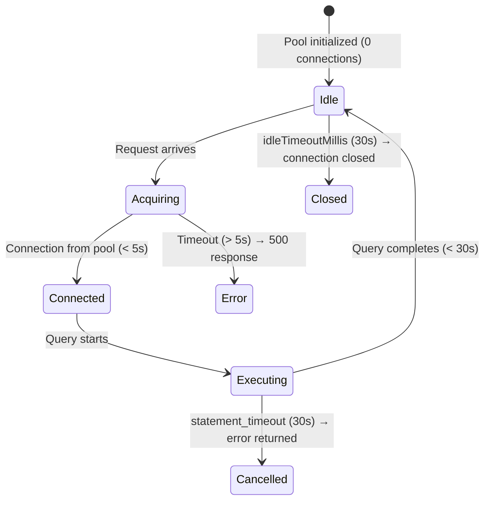
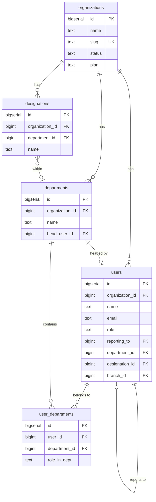
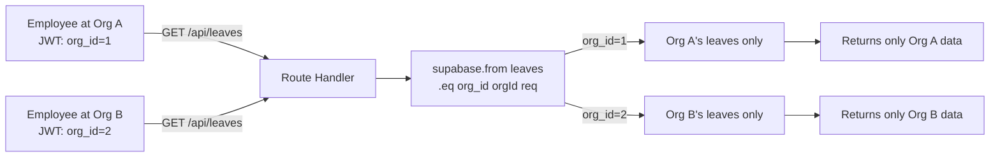
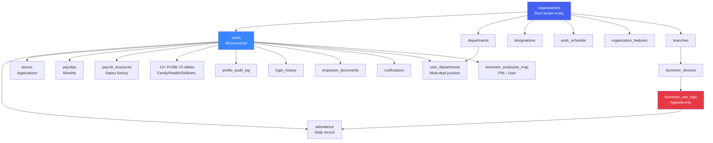

# 08 — Database Management Guidelines
## Lumos Logic HRMS — Enterprise Database Management & Administration Guide

---

**Document Version:** 1.0
**Prepared By:** Lumos Logic
**Date:** July 2026
**Classification:** Confidential — DevOps, Developer, and Database Administrator Distribution
**Audience:** Backend Developers, DevOps Engineers, Database Administrators, System Administrators

> **Methodology:** Every statement in this document is derived from direct inspection of the live codebase — migration SQL files, the database adapter, and route handlers. Implemented features are confirmed by code. Gaps are confirmed by the absence of code. Nothing is assumed.

---

## Table of Contents

1. [Executive Summary](#1-executive-summary)
2. [Database Architecture](#2-database-architecture)
3. [Schema Overview](#3-schema-overview)
4. [Data Relationships](#4-data-relationships)
5. [Data Integrity](#5-data-integrity)
6. [Multi-Tenancy](#6-multi-tenancy)
7. [Migrations](#7-migrations)
8. [Query Performance](#8-query-performance)
9. [Database Security](#9-database-security)
10. [Database Monitoring](#10-database-monitoring)
11. [Maintenance Procedures](#11-maintenance-procedures)
12. [Common Issues and Troubleshooting](#12-common-issues-and-troubleshooting)
13. [Risks](#13-risks)
14. [Best Practices](#14-best-practices)
15. [Future Improvements](#15-future-improvements)
- [Appendix A — Database Inventory](#appendix-a--database-inventory)
- [Appendix B — ER Diagram Summary](#appendix-b--er-diagram-summary)
- [Appendix C — Maintenance Checklist](#appendix-c--maintenance-checklist)
- [Appendix D — Performance Checklist](#appendix-d--performance-checklist)
- [Appendix E — Migration Checklist](#appendix-e--migration-checklist)
- [Appendix F — Monitoring Checklist](#appendix-f--monitoring-checklist)
- [Appendix G — Database Health Assessment](#appendix-g--database-health-assessment)
- [Appendix H — Document Summary](#appendix-h--document-summary)

---

# 1. Executive Summary

### 1.1 Purpose

This document is the authoritative reference for the PostgreSQL database underpinning the Lumos Logic HRMS. It documents every table, relationship, constraint, and index in the live schema; explains how multi-tenancy is implemented; describes the custom database adapter; and provides operational runbooks for maintenance, troubleshooting, and performance management.

### 1.2 Scope

This document covers:
- The `lumos_hrms` PostgreSQL 17 database running in the `lumos_postgres` Docker container on Hostinger VPS (187.127.146.194)
- All 48+ tables across all schema groups
- The `db-pg-adapter.js` custom query builder (`backend/src/config/db-pg-adapter.js`)
- All migration files in `backend/migrations/`
- Query patterns used across all 30+ route modules
- Connection pool configuration and management

### 1.3 Database Overview

| Property | Value |
|---|---|
| Engine | PostgreSQL 17 (alpine image) |
| Database Name | `lumos_hrms` |
| Primary User | `lumos_admin` |
| Container Name | `lumos_postgres` |
| Host (from app container) | `lumos_postgres` (Docker service name) |
| Port | 5432 (bound to 127.0.0.1 only — not publicly accessible) |
| Volume | `lumos_hrms_pgdata` (Docker named volume) |
| Time Zone | Asia/Kolkata (IST UTC+5:30) |
| Total Tables | 48+ |
| Multi-Tenancy | Application-level via `organization_id` column on every data table |
| ORM | None — custom Supabase-compatible query builder over `pg` (node-postgres) |
| Row-Level Security | Explicitly DISABLED on all tables |
| Automated Backup | ❌ Not implemented as of July 2026 |

### 1.4 Current Maturity Assessment

| Dimension | Assessment | Grade |
|---|---|---|
| Schema design | Well-structured, normalized where appropriate, clear naming | B+ |
| Multi-tenancy | Consistent `organization_id` scoping across all tables | A- |
| Data integrity | Foreign keys and UNIQUE constraints present; no transactions; PII unencrypted | C+ |
| Index coverage | Core scoping and search indexes present; performance indexes incomplete | C+ |
| Query safety | Parameterized queries throughout; no SQL injection risk | A |
| Migration management | Idempotent migrations; no versioning tool; no rollback support | C |
| Monitoring | No monitoring, no query analysis, no alerting | F |
| Backup | No automated backup; data loss risk is critical | F |
| Documentation | Undocumented prior to this document | D |
| **Overall** | **Functional with significant operational gaps** | **C+** |

---

# 2. Database Architecture

### 2.1 Database Engine

The HRMS uses **PostgreSQL 17** (Alpine Linux image) deployed in a Docker container. PostgreSQL was selected as the migration target from Supabase cloud PostgreSQL, providing full SQL compatibility while eliminating cloud dependency and per-row pricing.

**Key PostgreSQL 17 features in use:**
- `BIGSERIAL` primary keys (auto-incrementing 64-bit integers)
- `JSONB` columns for structured metadata (platform_activity, archives, push_subscriptions, password_history)
- `TIMESTAMPTZ` for all timestamp columns (UTC-aware)
- `NUMERIC` for monetary/decimal values (payroll amounts, hours)
- `ON CONFLICT` / `DO UPDATE` for upsert operations (attendance idempotency)
- `RETURNING *` for all mutations (immediate response without re-query)
- Partial indexes (`WHERE processed = FALSE`, `WHERE is_primary = TRUE`)
- UUID primary key on `archives` table (only exception to BIGSERIAL convention)

### 2.2 Overall Architecture

```mermaid
graph TB
    subgraph App["Express.js Application (lumos_app container)"]
        ROUTES[Route Handlers\n30+ modules]
        ADAPTER[db-pg-adapter.js\nSupabase-compatible\nQuery Builder]
        POOL_EXPORT[pool — exported\nfor raw SQL use]
    end

    subgraph DB["PostgreSQL 17 (lumos_postgres container)"]
        PG[(lumos_hrms\ndatabase)]
        subgraph SCHEMA["48+ Tables"]
            PLATFORM[Platform Core\n4 tables]
            USERS[Users & Structure\n4 tables]
            WORK[Work Config\n2 tables]
            ATT[Attendance\n2 tables]
            LEAVE[Leave\n2 tables]
            SHIFT[Shifts\n2 tables]
            PAY[Payroll\n2 tables]
            PROFILE[Profile V2\n12 tables]
            BIO[Biometric\n4 tables]
            OTHER[Other modules\n14 tables]
        end
    end

    subgraph DOCKER["Docker Network — lumos_net"]
        App <-->|pg pool :5432| DB
    end

    ROUTES -->|supabase.from()| ADAPTER
    ROUTES -->|pool.query()| POOL_EXPORT
    ADAPTER -->|parameterized SQL| PG
    POOL_EXPORT -->|parameterized SQL| PG
```

### 2.3 The Database Adapter (db-pg-adapter.js)

**Status: ✅ Implemented** — `backend/src/config/db-pg-adapter.js` (421 lines)

The adapter is the single most important non-table database component. It wraps the `pg` connection pool in a Supabase-compatible chainable API so that route handlers written during the Supabase cloud era work unchanged against local PostgreSQL.

**What it provides:**
- A `from(table)` function returning a builder object
- Chain-based operations: `select()`, `insert()`, `update()`, `delete()`, `upsert()`
- Chain-based filters: `eq()`, `neq()`, `gt()`, `gte()`, `lt()`, `lte()`, `like()`, `ilike()`, `is()`, `in()`, `not()`
- Modifiers: `order()`, `limit()`, `range()`, `single()`, `maybeSingle()`
- Supabase FK join syntax: `alias:table!fkeyHint(col1, col2)` translated to LEFT/INNER JOINs
- `RETURNING *` on all INSERT/UPDATE/DELETE
- Automatic parameterized query building (SQL injection proof)
- Error mapping to Supabase-compatible shape `{ data, error }`

**What it does NOT provide:**
- Transactions (BEGIN/COMMIT/ROLLBACK)
- Streaming results
- Prepared statements (queries are built fresh per request)
- Connection health checks
- Query explain/analyze

**Critical date handling:**

```javascript
// Without this fix, pg converts DATE columns to JS Date objects using local timezone
// IST = UTC+5:30: "2026-01-01" becomes Date("2025-12-31T18:30:00Z") → one day off
types.setTypeParser(1082, val => val); // 1082 = DATE OID → return as "YYYY-MM-DD" string
```

This type override is the reason all date comparisons in queries work correctly for IST. It must never be removed.

**Exported interface:**

```javascript
module.exports = { from, pool, supabase: { from } };

// Usage in routes:
const { supabase, pool } = require('../config/db');
// supabase.from('users').select('*').eq('organization_id', 1)  → builder API
// pool.query('SELECT ...', [param1, param2])                   → direct SQL
```

### 2.4 Connection Pool Configuration

**Status: ✅ Implemented**

| Parameter | Value | Purpose |
|---|---|---|
| `max` | 20 | Maximum concurrent database connections |
| `idleTimeoutMillis` | 30,000 ms | Release unused connections after 30s |
| `connectionTimeoutMillis` | 5,000 ms | Fail immediately if no connection available within 5s |
| `statement_timeout` | 30,000 ms | Cancel any query running longer than 30s |
| `host` | `lumos_postgres` (Docker service) | Container-to-container DNS resolution |
| `port` | 5432 | Standard PostgreSQL port |

**Connection lifecycle:**


### 2.5 Schema Organization

The 48+ tables are organized into logical groups. Each group corresponds to a feature domain.

| Group | Tables | Description |
|---|---|---|
| Platform Core | 4 | Multi-tenant platform management |
| Users & Structure | 4 | Employee records, departments, designations |
| Work Configuration | 2 | Working hours, days, Clockify |
| Attendance | 2 | Daily attendance, regularization requests |
| Leave | 2 | Leave applications, leave type policies |
| Shifts & Roster | 2 | Shift definitions, daily assignments |
| Holidays & Events | 2 | Holiday calendar, custom events |
| Notifications | 4 | Push subscriptions, in-app, email log |
| Announcements | 1 | Org-wide announcements |
| Expenses & Assets | 2 | Expense claims, asset registry |
| Payroll | 2 | Salary structures, generated payslips |
| Performance | 2 | Goals, review cycles |
| Onboarding & Exit | 2 | Checklists, resignation requests |
| Documents | 2 | Employee file uploads, document sharing |
| Feature Flags | 1 | Per-org feature enable/disable |
| Profile V2 | 12 | Normalized employee profile sections |
| Audit & Security | 2 | Profile change audit, login history |
| Biometric | 4 | Devices, raw punch logs, PIN mapping, branches |
| Archives | 1 | Soft-delete / historical record store |

---

# 3. Schema Overview

### 3.1 Platform Core

---

#### `organizations`
| Property | Value |
|---|---|
| **Purpose** | One row per tenant organization. The root of all multi-tenant data. |
| **Primary Key** | `id BIGSERIAL` |
| **Foreign Keys** | None — this is the root table |
| **Relationships** | Parent of all org-scoped tables via `organization_id` FK |
| **Key Fields** | `slug TEXT UNIQUE` (URL identifier), `status TEXT` (active/inactive/suspended), `plan TEXT` (free/pro/enterprise), SMTP config fields, Google OAuth fields, VAPID push keys, `total_annual_leaves INTEGER` (default 18) |
| **Notable** | Stores SMTP credentials and OAuth secrets in plaintext — security gap (see Section 9) |

#### `platform_admins`
| Property | Value |
|---|---|
| **Purpose** | Platform-level super administrators who manage all organizations |
| **Primary Key** | `id BIGSERIAL` |
| **Foreign Keys** | None |
| **Key Fields** | `email TEXT UNIQUE`, `password TEXT` (bcrypt hashed) |
| **Notable** | Separate from `users` table; uses different auth flow (`platformAdminAuth` middleware) |

#### `org_registration_requests`
| Property | Value |
|---|---|
| **Purpose** | Pending organization registration requests submitted via landing page |
| **Primary Key** | `id BIGSERIAL` |
| **Foreign Keys** | `organization_id → organizations(id)` (nullable, set when approved) |
| **Key Fields** | `status TEXT` (pending/approved/rejected), `ip_address`, `reviewer_notes`, `reviewed_at` |

#### `platform_activity`
| Property | Value |
|---|---|
| **Purpose** | Audit log for platform-wide events (org approved, member created/removed) |
| **Primary Key** | `id BIGSERIAL` |
| **Foreign Keys** | `organization_id → organizations(id)` (nullable — added in sanghavi_migration.sql) |
| **Key Fields** | `event_type TEXT`, `description TEXT`, `metadata JSONB` |

---

### 3.2 Users and Organizational Structure

---

#### `users`
| Property | Value |
|---|---|
| **Purpose** | All user accounts — employees, HR admins, root admins. The central entity of the entire HRMS. |
| **Primary Key** | `id BIGSERIAL` |
| **Foreign Keys** | `organization_id → organizations(id) ON DELETE CASCADE`; `reporting_to → users(id)`; `hod_id → users(id)`; `department_id → departments(id)`; `designation_id → designations(id)`; `branch_id → branches(id)`; `updated_by → users(id)` |
| **Relationships** | Central hub — referenced by 30+ tables |
| **Key Groups of Fields** | Core (name, email, password, role); Employment (type, status, joining dates); Contact (phone, address blocks); Biometric (device_enrollment_id, branch_id); Statutory (pf_applicable, esi_applicable, pan_number, aadhar_no — plaintext); Security (totp_secret, password_history JSONB, force_password_change); Audit (last_login_at/ip/ua, updated_at, updated_by) |
| **Critical Constraint** | Email is NOT globally unique — only unique per organization. No DB-level UNIQUE(email, organization_id) constraint. Enforced at application level only. |
| **Notable** | Most column-heavy table in the schema (~80 columns after all migrations). Grew organically from 15 base columns to include profile, statutory, biometric, and audit fields. |

**Indexes on `users`:**
```sql
CREATE INDEX idx_users_org            ON users(organization_id);
CREATE INDEX idx_users_org_status     ON users(organization_id, employee_status);
CREATE INDEX idx_users_org_name       ON users(organization_id, name);
CREATE INDEX idx_users_reporting_to   ON users(reporting_to, organization_id);
CREATE INDEX idx_users_hod            ON users(hod_id, organization_id);
CREATE UNIQUE INDEX idx_users_device_pin_org
    ON users(organization_id, device_enrollment_id)
    WHERE device_enrollment_id IS NOT NULL;
```

#### `departments`
| Property | Value |
|---|---|
| **Purpose** | Department definitions per organization |
| **Primary Key** | `id BIGSERIAL` |
| **Foreign Keys** | `head_user_id → users(id) ON DELETE SET NULL`; `organization_id → organizations(id) ON DELETE CASCADE` |
| **Key Fields** | `name TEXT NOT NULL`, `description TEXT`, `head_user_id` |
| **Index** | `idx_departments_org ON departments(organization_id)` |

#### `designations`
| Property | Value |
|---|---|
| **Purpose** | Job titles/designations, optionally linked to a department |
| **Primary Key** | `id BIGSERIAL` |
| **Foreign Keys** | `department_id → departments(id) ON DELETE SET NULL`; `organization_id → organizations(id) ON DELETE CASCADE` |

#### `user_departments`
| Property | Value |
|---|---|
| **Purpose** | Junction table enabling employees to belong to multiple departments |
| **Primary Key** | `id BIGSERIAL` |
| **Foreign Keys** | `user_id → users(id) ON DELETE CASCADE`; `department_id → departments(id) ON DELETE CASCADE`; `organization_id → organizations(id) ON DELETE CASCADE` |
| **Unique Constraint** | `UNIQUE(user_id, department_id)` — one assignment per user per department |
| **Key Fields** | `role_in_dept TEXT DEFAULT 'Member'` |

---

### 3.3 Work Configuration

#### `work_schedule`
| Property | Value |
|---|---|
| **Purpose** | Defines organizational working hours and thresholds used for late/early-exit calculations |
| **Primary Key** | `id BIGSERIAL` |
| **Foreign Keys** | `organization_id → organizations(id) ON DELETE CASCADE` |
| **Key Fields** | `start_time TEXT DEFAULT '09:00'`, `end_time TEXT DEFAULT '18:00'`, `late_threshold TEXT DEFAULT '09:30'`, `early_exit_threshold TEXT DEFAULT '17:00'`, `half_day_hours NUMERIC DEFAULT 4.5`, `work_days TEXT DEFAULT '1,2,3,4,5'` |
| **Notable** | Time values stored as TEXT (HH:MM) to avoid timezone complications |

#### `clockify_config`
| Property | Value |
|---|---|
| **Purpose** | Residual Clockify time-tracking integration configuration (integration removed July 2026) |
| **Status** | ⚠️ Table exists but integration is no longer mounted. Fields in dashboard/reports referencing `clockify_hours` are safe no-ops. |

---

### 3.4 Attendance

#### `attendance`
| Property | Value |
|---|---|
| **Purpose** | One record per employee per working day — check-in/out, breaks, calculated hours, status |
| **Primary Key** | `id BIGSERIAL` |
| **Foreign Keys** | `user_id → users(id) ON DELETE CASCADE`; `organization_id → organizations(id) ON DELETE CASCADE` |
| **Unique Constraint** | `UNIQUE(user_id, date, organization_id)` — exactly one record per employee per day |
| **Key Fields** | `date TEXT NOT NULL` (YYYY-MM-DD); `check_in TEXT`, `check_out TEXT` (HH:MM); `break_start`, `break_end`, `total_break_minutes INTEGER`; `gross_hours NUMERIC`; `work_hours NUMERIC`; `status TEXT` (present/absent/half_day/on_leave/wfh/holiday); `is_late BOOLEAN`; `is_early_exit BOOLEAN`; `source TEXT` (manual/biometric/clockify); `ot_hours`, `late_minutes`, `early_exit_minutes` |
| **Notable** | Date and time stored as TEXT (not DATE/TIME types) to avoid IST timezone complications. The UNIQUE constraint enables `ON CONFLICT` upsert for idempotent check-ins. |
| **Indexes** | `idx_attendance_org ON attendance(organization_id)`; `idx_attendance_user_date ON attendance(user_id, date)` |

#### `attendance_regularization`
| Property | Value |
|---|---|
| **Purpose** | Employee requests to correct attendance records (missed check-in, wrong hours) |
| **Primary Key** | `id BIGSERIAL` |
| **Foreign Keys** | `user_id → users(id) ON DELETE CASCADE`; `reviewed_by → users(id)`; `organization_id → organizations(id) ON DELETE CASCADE` |
| **Key Fields** | `status TEXT DEFAULT 'pending'` (pending/approved/rejected); `requested_check_in`, `requested_check_out TEXT`; `reviewer_notes`, `reviewed_at` |

---

### 3.5 Leave Management

#### `leaves`
| Property | Value |
|---|---|
| **Purpose** | All leave applications — employee requests and admin-created leaves |
| **Primary Key** | `id BIGSERIAL` |
| **Foreign Keys** | `user_id → users(id) ON DELETE CASCADE`; `approved_by → users(id)`; `organization_id → organizations(id) ON DELETE CASCADE` |
| **Key Fields** | `start_date TEXT`, `end_date TEXT` (YYYY-MM-DD); `leave_type TEXT` (casual/sick/emergency/annual/comp_off/maternity/paternity/wfh); `leave_time TEXT` (full/half/wfh); `half_type TEXT` (first/second); `status TEXT` (pending/approved/rejected); `google_event_id TEXT` (for Calendar sync) |
| **Notable** | WFH is separated from the leave system as of July 2026 (`fix_wfh_leave_type.sql` migration). `leave_time='wfh'` is now distinct from leave types. |
| **Indexes** | `idx_leaves_org ON leaves(organization_id)`; `idx_leaves_user_status ON leaves(user_id, status)` |

#### `leave_policies`
| Property | Value |
|---|---|
| **Purpose** | Configures leave type rules per organization (quota, carry-forward, notice period, etc.) |
| **Primary Key** | `id BIGSERIAL` |
| **Foreign Keys** | `organization_id → organizations(id) ON DELETE CASCADE` |
| **Unique Constraint** | `UNIQUE(organization_id, leave_type)` — one policy per type per org |
| **Key Fields** | `annual_quota INTEGER DEFAULT 12`; `carry_forward BOOLEAN`; `max_carry_forward INTEGER`; `paid BOOLEAN`; `half_day_allowed BOOLEAN`; `requires_approval BOOLEAN`; `min_notice_days INTEGER`; `max_consecutive_days INTEGER`; `accrual_type TEXT DEFAULT 'yearly'` |

---

### 3.6 Shifts and Roster

#### `shifts`
| Property | Value |
|---|---|
| **Purpose** | Named shift definitions (Morning, General, Night, etc.) |
| **Primary Key** | `id BIGSERIAL` |
| **Foreign Keys** | `organization_id → organizations(id) ON DELETE CASCADE` |
| **Key Fields** | `name TEXT`, `start_time TEXT`, `end_time TEXT`, `color TEXT DEFAULT '#3525cd'`, `days_of_week TEXT` |

#### `shift_assignments`
| Property | Value |
|---|---|
| **Purpose** | Daily shift roster — assigns a specific shift to an employee on a specific date |
| **Primary Key** | `id BIGSERIAL` |
| **Foreign Keys** | `user_id → users(id) ON DELETE CASCADE`; `shift_id → shifts(id) ON DELETE CASCADE`; `organization_id → organizations(id) ON DELETE CASCADE` |
| **Unique Constraint** | `UNIQUE(user_id, date, organization_id)` — one shift per employee per day |

---

### 3.7 Holidays and Events

#### `holidays`
| Property | Value |
|---|---|
| **Purpose** | Organizational holiday calendar |
| **Primary Key** | `id BIGSERIAL` |
| **Foreign Keys** | `organization_id → organizations(id) ON DELETE CASCADE` |
| **Key Fields** | `date TEXT NOT NULL` (YYYY-MM-DD); `type TEXT` (public/optional); `google_event_id TEXT` |

#### `events`
| Property | Value |
|---|---|
| **Purpose** | Custom calendar events (team meetings, training days, etc.) |
| **Primary Key** | `id BIGSERIAL` |
| **Foreign Keys** | `created_by → users(id)`; `organization_id → organizations(id) ON DELETE CASCADE` |

---

### 3.8 Payroll

#### `payroll_structures`
| Property | Value |
|---|---|
| **Purpose** | Salary component definitions per employee, with effective dates (supports history) |
| **Primary Key** | `id BIGSERIAL` |
| **Foreign Keys** | `user_id → users(id) ON DELETE CASCADE`; `organization_id → organizations(id) ON DELETE CASCADE` |
| **Key Fields** | `effective_from DATE`; `basic`, `hra`, `da`, `transport_allowance`, `medical_allowance`, `other_allowances` (all NUMERIC); PF/ESI/PT fields |
| **Index** | `idx_payroll_structure_user_effective ON payroll_structures(user_id, effective_from DESC)` |

#### `payslips`
| Property | Value |
|---|---|
| **Purpose** | Generated monthly payslips with all salary and attendance components |
| **Primary Key** | `id BIGSERIAL` |
| **Foreign Keys** | `user_id → users(id) ON DELETE CASCADE`; `generated_by → users(id)`; `organization_id → organizations(id) ON DELETE CASCADE` |
| **Unique Constraint** | `UNIQUE(user_id, month, year, organization_id)` — one payslip per employee per month |
| **Key Fields** | `month INTEGER`, `year INTEGER`; all gross components; all deductions; `lop_days NUMERIC`; `net_salary NUMERIC`; `status TEXT` (draft/generated/approved); `pdf_url TEXT` |

---

### 3.9 Profile V2 — Normalized Employee Profile Tables

These 12 tables were introduced in `employee_profile_v2.sql` to normalize the profile data that was previously crammed into the `users` table. Each table follows a standard pattern:

**Standard Pattern:**
- `id BIGSERIAL PRIMARY KEY`
- `employee_id BIGINT NOT NULL REFERENCES users(id) ON DELETE CASCADE`
- `organization_id BIGINT NOT NULL REFERENCES organizations(id) ON DELETE CASCADE`
- Audit fields: `created_at`, `updated_at`, `created_by → users(id)`, `updated_by → users(id)`

| Table | Purpose | Unique Constraint | Notable Fields |
|---|---|---|---|
| `employee_family_members` | Spouse, children, parents | None (multiple records) | `relationship`, `dependent BOOLEAN` |
| `employee_emergency_contacts` | Emergency contact persons | None | `is_primary BOOLEAN`, `contact_name`, `mobile_number` |
| `employee_nominees` | Benefit nominees (PF, insurance) | None | `percentage_share NUMERIC CHECK(> 0 AND <= 100)`, `is_primary BOOLEAN` |
| `employee_bank_accounts` | Bank accounts for salary disbursement | None (multiple accounts) | `is_primary BOOLEAN`, `is_salary_account BOOLEAN`, `is_active BOOLEAN`, `hr_verified BOOLEAN` |
| `employee_government_documents` | Govt ID uploads (Aadhar, PAN, Passport, etc.) | `UNIQUE(employee_id, document_type, organization_id)` | `document_number`, `verification_status`, `verified_by`, `file_url` |
| `employee_immigration` | Work permits, visas | None | `immigration_type`, `passport_number`, `expiry_date` |
| `employee_skills` | Technical and soft skills | `UNIQUE(employee_id, skill_name, organization_id)` | `proficiency_level`, `can_read/write/speak` for languages |
| `employee_health` | Medical information | `UNIQUE(employee_id, organization_id)` | `blood_group`, `allergies`, `health_insurance_number` |
| `employee_training` | Training records | None | `completion_status`, `score`, `certificate_url` |
| `employee_certifications` | Professional certifications | None | `is_lifetime BOOLEAN`, `expiry_date`, `certification_number` |
| `employee_qualifications` | Education history | None | `degree_level`, `institution`, `percentage`, `year_of_passing` |
| `employee_experiences` | Work history | None | `company_name`, `start_date/end_date DATE`, `last_salary`, `reason_leaving` |

**Indexes on Profile V2 tables (pattern):**
```sql
-- Per-employee lookups
CREATE INDEX ON employee_family_members(employee_id, organization_id);
CREATE INDEX ON employee_bank_accounts(employee_id, organization_id);
-- Partial index for primary bank account (fast lookup)
CREATE INDEX idx_emp_bank_primary ON employee_bank_accounts(organization_id, employee_id)
    WHERE is_primary = TRUE AND is_active = TRUE;
-- Expiry alert indexes
CREATE INDEX idx_emp_govdocs_expiry ON employee_government_documents(organization_id, expiry_date)
    WHERE expiry_date IS NOT NULL;
CREATE INDEX idx_emp_certifications_expiry ON employee_certifications(organization_id, expiry_date)
    WHERE is_lifetime = FALSE;
```

---

### 3.10 Audit and Security

#### `profile_audit_log`
| Property | Value |
|---|---|
| **Purpose** | Immutable audit trail for all profile section changes (who changed what, when, old vs new values) |
| **Primary Key** | `id BIGSERIAL` |
| **Foreign Keys** | `employee_id → users(id)`; `organization_id → organizations(id)`; `changed_by → users(id)` |
| **Key Fields** | `section TEXT` (personal/banking/family/skills/education/etc.); `action TEXT` (created/updated/deleted); `old_values JSONB`, `new_values JSONB`, `change_summary JSONB`; `ip_address TEXT` |
| **Indexes** | `idx_audit_emp_org`, `idx_audit_org_section`, `idx_audit_changed_by` |

#### `login_history`
| Property | Value |
|---|---|
| **Purpose** | Log of all login attempts (successful only as of July 2026 — failed logins not yet recorded) |
| **Primary Key** | `id BIGSERIAL` |
| **Foreign Keys** | `user_id → users(id)` |
| **Key Fields** | `ip_address TEXT`, `user_agent TEXT`, `status TEXT` (success/failed_2fa/invalid_credentials), `logged_in_at TIMESTAMPTZ` |
| **Index** | `idx_login_history_user ON login_history(user_id, logged_in_at DESC)` |
| **Gap** | Failed login attempts not recorded — see Document 06, V-009 |

---

### 3.11 Biometric Integration Tables

#### `branches`
| Property | Value |
|---|---|
| **Purpose** | Physical office branches (for Sanghavi Association — 7 locations) |
| **Primary Key** | `id BIGSERIAL` |
| **Foreign Keys** | `org_id → organizations(id) ON DELETE CASCADE` |
| **Notable** | Uses `org_id` (not `organization_id`) — naming inconsistency vs all other tables |
| **Key Fields** | `name TEXT NOT NULL`, `code TEXT`, `location TEXT`, `is_active BOOLEAN DEFAULT TRUE` |
| **Index** | `idx_branches_org ON branches(org_id)` |

#### `biometric_devices`
| Property | Value |
|---|---|
| **Purpose** | Registry of enrolled ZKTeco biometric devices |
| **Primary Key** | `id BIGSERIAL` |
| **Foreign Keys** | `org_id → organizations(id) ON DELETE CASCADE`; `branch_id → branches(id)` |
| **Unique Constraint** | `serial_number TEXT UNIQUE NOT NULL` |
| **Key Fields** | `device_name`, `location`, `area_code INT`, `device_ip TEXT`, `last_seen TIMESTAMPTZ`, `status TEXT CHECK (status IN ('online','offline'))` |

#### `biometric_raw_logs`
| Property | Value |
|---|---|
| **Purpose** | Immutable append-only log of all ZKTeco punch events received via ADMS protocol |
| **Primary Key** | `id BIGSERIAL` |
| **Foreign Keys** | `org_id → organizations(id) ON DELETE CASCADE` |
| **Unique Constraint** | `UNIQUE(device_serial, punch_time, employee_pin)` — prevents duplicate processing of ZKTeco retries |
| **Key Fields** | `employee_pin TEXT`, `punch_time TIMESTAMPTZ`, `punch_type SMALLINT` (0=Check-In, 1=Check-Out, 4=OT-In, 5=OT-Out); `verify_type SMALLINT` (1=Fingerprint, 2=Face, 4=Card); `raw_payload JSONB`; `processed BOOLEAN DEFAULT FALSE` |
| **Rules** | NEVER DELETE or UPDATE rows. NEVER modify `processed=TRUE` records once set. Append-only by design. |
| **Indexes** | `idx_bio_logs_org_time ON biometric_raw_logs(org_id, punch_time DESC)`; `idx_bio_logs_unprocessed ON biometric_raw_logs(org_id, processed) WHERE processed = FALSE` |

#### `biometric_employee_map`
| Property | Value |
|---|---|
| **Purpose** | Maps ZKTeco device PIN numbers to HRMS user IDs |
| **Primary Key** | `id BIGSERIAL` |
| **Foreign Keys** | `org_id → organizations(id) ON DELETE CASCADE`; `user_id → users(id) ON DELETE CASCADE` |
| **Unique Constraint** | `UNIQUE(org_id, employee_pin)` — one PIN per org |

---

### 3.12 Other Module Tables

| Table | Purpose | Key Constraint |
|---|---|---|
| `push_subscriptions` | Web push service worker subscriptions | `UNIQUE(endpoint)` — globally unique endpoint |
| `notifications` | In-app notifications per user | Index on `(user_id, is_read)` |
| `notifications_log` | Audit of push notifications sent | `organization_id` added in patch |
| `notification_recipients` | Email mailing list for broadcast | `organization_id` scoped |
| `announcements` | Organization announcements | `created_by`, `target_audience`, `pinned`, `expires_at` |
| `expenses` | Employee expense claims | `reviewed_by`, `status` workflow |
| `assets` | IT/office asset registry | `UNIQUE(asset_tag)`, soft-assign via `assigned_to` |
| `performance_goals` | Employee goal setting | `progress 0-100`, `status` |
| `performance_reviews` | Manager and self reviews | `self_rating`, `manager_rating`, `final_rating` |
| `onboarding_checklists` | New-hire task checklists | `order_index`, `completed BOOLEAN` |
| `exit_requests` | Employee resignation and clearance | Clearance flags: `clearance_it/hr/finance/admin BOOLEAN` |
| `employee_documents` | Document file uploads | `visibility CHECK (IN ('self','all','specific','admin_only'))` |
| `document_shares` | Per-user document access grants | `UNIQUE(document_id, shared_with_user_id)` |
| `organization_features` | Per-org feature flag toggles | `UNIQUE(organization_id, feature_key)` |
| `archives` | Soft-delete / historical records | `UUID PRIMARY KEY` (exception to BIGSERIAL convention) |

---

# 4. Data Relationships

### 4.1 Core Entity Relationships



### 4.2 Attendance and Leave Relationships

```mermaid
erDiagram
    users {
        bigserial id PK
    }

    attendance {
        bigserial id PK
        bigint user_id FK
        text date
        text status
        text source
        numeric work_hours
        UNIQUE "user_id,date,org_id"
    }

    leaves {
        bigserial id PK
        bigint user_id FK
        text start_date
        text end_date
        text leave_type
        text status
        bigint approved_by FK
    }

    leave_policies {
        bigserial id PK
        bigint organization_id FK
        text leave_type
        integer annual_quota
        UNIQUE "org_id,leave_type"
    }

    attendance_regularization {
        bigserial id PK
        bigint user_id FK
        text date
        text status
        bigint reviewed_by FK
    }

    work_schedule {
        bigserial id PK
        bigint organization_id FK
        text start_time
        text late_threshold
    }

    users ||--o{ attendance : "has"
    users ||--o{ leaves : "applies"
    users ||--o{ leaves : "approves"
    users ||--o{ attendance_regularization : "requests"
```

### 4.3 Payroll Relationships

```mermaid
erDiagram
    users {
        bigserial id PK
        text name
    }

    payroll_structures {
        bigserial id PK
        bigint user_id FK
        date effective_from
        numeric basic
        numeric hra
        numeric net_salary
    }

    payslips {
        bigserial id PK
        bigint user_id FK
        integer month
        integer year
        numeric net_salary
        text status
        bigint generated_by FK
        UNIQUE "user_id,month,year,org_id"
    }

    attendance {
        bigserial id PK
        bigint user_id FK
        text date
        text status
    }

    users ||--o{ payroll_structures : "has salary structure"
    users ||--o{ payslips : "receives"
    users ||--o{ payslips : "generated by"
    payroll_structures }o--|| users : "defines salary for"
```

### 4.4 Biometric Integration Relationships

```mermaid
erDiagram
    organizations {
        bigserial id PK
    }

    branches {
        bigserial id PK
        bigint org_id FK
        text name
    }

    biometric_devices {
        bigserial id PK
        bigint org_id FK
        bigint branch_id FK
        text serial_number UK
        text status
    }

    biometric_raw_logs {
        bigserial id PK
        bigint org_id FK
        text device_serial
        text employee_pin
        timestamptz punch_time
        boolean processed
        UNIQUE "device_serial,punch_time,pin"
    }

    biometric_employee_map {
        bigserial id PK
        bigint org_id FK
        text employee_pin
        bigint user_id FK
        UNIQUE "org_id,employee_pin"
    }

    users {
        bigserial id PK
        text device_enrollment_id
        bigint branch_id FK
    }

    attendance {
        bigserial id PK
        bigint user_id FK
        text source
    }

    organizations ||--o{ branches : "has"
    organizations ||--o{ biometric_devices : "has"
    branches ||--o{ biometric_devices : "located at"
    biometric_devices ||--o{ biometric_raw_logs : "sends"
    biometric_employee_map }o--|| users : "maps to"
    biometric_raw_logs }o--|| attendance : "creates"
```

### 4.5 One-to-One Relationships

| Parent | Child | Relationship | Notes |
|---|---|---|---|
| `users` | `employee_health` | One-to-one | `UNIQUE(employee_id, organization_id)` enforced |
| `users` | `employee_government_documents` per type | One per document type | `UNIQUE(employee_id, document_type, organization_id)` |

### 4.6 One-to-Many Relationships

| Parent | Children | Notes |
|---|---|---|
| `organizations` | All org-scoped tables | Via `organization_id` CASCADE |
| `users` | `attendance`, `leaves`, `payslips`, `expenses`, `notifications` | Via `user_id` CASCADE |
| `users` | `employee_family_members`, `employee_qualifications`, etc. | Via `employee_id` CASCADE |
| `departments` | `designations` | Designations belong to department |
| `users` | `users` (self) | `reporting_to` hierarchy |

### 4.7 Many-to-Many Relationships

| Entity A | Junction Table | Entity B | Notes |
|---|---|---|---|
| `users` | `user_departments` | `departments` | Employee belongs to multiple departments |
| `employee_documents` | `document_shares` | `users` | Document shared with multiple employees |

---

# 5. Data Integrity

### 5.1 Implemented Constraints

**Status: ✅ Partially Implemented — core constraints present, some gaps**

#### Foreign Key Constraints

All foreign key relationships are declared in the schema. Delete behaviour is consistent:
- `ON DELETE CASCADE` — used for all primary data relationships (attendance, leaves, employees all cascade when their org is deleted)
- `ON DELETE SET NULL` — used for optional references that should not block deletion (e.g., `departments.head_user_id` when the head employee is deleted)
- `ON DELETE RESTRICT` (default) — used implicitly for `approved_by`, `reviewed_by` references (these should be cleaned up before deleting a reviewer)

#### UNIQUE Constraints in Use

| Table | Unique Constraint | Purpose |
|---|---|---|
| `organizations` | `slug` | URL identifier globally unique |
| `platform_admins` | `email` | Platform admin email globally unique |
| `attendance` | `(user_id, date, organization_id)` | One record per employee per day |
| `shift_assignments` | `(user_id, date, organization_id)` | One shift per employee per day |
| `payslips` | `(user_id, month, year, organization_id)` | One payslip per month |
| `leave_policies` | `(organization_id, leave_type)` | One policy per type per org |
| `user_departments` | `(user_id, department_id)` | No duplicate dept membership |
| `employee_government_documents` | `(employee_id, document_type, organization_id)` | One per document type |
| `employee_skills` | `(employee_id, skill_name, organization_id)` | No duplicate skill entries |
| `employee_health` | `(employee_id, organization_id)` | One health record per employee |
| `document_shares` | `(document_id, shared_with_user_id)` | No duplicate shares |
| `organization_features` | `(organization_id, feature_key)` | One flag setting per org per feature |
| `biometric_raw_logs` | `(device_serial, punch_time, employee_pin)` | Idempotent ZKTeco retry handling |
| `biometric_employee_map` | `(org_id, employee_pin)` | One PIN per org |
| `biometric_devices` | `serial_number` | Device serial globally unique |
| `push_subscriptions` | `endpoint` | Web push endpoint globally unique |

#### CHECK Constraints in Use

| Table | Constraint | Purpose |
|---|---|---|
| `employee_documents` | `visibility IN ('self','all','specific','admin_only')` | Limits visibility options |
| `biometric_devices` | `status IN ('online','offline')` | Limits device status values |
| `attendance` | `source IN ('manual','biometric','clockify')` | Limits attendance source values |
| `employee_nominees` | `percentage_share > 0 AND percentage_share <= 100` | Valid share range |

#### NOT NULL Constraints (Key Examples)

| Table | NOT NULL Column | Reason |
|---|---|---|
| `users` | `name`, `email`, `password` | Core identity fields |
| `attendance` | `user_id`, `date` | Cannot log attendance without these |
| `leaves` | `user_id`, `start_date`, `end_date` | Cannot create leave without dates |
| `payslips` | `user_id`, `month`, `year` | Cannot generate without period |
| `biometric_raw_logs` | `device_serial`, `employee_pin`, `punch_time` | Cannot log without identity and time |

### 5.2 Missing Constraints

| Gap | Impact | Recommendation |
|---|---|---|
| No `UNIQUE(email, organization_id)` on `users` | Duplicate employee emails per org possible if app-level check is bypassed | Add `UNIQUE(email, organization_id)` constraint |
| No `CHECK` on `users.role` | Invalid role values can be inserted | Add `CHECK(role IN ('employee','admin','root_admin'))` |
| No `CHECK` on `attendance.status` | Non-standard status values possible | Add enum-style CHECK constraint |
| No `CHECK` on `leaves.status` | Invalid approval states possible | Add `CHECK(status IN ('pending','approved','rejected'))` |
| No `CHECK` on `leaves.leave_type` | Freeform leave type values | Add CHECK with allowed leave types |

### 5.3 Transaction Handling

**Status: ❌ Not Implemented**

The `db-pg-adapter.js` does not support transactions. All database operations are single-statement atomic executions. Multi-step operations — like creating an employee then assigning departments — are executed as separate queries with no rollback if a later step fails.

**Current pattern (no transaction):**
```javascript
// Step 1: Create user
const { data: user } = await supabase.from('users').insert({...}).select().single();

// Step 2: Assign departments (separate query, no rollback if this fails)
if (department_ids.length > 0) {
    await supabase.from('user_departments').insert(
        department_ids.map(id => ({ user_id: user.id, department_id: id, ... }))
    );
}
```

**What happens on failure:** If Step 1 succeeds and Step 2 fails, a user record exists with no department assignment. No cleanup occurs. The application returns an error to the client, but the partial data remains in the database.

**Operations at risk of partial failure:**

| Operation | Steps | Partial Failure Risk |
|---|---|---|
| Create employee | Insert user + insert user_departments | User exists without dept assignment |
| Delete employee | Delete user + delete from multiple profile tables | Cascade handles most; soft-delete risks orphans |
| Generate payslip | Calculate + insert payslip + update status | Payslip inserted with incorrect values if calculate step has error |
| Approve leave | Update leave status + create attendance record + update calendar | Leave approved but attendance not marked |
| Biometric punch processing | Mark log as processed + create/upsert attendance | Attendance created but log not marked processed (duplicate risk) |

**Recommended fix — using `pool` directly for transactions:**
```javascript
const client = await pool.connect();
try {
    await client.query('BEGIN');
    const userResult = await client.query('INSERT INTO users ...', [...]);
    await client.query('INSERT INTO user_departments ...', [...]);
    await client.query('COMMIT');
    res.json({ data: userResult.rows[0] });
} catch (err) {
    await client.query('ROLLBACK');
    res.status(500).json({ error: err.message });
} finally {
    client.release();
}
```

### 5.4 Cascade Delete Behavior

When an organization is deleted, all its data is deleted automatically:

```
organizations (deleted)
  └── users (CASCADE)
        └── attendance (CASCADE)
        └── leaves (CASCADE)
        └── payslips (CASCADE)
        └── employee_family_members (CASCADE)
        └── employee_bank_accounts (CASCADE)
        └── ... (all profile V2 tables)
  └── departments (CASCADE)
        └── designations (SET NULL → designation_id on users becomes NULL)
  └── branches (CASCADE)
        └── biometric_devices (no cascade — branch_id on devices becomes orphaned)
  └── biometric_raw_logs (CASCADE)
  └── organization_features (CASCADE)
  └── all other org-scoped tables (CASCADE)
```

> **Risk:** If `branches` is deleted before `biometric_devices`, the `branch_id` FK on `biometric_devices` has no ON DELETE action specified — this will cause a FK violation. The cascade chain assumes organizations are deleted (not individual branches).

### 5.5 Data Validation

**Status: ⚠️ Partially Implemented — application-level only**

Database-level validation is limited to the CHECK constraints listed in Section 5.1. All business rule validation (date range logic, leave balance checks, overlap detection, work hours calculation) is performed in JavaScript route handlers before inserting into the database.

**Example — leave overlap check (application-level, not database):**
```javascript
const { data: rawConflicts } = await supabase.from('leaves')
    .select('id, leave_type, start_date, end_date')
    .eq('user_id', req.user.id)
    .in('status', ['pending', 'approved'])
    .lte('start_date', endDate)
    .gte('end_date', startDate);

if (rawConflicts?.length > 0) {
    return res.status(409).json({ error: 'Overlapping leave exists' });
}
```

This validation is correct but bypass-able via direct database access (no trigger enforces the rule at the DB layer).

---

# 6. Multi-Tenancy

### 6.1 Architecture

The HRMS serves multiple organizations from a single PostgreSQL database. Every organization's data coexists in the same tables, separated exclusively by the `organization_id` column. There is no per-org schema separation, no per-org database, and no Row-Level Security (RLS) at the PostgreSQL layer.

**Multi-tenancy is entirely application-level.**

### 6.2 Organization ID Implementation

**Status: ✅ Implemented — consistently applied across all data tables**

Every query that reads or writes organizational data includes `organization_id` as a filter derived from the authenticated user's JWT payload:

```javascript
// helpers.js — utility function used in all route handlers
function orgId(req) {
    return req.user?.organization_id || 1;
}

// Applied in every route:
// READ
const { data } = await supabase.from('leaves')
    .select('*')
    .eq('organization_id', orgId(req))  // ← mandatory in every query
    .eq('user_id', req.user.id);

// WRITE
await supabase.from('attendance').insert({
    user_id:          req.user.id,
    organization_id:  orgId(req),       // ← mandatory on every insert
    date,
    check_in,
    status: 'present'
});
```

**The JWT payload contains:**
```json
{
  "id": 42,
  "email": "john@company.com",
  "role": "employee",
  "organization_id": 3,
  "organization_slug": "acme-corp"
}
```

The `organization_id` in the token is set at login and cannot be changed by the user. Every subsequent request is scoped to that organization.

### 6.3 Isolation Guarantee



An authenticated employee from Organization A cannot access Organization B's data because:
1. Their JWT contains `organization_id = A`
2. Every query filters by `organization_id = A`
3. PostgreSQL only returns rows where `organization_id = A`

### 6.4 Data Cascade on Organization Deletion

When an organization is deleted, all its data is automatically deleted via CASCADE:

```sql
-- All tables define:
organization_id BIGINT REFERENCES organizations(id) ON DELETE CASCADE
```

This means deleting an organization removes: all users, all attendance, all leaves, all payslips, all documents, all profile data — everything. This operation is irreversible.

> **Warning:** Organization deletion should never be performed in production without a full database backup taken immediately before. The platform admin UI should require explicit confirmation and a backup checkpoint before allowing this action.

### 6.5 Naming Inconsistency — Biometric Tables

**Status: ⚠️ Known inconsistency**

The biometric tables (`branches`, `biometric_devices`, `biometric_raw_logs`, `biometric_employee_map`) use `org_id` instead of `organization_id`. This was introduced in `sanghavi_migration.sql` and reflects the naming used during rapid development.

| Table | Column Name Used | Standard Column Name |
|---|---|---|
| Most tables | `organization_id` | ✅ Standard |
| `branches` | `org_id` | ⚠️ Inconsistent |
| `biometric_devices` | `org_id` | ⚠️ Inconsistent |
| `biometric_raw_logs` | `org_id` | ⚠️ Inconsistent |
| `biometric_employee_map` | `org_id` | ⚠️ Inconsistent |

**Impact:** Route handlers for these tables must use `org_id` in queries rather than `organization_id`. The `orgId(req)` helper returns the same value — only the column name differs. No data loss or security risk — just a maintenance inconsistency.

**Recommendation:** Standardize to `organization_id` in a future migration using `ALTER TABLE ... RENAME COLUMN org_id TO organization_id`.

### 6.6 Security Risks

| Risk | Description | Mitigation Status |
|---|---|---|
| RLS disabled | Any direct DB connection bypasses org isolation | ❌ No mitigation — application-only isolation |
| Broken application filter | A developer forgetting `.eq('organization_id', orgId(req))` exposes cross-org data | Code review required; no automated enforcement |
| Token forgery | Forged JWT with different org_id bypasses isolation | ✅ Mitigated — JWT signed with `JWT_SECRET`; signature verified on every request |
| SQL injection | Unparameterized queries could bypass org filter | ✅ Mitigated — all queries use parameterized values |

### 6.7 Best Practices for Multi-Tenant Queries

```javascript
// ✅ CORRECT — always include organization_id
const { data } = await supabase.from('users')
    .select('id, name, email')
    .eq('organization_id', orgId(req))
    .eq('employee_status', 'active');

// ❌ WRONG — missing organization_id leaks all orgs' data
const { data } = await supabase.from('users')
    .select('id, name, email')
    .eq('employee_status', 'active');

// ✅ CORRECT — raw SQL must include organization_id filter
const result = await pool.query(
    'SELECT * FROM attendance WHERE organization_id = $1 AND date = $2',
    [orgId(req), date]
);

// ❌ WRONG — raw SQL without org filter
const result = await pool.query(
    'SELECT * FROM attendance WHERE date = $1',
    [date]
);
```

---

# 7. Migrations

### 7.1 Migration Structure

**Status: ✅ Implemented — manual process, no versioning tool**

All schema changes are SQL files in `backend/migrations/`. There are 25 migration files representing the full evolution of the schema from the initial `schema.sql` through the current state.

```mermaid
graph LR
    A[schema.sql\nInitial 5 tables] --> B[full_schema.sql\n33 tables]
    B --> C[hrms_full_migration.sql\nHR modules]
    C --> D[supabase_multiorg_migration.sql\nMulti-tenancy]
    D --> E[supabase_platform_migration.sql\nPlatform admin]
    E --> F[employee_profile_v2.sql\nNormalized profile]
    F --> G[multi_dept_migration.sql\nMulti-department]
    G --> H[sanghavi_migration.sql\nBiometric + extended schema]
    H --> I[payroll_patch.sql\nPayroll enhancement]
    I --> J[add_break_tracking.sql\nBreak tracking]
    J --> K[patch_2026_06_29.sql\nthrough\nadd_account_security_2026_07_24.sql\nIncremental patches]
```



### 7.2 Migration File Inventory

| File | Purpose | Safe to Re-run? |
|---|---|---|
| `schema.sql` | Original 5-table schema | ✅ Yes (IF NOT EXISTS) |
| `full_schema.sql` | Complete 33-table base schema | ✅ Yes |
| `hrms_full_migration.sql` | HR modules: payroll, performance, docs | ✅ Yes |
| `supabase_multiorg_migration.sql` | Adds organizations table; migrates data to org_id=1 | ✅ Yes (data migration uses INSERT ... WHERE NOT EXISTS) |
| `supabase_platform_migration.sql` | Platform admin tables | ✅ Yes |
| `employee_profile_v2.sql` | 12 normalized profile tables + audit log | ✅ Yes |
| `multi_dept_migration.sql` | user_departments junction table | ✅ Yes |
| `sanghavi_migration.sql` | Biometric tables + extended user fields | ✅ Yes |
| `payroll_patch.sql` | Payroll structure enhancements | ✅ Yes |
| `add_break_tracking.sql` | Break in/out columns on attendance | ✅ Yes |
| `patch_2026_06_29.sql` through `add_account_security_2026_07_24.sql` | Incremental patches | ✅ Yes |
| `fix_wfh_leave_type.sql` | WFH separated from leave_type | ✅ Yes |
| `historical_data.sql` | Data import (LumosLogic employees) | ⚠️ Idempotent but only for org_id=1 data |
| `seed_sanghavi_data.sql` | Sanghavi employee data import | ⚠️ Client-specific, verify before re-running |
| `relitrade_employee_data_*.sql` | Relitrade employee imports | ⚠️ Client-specific, verify before re-running |

### 7.3 Migration Safety Pattern

All migrations follow the "always idempotent" pattern:

```sql
-- Tables: safe to run multiple times
CREATE TABLE IF NOT EXISTS table_name (...);

-- Columns: safe to run multiple times
ALTER TABLE table_name
    ADD COLUMN IF NOT EXISTS new_column TEXT;

-- Indexes: safe to run multiple times
CREATE INDEX IF NOT EXISTS idx_name ON table_name(column);

-- Data: safe via ON CONFLICT or WHERE NOT EXISTS
INSERT INTO organizations (id, name, slug)
VALUES (1, 'LumosLogic', 'lumoslogic')
ON CONFLICT (slug) DO NOTHING;

-- Renames: guarded by DO $$ BEGIN ... END $$ blocks
DO $$
BEGIN
    IF EXISTS (SELECT 1 FROM information_schema.columns
               WHERE table_name = 't' AND column_name = 'old_name') THEN
        ALTER TABLE t RENAME COLUMN old_name TO new_name;
    END IF;
END $$;
```

### 7.4 Current Migration Process

**Status: ⚠️ Manual — no migration tool, no version tracking**

Migrations are run manually via psql connected to the production database:

```bash
# Connect to the PostgreSQL container
docker exec -i lumos_postgres psql -U lumos_admin -d lumos_hrms \
    < /opt/lumos-hrms/backend/migrations/new_migration.sql
```

**There is no migration version table.** There is no tool (Flyway, Liquibase, db-migrate) tracking which migrations have been applied. A developer must manually track which migrations have been run.

### 7.5 Rollback Support

**Status: ❌ Not Implemented**

No migration files contain rollback (DOWN) SQL. Rolling back a schema change requires:
1. Manually writing the reverse SQL (DROP COLUMN, DROP TABLE, etc.)
2. Restoring from the pre-migration database backup

> **This is why a pre-migration backup is critical.** See Document 05 Section 5.3 and Document 07 Section 4.13 for the pre-migration backup procedure.

### 7.6 Migration Risks

| Risk | Likelihood | Impact | Mitigation |
|---|---|---|---|
| No version tracking — developers run same migration twice | Medium | Low (idempotent migrations) | Safe for schema; data migrations may duplicate |
| No rollback — bad migration cannot be automatically reversed | Medium | High | Pre-migration backup mandatory |
| Client-specific migrations mixed with core schema | Medium | Medium | Clear comments in file; separate data from schema |
| Column rename without checking callers | Low | High | Always search codebase for old column name before renaming |
| Missing `IF NOT EXISTS` in a new migration | Low | Medium | Code review checklist for migrations |

---

# 8. Query Performance

### 8.1 Index Inventory

**Status: ✅ Core indexes implemented; performance indexes incomplete**

| Index Name | Table | Columns | Type | Purpose |
|---|---|---|---|---|
| `idx_users_org` | users | organization_id | BTree | Org scoping — all user list queries |
| `idx_users_org_status` | users | (organization_id, employee_status) | BTree | Employee list with status filter |
| `idx_users_org_name` | users | (organization_id, name) | BTree | Employee name search |
| `idx_users_reporting_to` | users | (reporting_to, organization_id) | BTree | Org chart queries |
| `idx_users_hod` | users | (hod_id, organization_id) | BTree | HOD-based filtering |
| `idx_users_device_pin_org` | users | (organization_id, device_enrollment_id) | Unique Partial | Biometric PIN lookup (WHERE device_enrollment_id IS NOT NULL) |
| `idx_departments_org` | departments | organization_id | BTree | Department list |
| `idx_attendance_org` | attendance | organization_id | BTree | Org-scoped attendance |
| `idx_attendance_user_date` | attendance | (user_id, date) | BTree | Single employee date lookup |
| `idx_leaves_org` | leaves | organization_id | BTree | Org-scoped leave list |
| `idx_leaves_user_status` | leaves | (user_id, status) | BTree | Employee leave history by status |
| `idx_notifications_user` | notifications | (user_id, is_read) | BTree | Unread notification fetch |
| `idx_payroll_structure_user_effective` | payroll_structures | (user_id, effective_from DESC) | BTree | Latest salary structure |
| `idx_audit_emp_org` | profile_audit_log | (employee_id, organization_id) | BTree | Employee audit history |
| `idx_audit_org_section` | profile_audit_log | (organization_id, section, changed_at) | BTree | Section-level audit filter |
| `idx_audit_changed_by` | profile_audit_log | (changed_by, changed_at DESC) | BTree | Auditor activity |
| `idx_login_history_user` | login_history | (user_id, logged_in_at DESC) | BTree | User login history |
| `idx_emp_bank_primary` | employee_bank_accounts | (organization_id, employee_id) WHERE is_primary AND is_active | Partial | Primary account lookup |
| `idx_emp_govdocs_expiry` | employee_government_documents | (organization_id, expiry_date) WHERE NOT NULL | Partial | Document expiry alerts |
| `idx_emp_certifications_expiry` | employee_certifications | (organization_id, expiry_date) WHERE is_lifetime=FALSE | Partial | Certification expiry alerts |
| `idx_bio_logs_org_time` | biometric_raw_logs | (org_id, punch_time DESC) | BTree | Recent punch log view |
| `idx_bio_logs_unprocessed` | biometric_raw_logs | (org_id, processed) WHERE processed=FALSE | Partial | Unprocessed punch processing |
| `idx_bio_map_org` | biometric_employee_map | org_id | BTree | Org PIN map lookup |
| `idx_branches_org` | branches | org_id | BTree | Branch list |
| `idx_biometric_devices_org` | biometric_devices | org_id | BTree | Device list |
| `idx_emp_qual_user` | employee_qualifications | user_id | BTree | Employee education history |
| `idx_emp_exp_user` | employee_experiences | user_id | BTree | Employee work history |

### 8.2 Missing Indexes

| Table | Missing Index | Impact | Queries Affected |
|---|---|---|---|
| `attendance` | `(organization_id, date)` | Full org attendance scans per day | Daily attendance view, admin attendance page |
| `attendance` | `(organization_id, status)` | No efficient absent/WFH filtering | Dashboard absent count widget |
| `leaves` | `(organization_id, status, start_date)` | Pending leave queries scan full table | HR leave approval page |
| `leaves` | `(user_id, start_date, end_date)` | Leave overlap detection is sequential | Leave conflict check on application |
| `payslips` | `(organization_id, year, month)` | Payroll run month queries scan full table | Payroll generation page |
| `notifications` | `(organization_id, created_at)` | Org-wide notification queries | Admin notification broadcast |
| `expenses` | `(organization_id, status)` | Pending expense list | HR expense approval |
| `employee_documents` | `(user_id, organization_id)` | Per-employee document list | Profile documents tab |
| `biometric_raw_logs` | `(org_id, employee_pin, punch_time)` | Per-employee punch history | Biometric reprocess operation |

### 8.3 Query Patterns Analysis

#### Pattern 1: Standard Org-Scoped List Query
```javascript
// ✅ Efficient — uses idx_users_org_status
supabase.from('users')
    .select('id, name, email, department, employee_status')
    .eq('organization_id', orgId(req))
    .eq('employee_status', 'active')
    .order('name', { ascending: true })
```

#### Pattern 2: Date Range Queries (Attendance)
```javascript
// ⚠️ May cause sequential scan without (org_id, date) composite index
supabase.from('attendance')
    .select('*')
    .eq('organization_id', orgId(req))
    .gte('date', startDate)
    .lte('date', endDate)
```
**Recommendation:** Add `CREATE INDEX idx_attendance_org_date ON attendance(organization_id, date)`.

#### Pattern 3: Leave Overlap Detection
```javascript
// ⚠️ No index on (user_id, start_date, end_date) — sequential scan per employee
supabase.from('leaves')
    .select('id, leave_type, start_date, end_date')
    .eq('user_id', req.user.id)
    .in('status', ['pending', 'approved'])
    .lte('start_date', endDate)
    .gte('end_date', startDate)
```
At small scale (< 50 leaves per employee) this is fine. At scale (biometric orgs with 158+ employees), consider a dedicated index.

#### Pattern 4: FK Joins via Adapter
```javascript
// Generates LEFT JOIN — works correctly; performance depends on FK column indexes
supabase.from('user_departments')
    .select('user_id, department_id, role_in_dept, departments(id, name)')
    .in('user_id', ids)
```
Generated SQL:
```sql
SELECT "user_departments".*, "_jt_departments"."id" AS "__join__departments__id",
       "_jt_departments"."name" AS "__join__departments__name"
FROM "user_departments"
LEFT JOIN "departments" AS "_jt_departments"
    ON "_jt_departments".id = "user_departments"."department_id"
WHERE "user_departments"."user_id" IN ($1, $2, ...)
```

#### Pattern 5: Raw SQL for Biometric Joins
```javascript
// Direct pool.query for complex biometric pagination — correct approach
const result = await pool.query(
    `SELECT l.*, u.name AS employee_name, m.user_id
     FROM biometric_raw_logs l
     LEFT JOIN biometric_employee_map m
         ON m.org_id = l.org_id AND m.employee_pin = l.employee_pin
     LEFT JOIN users u ON u.id = m.user_id
     WHERE l.org_id = $1
     ORDER BY l.punch_time DESC
     LIMIT $2 OFFSET $3`,
    [orgId(req), limit, offset]
);
```

### 8.4 N+1 Query Risk

**Status: ⚠️ Present in some modules**

An N+1 query pattern occurs when the application fetches a list of N records and then makes N additional queries to fetch related data.

**Known N+1 risk areas:**

| Module | Pattern | Impact |
|---|---|---|
| Employee list with departments | Fetches users, then per-user fetches `user_departments` | At 158 employees: 159 queries per page load |
| Dashboard attendance widgets | Fetches absent employees, then per-employee fetches leave data | Proportional to daily absent count |
| Payroll generation | Fetches each employee's payroll structure individually | N queries for N employees in payroll run |

**Mitigation approach (adapter FK joins):**

The adapter supports FK joins that collapse N+1 into a single JOIN query:
```javascript
// Instead of: fetch employees THEN loop to fetch departments
// Use: single JOIN query
supabase.from('users')
    .select('id, name, user_departments(department_id, departments(name))')
    .eq('organization_id', orgId(req))
// Generates one LEFT JOIN query
```

### 8.5 Pagination

**Status: ✅ Implemented in most list endpoints**

Pagination is implemented via the adapter's `range()` method (offset pagination):

```javascript
const page = parseInt(req.query.page) || 1;
const pageSize = parseInt(req.query.page_size) || 20;
const from = (page - 1) * pageSize;
const to = from + pageSize - 1;

const { data } = await supabase.from('biometric_raw_logs')
    .select('*')
    .eq('org_id', orgId(req))
    .order('punch_time', { ascending: false })
    .range(from, to);
```

**Limitation:** Offset pagination degrades on large tables. For `biometric_raw_logs` which can have 30,000+ records per month, page 1000 requires scanning 20,000 rows. Cursor-based pagination would be more efficient.

### 8.6 Query Performance Improvement Opportunities

**Priority recommendations:**

```sql
-- HIGH PRIORITY: Missing indexes that affect daily operations
CREATE INDEX idx_attendance_org_date
    ON attendance(organization_id, date);

CREATE INDEX idx_leaves_org_status_dates
    ON leaves(organization_id, status, start_date, end_date);

CREATE INDEX idx_payslips_org_year_month
    ON payslips(organization_id, year, month);

-- MEDIUM PRIORITY
CREATE INDEX idx_expenses_org_status
    ON expenses(organization_id, status);

CREATE INDEX idx_employee_documents_user_org
    ON employee_documents(user_id, organization_id);

CREATE INDEX idx_announcements_org_active
    ON announcements(organization_id, created_at DESC)
    WHERE expires_at IS NULL OR expires_at > NOW();
```

---

# 9. Database Security

### 9.1 SQL Injection Protection

**Status: ✅ Fully Implemented**

Every query — whether through the adapter or direct `pool.query()` — uses parameterized values:

```javascript
// Adapter: params accumulated as $1, $2, $3...
state.params.push(val);
return `$${state.params.length}`;
// → "WHERE email = $1 AND organization_id = $2"

// Direct SQL: always parameterized
pool.query('SELECT * FROM users WHERE email = $1', [email]);
```

No string interpolation into SQL was found anywhere in the codebase. SQL injection risk is negligible.

### 9.2 Connection Security

| Control | Status | Notes |
|---|---|---|
| PostgreSQL port binding | ✅ `127.0.0.1:5432` only | Not exposed to public internet; VPS host access only |
| Docker network isolation | ✅ `lumos_net` internal network | Only `lumos_app` container can reach `lumos_postgres` |
| Database user | ⚠️ Single user (`lumos_admin`) | Full privileges; no read-only user for reporting |
| Password | ✅ `DB_PASSWORD` from `.env` | Not hardcoded; but `.env` has no backup |
| TLS for DB connection | ❌ Not configured | Docker container-to-container communication; acceptable on same host |

### 9.3 Sensitive Data in the Database

**Status: ❌ Critical gap — PII stored in plaintext**

| Field | Table | Sensitivity | Current Storage | Risk |
|---|---|---|---|---|
| `password` | users | Critical | bcrypt hash | ✅ Secure |
| `password_history` | users | Critical | JSONB of bcrypt hashes | ✅ Secure |
| `aadhar_no` | users | Critical | **Plaintext** | ❌ Must be encrypted |
| `pan_number` | users | Critical | **Plaintext** | ❌ Must be encrypted |
| `uan_no` | users | High | **Plaintext** | ❌ Should be encrypted |
| `voter_id` | users | High | **Plaintext** | ❌ Should be encrypted |
| `account_number` | employee_bank_accounts | Critical | **Plaintext** | ❌ Must be encrypted |
| `totp_secret` | users | High | **Plaintext** | ⚠️ Should be encrypted |
| `password_reset_token` | users | High | Plaintext hex | ⚠️ Should be stored as hash |
| `smtp_pass` | organizations | High | **Plaintext** | ❌ Should be encrypted |
| `google_client_secret` | organizations | High | **Plaintext** | ❌ Should be encrypted |
| `vapid_private_key` | organizations | High | **Plaintext** | ❌ Should be encrypted |
| `document_number` | employee_government_documents | High | **Plaintext** | ❌ Should be encrypted |

**Recommended encryption approach — AES-256-GCM at application layer:**
```javascript
const crypto = require('crypto');
const ENCRYPTION_KEY = Buffer.from(process.env.FIELD_ENCRYPTION_KEY, 'hex'); // 32 bytes

function encrypt(plaintext) {
    const iv = crypto.randomBytes(12);
    const cipher = crypto.createCipheriv('aes-256-gcm', ENCRYPTION_KEY, iv);
    const encrypted = Buffer.concat([cipher.update(plaintext, 'utf8'), cipher.final()]);
    const tag = cipher.getAuthTag();
    return `${iv.toString('hex')}:${tag.toString('hex')}:${encrypted.toString('hex')}`;
}

function decrypt(ciphertext) {
    const [ivHex, tagHex, dataHex] = ciphertext.split(':');
    const decipher = crypto.createDecipheriv('aes-256-gcm', ENCRYPTION_KEY, Buffer.from(ivHex, 'hex'));
    decipher.setAuthTag(Buffer.from(tagHex, 'hex'));
    return decipher.update(Buffer.from(dataHex, 'hex')) + decipher.final('utf8');
}
```

### 9.4 Access Control

| Control | Status | Notes |
|---|---|---|
| Application-level RBAC | ✅ Implemented | JWT role enforcement before DB access |
| Organization isolation | ✅ Implemented | `organization_id` filter on all queries |
| Row-Level Security (RLS) | ❌ Disabled | `ALTER TABLE ... DISABLE ROW LEVEL SECURITY` on all tables |
| Single DB user | ⚠️ Risk | `lumos_admin` has full DML+DDL on all tables |
| Read-only user | ❌ Not created | No restricted user for reporting/analytics |
| Audit of DB access | ❌ Not implemented | PostgreSQL `log_statement` not configured |

### 9.5 Backup Security

See Document 05 and Document 07 for full backup procedures. From a database security perspective:

- Database backups (`pg_dump` output) contain all plaintext PII
- Backups must be encrypted before off-site transmission (AES-256-CBC recommended — see Document 05, Section 5.7)
- Off-site backup storage credentials must be stored separately from the backup files themselves

---

# 10. Database Monitoring

### 10.1 Current State

**Status: ❌ No monitoring implemented**

There is no database monitoring, no performance metrics collection, no slow query logging, and no connection monitoring in the current deployment.

| Monitoring Capability | Status |
|---|---|
| Database uptime check | ❌ Not implemented |
| Query performance monitoring | ❌ Not implemented |
| Slow query identification | ❌ Not implemented |
| Connection pool utilization | ❌ Not implemented |
| Table size and bloat | ❌ Not implemented |
| Index usage statistics | ❌ Not implemented (available via `pg_stat_user_indexes`) |
| Lock contention monitoring | ❌ Not implemented |
| Replication lag | N/A — no replication configured |

### 10.2 Recommended Monitoring Queries

The following queries can be run manually via psql for immediate visibility. These should be incorporated into a monitoring routine or scheduled dashboard.

#### Database Size
```sql
SELECT pg_size_pretty(pg_database_size('lumos_hrms')) AS database_size;

-- Per-table sizes (largest first)
SELECT
    schemaname,
    tablename,
    pg_size_pretty(pg_total_relation_size(schemaname||'.'||tablename)) AS total_size,
    pg_size_pretty(pg_relation_size(schemaname||'.'||tablename)) AS table_size,
    pg_size_pretty(pg_indexes_size(schemaname||'.'||tablename)) AS index_size
FROM pg_tables
WHERE schemaname = 'public'
ORDER BY pg_total_relation_size(schemaname||'.'||tablename) DESC;
```

#### Connection Pool Status
```sql
-- Active connections
SELECT state, COUNT(*) AS count
FROM pg_stat_activity
WHERE datname = 'lumos_hrms'
GROUP BY state;

-- Long-running queries (potential deadlocks or runaway queries)
SELECT pid, now() - query_start AS duration, query, state
FROM pg_stat_activity
WHERE datname = 'lumos_hrms'
  AND state != 'idle'
  AND query_start < now() - interval '10 seconds'
ORDER BY duration DESC;
```

#### Index Usage
```sql
-- Unused indexes (candidates for removal)
SELECT
    schemaname,
    tablename,
    indexname,
    idx_scan AS scans,
    idx_tup_read AS tuples_read
FROM pg_stat_user_indexes
WHERE idx_scan = 0
  AND schemaname = 'public'
ORDER BY tablename;

-- Most used indexes
SELECT
    tablename,
    indexname,
    idx_scan AS total_scans
FROM pg_stat_user_indexes
WHERE schemaname = 'public'
ORDER BY idx_scan DESC
LIMIT 20;
```

#### Table Health (Dead Tuples / VACUUM Status)
```sql
-- Tables with high dead tuple count (need VACUUM)
SELECT
    schemaname,
    relname AS tablename,
    n_dead_tup AS dead_tuples,
    n_live_tup AS live_tuples,
    last_vacuum,
    last_autovacuum
FROM pg_stat_user_tables
WHERE n_dead_tup > 1000
ORDER BY n_dead_tup DESC;
```

#### Row Counts per Organization
```sql
-- Useful for capacity planning
SELECT
    o.name AS organization,
    o.id AS org_id,
    (SELECT COUNT(*) FROM users WHERE organization_id = o.id) AS employees,
    (SELECT COUNT(*) FROM attendance WHERE organization_id = o.id) AS attendance_records,
    (SELECT COUNT(*) FROM leaves WHERE organization_id = o.id) AS leave_records,
    (SELECT COUNT(*) FROM biometric_raw_logs WHERE org_id = o.id) AS biometric_logs
FROM organizations o
ORDER BY employees DESC;
```

### 10.3 Recommended Monitoring Setup

**Step 1 — Enable slow query logging in PostgreSQL (Recommended)**

Add to `/etc/postgresql/postgresql.conf` or Docker environment:
```
log_min_duration_statement = 1000  # Log queries taking > 1 second
log_statement = 'none'             # Don't log all statements (too noisy)
log_checkpoints = on
log_lock_waits = on
```

Or pass as Docker environment in `docker-compose.yml`:
```yaml
services:
  postgres:
    command: >
      postgres
      -c log_min_duration_statement=1000
      -c log_checkpoints=on
      -c log_lock_waits=on
```

**Step 2 — Add health check endpoint that verifies DB (Recommended)**

```javascript
// In server.js — add health endpoint
app.get('/health', async (req, res) => {
    try {
        await pool.query('SELECT 1');
        res.json({ status: 'ok', db: 'connected', timestamp: new Date().toISOString() });
    } catch (err) {
        res.status(503).json({ status: 'error', db: 'disconnected', error: err.message });
    }
});
```

**Step 3 — Monitor connection pool errors (Recommended)**

The pool already has an error handler:
```javascript
pool.on('error', (err) => console.error('PG pool error:', err.message));
```

With Docker log retention configured (Document 07, Section 14), these errors become searchable:
```bash
docker compose logs lumos_postgres --since 24h | grep -i "error\|fatal\|panic"
```

### 10.4 Key Metrics to Monitor

| Metric | Target | Alert Threshold | How to Check |
|---|---|---|---|
| Database size | < 2 GB | > 1.5 GB | `pg_database_size()` |
| Active connections | < 15 | > 18 (out of max 20) | `pg_stat_activity` |
| Longest query duration | < 5 sec | > 30 sec | `pg_stat_activity` |
| Dead tuple ratio per table | < 10% | > 20% | `pg_stat_user_tables` |
| Unprocessed biometric logs | 0 | > 500 for > 1 hour | `SELECT COUNT(*) FROM biometric_raw_logs WHERE processed=FALSE` |
| Tables without recent autovacuum | All tables | > 7 days since last | `last_autovacuum` in `pg_stat_user_tables` |
| Index usage on core tables | > 95% | < 50% of scans using index | `pg_stat_user_indexes` |

---

# 11. Maintenance Procedures

### 11.1 Daily Tasks

```bash
# ── Run on VPS every day ─────────────────────────────────────────
ssh root@187.127.146.194

# 1. Verify database is accepting connections
docker exec lumos_postgres pg_isready -U lumos_admin
# Expected: "lumos_admin@localhost:5432/lumos_hrms - accepting connections"

# 2. Check for unprocessed biometric logs (enterprise clients)
docker exec lumos_postgres psql -U lumos_admin -d lumos_hrms -c "
    SELECT org_id, COUNT(*) AS unprocessed
    FROM biometric_raw_logs
    WHERE processed = FALSE
      AND created_at < NOW() - INTERVAL '2 hours'
    GROUP BY org_id;
"
# Expected: 0 rows (all recent logs processed). If rows appear: run reprocess endpoint.

# 3. Check Docker container health
docker compose -f /opt/lumos-hrms/docker-compose.yml ps
# Expected: both containers "Up"

# 4. Review database error logs from last 24h
docker compose -f /opt/lumos-hrms/docker-compose.yml logs lumos_postgres --since 24h | \
    grep -i "error\|fatal\|panic\|deadlock"
# Expected: no output

# 5. Run database backup (ONCE AUTOMATED BACKUP IS CONFIGURED — Document 05)
# Cron handles this automatically at 02:00 IST
# Manual verification: ls -lh /opt/backups/lumos-hrms/db/ | tail -5
```

### 11.2 Weekly Tasks

```bash
# ── Run on VPS every Monday ──────────────────────────────────────

# 1. Check database size and growth
docker exec lumos_postgres psql -U lumos_admin -d lumos_hrms -c "
    SELECT pg_size_pretty(pg_database_size('lumos_hrms')) AS total_size;
"

# 2. Check top-5 largest tables
docker exec lumos_postgres psql -U lumos_admin -d lumos_hrms -c "
    SELECT tablename,
           pg_size_pretty(pg_total_relation_size('public.'||tablename)) AS size
    FROM pg_tables
    WHERE schemaname='public'
    ORDER BY pg_total_relation_size('public.'||tablename) DESC
    LIMIT 10;
"

# 3. Check for tables needing VACUUM
docker exec lumos_postgres psql -U lumos_admin -d lumos_hrms -c "
    SELECT relname, n_dead_tup, n_live_tup, last_autovacuum
    FROM pg_stat_user_tables
    WHERE n_dead_tup > 500
    ORDER BY n_dead_tup DESC;
"
# If n_dead_tup is very high, run: VACUUM ANALYZE <table_name>;

# 4. Check active connection count
docker exec lumos_postgres psql -U lumos_admin -d lumos_hrms -c "
    SELECT state, COUNT(*) FROM pg_stat_activity
    WHERE datname='lumos_hrms' GROUP BY state;
"

# 5. Check VPS disk space
df -h
# Alert if /var/lib/docker is > 70% full
```

### 11.3 Monthly Tasks

```bash
# ── Run on first Monday of each month ───────────────────────────

# 1. Run VACUUM ANALYZE on high-churn tables
docker exec lumos_postgres psql -U lumos_admin -d lumos_hrms -c "
    VACUUM ANALYZE attendance;
    VACUUM ANALYZE leaves;
    VACUUM ANALYZE biometric_raw_logs;
    VACUUM ANALYZE notifications;
    VACUUM ANALYZE login_history;
"

# 2. Review index usage — identify unused indexes
docker exec lumos_postgres psql -U lumos_admin -d lumos_hrms -c "
    SELECT tablename, indexname, idx_scan
    FROM pg_stat_user_indexes
    WHERE idx_scan < 10 AND schemaname='public'
    ORDER BY idx_scan ASC;
"

# 3. Count records per organization for capacity planning
docker exec lumos_postgres psql -U lumos_admin -d lumos_hrms -c "
    SELECT o.name, o.id,
        (SELECT COUNT(*) FROM users WHERE organization_id=o.id) AS employees,
        (SELECT COUNT(*) FROM attendance WHERE organization_id=o.id) AS att_records,
        (SELECT COUNT(*) FROM leaves WHERE organization_id=o.id) AS leave_records,
        (SELECT COUNT(*) FROM biometric_raw_logs WHERE org_id=o.id) AS bio_logs
    FROM organizations o ORDER BY employees DESC;
"

# 4. Check SSL certificate validity
certbot certificates
# Alert if < 30 days remaining

# 5. Verify database backup restore (see Document 05, Section 9.2)

# 6. Check for old login_history records (optional cleanup)
docker exec lumos_postgres psql -U lumos_admin -d lumos_hrms -c "
    SELECT COUNT(*) FROM login_history WHERE logged_in_at < NOW() - INTERVAL '6 months';
"
# If count > 100,000 rows: consider archiving old records
```

### 11.4 Quarterly Tasks

```bash
# ── Run every quarter (Jan, Apr, Jul, Oct) ──────────────────────

# 1. REINDEX tables with heavy write load
docker exec lumos_postgres psql -U lumos_admin -d lumos_hrms -c "
    REINDEX TABLE attendance;
    REINDEX TABLE biometric_raw_logs;
    REINDEX TABLE notifications;
"
# Note: REINDEX locks the table briefly — do during off-peak hours

# 2. Review table bloat
docker exec lumos_postgres psql -U lumos_admin -d lumos_hrms -c "
    SELECT schemaname, tablename,
        pg_size_pretty(pg_relation_size(schemaname||'.'||tablename)) AS table_size,
        pg_size_pretty(pg_total_relation_size(schemaname||'.'||tablename) -
                       pg_relation_size(schemaname||'.'||tablename)) AS index_size
    FROM pg_tables
    WHERE schemaname='public'
    ORDER BY pg_total_relation_size(schemaname||'.'||tablename) DESC;
"

# 3. Review and update missing indexes (Section 8.2)
# Apply any high-priority missing indexes that have been approved

# 4. Audit platform_activity for unexpected events
docker exec lumos_postgres psql -U lumos_admin -d lumos_hrms -c "
    SELECT event_type, COUNT(*)
    FROM platform_activity
    WHERE created_at > NOW() - INTERVAL '90 days'
    GROUP BY event_type ORDER BY count DESC;
"

# 5. Review organization feature flags
docker exec lumos_postgres psql -U lumos_admin -d lumos_hrms -c "
    SELECT o.name, f.feature_key, f.enabled
    FROM organization_features f
    JOIN organizations o ON o.id = f.organization_id
    ORDER BY o.name, f.feature_key;
"

# 6. Run DR quarterly drill (see Document 07, Section 10.3)
```

### 11.5 Annual Tasks

```bash
# ── Run once per year (January) ─────────────────────────────────

# 1. Full VACUUM on all tables
docker exec lumos_postgres psql -U lumos_admin -d lumos_hrms -c "
    VACUUM FULL ANALYZE;
"
# WARNING: VACUUM FULL locks all tables — schedule during weekend maintenance window
# Estimated time: 10-30 minutes for current DB size

# 2. Review and archive old data
# attendance > 3 years old (Shops & Establishments Act compliance)
docker exec lumos_postgres psql -U lumos_admin -d lumos_hrms -c "
    SELECT COUNT(*) FROM attendance WHERE date < (NOW() - INTERVAL '3 years')::date::text;
"

# 3. Review schema for drift from documentation
# Compare current column list against this document

# 4. Review compliance data retention requirements
# Indian labor law: attendance 3 years, payslips 7 years

# 5. Run annual DR simulation (Document 07, Section 10.4)

# 6. Rotate database credentials
# Generate new DB_PASSWORD → update .env → restart containers
# Schedule during off-peak hours; brief service interruption

# 7. Recheck all indexes — add missing, remove unused
```

---

# 12. Common Issues and Troubleshooting

### 12.1 Database Connection Refused

| Property | Value |
|---|---|
| **Symptoms** | App logs show `ECONNREFUSED` or `connection refused`; `pg_isready` fails; all API calls return 500 |
| **Root Cause** | PostgreSQL container is down, still starting, or the Docker network is disrupted |
| **Resolution** | `docker compose ps` to check status; `docker compose up -d lumos_postgres`; wait 10s; `pg_isready` again |
| **Prevention** | Docker healthcheck in `docker-compose.yml` (already configured: `pg_isready` every 10s); app container should start only after DB is healthy via `depends_on: postgres: condition: service_healthy` |

### 12.2 Statement Timeout Errors

| Property | Value |
|---|---|
| **Symptoms** | Some API calls fail with `ERROR: canceling statement due to statement timeout`; error in logs shows `code: '57014'` |
| **Root Cause** | A query is taking longer than 30 seconds (the `statement_timeout` in pool config). Common causes: missing index on a large table; a report query scanning full `biometric_raw_logs`; VACUUM running concurrently |
| **Resolution** | `EXPLAIN ANALYZE <slow query>` to identify the plan; add missing index; optimize query; or temporarily increase timeout for the specific query using `SET LOCAL statement_timeout = '60s'` |
| **Prevention** | Add missing indexes from Section 8.2; implement query explain analysis before deploying complex reports |

### 12.3 Duplicate Attendance Records

| Property | Value |
|---|---|
| **Symptoms** | HR team reports an employee has two attendance records for the same day; `UNIQUE constraint violation` in logs on attendance |
| **Root Cause** | The UNIQUE constraint `(user_id, date, organization_id)` prevents true duplicates at DB level. This error appears when code attempts to INSERT where a record already exists instead of using UPSERT. |
| **Resolution** | Use `ON CONFLICT (user_id, date, organization_id) DO UPDATE SET ...` for check-in/out operations; verify the route uses `.upsert()` not `.insert()` |
| **Prevention** | Review all attendance write operations — they must all use UPSERT |

### 12.4 Biometric Punches Not Processing

| Property | Value |
|---|---|
| **Symptoms** | `biometric_raw_logs` has rows with `processed=FALSE` that are > 2 hours old; employees showing as absent despite device punches |
| **Root Cause** | The biometric push handler runs asynchronously (`setImmediate`). If the app crashed during processing, logs were received but never processed. |
| **Resolution** | `POST /api/biometric/reprocess` with admin JWT to reprocess all unmatched logs; check `idx_bio_logs_unprocessed` partial index is being used |
| **Prevention** | Consider a scheduled job (hourly cron) that automatically runs reprocess for unmatched logs older than 30 minutes |

```sql
-- Diagnostic: show unprocessed logs per org
SELECT org_id, COUNT(*), MIN(punch_time) AS oldest_unprocessed
FROM biometric_raw_logs
WHERE processed = FALSE
GROUP BY org_id;
```

### 12.5 Connection Pool Exhaustion

| Property | Value |
|---|---|
| **Symptoms** | `timeout exceeded when trying to connect`; `connectionTimeoutMillis` error in logs; app becomes unresponsive under load |
| **Root Cause** | All 20 pool connections are in use — typically caused by: long-running queries holding connections; N+1 query patterns under concurrent users; a query blocked by a lock |
| **Resolution** | Check `pg_stat_activity` for idle-in-transaction or long-running queries; kill stuck queries: `SELECT pg_terminate_backend(pid) FROM pg_stat_activity WHERE ...`; temporarily reduce per-request work |
| **Prevention** | Add missing indexes (reduces query time); fix N+1 patterns; implement query timeout at application level |

```sql
-- Find connections holding locks
SELECT pid, now() - query_start AS duration, query, wait_event_type, wait_event
FROM pg_stat_activity
WHERE datname='lumos_hrms' AND state='active'
ORDER BY duration DESC;

-- Kill a specific stuck query (replace <pid>)
SELECT pg_terminate_backend(<pid>);
```

### 12.6 Missing Organization ID on Queries

| Property | Value |
|---|---|
| **Symptoms** | API returns data from multiple organizations; or a query returns unexpectedly large result sets; cross-org data visible to employees |
| **Root Cause** | A route handler is missing the `.eq('organization_id', orgId(req))` filter — typically a new route added without the standard pattern |
| **Resolution** | Find the route; add `.eq('organization_id', orgId(req))`; test that only the correct org's data is returned |
| **Prevention** | Code review checklist: every data-fetching route must have `organization_id` filter; write integration tests that verify org isolation |

### 12.7 JSONB Column Errors

| Property | Value |
|---|---|
| **Symptoms** | `invalid input syntax for type json` when writing to `metadata`, `password_history`, `raw_payload`, or `change_summary` columns |
| **Root Cause** | Application is passing a JavaScript string where a JSONB value is expected; the pg driver requires an object or a JSON-parseable string |
| **Resolution** | Ensure JSONB values are passed as JavaScript objects (not `JSON.stringify()` strings); pg driver handles serialization |
| **Prevention** | Use `JSON.stringify()` only when explicitly needed; let pg driver handle JSONB columns |

### 12.8 Migration Run Out of Order

| Property | Value |
|---|---|
| **Symptoms** | `column does not exist` or `relation already exists` errors after a migration; schema inconsistency |
| **Root Cause** | Migrations have dependencies (sanghavi_migration.sql must run after full_schema.sql); running out of order breaks constraints |
| **Resolution** | Check the migration order in Section 7.2; run missing prerequisite migrations; verify schema state with `\d tablename` in psql |
| **Prevention** | Maintain a migration run log; implement a migration version tracking table (see Section 15) |

---

# 13. Risks

### 13.1 Risk Register

| ID | Risk | Severity | Likelihood | Impact | Current Mitigation | Recommended Action |
|---|---|---|---|---|---|---|
| DB-R001 | **No automated backup — complete data loss on VPS failure** | Critical | Medium | Catastrophic | None | Implement `backup-db.sh` immediately (Document 05) |
| DB-R002 | **No database monitoring — failures go undetected** | High | High | High | Manual checks only | Uptime monitoring + slow query logging |
| DB-R003 | **PII stored in plaintext (Aadhar, PAN, bank accounts)** | High | — (already exposed) | High | None | AES-256-GCM field encryption |
| DB-R004 | **No migration versioning tool** | Medium | High | Medium | Idempotent migrations reduce risk | Implement migration tracking table |
| DB-R005 | **No transaction support — partial failures leave inconsistent data** | Medium | Medium | High | Application design minimizes risk | Add transaction support to adapter |
| DB-R006 | **Single privileged DB user (`lumos_admin`)** | Medium | Low | High | Container network isolation | Create read-only user for reporting |
| DB-R007 | **RLS disabled — direct DB access bypasses org isolation** | Medium | Low | High | VPS network isolation | Re-enable RLS with org_id policies |
| DB-R008 | **No UNIQUE(email, organization_id) constraint** | Medium | Medium | Medium | App-level validation | Add DB constraint |
| DB-R009 | **`biometric_raw_logs` grows unbounded** | Medium | High | Medium | None (no archival policy) | Implement archival after N months |
| DB-R010 | **Missing indexes on high-traffic tables** | Medium | High | Medium | Acceptable at current scale | Add priority indexes from Section 8.2 |
| DB-R011 | **No CHECK constraints on status fields** | Low | Medium | Low | App-level validation | Add CHECK constraints for status columns |
| DB-R012 | **SMTP/Google credentials in plaintext in `organizations`** | High | Low | High | DB not directly accessible from internet | Encrypt org-level credentials |
| DB-R013 | **No query logging — slow queries unidentifiable** | Medium | High | Medium | 30s statement timeout kills runaway queries | Enable `log_min_duration_statement` |
| DB-R014 | **`org_id` vs `organization_id` inconsistency in biometric tables** | Low | Low | Low | Known and documented | Rename column in future migration |
| DB-R015 | **No referential integrity check on `branches` cascade** | Low | Low | Medium | Manual ops avoid this scenario | Add explicit cascade or restrict on branches |

---

# 14. Best Practices

> **Best Practice:** Always include `organization_id` in every WHERE clause on multi-tenant tables. There are no exceptions. A query that returns correct data without an org filter is not correct — it returns data from all organizations.

> **Best Practice:** Never run `docker volume prune` without first checking `docker volume ls` to confirm `lumos_hrms_pgdata` is not listed. This volume contains all organizational data and has no backup. Accidental deletion is permanent.

> **Best Practice:** Before any migration, take a manual `pg_dump` backup of the production database. No migration is safe enough to skip this step. One command, two minutes.
> ```bash
> docker exec lumos_postgres pg_dump -U lumos_admin lumos_hrms | \
>     gzip > /opt/backups/lumos-hrms/db/pre_migration_$(date +%Y%m%d_%H%M%S).sql.gz
> ```

> **Best Practice:** Test every migration on the `lumos_hrms_restore_test` database (a restore of the latest backup) before running on production. Never run an untested migration on the production database.

> **Best Practice:** For the `biometric_raw_logs` table, treat it as an append-only ledger. Do not DELETE rows. Do not UPDATE rows (except the `processed` flag). If a log must be corrected, add a note and create a compensating record. The raw punch log is the ground truth for attendance disputes.

> **Best Practice:** When writing queries that involve dates (attendance, leaves, payroll), always use the YYYY-MM-DD string format. Never pass JavaScript `Date` objects to queries — the timezone offset causes off-by-one errors in IST. The DATE type parser in `db-pg-adapter.js` is configured to return dates as strings for this reason.

> **Best Practice:** Use the adapter's `upsert()` with `onConflict` for all attendance writes. Using `insert()` for attendance will fail when a check-in already exists for the day.
> ```javascript
> // ✅ CORRECT
> await supabase.from('attendance')
>     .upsert({ user_id, date, status, check_in }, { onConflict: 'user_id,date,organization_id' });
>
> // ❌ WRONG — fails on second check-in attempt
> await supabase.from('attendance')
>     .insert({ user_id, date, status, check_in });
> ```

> **Best Practice:** The `pool` export is available for multi-step operations that require transaction semantics. Use `pool.connect()` → `BEGIN` → operations → `COMMIT` / `ROLLBACK` for any sequence where partial failure would leave data inconsistent.

> **Best Practice:** When adding new tables, always follow the standard pattern: `id BIGSERIAL PRIMARY KEY`, `organization_id BIGINT NOT NULL REFERENCES organizations(id) ON DELETE CASCADE`, and immediately add `CREATE INDEX idx_<tablename>_org ON <tablename>(organization_id)`.

> **Best Practice:** JSONB columns (`metadata`, `raw_payload`, `password_history`, `change_summary`) should be queried with care. Avoid querying deeply nested JSONB fields without a GIN index. Store only what needs to be structured in JSONB; flat columns are more efficient for frequently-filtered fields.

> **Best Practice:** NEVER store the output of `JSON.stringify()` in a JSONB column. Pass JavaScript objects directly — the `pg` driver handles serialization. Storing a double-serialized string (`"\"{\\"key\\":\\"value\\"}\""`) creates a data corruption that is difficult to repair.

---

# 15. Future Improvements

### Short Term (Q3–Q4 2026)

| Priority | Improvement | Description | Effort |
|---|---|---|---|
| P1 | **Add critical missing indexes** | `idx_attendance_org_date`, `idx_leaves_org_status_dates`, `idx_payslips_org_year_month` | 30 min |
| P1 | **Implement automated backup** | `backup-db.sh` + cron (Document 05) | 2 hours |
| P1 | **Enable slow query logging** | `log_min_duration_statement=1000` in Docker postgres config | 30 min |
| P2 | **Add health check endpoint** | `GET /health` with DB connectivity check | 1 hour |
| P2 | **Add missing database-level constraints** | `UNIQUE(email, organization_id)`, CHECK on status fields | 1 hour |
| P2 | **Add transaction support for employee creation** | Use `pool.connect()` + BEGIN/COMMIT for user + dept insert | 2 hours |
| P2 | **Create migration tracking table** | Simple `schema_migrations(version, applied_at)` table | 1 hour |
| P3 | **Add `biometric_raw_logs` archival policy** | Move processed logs > 6 months to `archives` table monthly | 2 hours |
| P3 | **Standardize `org_id` to `organization_id`** | Rename biometric table columns via migration | 1 hour |
| P3 | **Create read-only PostgreSQL user** | `CREATE ROLE lumos_reader WITH LOGIN PASSWORD ... GRANT SELECT ON ALL TABLES` | 30 min |
| P3 | **Add missing secondary indexes** | `idx_expenses_org_status`, `idx_employee_documents_user_org` | 30 min |

### Medium Term (Q4 2026 – Q2 2027)

| Improvement | Description | Effort |
|---|---|---|
| **Field-level encryption for PII** | AES-256-GCM for `aadhar_no`, `pan_number`, `account_number`, `document_number` | 3–5 days |
| **Add transaction support to adapter** | Extend `db-pg-adapter.js` with `transaction(async (trx) => {...})` API | 2 days |
| **Re-enable Row-Level Security** | PostgreSQL RLS policies using `app.organization_id` session variable | 3–5 days |
| **Encrypt org-level secrets** | Encrypt `smtp_pass`, `google_client_secret`, `vapid_private_key` in `organizations` | 2 days |
| **Cursor-based pagination** | Replace offset pagination with keyset pagination for `biometric_raw_logs` | 1 day |
| **Add `profile_audit_log` for attendance** | Currently only profile changes are audited; attendance admin edits are not | 1 day |
| **Add GIN index on JSONB columns** | For `platform_activity.metadata` and `biometric_raw_logs.raw_payload` if queried | 1 hour |
| **Implement query explain middleware** | Log EXPLAIN output for queries > 1 second in development | 1 day |

### Long Term (2027 and Beyond)

| Improvement | Description | Business Value |
|---|---|---|
| **PostgreSQL streaming replication** | Real-time hot standby on second VPS | Near-zero RPO; read replica for reporting |
| **Managed PostgreSQL** | Hostinger Managed DB or AWS RDS | Automated backup, failover, monitoring |
| **Point-in-time recovery (PITR)** | WAL archiving to S3 — recover to any second | RPO < 1 minute for data-critical orgs |
| **Connection pooler (PgBouncer)** | Pooling proxy in front of PostgreSQL | Supports 100+ concurrent users without exhausting 20 pool connections |
| **Time-series partitioning** | Partition `attendance` and `biometric_raw_logs` by month | Sub-millisecond queries on millions of records |
| **Full-text search** | PostgreSQL FTS on employee names, announcements, documents | Native search without Elasticsearch |
| **ORM migration** | Evaluate Prisma for schema management | Type-safe queries, auto-migration, better DX |
| **Multi-database per org option** | For high-value enterprise clients requiring strict isolation | Data isolation guarantee beyond application layer |

---

# Appendix A — Database Inventory

## A.1 Complete Table Inventory

| # | Table | Group | Rows (Est.) | Backed Up By | Org Scoped | PK Type |
|---|---|---|---|---|---|---|
| 1 | organizations | Platform | 2–5 | Cascade root | — | BIGSERIAL |
| 2 | platform_admins | Platform | < 5 | — | — | BIGSERIAL |
| 3 | org_registration_requests | Platform | < 10 | CASCADE from org | org_id FK | BIGSERIAL |
| 4 | platform_activity | Platform | 50–200 | — | org_id nullable | BIGSERIAL |
| 5 | users | Users | 200–500 | CASCADE from org | organization_id | BIGSERIAL |
| 6 | departments | Structure | 10–50 | CASCADE from org | organization_id | BIGSERIAL |
| 7 | designations | Structure | 10–50 | CASCADE from org | organization_id | BIGSERIAL |
| 8 | user_departments | Structure | 200–500 | CASCADE from user | organization_id | BIGSERIAL |
| 9 | work_schedule | Work Config | 2–5 | CASCADE from org | organization_id | BIGSERIAL |
| 10 | clockify_config | Work Config | 1–5 | CASCADE from org | organization_id | BIGSERIAL |
| 11 | attendance | Attendance | 10k–100k | CASCADE from user | organization_id | BIGSERIAL |
| 12 | attendance_regularization | Attendance | 100–1k | CASCADE from user | organization_id | BIGSERIAL |
| 13 | leaves | Leave | 500–5k | CASCADE from user | organization_id | BIGSERIAL |
| 14 | leave_policies | Leave | 5–20 | CASCADE from org | organization_id | BIGSERIAL |
| 15 | shifts | Shifts | 5–20 | CASCADE from org | organization_id | BIGSERIAL |
| 16 | shift_assignments | Shifts | 500–5k | CASCADE from user | organization_id | BIGSERIAL |
| 17 | holidays | Calendar | 20–50 | CASCADE from org | organization_id | BIGSERIAL |
| 18 | events | Calendar | 10–100 | CASCADE from org | organization_id | BIGSERIAL |
| 19 | push_subscriptions | Notifications | 50–500 | CASCADE from user | organization_id | BIGSERIAL |
| 20 | notifications | Notifications | 1k–10k | CASCADE from user | organization_id | BIGSERIAL |
| 21 | notifications_log | Notifications | 100–1k | — | org_id nullable | BIGSERIAL |
| 22 | notification_recipients | Notifications | 50–200 | CASCADE from org | organization_id | BIGSERIAL |
| 23 | announcements | Comms | 20–200 | CASCADE from org | organization_id | BIGSERIAL |
| 24 | expenses | Finance | 100–1k | CASCADE from user | organization_id | BIGSERIAL |
| 25 | assets | IT | 20–200 | CASCADE from org | organization_id | BIGSERIAL |
| 26 | payroll_structures | Payroll | 100–500 | CASCADE from user | organization_id | BIGSERIAL |
| 27 | payslips | Payroll | 500–5k | CASCADE from user | organization_id | BIGSERIAL |
| 28 | performance_goals | Performance | 50–500 | CASCADE from user | organization_id | BIGSERIAL |
| 29 | performance_reviews | Performance | 50–500 | CASCADE from user | organization_id | BIGSERIAL |
| 30 | onboarding_checklists | HR Ops | 50–200 | CASCADE from user | organization_id | BIGSERIAL |
| 31 | exit_requests | HR Ops | 10–100 | CASCADE from user | organization_id | BIGSERIAL |
| 32 | employee_documents | Documents | 100–1k | CASCADE from user | organization_id | BIGSERIAL |
| 33 | document_shares | Documents | 50–500 | CASCADE from doc | organization_id | BIGSERIAL |
| 34 | organization_features | Platform | 20–100 | CASCADE from org | organization_id | BIGSERIAL |
| 35 | employee_family_members | Profile V2 | 100–500 | CASCADE from user | organization_id | BIGSERIAL |
| 36 | employee_emergency_contacts | Profile V2 | 100–500 | CASCADE from user | organization_id | BIGSERIAL |
| 37 | employee_nominees | Profile V2 | 50–300 | CASCADE from user | organization_id | BIGSERIAL |
| 38 | employee_bank_accounts | Profile V2 | 100–500 | CASCADE from user | organization_id | BIGSERIAL |
| 39 | employee_government_documents | Profile V2 | 200–1k | CASCADE from user | organization_id | BIGSERIAL |
| 40 | employee_immigration | Profile V2 | 10–100 | CASCADE from user | organization_id | BIGSERIAL |
| 41 | employee_skills | Profile V2 | 200–1k | CASCADE from user | organization_id | BIGSERIAL |
| 42 | employee_health | Profile V2 | 100–500 | CASCADE from user | organization_id | BIGSERIAL |
| 43 | employee_training | Profile V2 | 50–500 | CASCADE from user | organization_id | BIGSERIAL |
| 44 | employee_certifications | Profile V2 | 50–500 | CASCADE from user | organization_id | BIGSERIAL |
| 45 | employee_qualifications | Profile V2 | 200–1k | CASCADE from user | organization_id | BIGSERIAL |
| 46 | employee_experiences | Profile V2 | 200–1k | CASCADE from user | organization_id | BIGSERIAL |
| 47 | profile_audit_log | Audit | 500–5k | CASCADE from org | organization_id | BIGSERIAL |
| 48 | login_history | Security | 1k–10k | — | organization_id | BIGSERIAL |
| 49 | branches | Biometric | 5–20 | CASCADE from org | org_id | BIGSERIAL |
| 50 | biometric_devices | Biometric | 5–20 | CASCADE from org | org_id | BIGSERIAL |
| 51 | biometric_raw_logs | Biometric | 50k–500k | CASCADE from org | org_id | BIGSERIAL |
| 52 | biometric_employee_map | Biometric | 100–200 | CASCADE from org | org_id | BIGSERIAL |
| 53 | archives | Archive | Variable | — | organization_id | UUID |

---

# Appendix B — ER Diagram Summary

The following diagram shows the highest-level entity relationships for the complete schema.



---

# Appendix C — Maintenance Checklist

```
═══════════════════════════════════════════════════════════
DATABASE MAINTENANCE CHECKLIST
Date: ___________  Performed by: ___________
═══════════════════════════════════════════════════════════

DAILY
□ pg_isready: accepting connections
□ Docker containers: both Up
□ Biometric unprocessed logs: 0 rows older than 2h
□ App error logs: no DB errors in past 24h

WEEKLY (Monday)
□ Database total size recorded: ___________ MB
□ Top-3 largest tables reviewed
□ Tables needing VACUUM identified
□ Active connection count: < 15 of 20
□ Disk space check: < 70% on /var/lib/docker

MONTHLY (First Monday)
□ VACUUM ANALYZE on high-churn tables (attendance, leaves, biometric_raw_logs)
□ Unused index review completed
□ Row counts per organization recorded
□ SSL certificate validity: ___________ days remaining
□ Backup restore test completed (Document 05, Section 9.2)
□ Old login_history rows counted

QUARTERLY (Jan, Apr, Jul, Oct)
□ REINDEX on high-write tables
□ Table bloat analysis completed
□ Missing indexes applied (from Section 8.2 priority list)
□ platform_activity audit reviewed
□ Feature flags reviewed per organization
□ DR quarterly drill completed (Document 07, Section 10.3)

ANNUAL (January)
□ VACUUM FULL ANALYZE scheduled and completed
□ Old data archival reviewed (attendance > 3 years)
□ Schema documentation reviewed for drift
□ Compliance retention requirements reviewed
□ Database credentials rotated
□ Annual DR simulation completed (Document 07, Section 10.4)
□ Missing indexes reviewed and applied
□ Unused indexes removed
```

---

# Appendix D — Performance Checklist

```
═══════════════════════════════════════════════════════════
DATABASE PERFORMANCE CHECKLIST
═══════════════════════════════════════════════════════════

INDEXES
□ All org-scoping queries use an index (check pg_stat_user_indexes)
□ No sequential scans on tables > 10,000 rows
□ Partial indexes on biometric_raw_logs.processed=FALSE are being used
□ Priority indexes from Section 8.2 have been applied

QUERY HEALTH
□ No queries running > 10 seconds (check pg_stat_activity)
□ Statement timeout (30s) has not triggered in past 7 days
□ N+1 patterns in employee list and payroll modules reviewed
□ Biometric log pagination uses idx_bio_logs_org_time

CONNECTION POOL
□ Active connections < 15 of max 20 under normal load
□ No connectionTimeoutMillis errors in app logs
□ Idle connections released after 30s (pool behavior confirmed)

TABLE HEALTH
□ attendance table: dead tuple ratio < 10%
□ biometric_raw_logs: last autovacuum < 7 days ago
□ notifications table: old read notifications periodically cleaned up

CAPACITY
□ Database size < 1 GB (current); < 2 GB (alert threshold)
□ biometric_raw_logs row count tracked monthly
□ pgdata Docker volume has > 5 GB free space
```

---

# Appendix E — Migration Checklist

```
═══════════════════════════════════════════════════════════
MIGRATION CHECKLIST — Before Running Any Migration
═══════════════════════════════════════════════════════════

PRE-MIGRATION
□ Migration SQL reviewed for correctness
□ Migration tested on restore_test database:
  gunzip -c latest_backup.sql.gz | docker exec -i lumos_postgres psql -U lumos_admin -d lumos_hrms_restore_test
□ All new tables use IF NOT EXISTS
□ All new columns use ADD COLUMN IF NOT EXISTS
□ All new indexes use CREATE INDEX IF NOT EXISTS
□ Pre-migration backup taken:
  docker exec lumos_postgres pg_dump -U lumos_admin lumos_hrms | \
  gzip > /opt/backups/lumos-hrms/db/pre_migration_$(date +%Y%m%d_%H%M%S).sql.gz
□ App container stopped: docker compose stop lumos_app

MIGRATION EXECUTION
□ Run migration:
  docker exec -i lumos_postgres psql -U lumos_admin -d lumos_hrms \
  < /opt/lumos-hrms/backend/migrations/<migration_file>.sql
□ Check for errors in output (any "ERROR:" line = failure)
□ Verify schema change applied:
  docker exec lumos_postgres psql -U lumos_admin -d lumos_hrms -c "\d <table_name>"

POST-MIGRATION
□ Start app container: docker compose start lumos_app
□ Check app starts cleanly: docker compose logs lumos_app --tail=20
□ Smoke test affected feature in browser
□ Verify row counts in affected tables are unchanged (no data loss)
□ Document: migration file, date run, result, any issues
□ Log migration: echo "$(date): Applied <migration_file>" >> /var/log/lumos-migrations.log
```

---

# Appendix F — Monitoring Checklist

```
═══════════════════════════════════════════════════════════
DATABASE MONITORING CHECKLIST
═══════════════════════════════════════════════════════════

HEALTH CHECKS
□ pg_isready returns "accepting connections"
□ /health endpoint returns {status: "ok", db: "connected"} (once implemented)
□ Docker healthcheck passing: docker inspect lumos_postgres | grep Status

PERFORMANCE
□ No queries > 10s in pg_stat_activity
□ Connection count < 15 of 20
□ Index scan ratio > 90% on large tables

STORAGE
□ Database size growth < 10% per week
□ Docker volume free space > 5 GB
□ biometric_raw_logs not growing unexpectedly

OPERATIONAL
□ Unprocessed biometric logs = 0 (or resolving)
□ autovacuum is running (last_autovacuum within 7 days for all tables)
□ No pg_stat_activity rows in "idle in transaction" state > 5 minutes

ALERTS TO SET UP (Recommended)
□ Uptime Robot: monitor https://hrms.lumoslogic.com every 5 min
□ healthchecks.io: ping on successful daily backup
□ Disk space alert: > 80% on VPS
□ Connection alert: > 18 of 20 pool connections
```

---

# Appendix G — Database Health Assessment

Run these queries to get an immediate health snapshot of the database.

```sql
-- ══════════════════════════════════════════════
-- DATABASE HEALTH SNAPSHOT
-- Run via: docker exec lumos_postgres psql -U lumos_admin -d lumos_hrms
-- ══════════════════════════════════════════════

-- 1. Database size
SELECT pg_size_pretty(pg_database_size('lumos_hrms')) AS database_size;

-- 2. Active connections
SELECT state, COUNT(*) FROM pg_stat_activity WHERE datname='lumos_hrms' GROUP BY state;

-- 3. Long-running queries
SELECT pid, now()-query_start AS duration, left(query,80) AS query_snippet, state
FROM pg_stat_activity WHERE datname='lumos_hrms' AND state!='idle' AND query_start < now()-interval '5s';

-- 4. Tables needing VACUUM
SELECT relname, n_dead_tup, n_live_tup, last_autovacuum
FROM pg_stat_user_tables WHERE n_dead_tup > 500 ORDER BY n_dead_tup DESC;

-- 5. Table sizes
SELECT tablename, pg_size_pretty(pg_total_relation_size('public.'||tablename)) AS size
FROM pg_tables WHERE schemaname='public' ORDER BY pg_total_relation_size('public.'||tablename) DESC LIMIT 10;

-- 6. Index usage
SELECT tablename, indexname, idx_scan AS scans
FROM pg_stat_user_indexes WHERE schemaname='public' ORDER BY idx_scan DESC LIMIT 15;

-- 7. Unprocessed biometric logs
SELECT org_id, COUNT(*), MIN(punch_time) AS oldest
FROM biometric_raw_logs WHERE processed=FALSE GROUP BY org_id;

-- 8. Organization data summary
SELECT o.name, o.id,
    (SELECT COUNT(*) FROM users WHERE organization_id=o.id AND employee_status='active') AS active_emp,
    (SELECT COUNT(*) FROM attendance WHERE organization_id=o.id AND date>=to_char(now(),'YYYY-MM-01')) AS att_this_month,
    (SELECT COUNT(*) FROM leaves WHERE organization_id=o.id AND status='pending') AS pending_leaves
FROM organizations o ORDER BY active_emp DESC;

-- 9. Schema drift check — count all tables
SELECT COUNT(*) AS table_count FROM information_schema.tables WHERE table_schema='public';
-- Expected: 53 (based on this document's inventory)
```

---

# Appendix H — Document Summary

This document provides the complete database management reference for the Lumos Logic HRMS.

**Key architectural facts:**
- PostgreSQL 17 in Docker container; single VPS deployment; no replication
- 53 tables across 18 functional groups
- Custom Supabase-compatible query builder (421 lines) wraps `pg` with parameterized queries
- Multi-tenancy entirely application-level via `organization_id` — RLS disabled
- No ORM; no transaction support in adapter; no migration versioning tool
- DATE stored as TEXT in core tables to avoid IST timezone shift; handled by custom type parser
- All PII (Aadhar, PAN, bank accounts) stored in plaintext — critical security gap

**Most critical operational risks:**
1. No automated database backup (DB-R001)
2. No monitoring (DB-R002)
3. PII in plaintext (DB-R003)
4. No transaction support for multi-step operations (DB-R005)

**Immediate actions (this week):**
1. Implement `backup-db.sh` and daily cron (Document 05)
2. Add `CREATE INDEX idx_attendance_org_date ON attendance(organization_id, date)`
3. Enable `log_min_duration_statement=1000` in PostgreSQL config
4. Add `GET /health` endpoint with DB connectivity check

---

**Related Documents:**

| Document | Relevance |
|---|---|
| `02_System_Architecture_Overview.md` | System architecture context, Docker configuration |
| `05_Data_Backup_Strategy.md` | `pg_dump` backup procedures, restore procedures |
| `06_Security_Measures_and_Access_Control.md` | PII encryption recommendations, auth architecture |
| `07_Disaster_Recovery_Plan.md` | Database recovery runbooks, DR testing |

**Next Scheduled Review:** October 2026

---

*End of Document 08 — Database Management Guidelines*
*Next: 09_API_Reference.md*
