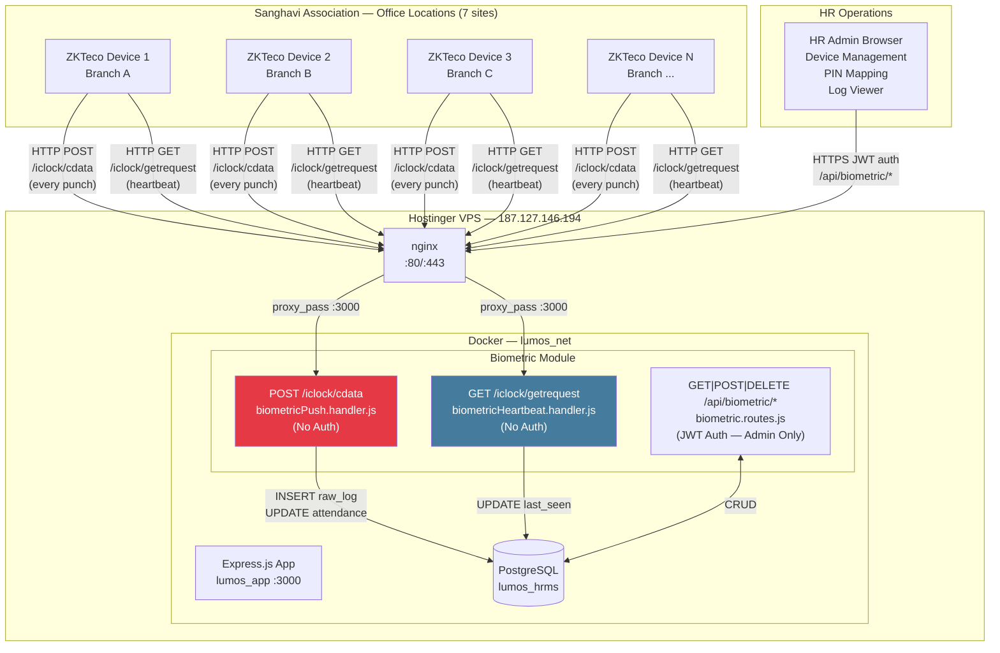
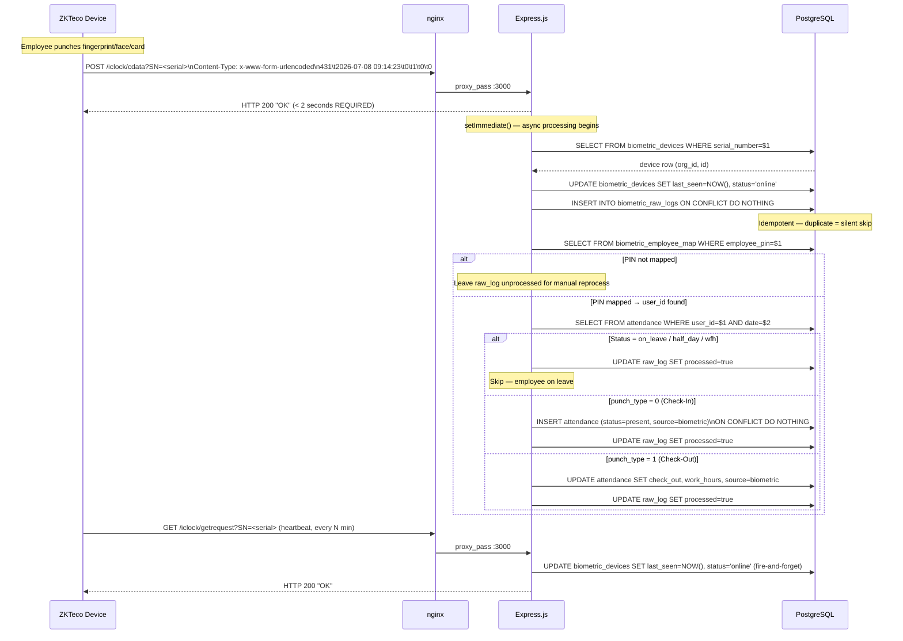
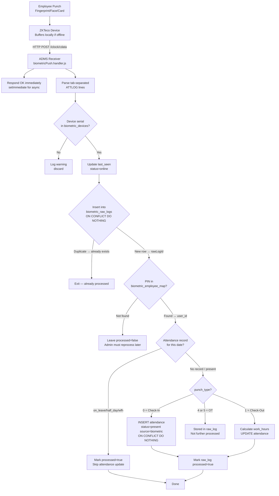
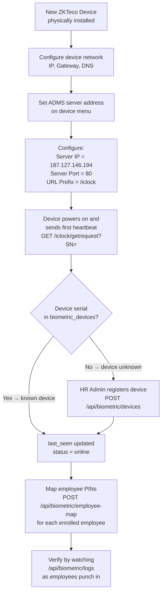
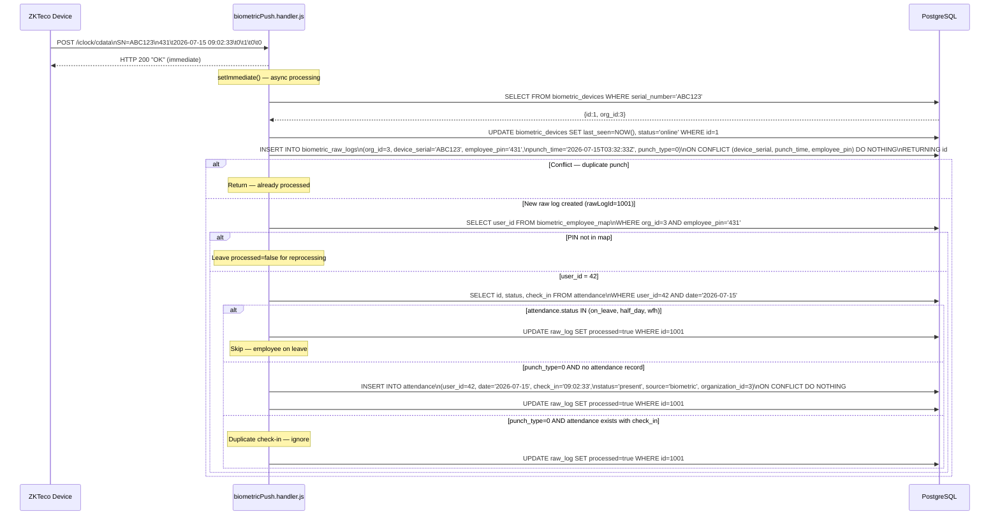
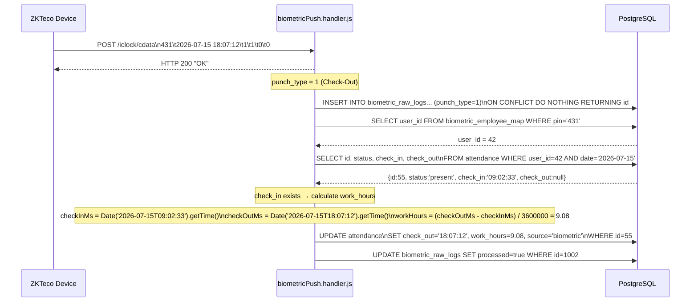
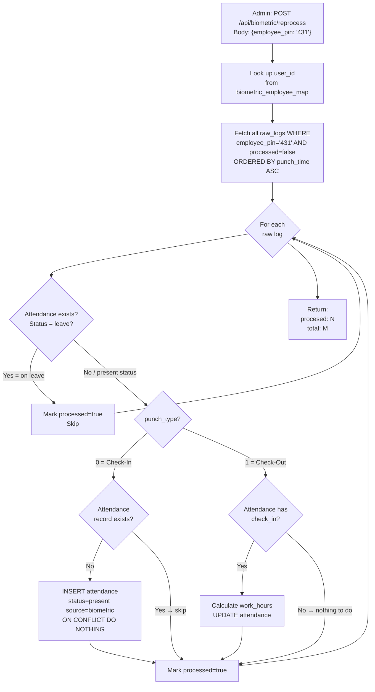
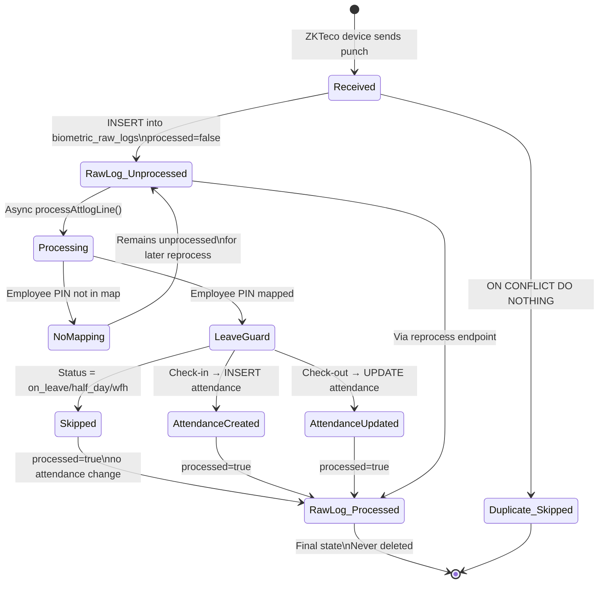
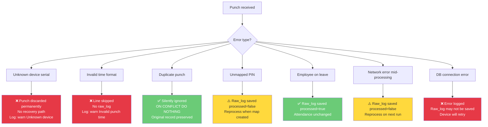

# 09 — Biometric Integration
## Lumos Logic HRMS — Enterprise Biometric Integration & Attendance Synchronization Guide

---

**Document Version:** 1.0
**Prepared By:** Lumos Logic
**Date:** July 2026
**Classification:** Confidential — DevOps, Developer, and Operations Distribution
**Audience:** Backend Developers, DevOps Engineers, System Administrators, HR Operations

> **Methodology:** Every statement in this document is derived from direct inspection of the live codebase — `biometricPush.handler.js`, `biometricHeartbeat.handler.js`, `biometric.routes.js`, `attendance.routes.js`, and the migration SQL. Implemented functionality is confirmed by code. Gaps are confirmed by the absence of code. Nothing is assumed.

---

## Table of Contents

1. [Executive Summary](#1-executive-summary)
2. [Integration Architecture](#2-integration-architecture)
3. [Supported Devices](#3-supported-devices)
4. [Device Registration & Configuration](#4-device-registration--configuration)
5. [Attendance Synchronization](#5-attendance-synchronization)
6. [Data Processing](#6-data-processing)
7. [Database Architecture](#7-database-architecture)
8. [Error Handling](#8-error-handling)
9. [Monitoring & Operations](#9-monitoring--operations)
10. [Security Considerations](#10-security-considerations)
11. [Maintenance Procedures](#11-maintenance-procedures)
12. [Troubleshooting Guide](#12-troubleshooting-guide)
13. [Risks](#13-risks)
14. [Best Practices](#14-best-practices)
15. [Future Improvements](#15-future-improvements)
- [Appendix A — Device Configuration Checklist](#appendix-a--device-configuration-checklist)
- [Appendix B — Daily Operations Checklist](#appendix-b--daily-operations-checklist)
- [Appendix C — Monthly Maintenance Checklist](#appendix-c--monthly-maintenance-checklist)
- [Appendix D — Troubleshooting Matrix](#appendix-d--troubleshooting-matrix)
- [Appendix E — Attendance Processing Flow Summary](#appendix-e--attendance-processing-flow-summary)
- [Appendix F — Integration Health Checklist](#appendix-f--integration-health-checklist)
- [Appendix G — Document Summary](#appendix-g--document-summary)

---

# 1. Executive Summary

### 1.1 Purpose

This document is the operational and technical reference for the ZKTeco biometric device integration in the Lumos Logic HRMS. It covers every aspect of the biometric ecosystem — from how devices communicate with the server, to how raw punch data becomes an attendance record, to how HR administrators manage devices and reconcile missed punches. It is the primary reference for anyone operating, troubleshooting, or extending the biometric attendance system.

### 1.2 Scope

This document covers:
- The ADMS (Attendance Data Management System) HTTP PUSH integration for ZKTeco devices
- Two ADMS endpoints: `POST /iclock/cdata` (punch data) and `GET /iclock/getrequest` (heartbeat)
- The biometric module at `backend/src/modules/biometric/`
- Four biometric database tables: `biometric_devices`, `biometric_raw_logs`, `biometric_employee_map`, `branches`
- Integration with the `attendance` table for record generation
- The HR Admin UI at `/biometric/devices`, `/biometric/mapping`, `/biometric/logs`

**Current deployment scope:** The biometric integration is live for **Sanghavi Association (Relitrade Shares Broker Pvt. Ltd.)**, with 7 ZKTeco devices and 158+ enrolled employees. The feature is controlled by the `biometric` feature flag and is disabled by default for all other organizations.

**Out of scope:** This document does not cover manual attendance check-in/out (covered in the system architecture documentation) or the fingerprint enrollment process on the physical devices (covered by ZKTeco device documentation).

### 1.3 Supported Biometric Architecture

| Component | Technology | Status |
|---|---|---|
| Device protocol | ZKTeco ADMS (HTTP PUSH) | ✅ Implemented |
| Check-in punch (type 0) | Attendance record creation | ✅ Implemented |
| Check-out punch (type 1) | Work hours calculation | ✅ Implemented |
| OT In punch (type 4) | Stored in raw log only | ⚠️ Partially Implemented |
| OT Out punch (type 5) | Stored in raw log only | ⚠️ Partially Implemented |
| Device heartbeat | 5-minute online/offline detection | ✅ Implemented |
| Unmatched PIN reprocessing | Manual admin endpoint | ✅ Implemented |
| Duplicate punch prevention | UNIQUE constraint + ON CONFLICT | ✅ Implemented |
| Late arrival auto-calculation | Not from biometric path | ❌ Recommended |
| Early exit auto-calculation | Not from biometric path | ❌ Recommended |
| OT hours auto-calculation | Column exists, not populated | ❌ Recommended |
| Break detection from biometric | Not implemented | ❌ Recommended |
| Device command push | Static "OK" response only | ❌ Recommended |
| Background reprocessing job | Manual endpoint only | ❌ Recommended |

### 1.4 Current Maturity Assessment

| Dimension | Assessment | Grade |
|---|---|---|
| Device communication (ADMS) | Functional ADMS receiver; handles both firmware variants | A |
| Punch data reception | Idempotent; handles retries; append-only log | A |
| Attendance generation | Check-in/out creates attendance records correctly | B+ |
| Duplicate prevention | UNIQUE constraint; DO NOTHING on conflict | A |
| Unmapped PIN handling | Queues for reprocessing; admin endpoint works | B |
| Late/early exit detection | Not computed from biometric path | D |
| OT hours calculation | Column exists but not populated | D |
| Break integration | Breaks manual; biometric can't trigger breaks | C |
| Monitoring | No automated monitoring; device status via last_seen | D |
| Security | ADMS endpoint unauthenticated; IP allowlist not implemented | D |
| Background processing | No scheduled jobs; manual reprocess only | D |
| **Overall** | **Functional core; significant operational and security gaps** | **C+** |

---

# 2. Integration Architecture

### 2.1 Overall Biometric Ecosystem



### 2.2 Device Communication Flow

ZKTeco devices use the **ADMS (Attendance Data Management System)** protocol — an HTTP PUSH model where the device initiates all communication. The server never calls the device. This is an important architectural constraint: the server cannot query a device for missed punches; it can only receive what the device sends.



### 2.3 Attendance Synchronization Architecture



### 2.4 HTTP PUSH vs HTTP PULL

The ADMS integration uses **HTTP PUSH** exclusively. Understanding this is critical for operations:

| Aspect | HTTP PUSH (Implemented) | HTTP PULL (Not Implemented) |
|---|---|---|
| Initiator | ZKTeco device calls server | Server calls ZKTeco device |
| Missed punches | Buffered on device; sent when reconnected | Server can query device for history |
| Server knowledge | Knows only what device sends | Can actively request data |
| Reliability | High — device retries until gets "OK" | Depends on server polling schedule |
| Implementation | `POST /iclock/cdata` | Not implemented — would require SDK |
| Recovery | Device auto-syncs buffered punches on reconnect | Not applicable |

**Buffer capacity:** ZKTeco devices buffer up to 100,000 punch records locally. When the server is offline and comes back, the device automatically replays buffered punches. No manual intervention required for punches that occurred during server downtime.

---

# 3. Supported Devices

### 3.1 Protocol Support

The HRMS implements the **ZKTeco ADMS (Attendance Data Management System) protocol** — an HTTP-based push protocol used by virtually all ZKTeco biometric devices from 2010 onward.

**Status: ✅ Implemented — protocol-level support, not model-specific**

The integration is designed at the protocol level, not the device model level. Any ZKTeco device that supports the ADMS HTTP PUSH protocol and can be configured with a custom server IP and port will work with this integration.

### 3.2 Vendor and Protocol Details

| Property | Value |
|---|---|
| **Vendor** | ZKTeco (Zhuhai ZKTeco Co., Ltd.) |
| **Protocol** | ADMS (Attendance Data Management System) via HTTP |
| **Transport** | HTTP (plain — port 80) |
| **Direction** | Device → Server (HTTP PUSH) |
| **Device Authentication** | None — no credentials required; device identified by serial number only |
| **Data Format** | `application/x-www-form-urlencoded` with tab-separated attendance log lines |
| **Time Format** | `YYYY-MM-DD HH:MM:SS` (device local time) |
| **Response Requirement** | HTTP 200 with body "OK" within 2 seconds |
| **Retry Behavior** | Device retries if no "OK" received within timeout |
| **Buffer on Offline** | Up to 100,000 records buffered locally on device |

### 3.3 ATTLOG Data Format

ZKTeco devices send attendance data in this format:

```
POST /iclock/cdata?SN=<SERIAL_NUMBER>&table=ATTLOG HTTP/1.1
Content-Type: application/x-www-form-urlencoded

PIN    Time                  Status  Verify  WorkCode  Reserved
431    2026-07-08 09:14:23   0       1       0         0
432    2026-07-08 09:15:01   0       2       0         0
431    2026-07-08 18:03:44   1       1       0         0
```

**Field definitions:**

| Field | Type | Values | Notes |
|---|---|---|---|
| `PIN` | TEXT | Any numeric string | Employee device enrollment PIN |
| `Time` | DATETIME | `YYYY-MM-DD HH:MM:SS` | Device local clock time |
| `Status` (punch_type) | SMALLINT | 0=Check-In, 1=Check-Out, 4=OT-In, 5=OT-Out | Core attendance type |
| `Verify` (verify_type) | SMALLINT | 1=Fingerprint, 2=Face, 4=Card, 15=Password | Biometric method used |
| `WorkCode` | INT | Varies | Optional work code (ignored by HRMS) |
| `Reserved` | INT | 0 | Reserved field (ignored) |

### 3.4 Firmware Compatibility

Different ZKTeco firmware versions encode the ATTLOG data differently. The push handler addresses this:

```javascript
// biometricPush.handler.js — extractAttlogLines()

// Firmware variant A: attendance lines appear as URL-encoded body KEYS
// (line has no '=' separator → URL parser treats entire line as key)
for (const key of Object.keys(body)) {
    if (/^\d+\t/.test(key)) parseLine(key);
}

// Firmware variant B: attendance lines appear as body VALUES
for (const val of Object.values(body)) {
    parseLine(val);
}

// Firmware variant C: lines in query string parameters
for (const val of Object.values(query)) {
    parseLine(val);
}
```

**Result:** The handler correctly parses punch data regardless of which of the three firmware encoding variants is used.

### 3.5 Heartbeat Protocol

```
GET /iclock/getrequest?SN=<SERIAL_NUMBER> HTTP/1.1
```

- Sent by device periodically (frequency varies by device model; typically every 1–5 minutes)
- Server responds with `HTTP 200` and body `"OK"`
- Used to update `biometric_devices.last_seen` and set `status='online'`
- Device is considered offline if no heartbeat received for > 5 minutes

### 3.6 Configured Devices (Sanghavi Association)

**Current enterprise deployment:** Sanghavi Association (Relitrade Shares Broker Pvt. Ltd.) operates 7 ZKTeco biometric devices across branch locations. Device model details are not hardcoded — devices are registered via the admin UI with their serial numbers and branch assignments.

To view registered devices:
```bash
docker exec lumos_postgres psql -U lumos_admin -d lumos_hrms -c "
    SELECT d.id, d.serial_number, d.device_name, d.location, d.status,
           d.last_seen, b.name AS branch
    FROM biometric_devices d
    LEFT JOIN branches b ON b.id = d.branch_id
    WHERE d.org_id = (SELECT id FROM organizations WHERE slug='sanghavi-association')
    ORDER BY d.device_name;
"
```

---

# 4. Device Registration & Configuration

### 4.1 Device Onboarding Process



### 4.2 Registering a Device (Admin UI)

**API Endpoint:** `POST /api/biometric/devices`

**Required:** `serial_number` (unique across all organizations)
**Optional:** `device_name`, `location`, `branch_id`, `area_code`, `device_ip`

```json
// Request body
{
    "serial_number": "ABC1234567",
    "device_name":   "Entrance Gate - Branch A",
    "location":      "Main Entrance",
    "branch_id":     1,
    "area_code":     1,
    "device_ip":     "192.168.1.101"
}
```

**What the HRMS records about each device:**

| Field | Description | Required? |
|---|---|---|
| `serial_number` | ZKTeco device serial number (printed on device) | ✅ Yes |
| `device_name` | Human-readable label | No |
| `location` | Physical location description | No |
| `branch_id` | Branch this device belongs to | No |
| `area_code` | ZKTeco area/department code | No |
| `device_ip` | Device's IP address (informational only — not used for connection) | No |
| `status` | `online`/`offline` (auto-maintained via heartbeat) | Auto |
| `last_seen` | Last heartbeat received timestamp | Auto |

> **Important:** `device_ip` is stored for reference only. The HRMS never initiates a connection to the device. All communication is device → server.

### 4.3 Device Network Configuration

The device must be configured to send ADMS data to the HRMS server. This is done on the device's administration screen (varies by model; typically: `Menu → Comm → PC Connection`):

| Setting | Value |
|---|---|
| **Server Address / IP** | `187.127.146.194` (Hostinger VPS IP) |
| **Server Port** | `80` |
| **URL Prefix / Path** | `/iclock` |

The resulting ADMS URL that devices use: `http://187.127.146.194:80/iclock`

> **If VPS IP changes:** Every registered device must have its server IP updated manually via the device administration screen. This is a critical operational task after any VPS migration. See Document 07, Section 4.14 for the full VPS migration procedure.

**Environment variable configuration (for reference in settings UI):**
```env
BIOMETRIC_SERVER_IP=187.127.146.194
BIOMETRIC_SERVER_PORT=80
```

These are exposed via `GET /api/settings/biometric-config` to the HR admin settings page.

### 4.4 Branch Mapping

Branches represent physical office locations. Each device is optionally linked to a branch.

**Create a branch:**
```
POST /api/branches
Body: { name, code, location, address }
```

**Link device to branch:** Set `branch_id` when registering or updating a device.

**Current Sanghavi branches:** Administered via the `/branches` page (feature flag: `branches`).

```sql
-- View current branches
SELECT id, name, code, location FROM branches WHERE org_id = <org_id>;
```

### 4.5 Employee PIN Mapping

Every ZKTeco device assigns a numeric PIN to each enrolled employee. This PIN must be mapped to an HRMS user ID before punches can be converted to attendance records.

**Create a mapping:**
```
POST /api/biometric/employee-map
Body: { employee_pin: "431", user_id: 42 }
```

**View all mappings:**
```
GET /api/biometric/employee-map
```
Returns: list of mappings with employee names and their `device_enrollment_id` field from the `users` table.

**Delete a mapping:**
```
DELETE /api/biometric/employee-map/:id
```

**Mapping constraints:**
- One PIN per organization (UNIQUE on `org_id`, `employee_pin`)
- One user_id can only have one PIN per org
- Deleting a mapping does not delete raw logs — those remain unprocessed

**The `device_enrollment_id` field on `users`:**

The `users` table has a `device_enrollment_id TEXT` column with a partial unique index:
```sql
CREATE UNIQUE INDEX idx_users_device_pin_org
    ON users(organization_id, device_enrollment_id)
    WHERE device_enrollment_id IS NOT NULL;
```

This field stores the same PIN number for informational purposes. The authoritative mapping is in `biometric_employee_map`, not this column. The two should be kept in sync manually.

### 4.6 Feature Flag Requirement

The biometric integration is only accessible to organizations with the `biometric` feature flag enabled:

```sql
-- Enable biometric for an organization
INSERT INTO organization_features (organization_id, feature_key, enabled)
VALUES (<org_id>, 'biometric', true)
ON CONFLICT (organization_id, feature_key) DO UPDATE SET enabled = true;
```

Without this flag:
- `/biometric/*` pages show "Feature Not Available" (locked screen)
- API endpoints return 403 via `featureGate` middleware

> **Note:** The ADMS endpoints (`/iclock/cdata`, `/iclock/getrequest`) are not gated by feature flags. They receive and store punches from any registered device regardless of feature flag state. The feature flag only controls the admin UI and management API.

### 4.7 Timezone Configuration

All punch timestamps received from ZKTeco devices are treated as **India Standard Time (IST, UTC+5:30)**. The server runs in IST timezone:

```yaml
# docker-compose.yml
services:
  postgres:
    environment:
      - TZ=Asia/Kolkata
```

ZKTeco devices must be configured with the correct IST time. If a device's clock drifts, all attendance records for that device will be off by the drift amount. There is no automatic clock correction in the current implementation.

---

# 5. Attendance Synchronization

### 5.1 Complete Punch Processing Flow



### 5.2 Check-Out Processing and Work Hours



### 5.3 Validation Applied During Processing

**Status: ✅ Implemented — the following validations occur in `processAttlogLine()`**

| Validation | Mechanism | Outcome if Failed |
|---|---|---|
| Device serial registered | `SELECT FROM biometric_devices WHERE serial_number=$1` | Log warning; discard punch |
| Punch time parseable | `isNaN(punchTime.getTime())` | Log warning; skip line |
| ATTLOG line format | `/^\d+\t/.test(trimmed)` | Line skipped |
| Minimum field count | `parts.length < 3` | Line skipped |
| Duplicate punch | `ON CONFLICT DO NOTHING` on raw_log | Silent skip; no error |
| Employee PIN mapped | `SELECT FROM biometric_employee_map` | Leave unprocessed; mark for reprocessing |
| Employee on leave | Check attendance.status field | Skip attendance update; mark log processed |

**Status: ❌ Not yet validated from the biometric path**

| Missing Validation | Impact | Recommendation |
|---|---|---|
| Device clock drift | Attendance at wrong time | NTP sync on device; server-side time range check |
| Work hours sanity check | Negative hours if checkout before checkin | Add `CHECK workHours > 0` before UPDATE |
| Late arrival flag on check-in | `is_late` not set from biometric | Compare check_in vs work_schedule.late_threshold |
| Early exit flag on check-out | `is_early_exit` not set from biometric | Compare check_out vs work_schedule.early_exit_threshold |

### 5.4 Duplicate Detection

**Status: ✅ Implemented — two-layer protection**

**Layer 1: Database UNIQUE constraint on raw log**
```sql
UNIQUE (device_serial, punch_time, employee_pin)
```
If a device sends the same punch twice (retry behavior), the second INSERT fails silently:
```sql
INSERT INTO biometric_raw_logs ... ON CONFLICT (device_serial, punch_time, employee_pin) DO NOTHING
```
The `RETURNING id` clause returns nothing on conflict, causing the handler to exit early.

**Layer 2: Application-level check-in deduplication**

If a second check-in punch arrives for a date where attendance already has `check_in` set:
```javascript
// punch_type === 0 AND att exists (already has check_in)
// → No INSERT or UPDATE performed
// → Raw log still marked processed=true
```

The first punch is preserved; the second is silently ignored.

### 5.5 The Reprocessing System

**Status: ✅ Implemented** — `POST /api/biometric/reprocess`

The reprocessing endpoint converts unprocessed raw logs into attendance records. It is the recovery mechanism for punches that arrived before an employee was mapped.



**Reprocessing scope:** Current implementation reprocesses one `employee_pin` at a time. To reprocess all unmapped employees at once (e.g., after a bulk PIN mapping session), a developer must either:
1. Call the endpoint once per PIN, or
2. Run a direct SQL + application loop (no bulk endpoint exists)

**Recommendation:** Add a bulk reprocess endpoint: `POST /api/biometric/reprocess-all` that iterates all unprocessed logs and attempts to match each via current mappings.

### 5.6 Manual Override

After biometric attendance is created, HR admins can edit it via:
- `POST /api/attendance/admin-edit` — set any field on any employee's attendance
- `PUT /api/attendance/:id` — update specific attendance record

Manual edits do not change the `source` field from `'biometric'` to `'manual'` — this must be done explicitly if audit clarity is important.

---

# 6. Data Processing

### 6.1 Punch Processing — What Is Implemented

**Status: ✅ Implemented**

| Processing Step | Implemented | Notes |
|---|---|---|
| Raw punch storage (append-only) | ✅ Yes | `biometric_raw_logs` |
| Device serial lookup | ✅ Yes | Must be registered |
| last_seen / status update | ✅ Yes | Both on punch and heartbeat |
| Duplicate prevention via UNIQUE | ✅ Yes | `ON CONFLICT DO NOTHING` |
| Employee PIN → user_id mapping | ✅ Yes | `biometric_employee_map` |
| Leave guard (skip on leave) | ✅ Yes | Checks attendance.status |
| Check-in record creation | ✅ Yes | `source='biometric'` |
| Check-out record update | ✅ Yes | Calculates `work_hours` |
| Work hours calculation | ✅ Yes | `(checkout - checkin) / 3600000` |
| Unprocessed log queue | ✅ Yes | `processed=false` |
| Manual reprocessing | ✅ Yes | Per-PIN admin endpoint |

### 6.2 Late Arrival Detection

**Status: ❌ Not implemented from biometric path**

The `is_late` flag and `late_minutes` column exist in the `attendance` table, but they are **not calculated** when attendance is created from a biometric punch.

**How late detection works in the manual check-in path:**
```javascript
// attendance.routes.js — POST /checkin (manual flow)
function toMinutes(t) {
    const [h, m] = t.split(':').map(Number);
    return h * 60 + m;
}
const isLate = toMinutes(timeStr) > toMinutes(settings.late_threshold);
// timeStr = HH:MM, settings.late_threshold = '09:00'
```

**Gap:** This `is_late` calculation is NOT applied in `biometricPush.handler.js`. When a biometric check-in creates an attendance record, the `is_late` field defaults to `false` regardless of actual punch time.

**Recommended fix — add to biometricPush.handler.js:**
```javascript
// After creating attendance from biometric check-in:
const schedRes = await pool.query(
    'SELECT late_threshold, early_exit_threshold, half_day_hours FROM work_schedule WHERE organization_id=$1 LIMIT 1',
    [orgId]
);
const settings = schedRes.rows[0];
if (settings) {
    function toMinutes(t) { const [h,m] = t.split(':'); return parseInt(h)*60+parseInt(m); }
    const isLate = toMinutes(punchTimeStr.slice(0,5)) > toMinutes(settings.late_threshold);
    await pool.query(
        'UPDATE attendance SET is_late=$1, late_minutes=$2 WHERE user_id=$3 AND date=$4',
        [isLate, isLate ? toMinutes(punchTimeStr.slice(0,5)) - toMinutes(settings.late_threshold) : 0, userId, punchDate]
    );
}
```

### 6.3 Early Exit Detection

**Status: ❌ Not implemented from biometric path**

Same gap as late arrival — `is_early_exit` is not set when checkout is created from a biometric punch.

**The manual checkout path does apply this:**
```javascript
// attendance.routes.js — POST /checkout (manual flow)
const isEarlyExit = toMinutes(timeStr) < toMinutes(settings.early_exit_threshold);
```

**Recommended fix:** Same pattern as late arrival — look up `work_schedule` on checkout punch and set `is_early_exit` and `early_exit_minutes`.

### 6.4 Break Handling

**Status: ⚠️ Partially Implemented — manual only, not biometric-triggered**

The `attendance` table has break tracking columns added in `add_break_tracking.sql`:
- `break_start TEXT` (HH:MM:SS)
- `break_end TEXT` (HH:MM:SS)
- `total_break_minutes INTEGER`
- `gross_hours NUMERIC` (before break deduction)

**How breaks work in the manual path:**
```
Employee → POST /api/attendance/break-in  → Sets break_start; clears break_end
Employee → POST /api/attendance/break-out → Sets break_end; calculates total_break_minutes
Employee → POST /api/attendance/checkout  → Auto-closes any open break; calculates effective work_hours
```

**Biometric interaction with breaks:**
- Biometric punches do **not** start or stop breaks
- Work hours calculated by biometric is `gross_hours` (no break deduction)
- The formula `(checkOutMs - checkInMs) / 3600000` does not subtract breaks
- If an employee goes to lunch and punches biometrically for checkout + re-check-in, these would be treated as a new check-out and (ignored) check-in

**The biometric path calculates and stores `work_hours`, but this is actually `gross_hours` — no break deduction is applied because the biometric handler does not read `total_break_minutes`.**

**Recommended fix:** After calculating work hours in biometricPush.handler.js checkout processing:
```javascript
const breakMins = att.total_break_minutes || 0;
const grossHours = parseFloat(((checkOutMs - checkInMs) / 3600000).toFixed(2));
const workHours = parseFloat(Math.max(0, grossHours - breakMins/60).toFixed(2));
await pool.query(
    'UPDATE attendance SET check_out=$1, gross_hours=$2, work_hours=$3, source=\'biometric\' WHERE id=$4',
    [punchTimeStr, grossHours, workHours, att.id]
);
```

### 6.5 Overtime Hours

**Status: ⚠️ Partially Implemented — column exists, not auto-calculated from biometric**

The `attendance.ot_hours NUMERIC` column was added in `sanghavi_migration.sql` to store overtime hours. The corresponding user field `users.ot_applicable BOOLEAN` and `users.ot_rate NUMERIC` exist for payroll.

**However:** The biometric push handler does NOT calculate `ot_hours`. It is not populated automatically.

**Current status:**
- Column: ✅ Exists
- Auto-calculation from biometric: ❌ Not implemented
- Manual entry: ✅ Admin can set via `POST /api/attendance/admin-edit`

**Recommended calculation (not yet implemented):**
```javascript
const standardWorkHours = 8; // or from work_schedule
if (grossHours > standardWorkHours) {
    const otHours = parseFloat((grossHours - standardWorkHours).toFixed(2));
    // ... update attendance.ot_hours = otHours
}
```

### 6.6 Shift Rules

**Status: ❌ Not applied from biometric path**

The `shifts` and `shift_assignments` tables define which shift an employee is on for a given day. The biometric integration does not read shift assignments when processing punches.

**Impact:** If an employee works a night shift (e.g., 22:00–06:00), the late threshold and standard hours comparison would be incorrect because the biometric handler uses `work_schedule` defaults, not the employee's assigned shift.

**Recommendation:** Query `shift_assignments` for the punch date and user, and use the shift's `start_time`/`end_time` for late/early calculations instead of global work_schedule defaults.

### 6.7 Holiday and Weekend Handling

**Status: ✅ Partially handled via leave guard**

The biometric handler checks if an attendance record already exists with a special status:
```javascript
if (att && ['on_leave', 'half_day', 'wfh'].includes(att.status)) {
    // Skip — mark processed and return
}
```

**Holiday handling:** If HR has pre-marked an employee's attendance as `holiday` for a public holiday, the biometric handler checks the attendance status. However, `'holiday'` is not in the skip list — a biometric punch on a holiday would overwrite the pre-marked holiday status.

**Weekend handling:** Weekends are not automatically blocked. If an employee punches on a weekend, an attendance record with `status='present'` is created. There is no automatic `work_days` check from `work_schedule` in the biometric path.

**Recommended additions to the leave guard:**
```javascript
// Add 'holiday' and optionally check weekend
const SKIP_STATUSES = ['on_leave', 'half_day', 'wfh', 'holiday'];
```

### 6.8 What Biometric Does vs Does Not Update

| Attendance Field | Set by Biometric? | Notes |
|---|---|---|
| `check_in` | ✅ Yes | On punch_type=0 |
| `check_out` | ✅ Yes | On punch_type=1 |
| `work_hours` | ✅ Yes | (checkout-checkin)/3600 — gross only |
| `status` | ✅ Yes | Set to 'present' on check-in |
| `source` | ✅ Yes | Set to 'biometric' |
| `gross_hours` | ❌ No | Not updated by biometric path |
| `break_start/end` | ❌ No | Manual only |
| `total_break_minutes` | ❌ No | Manual only |
| `is_late` | ❌ No | Not calculated |
| `late_minutes` | ❌ No | Not calculated |
| `is_early_exit` | ❌ No | Not calculated |
| `early_exit_minutes` | ❌ No | Not calculated |
| `ot_hours` | ❌ No | Not calculated |
| `notes` | ❌ No | Manual only |
| `clockify_hours` | ❌ No | Clockify integration removed |

---

# 7. Database Architecture

### 7.1 Biometric Tables

```mermaid
erDiagram
    organizations {
        bigserial id PK
        text name
    }

    branches {
        bigserial id PK
        bigint org_id FK
        text name
        text code
        text location
        boolean is_active
    }

    biometric_devices {
        bigserial id PK
        bigint org_id FK
        bigint branch_id FK
        text serial_number UK
        text device_name
        text device_ip
        text status
        timestamptz last_seen
    }

    biometric_raw_logs {
        bigserial id PK
        bigint org_id FK
        text device_serial
        text employee_pin
        timestamptz punch_time
        smallint punch_type
        smallint verify_type
        boolean processed
        UNIQUE "device_serial,punch_time,employee_pin"
    }

    biometric_employee_map {
        bigserial id PK
        bigint org_id FK
        text employee_pin
        bigint user_id FK
        UNIQUE "org_id,employee_pin"
    }

    users {
        bigserial id PK
        text device_enrollment_id
        bigint branch_id FK
    }

    attendance {
        bigserial id PK
        bigint user_id FK
        text date
        text check_in
        text check_out
        text source
        numeric work_hours
        numeric ot_hours
        int late_minutes
        int early_exit_minutes
    }

    organizations ||--o{ branches : "has"
    organizations ||--o{ biometric_devices : "has"
    organizations ||--o{ biometric_raw_logs : "receives"
    organizations ||--o{ biometric_employee_map : "defines"
    branches ||--o{ biometric_devices : "hosts"
    branches ||--o{ users : "assigned to"
    biometric_employee_map }o--|| users : "maps to"
    biometric_raw_logs }|--|| attendance : "generates"
```

### 7.2 Table Details

#### `biometric_devices`
```sql
CREATE TABLE biometric_devices (
    id            BIGSERIAL PRIMARY KEY,
    org_id        BIGINT NOT NULL REFERENCES organizations(id) ON DELETE CASCADE,
    serial_number TEXT UNIQUE NOT NULL,  -- Global unique; one device per serial
    device_name   TEXT,
    location      TEXT,
    branch_id     BIGINT REFERENCES branches(id),
    area_code     INT,
    device_ip     TEXT,
    last_seen     TIMESTAMPTZ,           -- Last heartbeat timestamp
    status        TEXT DEFAULT 'offline'
                  CHECK (status IN ('online','offline')),
    created_at    TIMESTAMPTZ DEFAULT NOW()
);
CREATE INDEX idx_biometric_devices_org ON biometric_devices(org_id);
```

**Online detection logic (application-level):**
```javascript
device.online = device.last_seen
    ? (Date.now() - new Date(device.last_seen).getTime()) < 5 * 60 * 1000  // 5 minutes
    : false;
```

#### `biometric_raw_logs`
```sql
CREATE TABLE biometric_raw_logs (
    id            BIGSERIAL PRIMARY KEY,
    org_id        BIGINT NOT NULL REFERENCES organizations(id) ON DELETE CASCADE,
    device_serial TEXT NOT NULL,
    employee_pin  TEXT NOT NULL,
    punch_time    TIMESTAMPTZ NOT NULL,    -- UTC; display in IST
    punch_type    SMALLINT,               -- 0=In, 1=Out, 4=OT-In, 5=OT-Out
    verify_type   SMALLINT,               -- 1=Fingerprint, 2=Face, 4=Card
    area          TEXT,
    raw_payload   JSONB,                  -- Full parsed request for debugging
    processed     BOOLEAN DEFAULT FALSE,
    created_at    TIMESTAMPTZ DEFAULT NOW(),
    UNIQUE (device_serial, punch_time, employee_pin)
);
CREATE INDEX idx_bio_logs_org_time      ON biometric_raw_logs(org_id, punch_time DESC);
CREATE INDEX idx_bio_logs_unprocessed   ON biometric_raw_logs(org_id, processed)
    WHERE processed = FALSE;             -- Partial index — only unprocessed rows
```

#### `biometric_employee_map`
```sql
CREATE TABLE biometric_employee_map (
    id           BIGSERIAL PRIMARY KEY,
    org_id       BIGINT NOT NULL REFERENCES organizations(id) ON DELETE CASCADE,
    employee_pin TEXT NOT NULL,
    user_id      BIGINT NOT NULL REFERENCES users(id) ON DELETE CASCADE,
    created_at   TIMESTAMPTZ DEFAULT NOW(),
    UNIQUE (org_id, employee_pin)        -- One PIN per org
);
CREATE INDEX idx_bio_map_org ON biometric_employee_map(org_id);
```

#### `branches`
```sql
CREATE TABLE branches (
    id         BIGSERIAL PRIMARY KEY,
    org_id     BIGINT NOT NULL REFERENCES organizations(id) ON DELETE CASCADE,
    name       TEXT NOT NULL,
    code       TEXT,
    location   TEXT,
    address    TEXT,
    is_active  BOOLEAN DEFAULT TRUE,
    created_at TIMESTAMPTZ DEFAULT NOW()
);
CREATE INDEX idx_branches_org ON branches(org_id);
```

### 7.3 Data Lifecycle



### 7.4 Archiving Strategy

**Status: ❌ Not implemented**

The `biometric_raw_logs` table is append-only and grows indefinitely. For Sanghavi with 158+ employees and 7 devices making ~2 punches per employee per day:

**Growth estimate:**
```
158 employees × 2 punches/day × 365 days/year = ~115,000 rows/year
With multi-year operation: 500,000+ rows
```

**Recommended archiving strategy:**
```sql
-- Monthly: Move processed logs > 6 months old to archives table
INSERT INTO archives (organization_id, table_name, record, archived_by, archived_at)
SELECT org_id, 'biometric_raw_logs', row_to_json(l)::jsonb, NULL, NOW()
FROM biometric_raw_logs l
WHERE org_id = <org_id>
  AND processed = TRUE
  AND punch_time < NOW() - INTERVAL '6 months';

-- After verification:
DELETE FROM biometric_raw_logs
WHERE org_id = <org_id>
  AND processed = TRUE
  AND punch_time < NOW() - INTERVAL '6 months';
```

---

# 8. Error Handling

### 8.1 Offline Devices

| Property | Value |
|---|---|
| **Detection** | `biometric_devices.status = 'offline'` when `last_seen` > 5 minutes ago; device does not send heartbeats |
| **What happens to punches** | ZKTeco devices buffer up to 100,000 punch records in local memory. When server comes back, device automatically retries |
| **Recovery** | When server is restored: device reconnects → sends buffered punches → server processes in order → attendance created for missed period |
| **Action needed** | None — automatic recovery. After recovery, verify attendance records for the outage period are present |
| **Prevention** | Monitor `last_seen` timestamps; set up alerting for devices offline > 30 minutes |

```sql
-- Query: Devices not seen in last 15 minutes
SELECT serial_number, device_name, location, last_seen,
       NOW() - last_seen AS offline_duration
FROM biometric_devices
WHERE org_id = <org_id>
  AND (last_seen IS NULL OR last_seen < NOW() - INTERVAL '15 minutes')
ORDER BY last_seen ASC;
```

### 8.2 Duplicate Punches

| Property | Value |
|---|---|
| **Detection** | `ON CONFLICT (device_serial, punch_time, employee_pin) DO NOTHING` on INSERT |
| **What happens** | Duplicate silently discarded; no error; `RETURNING id` returns empty; handler exits early |
| **Root Cause** | ZKTeco devices retry the HTTP push if they don't receive "OK" within their timeout (e.g., network hiccup). Same punch sent multiple times |
| **Recovery** | None needed — the UNIQUE constraint prevents duplicate records |
| **Prevention** | Respond to `/iclock/cdata` within 2 seconds always; the 2-second `setImmediate` architecture guarantees this |

### 8.3 Unknown Device Serial

| Property | Value |
|---|---|
| **Detection** | `SELECT FROM biometric_devices WHERE serial_number=$1` returns no rows |
| **What happens** | `console.warn('[biometric] Unknown device SN=...')` logged; punch data discarded; no raw_log created |
| **Root Cause** | Device registered on the ZKTeco network before being registered in HRMS; or wrong server address on a different org's device |
| **Recovery** | Register device via `POST /api/biometric/devices`; punches from the unknown device are permanently lost (no raw_log exists to reprocess) |
| **Prevention** | Register devices in HRMS before deploying them; check device registration list matches physical devices |

> **Critical:** Unlike unmapped employee PINs (which are queued for reprocessing), punches from unregistered devices are permanently discarded with no recovery path.

### 8.4 Invalid Employee PIN (Not Mapped)

| Property | Value |
|---|---|
| **Detection** | `SELECT FROM biometric_employee_map WHERE employee_pin=$1` returns no rows |
| **What happens** | Raw log saved with `processed=false`; punch data preserved; handler exits without creating attendance |
| **Root Cause** | New employee enrolled on device before PIN mapping created in HRMS; mapping accidentally deleted |
| **Recovery** | Admin creates mapping → calls `POST /api/biometric/reprocess {employee_pin: "431"}` → historical punches converted to attendance |
| **Prevention** | Create employee PIN mapping in HRMS before enrolling employee on device |

```sql
-- Query: Unmapped employee PINs (PINs receiving punches without a mapping)
SELECT DISTINCT employee_pin, COUNT(*) AS punch_count,
       MAX(punch_time) AS last_punch
FROM biometric_raw_logs
WHERE org_id = <org_id>
  AND processed = FALSE
  AND employee_pin NOT IN (
      SELECT employee_pin FROM biometric_employee_map WHERE org_id = <org_id>
  )
GROUP BY employee_pin
ORDER BY punch_count DESC;
```

### 8.5 Network Failures

| Property | Value |
|---|---|
| **Detection** | Device does not receive "OK"; device retries; `last_seen` falls behind |
| **What happens** | ZKTeco device buffers the punch locally; retries automatically |
| **At server side** | Server never knows about the punch until device retries successfully |
| **Recovery** | Automatic — device retries until it receives "OK"; once network restored, buffered punches are sent in bulk |
| **Prevention** | Reliable network between device and VPS; monitor device `last_seen` for sustained gaps |

### 8.6 Clock Drift

| Property | Value |
|---|---|
| **Detection** | Attendance records show check-in times that don't match expected shift start; cluster of "late" employees who are physically present on time |
| **Root Cause** | ZKTeco device clock drifted from IST; no NTP sync configured on device |
| **What happens** | Attendance record stores the device's reported time verbatim; wrong time entered into DB |
| **Recovery** | Admin edits affected attendance records via `POST /api/attendance/admin-edit`; correct the device clock |
| **Prevention** | Configure NTP on ZKTeco devices (device menu → Date/Time → NTP Server = pool.ntp.org); verify device time matches IST monthly |
| **Detection query** | Compare `check_in` values for all employees on same day — clock drift produces uniformly shifted times |

### 8.7 Missing Punch (Checkout Without Check-in)

| Property | Value |
|---|---|
| **Scenario** | Employee forgets to punch in (or check-in punch failed); only checkout punch received |
| **What happens** | `biometricPush.handler.js` punch_type=1 path: if no attendance record exists, inserts record with `check_out` only and `status='present'`; `check_in` is NULL |
| **Impact** | `work_hours` cannot be calculated (no check_in); attendance record exists but is incomplete |
| **Recovery** | HR admin edits attendance to set `check_in` manually via regularization request or `POST /api/attendance/admin-edit` |
| **Prevention** | Employees trained on correct device usage; second biometric device at both entrance and exit |

```sql
-- Query: Attendance records with checkout but no check-in (biometric path)
SELECT u.name, a.date, a.check_in, a.check_out, a.work_hours, a.source
FROM attendance a
JOIN users u ON u.id = a.user_id
WHERE a.organization_id = <org_id>
  AND a.source = 'biometric'
  AND a.check_in IS NULL
  AND a.check_out IS NOT NULL
ORDER BY a.date DESC;
```

### 8.8 Partial Synchronization

| Property | Value |
|---|---|
| **Scenario** | Server crashes mid-processing of a batch of punches |
| **What happens** | `setImmediate()` callback is lost; partially processed punches: some have `processed=true`, some have `processed=false` |
| **Recovery** | After server restarts: reprocess unprocessed logs via `POST /api/biometric/reprocess` per PIN; or manual admin-edit |
| **Prevention** | The idempotent design (`ON CONFLICT DO NOTHING`) prevents re-creating already-created records if reprocessing is run again. Transaction support would prevent partial processing within a single punch, but `setImmediate` already makes this low-risk |

### 8.9 Processing Error Summary



---

# 9. Monitoring & Operations

### 9.1 Current Monitoring State

**Status: ❌ No automated monitoring implemented**

| Monitoring Capability | Status |
|---|---|
| Device online/offline alerting | ❌ Not implemented |
| Unprocessed log alerting | ❌ Not implemented |
| Daily attendance completeness check | ❌ Not implemented |
| Device heartbeat monitoring | ⚠️ Manual — check `last_seen` in admin UI |
| Sync failure alerting | ❌ Not implemented |
| Punch volume anomaly detection | ❌ Not implemented |

### 9.2 Device Health Monitoring

**Online/Offline status:**

The HRMS calculates device status from `last_seen`:
- **Online:** `last_seen` within the last 5 minutes
- **Offline:** `last_seen` older than 5 minutes

```sql
-- Manual device health check
SELECT
    serial_number,
    device_name,
    location,
    b.name AS branch,
    last_seen,
    CASE
        WHEN last_seen > NOW() - INTERVAL '5 minutes' THEN '🟢 ONLINE'
        WHEN last_seen > NOW() - INTERVAL '30 minutes' THEN '🟡 RECENTLY OFFLINE'
        WHEN last_seen IS NOT NULL THEN '🔴 OFFLINE (' ||
            EXTRACT(HOURS FROM NOW()-last_seen)::INT || 'h)'
        ELSE '⚪ NEVER CONNECTED'
    END AS health_status
FROM biometric_devices d
LEFT JOIN branches b ON b.id = d.branch_id
WHERE d.org_id = <org_id>
ORDER BY last_seen DESC NULLS LAST;
```

### 9.3 Sync Monitoring

**Daily completeness check:**

```sql
-- Check how many employees have attendance for today
SELECT
    u.name,
    a.check_in,
    a.check_out,
    a.status,
    a.source,
    CASE WHEN a.id IS NULL THEN '❌ No record'
         WHEN a.check_in IS NULL THEN '⚠️ No check-in'
         WHEN a.check_out IS NULL THEN '⚠️ No check-out'
         ELSE '✅ Complete'
    END AS attendance_status
FROM users u
LEFT JOIN attendance a ON a.user_id = u.id
    AND a.date = TO_CHAR(NOW() AT TIME ZONE 'Asia/Kolkata', 'YYYY-MM-DD')
WHERE u.organization_id = <org_id>
  AND u.employee_status = 'active'
ORDER BY attendance_status, u.name;
```

**Unprocessed log monitoring:**

```sql
-- Show unprocessed logs older than 2 hours (should be 0 in normal operation)
SELECT
    l.org_id,
    l.employee_pin,
    m.user_id,
    u.name AS employee_name,
    l.device_serial,
    l.punch_time,
    l.punch_type,
    NOW() - l.created_at AS age
FROM biometric_raw_logs l
LEFT JOIN biometric_employee_map m
    ON m.org_id = l.org_id AND m.employee_pin = l.employee_pin
LEFT JOIN users u ON u.id = m.user_id
WHERE l.org_id = <org_id>
  AND l.processed = FALSE
  AND l.created_at < NOW() - INTERVAL '2 hours'
ORDER BY l.punch_time DESC;
```

**Punch volume by device per day:**

```sql
-- Punch counts per device per day (last 7 days)
SELECT
    device_serial,
    punch_time::date AS punch_date,
    COUNT(*) AS total_punches,
    SUM(CASE WHEN punch_type = 0 THEN 1 ELSE 0 END) AS check_ins,
    SUM(CASE WHEN punch_type = 1 THEN 1 ELSE 0 END) AS check_outs,
    SUM(CASE WHEN processed = FALSE THEN 1 ELSE 0 END) AS unprocessed
FROM biometric_raw_logs
WHERE org_id = <org_id>
  AND punch_time > NOW() - INTERVAL '7 days'
GROUP BY device_serial, punch_time::date
ORDER BY punch_date DESC, device_serial;
```

### 9.4 Log Analysis

**View recent logs with employee names:**
```
GET /api/biometric/logs?page=1&limit=50
GET /api/biometric/logs?processed=false
GET /api/biometric/logs?device_serial=ABC123&date_from=2026-07-15&date_to=2026-07-15
GET /api/biometric/logs?employee_pin=431
```

**Direct SQL for detailed analysis:**
```sql
-- Today's punch timeline for all employees
SELECT
    u.name AS employee,
    TO_CHAR(l.punch_time AT TIME ZONE 'Asia/Kolkata', 'HH24:MI:SS') AS punch_ist,
    CASE l.punch_type
        WHEN 0 THEN 'CHECK-IN'
        WHEN 1 THEN 'CHECK-OUT'
        WHEN 4 THEN 'OT-IN'
        WHEN 5 THEN 'OT-OUT'
        ELSE 'UNKNOWN'
    END AS type,
    CASE l.verify_type
        WHEN 1 THEN 'Fingerprint'
        WHEN 2 THEN 'Face'
        WHEN 4 THEN 'Card'
        ELSE 'Other'
    END AS method,
    l.device_serial,
    l.processed
FROM biometric_raw_logs l
LEFT JOIN biometric_employee_map m ON m.org_id = l.org_id AND m.employee_pin = l.employee_pin
LEFT JOIN users u ON u.id = m.user_id
WHERE l.org_id = <org_id>
  AND (l.punch_time AT TIME ZONE 'Asia/Kolkata')::date = CURRENT_DATE
ORDER BY l.punch_time;
```

### 9.5 Operational Dashboards (Recommended)

**Status: ❌ Not implemented — recommendations only**

| Dashboard | Content | Implementation |
|---|---|---|
| Device Status Board | All devices with online/offline status, last seen time | HR Admin `/biometric/devices` (partially exists) |
| Daily Sync Summary | % employees with complete attendance, unprocessed logs count | Recommended: new admin page |
| Punch Timeline | Hour-by-hour punch counts per device | Recommended: chart on admin page |
| Unmapped PINs Alert | Count and list of PINs sending punches without mapping | Recommended: alert widget |
| Attendance Completeness | Employees missing check-in or check-out | Recommended: daily report |

### 9.6 Daily Operational Checks

Run these checks every morning (IST) before work hours start:

```bash
ssh root@187.127.146.194

# 1. Are all Docker containers running?
docker compose -f /opt/lumos-hrms/docker-compose.yml ps

# 2. Are all biometric devices online? (check last_seen within 30 min)
docker exec lumos_postgres psql -U lumos_admin -d lumos_hrms -c "
    SELECT serial_number, device_name, last_seen,
           NOW() - last_seen AS offline_for
    FROM biometric_devices
    WHERE org_id = (SELECT id FROM organizations WHERE slug='sanghavi-association')
      AND (last_seen IS NULL OR last_seen < NOW() - INTERVAL '30 minutes')
    ORDER BY last_seen DESC NULLS LAST;
"
# Expected: 0 rows (all devices recently seen)

# 3. Are there unprocessed raw logs from yesterday?
docker exec lumos_postgres psql -U lumos_admin -d lumos_hrms -c "
    SELECT COUNT(*) AS unprocessed_yesterday
    FROM biometric_raw_logs
    WHERE org_id = (SELECT id FROM organizations WHERE slug='sanghavi-association')
      AND processed = FALSE
      AND punch_time < NOW() - INTERVAL '2 hours';
"
# Expected: 0 rows

# 4. How many attendance records created today from biometric?
docker exec lumos_postgres psql -U lumos_admin -d lumos_hrms -c "
    SELECT COUNT(*) AS biometric_attendance_today
    FROM attendance
    WHERE organization_id = (SELECT id FROM organizations WHERE slug='sanghavi-association')
      AND source = 'biometric'
      AND date = TO_CHAR(NOW() AT TIME ZONE 'Asia/Kolkata', 'YYYY-MM-DD');
"
```

---

# 10. Security Considerations

### 10.1 ADMS Endpoint Security

**Status: ❌ Critical Gap — endpoints have no authentication**

The two ADMS endpoints are publicly accessible without any authentication:

```javascript
// server.js — no auth middleware
app.post('/iclock/cdata',     biometricPush);
app.get('/iclock/getrequest', biometricHeartbeat);
```

**Security gap analysis:**

| Threat | Risk Level | Current Mitigation | Recommended Fix |
|---|---|---|---|
| Spoofed device sending fake punches | High | Serial number check (can be forged) | IP allowlisting in nginx |
| Replay attack (resending captured request) | Medium | UNIQUE(device_serial, punch_time, pin) prevents duplicates | Timestamp freshness check |
| DoS by flooding /iclock/cdata | High | None | Rate limiting in nginx |
| Unknown device serial number | Low | Discards punches from unknown serials | IP allowlisting reduces surface |
| Data injection via PIN field | Low | Pool.query parameterized | Already protected |

### 10.2 Recommended IP Allowlisting

**Status: 📋 Recommended — not implemented**

The most effective security control is restricting `/iclock/*` routes to known device IPs at the nginx level:

```nginx
# nginx/lumos.conf — add IP restriction to biometric endpoints
location ~ ^/iclock/ {
    # Allow only known ZKTeco device IPs
    allow 192.168.1.101;    # Device 1 — Branch A
    allow 192.168.1.102;    # Device 2 — Branch B
    allow 192.168.1.103;    # Device 3 — Branch C
    # ... all 7 device IPs
    deny all;               # Block all others

    proxy_pass http://localhost:3000;
    proxy_set_header Host $host;
}
```

**Limitation:** ZKTeco devices on dynamic IPs (DHCP) make static IP allowlisting difficult. Assign static IPs to all biometric devices.

### 10.3 Replay Attack Protection

**Status: ✅ Partially Protected by UNIQUE constraint**

The `UNIQUE (device_serial, punch_time, employee_pin)` constraint prevents the same punch from being processed twice. If an attacker captures and replays a valid punch, the `ON CONFLICT DO NOTHING` clause discards it silently.

**Limitation:** An attacker could craft a new fake punch with a different timestamp, spoofing a valid device serial number. This would create a false attendance record. IP allowlisting (Section 10.2) is the primary defense against this.

### 10.4 Audit Logging

**Status: ⚠️ Partially Implemented**

The `biometric_raw_logs` table serves as the immutable audit trail for all punch events:
- Every punch received is stored permanently (append-only)
- `device_serial`, `employee_pin`, `punch_time`, `verify_type`, and `raw_payload` are all recorded
- The `processed` flag tracks whether attendance was created

**Gap:** There is no audit log for:
- Who viewed biometric logs (GET /api/biometric/logs)
- Who created or deleted employee PIN mappings
- Who triggered manual reprocessing

**Recommendation:** Log all management API calls (`POST/DELETE /api/biometric/*`) to `profile_audit_log` or a dedicated biometric audit log table.

### 10.5 Data Privacy (DPDP Act Compliance)

**Status: ❌ Biometric data is sensitive under Indian DPDP Act**

The `biometric_raw_logs` table stores biometric punch events including `verify_type` (fingerprint/face/card). Under the **Digital Personal Data Protection Act, 2023 (DPDP Act)**, biometric data requires:
1. Explicit informed consent from employees
2. Purpose limitation (attendance only)
3. Data minimization (retain only what's necessary)
4. Breach notification obligations

**Current gaps:**
- No consent tracking per employee for biometric data collection
- No data retention limit on `biometric_raw_logs`
- Biometric logs never deleted (append-only design)

**Recommended actions:**
1. Implement archival and deletion policy (retain 3 years; delete older)
2. Document consent in employee onboarding
3. Add data deletion capability to GDPR/DPDP request flow

---

# 11. Maintenance Procedures

### 11.1 Daily Checks

```bash
# Run every morning before work hours

# 1. Verify ADMS endpoint is responding
curl -s -o /dev/null -w "%{http_code}" http://localhost:3000/iclock/getrequest
# Expected: 200

# 2. Check all devices online (last seen < 30 min)
docker exec lumos_postgres psql -U lumos_admin -d lumos_hrms -c "
    SELECT device_name, serial_number,
           TO_CHAR(last_seen AT TIME ZONE 'Asia/Kolkata', 'HH24:MI:SS') AS last_seen_ist,
           CASE WHEN last_seen > NOW()-INTERVAL '5 min' THEN 'ONLINE' ELSE 'OFFLINE' END AS status
    FROM biometric_devices WHERE org_id=<org_id>;"

# 3. Count unprocessed logs
docker exec lumos_postgres psql -U lumos_admin -d lumos_hrms -c "
    SELECT COUNT(*) FROM biometric_raw_logs WHERE org_id=<org_id> AND processed=FALSE;"
# Expected: 0. If > 0 and age > 2 hours: reprocess

# 4. Count today's attendance from biometric
docker exec lumos_postgres psql -U lumos_admin -d lumos_hrms -c "
    SELECT COUNT(*) FROM attendance
    WHERE organization_id=<org_id>
      AND source='biometric'
      AND date=TO_CHAR(NOW() AT TIME ZONE 'Asia/Kolkata','YYYY-MM-DD');"
```

### 11.2 Weekly Checks

```bash
# Run every Monday

# 1. Check punch volume trends (any device suddenly silent?)
docker exec lumos_postgres psql -U lumos_admin -d lumos_hrms -c "
    SELECT device_serial, punch_time::date AS day, COUNT(*) AS punches
    FROM biometric_raw_logs
    WHERE org_id=<org_id> AND punch_time > NOW() - INTERVAL '7 days'
    GROUP BY device_serial, punch_time::date
    ORDER BY day DESC, device_serial;"

# 2. Check for unmapped PINs still in queue
docker exec lumos_postgres psql -U lumos_admin -d lumos_hrms -c "
    SELECT DISTINCT l.employee_pin, COUNT(*) AS logs
    FROM biometric_raw_logs l
    WHERE l.org_id=<org_id> AND l.processed=FALSE
      AND NOT EXISTS (
          SELECT 1 FROM biometric_employee_map m
          WHERE m.org_id=l.org_id AND m.employee_pin=l.employee_pin
      )
    GROUP BY l.employee_pin;"

# 3. Verify attendance completeness for the week (employees with gaps)
docker exec lumos_postgres psql -U lumos_admin -d lumos_hrms -c "
    SELECT u.name,
           COUNT(DISTINCT a.date) AS days_attended,
           5 AS expected_days  -- adjust for actual working days
    FROM users u
    LEFT JOIN attendance a ON a.user_id=u.id
        AND a.date >= TO_CHAR(NOW()-INTERVAL '7 days','YYYY-MM-DD')
        AND a.organization_id=u.organization_id
    WHERE u.organization_id=<org_id> AND u.employee_status='active'
    GROUP BY u.name
    ORDER BY days_attended ASC;"
```

### 11.3 Monthly Maintenance

```bash
# Run first Monday of each month

# 1. Archive old processed biometric logs (if archiving policy implemented)
# See Section 7.4 for archiving SQL

# 2. Verify biometric_raw_logs size
docker exec lumos_postgres psql -U lumos_admin -d lumos_hrms -c "
    SELECT pg_size_pretty(pg_total_relation_size('biometric_raw_logs')) AS bio_logs_size,
           COUNT(*) AS total_rows,
           SUM(CASE WHEN processed=FALSE THEN 1 ELSE 0 END) AS unprocessed_rows
    FROM biometric_raw_logs WHERE org_id=<org_id>;"

# 3. Check device clock accuracy (compare to known punch times)
# Ask HR: do check-in times match when employees actually arrive?

# 4. Verify all employee PINs are mapped
docker exec lumos_postgres psql -U lumos_admin -d lumos_hrms -c "
    SELECT COUNT(*) FROM biometric_employee_map WHERE org_id=<org_id>;"
# Compare against active employee count

# 5. Test ADMS endpoint
curl -X POST "http://localhost:3000/iclock/cdata?SN=TEST_DEVICE_OFFLINE" \
     -H "Content-Type: application/x-www-form-urlencoded" \
     -d "table=ATTLOG"
# Expected: "OK" response (device not registered → ignored silently)
```

### 11.4 Device Firmware and Physical Maintenance

**Firmware updates:**
- ZKTeco firmware updates are managed via the ZKTeco device admin interface (not via HRMS)
- After firmware update: verify ADMS server URL settings are preserved
- After firmware update: test punch sends "OK" response
- Test: `GET /iclock/getrequest?SN=<serial>` should return HTTP 200 "OK"

**Device replacement:**
1. Install new device at location
2. Configure ADMS server on new device: `http://187.127.146.194:80/iclock`
3. Enroll all employees (fingerprint/face) on new device
4. Note the new device's serial number from device info screen
5. Register new device in HRMS: `POST /api/biometric/devices`
6. Create employee PIN mappings for the new device
7. Old device: update to `is_active=false` equivalent (set device_name to indicate retired)

**Device relocation (branch change):**
1. Physically move device
2. Update in HRMS: `PUT /api/biometric/devices/:id` with new `branch_id` and `location`
3. Update device network settings at new location (new IP, gateway)
4. Update IP allowlist in nginx if implemented

### 11.5 Database Cleanup

```bash
# Quarterly: Clean up very old processed logs (after implementing archival)

# Step 1: Count eligible rows
docker exec lumos_postgres psql -U lumos_admin -d lumos_hrms -c "
    SELECT COUNT(*) FROM biometric_raw_logs
    WHERE org_id=<org_id> AND processed=TRUE
      AND punch_time < NOW() - INTERVAL '12 months';"

# Step 2: Archive to archives table (verify archives table exists)
docker exec lumos_postgres psql -U lumos_admin -d lumos_hrms -c "
    INSERT INTO archives (organization_id, table_name, record, archived_at)
    SELECT org_id, 'biometric_raw_logs', row_to_json(l)::jsonb, NOW()
    FROM biometric_raw_logs l
    WHERE l.org_id=<org_id> AND l.processed=TRUE
      AND l.punch_time < NOW() - INTERVAL '12 months';"

# Step 3: Delete (only after verifying archive is complete)
docker exec lumos_postgres psql -U lumos_admin -d lumos_hrms -c "
    DELETE FROM biometric_raw_logs
    WHERE org_id=<org_id> AND processed=TRUE
      AND punch_time < NOW() - INTERVAL '12 months';"
```

---

# 12. Troubleshooting Guide

### 12.1 Employee Attendance Not Created from Biometric

| Symptom | Root Cause | Resolution | Prevention |
|---|---|---|---|
| Employee punched but attendance missing | PIN not in `biometric_employee_map` | Create mapping → call reprocess endpoint | Map all PINs before employee uses device |
| Employee attendance shows wrong time | Device clock drifted | Correct device clock; admin-edit attendance | Configure NTP on device; check monthly |
| Attendance created but work_hours = 0 | Only check-in received; no check-out | Wait for checkout punch or admin-edit | Remind employee to punch out |
| Attendance exists but source='manual' | Admin created attendance manually, biometric update ignored | Check if `ON CONFLICT DO NOTHING` means biometric update was dropped | If both sources needed, use admin-edit |
| Status shows 'present' but employee was on leave | Leave record not in HRMS when punch arrived | The leave guard only applies if attendance record exists with leave status | Create leaves in HRMS before employee is absent |

### 12.2 Device Showing as Offline

| Symptom | Root Cause | Resolution | Prevention |
|---|---|---|---|
| `last_seen` > 5 minutes ago | Device not sending heartbeat | Check device power, network, IP settings | Monitor last_seen daily |
| `last_seen` is NULL | Device never connected to HRMS | Verify ADMS URL on device; check nginx is running | Test device connectivity after setup |
| Device shows online but punches not arriving | ADMS URL set but `table` param not set correctly | Check device firmware settings | Verify by watching logs after initial setup |
| Wrong serial number in HRMS | Device registered with typo | Delete and re-register with correct serial | Use copy-paste for serial number entry |

**Diagnostic:**
```bash
# Is nginx accepting connections?
curl -I http://187.127.146.194/iclock/getrequest?SN=test
# Expected: HTTP 200

# Is the biometric endpoint responding?
curl http://localhost:3000/iclock/getrequest?SN=test
# Expected: "OK"

# Recent heartbeats from all devices
docker exec lumos_postgres psql -U lumos_admin -d lumos_hrms -c "
    SELECT serial_number, TO_CHAR(last_seen AT TIME ZONE 'Asia/Kolkata','YYYY-MM-DD HH24:MI:SS') AS last_seen_ist
    FROM biometric_devices WHERE org_id=<org_id> ORDER BY last_seen DESC;"
```

### 12.3 Unprocessed Logs Accumulating

| Symptom | Root Cause | Resolution | Prevention |
|---|---|---|---|
| Many rows with `processed=false` | New employees enrolled on device without HRMS mapping | Create mappings; run reprocess per PIN | Map PINs before device enrollment |
| All logs `processed=false` from specific device | App crashed during setImmediate processing | Restart app; run reprocess | Docker restart policy; health monitoring |
| `processed=false` count growing daily | Systematic mapping gap | Audit all unique PINs in raw_logs vs map | Regular unmapped PIN query (Section 9.3) |

```bash
# Run reprocess for a specific PIN
curl -X POST http://localhost:3000/api/biometric/reprocess \
     -H "Authorization: Bearer <admin-jwt>" \
     -H "Content-Type: application/json" \
     -d '{"employee_pin": "431"}'
# Returns: {"ok":true,"processed":5,"total":5}
```

### 12.4 Wrong Work Hours Calculated

| Symptom | Root Cause | Resolution | Prevention |
|---|---|---|---|
| `work_hours` too high | Break deduction not applied (biometric gap) | Admin updates attendance manually; or employee logs break via app | Add break deduction to biometric handler (Section 6.4) |
| `work_hours` negative or zero | Checkout timestamp before check-in timestamp | Device clock issue; admin-edit both times | NTP on device; sanity check in handler |
| `work_hours` shows full day even for half-day | Half-day not marked in HRMS | HR marks half-day via leave; or admin-edit attendance status | Coordinate half-day marking with biometric |

### 12.5 App Logs Biometric Errors

```bash
# Check recent biometric errors in app logs
docker compose -f /opt/lumos-hrms/docker-compose.yml logs lumos_app --since 1h | \
    grep -i "biometric\|iclock"

# Common error patterns:
# "[biometric] Unknown device SN=..." → Device not registered
# "[biometric] Invalid punch time:..." → Device sent malformed timestamp
# "[biometric] Push processing error:..." → DB error during async processing
# "[biometric] Heartbeat DB error:..." → DB unavailable during heartbeat
```

---

# 13. Risks

### 13.1 Risk Register

| ID | Risk | Severity | Likelihood | Impact | Current Mitigation | Recommended Action |
|---|---|---|---|---|---|---|
| BIO-R001 | **ADMS endpoint unauthenticated — anyone can POST fake punches** | High | Medium | High | Device serial check (forgeable) | Implement nginx IP allowlisting for device IPs |
| BIO-R002 | **No automated monitoring — device goes offline undetected** | High | High | High | Manual last_seen checks | Automated alert when device offline > 30 min |
| BIO-R003 | **Unregistered device discards punches permanently** | High | Medium | High | Admin is warned in logs only | Check for unknown devices in logs daily |
| BIO-R004 | **biometric_raw_logs grows unbounded — no archival policy** | Medium | High | Medium | Table indexed for performance | Implement 12-month archival policy |
| BIO-R005 | **Late/early detection not applied from biometric** | Medium | High | Medium | Admin can see check-in times | Add late/early calculation to biometric handler |
| BIO-R006 | **VPS IP change requires manual device reconfiguration** | Medium | Low | High | IP reserved with Hostinger | Document IP change procedure; notify when IP changes |
| BIO-R007 | **No OT hours auto-calculation** | Medium | Medium | Medium | Admin can set manually | Add OT calculation to biometric handler |
| BIO-R008 | **Single point of failure — all devices connect to one VPS** | Medium | Low | High | VPS is reliable; devices buffer 100k records | DR plan (Document 07) covers VPS recovery |
| BIO-R009 | **Biometric data (raw_logs) never deleted — DPDP non-compliance** | High | High | High | None | Implement archival and deletion policy |
| BIO-R010 | **Punch on holiday/weekend creates 'present' attendance** | Low | Medium | Medium | HR can manually correct | Add holiday/weekend guard to biometric handler |
| BIO-R011 | **No background reprocessing — admin must manually trigger** | Low | Medium | Medium | Admin endpoint exists | Scheduled reprocess job (hourly cron) |
| BIO-R012 | **Device clock drift causes incorrect attendance times** | Medium | Medium | Medium | None | NTP configuration on all devices; monthly verification |
| BIO-R013 | **Checkout without check-in creates incomplete record** | Low | Medium | Low | Record created; admin can fix | Admin alert for incomplete records |
| BIO-R014 | **`org_id` naming inconsistency in biometric tables** | Low | Low | Low | Documented | Rename column in future migration |

---

# 14. Best Practices

> **Best Practice:** Always register a device in the HRMS (`POST /api/biometric/devices`) BEFORE deploying it at a location. Punches from unregistered devices are silently discarded with no recovery path. A registered device with unmapped PINs can recover — an unregistered device cannot.

> **Best Practice:** Create all employee PIN mappings (`POST /api/biometric/employee-map`) BEFORE enrolling employees on the device. This ensures that the very first punch from each employee creates attendance correctly, without requiring a reprocess step.

> **Best Practice:** The `biometric_raw_logs` table is an immutable audit ledger. Never DELETE rows for operational reasons. If you need to "undo" a processed log, correct the resulting attendance record via admin-edit — do not touch the raw log.

> **Best Practice:** After any server downtime (planned or unplanned), check unprocessed log count immediately:
> ```sql
> SELECT COUNT(*) FROM biometric_raw_logs WHERE processed=FALSE AND created_at < NOW()-INTERVAL '2 hours';
> ```
> If count > 0: devices may have buffered punches during downtime that need reprocessing.

> **Best Practice:** Assign static IP addresses to all ZKTeco devices on the office network. Dynamic IPs make IP-based security controls (nginx allowlisting) impractical and make device troubleshooting harder.

> **Best Practice:** Test the ADMS endpoint after every server restart or nginx configuration change:
> ```bash
> curl -s -o /dev/null -w "%{http_code}" http://localhost:3000/iclock/getrequest
> # Must return: 200
> ```
> A device that gets anything other than HTTP 200 "OK" will enter a retry loop and may generate duplicate data when connectivity is restored.

> **Best Practice:** When adding a new employee to the biometric system, create their HRMS account and PIN mapping FIRST, then enroll them on the device. In the reverse order, their first few punches go unprocessed until the mapping is created.

> **Best Practice:** The reprocess endpoint processes one PIN at a time and re-reads the biometric_employee_map for each run. If you just added 10 new mappings, you need to run reprocess 10 times (once per PIN). Document a reprocess workflow in your operations runbook.

> **Best Practice:** Monitor punch volume daily. A device that suddenly shows 0 punches for a morning may have lost network connectivity or ADMS configuration. Catching this early prevents attendance data gaps for the entire branch.

> **Best Practice:** Do not configure the `BIOMETRIC_SERVER_IP` to point to `localhost` or `127.0.0.1`. ZKTeco devices are on a different network and must use the VPS's public IP (or private network IP if on the same LAN).

---

# 15. Future Improvements

### Short Term (Q3–Q4 2026)

| Priority | Improvement | Description | Effort |
|---|---|---|---|
| P1 | **nginx IP allowlisting for ADMS** | Restrict `/iclock/*` to known device IP ranges | 1 hour |
| P1 | **Late arrival calculation from biometric** | Add `is_late`/`late_minutes` calculation in `processAttlogLine()` | 2 hours |
| P1 | **Early exit calculation from biometric** | Add `is_early_exit`/`early_exit_minutes` to biometric checkout | 2 hours |
| P1 | **Holiday/weekend guard in biometric handler** | Add `'holiday'` to leave guard skip list; check `work_days` setting | 1 hour |
| P2 | **OT hours calculation** | Auto-calculate `ot_hours` when `work_hours > standard_work_hours` | 2 hours |
| P2 | **Break deduction in work_hours** | Use `total_break_minutes` when updating checkout work_hours | 2 hours |
| P2 | **Bulk reprocess endpoint** | `POST /api/biometric/reprocess-all` — reprocess all unmapped PINs in one call | 3 hours |
| P2 | **Automated daily unprocessed log alert** | Cron job: if unprocessed logs > 0 for > 2 hours → email alert | 2 hours |
| P3 | **Device offline alert** | Cron job: if any device `last_seen > 30 min` → email to HR admin | 2 hours |
| P3 | **DPDP data retention policy** | Monthly cron: archive processed logs > 12 months to `archives` table | 3 hours |
| P3 | **Rename `org_id` to `organization_id`** | Standardize biometric table column names via migration | 1 hour |

### Medium Term (Q4 2026 – Q2 2027)

| Improvement | Description | Effort |
|---|---|---|
| **Shift-aware attendance calculation** | Look up employee's shift assignment for the punch date; use shift hours for late/early calculations | 1 day |
| **Punch sanity checks** | Reject punches with time > 2 hours different from server time (clock drift detection) | 2 hours |
| **Automated attendance completeness report** | Daily email to HR: employees missing check-out, incomplete attendance, unmapped punches | 1 day |
| **Admin dashboard widget** | Real-time device status board; today's biometric attendance count; unprocessed log count | 2 days |
| **Biometric audit log** | Log all PIN mapping changes and reprocess actions to `profile_audit_log` | 1 day |
| **Rate limiting on ADMS endpoint** | nginx `limit_req_zone` to prevent DoS via punch flooding | 2 hours |
| **Biometric consent tracking** | Add `biometric_consent_given` and `biometric_consent_date` fields to users | 1 day |
| **Support for multiple check-in/out same day** | Night shift employees may check-in on one date, check-out next date | 2 days |

### Long Term (2027 and Beyond)

| Improvement | Description | Business Value |
|---|---|---|
| **ZKTeco push protocol v2 (HTTPS)** | Enforce TLS on `/iclock/*` endpoints; configure device to use HTTPS | Encrypts punch data in transit |
| **ADMS command response** | Respond to `/iclock/getrequest` with device commands (time sync, user enrollment) | Enables remote device management |
| **NTP time correction via ADMS** | Push server time to devices via command response to correct clock drift | Automatic drift correction |
| **Multi-vendor device support** | Add support for Hikvision, Suprema, Essl devices (different protocols) | Enables client choice of hardware |
| **Facial recognition data management** | Store face template metadata; implement enrollment workflow | Complete biometric lifecycle |
| **Background job queue (Bull/BullMQ)** | Move biometric processing from setImmediate to a job queue | Retry failed jobs; visibility into queue depth |
| **Real-time attendance dashboard** | WebSocket-based live attendance feed using biometric punches | Instant attendance visibility for security |
| **Offline-first device integration** | Local edge server at client site; sync to cloud HRMS | Resilient to VPS downtime |

---

# Appendix A — Device Configuration Checklist

```
═══════════════════════════════════════════════════════════
ZKTECO DEVICE CONFIGURATION CHECKLIST
Complete this checklist for each new device deployed
═══════════════════════════════════════════════════════════

PHYSICAL SETUP
□ Device installed at location (height: eye level, stable power supply)
□ Network cable connected OR WiFi configured
□ Device can reach internet (test by pinging 8.8.8.8 from device menu)
□ Device time set to IST (Asia/Kolkata, UTC+5:30)
□ NTP server configured: pool.ntp.org (if supported by firmware)

ADMS CONFIGURATION (Device Admin Menu → Comm → PC Connection)
□ Server Address: 187.127.146.194
□ Server Port: 80
□ URL Prefix/Path: /iclock
□ Push Interval: [device default — typically 30s]
□ Retry Count: [device default — typically 3]

HRMS REGISTRATION
□ Note device serial number from device info screen
□ Register in HRMS: POST /api/biometric/devices
  { serial_number: "___", device_name: "___", location: "___", branch_id: ___ }
□ Verify device appears in admin UI at /biometric/devices
□ Verify device heartbeat received (status shows "online" after 5 min)

EMPLOYEE ENROLLMENT
□ Enrolled employees on device fingerprint/face
□ Each enrolled employee assigned a numeric PIN
□ All PINs noted for mapping

EMPLOYEE PIN MAPPING
□ Create mapping for each enrolled employee:
  POST /api/biometric/employee-map { employee_pin: "___", user_id: ___ }
□ Verify mapping: GET /api/biometric/employee-map (see all mappings)
□ Test punch: employee punches → verify attendance created in HRMS

FINAL VERIFICATION
□ Check /api/biometric/logs for recent punch entries
□ Attendance created with source='biometric'
□ No unprocessed logs older than 15 minutes
□ Device shows 'online' in admin UI
```

---

# Appendix B — Daily Operations Checklist

```
═══════════════════════════════════════════════════════════
DAILY OPERATIONS CHECKLIST — BIOMETRIC SYSTEM
Run every morning before employees arrive
═══════════════════════════════════════════════════════════

SYSTEM HEALTH
□ ADMS endpoint responding:
  curl http://localhost:3000/iclock/getrequest → Expected: "OK"
□ Docker containers running:
  docker compose ps → Both containers "Up"

DEVICE STATUS (run query from Section 9.2)
□ All devices show last_seen within 30 minutes
□ Zero devices in "OFFLINE" state
□ If any device offline → check physical device + network

SYNC STATUS
□ Unprocessed log count = 0:
  SELECT COUNT(*) FROM biometric_raw_logs WHERE processed=FALSE AND created_at < NOW()-INTERVAL '2h';
□ If count > 0 → run reprocess for each unmapped PIN (Section 8.4)

END OF DAY (optional — run after work hours)
□ Check attendance completeness: employees with check-out missing
□ Review today's punch count per device (expected ~2 × active employees)
□ Check for any error logs:
  docker compose logs lumos_app --since 12h | grep -i biometric

SIGN-OFF
Date: ___________ Checked by: ___________ Issues found: ___________
```

---

# Appendix C — Monthly Maintenance Checklist

```
═══════════════════════════════════════════════════════════
MONTHLY MAINTENANCE CHECKLIST — BIOMETRIC SYSTEM
Run on first Monday of each month
═══════════════════════════════════════════════════════════

DEVICE PHYSICAL INSPECTION
□ All devices powered on and showing correct date/time (IST)
□ Fingerprint sensors cleaned (use provided cleaning kit)
□ Device clocks verified against IST (should match within ±1 minute)
□ Camera/sensor cover clean for face recognition devices

DATABASE HEALTH
□ biometric_raw_logs size checked:
  SELECT pg_size_pretty(pg_total_relation_size('biometric_raw_logs'));
□ Unprocessed log count: 0 (resolve any that exist)
□ Unmapped PINs: 0 (create mappings for any new employees)
□ Record count for period matches expected (active employees × working days × 2)

PUNCH VOLUME ANALYSIS
□ Each device shows consistent daily punch counts
□ No device went silent for > 1 day (gap in punch_time range)
□ Check for anomalously low/high punch counts (device issues)

EMPLOYEE MAPPING AUDIT
□ Active employee count matches mapped employee count:
  SELECT COUNT(*) FROM biometric_employee_map WHERE org_id=<org_id>;
  vs
  SELECT COUNT(*) FROM users WHERE organization_id=<org_id> AND employee_status='active';
□ Any new employees added to device? → Create mappings
□ Any employees who left? → Remove mappings, deactivate in HRMS

ATTENDANCE QUALITY
□ Check for attendance records with check_in IS NULL (only check_out)
□ Check for attendance records with work_hours > 14 (possible error)
□ Check is_late counts (manually for now — not auto-calculated from biometric)

ARCHIVAL (once implemented)
□ Archive processed logs > 12 months old (Section 11.5)
□ Verify archives table received the rows

SIGN-OFF
Date: ___________ Checked by: ___________ Device issues: ___________ DB notes: ___________
```

---

# Appendix D — Troubleshooting Matrix

| Symptom | First Check | Second Check | Likely Root Cause | Fix |
|---|---|---|---|---|
| Device offline in UI | `last_seen` timestamp? | Ping device IP? | Network issue / device unplugged | Check power/cable; verify ADMS URL on device |
| Employee missing attendance | `biometric_employee_map` for PIN? | Raw logs for PIN? | PIN not mapped | Create mapping; run reprocess |
| Attendance has wrong time | Device time vs IST? | Raw log punch_time? | Clock drift | Set device time; admin-edit attendance |
| Work hours = 0 | `check_out` field set? | `check_in` set? | Only check-in received | Wait for checkout; or admin-edit |
| Work hours too high | Break minutes logged? | Gross vs net confusion | No break deduction in biometric | Admin-edit work_hours; or add break deduction (recommendation) |
| `processed=false` logs stuck | Employee mapping exists? | App container running? | Unmapped PIN or app crash | Create mapping + reprocess; or restart app |
| Fake punch received | Source IP in nginx? | Serial in biometric_devices? | Security — spoofed device | Implement IP allowlisting; review logs |
| Duplicate attendance same day | Two check-ins same day? | UNIQUE constraint? | Should not happen — check-in is idempotent | Verify UNIQUE constraint exists; check raw logs |
| All devices offline at once | VPS reachable? | nginx status? | Server/network outage | Restore server (Document 07); devices will auto-sync |
| Punch type 4/5 stored but no OT | `ot_hours` column empty? | Not implemented? | OT not auto-calculated | Admin-edit manually; add OT calc (Section 6.5) |

---

# Appendix E — Attendance Processing Flow Summary

```
COMPLETE PUNCH-TO-ATTENDANCE FLOW

LAYER 1 — DEVICE
  Employee presents fingerprint/face/card
    → Device records: PIN, timestamp, punch_type, verify_type
    → Device sends HTTP POST /iclock/cdata?SN=<serial>
    → Device waits for HTTP 200 "OK" (< 2 second timeout)
    → If no OK received: device buffers and retries

LAYER 2 — ADMS RECEIVER (biometricPush.handler.js)
  On request received:
    → Respond "OK" immediately
    → setImmediate() for async processing

  Async processing:
    → Parse SN from query string
    → Lookup device in biometric_devices by serial_number
      → Unknown: log warn + exit
      → Known: update last_seen, status='online'
    → Parse tab-separated ATTLOG lines from request body
    → For each line:
        → Parse: PIN, time, punch_type, verify_type
        → Validate time (parseable)
        → INSERT into biometric_raw_logs ON CONFLICT DO NOTHING
          → Duplicate: exit (already processed)
          → New: get rawLogId
        → Lookup employee in biometric_employee_map
          → Not found: leave processed=false; exit
          → Found: get user_id
        → Check attendance for date
          → Status in (on_leave, half_day, wfh): mark processed=true; skip
        → punch_type = 0 (check-in):
          → No attendance: INSERT (status=present, source=biometric)
          → Attendance + check_in: skip (duplicate)
          → Mark processed=true
        → punch_type = 1 (check-out):
          → Attendance + check_in: UPDATE check_out + work_hours
          → No attendance: INSERT with check_out only
          → Mark processed=true

LAYER 3 — RECOVERY (manual)
  POST /api/biometric/reprocess {employee_pin}
    → Retry all processed=false logs for given PIN
    → Follow same logic as real-time processing
    → Return {ok, processed, total}

LAYER 4 — MANUAL OVERRIDE
  POST /api/attendance/admin-edit
    → HR admin can override any field on any attendance record
    → Used for: corrections, manual check-in entry, time adjustments
```

---

# Appendix F — Integration Health Checklist

```
═══════════════════════════════════════════════════════════
INTEGRATION HEALTH CHECKLIST
Run this after any system change, VPS restart, or incident
═══════════════════════════════════════════════════════════

ADMS ENDPOINTS
□ GET /iclock/getrequest returns HTTP 200 with body "OK"
  curl http://localhost:3000/iclock/getrequest → "OK"
□ POST /iclock/cdata returns HTTP 200 with body "OK" within 2 seconds
  curl -X POST http://localhost:3000/iclock/cdata?SN=HEALTHCHECK → "OK"
□ nginx proxies both endpoints correctly
  curl http://187.127.146.194/iclock/getrequest → "OK"

DATABASE TABLES
□ biometric_devices table has expected device count
  SELECT COUNT(*) FROM biometric_devices WHERE org_id=<org_id>;
□ biometric_employee_map has expected mapping count
  SELECT COUNT(*) FROM biometric_employee_map WHERE org_id=<org_id>;
□ biometric_raw_logs has recent entries (last 24h)
  SELECT COUNT(*) FROM biometric_raw_logs WHERE punch_time > NOW()-INTERVAL '24h';
□ Zero unprocessed logs older than 2 hours
  SELECT COUNT(*) FROM biometric_raw_logs WHERE processed=FALSE AND created_at < NOW()-INTERVAL '2h';

DEVICE CONNECTIVITY
□ All registered devices show last_seen within 15 minutes of current time
□ Device status = 'online' in biometric_devices table

ATTENDANCE CREATION
□ Today's attendance includes records with source='biometric'
□ No attendance records with check_in IS NULL AND source='biometric' from today
  (would indicate incomplete checkout from yesterday)

ADMIN UI
□ /biometric/devices page loads with device list
□ Device status icons show correct online/offline state
□ /biometric/logs page shows recent punch entries
□ /biometric/mapping page shows all employee PIN mappings

ALL CHECKS PASSED: Yes / No
If No — issues: ___________
```

---

# Appendix G — Document Summary

This document provides the complete technical and operational reference for the ZKTeco biometric integration in the Lumos Logic HRMS.

**Architecture in one paragraph:** ZKTeco devices send attendance punches to the HRMS via the ADMS HTTP PUSH protocol. The server receives punches at `POST /iclock/cdata` (no authentication), immediately responds "OK" to the device, and then asynchronously processes each punch in `setImmediate()`. Each punch is saved to `biometric_raw_logs` (append-only), mapped from device PIN to HRMS user ID via `biometric_employee_map`, and used to create or update an `attendance` record. Devices signal their online status via `GET /iclock/getrequest` heartbeats, which update `biometric_devices.last_seen`. Punches from unmapped employee PINs queue for manual reprocessing via `POST /api/biometric/reprocess`.

**What is implemented:**
- Raw punch reception and idempotent storage
- PIN-to-user mapping with admin management UI
- Check-in attendance creation (`status='present'`, `source='biometric'`)
- Check-out work hours calculation
- Leave guard (skips punches when employee is on_leave/half_day/wfh)
- Duplicate punch prevention (UNIQUE constraint)
- Unmapped PIN recovery via reprocess endpoint
- Device online/offline status via 5-minute heartbeat window

**What is NOT implemented (and should be):**
- IP allowlisting for ADMS endpoints (security gap)
- Late arrival / early exit calculation from biometric path
- OT hours auto-calculation
- Break deduction in biometric work_hours
- Holiday/weekend guard in biometric handler
- Automated monitoring for offline devices or unprocessed logs
- DPDP-compliant data retention and archival policy

**Active deployment:** Sanghavi Association (Relitrade Shares Broker Pvt. Ltd.) — 7 ZKTeco devices, 158+ employees, `biometric` feature flag enabled.

---

**Related Documents:**

| Document | Relevance |
|---|---|
| `02_System_Architecture_Overview.md` | System deployment, Docker, nginx configuration |
| `07_Disaster_Recovery_Plan.md` | VPS recovery affecting biometric devices; DR procedures |
| `08_Database_Management_Guidelines.md` | biometric_raw_logs, biometric_employee_map, branches table details |
| `06_Security_Measures_and_Access_Control.md` | Biometric endpoint security analysis (V-007) |

**Next Scheduled Review:** October 2026

---

*End of Document 09 — Biometric Integration*
*Next: 10_Payroll_and_Statutory_Compliance.md*