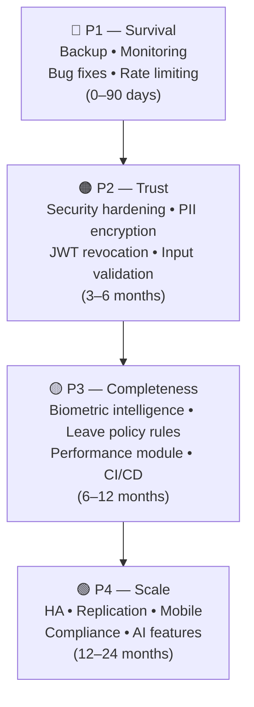
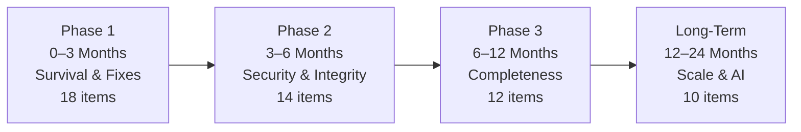
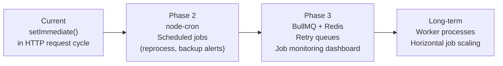
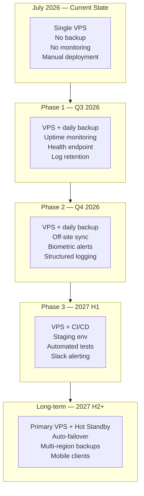
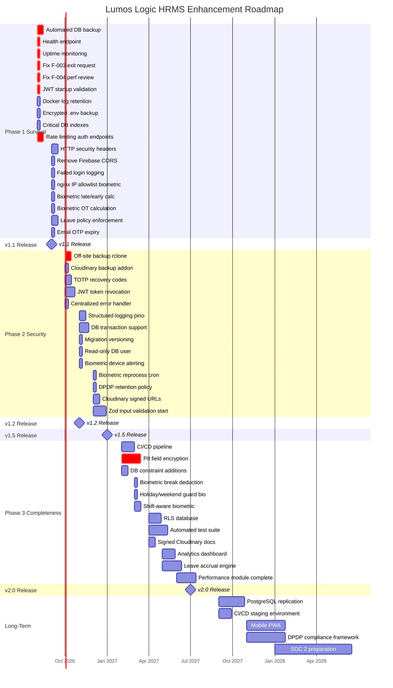

# 10 — Future Enhancement Roadmap
## Lumos Logic HRMS — Enterprise Product Evolution & Future Enhancement Roadmap

---

**Document Version:** 1.0
**Prepared By:** Lumos Logic
**Date:** July 2026
**Classification:** Confidential — Product, Engineering, and Leadership Distribution
**Audience:** Product Managers, Backend Developers, Frontend Developers, DevOps Engineers, Management

> **Methodology:** Every item in this roadmap is derived directly from the findings of Documents 01–09 of this implementation suite. No generic HRMS features are recommended. Every enhancement references a specific gap, security finding, database limitation, biometric constraint, or architectural decision documented elsewhere. Cross-references to source documents are included for traceability.

---

## Table of Contents

1. [Executive Summary](#1-executive-summary)
2. [Current State Assessment](#2-current-state-assessment)
3. [Product Roadmap](#3-product-roadmap)
4. [Technical Roadmap](#4-technical-roadmap)
5. [Product Improvements](#5-product-improvements)
6. [Scalability Roadmap](#6-scalability-roadmap)
7. [Security Roadmap](#7-security-roadmap)
8. [Infrastructure Roadmap](#8-infrastructure-roadmap)
9. [Risk Analysis](#9-risk-analysis)
10. [Recommended Release Plan](#10-recommended-release-plan)
- [Appendix A — Overall Roadmap Timeline (Mermaid Gantt)](#appendix-a--overall-roadmap-timeline)
- [Appendix B — Feature Priority Matrix](#appendix-b--feature-priority-matrix)
- [Appendix C — Business Value Matrix](#appendix-c--business-value-matrix)
- [Appendix D — Technical Debt Matrix](#appendix-d--technical-debt-matrix)
- [Appendix E — Release Calendar](#appendix-e--release-calendar)
- [Appendix F — Final Recommendations](#appendix-f--final-recommendations)
- [Appendix G — Document Summary](#appendix-g--document-summary)

---

# 1. Executive Summary

### 1.1 Vision

Lumos Logic HRMS will evolve from a functional but operationally fragile single-server deployment into a secure, observable, resilient SaaS HR platform that can serve enterprise-grade clients with confidence. This means closing the gap between feature breadth — which is already substantial — and operational depth: security hardening, data protection, automated backup, platform monitoring, and production-grade reliability.

The vision is not to build more features. It is to make the existing features trustworthy.

### 1.2 Current Product Maturity

As of July 2026, the HRMS has wide functional coverage across 16+ HR modules, a working multi-tenant architecture, biometric device integration, a feature flag system, and a platform admin console. The application works. Users are active. Enterprise clients are live.

The maturity gaps are not in feature count — they are in:
1. **Operational safety** — No backup, no monitoring, no DR automation
2. **Security hardening** — No rate limiting, PII in plaintext, no security headers
3. **Data integrity** — No transactions, missing database constraints
4. **Module completeness** — Several modules have broken routes or unenforced business rules
5. **Biometric completeness** — Late/early detection, OT calculation, and monitoring gaps

### 1.3 Strategic Goals

| Goal | Horizon | Primary Documents |
|---|---|---|
| Eliminate critical data loss risk | 0–30 days | Doc 05, Doc 07 |
| Close all Critical and High security vulnerabilities | 0–90 days | Doc 06, Doc 04 |
| Fix all broken module routes (bugs) | 0–60 days | Doc 04 |
| Add production monitoring and alerting | 0–90 days | Doc 07, Doc 09 |
| Complete biometric attendance intelligence | 3–6 months | Doc 09 |
| Achieve enterprise-grade security posture | 3–9 months | Doc 06, Doc 08 |
| Build CI/CD pipeline and test coverage | 6–12 months | Doc 07 |
| Prepare for horizontal scaling and HA | 12–24 months | Doc 02, Doc 07 |

### 1.4 Business Priorities

---

# 2. Current State Assessment

### 2.1 Implemented Modules

| Module | Status | Quality | Notes |
|---|---|---|---|
| Authentication (Login/TOTP/Reset) | ✅ Implemented | B+ | Missing: rate limiting, JWT revocation |
| Multi-tenancy (org isolation) | ✅ Implemented | A- | App-level only; no RLS |
| Employee Management | ✅ Implemented | B | Profile V2 comprehensive; email uniqueness not DB-enforced |
| Attendance (manual) | ✅ Implemented | B+ | Break tracking, late/early detection all work |
| Leave Management | ✅ Implemented | B | Policy rules exist in DB but not enforced in code |
| Payroll | ✅ Implemented | B | Payslip generation works; LOP calculation correct |
| Biometric Integration | ✅ Implemented | C+ | Core works; late/early/OT not computed from bio path |
| Feature Flags | ✅ Implemented | A | Per-org feature gating at middleware level |
| Platform Admin | ✅ Implemented | B | Org approval flow; feature management |
| Announcements | ✅ Implemented | B | |
| Documents | ✅ Implemented | B | Visibility system works; Cloudinary URLs public |
| Assets | ✅ Implemented | B | Basic CRUD; assignment tracking |
| Expenses | ✅ Implemented | B | Approval workflow works |
| Notifications (in-app + push) | ✅ Implemented | B | Push subscription exists; push delivery works |
| Google Calendar Integration | ✅ Implemented | B | Leave sync works; optional per org |
| Shifts & Roster | ✅ Implemented | B | Basic assignment; not integrated with biometric |
| Holidays | ✅ Implemented | A | Calendar display works |
| Departments & Designations | ✅ Implemented | A | Multi-department junction table |
| Exit Management | ⚠️ Broken | D | Employee self-submit blocked by wrong middleware (F-003) |
| Performance Management | ⚠️ Broken | D | Self-assessment blocked by wrong middleware (F-004) |
| Onboarding Checklists | ✅ Implemented | C | Basic; no automation |
| Regularization (attendance correction) | ✅ Implemented | B | Request + approval flow |
| Reports | ✅ Implemented | B | Generated on-demand; no export scheduling |
| Branches | ✅ Implemented | B | For enterprise clients only |

### 2.2 Partially Implemented Modules

| Module | What Works | What Is Missing |
|---|---|---|
| Leave Policies | Policy rules stored in DB | Rules not read/enforced during leave application (F-011) |
| Biometric (late/early) | Check-in/out attendance created | `is_late`, `late_minutes`, `is_early_exit`, `early_exit_minutes` not computed from biometric path |
| Biometric (OT) | `ot_hours` column exists | Not auto-calculated from biometric |
| Employee Email Verification | OTP generation + verification works | No expiry on OTP code (F-015) |
| TOTP 2FA | Enrollment + login verification works | No recovery codes if phone is lost |
| Payroll (attendance linkage) | Attendance data used for LOP | Break-based deduction not integrated |
| Clockify | Table + columns remain | Integration removed July 2026; residual references safe no-ops |

### 2.3 Missing Capabilities

| Capability | Business Impact | Source |
|---|---|---|
| Automated database backup | **Critical** — Total data loss on VPS failure | Doc 05 |
| Production monitoring | **High** — Outages undetected | Doc 07, Doc 09 |
| CI/CD pipeline | **High** — Manual deployments are fragile | Doc 04 |
| Rate limiting on auth endpoints | **High** — Brute-force vulnerability | Doc 06, F-002 |
| HTTP security headers | **Medium** — Clickjacking, XSS exposure | Doc 06, V-005 |
| JWT token revocation | **High** — Terminated employees retain 7-day access | Doc 06, F-006 |
| PII field encryption | **High** — Aadhar/PAN/bank in plaintext | Doc 06, F-008 |
| Input validation (Zod/Joi) | **Medium** — Type confusion, corrupt data | Doc 04, F-009 |
| RLS on database | **Medium** — App-only isolation | Doc 08 |
| Health endpoint | **Medium** — Can't monitor without it | Doc 04, F-012 |
| Biometric device offline alerting | **Medium** — Silent attendance gaps | Doc 09 |
| Leave policy rule enforcement | **Medium** — Policies exist but do nothing | Doc 04, F-011 |
| TOTP recovery codes | **Medium** — Users locked out on phone loss | Doc 06 |
| Email OTP expiry | **Low** — OTP valid forever | Doc 04, F-015 |
| Off-site backup sync | **Critical** — Local backup not sufficient | Doc 05 |

### 2.4 Technical Debt

| Debt Item | Severity | Effort to Fix | Source |
|---|---|---|---|
| No transaction support in DB adapter | High | Medium | Doc 08 |
| No migration versioning tool | Medium | Low | Doc 08 |
| Legacy Firebase CORS origins still active | Medium | Low | Doc 04, F-010 |
| JWT secret hardcoded fallback in code | Critical | Low | Doc 04, F-005 |
| Database errors exposed in API responses | Medium | Low | Doc 06 |
| `biometric_raw_logs` grows unbounded | Medium | Medium | Doc 09 |
| `org_id` vs `organization_id` naming inconsistency (biometric tables) | Low | Low | Doc 08, Doc 09 |
| Clockify residual code and columns | Low | Low | Doc 02 |
| Missing DB indexes on high-traffic tables | High | Low | Doc 08 |
| CORS package installed but custom handler used | Low | Low | Doc 06 |
| No structured logging (console.error only) | Medium | Medium | Doc 06 |
| Single DB user with full privileges | Medium | Low | Doc 08 |

### 2.5 Operational Gaps

| Gap | Risk | Source |
|---|---|---|
| No automated database backup | Total data loss on failure | Doc 05 |
| No off-site backup | Single VPS = single point of failure | Doc 05 |
| No uptime monitoring | Hours to detect outage | Doc 07 |
| No health endpoint | Cannot auto-recover | Doc 04 |
| No biometric device offline alerting | Silent attendance gaps | Doc 09 |
| No container log retention | Post-incident debugging impossible | Doc 06 |
| No slow query logging | Performance regressions undetected | Doc 08 |
| Manual deployments | Human error risk | Doc 04 |
| No pre-deployment testing | Regressions reach production | Doc 04 |

### 2.6 Overall Maturity Matrix

| Dimension | Current Grade | Target Grade | Gap |
|---|---|---|---|
| Feature breadth | B+ | A | Add missing capabilities |
| Feature depth (rules enforced) | C | B+ | Enforce leave policies, biometric flags |
| Security | C- | B+ | Multiple critical gaps |
| Data protection | D | B | PII encryption, RLS |
| Operational reliability | D | B | Backup, monitoring, CI/CD |
| Biometric completeness | C+ | B+ | Late/early/OT/monitoring |
| Database integrity | C+ | B | Transactions, constraints, indexes |
| Developer experience | C | B | Migration versioning, validation, logging |
| **Overall** | **C** | **B+** | **Focused 12-month effort** |

---

# 3. Product Roadmap

### Phase Overview

---

## Phase 1 — Survival and Fixes (0–3 Months)

**Theme:** Close the gaps that pose existential risk to the platform — data loss, broken modules, undetected outages, and authentication vulnerabilities.

---

**P1-01 — Automated Database Backup**

| Property | Value |
|---|---|
| **Description** | Deploy `backup-db.sh` from Document 05 on the VPS; configure daily cron at 02:00 IST; configure rclone for off-site sync |
| **Business Value** | Without this, any VPS hardware failure causes complete and permanent loss of all client HR data |
| **Technical Value** | Establishes RPO = 24h; provides restore capability; unlocks DR testing |
| **Dependencies** | VPS SSH access; rclone installation; off-site storage account (Backblaze B2 or AWS S3) |
| **Estimated Complexity** | Low (scripts provided in Document 05) |
| **Priority** | P1 — Critical |
| **Timeline** | Week 1 |
| **Risks** | cron misconfiguration; off-site storage credentials not rotated |
| **Success Criteria** | Daily backup files appearing in `/opt/backups/lumos-hrms/db/`; backup integrity verified; off-site sync confirmed |
| **Ref** | Doc 05, Doc 07 |

---

**P1-02 — Uptime Monitoring (Uptime Robot)**

| Property | Value |
|---|---|
| **Description** | Register HRMS at Uptime Robot (free tier); monitor `https://hrms.lumoslogic.com` every 5 minutes; alert via email within 5 minutes of downtime |
| **Business Value** | Current detection time is "when a user reports it" — typically 30–120 minutes. This reduces to 5 minutes |
| **Technical Value** | Enables measurable uptime SLA; feeds into SLA reporting for enterprise clients |
| **Dependencies** | Health endpoint (P1-03); Uptime Robot account |
| **Estimated Complexity** | Low (15-minute setup) |
| **Priority** | P1 — Critical |
| **Timeline** | Week 1 |
| **Risks** | Free tier has 1 monitor; need paid plan for SMS alerts |
| **Success Criteria** | Alert email received within 5 minutes of simulated downtime |
| **Ref** | Doc 07 Section 14, Doc 06 Section 12 |

---

**P1-03 — Health Endpoint (GET /health)**

| Property | Value |
|---|---|
| **Description** | Add `GET /health` endpoint returning `{status: "ok", db: "connected", timestamp}` — or `{status: "error", db: "disconnected"}` with HTTP 503 |
| **Business Value** | Required for uptime monitoring; required for Docker health checks; enables automated recovery confirmation after incidents |
| **Technical Value** | Docker `depends_on: condition: service_healthy` can be wired to this; load balancers use it for health-based routing |
| **Dependencies** | None |
| **Estimated Complexity** | Low (< 30 minutes) |
| **Priority** | P1 — Critical |
| **Timeline** | Week 1 |
| **Risks** | None |
| **Success Criteria** | `curl https://hrms.lumoslogic.com/health` returns `{"status":"ok","db":"connected"}` |
| **Ref** | Doc 04 F-012, Doc 07 |

---

**P1-04 — Fix Exit Request Self-Submission (F-003)**

| Property | Value |
|---|---|
| **Description** | Remove `adminOnly` from `POST /api/exit`; allow employees to submit their own resignation; keep admin able to submit on behalf of others |
| **Business Value** | The Exit Management module is completely non-functional for employees in the portal — a visible product failure |
| **Technical Value** | One-line middleware change; handler logic already supports employee self-submission |
| **Dependencies** | None |
| **Estimated Complexity** | Low |
| **Priority** | P1 — Critical |
| **Timeline** | Week 1 |
| **Risks** | None — change is isolated |
| **Success Criteria** | Employee can submit exit request from `/portal/exit`; HR can view and approve |
| **Ref** | Doc 04 F-003 |

---

**P1-05 — Fix Performance Review Self-Assessment (F-004)**

| Property | Value |
|---|---|
| **Description** | Remove `adminOnly` from `PUT /api/performance/reviews/:id`; employees can update `self_rating` and `self_comments` on their own review; admin-only fields remain protected via in-handler logic that already exists |
| **Business Value** | Performance Management self-assessment is non-functional — the module appears broken to HR teams using it |
| **Technical Value** | Handler already has the bifurcation logic; only the middleware guard needs changing |
| **Dependencies** | None |
| **Estimated Complexity** | Low |
| **Priority** | P1 — Critical |
| **Timeline** | Week 1 |
| **Risks** | Must add `eq('user_id', req.user.id)` guard to prevent employees editing other reviews |
| **Success Criteria** | Employee can submit self-rating on own review; cannot edit manager ratings |
| **Ref** | Doc 04 F-004 |

---

**P1-06 — JWT Secret Startup Validation (F-005)**

| Property | Value |
|---|---|
| **Description** | Replace `process.env.JWT_SECRET \|\| 'leave-tracker-secret-2026'` with a hard fail: if `JWT_SECRET` is not set or is < 32 chars, log fatal error and call `process.exit(1)` |
| **Business Value** | Prevents production deployments with a publicly known JWT secret that allows token forgery |
| **Technical Value** | Single-line change in `auth.js`; eliminates V-002 from Doc 06 vulnerability register |
| **Dependencies** | `.env` must have `JWT_SECRET` set (verify before deploying this change) |
| **Estimated Complexity** | Low |
| **Priority** | P1 — Critical |
| **Timeline** | Week 1 |
| **Risks** | Will crash app on startup if `JWT_SECRET` missing from `.env` — this is intentional and correct behavior |
| **Success Criteria** | App refuses to start without `JWT_SECRET`; all existing JWTs issued with correct secret continue to work |
| **Ref** | Doc 04 F-005, Doc 06 V-002 |

---

**P1-07 — Rate Limiting on Authentication Endpoints (F-002)**

| Property | Value |
|---|---|
| **Description** | Install `express-rate-limit`; apply 10 req/15 min/IP on `/login`; 5 req/60 min/IP on `/forgot-password`; 5 req/5 min on `/totp/verify-login` |
| **Business Value** | Without this, credential brute-force attacks and email flooding have zero resistance |
| **Technical Value** | `express-rate-limit` is zero-infrastructure; in-memory store suitable at current scale |
| **Dependencies** | None |
| **Estimated Complexity** | Low |
| **Priority** | P1 — Critical |
| **Timeline** | Week 2 |
| **Risks** | May affect integration tests — add bypass for test environments |
| **Success Criteria** | 11th login attempt within 15 minutes returns 429 with correct error message |
| **Ref** | Doc 04 F-002, Doc 06 V-001 |

---

**P1-08 — HTTP Security Headers (Helmet.js)**

| Property | Value |
|---|---|
| **Description** | Install `helmet`; add `app.use(helmet())` to `server.js`; configure CSP to allow Cloudinary image sources and self-hosted scripts |
| **Business Value** | Sets `X-Frame-Options`, `Content-Security-Policy`, `HSTS`, `X-Content-Type-Options` — blocks common browser-level attacks |
| **Technical Value** | Single middleware call; eliminates V-005 from Doc 06 vulnerability register |
| **Dependencies** | None |
| **Estimated Complexity** | Low (with CSP tuning: medium) |
| **Priority** | P1 — High |
| **Timeline** | Week 2 |
| **Risks** | Strict CSP may break inline scripts or Cloudinary image loading — requires testing in dev first |
| **Success Criteria** | Security header scanner (securityheaders.com) returns A grade |
| **Ref** | Doc 06 V-005 |

---

**P1-09 — Remove Legacy Firebase CORS Origins (F-010)**

| Property | Value |
|---|---|
| **Description** | Remove the 4 Firebase domains from `ALLOWED_ORIGINS` in `auth.js`; keep only `hrms.lumoslogic.com`, `localhost:5173`, `localhost:5174`, `localhost:3000` |
| **Business Value** | Eliminates cross-origin access from abandoned Firebase projects; reduces attack surface |
| **Technical Value** | 4-line deletion; eliminates V-008/V-018 from Doc 06 |
| **Dependencies** | Confirm no active traffic comes from Firebase domains (check nginx access logs) |
| **Estimated Complexity** | Low |
| **Priority** | P1 — High |
| **Timeline** | Week 2 |
| **Risks** | None — these domains are defunct |
| **Success Criteria** | CORS request from Firebase domain returns 403; existing production traffic unaffected |
| **Ref** | Doc 04 F-010, Doc 06 V-008 |

---

**P1-10 — Log Failed Login Attempts**

| Property | Value |
|---|---|
| **Description** | In `auth.routes.js` login handler, insert a `login_history` row with `status: 'failed'` before returning the 401 response — when a target user is identified |
| **Business Value** | Currently, unlimited attacks leave no trace. HR and security teams need visibility into credential attacks |
| **Technical Value** | Enables future brute-force detection queries; feeds into audit trail; eliminates V-009 from Doc 06 |
| **Dependencies** | None |
| **Estimated Complexity** | Low |
| **Priority** | P1 — High |
| **Timeline** | Week 2 |
| **Risks** | None |
| **Success Criteria** | Failed login attempt appears in `login_history` with `status='failed'` |
| **Ref** | Doc 06 V-009, Doc 06 Section 11 |

---

**P1-11 — Docker Log Retention**

| Property | Value |
|---|---|
| **Description** | Add JSON-file logging driver config to `docker-compose.yml`: `max-size: "50m"`, `max-file: "10"` for both containers |
| **Business Value** | Currently logs are ephemeral — post-incident debugging requires log reconstruction from memory |
| **Technical Value** | 5 lines in `docker-compose.yml`; 500MB total log retention; searchable with `grep` on VPS |
| **Dependencies** | None |
| **Estimated Complexity** | Low |
| **Priority** | P1 — High |
| **Timeline** | Week 2 |
| **Risks** | Adds ~500MB disk usage — verify disk space |
| **Success Criteria** | `docker compose logs lumos_app --since 7d` returns entries from 7 days ago |
| **Ref** | Doc 06 Section 12, Doc 07 Section 14 |

---

**P1-12 — Critical Database Indexes**

| Property | Value |
|---|---|
| **Description** | Add three missing indexes that affect daily operations: `idx_attendance_org_date ON attendance(organization_id, date)`; `idx_leaves_org_status_dates ON leaves(organization_id, status, start_date, end_date)`; `idx_payslips_org_year_month ON payslips(organization_id, year, month)` |
| **Business Value** | Prevents daily attendance page and payroll generation from becoming slow as data grows |
| **Technical Value** | Three `CREATE INDEX IF NOT EXISTS` statements; zero downtime; immediate query plan improvement |
| **Dependencies** | None |
| **Estimated Complexity** | Low |
| **Priority** | P1 — High |
| **Timeline** | Week 2 |
| **Risks** | Index creation may briefly lock table on small PostgreSQL versions — use `CONCURRENTLY` flag |
| **Success Criteria** | `EXPLAIN ANALYZE` on attendance date-range query shows `Index Scan` instead of `Seq Scan` |
| **Ref** | Doc 08 Section 8.2 |

---

**P1-13 — nginx IP Allowlisting for Biometric ADMS Endpoint**

| Property | Value |
|---|---|
| **Description** | Add `allow/deny` block in nginx for `/iclock/` location; allow only known ZKTeco device IP addresses; deny all others |
| **Business Value** | Currently, anyone who knows the endpoint URL can inject fake attendance punches — an immediate payroll fraud risk |
| **Technical Value** | nginx config change; no application code change needed |
| **Dependencies** | All ZKTeco devices must have static IP addresses assigned |
| **Estimated Complexity** | Low |
| **Priority** | P1 — High |
| **Timeline** | Week 3 |
| **Risks** | Device IP changes (DHCP) will break biometric sync — requires static IPs on all devices first |
| **Success Criteria** | Curl from non-allowlisted IP returns 403; device punches still process correctly |
| **Ref** | Doc 04 F-007, Doc 09 Section 10.2 |

---

**P1-14 — Biometric Late Arrival and Early Exit Calculation**

| Property | Value |
|---|---|
| **Description** | In `biometricPush.handler.js`, after creating check-in attendance, query `work_schedule` for `late_threshold`; compute and set `is_late` and `late_minutes`. After checkout, compute and set `is_early_exit` and `early_exit_minutes`. |
| **Business Value** | HR cannot currently distinguish on-time vs late arrivals from biometric attendance — a core attendance management gap |
| **Technical Value** | Parity with the manual check-in path which already implements this logic |
| **Dependencies** | `work_schedule` table must have entries for the org |
| **Estimated Complexity** | Low |
| **Priority** | P1 — High |
| **Timeline** | Week 3 |
| **Risks** | If org has no `work_schedule` row, calculation is skipped gracefully |
| **Success Criteria** | Employee arriving at 09:15 (threshold 09:00) shows `is_late=true`, `late_minutes=15` in attendance record |
| **Ref** | Doc 09 Section 6.2, Section 6.3 |

---

**P1-15 — Encrypted .env Backup**

| Property | Value |
|---|---|
| **Description** | Create encrypted backup of `/opt/lumos-hrms/.env` using AES-256-CBC; store to off-site storage; automate with weekly cron |
| **Business Value** | `.env` contains all credentials — if lost, service cannot start and all third-party integrations must be reconfigured from scratch |
| **Technical Value** | OpenSSL command; 30-minute implementation; eliminates a complete service-block scenario |
| **Dependencies** | Off-site storage (P1-01) must be configured first |
| **Estimated Complexity** | Low |
| **Priority** | P1 — High |
| **Timeline** | Week 2 |
| **Risks** | Encryption key must be stored separately; losing the key = losing the backup |
| **Success Criteria** | Encrypted `.env` file in off-site storage; test decryption confirms file is intact |
| **Ref** | Doc 05 Section 6.5, Doc 07 Section 4.10 |

---

**P1-16 — Leave Policy Rule Enforcement (F-011)**

| Property | Value |
|---|---|
| **Description** | In `leaves.routes.js` POST handler, read the applicable `leave_policy` row for the leave type; enforce `min_notice_days`, `max_consecutive_days`, `half_day_allowed`, and `requires_approval` before allowing submission |
| **Business Value** | Leave policies exist in the database but are completely ignored — any employee can bypass configured rules |
| **Technical Value** | Data model is complete; only application logic is missing |
| **Dependencies** | `leave_policies` table must be populated per organization |
| **Estimated Complexity** | Medium |
| **Priority** | P1 — High |
| **Timeline** | Weeks 3–4 |
| **Risks** | May reject leave applications that were previously allowed — communicate to HR before deploying |
| **Success Criteria** | Leave application violating `min_notice_days` returns appropriate error; policy enforcement visible in employee portal |
| **Ref** | Doc 04 F-011 |

---

**P1-17 — Email OTP Expiry (F-015)**

| Property | Value |
|---|---|
| **Description** | Add `email_verify_expires TIMESTAMPTZ` column to `users`; set 15-minute expiry on OTP generation; reject codes older than 15 minutes on verification |
| **Business Value** | Currently, email verification codes never expire — a security code active for months is no longer meaningful |
| **Technical Value** | One column + two code changes; eliminates V-015 from Doc 06 |
| **Dependencies** | None |
| **Estimated Complexity** | Low |
| **Priority** | P1 — Medium |
| **Timeline** | Week 3 |
| **Risks** | Users who requested OTP before this change will find their code expired after upgrade |
| **Success Criteria** | OTP older than 15 minutes returns "Code expired" error; fresh OTP works correctly |
| **Ref** | Doc 06 V-015, Doc 04 F-015 |

---

**P1-18 — Biometric OT Hours Calculation**

| Property | Value |
|---|---|
| **Description** | In biometric checkout processing, if `gross_hours > work_hours_per_day` (default 8), compute `ot_hours = gross_hours - work_hours_per_day` and set on attendance record; respect `users.ot_applicable` flag |
| **Business Value** | Enterprise clients (Sanghavi) need OT tracking for payroll calculation — column exists but is always 0 |
| **Technical Value** | Simple calculation; feeds existing `payroll.ot_rate` × `ot_hours` payroll component |
| **Dependencies** | Biometric checkout working (already done) |
| **Estimated Complexity** | Low |
| **Priority** | P1 — Medium |
| **Timeline** | Week 3 |
| **Risks** | Must respect `ot_applicable=false` employees (skip OT calc) |
| **Success Criteria** | Employee working 9h shows `ot_hours=1` (assuming 8h standard); `ot_applicable=false` employee shows 0 |
| **Ref** | Doc 09 Section 6.5 |

---

## Phase 2 — Security and Integrity (3–6 Months)

**Theme:** Move from a functional-but-fragile system to one that meets enterprise security expectations. Close all High-severity security findings. Establish data integrity safeguards.

---

**P2-01 — JWT Token Revocation (token_version)**

| Property | Value |
|---|---|
| **Description** | Add `token_version INTEGER DEFAULT 1` to `users`; embed in JWT payload; verify on each request; increment on password change, deactivation, or admin-forced logout |
| **Business Value** | Terminated employees currently retain full HRMS access for up to 7 days after deactivation — a compliance and security risk |
| **Technical Value** | Eliminates V-004; enables true session management; one DB query per authenticated request (acceptable at scale) |
| **Dependencies** | All existing tokens become invalid after the version column is checked — coordinate rollout |
| **Estimated Complexity** | Medium |
| **Priority** | P2 — High |
| **Timeline** | Month 3–4 |
| **Risks** | Breaking change — all logged-in users must re-authenticate on upgrade weekend |
| **Success Criteria** | Deactivating a user immediately prevents their token from working on next API call |
| **Ref** | Doc 04 F-006, Doc 06 V-004 |

---

**P2-02 — TOTP Recovery Codes**

| Property | Value |
|---|---|
| **Description** | At TOTP enrollment, generate 8 single-use recovery codes; store as bcrypt hashes in a new `totp_recovery_codes` table; allow one code to substitute for TOTP at login; mark code as used |
| **Business Value** | Currently if a user loses their authenticator app, an admin must manually clear `totp_enabled` in the database — a support burden and a security gap |
| **Technical Value** | Recovery code table is minimal; the auth flow extension is straightforward |
| **Dependencies** | TOTP enrollment endpoint |
| **Estimated Complexity** | Medium |
| **Priority** | P2 — High |
| **Timeline** | Month 3 |
| **Risks** | Recovery codes must be shown to user only once at enrollment — cannot be regenerated without re-enrollment |
| **Success Criteria** | User with lost phone can authenticate using recovery code; code is marked used and cannot be reused |
| **Ref** | Doc 06 V-011 |

---

**P2-03 — PII Field Encryption (Aadhar, PAN, Bank Account)**

| Property | Value |
|---|---|
| **Description** | Implement AES-256-GCM application-layer encryption for `aadhar_no`, `pan_number`, `uan_no`, `voter_id` on `users`, and `account_number` on `employee_bank_accounts`; encrypt on write, decrypt on read |
| **Business Value** | These fields are government-regulated PII under the IT Act 2000 and DPDP Act 2023 — plaintext storage is a statutory compliance failure |
| **Technical Value** | Encryption at application layer; database stores ciphertext; key in `FIELD_ENCRYPTION_KEY` env var |
| **Dependencies** | `FIELD_ENCRYPTION_KEY` must be added to `.env` and backed up; one-time data migration to encrypt existing values |
| **Estimated Complexity** | High |
| **Priority** | P2 — High |
| **Timeline** | Month 4–5 |
| **Risks** | **One-time irreversible data migration** — plan with full backup; coordinate read/write cipher deployment |
| **Success Criteria** | `SELECT aadhar_no FROM users WHERE id=42` returns encrypted blob; decrypted value appears correctly in API response |
| **Ref** | Doc 06 V-003, F-008, Doc 08 Section 9.3 |

---

**P2-04 — Input Validation Library (Zod)**

| Property | Value |
|---|---|
| **Description** | Install `zod`; create a `validate(schema)` middleware factory; progressively apply schemas to POST/PUT endpoints starting with: `/login`, `/employees` (create/update), `/leaves` (create), `/payslips` (generate) |
| **Business Value** | Invalid data currently silently corrupts records; missing validation enables type confusion that reaches the database |
| **Technical Value** | Eliminates F-009; provides type safety at API boundary; consistent 400 error format |
| **Dependencies** | None |
| **Estimated Complexity** | High (large surface area) |
| **Priority** | P2 — High |
| **Timeline** | Month 3–6 (progressive) |
| **Risks** | May cause previously-accepted invalid requests to fail — coordinate with HR team on any edge cases |
| **Success Criteria** | Sending `leave_type: 12345` to POST /api/leaves returns 400 with schema validation error |
| **Ref** | Doc 04 F-009, Doc 06 V-013 |

---

**P2-05 — Database Transaction Support**

| Property | Value |
|---|---|
| **Description** | Add a `transaction(callback)` helper to `db-pg-adapter.js` using `pool.connect()` + `BEGIN/COMMIT/ROLLBACK`; apply to multi-step operations: employee creation (user + departments), payslip generation, leave approval (leave + attendance) |
| **Business Value** | Partial failures currently leave orphaned records (user created but no departments) — data inconsistency visible to HR |
| **Technical Value** | Eliminates the primary database integrity gap; adapter already exports `pool` for direct use |
| **Dependencies** | None |
| **Estimated Complexity** | Medium |
| **Priority** | P2 — High |
| **Timeline** | Month 4 |
| **Risks** | Transactions that time out (> 30s) leave open connections — must ensure all transactions complete or roll back within statement_timeout |
| **Success Criteria** | If department assignment fails during employee creation, no user record is left in the database |
| **Ref** | Doc 08 Section 5.3 |

---

**P2-06 — Centralized Error Handler**

| Property | Value |
|---|---|
| **Description** | Add Express error-handling middleware `(err, req, res, next)` at the end of `server.js`; map PostgreSQL error codes to user-friendly messages; never expose raw `err.message` (which contains table/column names) to clients |
| **Business Value** | Currently `{error: err.message}` exposes internal schema information to any user who triggers a 500 |
| **Technical Value** | Single middleware replaces dozens of `catch (err) { res.status(500).json({ error: err.message }) }` blocks |
| **Dependencies** | None |
| **Estimated Complexity** | Medium |
| **Priority** | P2 — Medium |
| **Timeline** | Month 3 |
| **Risks** | May suppress useful debug information — ensure server-side logging still captures full error detail |
| **Success Criteria** | 500 responses return `{ error: "Internal server error" }` instead of PostgreSQL error text |
| **Ref** | Doc 06 V-014 |

---

**P2-07 — Off-Site Backup Sync (rclone)**

| Property | Value |
|---|---|
| **Description** | Configure `rclone` with Backblaze B2 or AWS S3; add sync step to `backup-db.sh`; verify off-site copy with `rclone ls` after each backup |
| **Business Value** | Local backup on same VPS is not sufficient — VPS hardware failure destroys both production data and local backups |
| **Technical Value** | rclone is free and open-source; one-time setup; reduces data loss scenario to only post-backup data |
| **Dependencies** | P1-01 (local backup) must be working first |
| **Estimated Complexity** | Low |
| **Priority** | P2 — Critical |
| **Timeline** | Month 3 |
| **Risks** | Off-site storage credentials must be backed up separately |
| **Success Criteria** | `rclone ls lumos-backup:lumos-hrms-backups/db/` shows daily backup files; each file accessible from a different machine |
| **Ref** | Doc 05 Section 5.3 |

---

**P2-08 — Structured Logging (pino)**

| Property | Value |
|---|---|
| **Description** | Replace all `console.error` / `console.log` calls with `pino` JSON-structured logging; include `request_id`, `user_id`, `organization_id`, and `duration_ms` on every API request |
| **Business Value** | Currently, logs are plain text and unqueryable — incident analysis requires reading raw Docker output |
| **Technical Value** | pino is extremely fast (async logging); JSON format is grep-able and ingest-able into any log aggregator |
| **Dependencies** | Docker log retention (P1-11) must be in place |
| **Estimated Complexity** | Medium |
| **Priority** | P2 — Medium |
| **Timeline** | Month 4–5 |
| **Risks** | High volume of log output — ensure log rotation settings are appropriate |
| **Success Criteria** | `docker compose logs lumos_app | jq '.level'` shows structured JSON; error events include context (user, org, route) |
| **Ref** | Doc 06 Section 12, Doc 07 |

---

**P2-09 — Migration Versioning Table**

| Property | Value |
|---|---|
| **Description** | Create a simple `schema_migrations(version TEXT, applied_at TIMESTAMPTZ)` table; update each migration to INSERT its version on completion; add a pre-migration check script |
| **Business Value** | Currently there is no way to know which migrations have been applied to any given environment — critical for multi-client deployment |
| **Technical Value** | 15-minute implementation; eliminates a major operational risk for future migrations |
| **Dependencies** | None |
| **Estimated Complexity** | Low |
| **Priority** | P2 — Medium |
| **Timeline** | Month 3 |
| **Risks** | Backfill existing migrations with approximate dates |
| **Success Criteria** | `SELECT * FROM schema_migrations ORDER BY applied_at` shows all applied migrations with dates |
| **Ref** | Doc 08 Section 7.4 |

---

**P2-10 — Read-Only PostgreSQL User**

| Property | Value |
|---|---|
| **Description** | Create `lumos_reader` PostgreSQL role with `SELECT` only on all tables; use this user for report generation, analytics, and any ad-hoc data queries |
| **Business Value** | Any reporting query currently has write privileges — a mistake in a custom query can delete data |
| **Technical Value** | PostgreSQL native role; environment variable `DB_READER_PASSWORD`; zero code change for write operations |
| **Dependencies** | None |
| **Estimated Complexity** | Low |
| **Priority** | P2 — Medium |
| **Timeline** | Month 3 |
| **Risks** | Report routes must be updated to use the reader connection; requires testing |
| **Success Criteria** | `psql -U lumos_reader -c "DELETE FROM users WHERE id=1"` returns `ERROR: permission denied` |
| **Ref** | Doc 08 Section 9.4 |

---

**P2-11 — Biometric Device Offline Alerting**

| Property | Value |
|---|---|
| **Description** | Add a scheduled cron job (every 30 minutes) that checks `biometric_devices.last_seen`; if any device is offline for > 30 minutes, send an email alert to the HR administrator |
| **Business Value** | Silent device failures cause attendance gaps for entire office branches — discovered only at end of day |
| **Technical Value** | Uses existing `emailService.js` + `pg pool.query` — no new infrastructure needed |
| **Dependencies** | Cron infrastructure; SMTP working |
| **Estimated Complexity** | Low |
| **Priority** | P2 — High |
| **Timeline** | Month 3 |
| **Risks** | Alert emails during planned maintenance (device IP change, firmware update) may cause confusion — add acknowledgment mechanism |
| **Success Criteria** | Email received within 35 minutes of device going offline |
| **Ref** | Doc 09 Section 9, BIO-R002 |

---

**P2-12 — Automated Biometric Reprocess Job**

| Property | Value |
|---|---|
| **Description** | Add a cron job (every hour) that queries `biometric_raw_logs` for `processed=false` logs older than 30 minutes; attempts to reprocess each unique `employee_pin` that now has a mapping |
| **Business Value** | Currently, unmapped PIN punches require manual admin intervention — attendance gaps are silently building |
| **Technical Value** | Reuses the existing `processAttlogLine` logic; runs in background |
| **Dependencies** | `node-cron` or `node-schedule` already available in project |
| **Estimated Complexity** | Medium |
| **Priority** | P2 — Medium |
| **Timeline** | Month 4 |
| **Risks** | High volume of unprocessed logs may cause a slow first run — add batch size limit |
| **Success Criteria** | Zero unprocessed logs older than 90 minutes in normal operation |
| **Ref** | Doc 09 Section 9.1, BIO-R011 |

---

**P2-13 — Biometric DPDP Data Retention Policy**

| Property | Value |
|---|---|
| **Description** | Implement monthly archival: move `biometric_raw_logs` rows older than 12 months (where `processed=TRUE`) to the `archives` table; add a scheduled cron trigger |
| **Business Value** | `biometric_raw_logs` grows indefinitely; DPDP Act 2023 compliance requires defined data retention limits for biometric data |
| **Technical Value** | Uses existing `archives` table; scheduled via cron |
| **Dependencies** | Archival script; admin approval for retention period |
| **Estimated Complexity** | Low |
| **Priority** | P2 — High |
| **Timeline** | Month 4 |
| **Risks** | Archived data cannot be efficiently queried — verify operational queries don't need > 12-month history |
| **Success Criteria** | Monthly: processed logs > 12 months old move to archives; `biometric_raw_logs` size stabilizes |
| **Ref** | Doc 09 Section 10.5, Doc 09 BIO-R009 |

---

**P2-14 — Cloudinary Backup Add-on**

| Property | Value |
|---|---|
| **Description** | Enable the Cloudinary Backup & Rollback add-on in the Cloudinary Dashboard; configure backup to an AWS S3 bucket |
| **Business Value** | All employee documents, payslips, and government IDs exist only on Cloudinary — if the account lapses or is compromised, files are permanently lost |
| **Technical Value** | Dashboard-only change; no code modification needed |
| **Dependencies** | Cloudinary paid plan; AWS S3 bucket |
| **Estimated Complexity** | Low |
| **Priority** | P2 — High |
| **Timeline** | Month 3 |
| **Risks** | None — Cloudinary manages the backup process |
| **Success Criteria** | Cloudinary dashboard shows backup status as active; test file recovery from backup |
| **Ref** | Doc 05 Section 6.2 |

---

## Phase 3 — Completeness and Developer Experience (6–12 Months)

**Theme:** Make the existing feature set complete, consistent, and testable. Lay the groundwork for sustainable growth.

---

**P3-01 — CI/CD Pipeline (GitHub Actions)**

| Property | Value |
|---|---|
| **Description** | Build a GitHub Actions workflow: on push to `main` → run `npm audit` + lint + tests (once tests exist) → build Docker image → push to registry → deploy to VPS via SSH |
| **Business Value** | Manual deployments are error-prone — F-001 (nginx port mismatch) is a direct result of undisciplined manual deployment |
| **Technical Value** | Automated, repeatable, observable deployments; enables rollback via git |
| **Dependencies** | Git repository must be on GitHub or GitLab; VPS SSH key in CI secrets |
| **Estimated Complexity** | Medium |
| **Priority** | P3 — High |
| **Timeline** | Month 6–7 |
| **Risks** | First pipeline setup requires careful staging/production environment separation |
| **Success Criteria** | `git push origin main` triggers a deployment pipeline; rollback is one command |
| **Ref** | Doc 07 Section 14, Doc 04 |

---

**P3-02 — Automated Test Suite**

| Property | Value |
|---|---|
| **Description** | Introduce Jest + Supertest for API integration tests; target critical paths first: authentication, employee creation, attendance check-in/out, leave submission, biometric push |
| **Business Value** | Every release currently deploys untested code to production — bugs like F-003 and F-004 would be caught by a basic test suite |
| **Technical Value** | Test DB (separate from prod); Supertest for HTTP layer; Jest for assertions |
| **Dependencies** | CI/CD pipeline (P3-01); test PostgreSQL database |
| **Estimated Complexity** | High |
| **Priority** | P3 — High |
| **Timeline** | Month 7–9 |
| **Risks** | Writing tests for existing untested code requires significant time investment |
| **Success Criteria** | 80%+ coverage on critical paths; CI pipeline fails on test failure |
| **Ref** | Doc 04 |

---

**P3-03 — Row-Level Security (PostgreSQL RLS)**

| Property | Value |
|---|---|
| **Description** | Re-enable RLS on all tables; create policies using `app.organization_id` session variable set on each connection; verify org isolation enforced at DB layer independent of application |
| **Business Value** | Currently, a bug in any route that omits `organization_id` would expose cross-org data — a serious multi-tenant security failure |
| **Technical Value** | Database-level guarantee; defense-in-depth beyond application-level filtering |
| **Dependencies** | Transaction support (P2-05) for setting session variable per connection; read-only user (P2-10) must also get RLS policies |
| **Estimated Complexity** | High |
| **Priority** | P3 — High |
| **Timeline** | Month 8–9 |
| **Risks** | Complex policy testing needed; may impact performance (add test to benchmark query times before/after) |
| **Success Criteria** | Direct `psql` connection cannot see org B's data when `app.organization_id` is set to org A's ID |
| **Ref** | Doc 08 Section 9.4, Doc 06 V-006 |

---

**P3-04 — Shift-Aware Biometric Attendance**

| Property | Value |
|---|---|
| **Description** | In biometric punch processing, look up `shift_assignments` for the employee's punch date; use the shift's `start_time`/`end_time` for late/early calculations instead of global `work_schedule` defaults |
| **Business Value** | Night shift and rotational employees currently have their late/early flags calculated against day shift thresholds — incorrect attendance flags |
| **Technical Value** | Adds one lookup query per punch; uses existing shift data model |
| **Dependencies** | P1-14 (late/early from biometric) must be in place |
| **Estimated Complexity** | Medium |
| **Priority** | P3 — Medium |
| **Timeline** | Month 7 |
| **Risks** | Employee with no shift assignment falls back to work_schedule defaults (acceptable) |
| **Success Criteria** | Night shift employee checking in at 22:05 (shift starts 22:00) shows `is_late=true` with correct minutes |
| **Ref** | Doc 09 Section 6.6 |

---

**P3-05 — Leave Balance Accrual Engine**

| Property | Value |
|---|---|
| **Description** | Implement the `accrual_type` field in `leave_policies`; monthly accrual logic that adds `annual_quota/12` days to employee balance each month; carry-forward calculation at year end respecting `max_carry_forward` |
| **Business Value** | Currently leave balance is a fixed annual quota with no monthly accrual — newly joined employees get full annual leave immediately |
| **Technical Value** | Scheduled job (first of month); new `leave_balances` table or calculated from leaves taken |
| **Dependencies** | `leave_policies.accrual_type` already in schema |
| **Estimated Complexity** | High |
| **Priority** | P3 — Medium |
| **Timeline** | Month 8–10 |
| **Risks** | Complex rules per leave type; must handle mid-year joiners; requires HR sign-off on business rules before coding |
| **Success Criteria** | Employee joining in July has 6/12 of annual leave by July end |
| **Ref** | Doc 04 F-011, Doc 03 |

---

**P3-06 — Signed Cloudinary URLs for Sensitive Documents**

| Property | Value |
|---|---|
| **Description** | Switch document delivery for `hrms/*/documents` and `hrms/*/government-docs` from public Cloudinary URLs to Cloudinary signed URLs with short expiry (e.g., 1 hour); update the documents API to generate signed URLs on each fetch |
| **Business Value** | Currently anyone with a document URL can access it forever without authentication — government ID scans are publicly accessible |
| **Technical Value** | Cloudinary SDK supports signed URL generation; no database changes needed |
| **Dependencies** | Cloudinary paid plan (signed URLs are a paid feature) |
| **Estimated Complexity** | Medium |
| **Priority** | P3 — High |
| **Timeline** | Month 6–7 |
| **Risks** | Signed URLs expire — mobile apps or cached pages that display document links may break after expiry |
| **Success Criteria** | Cloudinary document URL returns 403 if accessed without valid signature; authenticated portal access still works |
| **Ref** | Doc 06 V-012, Doc 09 Section 10 |

---

**P3-07 — Advanced HR Analytics Dashboard**

| Property | Value |
|---|---|
| **Description** | Add aggregate analytics to the HR dashboard: monthly attendance trends (present/absent/late over 12 months), leave type distribution, attrition rate, department headcount over time, payroll trend line |
| **Business Value** | HR managers currently see only current-state data — no historical trend visibility for workforce planning |
| **Technical Value** | Read-only SQL aggregate queries; Chart.js already in frontend stack |
| **Dependencies** | Read-only DB user (P2-10) for analytics queries |
| **Estimated Complexity** | Medium |
| **Priority** | P3 — Medium |
| **Timeline** | Month 9–10 |
| **Risks** | Complex queries on large attendance tables — must use indexes correctly |
| **Success Criteria** | HR can view 12-month attendance trend; export to PDF |
| **Ref** | Doc 03, Doc 08 |

---

**P3-08 — Biometric Break Deduction**

| Property | Value |
|---|---|
| **Description** | In biometric checkout processing, read `total_break_minutes` from the current attendance record; subtract from gross hours to produce accurate `work_hours`; update `gross_hours` field separately |
| **Business Value** | Current biometric work_hours calculation ignores breaks — employees who use the manual break feature get inflated work hours from biometric checkout |
| **Technical Value** | Two-line calculation change in `biometricPush.handler.js` |
| **Dependencies** | Break tracking (already implemented in manual path) |
| **Estimated Complexity** | Low |
| **Priority** | P3 — Medium |
| **Timeline** | Month 6 |
| **Risks** | None |
| **Success Criteria** | Employee with 60-minute break recorded shows `gross_hours=9.0`, `work_hours=8.0` after biometric checkout |
| **Ref** | Doc 09 Section 6.4 |

---

**P3-09 — Holiday and Weekend Guard in Biometric**

| Property | Value |
|---|---|
| **Description** | In `processAttlogLine()`, check if the punch date is in `holidays` table for the org, or is a non-working day per `work_schedule.work_days`; if so, skip attendance creation or create with status `holiday`/`weekend` |
| **Business Value** | Currently an employee badge-scanning on a holiday or weekend creates a `present` attendance record — incorrect for HR records |
| **Technical Value** | Two additional queries per punch; minimal performance impact |
| **Dependencies** | `holidays` table populated per org |
| **Estimated Complexity** | Low |
| **Priority** | P3 — Medium |
| **Timeline** | Month 6 |
| **Risks** | Some orgs have employees working on holidays (different rules) — add a configurable override |
| **Success Criteria** | Biometric punch on a public holiday creates attendance with `status='holiday'` (not `present`) |
| **Ref** | Doc 09 Section 6.7 |

---

**P3-10 — Performance Management Completion**

| Property | Value |
|---|---|
| **Description** | Complete the performance module: add goal progress tracking UI, review cycle completion workflow, 360-degree feedback collection, and rating distribution analytics |
| **Business Value** | The performance module exists but is stub-level — no customer currently uses it meaningfully |
| **Technical Value** | Backend tables and routes exist; primarily a frontend + workflow completion |
| **Dependencies** | F-004 fix (P1-05) must be complete first |
| **Estimated Complexity** | High |
| **Priority** | P3 — Medium |
| **Timeline** | Month 9–11 |
| **Risks** | Complex UX; requires HR input on desired workflow before building |
| **Success Criteria** | Complete review cycle from goal creation → self-assessment → manager review → final rating visible in employee profile |
| **Ref** | Doc 03, Doc 04 |

---

**P3-11 — ADMS Bulk Reprocess Endpoint**

| Property | Value |
|---|---|
| **Description** | Add `POST /api/biometric/reprocess-all` that iterates all `employee_pin` values with unprocessed logs that now have a mapping; processes all in a single admin call |
| **Business Value** | Currently reprocessing 50 employees after a bulk PIN import requires 50 separate API calls |
| **Technical Value** | Extension of existing reprocess logic with an outer loop over distinct PINs |
| **Dependencies** | Automated reprocess job (P2-12) makes this less critical but useful for immediate catch-up |
| **Estimated Complexity** | Low |
| **Priority** | P3 — Low |
| **Timeline** | Month 6 |
| **Risks** | Large reprocess run may hit `statement_timeout` — add batch size limit with offset pagination |
| **Success Criteria** | Single API call reprocesses all unmapped PINs that now have a mapping |
| **Ref** | Doc 09 Section 5.5 |

---

**P3-12 — Standardize Biometric Column Naming**

| Property | Value |
|---|---|
| **Description** | Migration: `ALTER TABLE branches RENAME COLUMN org_id TO organization_id`; same for `biometric_devices`, `biometric_raw_logs`, `biometric_employee_map`; update all queries in `biometric.routes.js` and handlers |
| **Business Value** | Code consistency; eliminates confusion for new developers |
| **Technical Value** | Pure maintenance; improves readability |
| **Dependencies** | Must update all queries that reference `org_id` in biometric tables |
| **Estimated Complexity** | Low |
| **Priority** | P3 — Low |
| **Timeline** | Month 7 |
| **Risks** | Must update all query files atomically in one PR |
| **Success Criteria** | No `org_id` column references in codebase for biometric tables |
| **Ref** | Doc 08 Section 6.5, Doc 09 Section 13 |

---

## Long-Term Vision (12–24 Months)

**Theme:** Transform from a single-server deployment into a scalable, high-availability platform ready for aggressive client acquisition and compliance certification.

---

**LT-01 — PostgreSQL Streaming Replication (Hot Standby)**

| Property | Value |
|---|---|
| **Description** | Configure PostgreSQL streaming replication to a second Hostinger VPS; promote standby to primary manually on primary failure |
| **Business Value** | Eliminates the single-VPS single-point-of-failure; reduces RTO from 3–5 hours to < 30 minutes |
| **Technical Value** | Native PostgreSQL feature; standby also serves read queries (analytics) |
| **Dependencies** | Second VPS; network between VPS instances |
| **Estimated Complexity** | High |
| **Priority** | LT — Critical |
| **Timeline** | Month 13–15 |
| **Risks** | Replication lag; failover is still manual |
| **Success Criteria** | Standby is 0–30 seconds behind primary; failover to standby in < 30 minutes; data loss < 30 seconds |
| **Ref** | Doc 07 Section 14, Doc 05 Section 13 |

---

**LT-02 — CI/CD with Staging Environment**

| Property | Value |
|---|---|
| **Description** | Add a staging VPS that mirrors production; pipeline deploys to staging first → automated smoke test → manual approval → deploy to production |
| **Business Value** | Eliminates the risk of untested code reaching production |
| **Technical Value** | Extends CI/CD (P3-01); staging uses production backup data (anonymized) |
| **Estimated Complexity** | High |
| **Priority** | LT — High |
| **Timeline** | Month 14–16 |
| **Ref** | Doc 04, Doc 07 |

---

**LT-03 — DPDP Act Compliance Framework**

| Property | Value |
|---|---|
| **Description** | Implement formal consent management for PII and biometric data collection; add automated deletion workflow for DPDP deletion requests; data retention enforcement; breach notification log |
| **Business Value** | The DPDP Act 2023 is enforceable — enterprise clients will require compliance proof before signing |
| **Technical Value** | Extends existing GDPR data export; adds consent tracking tables; automated deletion via `archives` |
| **Estimated Complexity** | High |
| **Priority** | LT — High |
| **Timeline** | Month 15–18 |
| **Ref** | Doc 06 Section 16, Doc 09 Section 10.5 |

---

**LT-04 — Mobile Application (PWA → Native)**

| Property | Value |
|---|---|
| **Description** | Phase A: Convert existing SPA to a Progressive Web App (PWA) with offline capability, home screen install, and push notifications; Phase B: React Native app for iOS/Android |
| **Business Value** | Employees need mobile attendance check-in — especially for remote/field workers; biometric punch is factory-only |
| **Technical Value** | PWA reuses existing React codebase; push notifications (VAPID) already implemented |
| **Estimated Complexity** | High |
| **Priority** | LT — Medium |
| **Timeline** | Month 14–20 |
| **Ref** | Doc 02, Doc 03 |

---

**LT-05 — AI-Powered Attendance Anomaly Detection**

| Property | Value |
|---|---|
| **Description** | Build a statistical model from historical `biometric_raw_logs` to detect anomalies: unusual punch times, buddy punching (same PIN from two devices simultaneously), impossible punches (check-in before previous day's checkout), mass absence spikes |
| **Business Value** | Payroll fraud detection; compliance for regulated industries (financial sector — Sanghavi) |
| **Technical Value** | Rule-based first (no ML required); escalate to ML-based anomaly scoring later |
| **Estimated Complexity** | High |
| **Priority** | LT — Medium |
| **Timeline** | Month 18–22 |
| **Ref** | Doc 09, Doc 03 |

---

**LT-06 — SOC 2 Type II Preparation**

| Property | Value |
|---|---|
| **Description** | Implement formal security controls aligned with SOC 2 Trust Service Criteria: access control review, change management, availability monitoring, incident management, audit logs |
| **Business Value** | SOC 2 certification unlocks enterprise contracts in regulated sectors |
| **Technical Value** | Builds on security hardening (Phase 2), CI/CD (Phase 3), and monitoring work |
| **Estimated Complexity** | Very High |
| **Priority** | LT — Low (aspirational) |
| **Timeline** | Month 20–24 |
| **Ref** | Doc 06 Section 16 |

---

# 4. Technical Roadmap

### 4.1 Backend Improvements

| Item | Phase | Priority | Notes |
|---|---|---|---|
| Health endpoint | Phase 1 | P1 | GET /health with DB connectivity |
| Rate limiting (express-rate-limit) | Phase 1 | P1 | Login, TOTP, forgot-password |
| JWT startup validation | Phase 1 | P1 | Fail-fast on missing secret |
| Helmet.js security headers | Phase 1 | P1 | CSP tuning required |
| Failed login logging | Phase 1 | P1 | login_history table |
| Centralized error handler | Phase 2 | P2 | Map PG errors → friendly messages |
| JWT token revocation | Phase 2 | P2 | token_version column |
| Zod input validation | Phase 2 | P2 | Start with auth + employee endpoints |
| Transaction support in adapter | Phase 2 | P2 | pool.connect() + BEGIN/COMMIT |
| Structured logging (pino) | Phase 2 | P2 | Replace console.error |
| Background job queue (node-cron) | Phase 2 | P2 | Biometric reprocess, backup alerts |
| Automated biometric reprocess | Phase 2 | P2 | Hourly cron |
| Leave policy enforcement | Phase 1 | P1 | Read policies in POST /api/leaves |
| Leave accrual engine | Phase 3 | P3 | Monthly cron job |
| API versioning (/api/v1/) | Phase 3 | P3 | Enables non-breaking evolution |

### 4.2 Frontend Improvements

| Item | Phase | Priority | Notes |
|---|---|---|---|
| PWA manifest + service worker | Long-term | LT | Offline capability |
| Analytics dashboard (Chart.js) | Phase 3 | P3 | Trend charts, distribution charts |
| Performance review UI completion | Phase 3 | P3 | After F-004 fix |
| Leave accrual balance display | Phase 3 | P3 | After accrual engine is built |
| Biometric admin dashboard | Phase 2 | P2 | Device status, daily sync summary |
| Document expiry alert widgets | Phase 3 | P3 | Certifications, govt docs |
| Mobile-first responsive redesign | Phase 3 | P3 | Tailwind responsive classes already available |
| Keyboard shortcuts | Long-term | LT | Power user productivity |

### 4.3 Database Improvements

| Item | Phase | Priority | Notes |
|---|---|---|---|
| Critical missing indexes | Phase 1 | P1 | attendance, leaves, payslips |
| Migration versioning table | Phase 2 | P2 | schema_migrations |
| Additional indexes (expenses, docs) | Phase 2 | P2 | Secondary priority indexes |
| Transaction support | Phase 2 | P2 | Extend adapter |
| Read-only DB user | Phase 2 | P2 | lumos_reader role |
| DB constraints (CHECK on status fields) | Phase 2 | P2 | role, attendance status, leave status |
| UNIQUE(email, org_id) constraint | Phase 2 | P2 | Currently app-level only |
| PII field encryption | Phase 2 | P2 | AES-256-GCM |
| RLS re-enable | Phase 3 | P3 | Requires session variable infrastructure |
| Biometric column rename (org_id) | Phase 3 | P3 | Maintenance |
| biometric_raw_logs archival | Phase 2 | P2 | DPDP compliance |
| VACUUM ANALYZE schedule | Phase 1 | P1 | Monthly cron |
| Slow query logging | Phase 1 | P1 | log_min_duration_statement=1000 |

### 4.4 Security Enhancements

See Section 7 (Security Roadmap) for complete prioritized security list.

### 4.5 Infrastructure Improvements

| Item | Phase | Priority | Notes |
|---|---|---|---|
| Automated database backup | Phase 1 | P1 | pg_dump + cron |
| Off-site backup sync | Phase 2 | P2 | rclone + B2/S3 |
| .env backup | Phase 1 | P1 | Encrypted off-site |
| Docker log retention | Phase 1 | P1 | JSON-file driver |
| Uptime monitoring | Phase 1 | P1 | Uptime Robot |
| Cloudinary Backup Add-on | Phase 2 | P2 | Dashboard-only |
| CI/CD pipeline | Phase 3 | P3 | GitHub Actions |
| Staging environment | Long-term | LT | Mirror of production |
| PostgreSQL replication | Long-term | LT | Hot standby |
| PgBouncer (connection pooler) | Long-term | LT | For 50+ concurrent users |
| Infrastructure as Code (Terraform) | Long-term | LT | Reproducible VPS provisioning |

### 4.6 DevOps Improvements

| Item | Phase | Priority | Notes |
|---|---|---|---|
| SSL certificate monitoring | Phase 1 | P1 | Alert when < 30 days remaining |
| nginx IP allowlist (biometric) | Phase 1 | P1 | ZKTeco device IPs only |
| Docker health checks improvement | Phase 2 | P2 | Wire to /health endpoint |
| npm audit in CI | Phase 3 | P3 | Catch vulnerable dependencies |
| Automated deployment | Phase 3 | P3 | GitHub Actions |
| Container image registry | Phase 3 | P3 | Tag and version Docker images |
| Rollback procedure documentation | Phase 1 | P1 | Already in Doc 07 |

---

# 5. Product Improvements

### 5.1 Employee Experience

| Improvement | Phase | Business Value | Notes |
|---|---|---|---|
| Employee self-submit exit request | Phase 1 | High | Currently broken (F-003) |
| Employee self-assessment in performance reviews | Phase 1 | High | Currently broken (F-004) |
| Leave balance visibility with accrual | Phase 3 | High | Show monthly accrual |
| Document expiry notification | Phase 3 | Medium | Alert employee 30 days before govt ID expiry |
| Mobile-responsive portal | Phase 3 | High | Currently desktop-only |
| Attendance history calendar (year view) | Phase 3 | Medium | Currently month-only |
| Payslip PDF download improvements | Phase 3 | Medium | PDF template enhancement |
| PWA install prompt | Long-term | High | Home screen app without app store |

### 5.2 HR Administrator Experience

| Improvement | Phase | Business Value | Notes |
|---|---|---|---|
| Leave policy rule enforcement | Phase 1 | High | Rules exist but do nothing |
| Biometric device status dashboard | Phase 2 | High | Real-time online/offline |
| Bulk attendance import (CSV) | Phase 3 | Medium | For historical data migration |
| Automated payroll generation | Phase 3 | High | One-click month-end payroll |
| Bulk leave approval | Phase 3 | Medium | Select multiple leaves, approve at once |
| Attendance anomaly report | Phase 3 | Medium | Employees with inconsistent patterns |
| Document expiry report | Phase 3 | Medium | All expiring certifications/IDs |
| Advanced employee search and filter | Phase 2 | Medium | Filter by branch, department, status |
| HR broadcast email with open rate | Long-term | Low | Track if employees read announcements |

### 5.3 Root Admin Experience

| Improvement | Phase | Business Value | Notes |
|---|---|---|---|
| Organization usage analytics | Phase 3 | High | Employees, storage, API calls per org |
| Feature flag UI per organization | Phase 2 | Medium | Currently JSON in DB; add admin UI |
| Organization plan upgrade workflow | Phase 3 | High | Self-serve plan upgrade |
| Tenant onboarding wizard | Phase 3 | Medium | Step-by-step org setup after approval |
| Billing and invoice management | Long-term | High | Required for SaaS commercial model |

### 5.4 Reporting

| Improvement | Phase | Business Value | Notes |
|---|---|---|---|
| Scheduled report emails | Phase 3 | High | Daily attendance summary to HR |
| Export report to PDF | Phase 3 | Medium | Currently CSV only |
| Custom date range attendance report | Phase 2 | Medium | Currently limited presets |
| Leave utilization report | Phase 3 | Medium | By department, leave type |
| Payroll summary report | Phase 3 | High | Monthly totals by department |
| Biometric device punch report | Phase 2 | High | Per-device daily summary |
| Attrition and headcount trend | Phase 3 | High | For HR planning |

### 5.5 AI and Automation Features

| Feature | Phase | Business Value | Technical Approach |
|---|---|---|---|
| Attendance anomaly detection | Long-term | High | Rule-based first; ML later |
| Leave pattern analysis | Long-term | Medium | Predict future leave demand |
| Payroll anomaly detection | Long-term | High | Flag unusual salary changes |
| Document expiry auto-reminder | Phase 3 | High | Scheduled email via existing email service |
| Smart attendance correction suggestions | Long-term | Medium | Suggest corrections for incomplete records |

---

# 6. Scalability Roadmap

### 6.1 Multi-Tenancy Improvements

**Current:** Application-level `organization_id` filtering; no RLS.

| Improvement | Phase | Impact |
|---|---|---|
| RLS enforcement at DB layer | Phase 3 | Defense-in-depth; critical for enterprise trust |
| Dedicated schema per enterprise client | Long-term | Complete data isolation option for high-value clients |
| Tenant usage metering | Phase 3 | Required for plan enforcement and billing |

### 6.2 Performance Scaling

**Current:** Single Express process on one VPS; no caching.

| Improvement | Phase | Impact |
|---|---|---|
| Missing database indexes applied | Phase 1 | Immediate query performance on large tables |
| Read-only DB user + analytics separation | Phase 2 | Isolates report queries from OLTP path |
| Redis cache for feature flags | Phase 3 | Feature flags queried per-request; cache eliminates 1 DB query per request |
| Redis cache for work_schedule | Phase 3 | Biometric processing queries work_schedule per punch; cache dramatically reduces DB load |
| PostgreSQL query plan analysis | Phase 2 | slow query logging enables proactive optimization |
| PgBouncer connection pooler | Long-term | Supports 100+ concurrent users without exhausting pool |

### 6.3 High Availability

**Current:** Single VPS; no failover; manual recovery (3–5 hours).

| Improvement | Phase | RTO Reduction |
|---|---|---|
| Off-site backup (Phase 2) | Phase 2 | Enables recovery to new VPS in 3–5 hours |
| PostgreSQL hot standby (LT) | Long-term | 3–5 hours → < 30 minutes |
| Automated failover (LT) | Long-term | 30 minutes → < 5 minutes |
| Multi-region active-passive | Long-term | < 5 minutes → < 1 minute |

### 6.4 Background Job Architecture

**Current:** `setImmediate()` for biometric processing; no job queue.

### 6.5 Caching Strategy

| Layer | What to Cache | Technology | Phase |
|---|---|---|---|
| Organization feature flags | Per-org flag map; 30s TTL | Redis / in-memory | Phase 3 |
| Work schedule settings | Per-org schedule; 5m TTL | Redis | Phase 3 |
| Employee active status | For JWT revocation check | Redis | Phase 3 |
| Reports | Generated report data; 5m TTL | Redis | Long-term |
| Dashboard aggregates | Org-level stats; 1m TTL | Redis | Long-term |

---

# 7. Security Roadmap

*Cross-reference: Document 06 — Security Measures and Access Control*

### 7.1 Prioritized Security Findings

| Finding | ID | Severity | Phase | Effort |
|---|---|---|---|---|
| No rate limiting on auth endpoints | V-001 | Critical | Phase 1 | Low |
| JWT weak fallback secret | V-002 | Critical | Phase 1 | Low |
| PII in plaintext (Aadhar, PAN, bank) | V-003 | High | Phase 2 | High |
| No JWT revocation | V-004 | High | Phase 2 | Medium |
| No HTTP security headers | V-005 | High | Phase 1 | Low |
| RLS disabled | V-006 | High | Phase 3 | High |
| Biometric endpoint unauthenticated | V-007 | High | Phase 1 | Low |
| Legacy CORS Firebase origins | V-008 | Medium | Phase 1 | Low |
| Failed logins not recorded | V-009 | Medium | Phase 1 | Low |
| MIME validation gaps (expenses) | V-010 | Medium | Phase 2 | Low |
| TOTP no recovery codes | V-011 | Medium | Phase 2 | Medium |
| Cloudinary public URLs | V-012 | Medium | Phase 3 | Medium |
| No input validation library | V-013 | Medium | Phase 2 | High |
| DB errors in API responses | V-014 | Low | Phase 2 | Low |
| Email OTP no expiry | V-015 | Low | Phase 1 | Low |
| TOTP secret plaintext | V-016 | Low | Phase 3 | Medium |
| No TOTP rate limiting | V-017 | Medium | Phase 1 | Low |
| Single DB user | V-019 | Low | Phase 2 | Low |
| No dependency audit | V-020 | Low | Phase 3 | Low |

### 7.2 Security Maturity Target

| Domain | Current | Phase 1 | Phase 2 | Phase 3 |
|---|---|---|---|---|
| Authentication | C+ | B | B+ | A- |
| Data Protection | D | D | B | B+ |
| API Security | D | C+ | B | B+ |
| Monitoring | F | D | C | B |
| Infrastructure | D+ | C | B | B+ |
| **Overall** | **C-** | **C+** | **B** | **B+** |

---

# 8. Infrastructure Roadmap

*Cross-reference: Document 07 — Disaster Recovery Plan, Document 05 — Data Backup Strategy*

### 8.1 Backup Maturity

| Milestone | Phase | RPO | RTO |
|---|---|---|---|
| Daily local backup (pg_dump + cron) | Phase 1 | 24 hours | 3–5 hours (data loss) |
| Off-site backup sync (rclone) | Phase 2 | 24 hours | 3–5 hours (new VPS) |
| Pre-migration backups (process) | Phase 1 | 0 (point-in-time) | Immediate rollback |
| PostgreSQL hot standby | Long-term | < 30 seconds | < 30 minutes |
| Point-in-time recovery (WAL) | Long-term | < 1 minute | Flexible |

### 8.2 Monitoring Maturity

| Milestone | Phase | Capability |
|---|---|---|
| Uptime Robot | Phase 1 | 5-minute outage detection |
| Health endpoint | Phase 1 | DB connectivity check |
| Slow query logging | Phase 1 | Queries > 1 second |
| Biometric device alerts | Phase 2 | Device offline > 30 min |
| Backup failure alerts | Phase 1 | healthchecks.io |
| Structured log aggregation | Phase 3 | Logtail / Papertrail |
| Full observability stack | Long-term | Prometheus + Grafana |

---

# 9. Risk Analysis

### 9.1 Phase 1 Risks

| Risk | Likelihood | Impact | Mitigation |
|---|---|---|---|
| Database lost before backup is implemented | Medium | Catastrophic | P1-01 is Week 1 item — highest priority |
| Helmet.js CSP breaks frontend in production | Medium | High | Test on dev/staging before deploying to prod |
| Rate limiting blocks legitimate integrations | Low | Medium | Exclude known integrations; add bypass for integration tests |
| JWT startup validation crashes app in production | Low | High | Verify `.env` has `JWT_SECRET` before deploying P1-06 |
| nginx IP allowlist blocks biometric devices (DHCP IPs) | High | High | Assign static IPs to all devices before implementing P1-13 |

### 9.2 Phase 2 Risks

| Risk | Likelihood | Impact | Mitigation |
|---|---|---|---|
| PII encryption migration fails mid-way | Low | Critical | Full backup before migration; test on restore_test DB first |
| Token revocation upgrade logs out all users | High | Medium | Schedule during weekend off-hours; communicate to HR teams |
| Transaction support introduces deadlocks | Low | Medium | Test concurrent operations thoroughly; add deadlock retry |
| Zod validation rejects edge-case valid inputs | Medium | Medium | Progressive rollout per endpoint; monitor 400 rate |
| rclone misconfiguration silently fails | Medium | High | Verify sync after setup; healthchecks.io ping |

### 9.3 Phase 3 Risks

| Risk | Likelihood | Impact | Mitigation |
|---|---|---|---|
| CI/CD pipeline deploys broken code | Low | High | Require passing tests before deploy; blue-green deploy |
| RLS policies incorrectly block legitimate queries | Medium | High | Extensive testing in staging; gradual rollout per module |
| Leave accrual engine produces incorrect balances | Medium | High | HR must sign off on business rules; parallel-run period |
| Performance module UX rejected by HR teams | Medium | Medium | HR user testing before build; prototype first |

### 9.4 Long-Term Risks

| Risk | Likelihood | Impact | Mitigation |
|---|---|---|---|
| PostgreSQL replication lag causes data loss on failover | Low | High | Monitor replication lag; set max acceptable lag threshold |
| DPDP Act requirements change before compliance work | Medium | High | Engage compliance consultant before building |
| Mobile app adoption is low | Medium | Medium | PWA first (lower investment) before native app |

### 9.5 Phase Effort Summary

| Phase | Total Items | Total Estimated Effort | Key Risk |
|---|---|---|---|
| Phase 1 (0–3 months) | 18 items | ~15–20 developer-days | Data loss before backup is set up |
| Phase 2 (3–6 months) | 14 items | ~30–45 developer-days | PII encryption migration |
| Phase 3 (6–12 months) | 12 items | ~45–60 developer-days | CI/CD and test coverage investment |
| Long-term (12–24 months) | 6+ items | ~90–120 developer-days | Replication complexity; compliance |

---

# 10. Recommended Release Plan

### v1.1 — Stability and Safety (Month 1–2)

**Theme:** Fix all broken things and prevent data loss.

| Item | From |
|---|---|
| Fix Exit request self-submission (F-003) | Doc 04 |
| Fix Performance self-assessment (F-004) | Doc 04 |
| JWT secret startup validation (F-005) | Doc 04 |
| Health endpoint (GET /health) | Doc 04 |
| Daily automated database backup | Doc 05 |
| Encrypted .env backup | Doc 05 |
| Docker log retention | Doc 07 |
| Uptime monitoring (Uptime Robot) | Doc 07 |
| Slow query logging enabled | Doc 08 |
| Critical database indexes | Doc 08 |
| Email OTP expiry | Doc 06 |

**Release Criteria:**
- Zero broken module routes
- Daily backup running and verified
- Uptime monitoring live
- Health endpoint responding

---

### v1.2 — Security Hardening (Month 2–4)

**Theme:** Close all Critical and High security vulnerabilities.

| Item | From |
|---|---|
| Rate limiting on auth endpoints | Doc 06 |
| HTTP security headers (Helmet.js) | Doc 06 |
| Remove legacy Firebase CORS origins | Doc 06 |
| Failed login logging | Doc 06 |
| nginx IP allowlist for biometric | Doc 09 |
| Biometric late/early calculation | Doc 09 |
| Biometric OT calculation | Doc 09 |
| Leave policy rule enforcement | Doc 04 |
| TOTP rate limiting | Doc 06 |
| Centralized error handler | Doc 06 |
| Migration versioning table | Doc 08 |
| Read-only PostgreSQL user | Doc 08 |

**Release Criteria:**
- Security scanner shows no Critical vulnerabilities
- Leave policy rules enforced in all test cases
- Biometric late/early flags correct for Sanghavi

---

### v1.5 — Data Integrity and Resilience (Month 4–6)

**Theme:** Data you can trust; infrastructure that recovers.

| Item | From |
|---|---|
| JWT token revocation (token_version) | Doc 06 |
| TOTP recovery codes | Doc 06 |
| Off-site backup sync (rclone) | Doc 05 |
| Cloudinary Backup Add-on | Doc 05 |
| Database transaction support | Doc 08 |
| Structured logging (pino) | Doc 06 |
| DB constraints (CHECK on status fields) | Doc 08 |
| UNIQUE(email, organization_id) | Doc 08 |
| Biometric device offline alerting | Doc 09 |
| Automated biometric reprocess job | Doc 09 |
| DPDP biometric data retention policy | Doc 09 |
| Cloudinary signed URLs for sensitive docs | Doc 06 |
| Biometric break deduction | Doc 09 |
| Holiday/weekend guard in biometric | Doc 09 |

**Release Criteria:**
- First quarterly DR drill successfully completed
- JWT revocation tested (deactivated user cannot access system)
- Off-site backup verified from different machine

---

### v2.0 — Enterprise Platform (Month 7–12)

**Theme:** Enterprise-grade features, CI/CD, and scale-readiness.

| Item | From |
|---|---|
| PII field encryption (Aadhar, PAN, bank) | Doc 06, Doc 08 |
| Input validation (Zod) — critical endpoints | Doc 04 |
| CI/CD pipeline (GitHub Actions) | Doc 07 |
| Automated test suite (70%+ coverage) | Doc 04 |
| PostgreSQL RLS | Doc 08 |
| Advanced HR analytics dashboard | Doc 03 |
| Shift-aware biometric attendance | Doc 09 |
| Leave balance accrual engine | Doc 04 |
| Performance module completion | Doc 04 |
| Biometric bulk reprocess endpoint | Doc 09 |
| Column naming standardization | Doc 08, Doc 09 |

**Release Criteria:**
- All High security findings from Doc 06 resolved
- Annual DR simulation completed successfully
- PII encryption migration tested and verified
- CI/CD pipeline running with automated tests

---

# Appendix A — Overall Roadmap Timeline

---

# Appendix B — Feature Priority Matrix

| Feature | Business Value | Technical Risk | Effort | Priority Score |
|---|---|---|---|---|
| Automated database backup | Critical | Low | Low | **P1** |
| Fix broken module routes (F-003, F-004) | High | Low | Low | **P1** |
| Health endpoint | High | Low | Low | **P1** |
| Rate limiting | High | Low | Low | **P1** |
| JWT startup validation | High | Low | Low | **P1** |
| nginx biometric allowlist | High | Low | Low | **P1** |
| Biometric late/early calculation | High | Low | Low | **P1** |
| Leave policy enforcement | High | Medium | Medium | **P1** |
| Off-site backup sync | Critical | Low | Low | **P2** |
| JWT token revocation | High | Medium | Medium | **P2** |
| TOTP recovery codes | Medium | Medium | Medium | **P2** |
| PII field encryption | High | High | High | **P2** |
| Input validation (Zod) | Medium | High | High | **P2** |
| Database transactions | High | Medium | Medium | **P2** |
| Biometric offline alerting | High | Low | Low | **P2** |
| CI/CD pipeline | High | Medium | Medium | **P3** |
| PostgreSQL RLS | High | High | High | **P3** |
| Analytics dashboard | Medium | Medium | Medium | **P3** |
| Leave accrual engine | Medium | High | High | **P3** |
| Performance module | Medium | High | High | **P3** |
| PostgreSQL replication | High | High | High | **LT** |
| Mobile PWA | High | High | High | **LT** |
| DPDP compliance | High | High | Very High | **LT** |
| SOC 2 Type II | High | Very High | Very High | **LT** |

---

# Appendix C — Business Value Matrix

| Category | Item | Revenue Impact | Retention Impact | Risk Reduction | Priority |
|---|---|---|---|---|---|
| Data Survival | Automated backup | Low | Critical | **Critical** | P1 |
| Bug Fixes | Exit + Performance fixes | Medium | High | Medium | P1 |
| Security | Rate limiting | Low | Low | **Critical** | P1 |
| Security | PII encryption | Low | Medium | **Critical** | P2 |
| Security | JWT revocation | Low | Low | High | P2 |
| Biometric | Late/early detection | Medium | High | Medium | P1 |
| Biometric | Device alerting | Low | High | High | P2 |
| HR Features | Leave policy enforcement | Low | High | Medium | P1 |
| HR Features | Analytics dashboard | Medium | High | Low | P3 |
| HR Features | Performance module | Medium | Medium | Low | P3 |
| Platform | CI/CD | Low | Low | High | P3 |
| Platform | RLS | Low | Low | High | P3 |
| Scale | PostgreSQL replication | High | Medium | High | LT |
| Growth | Mobile PWA | High | High | Low | LT |
| Compliance | DPDP framework | High | Low | High | LT |

---

# Appendix D — Technical Debt Matrix

| Debt Item | Effort to Fix | If Left Unresolved | Recommended Phase |
|---|---|---|---|
| JWT weak fallback secret | Low | Token forgery risk | Phase 1 (Week 1) |
| No database backup | Low | Total data loss | Phase 1 (Week 1) |
| Legacy Firebase CORS | Low | Stale security surface | Phase 1 |
| No rate limiting | Low | Brute-force vulnerability | Phase 1 |
| No security headers | Low | Clickjacking, XSS exposure | Phase 1 |
| Failed logins not logged | Low | No attack detection | Phase 1 |
| Missing DB indexes | Low | Query degradation as data grows | Phase 1 |
| PII plaintext | High | Compliance failure; breach risk | Phase 2 |
| No transactions | Medium | Data inconsistency; orphaned records | Phase 2 |
| No input validation | High | Type corruption; potential injection | Phase 2 |
| DB errors in API response | Low | Schema information leakage | Phase 2 |
| No structured logging | Medium | Post-incident analysis impossible | Phase 2 |
| No migration versioning | Low | Cannot track schema state per env | Phase 2 |
| RLS disabled | High | App-only tenant isolation | Phase 3 |
| Clockify residual code | Low | Confusion for new developers | Phase 3 |
| `org_id` naming inconsistency | Low | Developer confusion | Phase 3 |
| Single DB user | Low | Over-privileged connection | Phase 2 |
| Unbounded biometric logs | Medium | Storage growth; DPDP risk | Phase 2 |
| No automated tests | High | Regressions reach production | Phase 3 |
| No CI/CD | High | Manual deployment errors | Phase 3 |

---

# Appendix E — Release Calendar

| Release | Target Month | Theme | Key Features |
|---|---|---|---|
| **v1.1** | September 2026 | Stability & Safety | Backup, monitoring, bug fixes, JWT fix, health endpoint |
| **v1.2** | November 2026 | Security Hardening | Rate limiting, headers, biometric security, leave rules |
| **v1.5** | January 2027 | Integrity & Resilience | JWT revocation, off-site backup, transactions, biometric alerts |
| **v2.0** | July 2027 | Enterprise Platform | PII encryption, CI/CD, RLS, tests, analytics, leave accrual |
| **v2.5** | Q4 2027 | Scale & Compliance | PostgreSQL replication, DPDP framework, mobile PWA |
| **v3.0** | 2028 | Cloud-Native | Kubernetes, multi-region, SOC 2, AI features |

---

# Appendix F — Final Recommendations

### Immediate Actions This Week

These five actions should be completed before any other development work. They directly address catastrophic risk:

1. **Implement automated database backup** (P1-01) — Script provided in Document 05. Implementation time: 2 hours. Without this, a hardware failure today destroys all client data permanently.

2. **Fix the JWT fallback secret** (P1-06) — One-line change in `auth.js`. Without this, anyone who has read the source code can forge tokens for any user. Time: 30 minutes.

3. **Fix Exit Management and Performance self-assessment** (P1-04, P1-05) — Two broken module routes that make visible features non-functional for employees. Time: 1 hour each.

4. **Set up Uptime Robot** (P1-02) — 15-minute external monitoring setup that reduces outage detection from hours to 5 minutes.

5. **Encrypt .env backup** (P1-15) — The `.env` file contains all system credentials and exists only on the production VPS. Time: 30 minutes.

### Guiding Principles for This Roadmap

1. **Depth over breadth.** The HRMS already has 16+ modules. Don't build more modules — make existing ones work correctly and safely.

2. **Security is not optional at scale.** Sanghavi Association handles 158+ employees' statutory data (Aadhar, PAN, bank accounts). The current plaintext storage is a regulatory liability.

3. **The biometric system is half-finished.** Late/early detection, OT calculation, device alerting, and break integration are all missing from the biometric attendance path. These are needed immediately for enterprise clients.

4. **Backup is not a nice-to-have.** It is the minimum viable operational posture for a system that holds other companies' employee data.

5. **Every quarter, run a DR drill.** The only way to trust the DR plan (Document 07) is to execute it. The first drill should happen in October 2026, 60 days after implementing the backup system.

---

# Appendix G — Document Summary

This document defines the complete product evolution roadmap for the Lumos Logic HRMS, grounded in the findings of Documents 01–09.

**What this roadmap addresses:**
- 18 Phase 1 items targeting survival, data safety, bug fixes, and immediate security gaps
- 14 Phase 2 items targeting security hardening, data integrity, and resilience
- 12 Phase 3 items targeting completeness, CI/CD, and developer experience
- 6+ long-term items targeting scale, compliance, and mobile

**Total estimated effort:**
- Phase 1: ~15–20 developer-days
- Phase 2: ~30–45 developer-days
- Phase 3: ~45–60 developer-days
- Long-term: ~90–120 developer-days

**Critical path:** Backup → Security headers + Rate limiting → JWT revocation → PII encryption → RLS. Each step unlocks the next.

**The single most important message:** The HRMS is a functional, capable product being operated under conditions that guarantee eventual catastrophic failure. Data backup, security hardening, and production monitoring are not enhancement items — they are the minimum operational standard for a system that holds other organizations' most sensitive employee data.

---

**Document Suite Cross-References:**

| Doc | Key Findings Referenced |
|---|---|
| Doc 01 — Executive Summary | Business objectives, scope definition |
| Doc 02 — System Architecture | Single VPS constraint; Docker architecture |
| Doc 03 — Module Overview | Module completeness assessment |
| Doc 04 — Pending Development Tasks | F-001 through F-052 — all pending items |
| Doc 05 — Data Backup Strategy | Backup scripts; RPO/RTO targets; off-site sync |
| Doc 06 — Security Measures | V-001 through V-020 — vulnerability register |
| Doc 07 — Disaster Recovery Plan | DR automation gaps; infrastructure roadmap |
| Doc 08 — Database Management | Index gaps; transaction gap; PII encryption; RLS |
| Doc 09 — Biometric Integration | Late/early/OT gaps; security gaps; monitoring gaps |

**Next Scheduled Review:** January 2027 (after v1.5 release)

---

*End of Document 10 — Future Enhancement Roadmap*
*This is the final document in the implementation documentation suite.*