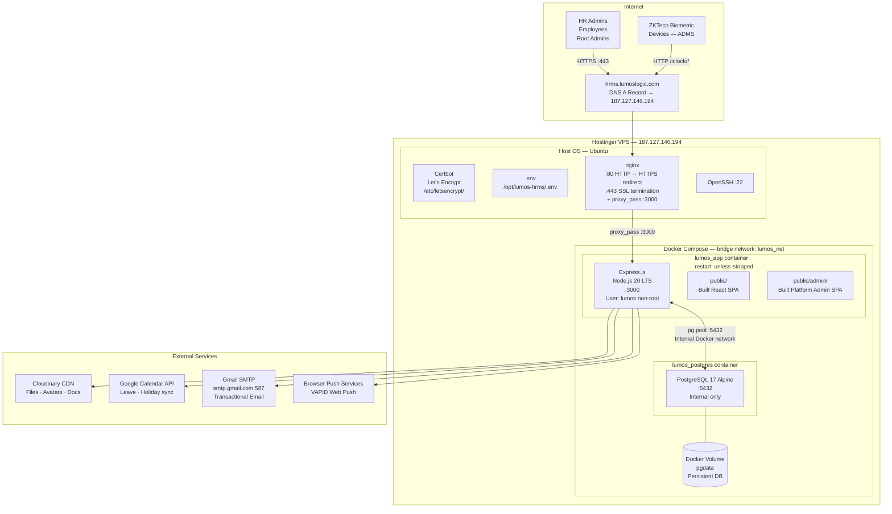
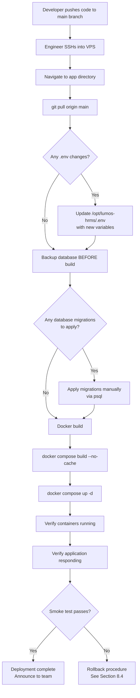
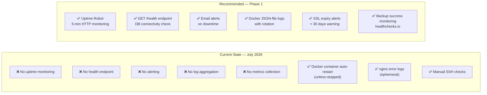
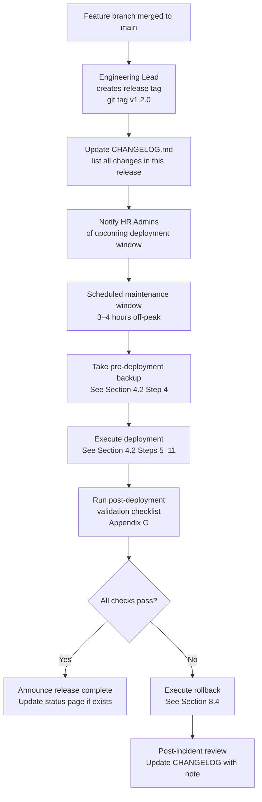
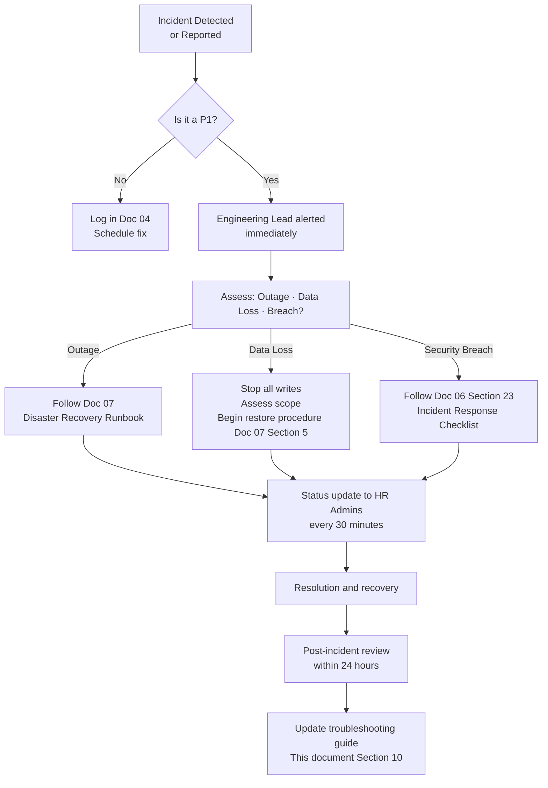

# 11 — Deployment and Maintenance Procedures
## Lumos Logic HRMS — Master Operations, Deployment, Maintenance & Administration Handbook

---

**Document Version:** 1.0
**Prepared By:** Lumos Logic
**Date:** July 2026
**Classification:** Confidential — DevOps, System Administrators, Engineering Lead
**Audience:** DevOps Engineers, System Administrators, Backend Developers, Engineering Lead, Operations Team

> **Status Convention used throughout this document:**
> - **[IMPLEMENTED]** — This procedure, tool, or configuration exists and is active in production today
> - **[MANUAL]** — This task exists but requires human execution with no automation; commands are provided
> - **[RECOMMENDED]** — This does not currently exist; it is recommended for implementation; cross-referenced to Document 04 or Document 10

> **Ground truth principle:** Every command, path, port, and configuration value in this document is derived from the actual codebase, Docker Compose file, nginx configuration, and deployment scripts. Nothing is invented. Where a gap exists between the repository config and the live server config (such as the nginx port discrepancy), both states are documented explicitly.

---

## Table of Contents

1. [Executive Summary](#1-executive-summary)
2. [Environment Overview](#2-environment-overview)
3. [Infrastructure Overview](#3-infrastructure-overview)
4. [Deployment Workflow](#4-deployment-workflow)
5. [Configuration Management](#5-configuration-management)
6. [Monitoring](#6-monitoring)
7. [Routine Maintenance](#7-routine-maintenance)
8. [Release Management](#8-release-management)
9. [Operational Checklists](#9-operational-checklists)
10. [Troubleshooting Guide](#10-troubleshooting-guide)
11. [Performance Management](#11-performance-management)
12. [Long-Term Maintenance Strategy](#12-long-term-maintenance-strategy)
13. [Operational Risks](#13-operational-risks)
14. [Best Practices](#14-best-practices)
15. [Future Operational Improvements](#15-future-operational-improvements)
- [Appendix A — Master Daily Operations Checklist](#appendix-a--master-daily-operations-checklist)
- [Appendix B — Weekly Maintenance Checklist](#appendix-b--weekly-maintenance-checklist)
- [Appendix C — Monthly Maintenance Checklist](#appendix-c--monthly-maintenance-checklist)
- [Appendix D — Quarterly Operations Checklist](#appendix-d--quarterly-operations-checklist)
- [Appendix E — Annual Maintenance Calendar](#appendix-e--annual-maintenance-calendar)
- [Appendix F — Production Readiness Checklist](#appendix-f--production-readiness-checklist)
- [Appendix G — Deployment Checklist](#appendix-g--deployment-checklist)
- [Appendix H — Health Check Checklist](#appendix-h--health-check-checklist)
- [Appendix I — Incident Escalation Matrix](#appendix-i--incident-escalation-matrix)
- [Appendix J — Final Operations Summary](#appendix-j--final-operations-summary)

---

# 1. Executive Summary

### 1.1 Purpose

This document is the **Master Operations Handbook** for the Lumos Logic HRMS. It consolidates all operational knowledge — deployment procedures, maintenance schedules, monitoring requirements, configuration management, troubleshooting runbooks, release management, and long-term operational strategy — into a single authoritative reference for anyone responsible for running and maintaining the HRMS in production.

This document is the operational companion to the implementation suite. Where other documents describe what the system is, this document describes how to operate it day-to-day, safely and reproducibly.

> **Cross-reference:** For system architecture, see `02_System_Architecture_Overview.md`. For disaster recovery and incident response, see `07_Disaster_Recovery_Plan.md`. For backup procedures, see `05_Data_Backup_Strategy.md`. For security operations, see `06_Security_Measures_and_Access_Control.md`. This document does not repeat the content of those documents — it references them and provides the operational procedures that connect them.

### 1.2 Scope

This handbook covers the complete production operation of:

- The Hostinger VPS (187.127.146.194) running the HRMS
- The two Docker containers: `lumos_app` (Express.js) and `lumos_postgres` (PostgreSQL 17)
- The nginx reverse proxy handling HTTPS and biometric routing
- All deployment, configuration, monitoring, maintenance, and release operations
- The git-based deployment workflow from code to production
- The database migration and schema management process

### 1.3 Operational Philosophy

| Principle | Application |
|---|---|
| **Manual today, automated tomorrow** | Current operations are heavily manual. This document captures every manual procedure precisely so that automation can be built on top of documented, validated steps. |
| **Verify before announcing** | Never declare an operation complete without running the validation steps in each runbook. |
| **Backup before changing** | Every destructive or schema-changing operation must be preceded by a database backup, even if the last scheduled backup was recent. |
| **Document every incident** | Every production incident — even a 5-minute outage — should be recorded with timeline, cause, and resolution. This builds the operational knowledge base. |
| **Least privilege always** | Application containers run as non-root user `lumos`. The database is never exposed to the internet. Credentials are never hardcoded. |

### 1.4 Current Operational Maturity

| Dimension | Current State | Grade | Path to Improvement |
|---|---|---|---|
| Deployment automation | Manual git pull + docker compose | D | GitHub Actions CI/CD (Doc 10 P3-01) |
| Database backup | **Not configured** | F | pg_dump cron (Doc 05, Doc 10 P1-01) |
| Uptime monitoring | **Not configured** | F | Uptime Robot (Doc 10 P1-02) |
| Health endpoint | **Not implemented** | F | GET /health (Doc 04 F-045) |
| Log retention | Ephemeral Docker stdout | D | JSON-file driver (Doc 10 P1-11) |
| SSL management | Let's Encrypt + Certbot | B | Renewal monitoring needed |
| Incident response | Manual runbooks in Doc 07 | C | Improve with alerting |
| Staging environment | **Not configured** | F | Second VPS (Doc 10 LT-02) |
| Change management | Ad-hoc | D | Formal release process below |
| Security monitoring | **None** | F | Uptime Robot + structured logging |

> **Critical:** Three F-grade items — backup, monitoring, and health endpoint — pose existential risk to the platform. These must be implemented before any new feature development. Procedures for all three are documented in this handbook.

---

# 2. Environment Overview

### 2.1 Environment Summary

The HRMS currently operates across two environments. A staging environment is planned but does not exist.

| Property | Development | Production | Staging |
|---|---|---|---|
| **Status** | [IMPLEMENTED] | [IMPLEMENTED] | [RECOMMENDED] |
| **Location** | Developer's local machine | Hostinger VPS — 187.127.146.194 | Separate VPS (planned) |
| **URL** | `http://localhost:5173` (Vite dev server) | `https://hrms.lumoslogic.com` | `https://staging.hrms.lumoslogic.com` (planned) |
| **Database** | Local PostgreSQL or Docker | Docker container `lumos_postgres` | Separate container (planned) |
| **SSL** | None (HTTP only) | Let's Encrypt — auto-renewed | Let's Encrypt (planned) |
| **Docker** | Optional (can run locally) | Docker Compose | Docker Compose (planned) |
| **Build** | Vite dev server (HMR) | Multi-stage Docker build | Same as production (planned) |
| **Environment file** | `.env` (local copy) | `/opt/lumos-hrms/.env` | Separate `.env` with staging values |
| **Biometric devices** | Not connected | ZKTeco devices (Sanghavi) | Test device or simulator |
| **Email** | SMTP (test account) or disabled | Gmail SMTP via App Password | Gmail SMTP (test account) |
| **Branch** | Feature branches / `dev` | `main` (or tagged release) | `main` before production merge |
| **Data** | Seed data / test data | Live production data | Anonymized production copy (planned) |

### 2.2 Development Environment Setup

**[MANUAL]** — No automated setup script exists. A developer sets up the development environment manually.

**Prerequisites:**
- Node.js 20 LTS
- PostgreSQL 17 (local install or Docker)
- Git
- A `.env` file copied from `.env.example` with local values

**Steps:**

```bash
# 1. Clone the repository
git clone <repo-url> Leave_Tracker-HR-Dashboard-
cd Leave_Tracker-HR-Dashboard-

# 2. Install all dependencies (root, backend, client, platform-admin)
npm install
cd backend && npm install
cd ../client && npm install
cd ../platform-admin && npm install
cd ..

# 3. Copy and configure environment variables
cp .env.example .env
# Edit .env with local database credentials and service keys

# 4. Initialize the database (apply base schema)
cd backend
psql -U your_local_user -d your_local_db -f migrations/full_schema.sql
# Apply additional migrations in order (see Section 5.5)

# 5. Start the backend (Express API on :3000)
cd backend && npm run dev

# 6. Start the frontend dev server (Vite on :5173)
cd client && npm run dev

# 7. (Optional) Start the platform admin dev server (:5174)
cd platform-admin && npm run dev
```

**Vite proxy configuration (already set up in `client/vite.config.js`):**
```javascript
server: {
  proxy: {
    '/api': 'http://localhost:3000',
    '/iclock': 'http://localhost:3000',
  }
}
```

### 2.3 Environment Variable Differences

| Variable | Development | Production |
|---|---|---|
| `NODE_ENV` | `development` | `production` |
| `PORT` | `3000` | `3000` |
| `DB_HOST` | `localhost` or `127.0.0.1` | `lumos_postgres` (Docker service name) |
| `DB_PORT` | `5432` | `5432` |
| `FRONTEND_URL` | `http://localhost:5173` | `https://hrms.lumoslogic.com` |
| `JWT_SECRET` | Any 32+ char string | Strong random value (never default) |
| `SMTP_USER` | Test account or empty | Gmail with App Password |
| `CLOUDINARY_*` | Test account or empty | Production Cloudinary account |

---

# 3. Infrastructure Overview

### 3.1 Production Infrastructure Topology

**[IMPLEMENTED]**



### 3.2 VPS Specifications

**[IMPLEMENTED]**

| Property | Value |
|---|---|
| Provider | Hostinger |
| Server IP | 187.127.146.194 |
| SSH Access | `ssh root@187.127.146.194` |
| Operating System | Ubuntu (LTS) |
| App Directory | `/opt/lumos-hrms` |
| Backup Directory | `/opt/backups/lumos-hrms/` (to be created — see Section 7) |
| SSH Port | 22 |
| Timezone | Asia/Kolkata (IST) — set in all containers |

### 3.3 Docker Compose Architecture

**[IMPLEMENTED]** — `docker-compose.yml` at `/opt/lumos-hrms/docker-compose.yml`

```yaml
# Simplified representation of actual docker-compose.yml
services:
  app:
    container_name: lumos_app
    build: .
    ports:
      - "3000:3000"
    environment:
      - NODE_ENV=production
      - TZ=Asia/Kolkata
    env_file: .env
    depends_on:
      - postgres
    restart: unless-stopped
    networks:
      - lumos_net

  postgres:
    container_name: lumos_postgres
    image: postgres:17-alpine
    environment:
      - POSTGRES_DB=lumos_hrms
      - POSTGRES_USER=lumos_admin
      - TZ=Asia/Kolkata
    volumes:
      - pgdata:/var/lib/postgresql/data
    expose:
      - "5432"               # Internal only — NOT published to host
    restart: unless-stopped
    networks:
      - lumos_net

volumes:
  pgdata:

networks:
  lumos_net:
    driver: bridge
```

**Key architecture facts:**
- PostgreSQL port `5432` is exposed only within the Docker network — never to the internet
- The `pgdata` named volume persists across container restarts and image rebuilds
- Both containers restart automatically on crash or VPS reboot (`unless-stopped`)
- The Express app and PostgreSQL communicate via the Docker bridge network using the hostname `lumos_postgres`

### 3.4 Docker Build Architecture

**[IMPLEMENTED]** — Multi-stage `Dockerfile` at project root

```
Stage 1 — frontend-builder
  → npm ci in client/
  → vite build → client/dist/

Stage 2 — platform-builder
  → npm ci in platform-admin/
  → vite build → platform-admin/dist/

Stage 3 — app (production image)
  → npm ci --omit=dev in backend/
  → Copy backend/src/
  → Copy client/dist/ → public/
  → Copy platform-admin/dist/ → public/admin/
  → Switch to non-root user: lumos
  → EXPOSE 3000
  → CMD ["node", "src/server.js"]
```

### 3.5 nginx Configuration

**[IMPLEMENTED]** — nginx config at `/etc/nginx/sites-enabled/` on VPS

```nginx
# /etc/nginx/sites-enabled/lumos-hrms (live server config — verified separately from repo)

server {
    listen 80;
    server_name hrms.lumoslogic.com;
    return 301 https://$host$request_uri;
}

server {
    listen 443 ssl;
    server_name hrms.lumoslogic.com;

    ssl_certificate     /etc/letsencrypt/live/hrms.lumoslogic.com/fullchain.pem;
    ssl_certificate_key /etc/letsencrypt/live/hrms.lumoslogic.com/privkey.pem;

    # Biometric ADMS endpoint — no auth, proxied directly
    location /iclock/ {
        proxy_pass http://127.0.0.1:3000;
        proxy_set_header Host $host;
        # [RECOMMENDED] Add allow/deny IP block here — see Doc 04 F-007
    }

    # All other traffic → Express app
    location / {
        proxy_pass http://127.0.0.1:3000;
        proxy_http_version 1.1;
        proxy_set_header Upgrade $http_upgrade;
        proxy_set_header Connection 'upgrade';
        proxy_set_header Host $host;
        proxy_set_header X-Real-IP $remote_addr;
        proxy_cache_bypass $http_upgrade;
    }
}
```

> **⚠️ Critical Warning:** The repository file `nginx/lumos.conf` contains `proxy_pass http://127.0.0.1:3005` — this does NOT match the application port of 3000. **Always verify the live nginx configuration on the VPS** before assuming the repo file is current:
> ```bash
> grep proxy_pass /etc/nginx/sites-enabled/*
> ```
> The live config must show port `3000`. If it shows `3005`, update it immediately — see Troubleshooting Section 10.1.

### 3.6 SSL Certificate Management

**[IMPLEMENTED]** — Let's Encrypt via Certbot

```bash
# Check certificate status and expiry
certbot certificates

# Manual renewal (usually handled by systemd timer)
certbot renew

# Verify systemd auto-renewal timer is active
systemctl status certbot.timer

# Test renewal without actually renewing
certbot renew --dry-run
```

**Certificate location:** `/etc/letsencrypt/live/hrms.lumoslogic.com/`
**Auto-renewal:** Certbot systemd timer typically runs twice daily
**Expiry:** 90 days (renewed when < 30 days remaining)

> **[RECOMMENDED]** Add SSL expiry monitoring — alert when certificate has < 30 days remaining. See Doc 04 F-055 and Section 6 of this document.

### 3.7 External Service Summary

| Service | Purpose | Config Location | Failure Behavior |
|---|---|---|---|
| **Cloudinary** | File/image CDN | `.env` `CLOUDINARY_*` | HTTP 500 returned to client |
| **Gmail SMTP** | Transactional email | `.env` `SMTP_USER`, `SMTP_PASS` | Silent fail — logged to console |
| **Google Calendar** | Leave/holiday sync | `.env` `GOOGLE_CALENDAR_ID`, `GOOGLE_SERVICE_ACCOUNT_JSON` | Silent fail — operation still saves to DB |
| **Web Push (VAPID)** | Browser notifications | `.env` `VAPID_PUBLIC_KEY`, `VAPID_PRIVATE_KEY` | Silent fail — dead subscriptions auto-cleaned |
| **ZKTeco ADMS** | Biometric attendance | Device configuration | Raw log retained for manual reprocess |

---

# 4. Deployment Workflow

### 4.1 Current Deployment Process

**[MANUAL]** — All deployments require SSH access to the VPS and manual command execution. There is no CI/CD pipeline.



### 4.2 Step-by-Step Deployment Commands

**Prerequisites before starting:**
- [ ] A verified database backup exists from today (see Section 7.2)
- [ ] All changes are committed and pushed to the `main` branch
- [ ] Any new environment variables are documented and ready to add to `.env`
- [ ] Any database migrations are tested locally first

---

**Step 1 — SSH into VPS**
```bash
ssh root@187.127.146.194
```

**Step 2 — Navigate to app directory**
```bash
cd /opt/lumos-hrms
```

**Step 3 — Check current state before touching anything**
```bash
# Verify current containers are running
docker compose ps

# Note the current git commit for rollback reference
git log --oneline -5

# Record disk space before build
df -h
```

**Step 4 — Take a pre-deployment database backup [MANUAL]**
```bash
# Create backup directory if it doesn't exist
mkdir -p /opt/backups/lumos-hrms/db

# Take snapshot backup
docker exec lumos_postgres pg_dump \
  -U lumos_admin lumos_hrms \
  | gzip > /opt/backups/lumos-hrms/db/pre_deploy_$(date +%Y%m%d_%H%M%S).sql.gz

# Verify backup was created
ls -lh /opt/backups/lumos-hrms/db/ | tail -3
```

**Step 5 — Pull latest code**
```bash
git fetch origin
git pull origin main

# Verify the expected commit
git log --oneline -1
```

**Step 6 — Update environment variables if needed**
```bash
# Review .env.example for any new variables added in this release
diff .env.example .env

# Edit .env if new variables are required
nano /opt/lumos-hrms/.env

# NEVER commit .env to git
```

**Step 7 — Apply database migrations [MANUAL]**
```bash
# List all migration files and check which ones are new
ls backend/migrations/

# Apply each new migration in order
docker exec -i lumos_postgres psql \
  -U lumos_admin lumos_hrms \
  < backend/migrations/MIGRATION_FILE_NAME.sql

# Verify migration applied (check for new table/column)
docker exec -it lumos_postgres psql \
  -U lumos_admin lumos_hrms \
  -c "\d table_name"
```

> **Warning:** Always apply migrations before building the new image. Never apply migrations after the new application is running if it depends on the migration — do them in order: migrate → build → deploy.

**Step 8 — Build the Docker image**
```bash
# Build without cache to ensure fresh build
docker compose build --no-cache

# Expected output: Successfully built <image_id>
# Build time: 3–8 minutes depending on dependencies
```

**Step 9 — Deploy containers**
```bash
# Bring up the new image (zero-downtime within single container)
docker compose up -d

# Verify both containers are running
docker compose ps
```

Expected output:
```
NAME              IMAGE            COMMAND                  SERVICE    STATUS
lumos_app         lumos-hrms       "node src/server.js"     app        Up 2 seconds
lumos_postgres    postgres:17...   "docker-entrypoint.s…"   postgres   Up 10 minutes
```

**Step 10 — Validate deployment**
```bash
# Check application logs for startup errors
docker compose logs app --tail=50

# Verify Express is listening
docker compose logs app | grep "Server running"

# Verify database connection
docker compose logs app | grep -i "database\|postgres\|connected"

# Test health endpoint (once implemented — see Recommended)
curl http://localhost:3000/health

# Test HTTPS response
curl -s -o /dev/null -w "%{http_code}" https://hrms.lumoslogic.com

# Expected: 200
```

**Step 11 — Run smoke tests [MANUAL]**
```bash
# Test login endpoint responds
curl -s -X POST https://hrms.lumoslogic.com/api/auth/login \
  -H "Content-Type: application/json" \
  -d '{"email":"test@example.com","password":"wrongpassword"}' | jq .

# Expected: {"error":"Invalid email or password"} — proves API is up

# Verify static files served (SPA)
curl -s -o /dev/null -w "%{http_code}" https://hrms.lumoslogic.com/
# Expected: 200
```

### 4.3 Deployment Environment Validation

Before every deployment, validate the environment configuration:

```bash
# Confirm JWT_SECRET is set and not the default value
docker compose exec app sh -c 'echo $JWT_SECRET | wc -c'
# Expected: > 32 characters (minimum)

# Confirm NODE_ENV is production
docker compose exec app sh -c 'echo $NODE_ENV'
# Expected: production

# Confirm DB is reachable from app container
docker compose exec app sh -c 'node -e "const {pool} = require(\"./src/config/db\"); pool.query(\"SELECT 1\").then(()=>console.log(\"DB OK\")).catch(e=>console.error(e))"'

# Confirm nginx proxy target is correct
grep proxy_pass /etc/nginx/sites-enabled/*
# Must show port 3000, not 3005
```

---

# 5. Configuration Management

### 5.1 Environment Variables Reference

**[IMPLEMENTED]** — All configuration is via `/opt/lumos-hrms/.env` on the production VPS.

```bash
# ─── Application Core ───────────────────────────────────────────────────────
NODE_ENV=production
PORT=3000
FRONTEND_URL=https://hrms.lumoslogic.com

# ─── Database ───────────────────────────────────────────────────────────────
DB_HOST=lumos_postgres          # Docker service name — NOT localhost
DB_PORT=5432
DB_NAME=lumos_hrms
DB_USER=lumos_admin
DB_PASSWORD=<strong-unique-password>

# ─── Authentication ─────────────────────────────────────────────────────────
JWT_SECRET=<minimum-32-char-random-string>
# CRITICAL: If not set, app falls back to 'leave-tracker-secret-2026' (PUBLIC)
# See Doc 04 F-005 — startup validation fix is RECOMMENDED

# ─── Cloudinary (File Storage) ──────────────────────────────────────────────
CLOUDINARY_CLOUD_NAME=<cloud-name>
CLOUDINARY_API_KEY=<api-key>
CLOUDINARY_API_SECRET=<api-secret>

# ─── Email (Gmail SMTP) ─────────────────────────────────────────────────────
SMTP_HOST=smtp.gmail.com
SMTP_PORT=587
SMTP_USER=<gmail-address>
SMTP_PASS=<gmail-app-password>   # App Password — NOT Gmail login password
SMTP_FROM=<display-from-email>

# ─── Google Calendar (Optional) ─────────────────────────────────────────────
GOOGLE_CALENDAR_ID=<calendar-id>
GOOGLE_SERVICE_ACCOUNT_JSON=<inline-JSON-or-path-to-file>

# ─── Web Push Notifications (Optional) ──────────────────────────────────────
VAPID_PUBLIC_KEY=<vapid-public-key>
VAPID_PRIVATE_KEY=<vapid-private-key>
VAPID_SUBJECT=mailto:<admin@lumoslogic.com>

# ─── Platform Admin ──────────────────────────────────────────────────────────
PLATFORM_ADMIN_EMAIL=<platform-admin-email>
PLATFORM_ADMIN_PASSWORD=<strong-password>

# ─── Timezone ────────────────────────────────────────────────────────────────
TZ=Asia/Kolkata
```

> **Security rule:** The `.env` file must NEVER be committed to git. Verify: `cat .gitignore | grep .env`

### 5.2 Secrets Management

**[MANUAL]** — Secrets are stored in the `.env` file on the VPS. No secrets management tool (e.g., HashiCorp Vault) is currently in use.

| Secret | Location | Rotation Frequency | Rotation Impact |
|---|---|---|---|
| `JWT_SECRET` | `.env` | Annually | All users must re-login |
| `DB_PASSWORD` | `.env` + Docker compose | Annually | App restart required |
| `CLOUDINARY_API_SECRET` | `.env` | Quarterly | No user impact |
| `SMTP_PASS` (App Password) | `.env` | When Google requires it | No user impact |
| `VAPID_PRIVATE_KEY` | `.env` | Do not rotate without cause | All push subscriptions invalidated |
| `GOOGLE_SERVICE_ACCOUNT_JSON` | `.env` | When key is revoked | Calendar sync stops until updated |
| Platform admin password | Database `platform_admins` | Quarterly | Admin must re-login |

**Secret rotation procedure — JWT_SECRET:**
```bash
# 1. Generate a new strong secret
node -e "console.log(require('crypto').randomBytes(48).toString('hex'))"

# 2. Update .env
nano /opt/lumos-hrms/.env
# Replace JWT_SECRET= with new value

# 3. Restart the app container (all active JWTs are immediately invalidated)
docker compose restart app

# 4. Inform HR teams — all users will be logged out
# Plan this during off-peak hours (ideally Saturday night)
```

### 5.3 Feature Flags

**[IMPLEMENTED]** — Feature flags are stored in the `organization_features` database table. They are managed via the Platform Admin interface at `/admin` (the platform admin SPA).

```sql
-- View all feature flags for an organization
SELECT feature_key, enabled
FROM organization_features
WHERE organization_id = <org_id>
ORDER BY feature_key;

-- Enable a feature for an organization
UPDATE organization_features
SET enabled = TRUE
WHERE organization_id = <org_id>
AND feature_key = 'biometric';

-- Add a new feature flag for an org
INSERT INTO organization_features (organization_id, feature_key, enabled)
VALUES (<org_id>, 'new_feature', FALSE);
```

**Available feature keys:** `payroll`, `expenses`, `assets`, `reports`, `performance`, `documents`, `onboarding`, `exit_management`, `announcements`, `regularization`, `shifts`, `leave_policies`, `push_notifications`, `biometric`, `branches`

**Feature flag precedence:**
1. Backend: `featureGate` middleware checks `organization_features` table on every API request
2. Frontend: `FeatureFlagContext` polls `/api/features` every 30 seconds — changes may take up to 30 seconds to appear in UI

### 5.4 Organization Configuration

Each organization can be configured independently by its Root Admin. The following settings are organization-scoped:

| Setting | Table / Column | Admin UI Location |
|---|---|---|
| Work schedule (hours, late threshold, working days) | `work_schedule` | Root Admin → Settings → Work Schedule |
| Custom SMTP [PARTIALLY IMPLEMENTED] | `organizations.smtp_*` columns | Root Admin → Settings → Email |
| Google Calendar [IMPLEMENTED] | `organizations.google_*` columns | Root Admin → Settings → Calendar |
| Custom VAPID keys [PARTIALLY IMPLEMENTED] | `organizations.vapid_*` columns | Root Admin → Settings → Push |
| Leave policies | `leave_policies` table | HR Admin → Leave Policies |
| Holidays | `holidays` table | HR Admin → Holidays |

> **Note:** Per-organization SMTP and VAPID are stored in the database but the email and push services currently read only the global environment variables. Full org-level SMTP routing is a planned enhancement — see Doc 04 F-013 and F-014.

### 5.5 Database Migration Management

**[MANUAL]** — Migrations are applied manually via `psql`. No migration versioning tool is in use.

**Migration files location:** `backend/migrations/`

**Correct order of application (as of July 2026):**
```
1. full_schema.sql                          — Base schema for all core tables
2. sanghavi_migration.sql                   — Extended columns for enterprise client
3. employee_profile_v2.sql                  — 16-table normalized profile
4. add_break_tracking.sql                   — Break in/out fields on attendance
5. add_account_security_2026_07_24.sql      — TOTP, password history, login history
6. add_banking_hr_verified_2026_07_23.sql   — Banking verification fields
7. fix_wfh_leave_type.sql                   — WFH separation from leave system
8. patch_2026_06_29.sql (and others)        — Point-in-time patches in date order
```

**Applying a migration:**
```bash
# Always backup before applying a migration
docker exec lumos_postgres pg_dump \
  -U lumos_admin lumos_hrms \
  | gzip > /opt/backups/lumos-hrms/db/pre_migration_$(date +%Y%m%d_%H%M%S).sql.gz

# Apply the migration
docker exec -i lumos_postgres psql \
  -U lumos_admin lumos_hrms \
  < backend/migrations/YOUR_MIGRATION.sql

# Verify the migration ran without errors
# (check the output for ERROR: lines)
```

> **[RECOMMENDED]** A migration versioning table should be added to track which migrations have been applied. See Doc 10 P2-09.

### 5.6 nginx Configuration Management

**[MANUAL]** — nginx configuration is managed directly on the VPS.

```bash
# View active nginx config
nginx -T

# Confirm proxy target port (MUST be 3000, not 3005)
grep proxy_pass /etc/nginx/sites-enabled/*

# Edit nginx config
nano /etc/nginx/sites-enabled/lumos-hrms

# Test config before reloading
nginx -t

# Reload nginx without dropping connections
nginx -s reload

# Full restart (use only if reload fails)
systemctl restart nginx
```

---

# 6. Monitoring

### 6.1 Current Monitoring State

**[MANUAL / NOT IMPLEMENTED]** — As of July 2026, no automated monitoring exists. Outages are detected when users report them.



### 6.2 Container Health Monitoring

**[IMPLEMENTED — MANUAL]** — Operators must SSH in to check container health.

```bash
# Check if both containers are running
docker compose ps

# Check resource usage (CPU, memory)
docker stats --no-stream

# View live application logs
docker compose logs app --tail=100 -f

# View live PostgreSQL logs
docker compose logs postgres --tail=50 -f

# Check container restart count (non-zero = the container has crashed)
docker inspect lumos_app | grep RestartCount

# Check container uptime
docker inspect lumos_app | grep StartedAt
```

### 6.3 Application Monitoring

**[IMPLEMENTED — MANUAL]**

```bash
# Verify Express is listening on port 3000
ss -tlnp | grep 3000

# Test API response (from VPS)
curl -s http://localhost:3000/api/auth/login \
  -X POST -H "Content-Type: application/json" \
  -d '{}' | jq .error
# Expected: "Email and password required" or similar

# Test HTTPS from outside (run from developer machine)
curl -s -o /dev/null -w "Status: %{http_code}\nTime: %{time_total}s\n" \
  https://hrms.lumoslogic.com
# Expected: Status: 200

# Check application error logs for recent exceptions
docker compose logs app --since 1h | grep -i "error\|exception\|FATAL"
```

### 6.4 Database Monitoring

**[MANUAL]**

```bash
# Check database is accepting connections
docker exec lumos_postgres pg_isready -U lumos_admin -d lumos_hrms

# Check active connections
docker exec lumos_postgres psql -U lumos_admin lumos_hrms \
  -c "SELECT count(*), state FROM pg_stat_activity GROUP BY state;"

# Check database size
docker exec lumos_postgres psql -U lumos_admin lumos_hrms \
  -c "SELECT pg_size_pretty(pg_database_size('lumos_hrms'));"

# Check largest tables
docker exec lumos_postgres psql -U lumos_admin lumos_hrms -c "
SELECT
  tablename,
  pg_size_pretty(pg_total_relation_size(tablename::text)) AS size,
  pg_total_relation_size(tablename::text) AS raw_size
FROM pg_tables
WHERE schemaname = 'public'
ORDER BY raw_size DESC
LIMIT 15;"

# Check for long-running queries (> 30 seconds)
docker exec lumos_postgres psql -U lumos_admin lumos_hrms -c "
SELECT pid, now() - pg_stat_activity.query_start AS duration, query, state
FROM pg_stat_activity
WHERE (now() - pg_stat_activity.query_start) > interval '30 seconds'
  AND state != 'idle';"

# Check biometric_raw_logs growth
docker exec lumos_postgres psql -U lumos_admin lumos_hrms \
  -c "SELECT COUNT(*), processed FROM biometric_raw_logs GROUP BY processed;"
```

### 6.5 Recommended Uptime Monitoring Setup

**[RECOMMENDED]** — Uptime Robot free tier (Doc 10 P1-02)

```
Setup steps (one-time):
1. Create account at uptimerobot.com
2. Add monitor: HTTP(s) type
3. URL: https://hrms.lumoslogic.com
4. Monitoring interval: 5 minutes
5. Alert contacts: engineering lead email + DevOps email
6. Add SSL expiry monitor: SSL Certificate type, same URL
7. Set SSL alert threshold: 30 days before expiry

Once GET /health is implemented (Doc 04 F-045):
- Change monitor URL to: https://hrms.lumoslogic.com/health
- Add keyword check: "ok" must appear in response body
```

### 6.6 Log Management

**[PARTIALLY IMPLEMENTED]** — Logs are written to Docker stdout but are not retained beyond Docker's default behavior (ephemeral).

**Current state — viewing logs:**
```bash
# View last 100 lines of application logs
docker compose logs app --tail=100

# View logs from last 6 hours
docker compose logs app --since 6h

# Follow live logs
docker compose logs app -f

# Save logs to file for analysis
docker compose logs app --since 24h > /tmp/app_logs_$(date +%Y%m%d).txt
```

**[RECOMMENDED]** — Add JSON-file log driver with rotation (Doc 10 P1-11):

```yaml
# Add to docker-compose.yml under the app service:
logging:
  driver: "json-file"
  options:
    max-size: "50m"
    max-file: "10"
```

After adding this, logs persist across restarts and can be searched with:
```bash
# Search for error patterns in retained logs
docker compose logs app --since 7d | grep "ERROR"
```

### 6.7 Performance Monitoring

**[MANUAL]** — VPS resource monitoring via command line.

```bash
# CPU and memory overview
top -bn1 | head -20

# Disk usage — watch for > 80% usage
df -h

# Docker disk usage
docker system df

# Memory usage breakdown
free -h

# Network connections
ss -s

# Monitor Express process specifically
ps aux | grep node
```

**Thresholds that require investigation:**

| Metric | Warning | Critical |
|---|---|---|
| CPU usage | > 70% sustained | > 90% sustained |
| Memory usage | > 75% | > 90% |
| Disk usage | > 75% | > 85% |
| DB connections active | > 15 / 20 | > 18 / 20 |
| DB size growth | > 500MB/month | > 1GB/month |
| Container restart count | > 1 in 24h | > 3 in 24h |

---

# 7. Routine Maintenance

### 7.1 Daily Operations

**[MANUAL]** — No automated daily checks exist. These should be performed each working day.

---

**Daily Task 1 — Database Backup**

| Property | Value |
|---|---|
| **Purpose** | Ensure today's data is recoverable if the VPS fails |
| **Responsible Role** | DevOps Engineer / System Administrator |
| **Frequency** | Daily — 02:00 IST (to be automated) |
| **Status** | [MANUAL — to be automated, see Doc 10 P1-01] |

```bash
# Manual backup command
mkdir -p /opt/backups/lumos-hrms/db

docker exec lumos_postgres pg_dump \
  -U lumos_admin \
  --no-password \
  lumos_hrms \
  | gzip > /opt/backups/lumos-hrms/db/lumos_hrms_$(date +%Y%m%d).sql.gz

# Verify backup created and has reasonable size
ls -lh /opt/backups/lumos-hrms/db/lumos_hrms_$(date +%Y%m%d).sql.gz

# Remove backups older than 30 days
find /opt/backups/lumos-hrms/db/ -name "*.sql.gz" -mtime +30 -delete
```

**Expected Result:** A `.sql.gz` file created in `/opt/backups/lumos-hrms/db/` larger than 1MB (for a populated database).
**Validation:** `ls -lh` shows today's file; `zcat backup.sql.gz | head -5` shows SQL header.
**Escalation:** If backup fails (file not created or 0 bytes), escalate to Engineering Lead immediately.

---

**Daily Task 2 — Container Health Check**

| Property | Value |
|---|---|
| **Purpose** | Confirm both containers are running and not restarting unexpectedly |
| **Responsible Role** | DevOps Engineer |
| **Time Required** | 2 minutes |

```bash
ssh root@187.127.146.194
cd /opt/lumos-hrms

# Check container status
docker compose ps

# Check for abnormal restarts
docker inspect lumos_app --format='{{.RestartCount}} restarts'

# Check recent logs for errors
docker compose logs app --since 24h | grep -c "ERROR"
```

**Expected Result:** Both containers show `Up`; restart count unchanged from yesterday; zero or minimal ERROR lines.
**Escalation:** Any container showing `Restarting` or `Exited` — follow Section 10 troubleshooting.

---

**Daily Task 3 — Disk Space Check**

```bash
df -h /
# Action required if usage > 75%

docker system df
# Clean unused images if > 5GB used by images
docker image prune -f   # Removes dangling images only
```

---

### 7.2 Weekly Maintenance

**[MANUAL]**

---

**Weekly Task 1 — nginx and SSL Status**

| Property | Value |
|---|---|
| **Purpose** | Confirm nginx is healthy and SSL certificate is valid |
| **Responsible Role** | DevOps Engineer |
| **Frequency** | Every Monday |

```bash
# Check nginx status
systemctl status nginx

# Verify SSL certificate validity
certbot certificates

# Check certificate expiry date
echo | openssl s_client -servername hrms.lumoslogic.com \
  -connect hrms.lumoslogic.com:443 2>/dev/null \
  | openssl x509 -noout -dates

# Reload nginx config (in case it was manually edited)
nginx -t && nginx -s reload
```

**Expected Result:** nginx active and running; certificate valid with > 30 days remaining.
**Escalation:** Certificate < 14 days remaining — run `certbot renew` immediately.

---

**Weekly Task 2 — Backup Verification**

| Property | Value |
|---|---|
| **Purpose** | Confirm last 7 daily backups exist and are restorable |
| **Responsible Role** | DevOps Engineer |

```bash
# List recent backups
ls -lh /opt/backups/lumos-hrms/db/ | tail -10

# Verify the most recent backup is readable
LATEST=$(ls -t /opt/backups/lumos-hrms/db/*.sql.gz | head -1)
zcat "$LATEST" | head -10
# Expected: SQL header with PostgreSQL dump information

# Count total backup size
du -sh /opt/backups/lumos-hrms/db/
```

**Expected Result:** 7 backup files from the past 7 days; most recent file readable.
**Escalation:** Missing days = backup cron not running; escalate immediately.

---

**Weekly Task 3 — Security Log Review**

```bash
# Check for failed SSH login attempts
grep "Failed password" /var/log/auth.log | tail -20

# Check for unusual nginx access patterns
tail -100 /var/log/nginx/access.log | grep -E "POST.*/api/auth"

# Check application-level login failures (once audit logging is implemented)
docker exec lumos_postgres psql -U lumos_admin lumos_hrms \
  -c "SELECT ip_address, count(*) FROM login_history
      WHERE status='failed' AND logged_in_at > NOW() - INTERVAL '7 days'
      GROUP BY ip_address ORDER BY count DESC LIMIT 10;"
```

---

**Weekly Task 4 — Biometric Device Status Check**

```bash
# Check all biometric devices — last seen timestamps
docker exec lumos_postgres psql -U lumos_admin lumos_hrms -c "
SELECT
  device_name,
  serial_number,
  status,
  last_seen,
  NOW() - last_seen AS time_since_seen
FROM biometric_devices
ORDER BY last_seen DESC;"

# Check for unprocessed biometric punches older than 24 hours
docker exec lumos_postgres psql -U lumos_admin lumos_hrms -c "
SELECT COUNT(*), MIN(punch_time), MAX(punch_time)
FROM biometric_raw_logs
WHERE processed = FALSE
  AND punch_time < NOW() - INTERVAL '24 hours';"
```

**Expected Result:** All devices show `last_seen` within 10 minutes; zero old unprocessed punches.
**Escalation:** Device offline > 2 hours during working hours → contact HR Admin; device offline > 24 hours → physical inspection of device.

---

### 7.3 Monthly Maintenance

**[MANUAL]**

---

**Monthly Task 1 — Docker Image Cleanup**

```bash
# Remove all unused images, containers, and volumes
docker system prune -a --volumes --filter "until=720h"
# WARNING: This removes ALL unused volumes — verify no data loss first

# Safer: remove only unused images
docker image prune -a --filter "until=720h"

# Check recovered space
docker system df
```

---

**Monthly Task 2 — Database VACUUM and Statistics Update**

```bash
# Run VACUUM ANALYZE on the main high-traffic tables
docker exec lumos_postgres psql -U lumos_admin lumos_hrms -c "
VACUUM ANALYZE attendance;
VACUUM ANALYZE leaves;
VACUUM ANALYZE users;
VACUUM ANALYZE biometric_raw_logs;
VACUUM ANALYZE notifications;"

# Check table bloat after vacuum
docker exec lumos_postgres psql -U lumos_admin lumos_hrms -c "
SELECT
  tablename,
  n_dead_tup AS dead_tuples,
  n_live_tup AS live_tuples,
  last_vacuum,
  last_autovacuum
FROM pg_stat_user_tables
ORDER BY n_dead_tup DESC
LIMIT 10;"
```

---

**Monthly Task 3 — SSL Certificate Proactive Check**

```bash
certbot certificates | grep -A3 "Certificate Name"
# If VALID < 30 days: run certbot renew
certbot renew
nginx -s reload
```

---

**Monthly Task 4 — Dependency Security Audit**

**[MANUAL]** — Run from the repository on a developer machine (or once CI/CD is implemented, in the pipeline):
```bash
cd backend && npm audit
cd client && npm audit
cd platform-admin && npm audit
# Address any HIGH or CRITICAL severity vulnerabilities immediately
```

---

**Monthly Task 5 — Database Backup Restore Test**

```bash
# Restore last week's backup to a test database
docker exec lumos_postgres createdb -U lumos_admin lumos_hrms_restore_test

BACKUP_FILE=$(ls -t /opt/backups/lumos-hrms/db/*.sql.gz | sed -n '7p')
zcat "$BACKUP_FILE" | docker exec -i lumos_postgres psql \
  -U lumos_admin lumos_hrms_restore_test

# Verify key tables exist and have data
docker exec lumos_postgres psql -U lumos_admin lumos_hrms_restore_test \
  -c "SELECT COUNT(*) FROM users; SELECT COUNT(*) FROM attendance;"

# Clean up test database
docker exec lumos_postgres dropdb -U lumos_admin lumos_hrms_restore_test
```

**Expected Result:** Restore completes without errors; row counts match expected values.
**Escalation:** Restore failure means backup is corrupt — investigate and take a fresh backup.

---

### 7.4 Quarterly Maintenance

**[MANUAL]**

---

**Quarterly Task 1 — Disaster Recovery Drill**

Execute a tabletop DR drill following the procedure in `07_Disaster_Recovery_Plan.md`, Section 10. Record results, deviations, and duration. Update the DR testing calendar in Doc 07 Appendix E.

---

**Quarterly Task 2 — Security Review**

Follow the Quarterly Security Audit Checklist in `06_Security_Measures_and_Access_Control.md`, Section 21. Key items:
- Rotate Cloudinary API key
- Review CORS `ALLOWED_ORIGINS` for stale domains
- Audit `platform_admins` table for stale accounts
- Review `root_admin` accounts across all organizations
- Run `docker scout cves` for container image vulnerabilities

---

**Quarterly Task 3 — Documentation Review**

Review all implementation documents against the current codebase:
- Update resolved findings in `04_Pending_Development_Tasks.md`
- Update security maturity scores in `06_Security_Measures_and_Access_Control.md`
- Update roadmap progress in `10_Future_Enhancement_Roadmap.md`
- Update this document if infrastructure has changed

---

**Quarterly Task 4 — Database Index Review**

```bash
# Check for missing indexes on high-traffic queries
docker exec lumos_postgres psql -U lumos_admin lumos_hrms -c "
SELECT
  schemaname,
  tablename,
  attname,
  n_distinct,
  correlation
FROM pg_stats
WHERE tablename IN ('attendance', 'leaves', 'users', 'biometric_raw_logs')
  AND n_distinct > 100
ORDER BY tablename, attname;"

# Check for unused indexes (candidates for removal)
docker exec lumos_postgres psql -U lumos_admin lumos_hrms -c "
SELECT
  indexrelname AS index,
  relname AS table,
  idx_scan AS times_used
FROM pg_stat_user_indexes
JOIN pg_stat_user_tables USING (relname)
WHERE idx_scan = 0
  AND indexrelname NOT LIKE 'pg_%'
ORDER BY relname;"
```

---

### 7.5 Annual Maintenance

- Rotate `JWT_SECRET` (all users re-login; plan for off-peak; communicate to HR teams)
- Rotate all third-party API credentials (Cloudinary, Google Calendar service account)
- Review and update this operational handbook
- Commission external security assessment or penetration test
- Run annual DR simulation (full restore to fresh VPS)
- Assess capacity: is the current VPS size still adequate for the next 12 months?
- Update this document's version number and review date

---

# 8. Release Management

### 8.1 Versioning

The HRMS follows Semantic Versioning:

| Type | Version Bump | Example | When |
|---|---|---|---|
| Hotfix / bug fix | Patch | `1.1.0` → `1.1.1` | Broken route fix; security patch |
| New feature / enhancement | Minor | `1.1.0` → `1.2.0` | New module; significant capability |
| Breaking change / major refactor | Major | `1.2.0` → `2.0.0` | PII encryption migration; RLS implementation; API versioning |

**Current version:** v3.0 (multi-tenant + biometric enabled — as of July 2026)

### 8.2 Release Process

**[MANUAL]** — No automated release pipeline exists.



### 8.3 Pre-Release Checklist

Before starting any production deployment:

- [ ] All code changes are in the `main` branch and git-tagged
- [ ] New environment variables (if any) are documented and staged in `.env` on VPS
- [ ] Database migration files (if any) are tested locally
- [ ] Pre-deployment database backup taken and verified
- [ ] Deployment window communicated to HR Admins and affected users
- [ ] Engineering Lead and at least one other team member are available during deployment
- [ ] Rollback procedure reviewed

### 8.4 Rollback Procedure

**[MANUAL]** — Execute when a deployment causes a production issue that cannot be quickly patched.

```bash
# Step 1 — Identify the last known-good commit
git log --oneline -10
# Note the commit hash of the previous working version (e.g., abc1234)

# Step 2 — Check out the previous version
git checkout abc1234

# Step 3 — Rebuild from the previous commit
docker compose build --no-cache

# Step 4 — Restart containers
docker compose up -d

# Step 5 — Verify application is working
curl -s -o /dev/null -w "%{http_code}" https://hrms.lumoslogic.com
# Expected: 200

# Step 6 — If migration was applied and caused issues, restore from backup
# See Doc 07 Section 5 for full database restore procedure

# Step 7 — Return to main branch
git checkout main
```

> **Warning:** If a database migration was part of the deployment, rolling back the application WITHOUT rolling back the schema will cause errors if the old code expects the old schema. Always take a pre-migration backup and restore from it if rollback is needed after a migration.

### 8.5 Hotfix Deployment

For critical bugs (broken routes, security vulnerabilities, data errors) that cannot wait for a scheduled release:

```bash
# 1. Create a hotfix branch from the current production commit
git checkout -b hotfix/F-003-exit-self-submit

# 2. Make the minimal fix
# Edit the affected file only

# 3. Test locally

# 4. Merge directly to main with Engineering Lead approval
git checkout main
git merge hotfix/F-003-exit-self-submit

# 5. Tag the hotfix
git tag v1.1.1

# 6. Deploy immediately following the deployment procedure (Section 4.2)
# No need for a maintenance window for single-file hotfixes
# But still take a backup first
```

### 8.6 Post-Release Validation

After every deployment, run these checks before declaring success:

```bash
# 1. Verify both containers are running
docker compose ps

# 2. Verify no ERROR-level logs in first 5 minutes
docker compose logs app --since 5m | grep -i "error\|fatal"

# 3. Verify API is responding
curl -s -X POST https://hrms.lumoslogic.com/api/auth/login \
  -H "Content-Type: application/json" \
  -d '{"email":"x","password":"x"}' | jq .error

# 4. Verify SPA loads
curl -s -o /dev/null -w "%{http_code}" https://hrms.lumoslogic.com/
# Expected: 200

# 5. Log in manually as a test user and verify:
#    - Dashboard loads
#    - Attendance page loads
#    - Leave page loads
#    - Employee list loads (if admin)
```

---

# 9. Operational Checklists

### 9.1 New Organization Setup

**[MANUAL]**

- [ ] Platform Admin approves organization registration request at `/admin`
- [ ] Organization record created in `organizations` table with correct plan
- [ ] Root Admin account created and credentials sent to client
- [ ] Feature flags configured in `organization_features` for the assigned plan
- [ ] Work schedule configured: `work_schedule` row inserted for org
- [ ] Default leave policies created in `leave_policies`
- [ ] Holidays added to `holidays` table for current year
- [ ] Departments and designations created per client org structure
- [ ] Google Calendar integration configured (if Platinum plan)
- [ ] SMTP configuration added to organization settings (if white-label email needed)
- [ ] Welcome email sent to Root Admin
- [ ] Biometric device registration initiated (if applicable — Platinum plan)
- [ ] Root Admin given link to Employee Portal and HR Admin guide

### 9.2 New HR Admin Setup

- [ ] Root Admin creates HR Admin account via HR Admin management screen
- [ ] Temporary password set with `force_password_change = true`
- [ ] Role confirmed as `admin` in `users` table
- [ ] HR Admin logs in and completes forced password change
- [ ] HR Admin optionally enables TOTP 2FA (`/settings/security`)
- [ ] HR Admin reviews feature access via sidebar navigation
- [ ] Verify HR Admin cannot access Root Admin routes (`/root/*`)

### 9.3 New Employee Setup

- [ ] HR Admin creates employee via Employee Management → Add Employee
- [ ] Employee account created with `force_password_change = true`
- [ ] Temporary credentials sent to employee's email
- [ ] Department(s) assigned in the employee record
- [ ] Shift assignment created if applicable
- [ ] Onboarding checklist initialized (Platinum plan): `POST /api/onboarding/init/:userId`
- [ ] Employee logs in, completes forced password change, and accesses portal
- [ ] Employee encouraged to complete Employee Profile V2 sections
- [ ] If biometric system active: employee PIN registered in biometric device and mapped in `biometric_employee_map`

### 9.4 Production Deployment Checklist

See Appendix G for the complete deployment checklist.

### 9.5 Maintenance Window Checklist

- [ ] Maintenance window announced to all users minimum 24 hours in advance
- [ ] Maintenance start time scheduled for off-peak hours (preferably Saturday 22:00–02:00 IST)
- [ ] Pre-maintenance database backup taken and verified
- [ ] All team members involved are available and briefed
- [ ] Rollback procedure reviewed and rollback commit hash noted
- [ ] Operations are suspended (if possible — ask HR Admins to defer approvals)
- [ ] Maintenance window completed and end announced
- [ ] Post-deployment validation completed (Section 8.6)

### 9.6 Backup Validation Checklist

Monthly (see Section 7.3 Monthly Task 5):

- [ ] Identify the backup file from 7 days ago
- [ ] Create a test restore database
- [ ] Restore from backup file
- [ ] Verify table counts match expected values (compare with production)
- [ ] Verify key records exist (a specific employee, a recent attendance record)
- [ ] Drop the test database
- [ ] Record: backup date, restore duration, success/failure, validator name

### 9.7 Disaster Recovery Validation

Quarterly (reference `07_Disaster_Recovery_Plan.md` Appendix E):

- [ ] Identify the DR scenario to simulate this quarter
- [ ] Assemble DR team
- [ ] Execute the recovery procedure from Doc 07
- [ ] Record: time to detect, time to recover, data loss (if any)
- [ ] Compare against RTO/RPO targets in Doc 07 Section 2
- [ ] Document deviations and update procedures accordingly

### 9.8 Security Review Checklist

Monthly (reference `06_Security_Measures_and_Access_Control.md` Section 20):

- [ ] Check `login_history` for unusual patterns (high failure rates, unusual IPs)
- [ ] Verify SSL certificate valid > 30 days
- [ ] Run `npm audit` in all packages; address HIGH or CRITICAL
- [ ] Verify daily backup ran every day this month
- [ ] Verify biometric IP allowlist is current
- [ ] Review Docker logs for repeated 401/403 patterns
- [ ] Check `platform_activity` for unexpected org-level events

### 9.9 Database Maintenance Checklist

Monthly:

- [ ] Run `VACUUM ANALYZE` on high-traffic tables (Section 7.3 Monthly Task 2)
- [ ] Check for long-running queries (Section 6.4)
- [ ] Review `biometric_raw_logs` size and unprocessed count
- [ ] Verify all recent migrations are applied (compare `backend/migrations/` with what's in DB)
- [ ] Check DB connection pool usage (should not routinely exceed 15/20)
- [ ] Check DB size growth trend — is it within capacity?

### 9.10 Biometric System Validation

Weekly:

- [ ] All registered devices show `status = 'online'` and recent `last_seen` timestamp
- [ ] Zero unprocessed punches older than 24 hours
- [ ] Sample 5 random attendance records from biometric source and verify correct employee mapping
- [ ] Check biometric heartbeat endpoint is responding: `GET /iclock/getrequest`
- [ ] Verify no device has an unusual `punch_count` vs. headcount for that branch

### 9.11 Payroll Month-End Checklist

- [ ] Confirm attendance data is complete for all employees for the month (no unexplained gaps)
- [ ] Run regularization approvals — ensure all pending regularization requests are resolved
- [ ] Confirm biometric data is synced (all processed = true for the period)
- [ ] Review leave records — ensure all leaves for the month are approved/rejected
- [ ] Generate payslips for all employees: HR Admin → Payroll → Generate Payslips
- [ ] Review LOP calculations (currently manual — cross-check against attendance)
- [ ] Verify payslip PDFs are accessible for all employees
- [ ] Archive the month's payroll run

---

# 10. Troubleshooting Guide

### 10.1 Application Unreachable / 502 Bad Gateway

**Symptoms:** Browser shows "502 Bad Gateway" or "Unable to connect" for `https://hrms.lumoslogic.com`.

**Likely Causes:**
1. Express container is not running
2. nginx proxy_pass port mismatch (3005 instead of 3000)
3. nginx is not running

**Diagnosis:**
```bash
ssh root@187.127.146.194

# Check nginx status
systemctl status nginx

# Check container status
docker compose ps

# Check if Express is listening
ss -tlnp | grep 3000

# CRITICAL: Check nginx proxy port
grep proxy_pass /etc/nginx/sites-enabled/*
# If shows 3005 — this is the known mismatch bug (Doc 04 F-001)
```

**Resolution:**
```bash
# If nginx proxy port is wrong:
nano /etc/nginx/sites-enabled/lumos-hrms
# Change proxy_pass http://127.0.0.1:3005 → http://127.0.0.1:3000
nginx -t && nginx -s reload

# If app container is down:
cd /opt/lumos-hrms
docker compose up -d app
docker compose logs app --tail=30

# If nginx is down:
systemctl start nginx
```

**Prevention:** After every nginx config change, run `nginx -t` before reloading. Confirm port matches `docker-compose.yml` port mapping.

---

### 10.2 Database Connection Failures

**Symptoms:** Application logs show `connection refused`, `ECONNREFUSED`, or `password authentication failed`. API returns 500 errors.

**Diagnosis:**
```bash
# Check PostgreSQL container is running
docker compose ps | grep postgres

# Test connectivity from within the Docker network
docker exec lumos_app sh -c 'nc -z lumos_postgres 5432 && echo "DB REACHABLE"'

# Check PostgreSQL logs
docker compose logs postgres --tail=30

# Check DB credentials in .env match PostgreSQL configuration
docker exec lumos_postgres psql -U lumos_admin -d lumos_hrms -c "SELECT 1;"
```

**Resolution:**
```bash
# If PostgreSQL container is down:
docker compose up -d postgres
# Wait 10 seconds for PG to initialize
docker compose restart app

# If credentials mismatch:
nano /opt/lumos-hrms/.env
# Correct DB_USER and DB_PASSWORD
docker compose restart app

# If volume is corrupted (rare):
# Follow Doc 07 Section 5 database restore procedure
```

**Prevention:** Never change DB credentials in `.env` without also updating the PostgreSQL role. Use strong, unique passwords.

---

### 10.3 SSL Certificate Expired

**Symptoms:** Browser shows "Your connection is not private" / `NET::ERR_CERT_DATE_INVALID`. All HTTPS traffic fails.

**Diagnosis:**
```bash
certbot certificates
# Will show "EXPIRED" and the expiry date
```

**Resolution:**
```bash
# Attempt automatic renewal
certbot renew

# If auto-renewal fails (check for nginx conflicts):
systemctl stop nginx
certbot renew --standalone
systemctl start nginx

# After renewal, reload nginx
nginx -s reload

# Verify new certificate
echo | openssl s_client -servername hrms.lumoslogic.com \
  -connect hrms.lumoslogic.com:443 2>/dev/null \
  | openssl x509 -noout -dates
```

**Prevention:** [RECOMMENDED] Set up Uptime Robot SSL monitoring to alert when < 30 days remain (Doc 10 P1-02). Verify Certbot systemd timer is active: `systemctl status certbot.timer`.

---

### 10.4 Biometric Devices Not Syncing

**Symptoms:** Attendance records not being created for employees despite them swiping at the device. Device shows `status = 'offline'` in the admin UI.

**Diagnosis:**
```bash
# Check when device last communicated
docker exec lumos_postgres psql -U lumos_admin lumos_hrms -c "
SELECT device_name, serial_number, last_seen, status
FROM biometric_devices ORDER BY last_seen DESC;"

# Check if punches are arriving at the server
docker compose logs app --since 1h | grep -i "iclock\|biometric\|punch"

# Check if /iclock/ location is reachable
curl -s -o /dev/null -w "%{http_code}" \
  https://hrms.lumoslogic.com/iclock/getrequest?SN=TEST
# Expected: 200
```

**Common Causes and Resolutions:**

| Cause | Resolution |
|---|---|
| Device IP changed (DHCP) | Assign static IP to the device; update nginx allowlist (when implemented) |
| Device power cycle — wrong server URL | Re-configure device: COMM → PC Connection → Server Address = `hrms.lumoslogic.com` |
| nginx /iclock/ route misconfigured | Verify nginx config includes the `/iclock/` location block |
| Employee PIN not mapped | Add mapping in HR Admin → Biometric → PIN Mapping |
| Unprocessed punches (PIN not mapped when punch arrived) | Trigger reprocess: POST `/api/biometric/reprocess/:employeePin` |

**Prevention:** [RECOMMENDED] Automated biometric device offline alerting (Doc 10 P2-11).

---

### 10.5 Out of Disk Space

**Symptoms:** Docker build fails with "no space left on device". Application may crash writing logs. Backup fails.

**Diagnosis:**
```bash
df -h /
docker system df
du -sh /opt/backups/lumos-hrms/db/
du -sh /var/lib/docker/
```

**Resolution:**
```bash
# Remove old backups beyond 30-day retention
find /opt/backups/lumos-hrms/db/ -name "*.sql.gz" -mtime +30 -delete

# Remove dangling Docker images (safe)
docker image prune -f

# Remove unused Docker build cache
docker builder prune -f

# If still critical (> 90% full), remove old Docker images
docker image prune -a --filter "until=720h"

# Verify space recovered
df -h /
```

**Prevention:** [RECOMMENDED] Weekly disk usage check (Section 7.1 Daily Task 3). Alert when > 75%.

---

### 10.6 Email Not Delivering

**Symptoms:** Password reset emails not arriving. Leave approval emails not sent. Birthday reminders not firing.

**Diagnosis:**
```bash
# Check SMTP config in .env
docker exec lumos_app sh -c 'echo $SMTP_USER'

# Check application logs for SMTP errors
docker compose logs app --since 24h | grep -i "smtp\|email\|nodemailer\|EAUTH\|ECONNREFUSED"
```

**Common Causes:**

| Symptom | Cause | Resolution |
|---|---|---|
| `EAUTH: Invalid login` | Gmail App Password expired or wrong | Regenerate Gmail App Password; update `SMTP_PASS` in `.env`; restart app |
| `ECONNREFUSED smtp.gmail.com:587` | Network block on port 587 | Check VPS firewall; try port 465 with SSL |
| `Too many login attempts` | Gmail temporary block | Wait 1 hour; check for excessive email send volume |
| Silent failure (no error log) | Email service silently failing | Check emailService.js catch blocks — email failures are intentionally silent; add explicit logging |

---

### 10.7 Memory / CPU Spike

**Symptoms:** Application responds slowly. `docker stats` shows > 80% CPU or memory.

**Diagnosis:**
```bash
docker stats --no-stream
# Identify which container is spiking

# If it's the app container:
docker compose logs app --since 15m | grep -i "error\|memory\|heap"

# Check for long-running DB queries
docker exec lumos_postgres psql -U lumos_admin lumos_hrms -c "
SELECT pid, now() - query_start AS duration, state, query
FROM pg_stat_activity
WHERE state != 'idle'
ORDER BY duration DESC LIMIT 5;"
```

**Resolution:**
```bash
# Restart app container (clears memory leaks)
docker compose restart app

# If DB queries are the cause, kill the offending query:
docker exec lumos_postgres psql -U lumos_admin lumos_hrms \
  -c "SELECT pg_terminate_backend(<pid>);"
```

**Prevention:** [RECOMMENDED] Docker resource limits in `docker-compose.yml`. Monitoring with Uptime Robot performance checks.

---

### 10.8 Login / Authentication Failures

**Symptoms:** All users unable to log in. API returns 500 or "Invalid token" unexpectedly.

**Diagnosis:**
```bash
# Test login endpoint directly
curl -s -X POST http://localhost:3000/api/auth/login \
  -H "Content-Type: application/json" \
  -d '{"email":"test@test.com","password":"test"}' | jq .

# Check if JWT_SECRET is set
docker exec lumos_app sh -c 'echo $JWT_SECRET | wc -c'
# If returns 1 (empty), JWT_SECRET is not set — app is using the public fallback

# Check for CORS issues (if frontend can't reach API)
curl -s -X OPTIONS https://hrms.lumoslogic.com/api/auth/login \
  -H "Origin: https://hrms.lumoslogic.com" -v 2>&1 | grep -i "access-control"
```

**Resolution:**
```bash
# If JWT_SECRET missing:
nano /opt/lumos-hrms/.env
# Add JWT_SECRET=<strong-random-string>
docker compose restart app
```

---

# 11. Performance Management

### 11.1 Operational KPIs

| KPI | Description | Target | Warning | Critical | Measurement Method |
|---|---|---|---|---|---|
| **Application Availability** | % of time HRMS is accessible | 99.5% monthly | < 99% | < 98% | Uptime Robot (once implemented) |
| **HTTP Response Time** | Median API response time | < 200ms | > 500ms | > 1000ms | curl timing; nginx logs |
| **Page Load Time** | Full SPA load in browser | < 3 seconds | > 5 seconds | > 8 seconds | Manual browser test |
| **CPU Utilization** | VPS CPU % (sustained) | < 40% | > 70% | > 90% | `docker stats` |
| **Memory Utilization** | VPS RAM % | < 60% | > 75% | > 90% | `free -h` |
| **DB Connection Pool** | Active PostgreSQL connections | < 10 / 20 | > 15 / 20 | > 18 / 20 | pg_stat_activity |
| **Disk Usage** | VPS disk % | < 60% | > 75% | > 85% | `df -h` |
| **Backup Success Rate** | % of daily backups that succeed | 100% | < 100% (any failure) | 2+ consecutive failures | Manual check |
| **Biometric Sync Rate** | % of punches processed within 1h | > 99% | < 98% | < 95% | `biometric_raw_logs` unprocessed count |
| **Login Success Rate** | % of login attempts that succeed | > 95% | < 90% | < 80% | `login_history` table |
| **Error Rate** | HTTP 5xx responses per hour | < 5 | > 20 | > 50 | nginx access log / app logs |
| **Daily Active Users** | Unique users per day | Baseline growth | Sudden drop | > 50% drop | DB query on attendance/login |

### 11.2 KPI Measurement Commands

```bash
# Check disk usage trend
df -h / && docker system df

# Check DB connection pool saturation
docker exec lumos_postgres psql -U lumos_admin lumos_hrms \
  -c "SELECT count(*) AS active FROM pg_stat_activity WHERE state='active';"

# Check biometric sync health
docker exec lumos_postgres psql -U lumos_admin lumos_hrms -c "
SELECT
  processed,
  COUNT(*) AS count,
  MIN(punch_time) AS oldest,
  MAX(punch_time) AS newest
FROM biometric_raw_logs
GROUP BY processed;"

# Error rate from nginx logs (last hour)
awk '{print $9}' /var/log/nginx/access.log \
  | grep -c '^5'

# API response time spot check
time curl -s https://hrms.lumoslogic.com/api/features \
  -H "Authorization: Bearer <token>" > /dev/null

# Daily active users (attendance check-ins today)
docker exec lumos_postgres psql -U lumos_admin lumos_hrms -c "
SELECT COUNT(DISTINCT user_id) AS dau
FROM attendance
WHERE date = CURRENT_DATE;"
```

---

# 12. Long-Term Maintenance Strategy

### 12.1 Dependency Updates

| Cadence | Action | Responsible |
|---|---|---|
| Monthly | Run `npm audit` — patch CRITICAL immediately | Backend Developer |
| Quarterly | Review and update minor dependency versions | Engineering Lead |
| Annually | Review and update major dependency versions (Node.js LTS, React major) | Engineering Lead + Backend Developer |
| On CVE disclosure | Patch affected package within 24 hours (CRITICAL) or 7 days (HIGH) | DevOps Engineer |

**Safe update process:**
```bash
# 1. Update one package at a time
npm update package-name --save

# 2. Run tests (once test suite exists)
npm test

# 3. Test locally with the full application

# 4. Deploy to staging (once staging exists)

# 5. Deploy to production
```

### 12.2 Security Reviews

| Cadence | Review | Reference |
|---|---|---|
| Monthly | Failed login audit; SSL check; npm audit | Doc 06 Section 20 |
| Quarterly | CORS review; credential rotation; feature flag audit; RLS status | Doc 06 Section 21 |
| Annually | External penetration test; JWT_SECRET rotation; DPDP compliance check | Doc 06 Section 22 |

### 12.3 Database Optimization

As the database grows (> 100,000 attendance records, > 1,000 users), proactive optimization is required:

| Action | Trigger | Command |
|---|---|---|
| Add trigram index for employee search | Slow search performance | `CREATE INDEX CONCURRENTLY idx_users_name_trgm ON users USING gin(name gin_trgm_ops);` |
| Partition `biometric_raw_logs` by month | Table > 1 million rows | See Doc 09 for partitioning strategy |
| Increase `max_connections` in PostgreSQL | Pool frequently saturated | Edit `postgres` service environment in docker-compose.yml |
| Enable `pg_stat_statements` | Slow query analysis needed | `CREATE EXTENSION pg_stat_statements;` |
| Archive old `attendance` data | Table > 5 million rows | Move records older than 2 years to `attendance_archive` |

### 12.4 Documentation Updates

Documentation must be kept current — a document that describes a resolved bug as open, or missing functionality as implemented, is worse than no documentation.

**Triggers that require immediate documentation updates:**
- Any database migration applied
- Any new module or route added
- Any security finding resolved
- Any infrastructure change (new VPS, changed ports, new services)
- Any production incident (add to troubleshooting guide)

**Owner:** Engineering Lead assigns documentation update as part of every development task.

### 12.5 Infrastructure Scaling

**Current capacity (estimated):**

| Resource | Current Limit | Estimated Capacity |
|---|---|---|
| Concurrent users | 20 DB connections max | ~150 concurrent active users |
| Employee records | Unlimited (DB) | Practical limit ~10,000 per org before ILIKE search degrades |
| Attendance records | Unlimited | 5M+ rows before query optimization needed |
| File storage | Cloudinary account limits | Scales with Cloudinary plan |
| Biometric punches | 20 connections max | ~7 devices, 300 punches/day = sustainable |

**Scaling triggers and actions:**

| Trigger | Action | Timeline |
|---|---|---|
| Concurrent users > 100 | Add PgBouncer for connection pooling | Doc 10 LT infrastructure |
| DB size > 50GB | Evaluate SSD upgrade on Hostinger or DB server separation | Long-term |
| API response > 500ms sustained | Enable Redis caching for feature flags and work_schedule | Doc 10 Phase 3 |
| VPS CPU > 70% sustained | Upgrade Hostinger VPS tier or add second app server | Long-term |

### 12.6 Technology Refresh

| Component | Current Version | Planned Refresh | Notes |
|---|---|---|---|
| Node.js | 20 LTS | Node.js 22 LTS (April 2027) | LTS lifecycle ends October 2026 — plan upgrade |
| PostgreSQL | 17 | 18 (when released) | PostgreSQL 17 EOL: November 2029 |
| React | 18.3.1 | React 19 (if available) | Wait until React 19 is stable and adoption is widespread |
| Docker | Latest | Stay on latest stable | Minor version auto-updates acceptable |
| Vite | 5.3.1 | 6.x when stable | Watch for breaking changes |

---

# 13. Operational Risks

### 13.1 Risk Register

| ID | Risk | Severity | Likelihood | Impact | Mitigation | Owner |
|---|---|---|---|---|---|---|
| **OR-001** | Total data loss (VPS failure with no backup) | **Critical** | Medium | Catastrophic — permanent loss of all client HR data | Implement automated daily backup + off-site sync (Doc 10 P1-01) | DevOps Engineer |
| **OR-002** | Production outage undetected for hours | **High** | High (current state) | HR operations halted; payroll delays; client trust damage | Implement Uptime Robot monitoring (Doc 10 P1-02) | DevOps Engineer |
| **OR-003** | JWT secret fallback in production | **Critical** | Low-Medium | Any attacker with source code access can forge tokens for any user | Fix startup validation (Doc 04 F-005, Doc 10 P1-06) | Backend Developer |
| **OR-004** | Biometric attendance data injection | **High** | Medium | Fraudulent attendance records; incorrect payroll | nginx IP allowlist for `/iclock/` (Doc 04 F-007, Doc 10 P1-13) | DevOps Engineer |
| **OR-005** | SSL certificate expiry | **High** | Low-Medium | Complete HTTPS failure; all users locked out | SSL expiry monitoring (Doc 04 F-055) | DevOps Engineer |
| **OR-006** | nginx port mismatch causes outage | **Critical** | Confirmed risk | App unreachable (proxy to wrong port) | Verify nginx config on VPS; fix if showing 3005 (Doc 04 F-001) | DevOps Engineer |
| **OR-007** | Database migration applied twice | **High** | Low | Schema corruption; duplicate constraints | Implement migration versioning (Doc 10 P2-09) | Backend Developer |
| **OR-008** | Compromised credentials (SMTP / Cloudinary) | **High** | Low | Email spam; file leakage; service disruption | Quarterly credential rotation; credential storage in password manager | Engineering Lead |
| **OR-009** | Docker volume accidental deletion | **Critical** | Low | Total database loss even with running containers | Automated off-site backup; documentation of volume management | DevOps Engineer |
| **OR-010** | Disk space exhaustion | **High** | Medium | Container crashes; logs lost; backups fail | Weekly disk check; backup retention enforcement; Uptime monitoring | DevOps Engineer |
| **OR-011** | PII data breach (Aadhar, PAN in plaintext) | **Critical** | Low | Regulatory liability; client trust destruction; DPDP Act violations | PII field encryption (Doc 10 P2-03) | Engineering Lead |
| **OR-012** | Brute-force credential attack | **High** | High (no rate limiting) | Account compromise; data theft | Rate limiting on auth endpoints (Doc 10 P1-07) | Backend Developer |
| **OR-013** | Deactivated employee retains system access for 7 days | **High** | Possible | Unauthorized data access post-termination | JWT token revocation (Doc 10 P2-01) | Backend Developer |
| **OR-014** | Single VPS = single point of failure | **High** | Low-Medium | Total platform outage until VPS restored | DR plan in Doc 07; PostgreSQL replication (Doc 10 LT-01) | DevOps Engineer |
| **OR-015** | TOTP user locked out (no recovery codes) | **Medium** | Medium | User must contact Engineering Lead for manual DB reset | TOTP recovery codes (Doc 10 P2-02) | Backend Developer |

### 13.2 Risk Summary by Category

| Category | Critical | High | Medium |
|---|:---:|:---:|:---:|
| Data loss | 3 | 1 | — |
| Security | 2 | 4 | 1 |
| Availability | — | 3 | 1 |
| Compliance | 1 | — | — |
| Operations | — | 2 | — |

---

# 14. Best Practices

### 14.1 Deployment Best Practices

> **Always take a database backup immediately before any deployment.** A deployment that corrupts data must be rolled back to the backup, not patched. 5 minutes for a backup prevents hours of recovery.

> **Verify nginx proxy port before every deployment.** Run `grep proxy_pass /etc/nginx/sites-enabled/*` and confirm it shows port 3000. This is the highest-severity known operational bug.

> **Never deploy on Fridays or before public holidays.** If a deployment fails, you need the full team available to debug and potentially roll back. A Monday deployment gives a full week of coverage.

> **Keep the rollback commit hash in your terminal session.** Before pulling new code, note the current commit: `git log --oneline -1`. If deployment fails, you'll need this to roll back.

> **Confirm `.env` variables before building.** New environment variables required by the code must be in `.env` before the container starts. A missing variable causes silent failures, not startup errors (except for `JWT_SECRET` once F-005 is implemented).

### 14.2 Database Best Practices

> **Never run `DROP` commands in production without a backup from the same day.** There is no undo for `DROP TABLE`. Always: backup → verify backup → run destructive operation.

> **Use `CREATE INDEX CONCURRENTLY`** when adding indexes to large tables in production. Standard `CREATE INDEX` takes a full table lock; `CONCURRENTLY` allows reads and writes to continue but takes longer.

> **Always test migrations in development against a copy of the production schema** before running them on the live database. A migration that works on seed data may fail on real data (e.g., due to existing rows violating a new constraint).

> **Preserve the DATE type parser override** in `db-pg-adapter.js`. Without it, all DATE columns shift by -5:30 hours due to UTC conversion. See Doc 02 Section 5.6.

> **Use `.maybeSingle()` not `.single()`** when querying for records that may not exist. `.single()` throws if zero rows are returned. See Doc 02 Section 16.

### 14.3 Security Best Practices

> **Rotate `JWT_SECRET` during off-peak hours** and communicate to all HR teams beforehand. Every active user session is terminated on the next API call. Plan this for a Saturday night or Sunday.

> **Never log sensitive data.** `console.error` and `console.log` in Docker stdout are visible to anyone with SSH access to the VPS. Never log passwords, JWT tokens, or PII values.

> **Check CORS `ALLOWED_ORIGINS`** after any domain or hosting change. An extra origin in the allowlist is a security surface. See Doc 06 Section 8.3.

> **Treat the biometric ADMS endpoint as unauthenticated.** Never assume the `/iclock/cdata` endpoint can authenticate callers — it cannot. All security for this endpoint must be at the network layer (nginx `allow/deny` IP block).

### 14.4 Operational Best Practices

> **Document every production incident.** Even a 5-minute outage. Record: when detected, what the symptom was, what the cause was, what the resolution was, and how long it took. This knowledge prevents recurrence.

> **Never delete Docker volumes without verifying a current backup exists.** The `pgdata` volume is the production database. `docker compose down -v` will permanently delete it. Never run this command unless you explicitly intend to destroy the database.

> **Keep the `.env` file encrypted in a password manager** (e.g., 1Password, Bitwarden) shared between at least two authorized team members. Single knowledge of production credentials is an operational risk.

> **After every maintenance window, run the post-release validation** before announcing it complete. A 30-second smoke test catches most deployment failures immediately.

---

# 15. Future Operational Improvements

### 15.1 Short Term (0–3 Months)

These are the highest-priority operational improvements. They address existential operational risks.

| Item | Description | Reference |
|---|---|---|
| **Automated database backup** | `pg_dump` cron at 02:00 IST; 30-day retention on VPS | Doc 10 P1-01 |
| **Uptime monitoring** | Uptime Robot free tier monitoring every 5 minutes | Doc 10 P1-02 |
| **Health endpoint** | `GET /health` returning DB connectivity status | Doc 10 P1-03 |
| **Docker log retention** | JSON-file driver with 50MB/10-file rotation | Doc 10 P1-11 |
| **nginx IP allowlist for biometric** | Allow only known ZKTeco device IPs to `/iclock/` | Doc 10 P1-13 |
| **Encrypted `.env` backup** | Weekly encrypted copy of `.env` to off-site storage | Doc 10 P1-15 |
| **SSL expiry alerting** | Cron job to alert when < 30 days remaining | Doc 04 F-055 |
| **Backup success monitoring** | `healthchecks.io` ping after each backup run | Doc 05 |

### 15.2 Medium Term (3–6 Months)

| Item | Description | Reference |
|---|---|---|
| **Off-site backup sync** | `rclone` syncing daily backups to Backblaze B2 or AWS S3 | Doc 10 P2-07 |
| **Structured logging (pino)** | JSON-structured logs replacing `console.error` | Doc 10 P2-08 |
| **Cloudinary backup add-on** | Enable Cloudinary dashboard backup to S3 | Doc 10 P2-14 |
| **Biometric device offline alerting** | Email alert when any device offline > 30 minutes | Doc 10 P2-11 |
| **Automated biometric reprocess job** | Hourly cron reprocessing unmatched punch records | Doc 10 P2-12 |
| **Docker health checks** | Wire Docker `healthcheck` to `GET /health` endpoint | Doc 04 F-045 |

### 15.3 Long Term (6–24 Months)

| Item | Description | Reference |
|---|---|---|
| **CI/CD pipeline (GitHub Actions)** | Automated: lint → build → test → deploy on push to main | Doc 10 P3-01 |
| **Staging environment** | Second VPS mirroring production; all changes tested here first | Doc 10 LT-02 |
| **PostgreSQL streaming replication** | Hot standby on second VPS; manual failover | Doc 10 LT-01 |
| **Full observability stack** | Prometheus + Grafana for metrics; Loki for log aggregation | Doc 10 LT infrastructure |
| **Infrastructure as Code** | Terraform or Ansible for reproducible VPS provisioning | Long-term |
| **PgBouncer connection pooling** | For > 100 concurrent users | Doc 10 scalability |
| **Container image registry** | Push versioned Docker images to registry; rollback by tag | Doc 10 DevOps |

---

# Appendix A — Master Daily Operations Checklist

Complete each morning before the HR team starts work.

**Date:** __________ **Completed By:** __________ **Time:** __________

### Infrastructure
- [ ] `docker compose ps` — both containers show `Up`
- [ ] `docker inspect lumos_app --format='{{.RestartCount}}'` — unchanged from yesterday
- [ ] `df -h /` — disk usage < 75%
- [ ] `docker compose logs app --since 12h | grep -c ERROR` — zero or minimal errors

### Database
- [ ] Yesterday's database backup file exists in `/opt/backups/lumos-hrms/db/`
- [ ] Backup file size > 1MB (sign of real data)
- [ ] `docker exec lumos_postgres pg_isready -U lumos_admin -d lumos_hrms` — output: `accepting connections`

### Application
- [ ] `curl -s -o /dev/null -w "%{http_code}" https://hrms.lumoslogic.com` — returns `200`
- [ ] nginx is running: `systemctl is-active nginx`

### Biometric (when applicable)
- [ ] All biometric devices show `last_seen` within the past 15 minutes (check DB)
- [ ] Zero unprocessed punches older than 30 minutes

**Notes:** _______________________________________________

---

# Appendix B — Weekly Maintenance Checklist

**Week of:** __________ **Completed By:** __________ **Date:** __________

### Security
- [ ] Review nginx access logs for unusual patterns (excessive 401s, /api/auth spray)
- [ ] Check for failed SSH login attempts in `/var/log/auth.log`
- [ ] Review failed logins in `login_history` (when audit logging is implemented)

### Infrastructure
- [ ] SSL certificate validity > 30 days: `certbot certificates`
- [ ] nginx config is current and port matches app: `grep proxy_pass /etc/nginx/sites-enabled/*`
- [ ] VPS disk usage < 75%: `df -h`
- [ ] Docker images cleaned of dangling layers: `docker image prune -f`

### Backup
- [ ] 7 daily backup files present from past 7 days
- [ ] Most recent backup readable: `zcat <latest> | head -3`
- [ ] Backup directory size is within expected range

### Biometric
- [ ] All registered devices are online and have recent heartbeat
- [ ] No unprocessed biometric punches older than 24 hours
- [ ] Random sample of 5 biometric attendance records verified correct

**Issues Found:** _______________________________________________

---

# Appendix C — Monthly Maintenance Checklist

**Month:** __________ **Completed By:** __________ **Date:** __________

### Database
- [ ] `VACUUM ANALYZE` run on: attendance, leaves, users, biometric_raw_logs
- [ ] Long-running queries checked (none > 30 seconds)
- [ ] DB connection pool: average connections < 15 / 20
- [ ] DB size growth within expected trend
- [ ] Slow query log reviewed for new patterns

### Backup Validation
- [ ] Restore test completed: backup from 7 days ago restored to test DB
- [ ] Row counts verified correct against production
- [ ] Test DB dropped after verification

### Security
- [ ] `npm audit` run in backend/, client/, platform-admin/
- [ ] HIGH/CRITICAL vulnerabilities patched or scheduled
- [ ] SSL certificate > 30 days: `certbot certificates`
- [ ] Daily backups succeeded every day this month

### Documentation
- [ ] Any resolved findings in Doc 04 marked resolved
- [ ] Any new infrastructure changes documented in this document

### Operational
- [ ] Docker image cleanup: `docker image prune -a --filter "until=720h"`
- [ ] VPS disk usage < 70% after cleanup
- [ ] Biometric log growth checked: unprocessed = 0

**Issues Found:** _______________________________________________

**Actions Taken:** _______________________________________________

---

# Appendix D — Quarterly Operations Checklist

**Quarter:** __________ **Completed By:** __________ **Date:** __________

### Disaster Recovery
- [ ] DR drill executed following Doc 07 Appendix E schedule
- [ ] DR drill result recorded: scenario, start time, end time, data loss, deviations
- [ ] DR procedures updated if deviations found

### Security
- [ ] Cloudinary API key rotated
- [ ] Google Calendar service account key reviewed (rotate if > 12 months old)
- [ ] CORS `ALLOWED_ORIGINS` reviewed — stale domains removed
- [ ] `platform_admins` table audited — stale accounts removed
- [ ] `root_admin` accounts across all orgs reviewed
- [ ] Container image vulnerability scan: `docker scout cves lumos-hrms:latest`
- [ ] OWASP Top 10 review against current implementation

### Documentation
- [ ] Full documentation suite reviewed against current codebase
- [ ] Security maturity score in Doc 06 updated
- [ ] Roadmap progress updated in Doc 10
- [ ] This operational handbook version reviewed and updated

### Performance
- [ ] Database index usage reviewed (unused indexes identified)
- [ ] Slow query analysis (enable pg_stat_statements if not done)
- [ ] VPS capacity assessment — is current tier still adequate?

### Compliance
- [ ] DPDP Act requirements reviewed for biometric data handling
- [ ] Data retention reviewed: are old records beyond retention period archived?

**Quarter Summary:** _______________________________________________

---

# Appendix E — Annual Maintenance Calendar

| Month | Key Activities |
|---|---|
| **January** | Quarterly DR drill (Q1); dependency major version review; annual review of all documentation |
| **February** | DPDP compliance review; biometric data retention audit |
| **March** | Pre-tax-season infrastructure stability review; database capacity assessment |
| **April** | Quarterly DR drill (Q2); Node.js LTS lifecycle check |
| **May** | Performance load assessment for summer months |
| **June** | Mid-year security review; credential rotation review |
| **July** | **Annual maintenance month:** JWT_SECRET rotation; all credential rotation; external security assessment; annual DR simulation; documentation suite major review; technology refresh assessment |
| **August** | Post-rotation validation; post-assessment remediation |
| **September** | Quarterly DR drill (Q3); capacity planning for year-end |
| **October** | Quarterly documentation review; dependency security audit |
| **November** | Year-end payroll preparation; database archiving of old records |
| **December** | Quarterly DR drill (Q4); year-end infrastructure review; plan next year's roadmap |

---

# Appendix F — Production Readiness Checklist

Use this checklist before accepting any new organization onto the production platform, or before declaring the system ready for a new enterprise client.

### Infrastructure
- [ ] VPS is running and accessible at 187.127.146.194
- [ ] Both Docker containers are running with `restart: unless-stopped`
- [ ] nginx is serving HTTPS at hrms.lumoslogic.com with valid SSL
- [ ] SSL certificate valid for > 60 days
- [ ] PostgreSQL port 5432 is NOT exposed to the internet
- [ ] Disk usage < 60%
- [ ] Automated daily backup is configured and has run successfully for 7 consecutive days
- [ ] Backup restore test has been completed and verified

### Application
- [ ] `JWT_SECRET` is set to a strong value (> 32 chars, not the default)
- [ ] `NODE_ENV=production` is set
- [ ] Health endpoint responds correctly (once implemented)
- [ ] Login API returns expected response
- [ ] CORS `ALLOWED_ORIGINS` contains only current active domains
- [ ] Legacy Firebase CORS origins are removed
- [ ] HTTP security headers are set (Helmet.js — once implemented)
- [ ] Rate limiting is active on auth endpoints (once implemented)

### Security
- [ ] No Critical vulnerabilities in `npm audit`
- [ ] All Critical and High findings from Doc 06 vulnerability register have been addressed or have mitigations in place
- [ ] biometric endpoint has nginx IP allowlist configured (if biometric is active)
- [ ] `platform_admins` table has correct credentials (not default values)

### Data
- [ ] Database schema matches the current codebase (all migrations applied)
- [ ] Feature flags are correctly configured for the new organization
- [ ] Work schedule is configured for the new organization

### Operational
- [ ] Uptime monitoring is active (once implemented)
- [ ] DR procedures have been reviewed and tested within the last quarter
- [ ] Engineering Lead and DevOps contact are available and briefed

---

# Appendix G — Deployment Checklist

**Deployment date:** __________ **Version:** __________ **Engineer:** __________

### Pre-Deployment (complete before starting)
- [ ] All changes committed and pushed to `main` branch
- [ ] Git tag created for this version: `git tag vX.Y.Z`
- [ ] Deployment window communicated to HR Admins
- [ ] Engineering Lead is available for the duration
- [ ] Pre-deployment backup taken and verified (file exists, size > 1MB)
- [ ] Pre-deployment git commit noted for rollback: ________________
- [ ] New environment variables documented and ready to add
- [ ] Migration files tested locally against development database
- [ ] Rollback procedure reviewed

### Deployment Execution
- [ ] SSH into VPS: `ssh root@187.127.146.194`
- [ ] Navigate: `cd /opt/lumos-hrms`
- [ ] Check current state: `docker compose ps` and `git log --oneline -1`
- [ ] Pull code: `git pull origin main`
- [ ] Update `.env` if required: `nano .env`
- [ ] Apply database migrations: `docker exec -i lumos_postgres psql -U lumos_admin lumos_hrms < backend/migrations/MIGRATION.sql`
- [ ] Build image: `docker compose build --no-cache`
- [ ] Deploy: `docker compose up -d`
- [ ] Verify containers: `docker compose ps`

### Post-Deployment Validation
- [ ] Both containers show `Up`
- [ ] No ERROR lines in first 5 minutes: `docker compose logs app --since 5m | grep ERROR`
- [ ] API responds: `curl -s -o /dev/null -w "%{http_code}" https://hrms.lumoslogic.com` = 200
- [ ] Login flow works (manual test in browser)
- [ ] Dashboard loads without errors
- [ ] Attendance page loads
- [ ] Biometric devices still communicating (check last_seen)

### Completion
- [ ] Deployment announced complete to team
- [ ] CHANGELOG.md updated with this version's changes
- [ ] Any resolved Doc 04 findings marked resolved

**Issues encountered:** _______________________________________________

**Time to complete:** __________

---

# Appendix H — Health Check Checklist

Use to verify system health after any incident, deployment, or maintenance window.

### Layer 1 — Network
- [ ] DNS resolves: `nslookup hrms.lumoslogic.com` → 187.127.146.194
- [ ] HTTP redirects to HTTPS: `curl -s -o /dev/null -w "%{http_code}" http://hrms.lumoslogic.com` → 301
- [ ] HTTPS accessible: `curl -s -o /dev/null -w "%{http_code}" https://hrms.lumoslogic.com` → 200
- [ ] SSL valid: `echo | openssl s_client -connect hrms.lumoslogic.com:443 2>/dev/null | openssl x509 -noout -dates`

### Layer 2 — Infrastructure
- [ ] nginx running: `systemctl is-active nginx` → active
- [ ] nginx config valid: `nginx -t` → syntax ok
- [ ] proxy_pass port correct: `grep proxy_pass /etc/nginx/sites-enabled/*` → shows 3000
- [ ] App container running: `docker compose ps | grep lumos_app` → Up
- [ ] DB container running: `docker compose ps | grep lumos_postgres` → Up

### Layer 3 — Application
- [ ] Express listening: `ss -tlnp | grep 3000` → shows lumos_app
- [ ] Health endpoint (once implemented): `curl http://localhost:3000/health` → `{"status":"ok","db":"connected"}`
- [ ] API responding: `curl -s http://localhost:3000/api/auth/login -X POST -H "Content-Type: application/json" -d '{}'` → JSON error (not HTML 502)
- [ ] No recent fatal errors: `docker compose logs app --since 30m | grep FATAL | wc -l` → 0

### Layer 4 — Database
- [ ] PostgreSQL accepting connections: `docker exec lumos_postgres pg_isready -U lumos_admin -d lumos_hrms`
- [ ] Active connections < 15: `docker exec lumos_postgres psql -U lumos_admin lumos_hrms -c "SELECT count(*) FROM pg_stat_activity WHERE state='active';"` → < 15
- [ ] Replication lag N/A (no replica yet) — confirm standby status when implemented

### Layer 5 — Integrations
- [ ] Email service configured: `SMTP_USER` set in `.env` (not empty)
- [ ] Cloudinary configured: `CLOUDINARY_API_KEY` set in `.env`
- [ ] Biometric devices online: check `biometric_devices.last_seen` < 10 minutes ago
- [ ] Google Calendar configured: `GOOGLE_CALENDAR_ID` set (if applicable)

---

# Appendix I — Incident Escalation Matrix

| Severity | Definition | Response Time | Escalation Path | Communication |
|---|---|---|---|---|
| **P1 — Critical** | Complete service unavailability; data loss; security breach | Immediate (< 15 min) | DevOps → Engineering Lead → Management | Notify all HR Admins immediately; status update every 30 min |
| **P2 — High** | Major feature unavailable; biometric sync broken; email not working | 1 hour | DevOps → Engineering Lead | Notify affected HR Admins; update within 2 hours |
| **P3 — Medium** | Single module degraded; intermittent errors; slow performance | 4 hours | Engineering Lead → Backend Developer | Log incident; notify if user-facing |
| **P4 — Low** | Non-critical bug; cosmetic issue; minor performance degradation | Next sprint | Engineering Lead | Log in Doc 04; schedule fix |

### Escalation Contacts

| Role | Responsibility | Contact |
|---|---|---|
| Engineering Lead / DevOps | First responder; infrastructure and deployment | jignesh@lumoslogic.com |
| Backend Developer | Application code; database schema; API issues | Development team |
| Management | P1 incidents; data breach; client communication | Lumos Logic leadership |
| Hostinger Support | VPS hardware issues; network issues; datacenter problems | Hostinger support portal |
| Cloudinary Support | File storage issues; CDN failures | Cloudinary support |
| Client HR Admin | Notify of incidents affecting their organization's data | Per-client contact |

### P1 Incident Response Flow



---

# Appendix J — Final Operations Summary

### What This Handbook Covers

This document is the complete operational reference for the Lumos Logic HRMS as of July 2026. It documents:

- The production infrastructure (Hostinger VPS, Docker Compose, nginx, PostgreSQL 17)
- The complete deployment workflow — step-by-step, command-by-command
- Configuration management for all environment variables, secrets, feature flags, and migrations
- Current monitoring state (manual only) and recommended monitoring setup
- Routine maintenance schedules — daily, weekly, monthly, quarterly, annual
- Release management: versioning, deployment, rollback, hotfix
- 11 operational checklists covering every key operational scenario
- Troubleshooting runbooks for 8 common production issues
- Performance KPIs and measurement methods
- A risk register with 15 operational risks and mitigations
- Long-term operational improvement roadmap

### What This Handbook Does Not Cover

- Disaster recovery runbooks — see `07_Disaster_Recovery_Plan.md`
- Backup implementation procedures — see `05_Data_Backup_Strategy.md`
- Security vulnerability detail — see `06_Security_Measures_and_Access_Control.md`
- Database schema reference — see `08_Database_Management_Guidelines.md`
- Biometric device troubleshooting detail — see `09_Biometric_Integration.md`
- Feature and product roadmap — see `10_Future_Enhancement_Roadmap.md`

### Top 5 Immediate Operational Actions

Before any other work, the following five actions must be completed to bring the HRMS to a minimum viable operational standard:

| Priority | Action | Time Estimate | Reference |
|---|---|---|---|
| **1** | Implement automated database backup | 2 hours | Doc 10 P1-01; Doc 05 |
| **2** | Set up Uptime Robot monitoring | 15 minutes | Doc 10 P1-02 |
| **3** | Implement GET /health endpoint | 30 minutes | Doc 10 P1-03; Doc 04 F-045 |
| **4** | Fix nginx proxy port (verify 3000 not 3005) | 5 minutes | Doc 04 F-001 |
| **5** | Add Docker JSON-file log driver | 10 minutes | Doc 10 P1-11 |

**Total time for minimum operational safety: < 3 hours.**

### Documentation Suite Completion

With this document, the Lumos Logic HRMS Implementation Documentation Suite is complete:

| # | Document | Status |
|---|---|---|
| 00 | Documentation Index | ✅ Published |
| 01 | Executive Summary | ✅ Published |
| 02 | System Architecture Overview | ✅ Published |
| 03 | Module Overview | ✅ Published |
| 04 | Pending Development Tasks | ✅ Published |
| 05 | Data Backup Strategy | ✅ Published |
| 06 | Security Measures and Access Control | ✅ Published |
| 07 | Disaster Recovery Plan | ✅ Published |
| 08 | Database Management Guidelines | ✅ Published |
| 09 | Biometric Integration | ✅ Published |
| 10 | Future Enhancement Roadmap | ✅ Published |
| **11** | **Deployment and Maintenance Procedures** | **✅ Published** |

---

**Next Scheduled Review:** October 2026

---

*End of Document 11 — Deployment and Maintenance Procedures*
*This is the final document in the Lumos Logic HRMS Implementation Documentation Suite.*
*Suite Version: 1.0 | Published: July 2026 | Total Suite: 12 Documents (00–11)*
